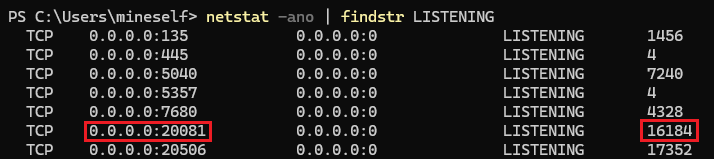
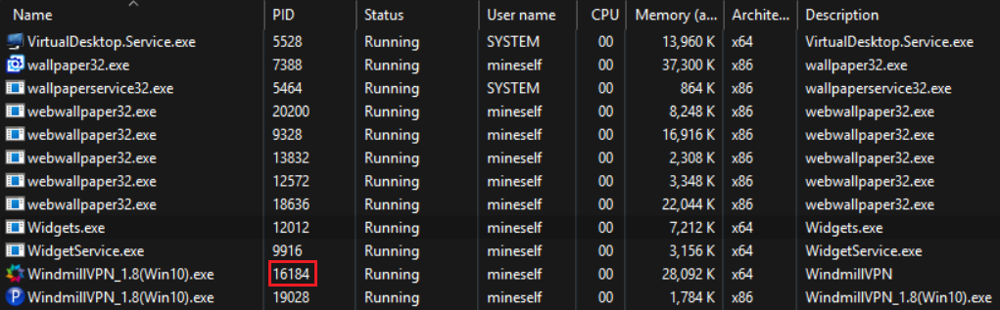
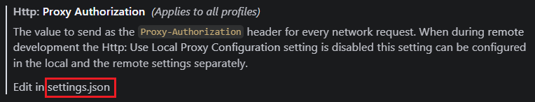

<center><B><BBBG>codex问题</BBBG></B></center>

---
---
---

# 重试5次后才能对话

这是因为需要<B>配置代理</B>，操作：

```
// 当前 PowerShell
$env:HTTP_PROXY="http://127.0.0.1:20081"
$env:HTTPS_PROXY="http://127.0.0.1:20081"
$env:ALL_PROXY="http://127.0.0.1:20081"
$env:NO_PROXY="localhost,127.0.0.1"

// 全局
setx HTTP_PROXY "http://127.0.0.1:20081"
setx HTTPS_PROXY "http://127.0.0.1:20081"
setx ALL_PROXY "http://127.0.0.1:20081"
setx NO_PROXY "localhost,127.0.0.1"
```

<B><BL>问题：如何找到端口</BL></B>
<BL>输入指令：`netstat -ano | findstr LISTENING`


由此即可对应上</BL>

<B><BL>问题：VSCode下使用Codex插件依旧重试</BL></B>
<BL>这是因为VSCode可能不完全走全局设置，在设置中找到Proxy Authorization按如下设置即可</BL>


``` json
"http.proxyAuthorization": null,
"http.proxy": "http://127.0.0.1:20081",
"https.proxy": "http://127.0.0.1:20081",
"http.proxySupport": "override",
"http.proxyStrictSSL": false
```s