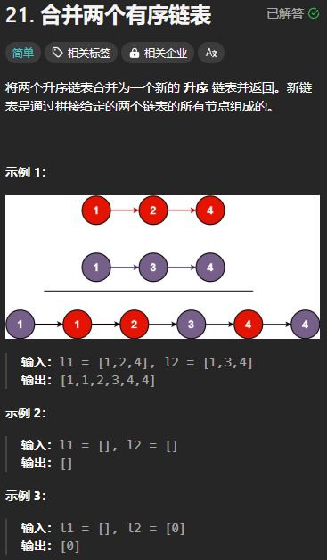
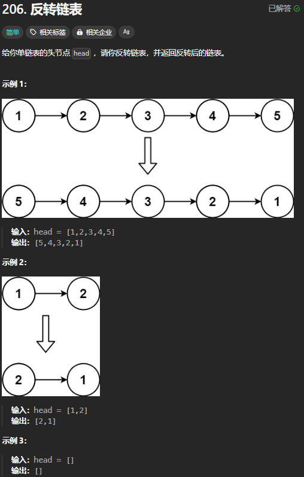
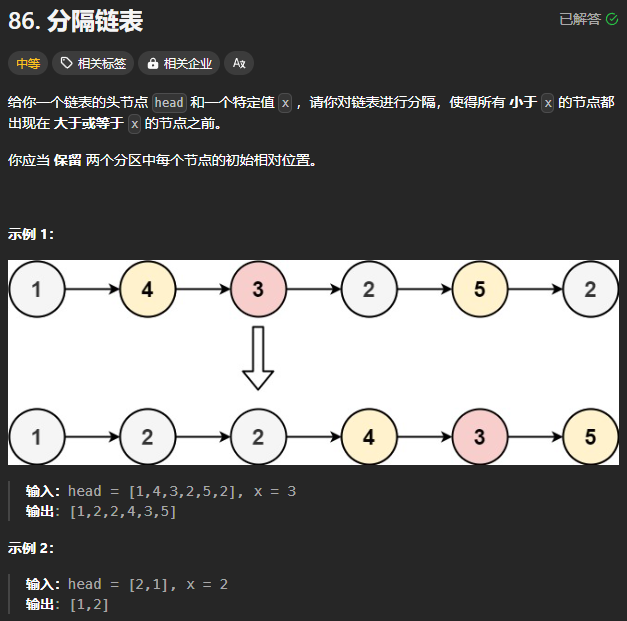
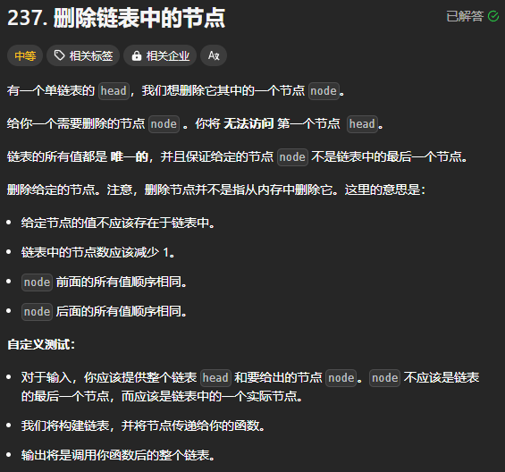
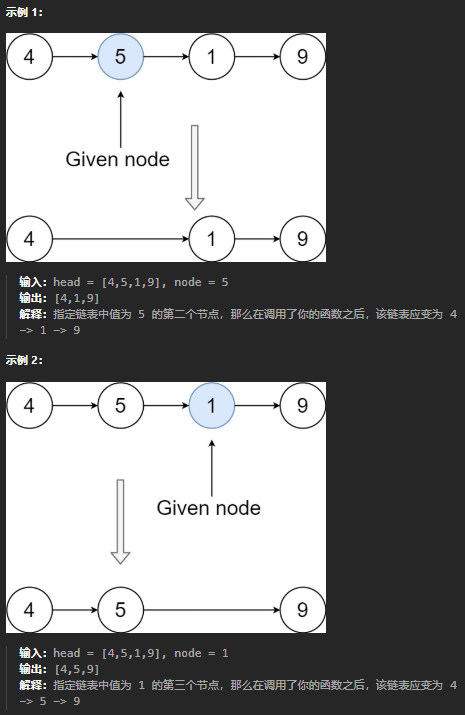
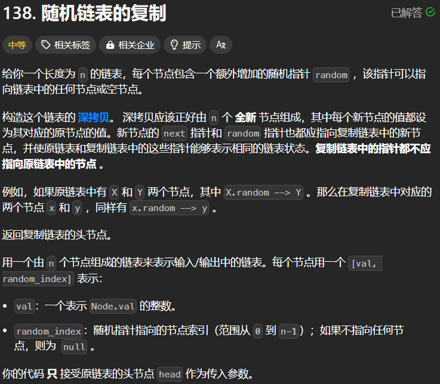
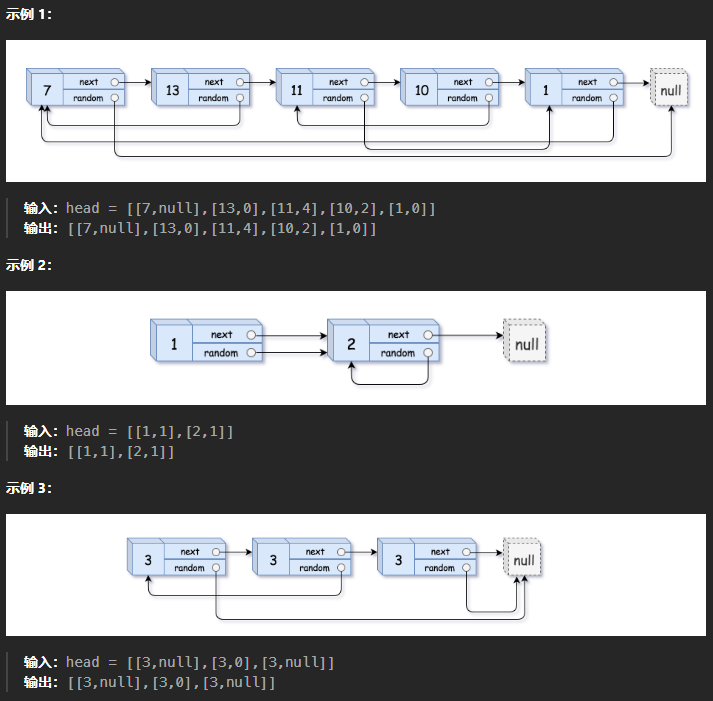
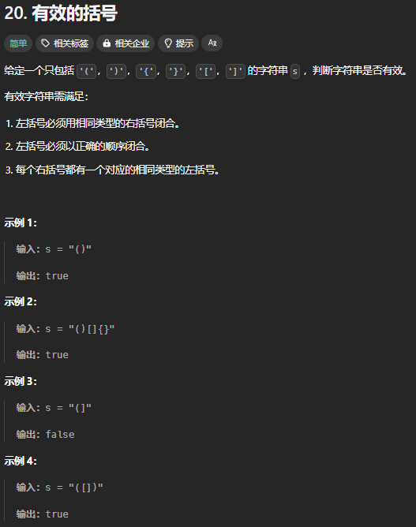
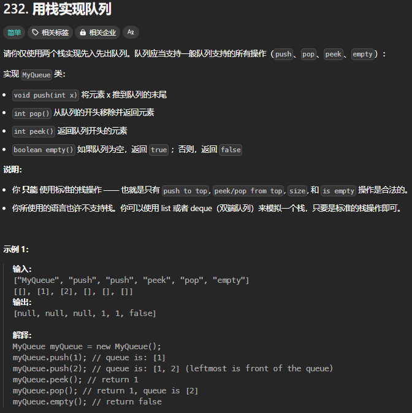
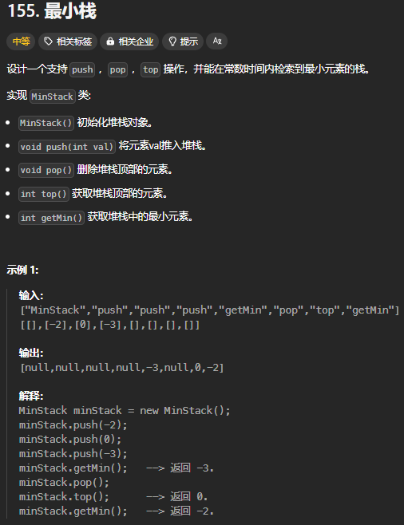

**<center><BBBG>Leetcode分析</BBBG></center>**

<!-- TOC -->

- [关键知识点](#%E5%85%B3%E9%94%AE%E7%9F%A5%E8%AF%86%E7%82%B9)
    - [链表](#%E9%93%BE%E8%A1%A8)
        - [dummy节点](#dummy%E8%8A%82%E7%82%B9)
- [题目](#%E9%A2%98%E7%9B%AE)
    - [合并两个有序链表 21|简单|链表](#%E5%90%88%E5%B9%B6%E4%B8%A4%E4%B8%AA%E6%9C%89%E5%BA%8F%E9%93%BE%E8%A1%A8-21%E7%AE%80%E5%8D%95%E9%93%BE%E8%A1%A8)
    - [反转链表 206|简单|链表](#%E5%8F%8D%E8%BD%AC%E9%93%BE%E8%A1%A8-206%E7%AE%80%E5%8D%95%E9%93%BE%E8%A1%A8)
    - [分割链表86|中等|链表](#%E5%88%86%E5%89%B2%E9%93%BE%E8%A1%A886%E4%B8%AD%E7%AD%89%E9%93%BE%E8%A1%A8)
- [删除链表中的节点 237|中等|链表](#%E5%88%A0%E9%99%A4%E9%93%BE%E8%A1%A8%E4%B8%AD%E7%9A%84%E8%8A%82%E7%82%B9-237%E4%B8%AD%E7%AD%89%E9%93%BE%E8%A1%A8)
- [随机链表的复制 138|中等|链表](#%E9%9A%8F%E6%9C%BA%E9%93%BE%E8%A1%A8%E7%9A%84%E5%A4%8D%E5%88%B6-138%E4%B8%AD%E7%AD%89%E9%93%BE%E8%A1%A8)
- [有效的括号 20|简单|栈](#%E6%9C%89%E6%95%88%E7%9A%84%E6%8B%AC%E5%8F%B7-20%E7%AE%80%E5%8D%95%E6%A0%88)
- [用栈实现队列 232|简单|栈与队列](#%E7%94%A8%E6%A0%88%E5%AE%9E%E7%8E%B0%E9%98%9F%E5%88%97-232%E7%AE%80%E5%8D%95%E6%A0%88%E4%B8%8E%E9%98%9F%E5%88%97)
- [最小栈 155|中等|栈](#%E6%9C%80%E5%B0%8F%E6%A0%88-155%E4%B8%AD%E7%AD%89%E6%A0%88)

<!-- /TOC -->

# 关键知识点

## 链表

### dummy节点

# 题目

## 合并两个有序链表 (21|简单|链表)



没什么好说的，就是<VT><B>两个有序数组合并的链表版</B></VT>

``` csharp
public class Solution {
    public ListNode MergeTwoLists(ListNode list1, ListNode list2) {
        ListNode dummy = new ListNode();
        ListNode temp = dummy;
        
        while(list1 != null && list2 != null)
        {
            if(list1.val <= list2.val)
            {
                temp.next = list1;
                list1 = list1.next;
            }
            else
            {
                temp.next = list2;
                list2 = list2.next;
            }
            temp = temp.next;
        }

        //这里不需要像上面使用while循环，因为是链表可以直接拿后面全部
        if(list1 != null)
        {
            temp.next = list1;
        }
        if(list2 != null)
        {
            temp.next = list2;
        }

        return dummy.next;
    }
}
```

## 反转链表 (206|简单|链表)



``` csharp
public ListNode ReverseList(ListNode head) {
    //为什么要前移一位的理由：
    //1.可能是一个0/1元素的链表，根本没有head.next
    //2.需要将头元素的下一个元素值为null
    ListNode pre = null;
    ListNode cur = head;

    while(cur != null)
    {
        ListNode next = cur.next;
        cur.next = pre;
        pre = cur;
        cur = next;
    }

    return pre;
}
```

## 分割链表(86|中等|链表)



``` csharp
public ListNode Partition(ListNode head, int x) {
    //思路：
    //遍历链表，发现<x的值，在一个新链表中存储，然后前链后，最终拼接一下
    //时间复杂度O(n) 空间复杂度O(n)
    ListNode head2 = new ListNode();
    ListNode temp = head2;

    ListNode dummy = new ListNode();
    dummy.next = head;
    ListNode pre = dummy, cur = head;
    ListNode first = null;

    while(cur != null)
    {
        //仅处理前半(小)部分
        if(cur.val < x)
        {
            pre.next = cur.next;//前链后
            
            temp.next = cur;//新链表链接
            temp = temp.next;

            cur = cur.next;//Tip：只有cur要动，因为pre还是原来那个
        }
        else
        {
            pre = cur;
            cur = cur.next;
        }
    }
    temp.next = dummy.next;//Tip：dummy的后一个节点一定是>=x的第一个节点(说到底是把<x的节点挪走了，那么原链表就是依次排列的>=x的节点)

    return head2.next;
}
```

这是我个人第一时间的思路，有一种类似的思路：

- 我的方法---原链表作为`>=x`链表，遍历时收集`<x`链表，最终拼接
- 遍历收集`<x`链表与`>=x`链表，最终拼接

综合来看，另一种方法会显得更加清晰

## 删除链表中的节点 (237|中等|链表)




``` csharp
public void DeleteNode(ListNode node) {
    //由于访问不到前驱节点，所以：
    //可以观察示例图，只需复制后驱节点的值至当前节点，再改链即可
    ListNode node1 = node;
    ListNode node2 = node1.next;

    node1.val = node2.val;
    node1.next = node2.next;
}
```

这题是一个思路题，观察实例图片会非常容易发现做法：

- 首先我们只能从node开始向后找，这限制了很多
- 其次图片上我们就能发现：既然我们前驱找不到，那么我变成后置就可以了，即复制，跳过后置node改链

## 随机链表的复制 (138|中等|链表)




``` csharp
public Node CopyRandomList(Node head) 
{
    if(head == null) return null;

    Dictionary<Node, Node> dic = new Dictionary<Node, Node>();
    
    //第一次遍历
    //new+val+next
    Node current = head;
    Node newDummy = new Node(0);
    Node newCurrent = newDummy;
    
    while(current != null) 
    {
        Node newNode = new Node(current.val);
        dic[current] = newNode;
        newCurrent.next = newNode;
        
        current = current.next;
        newCurrent = newCurrent.next;
    }

    //第二次遍历
    //random
    current = head;
    newCurrent = newDummy.next;
    
    while(current != null) 
    {
        if(current.random != null)
        {
            newCurrent.random = dic[current.random];
        }
        current = current.next;
        newCurrent = newCurrent.next;
    }

    return newDummy.next;
}
```

这种思路即**Map**，有2种写法：

- 第一次遍历仅创建节点(val)与映射，第二次遍历进行next和random的设置
- 第一次遍历创建节点(val)/next/映射，第二次遍历进行random的设置　　**我的**

两者差距不大，只是第二种方法需要一个dummy节点(或者用ifelse特殊处理第一次)

主要是**细节问题**：

- random可能为null，需要额外判断
- dummy节点的用法
- newDummy需要复制引用，否则找不到头了
- 仅需一个原链表到新链表的Map，不需要额外内容

## 有效的括号 (20|简单|栈)



``` csharp
public bool IsValid(string s) {
    Stack<char> stack = new Stack<char>();
    foreach(char c in s)
    {
        if(c == ')' || c == ']' || c == '}')
        {
            if(stack.Count == 0) return false;

            var top = stack.Peek();
            if((top == '(' && c == ')') || (top == '[' && c == ']') || (top == '{' && c == '}'))
            {
                stack.Pop();
            }
            else
            {
                return false;
            }
        }
        else
        {
            stack.Push(c);
        }
    }
    if(stack.Count == 0) return true;
    else return false;
}
```

## 用栈实现队列 (232|简单|栈与队列)



``` csharp
public class MyQueue {
    private Stack<int> stack1;
    private Stack<int> stack2;

    public MyQueue() {
        stack1 = new Stack<int>();
        stack2 = new Stack<int>();
    }
    
    public void Push(int x) {
        stack1.Push(x);
    }
    
    public int Pop() {
        if(stack2.Count == 0)
        {
            while(stack1.Count != 0)
            {
                stack2.Push(stack1.Pop());
            }
        }
        //可在此处添加防御代码
        return stack2.Pop();
    }
    
    public int Peek() {
        if(stack2.Count == 0)
        {
            while(stack1.Count != 0)
            {
                stack2.Push(stack1.Pop());
            }
        }
        //可在此处添加防御代码
        return stack2.Peek();
    }
    
    public bool Empty() {
        if(stack1.Count == 0 && stack2.Count == 0) return true;
        return false;
    }
}
```

**可以设想一下：**
最一开始我们能做的操作只有`Push()`，假设填入1 2 3，队列此时为`3 2 1`(右是头)，而在我们的栈中则是倒置的(`Pop()`得到的是3)
那么如果一直`Push()`，我们不可能进行其它形式的操作，只可能不断`Push()`
在某刻，我们会进行`Pop()`操作，为了能够得到头而不是尾，由于我们有双栈，所以我们从栈一个一个挪到另一个栈就是**反转操作**，反转完成后则可以正常`Pop()`了
所以：**把stack1用作暂存栈，stack2用作反转栈**即可

## 最小栈 (155|中等|栈)



``` csharp
public class MinStack {
    //思路：
    //使用最小栈，Push时不断获取<=的值，那么Pop时就能同步删除
    private Stack<int> stack;
    private Stack<int> minStack;

    public MinStack() {
        stack = new Stack<int>();
        minStack = new Stack<int>();
    }
    
    public void Push(int val) {
        stack.Push(val);
        if(minStack.Count == 0 || val <= minStack.Peek())
        {
            minStack.Push(val);
        }
    }
    
    public void Pop() {
        //仅需检验stack数量，只要stack不为0，minStack肯定不为0
        if(stack.Count == 0) return;

        int val = stack.Pop();
        if(val == minStack.Peek())
        {
            minStack.Pop();
        }
    }
    
    public int Top() {
        return stack.Peek();
    }
    
    public int GetMin() {
        return minStack.Peek();
    }
}
```

最小栈本质上就是一个栈且额外具有`getMin()`功能，为了获取该功能：
我们必须持续存储最小值，
如果<DRD>只存一个min，是不行的</DRD>，因为`Pop()`之后我们无法直接获取新的min了
我们会发现，**如果Push的值更大是不影响我们的最小值的**，所以我们可以**同步一个只存储小值的栈**
<YL><B>举例：</B>
依次存储1 2 3 4 5，那么无论怎么Pop，最小值都是1
依次存储5 4 3 2 1，那么每Pop一次，最小值都会改变</YL>
