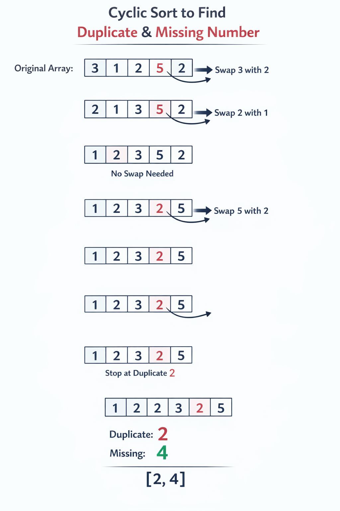

<center><B><BBBG>原地哈希</BBBG></B></center>

---
---
---

# 概述

<B><GN>原地哈希In-place Hashing</GN></B>，顾名思义：
<B><VT>用数组本身作为哈希表</VT></B>
所以可以将空间复杂度优化至<B>O(1)</B>

---
---
---

# 实现方式

原地哈希是一种统称，实际上有几种<B>实现方式</B>：

- <B><GN>负号标记Negative Marking</GN></B>：<VT>用正负标识是否访问过</VT>
- <B><GN>交换法Index Placement</GN></B>：<VT>把元素放到正确位置</VT>
- <B><GN>计数叠加</GN></B>：<VT>在原数组上叠加计数</VT>

---

## 负号标记

<B>核心：将元素作为下标值，如果发现元素值为负，说明该元素至少出现2次</B>
<B>Tip：对于2次情况更加适合，3次及以上只能知道重复</B>
<B>Tip：不能处理元素本身就存在负数情况</B>

<B>模板：</B>

``` csharp
for(int i = 0; i < n; i++)
{
    int index = Math.Abs(nums[i]) - 1; // 通常元素是[1,n]的，所以index需要-1

    if(nums[index] < 0)
    {
        // 重复元素，进行操作(大概是记录)
    }
    else
    {
        nums[index] *= -1;
    }
}
```

<B><DRD>注意：由于元素会被改为负数，所以在作为index使用时必须取Abs</DRD></B>

<B>例题：</B>

- [错误的集合](https://leetcode.cn/problems/set-mismatch/description/)

---

## 交换法

<B>核心：不断交换，使其顺序排序</B>
<B>模板：</B>

``` csharp
for(int i = 0; i < n; i++)
{
    // 如果索引i的值没有放在该放的地方(索引i的值-1处)，交换
    while(nums[nums[i] - 1] != nums[i])
    {
        Swap(nums, i, nums[i] - 1);
    }
}
```



---

## 计数叠加

<B>核心：对于每个元素都通过在对应下标+n的方式进行计数</B>
<B>模板：</B>

``` csharp
// 第一遍：计数叠加
for (int i = 0; i < n; i++)
{
    int index = nums[i] % n; // 可能已经被叠加，需要%n(求原值)
    nums[index] += n;
}

// 第二遍：输出次数
for (int i = 0; i < n; i++)
{
    int count = nums[i] / n; // 出现次数
}
```