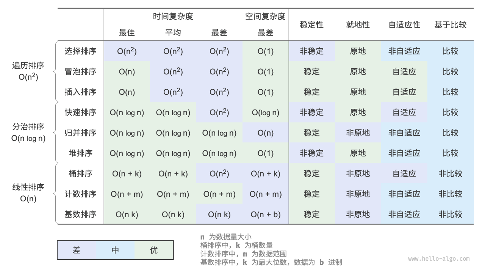

**<center><BBBG>排序算法</BBBG></center>**

<!-- TOC -->

- [遍历排序](#%E9%81%8D%E5%8E%86%E6%8E%92%E5%BA%8F)
  - [选择排序](#%E9%80%89%E6%8B%A9%E6%8E%92%E5%BA%8F)
  - [冒泡排序](#%E5%86%92%E6%B3%A1%E6%8E%92%E5%BA%8F)
  - [插入排序](#%E6%8F%92%E5%85%A5%E6%8E%92%E5%BA%8F)
- [分治排序](#%E5%88%86%E6%B2%BB%E6%8E%92%E5%BA%8F)
  - [希尔排序](#%E5%B8%8C%E5%B0%94%E6%8E%92%E5%BA%8F)
  - [快速排序](#%E5%BF%AB%E9%80%9F%E6%8E%92%E5%BA%8F)
  - [归并排序](#%E5%BD%92%E5%B9%B6%E6%8E%92%E5%BA%8F)
  - [堆排序](#%E5%A0%86%E6%8E%92%E5%BA%8F)
- [线性排序](#%E7%BA%BF%E6%80%A7%E6%8E%92%E5%BA%8F)

<!-- /TOC -->

---
---
---



可以看到排序算法的<B>评估角度</B>有以下几种：

- 时间复杂度
- 空间复杂度
- 稳定性：<VT>是否能排序后保持顺序</VT>
- 就地性：<VT>是否能原地排序，不需要额外空间（一般来说等价于空间复杂度O(1)(特例：快排)）</VT>
- 自适应性：<VT>部分有序对效率是否有影响</VT>
- 基于比较：<VT>是否通过比大小完成</VT>

---
---
---

# 遍历排序

遍历排序共有3种：

- 选择排序 Selection Sort
- 冒泡排序 Bubble Sort
- 插入排序 Insertion Sort

<B>简述：</B>

- 时间复杂度O(n2)，空间复杂度O(1)（即原地排序）
  - <B><VT>速度慢，不适用于大数据量情况</VT></B>
  - <B><VT>原地，空间上具有一定优势</VT></B>
- 稳定性：
  - 有：冒泡 / 插入
  - 无：选择
- 自适应性：
  - 有：插入 > 冒泡
  - 没有：选择

<B>优秀程度：插入 > 冒泡 > 选择<VT>（绝对情况）</VT></B>
  - 由于选择排序既没有稳定性，同时也没有自适应性，是最差的一种
  - 插入和冒泡都具有稳定性，而插入的自适应性会比冒泡好（插入是一个逐步有序的过程），所以插入是更好的选择

---

## 选择排序

优化：

- 如果找到的最小的就是第一个，那么不进行无意义交换
- 额外存储最小值，减少列表访问
- 双向选择：每轮寻找最小和最大，同时交换，减少一半次数

---

## 冒泡排序

优化：

- 如果某一轮没有交换，说明已完成排序，提前退出
- 记录最后交换位置，说明之后都有序，下轮不用扫到末尾
- 双向冒泡（鸡尾酒排序）

---

## 插入排序

<B><DRD>重要：</DRD></B>
`while (j >= 0 && comparer.Compare(current, list[j]) < 0)`
`while (j >= 0 && comparer.Compare(list[j], current) > 0)`
<DRD>两种都是可以的，但是为了稳定性，都没有`=`，而不是`a<b`等价于`b>=a`</DRD>

优化：

- 用shift替代swap
- 某轮如果不用交换，直接continue
  - 不交换情况少了1次赋值，交换情况多了1次Compare
  - 引用Compare通常更耗
  - 偏有序情况也许能加
- 二分查找插入位置
  - 优化了Compare次数（赋值次数没变）
  - cache不友好，分支预测不友好

---
---
---

# 分治排序

分治排序共有4种：

- 希尔排序 Shell Sort
- 快速排序 Quick Sort
- 归并排序 Merge Sort
- 堆排序 Heap Sort

<B>简述：</B>

- 时间复杂度(nlogn)
  - 希尔不完全是O(nlogn)
- 空间复杂度：
  - 希尔(O(1)) = 堆(O(1)) > 快速(O(logn)) > 归并(O(n))
  - 快速同样算是原地排序
- 稳定性：
  - 有：归并
  - 没有：希尔 / 快速 / 堆
- 自适应性：
  - 有：希尔 / 快速
  - 没有：归并 / 堆

<B>优秀程度：快速排序 > 归并排序 ≈ 堆排序 > 希尔排序<VT>（大致来说）</VT></B>

- 整体都比遍历排序要快
- 需要速度：快速
- 需要稳定性：归并
- 需要自适应性：归并 / 堆
- 需要一定速度以及空间复杂度：堆（归并最差）
- 希尔的时间复杂度优化极其有限，非常不稳定，而且并没有到达O(nlogn)级别

---

## 希尔排序

本质：插入排序的优化版，优化局部逆序，从而减轻插入排序的时间
所以：希尔的时间复杂度完全取决于gap的选取

时间复杂度考虑：
外层gap循环需要O(logn)，插入排序需要O(n2)，但是前几次循环数量很少，相比最后一次gap=1可以忽略不记

``` txt
第1轮（gap=n/2）：O(n)
第2轮：O(n)
第3轮：O(n log n)
...
最后一轮（gap=1）：O(n²)
```

优化：

- gap选取：
  - 二分（`gap /= 2`）
  - Knuth（`gap = gap * 3 + 1`寻找，反向`gap = (gap - 1) / 3`排序）
  - Hibbard
  - Sedgewick
  - Tokuda

---

## 快速排序

优化：

- pivot选取
  - 九数取中 > 三数取中 > 随机
- 分区策略
  - Hoare：双指针 + 交换
  - Lomuto：单指针 + 交换
  - HoareLeftPivot：双指针 + 交换（pivot被提前换到左侧）
  - Hole（Hoare变体）：双指针 + 覆盖
  - ThreeWay 三路快排：<VT>用于大量重复元素情况</VT>
- 较小区间递归，尾递归消除，栈空间优化至O(logn)
- Introsort
  - 小区间改插入排序（比如<=16）
  - 递归过深改堆排序

分区策略分析：

- 从好到坏：ThreeWay > Hole = Hoare > HoareLeftPivot = Lomuto
- HoareLeftPivot / Lomuto / Hole 更容易发生退化，时间复杂度会退化为O(n2)
- ThreeWay针对重复情况有优化
- Hole使用shift替代swap，性能更好

<B><VT>重点：pivot选取与分区策略综合影响了是否会退化的情况</VT></B>

<B><BL>问题：HoareLeftPivot与Hoare的区别</BL></B>
<BL>本质上是推进流程的区别：
LeftPivot版本简化了与pivot相等数的交换，这是因为如果直接更改无法推进（全相等）导致死循环
两者本质上区别不大，只是一些条件的更改，但是<B>Hoare更优秀</B>：
<B><VT>Hoare对于有序情况分割更加合理（大致会在中间分割，而LeftPivot在完全有序情况会在最左侧），时间上不容易退化（空间由于尾递归优化都不容易退化）</VT></B></BL>

---

## 归并排序

优化：

- temp数组只创建一个，每次Merge都复用（内部不用清理）
- 有序时不进行Merge
- 小区间改插入排序（比如<=16）

---

## 堆排序

优化：

- `SiftDown()`减少交换次数
- 先选更大的孩子，之后只比较一次
  - 对比max和左右比较，路径更加固定，是一定向胜者孩子的走向
- 小区间改插入排序（比如<=16）

<B><BL>问题：为什么要逐层进行堆化</BL></B>
<BL>堆化的本质是向下沉而非向上浮，假设对堆顶进行堆化，唯一能知道的就是堆顶元素可能被换下去了，堆顶的元素极大概率不是最大数</BL>

<B><BL>问题：为什么叶子节点是`n / 2 - 1`</BL></B>
<BL>左节点公式：`2n + 1`，如果超过末节点说明就是叶子节点，考虑`n / 2`的叶子节点得`n + 1`，超过，所以`n / 2 - 1`是最后一个非叶子节点</BL>

---
---
---

# 线性排序

线性排序有3种：

- 桶排序 Bucket Sort
- 计数排序 Counting Sort
- 基数排序 Radix Sort

简述一下的话：

- 桶排序核心就是将元素根据值的大小划分到不同的桶中，在桶中排序后合并
- 计数排序核心就是统计值出现的次数，根据其值以及次数放置到原数组
- 基数排序核心就是基于计数排序对每一位进行排序操作

考虑各个排序的限制：

- 桶排序---用于体量很大的数据，最好确定分布
- 计数排序---数值区间最好小，数据规模最好大，只能用于非负整数数组(可以转化也行)
- 基数排序---对于每一位来说同计数排序，除此以外，还必须可以表示为固定位数的格式(可以补0)且位数不能过大