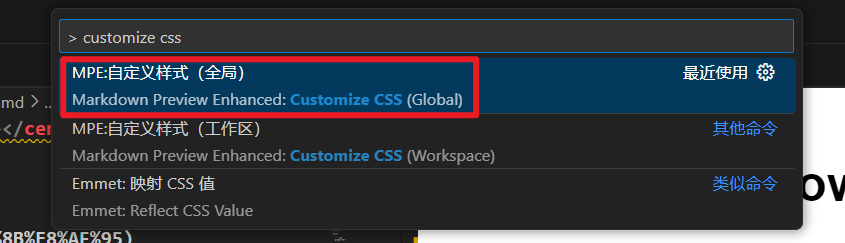
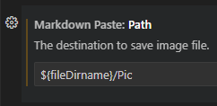
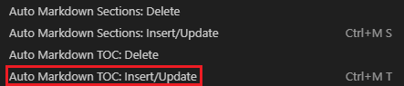
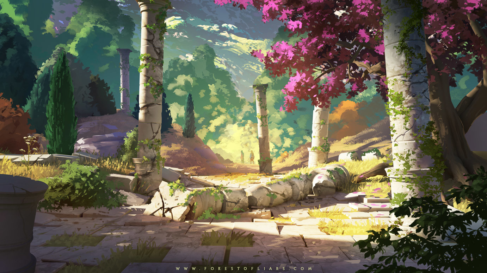

**<center><BBBG>Markdown配置</BBBG></center>**

<!-- TOC -->

- [插件列表](#插件列表)
  - [Markdown Preview Enhanced](#markdown-preview-enhanced)
  - [Markdown Paste](#markdown-paste)
  - [Auto Markdown TOC](#auto-markdown-toc)
- [测试](#测试)
  - [字体测试](#字体测试)
  - [代码测试](#代码测试)
  - [列表测试](#列表测试)
  - [超链接测试](#超链接测试)
  - [图片测试](#图片测试)

<!-- /TOC -->

# 插件列表

- 基础
  - Markdown All in One - Yu Zhang
- 增强
  - Markdown Preview Enhanced - Yiyi Wang
  - Markdown Paste - telesoho
  - Auto Markdown TOC - Hunter Tran

## Markdown Preview Enhanced

Code搜索栏中搜索`> customize css`，然后像在`<style>`中添加字体模板


``` css
.markdown-preview.markdown-preview {

  /* =========================
     个性化字体
     ========================= */
  VT, vt {color: rgb(126, 0, 98);}
  GN, gn {color: rgb(74, 117, 0);}
  RD, rd {color: rgb(255, 0, 0);}
  DRD, drd {color: rgb(131, 0, 15);}
  BL, bl {color: rgb(37, 28, 161);}
  YL, yl {color: rgb(180, 121, 0);}

  BG, bg {font-size:1.25em;}
  BBG, bbg {font-size:1.5em;}
  BBBG, bbbg {font-size:2em;}
  T, t {font-size:2.5em;}

  /* =========================
     代码块优化
     ========================= */

  pre {
    max-height: 515px;
    overflow: auto;

    padding: 12px 14px;
    border-radius: 6px;

    background: #f7f7f7;
    border: 1px solid #e2e2e2;

    margin-top: 8px;
    margin-bottom: 8px;
  }

  /* 连续代码块压缩间距 */
  pre + pre {
    margin-top: -6px;
  }

  /* 段落文字紧跟代码块时压缩间距 */
  p + pre,
  h1 + pre,
  h2 + pre,
  h3 + pre,
  h4 + pre,
  h5 + pre,
  h6 + pre {
      margin-top: -10px;
  }

  /* 代码字体 */
  code {
    font-family: Consolas, Monaco, monospace;
    font-size: 0.95em;
  }

  /* =========================
     列表优化
     ========================= */

  ul, ol {
    margin-top: -6px;
    margin-bottom: 4px;
    padding-left: 1.6em;
  }

  /* 避免影响多级列表 */
  ul ul, ol ol {
    margin-top: 0px;
    margin-bottom: 0px;
  }

  li {
    margin-bottom: 2px;
  }

  /* 列表中的代码块 */
  li pre {
    margin-top: 6px;
    margin-bottom: 6px;
  }

  /* =========================
     标题样式
     ========================= */

  h1, h2, h3, h4, h5, h6 {
    color: #0857a5;
    margin-top: 22px;
    margin-bottom: 8px;
    font-weight: 600;
  }

  h1 { font-size: 2.0em; }
  h2 { font-size: 1.5em; }
  h3 { font-size: 1.25em; }
  h4 { font-size: 1.2em; }
  h5 { font-size: 1.15em; }
  h6 { font-size: 1.1em; }

  /* =========================
     表格优化
     ========================= */

  table {
    border-collapse: collapse;
    margin-top: 10px;
    margin-bottom: 10px;
    font-size: 0.95em;
  }

  th, td {
    border: 1px solid #ddd;
    padding: 6px 10px;
  }

  th {
    background: #f2f2f2;
    font-weight: 600;
  }

  tr:nth-child(even) {
    background: #fafafa;
  }

  /* =========================
     引用块
     ========================= */

  blockquote {
    border-left: 4px solid #4a90e2;
    padding: 6px 12px;
    margin: 8px 0;
    background: #f8fbff;
    color: #444;
  }

  /* =========================
     分割线
     ========================= */

  hr {
    border: none;
    border-top: 1px solid #ddd;
    margin: 20px 0;
  }

}
```

可以看到名字叫`style.less`，位置就在`C:\Users\Administrator\.crossnote\style.less`

## Markdown Paste

**配置方式：**
在设置中修改Path

然后使用<B>Ctrl+Alt+V</B>进行粘贴即可(得先复制，用Snipaste会很好用)

## Auto Markdown TOC

**使用方式：**
右键选择即可自动生成


---
---
---

<!-- 标题开头不能是数字字符，否则无法使用TOC -->
<!-- 但是可以通过手动将某个改为如[1.xxx](#1.xxx)的形式，保存后即可使用 -->
# 测试

## 字体测试

**加粗** | *斜体* | ***斜体加粗***  

HTML语法：  
这是<font color="red">红色</font> | 这是<font color="purple">紫色</font> | 这是<font color="green">绿色</font>  

CSS语法：　　**<VT>我通常会使用该方法</VT>**
这是<VT>注释色</VT> | 这是<RD>警告色</RD> | 这是<DRD>注意色</DRD> | 这是<GN>名词色</GN> | 这是<YL>例子色</YL> | 这是<BL>问题色</BL>

## 代码测试

代码句：`print("Hello")`  

---

1.Lua代码

``` lua
-- 输出"Hello"
function printHello()
    print("Hello")
end
```

2.C#代码

``` CSharp
private void PrintHello()
{
    Console.WriteLine("Hello");
}
```

## 列表测试

- first
  
    ``` lua
    print("OK")
    ```

- second
  
    > ok

- third

<BR>

1. first
2. second
3. third

## 超链接测试

这是 **[BILIBILI](https://www.bilibili.com "备注:视频网站")** 网站
这也是<https://www.bilibili.com>

## 图片测试

{width=200 height=100}


