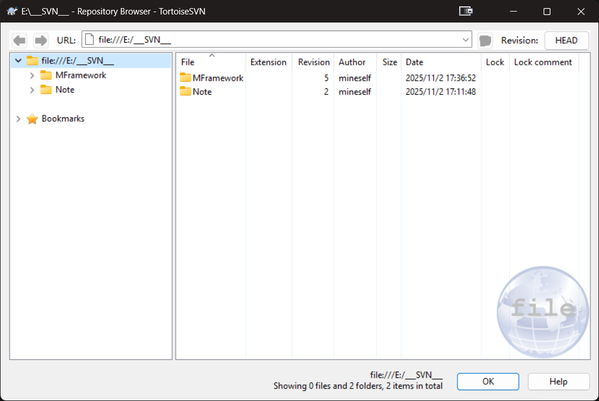
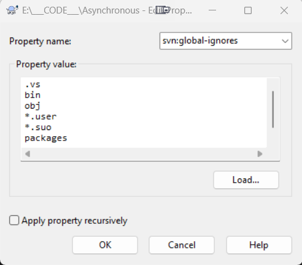

**<center><BBBG>TortoiseSVN使用</BBBG></center>**

最常见的2种版本管理工具应该就是Git以及TortoiseSVN
个人目前比较熟悉TortoiseSVN，那么就记录一下个人使用方式

# 本地情况

既然是个人使用，那么存储在本地必然是最合适的
所需步骤并不多：

- 创建一个文件夹
- 在文件夹内右键TortoiseSVN->Create repository here，OK即可

以上已经创建完毕，可通过右键TortoiseSVN->Repo-browser进行查看：


- URL中显示的路径就是创建仓库的路径
- 通过右键Create folder即可创建子目录，这是一次commit

<BR>

**<BL>问题：为什么Edit log message操作不被允许</BL>**
<BL>默认行为中，该操作是被禁止的，所以需要修改相应.bat/.tmpl(linux情况)文件
解决方法为：打开该仓库hooks文件夹，添加pre-revprop-change.bat：</BL>

``` bat
setlocal
set REPOS=%1
set REV=%2
set USER=%3
set PROPNAME=%4
set ACTION=%5
if not "%ACTION%"=="M" goto refuse
if not "%PROPNAME%"=="svn:log" goto refuse
goto OK
:refuse
echo Cann't set %PROPNAME%/%ACTION%, only svn:log is allowed 1>&2
endlocal
exit 1
:OK
endlocal
exit 0
```

**<BL>问题：添加ignore**
在Git中，通过.ignore文件即可忽略，SVN有所不同但也很简单：
在需要的svn项目中右键TortoiseSVN->Properties，New->Other，Property name选择svn:ignore或svn:global-ignores，填入忽略列表


**ignore与global-ignores的区别如下：**

- ignore：处理目录特定的忽略需求
- global-ignores：处理项目范围内通用的忽略模式

**Apply property recursively**作用：<B><VT>开启属性递归(可作用于子文件夹)</VT></B>

**<VT>一般选择：ignore+开启Apply property recursively</VT>**

**注意：**
**<DRD>此时如果已经提交过内容且存在文件夹，发现有修改是正常的(针对递归情况)，因为是文件夹规则发生变动</DRD>**


**Unity忽略内容**

``` txt
Library
Temp
Obj
Build
Builds
Logs
UserSettings
.utmp
.vs
.gradle
ExportedObj
.consulo
*.csproj
*.unityproj
*.sln
*.suo
*.tmp
*.user
*.userprefs
*.pidb
*.booproj
*.svd
*.pdb
*.mdb
*.opendb
*.VC.db
*.DotSettings.user
*.blend1
*.blend1.meta
*.pidb.meta
*.pdb.meta
*.mdb.meta
sysinfo.txt
mono_crash.*
*.apk
*.aab
*.app
*.unitypackage
*.unitypackage.meta
*.log
```