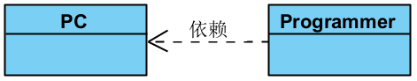
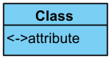
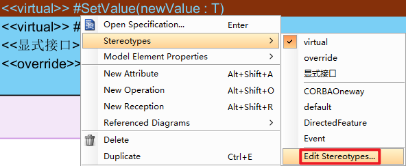

**
<BBBG>UML基础</BBBG>
**

<!-- TOC -->

- [UML是什么](#uml是什么)
- [类图](#类图)
  - [关系](#关系)
  - [类](#类)
  - [使用](#使用)
    - [界面操作简述](#界面操作简述)
    - [实例:Singleton Pattern](#实例singleton-pattern)
    - [规范制定](#规范制定)
    - [功能备注](#功能备注)
  - [实践](#实践)
    - [完整版：QFramework](#完整版qframework)
      - [简单总结](#简单总结)

<!-- /TOC -->

# UML是什么

UML即<B><GN>统一建模语言Unified Model Language</GN></B>，是一种<B><VT>用图表的方式表示某一内容</VT></B>的方式
UML其实有**很多种**图的形式，但是目前无需关心太多，我所关注的是<B><GN>类图Class Diagram</GN></B>

# 类图

我们如果去菜鸟教程查看，通常会遇到这种形式的图：

这就是**类图**

## 关系

类图对象与对象之间有不同的关系，具体如下：

- 泛化Generalization
- 实现Realization
- 关联Association
  - 聚合Aggregation
  - 组合Composition
- 依赖Dependency

 

<B><GN>泛化</GN></B>指的是**派生关系**，要注意箭头关系，是<B><VT>子类指向父类</VT></B>

<B><GN>实现</GN></B>指的是**接口的实现**，同样要注意箭头关系，是<B><VT>类指向接口(某种意义上也是子类指向父类)</VT></B>

<B><GN>关联</GN></B>本质上指的是**两者具有联系**
关联本身也是一种关系，<B><VT>仅表示两者具有关联</VT></B>，如下：

**<BL>问题：如上图所示，并没有表现出是谁吃谁</BL>**
<BL>虽然上图中没有体现，但是如果添加函数后即可明确，显然Cat内肯定会有一个`Eat()`</BL>
关联**细分**有两种情况，即组合聚合：

- <B><GN>组合</GN></B>
  组合指的是**强关联**，父节点的存亡会影响子节点(父Destroy子也会Destroy)
  
  可以看到是<B><VT>子指向父</VT></B>
- <B><GN>聚合</GN></B>
  
  聚合指的是**弱关联**，父节点的存亡不影响子节点

  可以看到同样是<B><VT>子指向父</VT></B>

对于关联的两种情况，都可以**标注更多信息**，即<B><GN>多重性Multiplicity</GN></B>：

<YL><B>对于这个例子来说：</B>
游客中心由大厅和卫生间组成，大厅只存在1个，而卫生间至少1个(>=1)
反过来说，大厅只可能属于某一个游客中心的(不存在公用可能)，卫生间也是如此</YL>

<B><GN>依赖</GN></B>即**一种依赖关系**，是<B><VT>依赖者指向依赖物</VT></B>　　<VT>简单来说就是：<B>"用到"</B></VT>

从以上几种关系中我们能够得出一个**结论**：
**<VT>箭头的方向永远是子指向父</VT>**

## 类

对于类图来说，最关键的当然是**类**，那么<B><VT>类中到底有什么我们应该在图中表示出来</VT></B>，就像这样：

可以看到类被分成了**3个部分**，从上到下依次为：

- **类名**
- **属性**Attributes/Fields/Variables/Properties
  这里的属性包括了字段与属性
- **函数**Methods/Functions/Operations

 

<B><GN>可见性Visibility</GN></B>：
可以看到属性与函数的开头有一个符号，这代表着其可见性，其实就是访问修饰符：

- `+`：public
- `-`：private
- `#`：protected
- `~`：internal <VT>(一般被称为package/default，应该是Java的说法)</VT>
- 底线：static <VT>(就是在字的底下有条线)</VT>

**写法：**

- **类名**
  对于类来说，并不会使用符号来代表它的可见性，但是会<B><VT>使用斜体或`<< >>`表示抽象abstract</VT></B>
- **属性**
  属性的写法很固定，即：`符号`+`名称`+`:`+`类型`
- **函数**
  函数有2种写法：
  - 不加声明，即：`符号`+`函数名()`
  - 加声明，即：`符号`+`函数名(形参:类型):类型`
  通常函数<B><VT>选用不加声明形式</VT></B>，添加过于复杂且意义不大
  当然，`+call()`/`+call():void`/`+call(mp:MobilePhone):void`甚至`+call(mp)`/`+call(MobilePhone)`，<B><VT>只要信息适度即可</VT></B>

**<BL>问题：存在双向箭头吗</BL>**
<BL>理论上当然是存在的，但如果出现了双向箭头，这必然意味着<B>耦合，需要从代码层面上避免</B></BL>

**<BL>问题：关系箭头备注的方向性</BL>**
<BL>通常来说，应该是<B><VT>父到子的关系，</VT></B><YL><B>如：</B>Order组合了OrderDetail，那么备注"has a"就意味着"Order has a OrderDetail"</YL></BL>

## 使用

在这里我选择的是<B><GN>Visual Paradigm</GN></B>进行绘制　　<VT>编写版本V17.2社区版</VT>
<B>写在前面：<VT>VP具有大量有助于提升效率的方法，但都特别麻烦且资料非常少，所以这里我只能尽量往这种方法靠，总体来说只需图呈现正确即可</VT></B>

### 界面操作简述

刚上手软件，说实话会看的比较蒙，因为功能多且复杂，但是基本按钮都点过之后就能大概了解了

**1.项目的创建**

可以看到一打开软件标题中显示的是`untitled`，此时是未创建状态，点击New即可进行创建

填入Name/Data type set即可，这里比较重要的是**Data type set**，我们需要选择相应的语言，这决定了<B><VT>后续类型</VT></B><YL>(如：C#是string，Java是String)</YL>

**2.图的添加**
此时项目本身已经创建完毕，但是这只是一个空项目没有图，所以需要添加图
有2种方式：

- 可以看到**初始界面**有一**快捷创建方式**，使用即可
  对于UML类图，依次选择UML->Class Diagram->Blank->输名字即可
- 标准流程为点击上侧菜单View按钮，在Panes种找到**Diagram Navigator**调出
  
  对于UML类图，选择Class Diagram创建一个Diagram即可(两种都可以，New Class Diagram为直接创建(Blank没名字)，New Diagram为完整创建)
  

可以发现<B><VT>快捷创建本质上其实就是方便地在Diagram Navigator中创建</VT></B>了而已
由上述内容我们也能发现：
**<VT>View的Panes其实就是一般软件中的Windows</VT>**

**3.图的绘制**
之后我们就得到到一个Blank类图，左侧都是绘制工具，我们也能从中找到许多熟悉的东西：

点击右侧黑色小三角即可展开细分，如Association下有细分Aggergation/Composition

<B>快捷方式：双击</B>，功能为<B><VT>多次创建不会回到Cursor状态</VT></B>

可以看到该状态下存在一个黄色小点

**具体绘制**的话**多尝试**即可

### 实例:Singleton Pattern

这是官方的一个例子，**链接**如下：
[Singleton Pattern Tutorial](https://www.visual-paradigm.com/cn/tutorials/singletonpattern.jsp)

这里挑**重点**说：

- **由于`instance`变量是static的，所以需要加上底线**，方法如下：
  右键字段->Model Element Properties->Scope->classifier
  
  同时我们也能看到其它相应的设置：

  - Multiplicity：数量信息
  - Visibility：可见性
  - Scope：域(`static`/非`static`)
  - **Type Modifier**：类型修饰符，即<B><VT>额外的类型数据</VT></B>

    - `*`：指针
    - `&`：引用
    - `[]`：数组
    - `<>`：泛型
    - Other：自行扩充

  - **Setter/Getter**：Get/Set方法或属性<VT>(属性就是一种Get/Set方法)</VT>
    <B><VT>默认情况下没有表示</VT></B>，**显示方法**：

    - 类图空白处右键->Presentation Options->Attribute Display Options->Show Getter Setter Properties
      <VT>`<`代表Getter，`>`代表Setter</VT>
    - 直接class下右键->Add->Attribute with Getter and Setter
      

    由此我们也能知道一件事：<B><VT>在Presentation Options有大量表示上的设置</VT></B>
  
  **<BL>问题：const怎么表示</BL>**
  <BL>可以看到有static，但是没有const，那么我们有2种选择：<B>直接在类型上添加(`const int`)/借助Type Modeifer添加(后缀`const`)</B></BL>

- 右键class我们可以看到一个选项为<B><GN>Stereotypes</GN></B>，大致含义就是<B><VT>模板类</VT></B>
  但是观察下来应该是需要<B><DRD>订阅才能使用</DRD></B>，而且具体来说<B><DRD>过于复杂</DRD></B>
  这里**简单讲述**一下其**功能**：
  为单例类设置为`<<PTN Members Creatable>>`，之后就可以将类图定义为Design Pattern，再开一个类图，应用该Design Pattern，添加类该有的字段与函数即可
  <VT>可以看到核心就是<B>类型全被替换</B>了，以及<B>instance字段与`getInstance()`函数自动添加</B>了</VT>

除了以上的内容，我们可以自行尝试一下并扩充：

- 对于**class**来说，同样具有**Model Element Properties**，具体如下：
  
  - Visibility：可见性
  - Abstract：抽象类
  - Leaf：叶子类(即sealed类，没有子类)
  - Root：根类(没有父类)
  - Final Specialization：等价于Leaf(更规范，也更难看懂)
  - Business Model：业务类(如商品就是业务类，而日志就是非业务类(技术类))

### 规范制定

根据以上分析内容，其实可以发现缺少了许多内容，比如说`override`/`virtual`等关键字根本没有，那么这里简单制定一下对特殊情况的处理：

- **基础**
  默认自带的有些比较特殊，如下：

  - 底线：`static`
  - 斜体：`abstract`
  - 没有表现：`Getter`/`Setter`

- **后缀型Type Modifier**
  Type Modifier前面提到过，可能用到的情况如下：

  - 数组`[]`
  - 泛型`<>`
    - 无约束：`<T>`
    - 有约束：`<约束类型>`
    **<DRD>注意：编写时应该先不处理Type Modifier，然后通过选中Enter进行修改，否则会附着到Return Type</DRD>**

- **前缀型Stereotypes**
  Stereotypes前面同样提到过，可能是一个模板，但我们也可以添加，添加后在最前面就会出现`<<XXX>>`
  具体添加如下内容：

  - **Attribute**
    - `readonly`
    - `const`
  - **Operation**
    - `virtual`
    - `override`
    - `显式接口`(就是如`IXXX.函数名`的接口显式实现)
  
  要注意的是<B><VT>默认没有</VT></B>这些内容的，所以需要**自行添加**：
  

### 功能备注

**这里稍微记录一下我发现的VP里的功能：**

- 当类实现了某接口时，对类右键->Related Elements->Realize all Interfaces即可实现接口
- 使用`Ctrl+C` `Ctrl+V`复制会导致关联，想要无关联复制的话可以通过右键Duplicate复制
- 对于主从关系(`M`/`a`)，如果需要将`a`升格为`M`，可以通过对`a`类右键->Selection->Set as Master View设置
- 如果不想点击到背景的Rectangle，可以在任意处右键Layers添加图层，然后选中后设置图层即可

## 实践

### 完整版：QFramework

在`QFramework框架分析`中，我使用了最完整，即把所有类的字段函数的完整形式都填入

**个人认为：<DRD>效果不佳</DRD>**
<VT>QFramework的框架本质上是由一系列规则接口组成的，所以需要大量的图去处理规则</VT>
**最麻烦**的地方是：
`IXXX`接口会实现各种`ICanXXX`接口，但是如果放在一张图中，不可能看得清楚，所以总共拆成共7张图(合并了1张)完成　　　　<B><GN>完成后确实清晰</GN>但<DRD>用时过长</DRD></B>

**<DRD>重要：将所有声明完整展示并不有效</DRD>**

就以最核心的`IArchitecture`为例，我并不需要知道`RegisterSystem()`需要一个ISystem类型的system，知道有这个操作足以，如果真的关心**看源码**的即可，同样的`SendCommand()`的重载也没什么必要，<B><VT>个人认为更多的需要的是一点Note来快速提示类/接口的核心</VT></B>

#### 简单总结

个人认为完整版不算是一种有意义的记录方式，主要是因为非常耗时，当然，如果时间多的话这么记录还是可行的