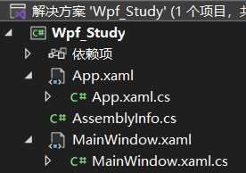
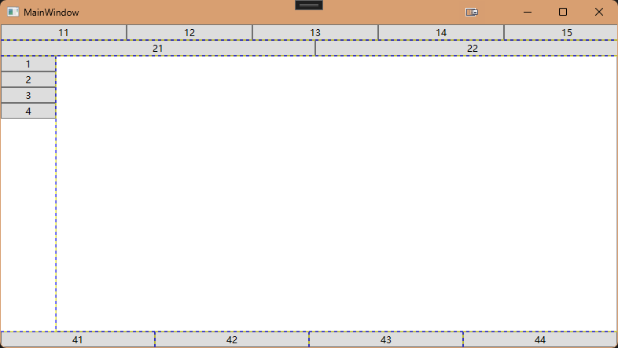
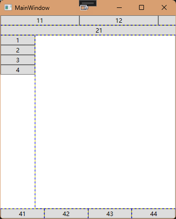
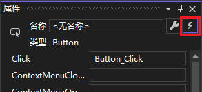

**<center><BBBG>WPF简述</BBBG></center>**

这里只是简单做一下WPF的笔记

对于一个新创建的项目，**解决方案**通常是这样的：

这里的控制源是App.xaml，其代码为：

``` xaml
<Application x:Class="Wpf_Study.App"
             xmlns="http://schemas.microsoft.com/winfx/2006/xaml/presentation"
             xmlns:x="http://schemas.microsoft.com/winfx/2006/xaml"
             xmlns:local="clr-namespace:Wpf_Study"
             StartupUri="MainWindow.xaml">
    <Application.Resources>
         
    </Application.Resources>
</Application>

```

这里需要知道：

- xmlns其实就是XML的namespace，是需要引用的
- `:x`可以认为是别名，如`x:Class`就用到了，而`xmlns`这种没有的就可直接使用，如`<Window>...</Window>`
- StartupUri将对应需要启动的内容

<BR>

而需要显示的MainWindow.xaml其实是非常类似的：

``` xaml
<Window x:Class="Wpf_Study.MainWindow"
        xmlns="http://schemas.microsoft.com/winfx/2006/xaml/presentation"
        xmlns:x="http://schemas.microsoft.com/winfx/2006/xaml"
        xmlns:d="http://schemas.microsoft.com/expression/blend/2008"
        xmlns:mc="http://schemas.openxmlformats.org/markup-compatibility/2006"
        xmlns:local="clr-namespace:Wpf_Study"
        mc:Ignorable="d"
        Title="MainWindow" Height="450" Width="800">
    <Grid>

    </Grid>
</Window>
```

可以看到只是多了一些内容，以及需要设置的Title/Height/Width
需要知道的一点：<B><VT>`<Grid>...</Grid>`之间的内容可以认为是客户区，即窗体部分，所以标题所对应的Title并不在此范围内</VT></B>
如果我们需要添加一个`<Window>`，那么会添加到`<Grid>`之中，当然：<B><VT>`<Grid>`不是必要的，可直接添加控件，但只能添加一个，如果添加多个则会报错：属性"Content"只能设置一次</VT></B>
`<Grid>`被称为<B><GN>布局</GN></B>，有几种布局(不全)：

- `<Grid>`：表格布局
- `<StackPanel>`：栈式布局

而`<Button>`之类的则被称为<B><GN>控件</GN></B>

**<YL>举例：</YL>**

``` xaml
<Window x:Class="Wpf_Study.MainWindow"
        xmlns="http://schemas.microsoft.com/winfx/2006/xaml/presentation"
        xmlns:x="http://schemas.microsoft.com/winfx/2006/xaml"
        xmlns:d="http://schemas.microsoft.com/expression/blend/2008"
        xmlns:mc="http://schemas.openxmlformats.org/markup-compatibility/2006"
        xmlns:local="clr-namespace:Wpf_Study"
        mc:Ignorable="d"
        Title="MainWindow" Height="450" Width="800">
    <Grid ShowGridLines="True">
        <Grid.RowDefinitions>
            <RowDefinition Height="20" />
            <RowDefinition Height="20" />
            <RowDefinition/>
            <RowDefinition Height="20" />
        </Grid.RowDefinitions>

        <StackPanel Grid.Row="0" Grid.Column="0" Orientation="Horizontal">
            <Button Height="20" Width="160" Content="11"/>
            <Button Height="20" Width="160" Content="12"/>
            <Button Height="20" Width="160" Content="13"/>
            <Button Height="20" Width="160" Content="14"/>
            <Button Height="20" Width="160" Content="15"/>
        </StackPanel>

        <StackPanel Grid.Row="1" Grid.Column="0" Orientation="Horizontal">
            <Button Height="20" Width="400" Content="21"/>
            <Button Height="20" Width="400" Content="22"/>
        </StackPanel>

        <Grid ShowGridLines="True" Grid.Row="2" Grid.Column="0">
            <Grid.ColumnDefinitions>
                <ColumnDefinition Width="70" />
                <ColumnDefinition />
            </Grid.ColumnDefinitions>

            <StackPanel>
                <Button Height="20" Content="1"/>
                <Button Height="20" Content="2"/>
                <Button Height="20" Content="3"/>
                <Button Height="20" Content="4"/>
            </StackPanel>

            <TextBox Grid.Row="0" Grid.Column="1" TextWrapping="Wrap"/>
        </Grid>

        <Grid ShowGridLines="True" Grid.Row="3" Grid.Column="0">
            <Grid.ColumnDefinitions>
                <ColumnDefinition />
                <ColumnDefinition />
                <ColumnDefinition />
                <ColumnDefinition />
            </Grid.ColumnDefinitions>

            <Button Content="41" Grid.Column="0"/>
            <Button Content="42" Grid.Column="1"/>
            <Button Content="43" Grid.Column="2"/>
            <Button Content="44" Grid.Column="3"/>
        </Grid>
    </Grid>
</Window>
```

<YL>效果如下：</YL>


简单讲述一下**注意点**：

- `<Grid>`可嵌套，那么在某一行或某一列时可进行细分
- 对于`<Grid.RowDefinitions>`/`<Grid.ColumnDefinitions>`来说，可填写`Height`/`Width`，其中：
  - **<VT>Tip：`1*`代表着一份</VT>**
  - 没有填写则会分配`1*`，也可指定具体数值/`x*`/`"AUTO"`
- 可以看到<B><VT>`<StackPanel>`形成的是非动态的，而`<Grid>`结合Definitions可形成动态的</VT></B>，将窗口大小改变即可发现：
  

<BR>

<B><GN>样式</GN></B>也是比较关键的内容，**一般写法**可能如下：

``` xaml
<Window>
    <Window.Resources>
        <Style x:Key = "Style1" TargetType="Button">
            <Setter Property="Background" Value="Green"/>
            <Setter Property="FontSize" Value="20"/>
            <Setter Property="Height" Value="50"/>
            <Setter Property="Width" Value="500"/>
        </Style>
    </Window.Resources>
    ...
</Window>
```

使用则可以通过`Style = "{StaticResource Style1}"`来指定控件Style
除了StaticResource还有DynamicResource，也就是可以<VT>自动进行切换</VT>的形式
还有一种**默认应用+额外的写法**：

``` xaml
<Window>
    <Window.Resources>
        <!--默认部分-->
        <Style TargetType="Button">
            <Setter Property="Background" Value="Green"/>
        </Style>
        <!--额外部分-->
        <Style x:Key="Style1" TargetType="Button" BasedOn="{StaticResource {x:Type Button}}">
            <Setter Property="Background" Value="Red"/>
            <Setter Property="FontSize" Value="20"/>
            <Setter Property="Height" Value="50"/>
            <Setter Property="Width" Value="500"/>
        </Style>
    </Window.Resources>
    ...
</Window>
```

上述2种都是在该xaml中进行创建的，显然样式只能应用于当前xaml窗口，而且会与布局设置混在一起
可以通过<B><GN>资源字典</GN></B>的方式进行创建，**对项目右键添加**即可，内容大致如下：

``` xaml
<ResourceDictionary xmlns="http://schemas.microsoft.com/winfx/2006/xaml/presentation"
                    xmlns:x="http://schemas.microsoft.com/winfx/2006/xaml">
    <Style TargetType="Button">
        <Setter Property="Background" Value="Green"/>
    </Style>
</ResourceDictionary>
```

其实很简单，对于使用，则需要**在核心文件App.xaml中进行全局添加**：

``` xaml
<Application x:Class="Wpf_Study.App"
             xmlns="http://schemas.microsoft.com/winfx/2006/xaml/presentation"
             xmlns:x="http://schemas.microsoft.com/winfx/2006/xaml"
             xmlns:local="clr-namespace:Wpf_Study"
             StartupUri="MainWindow.xaml">
    <Application.Resources>
        <ResourceDictionary>
            <ResourceDictionary.MergedDictionaries>
                <ResourceDictionary Source="/Style.xaml"/>
            </ResourceDictionary.MergedDictionaries>
        </ResourceDictionary>
    </Application.Resources>
</Application>
```

添加后即可在界面中看到效果，对于StaticResource也可直接使用

<BR>

对于控件来说，还具有<B><GN>模板</GN></B>这种设置，大致如下：

``` xaml
<Button Width="300" Height="100" Content="自定义按钮" Background="#0078d4" FontSize="50" Foreground="White">
    <Button.Template>
        <ControlTemplate TargetType="{x:Type Button}">
            <Border BorderBrush="Black" BorderThickness="4" CornerRadius="20">
                <!--关键：继承(简单理解的话)-->
                <ContentPresenter HorizontalAlignment="Center" VerticalAlignment="Center"/>
            </Border>
        </ControlTemplate>
    </Button.Template>
</Button>
```

但是更好的写法应该是这样：

``` xaml
<Button Width="300" Height="100" Content="自定义按钮" Background="#0078d4" FontSize="50" Foreground="White" BorderBrush="Black" BorderThickness="4">
    <Button.Template>
        <ControlTemplate TargetType="{x:Type Button}">
            <Border x:Name="Border" Background="{TemplateBinding Background}" BorderBrush="{TemplateBinding BorderBrush}" BorderThickness="{TemplateBinding BorderThickness}" CornerRadius="20">
                <TextBlock x:Name="Text" Text="{TemplateBinding Content}" HorizontalAlignment="Center" VerticalAlignment="Center"/>
            </Border>
            
            <ControlTemplate.Triggers>
                <Trigger Property="IsMouseOver" Value="True">
                    <Setter TargetName="Border" Property="Background" Value="Black"/>
                    <Setter TargetName="Text" Property="FontSize" Value="10"/>
                </Trigger>
                <Trigger Property="IsPressed" Value="True">
                    <Setter TargetName="Border" Property="Background" Value="White"/>
                </Trigger>
            </ControlTemplate.Triggers>
        </ControlTemplate>
    </Button.Template>
</Button>
```

可以看到这里用了`{TemplateBinding Background}`以进行对Button属性的对应，其中CornerRadius无法设置，这是因为Button中并无该属性
同时`<ControlTemplate.Triggers>`进行了按钮事件的显示设置，在对应情况发生时则对相应控件进行设置

<B><GN>事件</GN></B>是控件中相当重要的内容，其实相当简单：
比如说Button的点击事件，添加`Click=`即可，选择创建则会在xaml.cs文件中生成相应的事件，编写C#代码即可，访问控件只需添加`x:Name`即可访问相应控件
也许我们会不清楚**事件有哪些**，比较好的查看方式是点击相应控件查看其属性：

同时输入即创建，也很方便

<B><GN>绑定</GN></B>是更重要的一项内容，绑定可以分为单向绑定以及双向绑定，先看一下**单向绑定**：
`<TextBox Text="{Binding UserName}" x:Name="txtUserName" Grid.Row="0" Grid.Column="1" VerticalAlignment="Center" Margin="2"/>`
`<TextBox Text="{Binding Password}" x:Name="txtPassword" Grid.Row="1" Grid.Column="1" VerticalAlignment="Center" Margin="2"/>`

``` csharp
public partial class MainWindow : Window
{
    public MainWindow()
    {
        InitializeComponent();

        this.DataContext = this;
    }

    public string UserName { get; set; }
    public string Password { get; set; }

    private void Button_Click(object sender, RoutedEventArgs e)
    {
        if (UserName == "xxx" && Password == "xxx")
        {
            // ...
        }
        else
        {
            MessageBox.Show("输入的用户名或密码不正确");
            // 无用，因为没有进行双向绑定
            // UserName = "";
            // Password = "";
        }
    }
}
```

**注意点：<VT>`this.DataContext = this;`必须设置</VT>**
以上只是单项绑定，方向为xaml->C#，修改控件则会传递到C#属性中
但是需要**双向绑定**才能将数据传递回视图：

``` csharp
public partial class MainWindow : Window, INotifyPropertyChanged
{
    public MainWindow()
    {
        InitializeComponent();

        this.DataContext = this;
    }

    private string _UserName;
    public string UserName 
    {
        get
        {
            return _UserName;
        }
        set 
        {
            _UserName = value;
            RaisePropertyChanged("UserName");
        }
    }

    private string _Password;
    public string Password
    {
        get
        {
            return _Password;
        }
        set
        {
            _Password = value;
            RaisePropertyChanged("Password");
        }
    }

    public event PropertyChangedEventHandler? PropertyChanged;

    private void RaisePropertyChanged(string propertyName)
    {
        PropertyChangedEventHandler? handler = PropertyChanged;
        if(handler != null)
            handler(this, new PropertyChangedEventArgs(propertyName));
    }

    private void Button_Click(object sender, RoutedEventArgs e)
    {
        if (UserName == "wpf" && Password == "666")
        {
            Index index = new Index();
            index.Show();

            this.Close();
        }
        else
        {
            MessageBox.Show("输入的用户名或密码不正确");
            UserName = "";
            Password = "";
        }
    }
}
```

这其实是一种固定写法，记住即可

<B><GN>MVVM</GN></B>也是编写WPF极常用的概念
用前面的例子简单应用一下**Model**：

``` csharp
public partial class MainWindow : Window
{
    LoginModel loginModel;

    public MainWindow()
    {
        InitializeComponent();

        loginModel = new LoginModel();

        this.DataContext = loginModel;
    }

    private void Button_Click(object sender, RoutedEventArgs e)
    {
        if (loginModel.UserName == "wpf" && loginModel.Password == "666")
        {
            Index index = new Index();
            index.Show();

            this.Close();
        }
        else
        {
            MessageBox.Show("输入的用户名或密码不正确");
            loginModel.UserName = "";
            loginModel.Password = "";
        }
    }
}

public class LoginModel : INotifyPropertyChanged
{
    private string? _UserName;
    public string? UserName
    {
        get
        {
            return _UserName;
        }
        set
        {
            _UserName = value;
            RaisePropertyChanged("UserName");
        }
    }

    private string? _Password;
    public string? Password
    {
        get
        {
            return _Password;
        }
        set
        {
            _Password = value;
            RaisePropertyChanged("Password");
        }
    }

    public event PropertyChangedEventHandler? PropertyChanged;

    private void RaisePropertyChanged(string propertyName)
    {
        PropertyChangedEventHandler? handler = PropertyChanged;
        if (handler != null)
            handler(this, new PropertyChangedEventArgs(propertyName));
    }
}
```

这里其实我们能够理<B>`DataContext`是什么含义</B>：
**<VT><GN>DataContext</GN>其实就是数据上下文，也就是数据从那个实例中获取，原来之所以是this是因为确实直接在MainWindow中声明的属性，而现在被移至LoginModel后，DataContext也就相应的变为了LoginModel实例</VT>**

以上并非真正意义上的Model，Model仅模型，也就是数据本体，但是这里承担了过多的内容并不符合
这里扩展成**Model+ViewModel**以此介绍一下<B><GN>命令绑定</GN></B>：

``` csharp
public partial class MainWindow : Window
{
    private LoginViewModel loginViewModel;

    public MainWindow()
    {
        InitializeComponent();

        loginViewModel = new LoginViewModel(this);
        this.DataContext = loginViewModel;
    }
}
```

可以看到Window简洁了很多，仅有VM并作为上下文

Model没什么好说的，仅数据：

``` csharp
class LoginModel
{
    private string? _UserName;
    public string? UserName
    {
        get
        {
            return _UserName;
        }
        set
        {
            _UserName = value;
        }
    }

    private string? _Password;
    public string? Password
    {
        get
        {
            return _Password;
        }
        set
        {
            _Password = value;
        }
    }
}
```

ViewModel会复杂很多：

``` csharp
class LoginViewModel : INotifyPropertyChanged
{
    private MainWindow _mainWindow;

    public LoginViewModel(MainWindow main)
    {
        _mainWindow = main;
        _loginModel = new LoginModel();
    }

    private LoginModel _loginModel;

    public string? UserName
    {
        get { return _loginModel.UserName; }
        set 
        {
            _loginModel.UserName = value;
            RaisePropertyChanged("UserName");
        }
    }

    public string? Password
    {
        get { return _loginModel.Password; }
        set
        {
            _loginModel.Password = value;
            RaisePropertyChanged("Password");
        }
    }


    public event PropertyChangedEventHandler? PropertyChanged;

    private void RaisePropertyChanged(string propertyName)
    {
        PropertyChangedEventHandler? handler = PropertyChanged;
        if (handler != null)
            handler(this, new PropertyChangedEventArgs(propertyName));
    }

    public void OnClick()
    {
        if (UserName == "wpf" && Password == "666")
        {
            Index index = new Index();
            index.Show();

            _mainWindow.Close();
        }
        else
        {
            MessageBox.Show("输入的用户名或密码不正确");
            UserName = "";
            Password = "";
        }
    }

    private bool CanLoginExecute()
    {
        return true;
    }

    public ICommand LoginAction
    {
        get
        {
            return new RelayCommand(OnClick, CanLoginExecute);
        }
    }
}
```

在这里ViewModel将承担更多的职责，绑定/触发/业务逻辑都是由它来进行
**命令绑定**就是由<B><GN>ICommand</GN></B>进行的：

``` csharp
class RelayCommand : ICommand
{
    readonly Func<bool> _canExecute;
    readonly Action _execute;

    public RelayCommand(Action execute, Func<bool> canExecute)
    {
        _execute = execute;
        _canExecute = canExecute;
    }


    public bool CanExecute(object? parameter)
    {
        if (_canExecute == null)
        {
            return true;
        }
        return _canExecute();
    }

    public void Execute(object? parameter)
    {
        _execute();
    }

    public event EventHandler? CanExecuteChanged
    {
        add 
        {
            if (_canExecute != null)
            {
                CommandManager.RequerySuggested += value;
            }
        }
        remove
        {
            if (_canExecute != null)
            {
                CommandManager.RequerySuggested -= value;
            }
        }
    }
}
```

总的来说也是一种**固定写法**

**关键的是xaml：**
**<VT>在xaml中需要使用Command属性替代Click属性</VT>**
`<Button Command="{Binding LoginAction}" Grid.ColumnSpan="2" Content="登录" Grid.Row="3" Grid.Column="0"/>`

<BR>

**自定义控件**
有时我们会需要自定义控件，方法很简单：
创建一个类，将它继承于原控件(如Button)，在使用时通过`<local:类名 />`即可使用
而这local正是一开始提到的命名空间：
`xmlns:local="clr-namespace:Wpf_Study"`

这里用Button覆写来举例：

``` csharp
class CustomButton : Button
{
    public CornerRadius ButtonCornerRadius
    {
        get { return (CornerRadius)GetValue(ButtonCornerRadiusProperty); }
        set { SetValue(ButtonCornerRadiusProperty, value); }
    }

    // Using a DependencyProperty as the backing store for MyProperty.  This enables animation, styling, binding, etc...
    public static readonly DependencyProperty ButtonCornerRadiusProperty =
        DependencyProperty.Register("ButtonCornerRadius", typeof(CornerRadius), typeof(CustomButton));

    public Brush BackgroundHover
    {
        get { return (Brush)GetValue(BackgroundHoverProperty); }
        set { SetValue(BackgroundHoverProperty, value); }
    }

    // Using a DependencyProperty as the backing store for MyProperty.  This enables animation, styling, binding, etc...
    public static readonly DependencyProperty BackgroundHoverProperty =
        DependencyProperty.Register("BackgroundHover", typeof(Brush), typeof(CustomButton));

    public Brush BackgroundPressed
    {
        get { return (Brush)GetValue(BackgroundPressedProperty); }
        set { SetValue(BackgroundPressedProperty, value); }
    }

    // Using a DependencyProperty as the backing store for MyProperty.  This enables animation, styling, binding, etc...
    public static readonly DependencyProperty BackgroundPressedProperty =
        DependencyProperty.Register("BackgroundPressed", typeof(Brush), typeof(CustomButton));
}
```

**可以发现：**
**<VT>对于C#内置没有提供的绑定内容，可通过创建<GN>DependencyProperty</GN>来完成</VT>**
可通过`propdp`+tab快速构建

``` xaml
<ResourceDictionary xmlns="http://schemas.microsoft.com/winfx/2006/xaml/presentation"
                    xmlns:x="http://schemas.microsoft.com/winfx/2006/xaml"
                    xmlns:local="clr-namespace:Wpf_Proj1">
    <Style TargetType="{x:Type local:CustomButton}">
        <Setter Property="Template">
            <Setter.Value>
                <ControlTemplate TargetType="{x:Type local:CustomButton}">
                    <Border x:Name="buttonBorder" Background="{TemplateBinding Background}" CornerRadius="{TemplateBinding ButtonCornerRadius}">
                        <TextBlock Text="{TemplateBinding Content}" 
                                   HorizontalAlignment="{TemplateBinding HorizontalContentAlignment}"
                                   VerticalAlignment="{TemplateBinding VerticalContentAlignment}"/>
                    </Border>

                    <ControlTemplate.Triggers>
                        <Trigger Property="IsMouseOver" Value="True">
                            <Setter TargetName="buttonBorder" Property="Background" Value="{Binding BackgroundHover,RelativeSource={RelativeSource TemplatedParent}}"/>
                        </Trigger>

                        <Trigger Property="IsPressed" Value="True">
                            <Setter TargetName="buttonBorder" Property="Background" Value="{Binding BackgroundPressed,RelativeSource={RelativeSource TemplatedParent}}"/>
                        </Trigger>
                    </ControlTemplate.Triggers>
                </ControlTemplate>
            </Setter.Value>
        </Setter>
    </Style>
</ResourceDictionary>
```

内容和前面介绍的类似，但是有些需要注意：

- 需自行添加`xmlns:local="clr-namespace:Wpf_Proj1"`，别名是什么无所谓
- 由于是自定义类型，所以必须使用`TargetType="{x:Type local:CustomButton}"`
- `CornerRadius="{TemplateBinding ButtonCornerRadius}"`就是类中dp进行的绑定
  - 在Trigger中，上述写法可以说等价于`Value="{Binding BackgroundHover,RelativeSource={RelativeSource TemplatedParent}}"`，但必须这么写
- 记得在App.xaml中添加该style