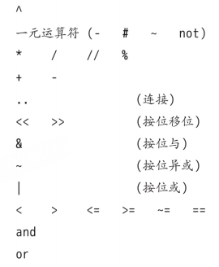

**<center><BBBG>1_基础</BBBG></center>**

<!-- TOC -->

- [基础中的基础](#%E5%9F%BA%E7%A1%80%E4%B8%AD%E7%9A%84%E5%9F%BA%E7%A1%80)
- [数据类型](#%E6%95%B0%E6%8D%AE%E7%B1%BB%E5%9E%8B)
    - [number](#number)
    - [string](#string)
    - [table](#table)
    - [function](#function)
        - [多返回值](#%E5%A4%9A%E8%BF%94%E5%9B%9E%E5%80%BC)
        - [变长参数](#%E5%8F%98%E9%95%BF%E5%8F%82%E6%95%B0)
        - [具名实参](#%E5%85%B7%E5%90%8D%E5%AE%9E%E5%8F%82)
        - [unpack](#unpack)
- [代码执行与异常](#%E4%BB%A3%E7%A0%81%E6%89%A7%E8%A1%8C%E4%B8%8E%E5%BC%82%E5%B8%B8)
    - [代码执行](#%E4%BB%A3%E7%A0%81%E6%89%A7%E8%A1%8C)
        - [函数简述](#%E5%87%BD%E6%95%B0%E7%AE%80%E8%BF%B0)
        - [预编译](#%E9%A2%84%E7%BC%96%E8%AF%91)
    - [异常](#%E5%BC%82%E5%B8%B8)
        - [异常函数](#%E5%BC%82%E5%B8%B8%E5%87%BD%E6%95%B0)
        - [异常处理方式](#%E5%BC%82%E5%B8%B8%E5%A4%84%E7%90%86%E6%96%B9%E5%BC%8F)
            - [例子：math.sin](#%E4%BE%8B%E5%AD%90mathsin)
            - [例子：io.open](#%E4%BE%8B%E5%AD%90ioopen)
        - [pcall](#pcall)
        - [xcall](#xcall)
- [持久化](#%E6%8C%81%E4%B9%85%E5%8C%96)
    - [Lua形式](#lua%E5%BD%A2%E5%BC%8F)
        - [例子：书籍信息](#%E4%BE%8B%E5%AD%90%E4%B9%A6%E7%B1%8D%E4%BF%A1%E6%81%AF)
        - [序列化](#%E5%BA%8F%E5%88%97%E5%8C%96)
            - [一般数据](#%E4%B8%80%E8%88%AC%E6%95%B0%E6%8D%AE)
            - [长字符串](#%E9%95%BF%E5%AD%97%E7%AC%A6%E4%B8%B2)
            - [表](#%E8%A1%A8)
                - [不循环表](#%E4%B8%8D%E5%BE%AA%E7%8E%AF%E8%A1%A8)
                - [循环表](#%E5%BE%AA%E7%8E%AF%E8%A1%A8)
- [库](#%E5%BA%93)
    - [数学库math](#%E6%95%B0%E5%AD%A6%E5%BA%93math)
    - [表库table](#%E8%A1%A8%E5%BA%93table)
    - [字符串库string](#%E5%AD%97%E7%AC%A6%E4%B8%B2%E5%BA%93string)
    - [I/O库io](#io%E5%BA%93io)
    - [操作系统库os](#%E6%93%8D%E4%BD%9C%E7%B3%BB%E7%BB%9F%E5%BA%93os)
    - [调试库debug](#%E8%B0%83%E8%AF%95%E5%BA%93debug)

<!-- /TOC -->

# 基础中的基础

**<BL>问题：Lua是什么</BL>**
<BL>Lua是一种轻量化的*嵌入式*语言，可以嵌入应用程序中，这意味着：在游戏中可以为本体进行灵活的扩展和定制功能</BL>

**一些知识点：**
- **<GN>chunk</GN>**---程序块，为**一连串的语句或命令**
- Lua**区分大小写**
- 未初始化的变量可以直接访问，为nil
- 不添加前缀就是<b><GN>全局变量</GN></b>，添加local前缀就是<b><GN>局部变量</GN></b>
- 索引起始值为1(否则某些机制无法使用)
- `a = a or 0`，一种**默认值**的设置方式
- `zip = (address or {}).zipcode`，一种**类的安全访问**的方式
- Lua支持多重赋值，如`a, b = 10, 2*10`　所以：`a,b,c = 0`是不对的，应该为`a,b,c = 0,0,0`
- `x, y = y, x`，一种**交换**的方式　　<B><VT>核心：多重赋值+先求值再赋值</VT></B>
- 通过`do ... end`添加块　　<VT>类似与C#的`{ ... }`</VT>
  由此可以创建出**不污染全局的局部变量**：
  <BR>

  ``` lua
  foo = 10
  do
    --创建局部的foo，在此之后end之前foo都是局部的
     local foo = foo
     foo = 1
     print(foo) -- 局部，得1
  end
  print(foo) -- 全局，得10
  ```

# 数据类型

**在Lua中有以下类型：**
nil | boolean | number | string | userdata | function | thread | table

## number

**<DRD>注意：从Lua5.3开始，number非拆分成了integer(整型)与float(浮点型)</DRD>**
在5.3之前：
所有数值都是**双精度浮点格式**
在5.3之后：
integer-**64位整型** | float-**双精度浮点类型**
(可以通过Small Lua模式<VT>(好像是通过LUA_32BITS宏？)</VT>改用32位整型与单精度浮点类型)

**Tip：**

- 可以通过`math.maxinteger`/`math.mininteger`表示整型的最大值/最小值
- 可以通过`math.huge`/`-math.huge`表示浮点型的最大值/最小值
- **整型转浮点型**可以通过<B>+0.0</B>　　　<YL>如：`-3+0.0`为`-3.0`</YL>
- **浮点型转整型**，有两种方式：按位或 | `math.tointeger()`
  两种都会进行检查：　　<VT>Tip：默认情况下任何数值都为浮点型</VT>
  - `2^53 | 0`为`9007199254740992`
  - `3.2 | 0`　　　<VT>不可以，因为3.2和3不相等，Lua拒绝转换</VT>
  - `2^64 | 0`　　　<VT>不可以，超范围了</VT>
- 大于2^53的整型转浮点型会造成精度损失
- 浮点型强转整型的话可以改造以下函数：
<BR>

    ``` lua
    function cond2int(x)
        -- 转换失败会返回nil，那么失败就还原
        return math.tointeger(x) or x
    end
    ```

**优先级**如下所示：　　**<VT>优先级从高到低</VT>**

**结合律**如下所示：
**除了`^`和`..`与一元运算符为右结合，其余皆为左结合**

## string

单行注释---`--`
多行注释---`[[ ... ]]`　　<VT>类似与C#的`@`</VT>

- **string转其它类型**---toXXX()　　<YL>如：`tonumber()`</YL>
- **其它类型转string**：
  - `tostring()`
  - `xx .. ""`　　<VT>即<b>添加空字符串</b></VT>

对于string来说，有**2个库**：

- **<GN>string库</GN>**---<VT>对ASCII操作</VT>
- **<GN>utf8库</GN>**---<VT>对utf8操作</VT>　**lua5.3新增**
  
**<DRD>注意：string库的内容还是可以用于utf8字符串的，只是形式有所变化(如：`string.len()`会以字节为单位)</DRD>**

## table

table具有**唯一的创建方式**，即`{}`
具体来说有：

- 1.`days = {"Sunday", "Monday"}`
- 2.`a = {x=10, y=20}`
- 3.`opnames = {["+"] = "add", ["-"] = "sub"}` 可以使用负数

我们可以认为1/2形式其实是3形式的**语法糖**

**语法糖：**`a["name"] == a.name`　　**<DRD>注意：是a["name"]而非a[name]</DRD>**

**<VT>问题：如何以索引0开始</VT>**
`{[0] = 0, 1, 2, 3, 4}`　　**<DRD>注意：极其不推荐，因为有些内容需要起始索引为1的特性</DRD>**

**Tip：分割不仅可以是`,`，还可以是`;`**，在某些时候可以起到小分割与大分割的作用
**<YL>如：</YL>**`t = {x=10, y=45; "one", "two", "three"}`

**nil是数组结尾的标志**，有：

``` lua
a = {}
a[10000] = 1
print(#a) -- 0，按理来说应该是1
```

由此，我们可以编写一个<b><GN>长度函数len()</GN></b>:

``` lua
-- 通过pairs进行完整遍历，输出完整长度
local function len(x)
    local n = 0;
    for k,v in pairs(x) do
        n = n + 1
    end
    return n
end
```

## function

一般函数的形式为：`print("OK")`
但是存在一种**特例**：**<VT>如果函数只有一个参数(必须是<DRD>字面字符串或table构造式</DRD>)，那么可以省略括号(指的是调用时只有一个)</VT>**
**<YL>如：</YL>**`print("OK")`--->`print "OK"`　`require("a")`--->`require "a"`

在Lua中，**参数列表是不需要匹配**的：

- 假如多传参了，那么多的就会丢弃，
- 假如少传参了，那么少的就会置为nil

由此可以应用在如下情况：

``` lua
function incCount(n)
  -- n可以不传，不传就设默认值1
  n = n or 1
  count = count + n
end
```

### 多返回值

`function foo() return "a", "b" end`
**关键点：<VT>如果函数调用不是表达式的最后一个元素，那么只产生一个值(对于table初始化来说同理)</VT>**

``` lua
function foo0() end
function foo2() return "a", "b" end

x = foo2() -- x="a"，"b"被丢弃
x,y,z = foo2() -- x="a"，y="b"，z未赋值为nil

x,y = foo2(), 20 -- x="a"(只取第一个"a"，"b"被丢弃了)， y=20
x,y = foo0(), 20, 30 -- x=nil(foo0赋值的)，y=20，30被丢弃

print(foo2()) -- a b
print(foo2(), 1) -- a 1

-- table同理
t = {foo0(), foo2(), 4} -- [1]=nil [2]="a" [3]=4
```

**Tip：括号能使多返回值函数只返回1个值**

``` lua
function multipleReturns()
    return 1, 2, 3
end
local t1 = {multipleReturns()}  -- t1 = {1, 2, 3}
local t2 = {(multipleReturns())}  -- t2 = {1}

-- 实用例子
local s = "Hello, world!"
local firstComma = (string.find(s, ",")) -- 只返回第一个分割字符串
print(firstComma)  -- 输出: 6
```

### 变长参数
简单来说，变长参数就是`...`

``` lua
-- 加法函数
function add(...)
  local s = 0
  for i,v in ipairs{...} do
    s = s + v
  end
  return s
end

print(add(3,4,10,25,12)) -- 54
```

**<BL>问题：为什么可以是`ipairs{...}`，不应该是`ipairs(table)`吗</BL>**
<BL>在前面我们提到过如果只有一个参数是可以省略括号的，那么本质上这其实是`ipairs({...})`，也就是<b>构建了一个table传入</b>，那么我们也能发现：**<VT>`ipairs`其实是一个函数</VT>**</BL>

**两种逻辑：**

- `local a, b = ...`---多返回值
- `{...}`---多返回值组成table

**<YL>用处：</YL>**

``` lua
-- 1.跟踪函数
-- 相当于嵌套了一层，可以再运行前先进行一定的操作
function foo1(...)
    print("calling foo:", ...)
    return foo(...)
end

-- 2.组合
-- io.write():一种更原始的print()，不会添加换行符，
-- 也不会在参数间添加制表符，也不会自动刷新缓冲区(换行就会刷新(好像))
function fwrite(fmt, ...)
    return io.write(string.format(fmt, ...))
end

fwrite("%d%d", 4, 5) -- 输出45
```

对于变长参数来说，有一函数会比较有用，即<b>`select()`</b>：

- `select("#", ...)`　　　 <VT>此时，会获取参数数量</VT>
- `select(n, ...)`　　　　<VT>此时，会返回从n开始的所有参数</VT>

``` lua
-- 从第1个元素开始，遍历到底，每次都通过select(i, ...)取出第i个元素
-- 假设有12345，i=1时会得到12345，但是只有一个arg需要接收，那么就是第一个元素1
for i=1, select("#", ...) do
    local arg = select(i, ...)
    -- ...
end
```

### 具名实参
在C#中，是具有具名实参的：

``` csharp
public void Rename(string oldName, string newName) {/*...*/}

//使用
Rename(oldName: "A", newName: "newA");
```

而在lua中，是通过**表的特性**来完成的：

``` lua
function rename(arg)
    return os.rename(arg.old, arg.new)
end

rename{old="old.lua", new="new.lua"}
```

所以说：**与其说是具名实参，不如说这是唯一用法，一种用table包装的方式**
所以说：如果参数传入数量不定，这会是一种很好的方式

``` lua
function Window (options)
    -- 检查必要的参数
    if type(options.title) ~= "string" then
        error("no title")
    elseif type(options.width) ~= "number" then
        error("no width")
    elseif type(options.height) ~= "number" then
        error("no height")
    end
    
    -- 其他参数都是可选的
    _Window(options.title,
            options.x or 0,        -- 默认值
            options.y or 0,        -- 默认值
            options.width, options.height,
            options.background or "white",  -- 默认值
            options.border         -- 默认值为false (nil)
    )
end
```

### unpack()
简单来说，该函数就是用于**table转多返回值的**
<YL><b>举个例子</b>的话就是：`string.find()`需要多参数，但我手上可能有一个table，使用`unpack()`即可转换为多参数，可能有`string.find(unpack({"hello", "ll"}))`</YL>
虽然`unpack()`由C实现，但在**Lua**中我们也可以**实现**：

``` lua
-- 大致就是：
-- 我们使用unpack(t)，然后取i再递归看看i+1有没有
function unpack(t, i)
    i = i or 1
    if t[i] then
        return t[i], unpack(t, i+1)
    end
end
```

# 代码执行与异常

我们当然知道Lua是一种<GN><B>解释型语言</B></GN>，但是它依然会在<VT><B>运行代码前进行预编译源码为中间代码</B></VT>
**<BL>问题：为什么解释型语言能编译</BL>**
<BL>解释型语言的区分不在于源码是否被编译，而在于<VT><B>是否有强大的能力执行动态生成的代码</B></VT></BL>

## 代码执行

### 函数简述

在Lua中，为了代码执行，我们通常会使用<B>`dofile()`</B>，但其实它只是一个<VT>辅助函数</VT>，
本质上**核心**为<B>`loadfile()`</B>
具体来说有以下几种：

- 文件读取
  - `dofile()`
  - `loadfile()`
- 字符串/函数读取
  - `load()`　　<VT>Lua5.1称为`loadstring()`(同时只能用于字符串)</VT>

**<DRD>注意：如果是商业项目，那么加载程序块时需要报告错误，如果代码不可信任的话，需要在保护环境下执行</DRD>**

大致上来说，<B>`dofile()`</B>是这样**实现**的：

``` lua
function dofile(filename)
  local f = assert(loadfile(filename))
  return f()
end
```

**所以说：**

- `dofile()`更加<VT><B>便捷</B></VT>，调用即可完成加载全流程
- `loadfile()`更加<VT><B>灵活</B></VT>:
  - 会在错误时返回信息，可自定义处理
  - 可多次运行同一个文件，开销比dofile小很多
- `load()`是一种方便地<VT><B>动态执行任意代码的方式</B></VT><DRD><B>(开销大且容易出现问题，慎用)</B></DRD>
  - **<VT>注意点：如果只是加载字符串常量，是没有意义的</VT>**
    `f = load("i = i + 1")`与`f = function() i = i + 1 end`是等价的，但由于函数形式会与外层函数一起编译，速度更快
  - **<VT>注意点：load在编译时不涉及词法定界</VT>**
    用一个**例子**展示：
    <BR>

    ``` lua
    i = 32
    local i = 0
    f = load("i = i + 1; print(i)")
    g = function() i = i + 1; print(i) end
    f() -- 33 (无词法定界，所以用的时全局的32)
    g() -- 1 (由于有局部的，所以优先使用局部的1)
    ```

  - **例子：加载/重复加载**
    <BR>

    ``` lua
    -- 加载
    print "enter your expression:"
    local l = io.read()
    local func = assert(load("return " .. l)) -- 需要return
    print("the value of your expression is " .. func())

    -- 重复加载
    print "enter function to be plotted (with variable 'x'):"
    local l = io.read()
    local f = assert(load("return " .. l))
    for i=1,20 do
        print(string.rep("*", f())) -- 多次调用
    end
    ```

- `dostring()`并不存在，但我们可以通过`load(s)()`实现　　**<VT>即用即弃</VT>**
  由于可能发生错误，所以应该这样：`assert(load(s))()`

### 预编译

根据前面所述，Lua自然可以进行**预编译**生成<GN><B>预编译文件</B></GN>(即<GN><B>二进制文件binary chunck</B></GN>)
**方法**大致为：`luac -o prog.lc prog.lua`　将`prog.lua`编译为`prog.lc`
**<VT>对于预编译生成的.lc文件，是可以被`loadfile()`与`load()`所接收的</VT>**
**有：**

``` lua
p = loadfile(arg[1])
f = io.open(arg[2], "wb")
f:write(string.dump(p))
f:close()
```

此时我们通过如：`lua your_compiler.lua input.lua output.luac`命令行即可运行
**`string.dump()`---<VT>传入函数，输出字符串</VT>**

**预编译可添加选项**
如**添加`-l`**，则会生成<GN><B>操作码opcode</B></GN>
可能有：执行`luac -l test.lua`，输出：

``` lua
main <test.lua:0,0> (6 instructions at 0x55a1b4c2b2e0)
0+ params, 3 slots, 1 upvalue, 1 local, 2 constants, 1 function
        1       [1]     VARARGPREP      0
        2       [3]     GETTABUP        0 0 -1    ; _ENV "print"
        3       [1]     CLOSURE         1 0        ; 0x55a1b4c2b3a0
        4       [3]     LOADK           2 -2       ; 1
        5       [3]     LOADK           3 -3       ; 2
        6       [3]     MMBIN           2 3 6     ; __add
        7       [3]     CALL            1 3 2
        8       [3]     CALL            0 2 1
        9       [3]     RETURN          0 1

function <test.lua:1,3> (4 instructions at 0x55a1b4c2b3a0)
2 params, 3 slots, 0 upvalues, 2 locals, 0 constants, 0 functions
        1       [2]     ADD             2 0 1     ; a + b
        2       [2]     RETURN          2 2
        3       [3]     RETURN          0 1
        4       [3]     RETURN          0 1
```

这看起来就像是汇编代码(实际上是操作码)

**预编译的<GN>好处</GN>：**

- **更快**
- **避免意外修改源码**
  但是同时由于是预编译代码，可能会**发生恶意损坏或恶意构造**，我们也<VT><B>应该避免运行非受信代码</B></VT>
  这通过`load()`的**第3个参数**即可<VT><B>限制运行类型</B></VT>：
    - `"t"`---普通代码段
    - `"b"`---预编译(二进制)代码段
    - `"bt"`---两者都可

## 异常

异常处理是所有语言都应该具有的部分，当然Lua也有

### 异常函数

**常见函数**如下：

- **`error()`---<VT>直接报错</VT>**
  <BR>

  ``` lua
  print "enter a number:"
  n = io.read("n")
  if not n then error("invalid input") end
  ```

  其中，可选参数2为**level**，即<VT><B>报错层级</B>(默认为1，指当前函数)</VT>

- **`assert()`---<VT>判断真假并报错</VT>**
  <BR>

  ``` lua
  print "enter a number:"
  n = assert(io.read("*n"), "invalid input")
  ```

  但我们不该写出如下代码：
  <BR>

  ``` lua
  -- 这里看似没问题，但是一旦n非法，报错信息中的拼接就存在问题了
  -- 可能显式测试更加明智
  n = io.read()
  assert(tonumber(n), "invalid input: " .. n .. "is not a number")
  ```

### 异常处理方式

**异常处理**通常有两种**方式**：

- 返回错误码(nil/false/...)
- 调用`error()`

**一种指导原则：<VT>容易避免的异常应该引发错误，否则应该返回错误码</VT>**

#### 例子：math.sin()

对于该函数，我们可能会想到以下异常处理方式：

``` lua
-- 在操作后检测
local res = math.sin(x)
if not res then 
    -- ...
end

-- 在操作前检测
if not tonumber(x) then
    -- ...
end
local res = math.sin(x)
```

但是**更好的方法**是：
<VT>停止并输出错误消息(sin函数本身就会报错)，即不额外操作</VT>
之所以这样是因为既然传参不是需求的number，那么程序必然出现了问题，我们只需要报错并了解即可

#### 例子：io.open()

对于`io.open()`我们会想到一个问题：**<BL>如果文件不存在怎么办</BL>**
那么事实上通常判断的方式就是尝试打开，那么`io.open()`自然应该<VT>返回false并输出错误信息</VT>

所以我们可能可以这样**处理**：

``` lua
local file, msg
repeat
    print("enter a file name:")
    local name = io.read()
    if not name then return end -- 没有输入
    file, msg = io.open(name, "r")
    if not file then print(msg) end
until file
```

最简单的话其实就是**不处理**：`file = assert(io.open(name, "r"))`

### pcall()

如果说`assert()`之类的函数是**抛出异常**，那么<GN><B>pcall(protected call)</B></GN>则为**捕获异常**：
**<VT>对于pcall，不会引发错误，而是会返回bool与错误信息</VT>**

``` lua
local ok, msg = pcall(function ()
    ...
    if unexpected_condition then error() end
    ...
    print(a[i]) -- 潜在错误：'a'可能不是表
    ...
end)

if ok then -- 代码执行成功，无错误
    ...
else -- 代码执行失败，处理错误（msg 包含错误信息）
    -- 进行处理
end
```

**<VT>Tip：错误信息不一定是string，可以是任意类型</VT>**

``` lua
local status, err = pcall(function() error({code = 121}) end)
print(err.code) -- 121
```

**<VT>对于错误信息为string的情况下，Lua会尝试传递一些额外信息：</VT>**

``` lua
local status, err = pcall(function() error("my error") end)
print(err) -- stdin:1: my error (即代码段名称+行号)
```

### xcall()

pcall存在一定的**延迟性**，当我们去查看pcall返回的错误信息时，<VT>调用栈已经不完整了</VT>，
我们需要使用<B>另一种形式xcall()</B>进行：　　**<VT>会在调用<GN>栈展开(unwind)</GN>前调用错误信息函数，则可以使用debug库</VT>**

**`pcall()`/`xcall()`对比：**

``` lua
-- 使用pcall的情况
local success, err = pcall(function()
    error("一个错误")
end)

if not success then
    print("错误信息:", err)  -- 只会输出"一个错误",没有调用栈信息
end

-- 使用xpcall的情况
local function errorHandler(err)
    -- 在这里,调用栈还完整
    return err.."\n"..debug.traceback()  -- 返回错误消息加上完整调用栈
end

success, err = xpcall(function()
    error("一个错误")
end, errorHandler)

if not success then
    print("详细错误信息:", err)  -- 会输出错误消息及完整的调用栈
end
```

# 持久化

## Lua形式

一般来说，我们可能会用**CSV/XML/JSON**之类的形式进行持久化存储，
但一种比较特殊的情况就是**Lua内置**情况，对于该形式即<VT><B>自定义持久化储存，具体逻辑都由我们来决定</B></VT>

### 例子：书籍信息


**方法1：**

``` lua
-- data.lua中
Entry{"Donald E. Knuth",
     "Literate Programming",
     "CSLI",
     1992}

Entry{"Jon Bentley",
     "More Programming Pearls",
     "Addison-Wesley",
     1990}

-- 功能：获取书籍数
local count = 0
function Entry() count = count + 1 end
-- dofile会运行一遍data.lua文件，那么就会看其中执行了多少次Entry函数，在这里就是2
dofile("data")
print("number of entries: " .. count) -- 2

--功能：获取每个Entry的姓名
local authors = {}     -- 保存作者姓名的集合
function Entry (b) authors[b[1]] = true end
dofile("data")
for name in pairs(authors) do print(name) end
```

**方法2：**

``` lua
-- data.lua中
Entry{
  author = "Donald E. Knuth",
  title = "Literate Programming",
  publisher = "CSLI",
  year = 1992
}

Entry{
  author = "Jon Bentley", 
  title = "More Programming Pearls",
  year = 1990,
  publisher = "Addison-Wesley",
}

--功能：获取每个Entry的姓名
local authors = {}
function Entry (b) authors[b.author or "unknown"] = true end
dofile("data")
for name in pairs(authors) do print(name) end -- 应该要排除unknown
```

两种方法都是**可行的**，但是很明显<VT><B>方法2更加清晰</B></VT>

### 序列化

以上只是一种极易的情况，属于是"比较特例"<VT>(我们读取的并非string/byte数据，而是lua)</VT>
更一般地，我们会需要**将数据转换为string/byte真正存储在文件中**

**具体如下：**

#### 一般数据

对于**number/string/boolean/nil**来说，它们只需使用<B>`string.format()`</B>即可轻松转换：

``` lua
-- 在Lua5.3.3之前，需要使用该形式
local fmt = {integer = "%d", float = "%a"} -- Lua5.3之后的区分

function serialize(o)
    if type(o) == "number" then
        -- 如果直接使用十进制保存浮点数会损失精度，可以使用十六进制(即%a)
        io.write(string.format(fmt[math.type(o)], o))
    else if type(o) == "string" then
        -- 我们可能的选择有：'x' | "x" | [[x]]
        -- 'x'会与引号与换行符之类的冲突
        -- [[x]]存在代码恶意注入问题(注入后可能为"[[]]..xxx..[[]]"，这是不安全的)
        io.write(string.format("%q", o)) -- %q会自动添加双引号并转义
    else
        -- ...
    end
end

-- 在Lua5.3.3后，%q可以用于number/boolean/string/nil
function serialize (o)
    local t = type(o)
    if t == "number" or t == "string" or t == "boolean" or
        t == "nil" then
        io.write(string.format("%q", o))
    else
        -- ...
    end
end
```

#### 长字符串

前面提到，对于一般的string我们使用`%q`即可，
但是它多多少少<VT>影响了原字符串</VT>，如果我们需要**保留原始形式**则会使用<B><GN>长字符串</GN>的形式</B>

<B><GN>长字符串</GN>---<VT>形如`[==[xxx]==]`的字符串(`=`数量任意，即[0,∞])</VT></B>

``` lua
local s1 = [[hello]]
local s1 = [===[hello]===]
print(s1, s2) -- 都为hello
```

**核心：在`[[`与`]]`的中间添加`=`号**
既然我们想使用`[=[]=]`替代`""`，那么必然需要保证可识别，即<VT>具有字符串中最长等号序列+1的等号</VT>
**方法如下：**

``` lua
function quote (s)
    -- 寻找最长等号序列(仅需右侧，因为从左侧依次读取，不会漏)的长度
    local n = -1
    for w in string.gmatch(s, "]=*") do
      n = math.max(n, #w - 1) -- -1用于移除']'获取实际'='数量
    end
    
    local eq = string.rep("=", n + 1)
    return string.format(" [%s[\n%s]%s] ", eq, s, eq)
end
```

#### 表

对于表来说，有两种可能，即**不循环表**与**循环表**，
很明显不循环情况下是非常简单的，大致和其它基本数据类型一致，而对于循环情况处理就较为麻烦

##### 不循环表

一个表可能长这样：`{a = 1, b = 2, 3}`，其实就是一个**多数据集合**，那么我们<VT><B>按照表的形式还原成字符串即可</B><VT>

``` lua
function serialize(o)
    local t = type(o)
    if t == "number" or t == "string" or t == "boolean" or
       t == "nil" then
        io.write(string.format("%q", o))
    -- table部分
    elseif t == "table" then
        io.write("{\n")
        for k,v in pairs(o) do
        --  该形式存在问题：当k是数字或非法标识符则报错
        --  io.write("  ", k, " = ")
        --  所以使用[]形式保证正确性即可
            io.write(string.format(" [%s] = ", serialize(k)))
            serialize(v)
            io.write(",\n")   
        end
        io.write("}\n")
    else
        error("cannot serialize a " .. type(o))
    end
end
```

**<VT>Tip：虽然表情况下有`serialize()`嵌套，但是能处理的只有1层而非循环情况，如果table中遇到kv为table数据，必然是不正确的</VT>**

##### 循环表

如果带有循环(即递归表)，情况必然复杂许多，**具体如下**：

``` lua
function basicSerialize(o)
  return string.format("%q", o)
end

function save(name, value, saved)
  saved = saved or {} -- 缓存表
  io.write(name, " = ")
  -- TODO:这里应该是为了table的key而没有添加boolean和nil情况
  if type(value) == "number" or type(value) == "string" or
   type(value) == "boolean" or type(value) == "nil" then
    io.write(basicSerialize(value), "\n")
  elseif type(value) == "table" then
    -- 使用缓存表
    if saved[value] then
      io.write(saved[value], "\n")
    -- 一般情况
    else
      saved[value] = name
      io.write("{}\n")
      for k,v in pairs(value) do
        k = basicSerialize(k)
        local fname = string.format("%s[%s]", name, k)
        save(fname, v, saved)
      end
    end
  else
    error("cannot save a " .. type(value))
  end
end
```

在这里**核心**就是通过<VT><B>逐一赋值</B></VT>的方式保证了table的嵌套
说到底这种方式其实就是在<B>"编写代码"，具体如下</B>：

``` lua
a = {{"one", "two"}, 3}
b = {k = a[1]}

local t = {}
save("a", a, t)
save("b", b, t)

-- 调用后得到文件
a = {}
a[1] = {}
a[1][1] = "one"
a[1][2] = "two"
a[2] = 3
b = {}
b["k"] = a[1]
```

# 库

**常用的库**有：

- 数学库math
- 表库table
- 字符串库string
- I/O库io
- 操作系统库os
- 调试库debug

<br>

## 数学库math

**大致有：**

- 三角函数---`sin()` `cos()` `tan()` `asin()` `acos()` `atan()`
  - `deg()` `rad()`　　<VT>角度制弧度制转换，<b>默认弧度制</b></VT>
- 指数/对数函数---`exp()` `log()` `log10()`
- 取整函数---`floor()` `ceil()` `modf()`
  - `floor()`向下取整，`ceil()`向上取整，`modf()`向0取整
  - `modf()`会返回<b>2个值(整数部分与小数部分(即余数))，<YL>举例：</YL></b>
    - `math.modf(3.3)` 返回`3 0.3`
    - `math.modf(-3.3)` 返回`-3 -0.3`
- 随机函数---`random()` `randomseed()`
  - random函数是**均匀分布，伪随机**的
    - `random()`：取值范围[0,1)
    - `random(n)`：取值范围[1,n]
    - `random(l,u)`：取值范围[l,u]
  - randomseed函数为<VT><b>random函数计算额外的种子</b></VT>，**默认为1**
    这会导致每次运算必然得到同一结果，所以**解决方法**就是：`math.randomseed(os.time())`，这样由于系统时间每次都不同，从而种子不同，运算结果也不同
- `max()` `min()`
- `pi`
- `huge`即**inf**

## 表库table

**大致有：**　　<VT>表库是一个<b>提供List操作</b>的库</VT>

- 插入与删除---`insert()` `remove()` `move()`-5.3追加
  - `insert(table, value)`：在末尾添加value元素
  - `insert(table, pos, value)`：在pos处插入value元素(pos及之后的元素向后移动1格)
  - `remove(table)`：删除末尾元素
  - `remove(table, pos)`：删除pos处元素(pos之后的元素向前移动1格)
  - `move(a,f,e,t)`：将表a中从索引f到e的元素移动到位置t上
    可以有：

    ``` lua
    -- 在开头插入一个元素
    table.move(a, 1, #a, 2)
    a[1] = newElement

    --删除首元素
    table.move(a, 2, #a, 1)
    a[#a] = nil
    ```

  - `move(a,f,e,t,a2)`：将表a中从索引f到e的元素移动到表a2的位置t上
- 排序`sort()`
  - `sort(table)`：排序，**<VT>默认升序</VT>**
  - `sort(table, comp)`：根据**比较函数comp**进行排序　类似于C#的IComparer接口
  - **<DRD>重要：排序是对table的value进行排序</DRD>**
    这意味着如果有以下table，我们如果想以字母次序排序，直接进行时错误的：

    ``` lua
    lines = {
      luaH_set = 10,
      luaH_get = 24,
      luaH_present = 48,
    }
    ```

    如果想要这样排序，则需要：
    - 重新建一个value为名字的数组进行排序
    - 迭代器
  
    ``` lua
    -- 方法1：
    keys = {}
    for k in pairs(lines) do keys[#keys+1] = k end
    table.sort(keys)
    -- 注意：对于ipairs来说绝对是顺序的
    for _,k in ipairs(keys) do print(k,lines[k]) end

    --方法2：
    --和方法1一个意思，就是闭包了一个表a
    function pairsByKeys(t, f)
      local a = {}
      for n in pairs(t) do a[#a + 1] = n end
      table.sort(a, f)
      local i = 0
      return function()
        i = i + 1
        return a[i], t[a[i]]
      end
    end

    for name, line in pairsByKeys(lines) do
      print(name, line)
    end
    ```

- 拼接`concat()`
- 打包解包`pack()` `unpack()`

## 字符串库string

**大概有：**

- `len(s)`：返回字符串s的长度，等价于`#s`
- `rep(s,n)`：即repeat，重复字符串s n次
- `reverse()`：翻转
- `lower(s)` `upper(s)`：返回s的小写版/大写版副本
- `sub(s,i,j)`：即子字符串的含义，为提取s中的索引i到j的字符<VT>(<b>支持负索引</b>，如-1为最后一个字符，-2为倒数第二个字符)</VT>
  
  ``` lua
  s = "[in brackets]
  string.sub(s, 2, -2) -- in brackets
  string.sub(s, 1, -1) -- [
  string.sub(s, -1, -1) -- ]
  ```

  <DRD>注意：和C#一样，是复制，所以需要赋值给原变量，即：`s = string.sub(s, ., .)`</DRD>

- 转换函数---`char()` `byte()`
  - `char(i)`：ASCII码转字符
  - `char(...)`：ASCII码转字符，并连成字符串
  - `byte(s)`：字符转ASCII码，取第一个字符　<VT>即i默认为1</VT>
  - `byte(s,i)`：字符转ASCII码，取第i个字符
  - `byte(s,i,j)`：字符转ASCII码，取索引i到j中的字符
- `format()`：格式化字符串
  - 大致形式有：`string.format("x = %d", 10)`　<VT>与C的printf()非常像</VT>
  - 有控制格式细节，如：`%.4f`为4位小数 `%02d`为2位整数(不足补0)
  - **其实就是调用C语言的printf函数完成的**
- 模式匹配函数---`find()` `match()` `gsub()` `gmatch()`
  - `find(str,pattern[,init[,plain]])`：从init(默认位1)开始寻找，在str中查找pattern子串或模式，返回找到元素的首尾索引
    - plain：是否开启简单搜索，默认关闭，即开启模式匹配(类似于正则表达式)
    - <YL>举个例子：`string.find("a [word]", "[")`这是错误的，因为默认会认为`[`是模式匹配的一部分
    如果想要搜索左括号，那么将plain设为true即可</YL>
  - `match(str,pattern[,init])`：同find()，只是返回的是匹配的子串
  - `gsub(str,pattern,repl[,n])`：将匹配的pattern替换为repl，返回替换后的字符串与替换的次数
    - n：限制替换的次数
  - `gmatch(s,pattern)`：在s中寻找pattern，返回一个迭代器函数返回匹配结果

## I/O库io

**大概有：**

- **简单I/O模型　　<VT>仅能处理单输入输出</VT>**
  - `input()` `output()`：
    - 无参形式`input()` `output()`：获取当前输入输出流
    - 有参形式`input(f)` `output(f)`：更改当前输入输出流，一旦更改，之后的所有输入输出都会来自于对应文件　　<VT>会抛出异常，但是想要直接处理异常需要完整I/O模型</VT>
  - `write()`：读取任意多个字符串或数字并写入当前输出流
    - <VT>Tip：<B>由于可以传入多个参数</B>，所以应该避免使用`..`连接符改用多参数形式，如：`(a..b..c)`--->`(a,b,c)`</VT>
    - <VT>Tip2：<B>除非用于调试或"用后即弃"该用`print()`，其余时候都应该使用`write()`(因为write更原始一点)</B></VT>
  - `read()`：从当前流读取字符串
    - 格式参数决定了读取的数据：
      - `"a"`---整个文件
      - `"l"`---下一行(丢弃换行符)　　**默认参数**
      - `"L"`---下一行(保留换行符)
      - `"n"`---一个数值
      - `num`---以字符串读取num个字符
        - `io.read(0)`可以**测试是否到达文件末尾**，有数据则为空字符串，否则为nil
  - `lines()`：迭代器函数，用于逐行迭代文件<VT>(`read("l")`如果要全读还不如使用`lines()`)</VT>
    - `lines()`：即`io.input():lines()`
    - `lines(f)`：以**只读**的方式打开对应文件的输入流，达到末尾后**自动关闭**
    - **<VT>在lua5.2开始，可以接收`read()`一样的格式参数(如`"a"`)</VT>**
- **完整I/O模型　　<VT>支持多输入输出</VT>**
  - `open()`：打开一个文件，返回对应文件的流，发生错误则返回nil与错误信息+错误码　　<VT>类似于C的`fopen()`</VT>
    - 模式参数决定了文件的性质：
      - `"r"`---只读
      - `"w"`---只写
      - `"a"`---追加(从末尾添加)
      - `"b"`---表示打开二进制文件
    - `open()`与`assert()`的协作：
      由于`open()`在错误时会返回错误信息+错误码，所以正好与`assert()`的第二个参数message即错误信息相对应
      可以有：`assert(io.open(filename,mode))`
  - `read()` `write()`：读写，**在打开文件后进行**　<YL>通常为`f:read("a")`(f为流)</YL>　　<VT>Tip：完整模型是<B>针对文件的操作</B>，即`file:xxx()`而非`io.xxx()`</VT>
    - `stdin` `stdout` `stderr`：句柄，用于写入不同的流(输入/输出/错误)，通常是**命令行**
      - 大致用法为：`io.stderr:write(message)`
    - <VT>Tip：`io.read(args)`是`io.input():read(arg)`的<B>缩写</B></VT>
  - `tmpfile()`：返回一个**读写模式的句柄**，用于操作临时文件，程序运行结束后会自动删除　　<VT>很像内存流(但不是)</VT>
  - `flush()`：将所有缓冲数据写入文件，同样有`io.flush()`和`f:flush()`
  - `setvbuf()`：设置流的缓冲模式
    - 参数1`mode`：就是缓冲模式
      - `"no"`---无缓冲，即立即写入
      - `"full"`---完全缓冲，即满了写入
      - `"line"`---行缓冲，即换行写入
    - 参数2`size`：缓冲区大小，默认由系统决定
  - `seek()`：获取和设置文件的当前位置
    - 参数1`whence`：如何计算偏移　　**<VT>以字节为单位</VT>**
      - `"set"`---开头偏移
      - `"cur"`---当前位置偏移　**默认值**
      - `"end"`---末尾偏移
    - 参数2`offset`：偏移
- **其它**
  - `popen()`：与`os.execute()`类似，运行系统命令并重定向命令的输入/输出
    - 参数1`command`：执行的命令
    - 参数2`mode`：模式，具有`"r"`读模式以及`"w"`写模式
    - 举个例子有：
  
      ``` lua
      -- 以sort的方式进行write()操作
      local handle = io.popen("sort", "w")
      handle:write("banana\napple\ncherry")
      handle:close()
      ```

**实例1：临时改变流**

``` lua
local temp = io.input() -- 保存旧流
io.input("newinput") -- 打开新流
-- 新流操作
io.input():close() -- 关闭新流
io.input(temp) -- 还原旧流
```

**实例2：获取文件大小**

``` lua
function fsize(file)
    local current = file:seek() -- 保存当前位置
    local size = file:seek("end") -- 获取文件大小
    file:seek("set", current) -- 恢复当前位置
    return size
end
```

## 操作系统库os
os和io很相近，io为**流**，而os为**真实文件**
**大概有：**

- **程序执行相关**
  - `rename()`：文件重命名(错误时返回nil+错误信息+错误码)
  - `remove()`：文件删除(错误时同上)
  - `exit()`：终止程序的执行
    - 参数1`code`：退出码　默认为0，即成功
    - 参数2`close`：是否关闭Lua状态并调用所有析构器释放所有内存　默认为true
  - `getenv()`：获取某个环境变量(就是Windows的那个环境变量)
  - `execute()`：运行系统命令，等价于C的system函数
    如：`os.execute("mkdir" .. dirname) -- 创建目录`
- **时间相关**
  - 表示方式：
    - 秒数，即自1970.1.1.00:00开始经过的秒数
    - 日期表，即用表来表示日期，如：`{year = 1998, month = 9, day = 16, yday = 259, wday = 4, hour = 23, min = 48, sec = 10, isdst = false}`
  - `time([table])`：返回当前的时间(使用秒数表示)
    - 可选参数`table`：是一个日期表，时间为该日期的秒数
      - year/month/day是必须的
      - hour/min/sec不是必须的，默认时间为12:00:00
      - wday/yday会被忽略
    -  可以进行一系列**转换**：

      ``` lua
      local date = 1439653520
      local day2year = 365.242       -- 1年的天数
      local sec2hour = 60 * 60       -- 1小时的秒数
      local sec2day = sec2hour * 24  -- 1天的秒数
      local sec2year = sec2day * day2year  -- 1年的秒数

      -- 年
      print(date // sec2year + 1970)  --> 2015.0
      -- 小时 (UTC格式)
      print(date % sec2day // sec2hour)  --> 15
      -- 分钟
      print(date % sec2hour // 60)  --> 45
      -- 秒
      print(date % 60)  --> 20
      ```

  - `date(format[,time])`：可以认为是`time()`的反函数
    - 参数1`format`：格式字符串，类似`%Y-%m-%d %H:%M:%S`
      - 特殊字符串`"*t"`用于返回日期表
      - 开头添加`!`会以UTC进行解析
      - 默认使用`%c`格式
    - 可选参数2`time`：需要格式化的秒数
  - `difftime(t2,t1)`：计算从开始时间t1到结束时间t2的秒数
  - `clock()`：获取CPU时间　**<VT>高精度</VT>**
  - 计算相关：
    - 基本推算时间方式：
  
      ``` lua
      t = os.date("*t") -- 当前时间
      t.day = t.day + 40 -- 向后40天
      print(os.date("%Y/%m/%d", os.time(t)))
      ```

    - **日历机制会导致错误：　　<VT>这是一个与Lua语言无关的问题</VT>**
      3.31加上一个月(`t.month=t.month+1`)会得到4.31，归一化后得到5.1
      而5.1减去一个月会得到4.1而非3.31

    - 高精度测试用法：

      ``` lua
      local x = os.clock()
      local s = 0
      for i = 1,100000 do s = s+i end
      print(string.format("elapsed time: %.2f\n", os.clock() - x))
      ```

## 调试库debug

调试库与反射机制有关，虽然Lua是动态语言支持几种反射机制，但还是有所缺失：

- 程序不能检查局部变量
- 开发人员不能跟踪代码的执行

所以需要调试库进行填补，调试库有两类：
1.**自省函数**---允许检查运行中的程序的各个内容
2.**钩子hook**---允许跟踪程序的执行

和一般的反射相同，**<DRD>调试库必须谨慎使用</DRD>**，因为会造成<VT><B>性能降低</B>与<B>打破固有规则</B><VT>

**大概有：**

- **自省机制**
  - `getinfo([thread,]f[,what])`：用于获取函数或栈层次的调试信息
    - 参数`f`：级别，1代表当前函数，2代表函数父级
    - 对于该函数来说，会返回一个数据表，
    可能有以下字段：`source` `short_src` `linedefined` `lastlinedefined` `what` `name` `namewhat` `nups` `nparams` `isvararg` `activelines` `func` 
    对于带有栈层次来说有额外字段：`currentline` `istailcall`
    - 对于C函数来说，信息只有`what` `name` `namewhat` `nups` `func`
    - 可选参数`what`：为例提高效率，可以选择需要的信息<VT>(这意味着<B>默认所有字段都会收集</B>)</VT>
      - 选择有：
        - `"n"`---`name` `namewhat`
        - `"f"`---`func`
        - `"S"`---`source` `short_src` `what` `linedefined` `lastlinedefined`
        - `"l"`---`currentline`
        - `"L"`---`activelines`
        - `"u"`---`nups` `nparams` `isvararg`
    - 用法如下：

      ``` lua
      function traceback ()
          for level = 1, math.huge do
              local info = debug.getinfo(level, "Sl")
              if not info then break end
              if info.what == "C" then  -- 是否是C函数?
                  print(string.format("%d\tC function", level))
              else  -- Lua函数
                  print(string.format("%d\t[%s]:%d", level, 
                      info.short_src, info.currentline))
              end
          end
      end
      ```

  - `traceback([thread,][message[,level]])`：Lua提供的一种栈回溯方式(和上述实现类似)
  - `getlocal([thread,]level,index)`：检查局部函数
    - 参数`level`---栈层次
    - 参数`index`---变量的索引
    - 返回变量名与变量当前值
    - 使用例：

      ``` lua
      function foo(a, b)
          local x
          do local c = a - b end
          local a = 1
          while true do
              local name, value = debug.getlocal(1, a) -- 寻找每一个局部变量
              if not name then break end
              print(name, value)
              a = a + 1
          end
      end

      foo(10,20) --调用会返回：
      -- a 10
      -- b 20
      -- x nil
      -- a 4
      ```

    - 对于**变长参数**的获取，可以通过**负索引**来完成
      此时名字会是固定的`(*vararg)`
  - `setlocal([thread,]level,index,value)`：更改局部变量的值
  - `getupvalue([thread,]f,index)`：检查非局部函数(其实就是闭包中的upvalue)
    - 参数`f`---闭包函数
    - 参数`index`---变量索引，和local的类似

      ``` lua
      function getvarvalue (name, level, isenv)
          local value
          local found = false
          
          level = (level or 1) + 1
          
          -- 尝试局部变量
          for i = 1, math.huge do
              local n, v = debug.getlocal(level, i)
              if not n then break end
              if n == name then
                  value = v
                  found = true
              end
          end
          if found then return "local", value end
          
          -- 尝试非局部变量
          local func = debug.getinfo(level, "f").func
          for i = 1, math.huge do
              local n, v = debug.getupvalue(func, i)
              if not n then break end
              if n == name then return "upvalue", v end
          end
          
          if isenv then return "noenv" end  -- 避免循环
          
          -- 没找到；从环境中获取值
          local _, env = getvarvalue("_ENV", level, true)
          if env then
              return "global", env[name]
          else
              return "noenv"  -- 没有有效的_ENV
          end
      end
      ```

  - 以上自省函数都可以接收一个thread即携程参数，用于检查携程

    ``` lua
    co = coroutine.create(function ()
      local x = 10
      coroutine.yield()
      error("some error")
    end)

    coroutine.resume(co)
    print(debug.traceback(co)) -- 此时进入yield()
    print(coroutine.resume(co)) -- false  temp:4: some error
    print(debug.traceback(co)) -- 此时已经报错了，进入error()
    print(debug.getlocal(co, 1, 1)) -- x 10，虽然已经报错了但还是可以检查
    ```

- **钩子**
  - 钩子函数会在运行的特定事件调用，有：
    - 调用函数时的``call``事件
    - 函数返回时的``return``事件
    - 开始执行一行新代码时的``line``事件
    - 执行完指定数量命令(内部操作码，即虚拟机指令)的``count``事件
  - ``sethook([thread,] hook, mask [, count])``：注册钩子
    - 参数描述：
      - 参数1`hook`---钩子函数
      - 参数2`mask`---描述要监控事件的掩码字符串
      - 可选参数3`count`---描述获取count事件频率的数字
    - 不带参数的`sethook()`可关闭钩子
    - 对于``call``/``return``/``line``事件，用法为：
      ``debug.sethook(print, "l")``l即为line首字母(其余也是如此)
    - 对于``count``事件，需要传入count，用法为：
      ``debug.sethook(fun, "", 100)``<VT>可以发现call和count都是`"c"`，这里只有传入count参数才会启用</VT>
    - 用法：

      ``` lua
      -- 例1：
      debug.sethook(print, "l")

      print("OK") -- 多输出：line 3   因为在第3行(而且line事件会返回类型line+行号)

      -- 例2：
      -- 加载跟踪功能
      function trace(event, line)
        local s = debug.getinfo(2).short_src
        print(s .. ":" .. line)
      end
      debug.sethook(trace, "l")

      -- 测试代码
      local function test()
        for i = 1, 3 do
          print("测试" .. i)
        end
      end
      test()

      -- 完成后关闭跟踪
      debug.sethook(nil)
      ```

  - `debug()`：即`debug.debug()`，提供了一个能够任意执行Lua语言命令的提示符，其实就是**<VT>发生错误了，在此处打上断点，通过命令行可进行调试</VT>**
    - 可能有：

      ``` lua
      function foo(n)
        if n < 0 then
          print("Error：Negative Number")
          debug.debug() -- 在遇到问题时启动调试控制台
          return -1
        end
        return 1
      end

      foo(-1)
      ```

      此时执行foo(-1)后命令行会因`debug.debug()`的原因弹出`lua_debug>`的命令行，此时我们可以输入命令进行观察
      我们其实可以自我实现该函数：

      ``` lua
      function debug()
        while true do
          io.write("debug> ")
          local line = io.read()
          if line == "cont" then break end
          assert(load(line))()
        end
      end
      ```

该类除了进行调试，还可以进行<B><GN>调优<GN><VT>(资源行为分析<GN>profile</GN>)</VT></B>：
**<VT>Tip：时间相关调优最好使用C接口(钩子开销太大)，如果是计数性质的话Lua代码即可</VT>**

``` lua
local Counters = {}
local Names = {}

local function hook()
    local f = debug.getinfo(2, "f").func
    local count = Counters[f]
    if count == nil then    -- 'f'第一次被调用?
        Counters[f] = 1
        Names[f] = debug.getinfo(2, "Sn")
    else    -- 只需递增计数器即可
        Counters[f] = count + 1
    end
end

local f = assert(loadfile(arg[1])) -- 加载主程序
debug.sethook(hook, "c")
f() -- 执行主程序
debug.sethook()

function getname(func)
    local n = Names[func]
    if n.what == "C" then
        return n.name
    end
    local lc = string.format("[%s]:%d", n.short_src, n.linedefined)
    if n.what ~= "main" and n.namewhat ~= "" then
        return string.format("%s (%s)", lc, n.name)
    else
        return lc
    end
end

for func, count in pairs(Counters) do
    print(getname(func), count)
end
```

除此以外，甚至还能利用count事件钩子限制代码执行命令数来避免Dos攻击
这被称为<B><GN>沙盒</GN></B>：

``` lua
local debug = require "debug"

-- 最大能够使用的内存（单位KB）
local memlimit = 1000
-- 最大能够执行的"steps"
local steplimit = 1000

-- 设置授权的函数
local validfunc = {
  [string.upper] = true,
  [string.lower] = true,
  ...            -- 其他授权的函数
}

local function checkmem ()
  if collectgarbage("count") > memlimit then
    error("script uses too much memory")
  end
end

local count = 0
local function hook (event)
  -- 限制调用函数
  if event == "call" then
    local info = debug.getinfo(2, "fn")
    if not validfunc[info.func] then
      error("calling bad function: " .. (info.name or "?"))
    end
  end

  checkmem() -- 限制内存占用
  count = count + 1
  if count > steplimit then -- 限制调用次数
    error("script uses too much CPU")
  end
end

-- 加载
local f = assert(loadfile(arg[1], "t", {}))

debug.sethook(step, "", 100)    -- 设置钩子

f()    -- 运行文件
```

在沙盒中，限制函数很关键，我们<B><VT>应该考虑添加哪些函数而非删除</VT></B>，
对于各类函数来说：
- 数学库math都是安全的
- 字符串库string大部分都是安全的(需要小心资源消耗)
- 模块库package与调试库debug几乎都是危险的
- `setmetatable()`和`getmetatable()`很危险，`__index`可以访问不存在的值，`__gc`可以在沙盒外回收
