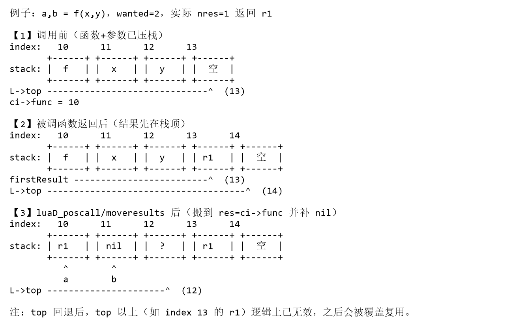
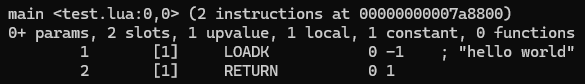
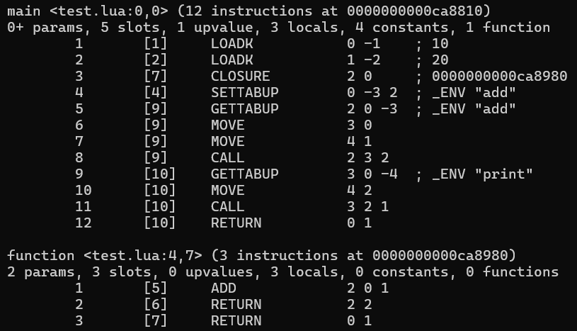

**<center><BBBG>lua5.3.6源码解析</BBBG></center>**

<!-- TOC -->

- [注意事项](#注意事项)
- [关键数据结构](#关键数据结构)
  - [lua\_State / global\_State](#lua_state--global_state)
  - [LexState / FuncState](#lexstate--funcstate)
    - [SParser](#sparser)
    - [Proto](#proto)
    - [CallInfo](#callinfo)
    - [Token](#token)
      - [SemInfo](#seminfo)
  - [\_ENV](#_env)
    - [沙箱机制](#沙箱机制)
- [常用函数](#常用函数)
  - [`index2addr`](#index2addr)
- [数据结构](#数据结构)
  - [数据结构基础](#数据结构基础)
    - [类型](#类型)
    - [GC](#gc)
  - [字符串](#字符串)
    - [`luaS_newlstr`](#luas_newlstr)
      - [短字符串](#短字符串)
      - [长字符串](#长字符串)
    - [c API](#c-api)
      - [`luaS_newliteral`](#luas_newliteral)
      - [`luaS_new`](#luas_new)
      - [`luaX_newstring`](#luax_newstring)
      - [`luaK_stringK`](#luak_stringk)
    - [lua API](#lua-api)
      - [`lua_pushstring`/`lua_pushlstring`](#lua_pushstringlua_pushlstring)
      - [`lua_tostring`/`lua_tolstring`](#lua_tostringlua_tolstring)
      - [`lua_rawlen`](#lua_rawlen)
    - [使用实例](#使用实例)
      - [词法解析器](#词法解析器)
      - [语法解析器](#语法解析器)
  - [表](#表)
    - [哈希部分](#哈希部分)
      - [哈希值](#哈希值)
      - [冲突链遍历](#冲突链遍历)
    - [`luaH_set`](#luah_set)
      - [`luaH_get`](#luah_get)
      - [`luaH_newkey`](#luah_newkey)
      - [`rehash`](#rehash)
    - [遍历](#遍历)
      - [`luaH_next`](#luah_next)
      - [`lua_next`](#lua_next)
      - [`luaB_next`](#luab_next)
      - [pairs/ipairs迭代](#pairsipairs迭代)
        - [`luaB_pairs`](#luab_pairs)
        - [`luaB_ipairs`](#luab_ipairs)
        - [VM for循环](#vm-for循环)
    - [c API](#c-api-1)
      - [`luaH_new`](#luah_new)
      - [`luaV_gettable`](#luav_gettable)
      - [`luaV_settable`](#luav_settable)
    - [lua API](#lua-api-1)
      - [`lua_createtable`](#lua_createtable)
      - [`lua_gettable`](#lua_gettable)
      - [`lua_settable`](#lua_settable)
      - [`lua_rawget`](#lua_rawget)
      - [`lua_rawset`](#lua_rawset)
    - [使用实例](#使用实例-1)
- [函数执行](#函数执行)
  - [函数执行](#函数执行-1)
  - [安全执行（异常处理）](#安全执行异常处理)
- [编译与虚拟机执行流程](#编译与虚拟机执行流程)
  - [启动](#启动)
    - [命令行启动](#命令行启动)
    - [嵌入](#嵌入)
  - [编译期](#编译期)
    - [二进制反序列化](#二进制反序列化)
    - [文本编译](#文本编译)
      - [mainfunc](#mainfunc)
      - [总览](#总览)
  - [执行期](#执行期)
    - [虚拟机执行](#虚拟机执行)
  - [示例](#示例)
- [闭包](#闭包)
  - [upvalue判定](#upvalue判定)
  - [开启情况](#开启情况)
  - [`openupval`](#openupval)
    - [`luaF_findupval`](#luaf_findupval)
    - [`luaF_close`](#luaf_close)
- [元表](#元表)
- [load](#load)

<!-- /TOC -->

---
---
---

# 注意事项

- lua的c代码可以分为lua层和c层：
  - c层：通常为`lua_XXX()`/`luaL_XXX()`
  - lua层：每个模块都有自己的名字，如字符串相关就是`luaS_XXX()`
- lua层API源码都带有LUA_API标识，如：
  `LUA_API const char *lua_pushlstring (lua_State *L, const char *s, size_t len)`

---
---
---

# 关键数据结构

lua源码中数据结构众多，涉及面广很容易忘记，但是本质上重要的其实并不算太多

## lua_State / global_State

启动处：`lua_newstate()`
lua_State：luaVM线程（执行上下文）
global_State：luaVM共享部分

``` c
LUA_API lua_State *lua_newstate (lua_Alloc f, void *ud) {
  int i;
  lua_State *L;
  global_State *g;
  LG *l = cast(LG *, (*f)(ud, NULL, LUA_TTHREAD, sizeof(LG)));
  if (l == NULL) return NULL;
  L = &l->l.l;
  g = &l->g;
  L->next = NULL;
  L->tt = LUA_TTHREAD;
  g->currentwhite = bitmask(WHITE0BIT);
  L->marked = luaC_white(g);
  preinit_thread(L, g);
  g->frealloc = f;
  g->ud = ud;
  g->mainthread = L;
  g->seed = makeseed(L);
  g->gcrunning = 0;  /* no GC while building state */
  g->GCestimate = 0;
  g->strt.size = g->strt.nuse = 0;
  g->strt.hash = NULL;
  setnilvalue(&g->l_registry);
  g->panic = NULL;
  g->version = NULL;
  g->gcstate = GCSpause;
  g->gckind = KGC_NORMAL;
  g->allgc = g->finobj = g->tobefnz = g->fixedgc = NULL;
  g->sweepgc = NULL;
  g->gray = g->grayagain = NULL;
  g->weak = g->ephemeron = g->allweak = NULL;
  g->twups = NULL;
  g->totalbytes = sizeof(LG);
  g->GCdebt = 0;
  g->gcfinnum = 0;
  g->gcpause = LUAI_GCPAUSE;
  g->gcstepmul = LUAI_GCMUL;
  for (i=0; i < LUA_NUMTAGS; i++) g->mt[i] = NULL;
  if (luaD_rawrunprotected(L, f_luaopen, NULL) != LUA_OK) {
    /* memory allocation error: free partial state */
    close_state(L);
    L = NULL;
  }
  return L;
}
```

<B>重点1：`g->mainthread = L;`</B>
<B><VT>lua_State被作为主线程存在</VT></B>
<B>简单理解：</B>
`g->mainthread`可以理解为<B>唯一不变的</B>，`lua_newstate()`创建出来就是唯一主线程，如需其它线程，通过`lua_newthread()`创建（携程也是）

<B>重点2：`g->seed = makeseed(L);`</B>
<B><VT>哈希种子在初始化阶段会创建</VT></B>

``` c
static unsigned int makeseed (lua_State *L) {
  char buff[4 * sizeof(size_t)];
  unsigned int h = luai_makeseed();
  int p = 0;
  addbuff(buff, p, L);  /* heap variable */
  addbuff(buff, p, &h);  /* local variable */
  addbuff(buff, p, luaO_nilobject);  /* global variable */
  addbuff(buff, p, &lua_newstate);  /* public function */
  lua_assert(p == sizeof(buff));
  return luaS_hash(buff, p, h);
}

#define luai_makeseed()		cast(unsigned int, time(NULL))
```

即：<B><VT>以时间作为基础种子，结合不同的地址，进行哈希函数</VT></B>
<B><DRD>注意：lua的seed不够安全，仅作为随机种子存在</DRD></B>

<B>重点3：`lua_newstate()`不止创建了一个lua_State</B>
主线程lua_State只是lua虚拟机中最重要的部分之一，具体结构如下：

``` txt
LG
├─ LX
│  ├─ extra_[LUA_EXTRASPACE]
│  └─ lua_State l   // 主线程
└─ global_State g   // 整个 VM 共享状态
```

``` c
typedef struct LG {
  LX l;
  global_State g;
} LG;

typedef struct LX {
  lu_byte extra_[LUA_EXTRASPACE];
  lua_State l;
} LX;
```

- LG：lua_State + global_State
- LX：extra + lua_State，即带额外空间的lua_State

所以：
<B><VT>本质上`lua_newstate()`创建的是LG数据结构，其中包含了主线程lua_State以及共享global_State并预留了一块额外空间（放指针）</VT></B>

<B>`f_luaopen()`</B>
`lua_newstate()`具有大量的初始化操作，两个数据结构中内容众多
真正的设置其实只有`f_luaopen()`：

``` c
static void f_luaopen (lua_State *L, void *ud) {
  global_State *g = G(L);
  UNUSED(ud);
  stack_init(L, L);  /* init stack */
  init_registry(L, g);
  luaS_init(L);
  luaT_init(L);
  luaX_init(L);
  g->gcrunning = 1;  /* allow gc */
  g->version = lua_version(NULL);
  luai_userstateopen(L);
}
```

- `stack_init()`：初始化stack相关
  - 之所以传入2个相同的L，是因为在内部语义不同：
    在`lua_newthread()`中有：`stack_init(L1, L);`，显然：
    - 左`L1`：需初始化的对象
    - 右`L`：上下文线程（实际会调用`luaM_newvector()`进行分配stack）
- `init_registry()`：创建注册表，并设置到g->l_registry上
  - `registry[LUA_RIDX_MAINTHREAD]`：主线程L
  - `registry[LUA_RIDX_GLOBALS]`：全局表（目前为空，`luaL_openlibs()`会注册标准库）
- `luaS_init()`：初始化字符串
  - `g->memerrmsg`：预留错误信息，防止内存不足创建不出来
  - `g->strcache`：字符串缓存（先用`g->memerrmsg`作为哨兵占位）
- `luaT_init()`：初始化元方法名表
  - `g->tmname`：元表名缓存
- `luaX_init()`：初始化词法保留字系统
  - `_ENV`预创建（`#define LUA_ENV		"_ENV"`）
  - 保留字预创建，并设置`ts->extra`为非0值

## LexState / FuncState

从名字上来看，和lua_State / global_State是一类内容
作为解析流程的两个数据结构，用于`luaY_parser()`

- LexState：编译上下文（读取进度/token状态）
  核心是词法分析阶段，语法分析阶段也会借用数据，直到`luaY_parser()`结束
  <VT>LexState中会指向一个FuncState</VT>
- FuncState：当前函数的生成上下文（编译进度/寄存器状态/局部变量跳转处理）

### SParser

SParser是用于call的数据组合体（毕竟call函数里只有一个位置存放）
本质上是用于f_parser函数（调用者`luaD_protectedparser()`）的：

``` c
struct SParser {  /* data to 'f_parser' */
  ZIO *z;
  Mbuffer buff;  /* dynamic structure used by the scanner */
  Dyndata dyd;  /* dynamic structures used by the parser */
  const char *mode;
  const char *name;
};
```

- ZIO：读取流，用于不断读取字节
- Mbuffer：缓冲，用于拼token
- Dyndata：动态数据
  - actvar：当前活跃局部变量（作用域下还活着的局部变量）
  - gt：待解析goto列表，后续`::x::`可跳转
  - label：可见label列表，检测重复label

这些数据基本都是直接提供给LexState/FuncState

### Proto

Proto是编译后得到的结果，后续在执行中会转换为CallInfo（由`luaD_precall()`完成）
Proto数据众多，核心有：

- `TValue *k`：常量表
- `int *code`：指令
- `struct Proto **p`：子Proto
- `LocVar *locvars`：局部变量信息
- `Upvaldesc *upvalues`：上值信息

### CallInfo

CallInfo指的是函数调用时上下文，是虚拟机执行所需要的数据，由Proto得来由`luaD_precall()`完成）
<B>lua_State</B>需要该类型数据：
`CallInfo *ci;  /* call info for current function */`
`CallInfo base_ci;  /* CallInfo for first level (C calling Lua) */`
<B><VT>在编译期间，两者只是占位，直到执行</VT></B>

### Token

在编译途中，<B><VT>最小语法单位</VT></B>就被称之为<B><GN>token</GN></B>

``` c
typedef struct Token {
  int token;
  SemInfo seminfo;
} Token;
```

简单来说就是读取过程中读到的信息

#### SemInfo

SemInfo是作为<B><VT>Token的附加信息</VT></B>存在的

``` c
typedef union {
  lua_Number r;
  lua_Integer i;
  TString *ts;
} SemInfo;  /* semantics information */
```

也就是说：如果token代表着一个值（TK_NUMBER/TK_STRING/TK_NAME），则会记录

## _ENV

流程如下：

- 初始化`luaX_init()`时会进行`TString *e = luaS_newliteral(L, LUA_ENV);`
  即：创建一个不会被GC回收的`_ENV`（因为会`luaC_fix()`所以不会被回收）
- 解析`mainfunc()`时，会：
  `init_exp(&v, VLOCAL, 0);`
  `newupvalue(fs, ls->envn, &v);`
  即：给主函数Proto添加一个upvalue，名为`_ENV`
- `luaY_parser()`流程结束后，会：
  `luaF_initupvals(L, cl);`
  即：封闭upvalue并设为nil
- 在`luaD_protectedparser()`解析完成后，有：

  ``` c
  LClosure *f = clLvalue(L->top - 1);  /* get newly created function */
  if (f->nupvalues >= 1) {  /* does it have an upvalue? */
    /* get global table from registry */
    Table *reg = hvalue(&G(L)->l_registry);
    const TValue *gt = luaH_getint(reg, LUA_RIDX_GLOBALS);
    /* set global table as 1st upvalue of 'f' (may be LUA_ENV) */
    setobj(L, f->upvals[0]->v, gt);
    luaC_upvalbarrier(L, f->upvals[0]);
  }
  ```

  即：全局表`registry[LUA_RIDX_GLOBALS]`设置到主闭包第一个upvalue（`_ENV`）
  <B><DRD>注意：此时依旧没有设置具体的值，在执行期才会设置</DRD></B>

使用方式：
`luaX_setinput()`会记录`_ENV`到`LexState->envn`中
解析时会进入`singlevar()`，如果逐层寻找local/upvalue没找到，就会作为全局名使用，调用`luaK_indexed()`设置指令

### 沙箱机制

``` c
local _ENV = sandbox
function f()
  return print
end
```

由于`_ENV`被遮蔽，`f()`不再获得原始表，而是`sandbox.print`

---
---
---

# 常用函数

总有些函数是出现在各个模块之中的，这里简单介绍一下

## `index2addr`

``` c
static TValue *index2addr (lua_State *L, int idx) {
  CallInfo *ci = L->ci;
  if (idx > 0) {
    TValue *o = ci->func + idx;
    api_check(L, idx <= ci->top - (ci->func + 1), "unacceptable index");
    if (o >= L->top) return NONVALIDVALUE;
    else return o;
  }
  else if (!ispseudo(idx)) {  /* negative index */
    api_check(L, idx != 0 && -idx <= L->top - (ci->func + 1), "invalid index");
    return L->top + idx;
  }
  else if (idx == LUA_REGISTRYINDEX)
    return &G(L)->l_registry;
  else {  /* upvalues */
    idx = LUA_REGISTRYINDEX - idx;
    api_check(L, idx <= MAXUPVAL + 1, "upvalue index too large");
    if (ttislcf(ci->func))  /* light C function? */
      return NONVALIDVALUE;  /* it has no upvalues */
    else {
      CClosure *func = clCvalue(ci->func);
      return (idx <= func->nupvalues) ? &func->upvalue[idx-1] : NONVALIDVALUE;
    }
  }
}
```

`index2addr()`：idx转实际TValue指针
简单来说有3类：

- 正索引：从当前函数向后数
- 负索引：从栈顶向下数
- 伪索引：特殊的索引值
  - 注册表LUA_REGISTRYINDEX
  - upvalue索引

<B><VT>Tip：`L->top`不是栈顶而是栈顶后下一个可用位置</VT></B>

# 数据结构

在lua中，数据结构具有一定的封装，最常见在源码中见到的就是TValue

## 数据结构基础

<B><GN>TValue</GN></B>即值，是lua最关键的一层封装：

``` c
typedef struct lua_TValue {
  TValuefields;
} TValue;

#define TValuefields	Value value_; int tt_

typedef union Value {
  GCObject *gc;    /* collectable objects */
  void *p;         /* light userdata */
  int b;           /* booleans */
  lua_CFunction f; /* light C functions */
  lua_Integer i;   /* integer numbers */
  lua_Number n;    /* float numbers */
} Value;
```

可以看到TValue由2字段组成：

- `Value value_`：值本身
- `int tt_`：type

<B><BL>问题：为什么要封装成TValue</BL></B>
<BL>因为lua是动态类型语言，变量类型随时可变，只靠Value是无法知道当前存储类型的，所以需要额外数据`tt_`</BL>

- 判断：`ttisxxx()`

``` c
// 以整数为例
#define rttype(o)	((o)->tt_)
#define checktag(o,t)		(rttype(o) == (t))
#define ttisinteger(o) checktag((o), LUA_TNUMINT)
```

- 写：`setxxxvalue()`/`chgxxxvalue()`

``` c
// 以整数为例
// 更改为整数类型
#define setivalue(obj,x) \
  { TValue *io=(obj); val_(io).i=(x); settt_(io, LUA_TNUMINT); }
// 更改整数类型的值
#define chgivalue(obj,x) \
  { TValue *io=(obj); lua_assert(ttisinteger(io)); val_(io).i=(x); }

// 如TString这种GCObject没有chg
#define setsvalue(L,obj,x) \
  { TValue *io = (obj); TString *x_ = (x); \
    val_(io).gc = obj2gco(x_); settt_(io, ctb(x_->tt)); \
    checkliveness(L,io); }
```

- 读：`xxxvalue()`

``` c
// 以整数为例
#define ivalue(o) check_exp(ttisinteger(o), val_(o).i)
```

- 复制：`setobj()`

``` c
#define setobj(L,obj1,obj2) \
	{ TValue *io1=(obj1); *io1 = *(obj2); \
	  (void)L; checkliveness(L,io1); }
```

<B><VT>注意：浅拷贝，对于引用类型仅复制引用</VT></B>

``` lua
a = {}
b = a -- 此时a和b都指向同一个table
```

### 类型

在lua.h中有所定义：

``` c
#define LUA_TNONE		(-1)

#define LUA_TNIL		        0
#define LUA_TBOOLEAN		1
#define LUA_TLIGHTUSERDATA	2
#define LUA_TNUMBER		3
#define LUA_TSTRING		4
#define LUA_TTABLE		5
#define LUA_TFUNCTION		6
#define LUA_TUSERDATA		7
#define LUA_TTHREAD		8

#define LUA_NUMTAGS		9
```

注意：LUA_XXX并非完整`tt_`，在lobject.h有注释：

``` c
/*
** tags for Tagged Values have the following use of bits:
** bits 0-3: actual tag (a LUA_T* value)
** bits 4-5: variant bits
** bit 6: whether value is collectable
*/
```

在lobject.h可以看到：

``` c
/* Variant tags for functions */
#define LUA_TLCL	(LUA_TFUNCTION | (0 << 4))  /* Lua closure */
#define LUA_TLCF	(LUA_TFUNCTION | (1 << 4))  /* light C function */
#define LUA_TCCL	(LUA_TFUNCTION | (2 << 4))  /* C closure */
/* Variant tags for strings */
#define LUA_TSHRSTR	(LUA_TSTRING | (0 << 4))  /* short strings */
#define LUA_TLNGSTR	(LUA_TSTRING | (1 << 4))  /* long strings */
/* Variant tags for numbers */
#define LUA_TNUMFLT	(LUA_TNUMBER | (0 << 4))  /* float numbers */
#define LUA_TNUMINT	(LUA_TNUMBER | (1 << 4))  /* integer numbers */
/* Bit mark for collectable types */
#define BIT_ISCOLLECTABLE	(1 << 6)
```

即<B><VT>对于某些类型，会派生出细分类型</VT></B>
对于这些派生类型，创建时就会直接用上，如：
`ts = createstrobj(L, l, LUA_TSHRSTR, h);`
对于可GC类型，需要通过`ctb()`宏额外补充：
`#define ctb(t) ((t) | BIT_ISCOLLECTABLE)`
对于TValue设置类操作（如：`setsvalue()`）就会进行设置

具体操作如下：

- 获取：

``` c
#define rttype(o)	((o)->tt_) // 完整tt_(0-6位)
#define ttype(o)	(rttype(o) & 0x3F) // 基础类型+派生类型(0-5位)
#define ttnov(o)	(novariant(rttype(o))) // 基础类型(0-3位)

#define novariant(x)	((x) & 0x0F)
```

- 设置：在`setxxxvalue()`中会进行设置（第一次设置或类型改变）

### GC

对于需要回收的类型，会使用<B><GN>GCObject</GN></B>：

``` c
typedef struct GCObject GCObject;
struct GCObject {
  CommonHeader;
};

#define CommonHeader GCObject *next; lu_byte tt; lu_byte marked
```

<B><BL>问题：关于`TValue.tt_` / `GCObject.tt`</BL></B>
<BL>对于GCObject来说，自身已经完全说明是带有GC的，所以tt不会存储第6位BIT_ISCOLLECTABLE信息</BL></B>

GCObject是一个<B><VT>公共头</VT></B>，具体有以下对象：

- TString
- Table
- Udata
- Proto
- Closure
- lua_State

<B><BL>问题：GCObject与TValue的关系</BL></B>
<BL>某些TValue（就是GC类型）会指向GCObject</BL>
<YL><B>举例</B>：TString是一个字符串对象，在lua中字符串是可复用的，某一个TString可能被多个TValue所引用</YL>
即：<B><VT>TValue是栈变量（也可能是单独的一个值），GCObject就是堆内存</VT></B>

---

## 字符串

字符串是lua中核心的数据类型
对应结构<B><GN>TString</GN></B>：

``` c
typedef struct TString {
  CommonHeader;
  lu_byte extra;  /* reserved words for short strings; "has hash" for longs */
  lu_byte shrlen;  /* length for short strings */
  unsigned int hash;
  union {
    size_t lnglen;  /* length for long strings */
    struct TString *hnext;  /* linked list for hash table */
  } u;
} TString;
```

根据注释可知：TString包含短字符串与长字符串两种，两种实际结构不同

- 共有
  - hash：字符串哈希
- 短字符串
  - extra：保留字
  - shrlen：长度
  - u.hnext：桶链表指针
- 长字符串
  - extra："是否已算过hash"的标记
  - u.lnglen：长度

<B>重点：</B>
<B><VT>TString本身不带有字节数据（也就是说TString是字符串头），字节数据紧跟在<GN>UTString</GN>后</B>

``` c
typedef union UTString {
  L_Umaxalign dummy;  /* ensures maximum alignment for strings */
  TString tsv;
} UTString;
```

``` txt
地址 ts
┌──────────────────────────────┐
│ UTString (含 TString 头部)    │  sizeof(UTString)
└──────────────────────────────┘
┌──────────────────────────────┐
│ 字节数据 char[0..len-1]       │  len 字节（可包含 '\0'）
├──────────────────────────────┤
│ 结尾 '\0'                     │  额外 1 字节
└──────────────────────────────┘
```

所以可以看到取字符串宏`getstr()`是这么用的：
`#define getstr(ts)  \`
`check_exp(sizeof((ts)->extra), cast(char *, (ts)) + sizeof(UTString))`

<BR>

### `luaS_newlstr`

``` csharp
TString *luaS_newlstr (lua_State *L, const char *str, size_t l) {
  if (l <= LUAI_MAXSHORTLEN)  /* short string? */
    return internshrstr(L, str, l);
  else {
    TString *ts;
    if (l >= (MAX_SIZE - sizeof(TString))/sizeof(char))
      luaM_toobig(L);
    ts = luaS_createlngstrobj(L, l);
    memcpy(getstr(ts), str, l * sizeof(char));
    return ts;
  }
}
```

`luaS_newlstr()`：<B><VT>字符串创建，是核心</VT></B>
这里也能看到字符串的长短分类，其中：
<B><VT>宏`LUAI_MAXSHORTLEN`区分了长短字符串的长度，界限为40</VT></B>

<B><BL>问题：长字符串/短字符串的区别</BL></B>
<BL>短字符串是驻留的，由`g->strt`拉链法哈希桶完成缓存
长字符串不会驻留
<B><VT>因为：查重具有成本，长字符串不合适，同时全存的话压力会很大
驻留的优势：可通过地址比较（2个TValue指向同一TString）</VT></B></BL>
无论是长字符串还是短字符串，都需要创建TString（GCObject的扩展），方法为`createstrobj()`：

``` c
static TString *createstrobj (lua_State *L, size_t l, int tag, unsigned int h) {
  TString *ts;
  GCObject *o;
  size_t totalsize;  /* total size of TString object */
  totalsize = sizelstring(l);
  o = luaC_newobj(L, tag, totalsize);
  ts = gco2ts(o);
  ts->hash = h;
  ts->extra = 0;
  getstr(ts)[l] = '\0';  /* ending 0 */
  return ts;
}
```

<B><DRD>注意：`createstrobj()`仅进行TString对象的创建，并不会填充字符串内容</DRD></B>
简单来说，流程就是：

- 计算分配大小
- 分配内存（交给GC管理）
- GCObject转TString
- TString基础初始化

在后续长字符串/短字符串会进行各自所需要设置的内容
<B><VT>同理其它GCObject（如table）</VT></B>

#### 短字符串

短字符串走的是`internshrstr()`：

``` c
static TString *internshrstr (lua_State *L, const char *str, size_t l) {
  TString *ts;
  global_State *g = G(L);
  unsigned int h = luaS_hash(str, l, g->seed);
  TString **list = &g->strt.hash[lmod(h, g->strt.size)];
  lua_assert(str != NULL);  /* otherwise 'memcmp'/'memcpy' are undefined */
  for (ts = *list; ts != NULL; ts = ts->u.hnext) {
    if (l == ts->shrlen &&
        (memcmp(str, getstr(ts), l * sizeof(char)) == 0)) {
      /* found! */
      if (isdead(g, ts))  /* dead (but not collected yet)? */
        changewhite(ts);  /* resurrect it */
      return ts;
    }
  }
  if (g->strt.nuse >= g->strt.size && g->strt.size <= MAX_INT/2) {
    luaS_resize(L, g->strt.size * 2);
    list = &g->strt.hash[lmod(h, g->strt.size)];  /* recompute with new size */
  }
  ts = createstrobj(L, l, LUA_TSHRSTR, h);
  memcpy(getstr(ts), str, l * sizeof(char));
  ts->shrlen = cast_byte(l);
  ts->u.hnext = *list;
  *list = ts;
  g->strt.nuse++;
  return ts;
}
```

- 核心1：复用（哈希桶）
  - 使用`luaS_hash()`计算哈希值
    - `g->seed`会在`lua_newstate()`进行初始化，这也意味着`g->seed`仅存在一个值且不会变化
  - 获取桶：`TString **list = &g->strt.hash[lmod(h, g->strt.size)];`
    - `&g->strt`：stringtable类型，是<B><VT>全局的驻留短字符串</VT></B>
  - 尝试在桶中找到TString
- 核心2：扩容
  - 如果负载过高（`g->strt`用超了或但还没到达上限（MAX_INT/2））则会调用`luaS_resize()`扩表
- 核心3：设置
  - 如果前面找不到复用就会创一个新的

    ``` c
    ts = createstrobj(L, l, LUA_TSHRSTR, h); // 创建短字符串
    memcpy(getstr(ts), str, l * sizeof(char)); // 拷贝值
    ts->shrlen = cast_byte(l); // 设置长度
    // 头插法（TString已入链表）
    ts->u.hnext = *list;
    *list = ts;
    ```

在哈希计算中提到了驻留intern，这与`internshrstr()`对应<VT>（所以intern指的其实是驻留而非内部）</VT>
<B><GN>stringtable</GN></B>可以说是专用于短字符串驻留的数据结构，具体结构如下：

``` c
typedef struct stringtable {
  TString **hash;
  int nuse;  /* number of elements */
  int size;
} stringtable;
```

<B><BL>问题：nuse和size的区别</BL></B>
<BL>其实很明确，nuse即已存在数量，size为桶大小</BL>
可以看到`hash`是TString**类型，即数组，这与哈希计算可以对应上，即<B><GN>拉链法</GN></B>哈希冲突方案

#### 长字符串

长字符串走的是`luaS_createlngstrobj()`：

``` c
TString *luaS_createlngstrobj (lua_State *L, size_t l) {
  TString *ts = createstrobj(L, l, LUA_TLNGSTR, G(L)->seed);
  ts->u.lnglen = l;
  return ts;
}
```

设置值被放在了外面：`memcpy(getstr(ts), str, l * sizeof(char));`

### c API

前面的`luaS_newlstr()`就是c API的最核心部分，同时也存在不同情况下的扩展

#### `luaS_newliteral`

``` c
#define luaS_newliteral(L, s)	(luaS_newlstr(L, "" s, \
                                (sizeof(s)/sizeof(char))-1))
```

`luaS_newliteral()`：字面量版`luaS_newlstr()`，本质没区别
<B><BL>问题：`"" s`是什么</BL></B>
<BL>在c中，`"abc" "dec"`会自动拼接为`"abcdef"`，所以这里就其实是s，只要s是字符串字面量`</BL>

#### `luaS_new`

``` c
TString *luaS_new (lua_State *L, const char *str) {
  unsigned int i = (str) % STRCACHE_N;  /* hash */
  int j;
  TString **p = G(L)->strcache[i];
  for (j = 0; j < STRCACHE_M; j++) {
    if (strcmp(str, getstr(p[j])) == 0)  /* hit? */
      return p[j];  /* that is it */
  }
  /* normal route */
  for (j = STRCACHE_M - 1; j > 0; j--)
    p[j] = p[j - 1];  /* move out last element */
  /* new element is first in the list */
  p[0] = luaS_newlstr(L, str, strlen(str));
  return p[0];
}
```

`luaS_new()`：<B><VT>在`luaS_newlstr()`的基础上添加额外缓存`G(L)->strcache`</VT></B>
<B><DRD>重要：</DRD></B>
<DRD>`strcache`是额外的一层前置缓存，如果没有获取到，还是会走`luaS_newlstr()`，即短字符串有缓存</DRD>

`strcache`是一个TString二维数组，容量[53][2]，即<VT>53个桶，每个桶2个槽</VT>
<B>哈希计算：</B>
`% STRCACHE_N`很好理解，就是映射到桶里，那么真正的哈希就是`point2uint()`：
`#define point2uint(p)	((unsigned int)((size_t)(p) & UINT_MAX))`
从名字就可以知道，是指针到uint的映射，指针作为hash虽然效果不好，但在这里已经够用了

#### `luaX_newstring`

``` c
TString *luaX_newstring (LexState *ls, const char *str, size_t l) {
  lua_State *L = ls->L;
  TValue *o;  /* entry for 'str' */
  TString *ts = luaS_newlstr(L, str, l);  /* create new string */
  setsvalue2s(L, L->top++, ts);  /* temporarily anchor it in stack */
  o = luaH_set(L, ls->h, L->top - 1);
  if (ttisnil(o)) {  /* not in use yet? */
    /* boolean value does not need GC barrier;
       table has no metatable, so it does not need to invalidate cache */
    setbvalue(o, 1);  /* t[string] = true */
    luaC_checkGC(L);
  }
  else {  /* string already present */
    ts = tsvalue(keyfromval(o));  /* re-use value previously stored */
  }
  L->top--;  /* remove string from stack */
  return ts;
}
```

`luaX_newstring()`：<B><VT>编译期字符串创建</VT></B>
该函数<B><DRD>仅用于编译期</DRD></B>，在llex.c/lparser.c中出现
简单来说，就是<B><VT>`luaS_newlstr()`在编译期的一层封装</VT></B>
<B>简单理解：</B>
<B><VT>新字符串临时压栈防GC，后续存到lua_State->h表中真正锚定
作用是对于长字符串同样驻留（`luaS_newlstr()`不驻留），同时长短字符串都不被GC回收（被表引用）</VT></B>

#### `luaK_stringK`

``` c
int luaK_stringK (FuncState *fs, TString *s) {
  TValue o;
  setsvalue(fs->ls->L, &o, s);
  return addk(fs, &o, &o);
}

static int addk (FuncState *fs, TValue *key, TValue *v) {
  lua_State *L = fs->ls->L;
  Proto *f = fs->f;
  TValue *idx = luaH_set(L, fs->ls->h, key);  /* index scanner table */
  int k, oldsize;
  if (ttisinteger(idx)) {  /* is there an index there? */
    k = cast_int(ivalue(idx));
    /* correct value? (warning: must distinguish floats from integers!) */
    if (k < fs->nk && ttype(&f->k[k]) == ttype(v) &&
                      luaV_rawequalobj(&f->k[k], v))
      return k;  /* reuse index */
  }
  /* constant not found; create a new entry */
  oldsize = f->sizek;
  k = fs->nk;
  /* numerical value does not need GC barrier;
     table has no metatable, so it does not need to invalidate cache */
  setivalue(idx, k);
  luaM_growvector(L, f->k, k, f->sizek, TValue, MAXARG_Ax, "constants");
  while (oldsize < f->sizek) setnilvalue(&f->k[oldsize++]);
  setobj(L, &f->k[k], v);
  fs->nk++;
  luaC_barrier(L, f, v);
  return k;
}
```

`luaK_stringK`：<B><VT>登记TString到Proto常量表中</VT></B>
可以看到本质上其实是在执行`addk()`：

- TString转TValue
- 查缓存，验证通过就使用
- 无缓存，先扩容，写入`Proto->k[k]`
- 返回索引k

### lua API

除了以上的c API，对外API也有很多

简单介绍一下不常用的：

- `lua_pushfstring()`：基于...的format版
- `lua_pushvfstring()`：基于va_list的format版

#### `lua_pushstring`/`lua_pushlstring`

``` c
LUA_API const char *lua_pushstring (lua_State *L, const char *s) {
  lua_lock(L);
  if (s == NULL)
    setnilvalue(L->top);
  else {
    TString *ts;
    ts = luaS_new(L, s);
    setsvalue2s(L, L->top, ts);
    s = getstr(ts);  /* internal copy's address */
  }
  api_incr_top(L);
  luaC_checkGC(L);
  lua_unlock(L);
  return s;
}
```

用法：`lua_pushstring(L, "hello");`
功能：字符串压栈

``` c
LUA_API const char *lua_pushlstring (lua_State *L, const char *s, size_t len) {
  TString *ts;
  lua_lock(L);
  ts = (len == 0) ? luaS_new(L, "") : luaS_newlstr(L, s, len);
  setsvalue2s(L, L->top, ts);
  api_incr_top(L);
  luaC_checkGC(L);
  lua_unlock(L);
  return getstr(ts);
}
```

用法：
`const char buf[] = {'a', 'b', '\0', 'c'};`
`lua_pushlstring(L, buf, 4);` <VT>当然直接给字符也行</VT>
功能：字符串（明确长度）压栈

<B><VT>注意：</VT></B>
<VT>入栈由`setvalue`+`api_incr_top()`完成，`setvalue`仅完成了往栈顶位置赋值操作，但还需要`L->top++`才算真正完成</VT>

<B><BL>问题：`lua_pushstring()`/`lua_pushlstring()`的区别</BL></B>
<BL>l指的是length，即指定长度操作
对于`lua_pushstring()`来说，会依靠`\0`确定字符串结束位置，这会导致字符串中不能带`\0`，否则会在中间停下
对于`lua_pushlstring()`来说，仅依靠len，所以如果是"abcdef"，长度为4则字符串会变为`"abcd"`，同时字符中也可以带有`\0`</BL>

#### `lua_tostring`/`lua_tolstring`

``` c
LUA_API const char *lua_tolstring (lua_State *L, int idx, size_t *len) {
  StkId o = index2addr(L, idx);
  if (!ttisstring(o)) {
    if (!cvt2str(o)) {  /* not convertible? */
      if (len != NULL) *len = 0;
      return NULL;
    }
    lua_lock(L);  /* 'luaO_tostring' may create a new string */
    luaO_tostring(L, o);
    luaC_checkGC(L);
    o = index2addr(L, idx);  /* previous call may reallocate the stack */
    lua_unlock(L);
  }
  if (len != NULL)
    *len = vslen(o);
  return svalue(o);
}
```

用法：

``` c
size_t len;
const char *s = lua_tolstring(L, 1, &len);
if (s != NULL) {
  /* s 指向 Lua 内部字符串，长度是 len */
}
```

功能：读取（不弹栈）指定栈位置的指并获取长度
根据代码所示：<VT>对于非string且不可转换为string的类型是无法操作的</VT>
`#define cvt2str(o)	ttisnumber(o)` <B><VT>Tip：可以设置宏禁止转换</VT></B>
更精准地来讲：

- 常规情况来说，就是用于获取string的，只有string类型才能获取
- 额外支持了number情况，会转换为string后返回<B><DRD>（这意味着该栈元素被直接转换为string了）</DRD></B>

<BR>

`#define lua_tostring(L,i)	lua_tolstring(L, (i), NULL)`
所以说`lua_tostring()`只是`lua_tolstring()`的不求长度版
这意味着：<B><VT>`lua_tostring()`仅应该用于不带有`\0`的字符串，否则后续没有长度无法辨别（使用c函数时）</VT></B>

#### `lua_rawlen`

``` c
LUA_API size_t lua_rawlen (lua_State *L, int idx) {
  StkId o = index2addr(L, idx);
  switch (ttype(o)) {
    case LUA_TSHRSTR: return tsvalue(o)->shrlen;
    case LUA_TLNGSTR: return tsvalue(o)->u.lnglen;
    case LUA_TUSERDATA: return uvalue(o)->len;
    case LUA_TTABLE: return luaH_getn(hvalue(o));
    default: return 0;
  }
}
```

### 使用实例

#### 词法解析器

词法解析器的核心是`llex()`，其中就有对字符串情况的解析：

``` c
case '-': {  /* '-' or '--' (comment) */
}
case '[': {  /* long string or simply '[' */
}
case '"': case '\'': {  /* short literal strings */
}
default: {
  if (lislalpha(ls->current)) {  /* identifier or reserved word? */
  }
}
```

也就是：

- `-- comment`：注释，调用`read_long_string()`
- `[[hello]]`：长字符串字面量，调用`read_long_string()`
- `"abc"`：字符串字面量，调用`read_string()`
- `foo`：标识符，直接调用`luaX_newstring()`

无论如何，本质上都是调用`luaX_newstring()`，最终读完的信息会被保存到`seminfo->ts`中

#### 语法解析器

词法解析器会完成按顺序完成对字符的解析，都会存入`seminfo->ts`中
在语法解析器中：

- 走`codestring()`，登记到`Proto->k`
  - 字符串字面量：`"a"`/`[[hello]]`（TK_STRING）
  - 全局变量：`foo = 1`的foo（`singlevar()`）
  - 点号访问：`t.foo`的foo（`fieldsel()`）
  - 冒号访问：`t:move()`的move（`fieldsel()`）
  - 表字段名：`t = {x = 1}`的x（`recfield()`）
- 走`new_localvar()`，登记到`Proto->locvars[i].varname`
  - 局部变量名：`x`
  - 局部函数名：`local function foo() end`的foo
  - 其它局部情况：for循环变量/形参
- 走`newupvalue()`，登记到`Proto->upvalues[].name`

简记：
<B><VT>如果运行时需要拿出来用，则需要放在`Proto->k`中，否则存在其它临时调试处即可</VT></B>

---

## 表

表是lua中核心的数据类型
核心：<B><VT>Lua中的Table是数组+哈希结合</VT></B>

``` c
typedef struct Table {
  CommonHeader;
  lu_byte flags;  /* 1<<p means tagmethod(p) is not present */
  lu_byte lsizenode;  /* log2 of size of 'node' array */
  unsigned int sizearray;  /* size of 'array' array */
  TValue *array;  /* array part */
  Node *node;
  Node *lastfree;  /* any free position is before this position */
  struct Table *metatable;
  GCObject *gclist;
} Table;
```

- 数组部分
  - sizearray：数组长度
  - array：数组本体指针
- 哈希部分
  - lsizenode：哈希大小（log2）
  - node：哈希本体指针
  - lastfree：最后一个空闲位置，向前扫描
- metatable：元表

<BR>

哈希结构<B><GN>Node</GN></B>：

``` c
typedef struct Node {
  TValue i_val;
  TKey i_key;
} Node;

typedef union TKey {
  struct {
    TValuefields;
    int next;  /* for chaining (offset for next node) */
  } nk;
  TValue tvk;
} TKey;
```

也就是比较常规的哈希
其中TKey是一个union，有2种形式：

- key+next：nk
- 纯key：tvk

### 哈希部分

哈希部分显然是Table中更关键的部分，可以说数组部分只是优化
回顾Table中的哈希部分：
核心是`Node *node`，结合`TKey.nk.next`可知：
<B><VT>node是首桶，本质上是一个Node数组，每个node通过next即可找到下一个冲突链node</VT></B>

#### 哈希值

对于哈希部分，哈希冲突的计算必然是重中之重，哈希计算使用的是<B>`mainposition()`</B>进行计算<B><VT>（也就是说`mainposition()`仅处理哈希部分，与数组部分无关）</VT></B>

``` c
static Node *mainposition (const Table *t, const TValue *key) {
  switch (ttype(key)) {
    case LUA_TNUMINT:
      return hashint(t, ivalue(key));
    case LUA_TNUMFLT:
      return hashmod(t, l_hashfloat(fltvalue(key)));
    case LUA_TSHRSTR:
      return hashstr(t, tsvalue(key));
    case LUA_TLNGSTR:
      return hashpow2(t, luaS_hashlongstr(tsvalue(key)));
    case LUA_TBOOLEAN:
      return hashboolean(t, bvalue(key));
    case LUA_TLIGHTUSERDATA:
      return hashpointer(t, pvalue(key));
    case LUA_TLCF:
      return hashpointer(t, fvalue(key));
    default:
      lua_assert(!ttisdeadkey(key));
      return hashpointer(t, gcvalue(key));
  }
}
```

具体来说就是以下部分：

``` c
// pow2流
#define hashpow2(t,n)		(gnode(t, lmod((n), sizenode(t))))
#define hashstr(t,str)		hashpow2(t, (str)->hash)
#define hashboolean(t,p)	hashpow2(t, p)
#define hashint(t,i)		hashpow2(t, i)
// mod流
#define hashmod(t,n)	(gnode(t, ((n) % ((sizenode(t)-1)|1))))
#define hashpointer(t,p)	hashmod(t, point2uint(p))
```

对于以上几种哈希计算，核心是`hashpow2()`/`hashmod()`，其它都是它们2种的变体
`gnode()`：即getnode，其实就是取出i而已 `#define gnode(t,i)	(&(t)->node[i])`
所以需要关注的就是<B>参数2</B>
<B>pow2流</B>
`lmod((n), sizenode(t))`
转换一下就是`n%表长`
所以：n就是哈希函数结果，lmod映射到表中
<B>mod流</B>
`((n) % ((sizenode(t)-1)|1))`
转换一下就是`n%(表长-1)`，<VT><B>重点：表长-1一定是奇数（本质上是非二次幂）</B>（在`sizenode(t)`为幂的基础下，`|1`保证最低位为1其实是重复的，但是出于安全性考虑添加保证为奇数）</VT>
<B><BL>问题：为什么需要-1</BL></B>
<BL>与lmod相同，本质有恒等式：`n%2^k = n&(2^k-1)`
-1的本质就是保证为奇数，举几个十进制转二进制例子就清楚了：
4：100 | 3：011
8：1000 | 7：0111
16：10000 | 15：01111
对于&来说，无论n多大，永远只会应用低位，而对于%来说，是全应用的
重点：一切都是因为二次幂导致了取余的退化，`&(2^k-1)`退化了仅应用低位分布不匀但可做到快速取余，`%(2^k-1)`虽然慢但是分布更均匀</B>
<B><BL>问题：桶长为n，`%n-1`对吗</BL></B>
<BL>事实上确实不完全映射，最后一处桶是放不进去的，但是无伤大雅，后续备用桶还能用</BL>

由此也可以得出<B>pow2流与mod流的区别</B>：
<B><VT>pow2流和mod流本质完全相同，只是取余方法不同，pow2更快但分布不匀，mod分布更匀但更慢</VT></B>

观察变体，以及`mainposition()`传入值：
`hashxxx()`的参数2为哈希值，通常由`xxxvalue()`直接获取，即值本身，对于值本身不带有哈希信息（LUA_TLNGSTR）或作为哈希不佳的（LUA_TNUMFLT），会额外补充
不同`hashxxx()`变体区别不大，某些只是包装（完全一致），某些只是把哈希信息取出而已

<B><BL>问题：为什么整数用pow2</BL></B>
<BL>整数通常其实是放在数组部分的，只有负数/大数才会在哈希部分，此时通常具有一定的离散性了，冲突问题也不大</BL>

#### 冲突链遍历

冲突链遍历通常有一致的框架：

``` c
Node *n = 某个主位置;
for (;;) {
  if (当前节点 key 匹配目标 key)
    return 对应值;
  else {
    int nx = gnext(n);
    if (nx == 0)
      结束，表示没找到;
    n += nx;
  }
}

```

即：算主位置，寻找该桶的所有key直到找到匹配的后取出
<B>注意：</B>
`#define gnext(n)	((n)->i_key.nk.next)`
<B><VT>由`gnext()`可知：`TKey.nk.next中`存储的是offset</VT></B>

### `luaH_set`

``` c
TValue *luaH_set (lua_State *L, Table *t, const TValue *key) {
  const TValue *p = luaH_get(t, key);
  if (p != luaO_nilobject)
    return cast(TValue *, p);
  else return luaH_newkey(L, t, key);
}
```

`luaH_set()`：核心函数，将key存到t中
<B><DRD>注意：可以看出这里仅有设置key，没有设置key对应的值，因为都是拆成2步走的：</DRD></B> <YL>以`lua_rawset()`为例</YL>
`slot = luaH_set(L, hvalue(o), L->top - 2);`
`setobj2t(L, slot, L->top - 1);`
<B><BL>问题：为什么`luaH_set()`中`luaH_get()`可获取数组或哈希部分，而创建`luaH_newkey()`仅放置在哈希部分</BL></B>
<BL>对于get逻辑必然需要考虑数组部分，因为有可能存在数组部分，而由于哈希部分随时可加，所以会比可能扩容的数组部分更加稳定，所以调整被放在`rehash()`/`luaH_resize()`了</BL>

#### `luaH_get`

``` c
const TValue *luaH_get (Table *t, const TValue *key) {
  switch (ttype(key)) {
    case LUA_TSHRSTR: return luaH_getshortstr(t, tsvalue(key));
    case LUA_TNUMINT: return luaH_getint(t, ivalue(key));
    case LUA_TNIL: return luaO_nilobject;
    case LUA_TNUMFLT: {
      lua_Integer k;
      if (luaV_tointeger(key, &k, 0)) /* index is int? */
        return luaH_getint(t, k);  /* use specialized version */
      /* else... */
    }  /* FALLTHROUGH */
    default:
      return getgeneric(t, key);
  }
}
```

`luaH_get()`：获取已存在key的value的地址（表中本体）
在`luaH_set()`中，`luaH_get()`作为获取缓存的手段
<B><VT>重点：虽然说是Table，但是所有的内容都是包括数组部分的，不能认为是纯哈希计算</VT></B>

其中`LUA_TNUMINT`是最常见的，即整数key：

- 先找数组部分，找到直接取出
- 不在数组部分，去哈希部分找
- 找不到返回luaO_nilobject

除此以外还有：

- `LUA_TSHRSTR`：短字符串，专用哈希查找
- `LUA_TNIL`直接返回luaO_nilobject
- `LUA_TNUMFLT`：针对能转换为整型的浮点数，用LUA_TNUMINT方法
- 其它：通用哈希查找

由此也可得知：
<B><VT>对于数组部分，仅有整型会存放（浮点型存取都会尝试转换为整型）
除此以外可以说只有短字符串是特殊的：由于短字符串是intern的，判断可以通过TString本身比较（同一TString只有一份）</VT></B>

#### `luaH_newkey`

``` c
TValue *luaH_newkey (lua_State *L, Table *t, const TValue *key) {
  Node *mp;
  TValue aux;
  if (ttisnil(key)) luaG_runerror(L, "table index is nil");
  else if (ttisfloat(key)) {
    lua_Integer k;
    if (luaV_tointeger(key, &k, 0)) {  /* does index fit in an integer? */
      setivalue(&aux, k);
      key = &aux;  /* insert it as an integer */
    }
    else if (luai_numisnan(fltvalue(key)))
      luaG_runerror(L, "table index is NaN");
  }
  mp = mainposition(t, key);
  if (!ttisnil(gval(mp)) || isdummy(t)) {  /* main position is taken? */
    Node *othern;
    Node *f = getfreepos(t);  /* get a free place */
    if (f == NULL) {  /* cannot find a free place? */
      rehash(L, t, key);  /* grow table */
      /* whatever called 'newkey' takes care of TM cache */
      return luaH_set(L, t, key);  /* insert key into grown table */
    }
    lua_assert(!isdummy(t));
    othern = mainposition(t, gkey(mp));
    if (othern != mp) {  /* is colliding node out of its main position? */
      /* yes; move colliding node into free position */
      while (othern + gnext(othern) != mp)  /* find previous */
        othern += gnext(othern);
      gnext(othern) = cast_int(f - othern);  /* rechain to point to 'f' */
      *f = *mp;  /* copy colliding node into free pos. (mp->next also goes) */
      if (gnext(mp) != 0) {
        gnext(f) += cast_int(mp - f);  /* correct 'next' */
        gnext(mp) = 0;  /* now 'mp' is free */
      }
      setnilvalue(gval(mp));
    }
    else {  /* colliding node is in its own main position */
      /* new node will go into free position */
      if (gnext(mp) != 0)
        gnext(f) = cast_int((mp + gnext(mp)) - f);  /* chain new position */
      else lua_assert(gnext(f) == 0);
      gnext(mp) = cast_int(f - mp);
      mp = f;
    }
  }
  setnodekey(L, &mp->i_key, key);
  luaC_barrierback(L, t, key);
  lua_assert(ttisnil(gval(mp)));
  return gval(mp);
}
```

`luaH_newkey()`：在表中插入一个新key
该函数是<B><VT>解决冲突链的核心</VT></B>
流程简述：

- 可用性处理：对于float尝试转换为int，nil/NaN排除
- 计算主位置（`mainposition()`）：
  - 主位置空的，直接放
  - 主位置被占据：
    - 先确定一下有空位（没有多余的一个位置无论如何都放不了），没有就rehash后递归做一次
    - 情况1：主位置Node本不该在该位置
      f位置给原主位置Node，把新Node放过去
    - 情况2：主位置Node本该在该位置
      f位置给新Node

放置本身很简单，就以主位置直接放为例：

``` c
setnodekey(L, &mp->i_key, key);
luaC_barrierback(L, t, key);
lua_assert(ttisnil(gval(mp)));
return gval(mp);
```

更重要的是冲突链的解决：
`mp = mainposition(t, key);`
`othern = mainposition(t, gkey(mp));`

- 主位置Node：链头
- mp：key应该放入的主位置Node
- othern：主位置Node上目前所占据的key所应该在的主位置Node

这里处理的问题是：<B>key想要放到mp处，但是mp处已经被占了</B>
情况被分为2种：

- `othern != mp`：主Node不一致，说明原key本不该在该链上（新key刚算的，肯定在）
- `othern == mp`：原key在该链上

这是因为：<B><VT>每个桶都应该放应该在自己链上的key</VT></B>

`othern != mp`
``` c
/* yes; move colliding node into free position */
while (othern + gnext(othern) != mp)  /* find previous */
  othern += gnext(othern);
gnext(othern) = cast_int(f - othern);  /* rechain to point to 'f' */
*f = *mp;  /* copy colliding node into free pos. (mp->next also goes) */
if (gnext(mp) != 0) {
  gnext(f) += cast_int(mp - f);  /* correct 'next' */
  gnext(mp) = 0;  /* now 'mp' is free */
}
setnilvalue(gval(mp));
```

othern理解为原冲突链头的Node，mp理解为原key的Node：
先寻找原key前驱（注意：othern复用，含义改变），将原key前驱的next指向f，将mp复制到f，此时如果存在后继，修正原key的next
对于新key只需要将next与value设为0表示清空即可
<B>也就是说：</B>
<B><VT>当原Node并非该链Node时，应该把位置交还给当前key，原key去f</VT></B>

`othern == mp`
``` c
/* new node will go into free position */
if (gnext(mp) != 0)
  gnext(f) = cast_int((mp + gnext(mp)) - f);  /* chain new position */
else lua_assert(gnext(f) == 0);
gnext(mp) = cast_int(f - mp);
mp = f;
```

othern和mp指代同一对象，这里用mp，理解为冲突链头的Node：
只要该链有2个Node，就使用<B>链头后插（即放到第二个位置）</B>
<B>也就是说：</B>
<B><VT>当原Node就是该链Node时，使用f放置当前key即可</VT></B>

#### `rehash`

在新建key`luaH_newkey()`中，有一相当关键的函数`rehash()`，仅发生在哈希桶数量不够的时候（没有freepos）
同时这意味着：<B><VT>rehash只可能在`luaH_newkey()`（桶不够）时发生</VT></B>

``` c
static void rehash (lua_State *L, Table *t, const TValue *ek) {
  unsigned int asize;  /* optimal size for array part */
  unsigned int na;  /* number of keys in the array part */
  unsigned int nums[MAXABITS + 1];
  int i;
  int totaluse;
  for (i = 0; i <= MAXABITS; i++) nums[i] = 0;  /* reset counts */
  na = numusearray(t, nums);  /* count keys in array part */
  totaluse = na;  /* all those keys are integer keys */
  totaluse += numusehash(t, nums, &na);  /* count keys in hash part */
  /* count extra key */
  na += countint(ek, nums);
  totaluse++;
  /* compute new size for array part */
  asize = computesizes(nums, &na);
  /* resize the table to new computed sizes */
  luaH_resize(L, t, asize, totaluse - na);
}
```

可以看到`rehash()`就是在进行大量计算求得数组和哈希部分的大小，然后调用`luaH_resize()`进行设置
大小计算简单理解：

- `numusearray()`：计算数组key数量
- `numusehash()`：计算哈希key数量
- `totaluse`：数组key+哈希key之和
- `countint()`：key是否可以作为数组部分候选
- `computesizes()`：统计实际分配情况（输出数组部分）

这里的函数都相当重要：

<B>使用情况统计</B>
数组部分：

``` c
static unsigned int numusearray (const Table *t, unsigned int *nums) {
  int lg;
  unsigned int ttlg;  /* 2^lg */
  unsigned int ause = 0;  /* summation of 'nums' */
  unsigned int i = 1;  /* count to traverse all array keys */
  /* traverse each slice */
  for (lg = 0, ttlg = 1; lg <= MAXABITS; lg++, ttlg *= 2) {
    unsigned int lc = 0;  /* counter */
    unsigned int lim = ttlg;
    if (lim > t->sizearray) {
      lim = t->sizearray;  /* adjust upper limit */
      if (i > lim)
        break;  /* no more elements to count */
    }
    /* count elements in range (2^(lg - 1), 2^lg] */
    for (; i <= lim; i++) {
      if (!ttisnil(&t->array[i-1]))
        lc++;
    }
    nums[lg] += lc;
    ause += lc;
  }
  return ause;
}
```

数组部分的统计中，重点是<B><VT>计算分布，分桶</VT></B>
数组部分被分割为二次幂的区间：
(0,1](1,2](2,4](4,8](8,16](16,32]...(2^30, 2^31]<VT>（本质：(`2^(lg - 1), 2^lg]`）</VT>

哈希部分：

``` c
static int numusehash (const Table *t, unsigned int *nums, unsigned int *pna) {
  int totaluse = 0;  /* total number of elements */
  int ause = 0;  /* elements added to 'nums' (can go to array part) */
  int i = sizenode(t);
  while (i--) {
    Node *n = &t->node[i];
    if (!ttisnil(gval(n))) {
      ause += countint(gkey(n), nums);
      totaluse++;
    }
  }
  *pna += ause;
  return totaluse;
}
```

哈希部分的统计非常常规，只是全遍历统计
<B><VT>重要：哈希部分统计的不是仅仅是数量totaluse，还统计了可放入数组部分的候选项数ause</VT></B>

<B>分配统计</B>

``` c
static unsigned int computesizes (unsigned int nums[], unsigned int *pna) {
  int i;
  unsigned int twotoi;  /* 2^i (candidate for optimal size) */
  unsigned int a = 0;  /* number of elements smaller than 2^i */
  unsigned int na = 0;  /* number of elements to go to array part */
  unsigned int optimal = 0;  /* optimal size for array part */
  /* loop while keys can fill more than half of total size */
  for (i = 0, twotoi = 1;
       twotoi > 0 && *pna > twotoi / 2;
       i++, twotoi *= 2) {
    if (nums[i] > 0) {
      a += nums[i];
      if (a > twotoi/2) {  /* more than half elements present? */
        optimal = twotoi;  /* optimal size (till now) */
        na = a;  /* all elements up to 'optimal' will go to array part */
      }
    }
  }
  lua_assert((optimal == 0 || optimal / 2 < na) && na <= optimal);
  *pna = na;
  return optimal;
}
```

简单来说就是：<B><VT>每二次幂作为分割点进行检测，只要使用率超过一半就扩展至该大小</VT></B>
<B>Tip：na被重新统计了，因为实际分配会有改变</B>

<B>分配</B>

``` c
void luaH_resize (lua_State *L, Table *t, unsigned int nasize,
                                          unsigned int nhsize) {
  unsigned int i;
  int j;
  AuxsetnodeT asn;
  unsigned int oldasize = t->sizearray;
  int oldhsize = allocsizenode(t);
  Node *nold = t->node;  /* save old hash ... */
  if (nasize > oldasize)  /* array part must grow? */
    setarrayvector(L, t, nasize);
  /* create new hash part with appropriate size */
  asn.t = t; asn.nhsize = nhsize;
  if (luaD_rawrunprotected(L, auxsetnode, &asn) != LUA_OK) {  /* mem. error? */
    setarrayvector(L, t, oldasize);  /* array back to its original size */
    luaD_throw(L, LUA_ERRMEM);  /* rethrow memory error */
  }
  if (nasize < oldasize) {  /* array part must shrink? */
    t->sizearray = nasize;
    /* re-insert elements from vanishing slice */
    for (i=nasize; i<oldasize; i++) {
      if (!ttisnil(&t->array[i]))
        luaH_setint(L, t, i + 1, &t->array[i]);
    }
    /* shrink array */
    luaM_reallocvector(L, t->array, oldasize, nasize, TValue);
  }
  /* re-insert elements from hash part */
  for (j = oldhsize - 1; j >= 0; j--) {
    Node *old = nold + j;
    if (!ttisnil(gval(old))) {
      /* doesn't need barrier/invalidate cache, as entry was
         already present in the table */
      setobjt2t(L, luaH_set(L, t, gkey(old)), gval(old));
    }
  }
  if (oldhsize > 0)  /* not the dummy node? */
    luaM_freearray(L, nold, cast(size_t, oldhsize)); /* free old hash */
}
```

在进入函数前先考虑一下输入：
`luaH_resize(L, t, asize, totaluse - na)`

- naszie（`asize`）：数组部分大小，为二次幂
- nhsize（`totaluse-na`）：哈希部分大小，是目前会在哈希部分的数量

虽然此时语义不同，但在后续计算中，<B><VT>哈希部分会被扩展为最小二次幂</VT></B>，实际上数组和哈希情况是类似的
<B><BL>问题：数组和哈希都使用二次幂的原因</BL></B>
<BL>对于数组和哈希，两者使用二次幂的原因是不同的：</BL>
- <BL>数组部分：区间统计方便，可以使用前缀和</BL>
- <BL>哈希部分：模运算可以简化为位运算（虽然丢失了精度），同时也只需要保存指数</BL>

具体操作简述如下：

- 新数组部分比原数组部分更大，扩展分配`setarrayvector()`
- 重初始化哈希部分`auxsetnode()`
- 新数组部分比原数组部分更小，迁移收缩部分元素至哈希并收缩分配`luaM_reallocvector()`
- 重插入哈希部分
- 释放旧哈希`luaM_freearray()`

逻辑上是完全合理的：哈希需要在数组收缩前进行，因为需要迁移

### 遍历

在编写lua代码时，表的遍历极其常用：`next()`/`pair()`/`ipair()`
在底层中相关内容很多，简述一下：

- `luaH_next()`：底层核心

#### `luaH_next`

``` c
int luaH_next (lua_State *L, Table *t, StkId key) {
  unsigned int i = findindex(L, t, key);  /* find original element */
  for (; i < t->sizearray; i++) {  /* try first array part */
    if (!ttisnil(&t->array[i])) {  /* a non-nil value? */
      setivalue(key, i + 1);
      setobj2s(L, key+1, &t->array[i]);
      return 1;
    }
  }
  for (i -= t->sizearray; cast_int(i) < sizenode(t); i++) {  /* hash part */
    if (!ttisnil(gval(gnode(t, i)))) {  /* a non-nil value? */
      setobj2s(L, key, gkey(gnode(t, i)));
      setobj2s(L, key+1, gval(gnode(t, i)));
      return 1;
    }
  }
  return 0;  /* no more elements */
}
```

`luaH_next()`：给定key，获取下一个kv
可以看到StkId，说明该函数已经在lua_State语义下了
逻辑上很简单：

- 先算一个index值
- 在数组部分找，找到就设置，返回1
- 在哈希部分找，找到就设置，返回1
- 没找到，返回0

这里能注意到一个关键点：
<B><VT>在栈上已经存放着上一组kv<DRD>（不准确）</DRD>，现在做的是原地修改操作</VT></B>
所以存在2种情况：

- lua层：`next(t, k)`
  解析后按指令存放在栈上
- c层：
  
  ``` c
  lua_pushnil(L);
  while (lua_next(L, idx) != 0) {
    // 栈顶: value
    // 次栈顶: key
    lua_pop(L, 1);  // 弹出 value，保留 key
  }
  ```

  严格来说：
  <B><DRD>栈顶永远是key，value会被弹栈，保证循环的正确性</DRD></B>

在开始设置前需要先找到index，即`findindex()`：

``` c
static unsigned int findindex (lua_State *L, Table *t, StkId key) {
  unsigned int i;
  if (ttisnil(key)) return 0;  /* first iteration */
  i = arrayindex(key);
  if (i != 0 && i <= t->sizearray)  /* is 'key' inside array part? */
    return i;  /* yes; that's the index */
  else {
    int nx;
    Node *n = mainposition(t, key);
    for (;;) {  /* check whether 'key' is somewhere in the chain */
      /* key may be dead already, but it is ok to use it in 'next' */
      if (luaV_rawequalobj(gkey(n), key) ||
            (ttisdeadkey(gkey(n)) && iscollectable(key) &&
             deadvalue(gkey(n)) == gcvalue(key))) {
        i = cast_int(n - gnode(t, 0));  /* key index in hash table */
        /* hash elements are numbered after array ones */
        return (i + 1) + t->sizearray;
      }
      nx = gnext(n);
      if (nx == 0)
        luaG_runerror(L, "invalid key to 'next'");  /* key not found */
      else n += nx;
    }
  }
}
```

逻辑也很简单：

- 传入nil，返回0，即第一次
- 传入数组key，返回[1,sizearray]（需保证在数组部分中）
- 传入哈希key，返回[sizearray+1,sizearray+sizenode]

这里的index映射很关键，因为lua下标从1开始，数组本身是从0开始：

- 数组部分：
  - `t->array`：c内部数组，从0开始
  - `key`：lua索引，从1开始
  - `findindex()`找到的是lua索引，这里不进行-1映射，等价于从第二个元素开始
- 哈希部分：
  - `findindex()`计算出来的是一层映射，即接在数组后+哈希Node所在数组位置
  - `luaH_next()`重新从哈希Node数组头开始遍历
  - `findindex()`结果为`(i + 1) + t->sizearray`，`luaH_next()`初始值仅`-t->sizearray`，即从`i + 1`开始，等价于从第二个元素开始

#### `lua_next`

``` c
LUA_API int lua_next (lua_State *L, int idx) {
  StkId t;
  int more;
  lua_lock(L);
  t = index2addr(L, idx);
  api_check(L, ttistable(t), "table expected");
  more = luaH_next(L, hvalue(t), L->top - 1);
  if (more) {
    api_incr_top(L);
  }
  else  /* no more elements */
    L->top -= 1;  /* remove key */
  lua_unlock(L);
  return more;
}
```

`lua_next()`：`luaH_next()`的一层封装，提供给外部使用
逻辑相当简单：idx转TValue，执行`luaH_next()`并更改栈顶
本质上就是<B><VT>`luaH_next()`的idx版</VT></B>

#### `luaB_next`

`luaB_next()`被注册为基础函数，有：`{"next", luaB_next}`

``` c
static int luaB_next (lua_State *L) {
  luaL_checktype(L, 1, LUA_TTABLE);
  lua_settop(L, 2);  /* create a 2nd argument if there isn't one */
  if (lua_next(L, 1))
    return 2;
  else {
    lua_pushnil(L);
    return 1;
  }
}
```

`luaB_next()`：next逻辑，将kv压入栈，失败则压入nil
<B><BL>问题：`lua_settop()`是将栈帧元素数量设为2，不会把需要的Pop吗</BL></B>
<BL>不会，由于`next()`是一个函数调用，会开一个新栈帧，可能的也就是以下几种情况：
`next(t)`即`next(t,nil)`
`next(t,k)`
`next(t,k,a,b)`即`next(t,k)`
本质上只存在一种情况：在表中找当前key后一个kv</BL>

#### pairs/ipairs迭代

对于迭代，我们最关心的就是`pairs()`/`ipairs()`
实际迭代能够运行，必然是<B><VT>由VM驱动</VT></B>

##### `luaB_pairs`

`luaB_pairs()`被注册为基础函数，有：`{"pairs", luaB_pairs}`

``` c
static int luaB_pairs (lua_State *L) {
  return pairsmeta(L, "__pairs", 0, luaB_next);
}

static int pairsmeta (lua_State *L, const char *method, int iszero,
                      lua_CFunction iter) {
  luaL_checkany(L, 1);
  if (luaL_getmetafield(L, 1, method) == LUA_TNIL) {  /* no metamethod? */
    lua_pushcfunction(L, iter);  /* will return generator, */
    lua_pushvalue(L, 1);  /* state, */
    if (iszero) lua_pushinteger(L, 0);  /* and initial value */
    else lua_pushnil(L);
  }
  else {
    lua_pushvalue(L, 1);  /* argument 'self' to metamethod */
    lua_call(L, 1, 3);  /* get 3 values from metamethod */
  }
  return 3;
}
```

`luaB_pairs()`：三元组迭代
`pairs()`我们都知道是全遍历，主要需要看如何迭代运作的

- 检查`__pairs`元方法：
  - 给了通过元方法获取三元组（要靠函数调用获取）
  - 没有就手动把三元组入栈（已知初始状态）

考虑已知默认初始状态，三元组为：

- 函数：`luaB_next()`
- 状态：实际`pairs(t)`中传入的t
- 初始值：nil

##### `luaB_ipairs`

`luaB_ipairs()`被注册为基础函数，有：`{"ipairs", luaB_ipairs}`

``` c
static int luaB_ipairs (lua_State *L) {
#if defined(LUA_COMPAT_IPAIRS)
  return pairsmeta(L, "__ipairs", 1, ipairsaux);
#else
  luaL_checkany(L, 1);
  lua_pushcfunction(L, ipairsaux);  /* iteration function */
  lua_pushvalue(L, 1);  /* state */
  lua_pushinteger(L, 0);  /* initial value */
  return 3;
#endif
}
```

`luaB_ipairs()`：三元组迭代
`ipairs()`与`pairs()`不同，我们知道仅从0开始连续遍历至nil
根据代码会发现这里非常直接，是一个固定的三元组：

- 函数：`ipairsaux()`
- 状态：实际`pairs(t)`中传入的t
- 初始值：nil

也就是说与`pairs()`相比，`ipairs()`使用了一个<B>特制迭代函数</B>

``` c
static int ipairsaux (lua_State *L) {
  lua_Integer i = luaL_checkinteger(L, 2) + 1;
  lua_pushinteger(L, i);
  return (lua_geti(L, 1, i) == LUA_TNIL) ? 1 : 2;
}
```

迭代函数相当简单：

- 取i（从栈上取索引+1，不改栈）
- i压栈
- 取t[i]压栈

此时无非就是输出下一个（i | t[i]），或者结束（i | nil，返回nil）

##### VM for循环

VM中for循环由`forstat()`控制：

``` c
static void forstat (LexState *ls, int line) {
  /* forstat -> FOR (fornum | forlist) END */
  FuncState *fs = ls->fs;
  TString *varname;
  BlockCnt bl;
  enterblock(fs, &bl, 1);  /* scope for loop and control variables */
  luaX_next(ls);  /* skip 'for' */
  varname = str_checkname(ls);  /* first variable name */
  switch (ls->t.token) {
    case '=': fornum(ls, varname, line); break;
    case ',': case TK_IN: forlist(ls, varname); break;
    default: luaX_syntaxerror(ls, "'=' or 'in' expected");
  }
  check_match(ls, TK_END, TK_FOR, line);
  leaveblock(fs);  /* loop scope ('break' jumps to this point) */
}
```

fornum指代的是一般for循环，而forlist指代的就是泛型for循环
读到`,`与`in`必然就是泛型for情况
<B><BL>问题：读到`,`不就知道是泛型for了吗，为什么需要`in`</BL></B>
<BL>如果舍弃元素`,`不一定存在，需要通过`in`来判断</BL>

在`forlist()`中，布局代码如下所示： <VT>Tip：嵌套了`forbody()`</VT>

``` c
/* create control variables */
new_localvarliteral(ls, "(for generator)");
new_localvarliteral(ls, "(for state)");
new_localvarliteral(ls, "(for control)");
/* create declared variables */
new_localvar(ls, indexname);
while (testnext(ls, ',')) {
  new_localvar(ls, str_checkname(ls));
  nvars++;
}
// ...
// 重要：for语句体
forbody(ls, base, line, nvars - 3, 0);
```

通常就会是：
<B>generator | state | control | k | v</B>
所以说：

- 经过`pairs()`初始化，有：
  luaB_next | t | nil | k | v
- 经过`ipairs()`初始化，有：
  ipairsaux | t | nil | k | v

循环主要由2条指令控制：

- 先OP_TFORCALL：组成`generator(state, control)`并调用，本质上就是调用`luaB_next(t, curKey)`
- 再OP_TFORLOOP：
  - 如果k（在R(base+3)处）不是nil（即找到下一次k了），保存至control（在R(base+2)处），跳回去（BODY）
  - 如果是nil，结束
- 回来执行BODY

<B><VT>Tip：先OP_TFORCALL是由`forbody()`填写JMP指令跳转至OP_TFORCALL完成的，本应该是先BODY的</VT></B>

### c API

#### `luaH_new`

``` c
Table *luaH_new (lua_State *L) {
  GCObject *o = luaC_newobj(L, LUA_TTABLE, sizeof(Table));
  Table *t = gco2t(o);
  t->metatable = NULL;
  t->flags = cast_byte(~0);
  t->array = NULL;
  t->sizearray = 0;
  setnodevector(L, t, 0);
  return t;
}

static void setnodevector (lua_State *L, Table *t, unsigned int size) {
  if (size == 0) {  /* no elements to hash part? */
    t->node = cast(Node *, dummynode);  /* use common 'dummynode' */
    t->lsizenode = 0;
    t->lastfree = NULL;  /* signal that it is using dummy node */
  }
  else {...}
}
```

`luaH_new()`：创建Table并初始化
由此可以得知：
<B><VT>Table初始化后全为空，不会预创建</VT></B>

#### `luaV_gettable`

``` c
#define luaV_gettable(L,t,k,v) { const TValue *slot; \
  if (luaV_fastget(L,t,k,slot,luaH_get)) { setobj2s(L, v, slot); } \
  else luaV_finishget(L,t,k,v,slot); }
```

`luaV_gettable()`：VM下由key获取value（栈中替换）
实际上该函数很简单，首先会使用`luaH_get()`进行获取，没有就会使用`luaV_finishget`，即`__index`元方法链调用
<B><DRD>重要：`luaV_gettable()`并非仅用于table，只要是形如`xxx[]`都是可接受的，对于不是table情况（或没key），走`__index`即可</DRD></B>

<B><VT>我们在VM中并不能找到函数的调用，这是因为lua复制了一份protect版本：</VT></B>

``` c
#define gettableProtected(L,t,k,v)  { const TValue *slot; \
  if (luaV_fastget(L,t,k,slot,luaH_get)) { setobj2s(L, v, slot); } \
  else Protect(luaV_finishget(L,t,k,v,slot)); }
```

#### `luaV_settable`

``` c
#define luaV_settable(L,t,k,v) { const TValue *slot; \
  if (!luaV_fastset(L,t,k,slot,luaH_get,v)) \
    luaV_finishset(L,t,k,v,slot); }
```

`luaV_settable()`：VM下设置t[k]（table情况）
<B><VT>和`luaV_gettable()`类似，对于不是table情况（或没key），走`__newindex`即可</VT></B>

### lua API

#### `lua_createtable`

``` c
LUA_API void lua_createtable (lua_State *L, int narray, int nrec) {
  Table *t;
  lua_lock(L);
  t = luaH_new(L);
  sethvalue(L, L->top, t);
  api_incr_top(L);
  if (narray > 0 || nrec > 0)
    luaH_resize(L, t, narray, nrec);
  luaC_checkGC(L);
  lua_unlock(L);
}
```

`lua_createtable()`：在栈上创建table

- narray：数组元素数量
- nrec：哈希元素数量

#### `lua_gettable`

``` c
LUA_API int lua_gettable (lua_State *L, int idx) {
  StkId t;
  lua_lock(L);
  t = index2addr(L, idx);
  luaV_gettable(L, t, L->top - 1, L->top - 1);
  lua_unlock(L);
  return ttnov(L->top - 1);
}
```

`lua_gettable()`：`luaV_gettable()`的简单封装，返回key对应value的类型

#### `lua_settable`

``` c
LUA_API void lua_settable (lua_State *L, int idx) {
  StkId t;
  lua_lock(L);
  api_checknelems(L, 2);
  t = index2addr(L, idx);
  luaV_settable(L, t, L->top - 2, L->top - 1);
  L->top -= 2;  /* pop index and value */
  lua_unlock(L);
}
```

`lua_settable()`：`luaV_settable()`的简单封装

#### `lua_rawget`

``` c
LUA_API int lua_rawget (lua_State *L, int idx) {
  StkId t;
  lua_lock(L);
  t = index2addr(L, idx);
  api_check(L, ttistable(t), "table expected");
  setobj2s(L, L->top - 1, luaH_get(hvalue(t), L->top - 1));
  lua_unlock(L);
  return ttnov(L->top - 1);
}
```

`lua_rawget()`：table原始get（跳过元方法）
<B><VT>`luaB_rawget()`又封装了一层，作为基础库函数`rawget()`使用</VT></B>

#### `lua_rawset`

``` c
LUA_API void lua_rawset (lua_State *L, int idx) {
  StkId o;
  TValue *slot;
  lua_lock(L);
  api_checknelems(L, 2);
  o = index2addr(L, idx);
  api_check(L, ttistable(o), "table expected");
  slot = luaH_set(L, hvalue(o), L->top - 2);
  setobj2t(L, slot, L->top - 1);
  invalidateTMcache(hvalue(o));
  luaC_barrierback(L, hvalue(o), L->top-1);
  L->top -= 2;
  lua_unlock(L);
}
```

`lua_rawset()`：table原始set（跳过元方法）
<B><VT>`luaB_rawset()`又封装了一层，作为基础库函数`rawset()`使用</VT></B>

### 使用实例

OP_NEWTABLE：`luaH_new()`创table，有值设定数组/哈希大小就设置
OP_SETLIST
OP_GETTABLE：走`gettableProtected()`
OP_SETTABLE：走`settableProtected()`
OP_GETTABUP：同OP_GETTABLE，upvalue版
OP_SETTABUP：同OP_SETTABLE，upvalue版

---
---
---

# 函数执行

函数执行是核心部分之一，可以分为2部分：

- 函数执行
- 安全执行

---

## 函数执行

函数执行指的是函数执行流程本体
本质上入口只有2个函数：

- `luaD_call()`
- `luaD_callnoyield()`：noyield版本

<B><VT>函数的执行与lua栈紧密相关</VT></B>

``` c
void luaD_call (lua_State *L, StkId func, int nResults) {
  if (++L->nCcalls >= LUAI_MAXCCALLS)
    stackerror(L);
  if (!luaD_precall(L, func, nResults))  /* is a Lua function? */
    luaV_execute(L);  /* call it */
  L->nCcalls--;
}
```

流程为：

1. `luaD_precall()`：执行前准备
2. `luaV_execute()` / `(*f)(L)`：执行
3. `luaD_poscall()`：执行后处理

对于LClosure来说，走的是`luaV_execute()`
而对于CClosure来说，走的是直接调用，因为c函数根本不需要使用虚拟机完成
但流程上来说还是差不多的

<B>准备</B>
准备即`luaD_precall()`，LClosure与CClosure的区分就是从这里开始的
具体来说其实有3种：

- C函数
  - 进入新CallInfo（`next_ci()`）并设置
  - 直接调用
  - `luaD_poscall()`
- Lua函数
  - 计算传参数量
    - `adjust_varargs()`：具有可变参数情况的调整
    - 对于非可变参数情况，缺少参数就补nil
  - 获取函数需要的栈帧大小
    - 更新top（`L->top` / `ci->top`）
  - 进入新CallInfo（`next_ci()`）并设置
    - 关键参数savedpc：`p->code`
- 不可调用对象
  - 走`__call`元方法

ci即CallInfo在这里极其关键，核心就是设置ci
<B>CallInfo的理解：</B>
CallInfo是某函数的执行，在函数中的指令可能存在CALL命令，则会再次调用`luaD_call()`，此时就会通过`next_ci()`进行推进，链表形态的`L->ci`则会进行链接
`#define next_ci(L) (L->ci = (L->ci->next ? L->ci->next : luaE_extendCI(L)))`
<B><BL>问题：一般来说next不存在则创建新ci，何时会发生获取next情况</BL></B>
<BL>只要以前到达过更深的调用就会复用（除非被shrink回收），因为CallInfo结构与深度确认即可，函数相关数据都是拿到后重新赋值（初始化）的</BL>

<B>结束处理</B>
最核心当然是返回上一CallInfo：
`L->ci = ci->previous;  /* back to caller */`
除此以外，进行了`moveresults()`操作：根据参数移动结果并决定新栈顶位置

- `const TValue *firstResult`：原第一个返回值位置
- `StkId res`："搬家"后第一个返回值位置
- `int nres`：返回值个数
- `int wanted`：想要的结果数量

理解起来很简单：
<B><VT>根据`wanted`决定操作，需要将`firstResult`元素依次搬到`res`</VT></B>



---

## 安全执行（异常处理）

在 C++ / C# 中，有trycatch机制，可以保证程序的安全执行
但 c 中<B>没有trycatch机制</B>，但可以通过<B><GN>跳转机制</GN><VT>模拟异常</VT></B>

``` c
#include <setjmp.h>

jmp_buf buf;

void func() {
    longjmp(buf, 1); // 跳回
}

int main() {
    if (setjmp(buf) == 0) {
        func();
    } else {
        printf("Caught something\n");
    }
}
```

以上就是一个安全执行实例：
`setjmp()`：记录当前位置（保存当前执行状态并返回0，跳转回来返回1）
`longjmp()`：跳回位置
也就是说：第一次`setjmp()`时会返回0，会进入if语句块，而通过`longjmp()`跳转回来时，会再次执行`setjmp()`，但此时会返回1，从而执行else语句块

安全执行的<B>核心</B>为以下函数：

- `luaD_rawrunprotected()`：负责利用jump机制创建安全执行环境
- `luaD_throw()`：遇错时利用jump机制跳转回`luaD_rawrunprotected()`

具体来说是以下函数：

- `lua_pcall()`
  - 本质`luaD_pcall()`的封装
- 除此以外，只要需要保护，就会通过`luaD_rawrunprotected()`启动函数（如：`lua_newstate()`中`f_luaopen()`就进行了保护）

<BR>

由于存在<B>多平台</B>情况，用宏进行控制：

``` c
#if !defined(LUAI_THROW)				/* { */

#if defined(__cplusplus) && !defined(LUA_USE_LONGJMP)	/* { */

/* C++ exceptions */
#define LUAI_THROW(L,c)		throw(c)
#define LUAI_TRY(L,c,a) \
	try { a } catch(...) { if ((c)->status == 0) (c)->status = -1; }
#define luai_jmpbuf		int  /* dummy variable */

#elif defined(LUA_USE_POSIX)				/* }{ */

/* in POSIX, try _longjmp/_setjmp (more efficient) */
#define LUAI_THROW(L,c)		_longjmp((c)->b, 1)
#define LUAI_TRY(L,c,a)		if (_setjmp((c)->b) == 0) { a }
#define luai_jmpbuf		jmp_buf

#else							/* }{ */

/* ISO C handling with long jumps */
#define LUAI_THROW(L,c)		longjmp((c)->b, 1)
#define LUAI_TRY(L,c,a)		if (setjmp((c)->b) == 0) { a }
#define luai_jmpbuf		jmp_buf

#endif							/* } */

#endif							/* } */
```

所以：

- C++：还是用trycatch机制
- POSIX（Linux/macOS）：用更高效的`_longjmp` / `_setjmp`
- C：`longjmp` / `setjmp`

<B>重点：</B>
<B><VT>由于C++/POSIX是C的超集，所以虽然源码是C编写的，但是可以直接编译成C++/POSIX
但C#并不是所以不行，只能通过调用 C库 / 重写 / 绑定层 方式进行</VT></B>

`luaD_rawrunprotected()`

``` c
int luaD_rawrunprotected (lua_State *L, Pfunc f, void *ud) {
  unsigned short oldnCcalls = L->nCcalls;
  struct lua_longjmp lj;
  lj.status = LUA_OK;
  lj.previous = L->errorJmp;  /* chain new error handler */
  L->errorJmp = &lj;
  LUAI_TRY(L, &lj,
    (*f)(L, ud);
  );
  L->errorJmp = lj.previous;  /* restore old error handler */
  L->nCcalls = oldnCcalls;
  return lj.status;
}
```

以C为例，宏`LUAI_TRY`可转换为：

``` c
if (_setjmp((&lj)->b) == 0) 
{
  (*f)(L, ud);
}
```

`luaD_throw()`

``` c
l_noret luaD_throw (lua_State *L, int errcode) {
  if (L->errorJmp) {  /* thread has an error handler? */
    L->errorJmp->status = errcode;  /* set status */
    LUAI_THROW(L, L->errorJmp);  /* jump to it */
  }
  else {  /* thread has no error handler */
    global_State *g = G(L);
    L->status = cast_byte(errcode);  /* mark it as dead */
    if (g->mainthread->errorJmp) {  /* main thread has a handler? */
      setobjs2s(L, g->mainthread->top++, L->top - 1);  /* copy error obj. */
      luaD_throw(g->mainthread, errcode);  /* re-throw in main thread */
    }
    else {  /* no handler at all; abort */
      if (g->panic) {  /* panic function? */
        seterrorobj(L, errcode, L->top);  /* assume EXTRA_STACK */
        if (L->ci->top < L->top)
          L->ci->top = L->top;  /* pushing msg. can break this invariant */
        lua_unlock(L);
        g->panic(L);  /* call panic function (last chance to jump out) */
      }
      abort();
    }
  }
}
```

所以说：

- 只要是通过`luaD_rawrunprotected()`调用函数，函数内`luaD_throw()`触发，都可以走`LUAI_THROW()`异常处理（因为存在errorJmp）
- 如果没有，走兜底机制：
  - 主线程errorJmp尝试处理
  - panic最终尝试
  - 失败，abort退出

---
---
---

# 编译与虚拟机执行流程

## 启动

在lua中，启动方式有很多，简单来说：

- 命令行启动
  `lua script.lua`
- 嵌入

  ``` c
  lua_State *L = luaL_newstate();
  luaL_openlibs(L);
  luaL_dofile(L, "script.lua");
  lua_close(L);
  ```

### 命令行启动

命令行启动的本质其实就是执行可执行文件，
那么必然存在一个<B>main函数</B>，即lua.c的main()：

``` csharp
int main (int argc, char **argv) {
  int status, result;
  lua_State *L = luaL_newstate();  /* create state */
  if (L == NULL) {
    l_message(argv[0], "cannot create state: not enough memory");
    return EXIT_FAILURE;
  }
  lua_pushcfunction(L, &pmain);  /* to call 'pmain' in protected mode */
  lua_pushinteger(L, argc);  /* 1st argument */
  lua_pushlightuserdata(L, argv); /* 2nd argument */
  status = lua_pcall(L, 2, 1, 0);  /* do the call */
  result = lua_toboolean(L, -1);  /* get result */
  report(L, status);
  lua_close(L);
  return (result && status == LUA_OK) ? EXIT_SUCCESS : EXIT_FAILURE;
}
```

对比嵌入情况，操作流程是极其相似的，都是以`luaL_newstate()`起，`lua_close()`结束，`luaL_openlibs()`同样在pmain函数中进行，只是多封装了一些启动选项（`-E`/`-v`之类的）
执行流程：`luaL_loadfile()` + `docall()`

### 嵌入

嵌入即<B><VT>其它语言作为宿主，驱动lua虚拟机执行lua代码</VT></B>
如上述例子所示，为基础核心流程：
- `luaL_newstate()`：启动（来自lauxlib.c，aux：辅助）
- `luaL_openlibs(L)`：加载全局库（来自linit.c）
- `luaL_dofile(L, "xxx.lua")`：执行（核心）（来自lauxlib.h）
- `lua_close(L)`：退出（来自lstate.c）

这里绝大部分都是lua提供的嵌入层的封装函数，用于实现嵌入功能
<B>前缀`luaL`</B>：<VT>辅助函数</VT>

---

## 编译期

无论是从：

- lua层
  - `dofile()`
  - `loadfile()`
  - `load()`
  - `require()`
- c辅助层
  - `luaL_dofile()`
  - `luaL_dostring()`
  - `luaL_loadfile()`
  - `luaL_loadfilex()`
  - `luaL_loadstring()`
  - `luaL_loadbuffer()`
  - `luaL_loadbufferx()`

最终都会汇入<B>c层的`lua_load()`</B>中
即：<B><VT>`lua_load()`是编译的统一入口</VT></B>

``` c
LUA_API int lua_load (lua_State *L, lua_Reader reader, void *data,
                      const char *chunkname, const char *mode) {
  ZIO z;
  int status;
  lua_lock(L);
  if (!chunkname) chunkname = "?";
  luaZ_init(L, &z, reader, data);
  status = luaD_protectedparser(L, &z, chunkname, mode);
  if (status == LUA_OK) {  /* no errors? */
    LClosure *f = clLvalue(L->top - 1);  /* get newly created function */
    if (f->nupvalues >= 1) {  /* does it have an upvalue? */
      /* get global table from registry */
      Table *reg = hvalue(&G(L)->l_registry);
      const TValue *gt = luaH_getint(reg, LUA_RIDX_GLOBALS);
      /* set global table as 1st upvalue of 'f' (may be LUA_ENV) */
      setobj(L, f->upvals[0]->v, gt);
      luaC_upvalbarrier(L, f->upvals[0]);
    }
  }
  lua_unlock(L);
  return status;
}
```

核心路径：

``` txt
lua_load
  -> luaZ_init // 初始化
  -> luaD_protectedparser
     -> f_parser
        -> luaY_parser    // 文本源码
        -> luaU_undump    // 预编译二进制 chunk
```

- reader：读取器（函数指针）
  - `getF()`：文件读取
  - `getS()`：内存读取
  - `generic_reader()` / `reader()`（luac.c）/ 自定义
- data：数据，<VT>与reader对应</VT>
  - LoadF（getF）
  - LoadS（getS）
  - NULL（generic_reader不需要）
  - int*（reader）
- chunkname：来源名（没有就是`?`）
- mode：
  - `t`：文本
  - `b`：二进制
  - `bt`：文本 + 二进制

<BR>

<B>简单理解的话：</B>
<B><VT>lua_load()就是在不断地读取，通过`f_parser()`</VT></B>

``` c
static void f_parser (lua_State *L, void *ud) {
  LClosure *cl;
  struct SParser *p = cast(struct SParser *, ud);
  int c = zgetc(p->z);  /* read first character */
  if (c == LUA_SIGNATURE[0]) {
    checkmode(L, p->mode, "binary");
    cl = luaU_undump(L, p->z, p->name);
  }
  else {
    checkmode(L, p->mode, "text");
    cl = luaY_parser(L, p->z, &p->buff, &p->dyd, p->name, c);
  }
  lua_assert(cl->nupvalues == cl->p->sizeupvalues);
  luaF_initupvals(L, cl);
}
```

<B><BL>问题：`LUA_SIGNATURE[0]`是什么</BL></B>
<BL>宏定义如下所示：
`#define LUA_SIGNATURE	"\x1bLua"`
`LUA_SIGNATURE[0]`即读取了第一个字符ESC
这是由于<B><VT>对于luac文件（二进制文件），有固定的头，其中首字符必定是ESC</VT></B></BL>

`f_parser()`的两种情况很好理解：

- `luaU_undump()`：二进制反序列化
- `luaY_parser()`：文本编译

<B><BL>问题：序列化 / 编译</BL></B>
<BL>`luaU_undump()`对应的逆操作为`luaU_dump()`，在执行luac.c完成后，就会通过`luaU_dump()`生成luac文件
重点：lua源码走`luaY_parser()`生成Proto进行`luaU_dump`，luac预编译代码走`luaU_undump()`还原出Proto后再`luaU_dump()`</BL>

### 二进制反序列化

在这里需要说明：
<B><VT>二进制文件其实早已经过编译，在`luaU_dump()`时已经完成序列化并进行了编译</VT></B>

在luac.c中，main流程其实是先进行`luaL_loadfile()`，`combine()`获取Proto后，调用`luaU_dump()`利用Proto进行序列化
简单理解的话：
<B><VT>luac文件已经存储了Proto信息，大概率还是通过`luaY_parser()`完成的（也许存在lua+luac组合序列化情况）</VT></B>

所以：`luaY_parser()`才是编译的关键

### 文本编译

文本编译使用的就是`luaY_parser()`

``` c
LClosure *luaY_parser (lua_State *L, ZIO *z, Mbuffer *buff,
                       Dyndata *dyd, const char *name, int firstchar) {
  LexState lexstate;
  FuncState funcstate;
  LClosure *cl = luaF_newLclosure(L, 1);  /* create main closure */
  setclLvalue(L, L->top, cl);  /* anchor it (to avoid being collected) */
  luaD_inctop(L);
  lexstate.h = luaH_new(L);  /* create table for scanner */
  sethvalue(L, L->top, lexstate.h);  /* anchor it */
  luaD_inctop(L);
  funcstate.f = cl->p = luaF_newproto(L);
  luaC_objbarrier(L, cl, cl->p);
  funcstate.f->source = luaS_new(L, name);  /* create and anchor TString */
  lua_assert(iswhite(funcstate.f));  /* do not need barrier here */
  lexstate.buff = buff;
  lexstate.dyd = dyd;
  dyd->actvar.n = dyd->gt.n = dyd->label.n = 0;
  luaX_setinput(L, &lexstate, z, funcstate.f->source, firstchar);
  mainfunc(&lexstate, &funcstate);
  lua_assert(!funcstate.prev && funcstate.nups == 1 && !lexstate.fs);
  /* all scopes should be correctly finished */
  lua_assert(dyd->actvar.n == 0 && dyd->gt.n == 0 && dyd->label.n == 0);
  L->top--;  /* remove scanner's table */
  return cl;  /* closure is on the stack, too */
}
```

核心就几个：

- 闭包压栈
- 创建`lexstate.h`空表，压栈
- 创建Proto，设置到`cl->p`/`funcstate.f`
- 读取：`luaX_setinput()`进行初始化输入状态，后续使用`mainfunc()`继续读取
  <B><DRD>注意：`luaX_setinput()`并非只是预读所需的提前处理，而是初始化</DRD></B>

<B><BL>问题：为什么要先读一个字符</BL></B>
<BL>在`f_parser()`判断 binary / text 时，需要预读一个字符（ESC）进行判断</BL>

所以说：
<B><VT>每次`luaY_parser()`解析都会生成一个LClosure，本质上是一个Proto附带其UpVal</VT></B>
更重要：
<B><DRD>Proto才是编译期真正产物，这里只是顺带完成了执行期的入口准备而已（所以才出现了LClosure，即实例创建）</DRD></B>

#### mainfunc

文本编译的核心说到底还是在<B>`mainfunc()`</B>之中：

``` c
static void mainfunc (LexState *ls, FuncState *fs) {
  BlockCnt bl;
  expdesc v;
  open_func(ls, fs, &bl);
  fs->f->is_vararg = 1;  /* main function is always declared vararg */
  init_exp(&v, VLOCAL, 0);  /* create and... */
  newupvalue(fs, ls->envn, &v);  /* ...set environment upvalue */
  luaC_objbarrier(ls->L, fs->f, ls->envn);
  luaX_next(ls);  /* read first token */
  statlist(ls);  /* parse main body */
  check(ls, TK_EOS);
  close_func(ls);
}
```

可以观察该函数注释：

> compiles the main function, which is a regular vararg function with an upvalue named LUA_ENV

关键点：

- `fs->f->is_vararg = 1;`
  将is_vararg设置为1，说明对于主函数来说，一定可以接收vararg，即`...`可变参数
- `newupvalue(fs, ls->envn, &v);`
  给主函数Proto添加upvalue，即`_ENV`（未设置）

更关键的是`luaX_next()` + `statlist()`，即<B>解析流程</B>：
<B><VT>编译的本质：根据EBNF词法不断向下执行</VT></B>

``` c
static void statlist (LexState *ls) {
  /* statlist -> { stat [';'] } */
  while (!block_follow(ls, 1)) {
    if (ls->t.token == TK_RETURN) {
      statement(ls);
      return;  /* 'return' must be last statement */
    }
    statement(ls);
  }
}
```

从函数名可知：`statlist()`是一个语句（stat）列表，可能会读取多个语句
简单理解就是：
- 遇到结束符，就终止当前`statlist()`
- 遇到`return`，就调用`statement()`处理完return内容返回
  - 本质上和终止符不同，因为return并不意味着后面没有代码，而是单纯的遇到了return必须返回，语义上略有不同
- 否则持续进行`statement()`解析

<B><VT>重要：`statlist()`存在嵌套</VT></B>
文件本身就是一次`statlist()`，当遇到如`if`之类的token，则会递归`statlist()`

流程本质：<B>读取token->消费token（解析）->生成指令 的循环</B>
<B><TT>读取与消耗</TT></B>
<B>`llex()`：<VT>状态机，返回token（int值）</VT></B>
`luaX_next()`同时承担了读取与消耗token的职责

``` c
void luaX_next (LexState *ls) {
  ls->lastline = ls->linenumber;
  if (ls->lookahead.token != TK_EOS) {  /* is there a look-ahead token? */
    ls->t = ls->lookahead;  /* use this one */
    ls->lookahead.token = TK_EOS;  /* and discharge it */
  }
  else
    ls->t.token = llex(ls, &ls->t.seminfo);  /* read next token */
}
```

即：

- 有预读token，消耗并设置为当前token
- 没有预读token，调用`llex()`读取下一个token

<B><BL>问题：预读token是什么，为什么和`TK_EOS`有关</BL></B>
<BL>预读token会调用`luaX_lookahead()`预读，
比如：token为变量a，此时后面可以接非常多可能性，比如`=`/`.`，此时就需要预读
TK_EOS这里不代表终止符，而是意味着无，`ls->lookahead.token = TK_EOS;`一句也可以证明TK_EOS是用来当作无使用的
初始化位置：`luaX_setinput()`</BL>

<B><TT>生成指令</TT></B>
生成指令发生在某些token流程中，本质上是在填充`Proto->code`
指令即<B><GN>Instruction</GN></B>，本质上其实就是个32位值

``` c
#if LUAI_BITSINT >= 32
typedef unsigned int Instruction;
#else
typedef unsigned long Instruction;
#endif
```

<B>指令格式</B>如下： <VT>从高到低</VT>

- iABC：B:9 | C:9 | A:8 | OpCode:6
- iABx：Bx:18 | A:8 | OpCode:6
- iAsBx：sBx:18 | A:8 | OpCode:6

在lopcodes.h中也能找到注解
本质上其实就是<B><VT>不同指令情况的不同分配</VT></B>
有些指令只有2个操作数，就可以多分配一点，3个操作数就需要匀一下

<B><VT>重点：本质上所有生成指令函数都会收束到以下宏：</VT></B>

- `CREATE_ABC(o,a,b,c)`
- `CREATE_ABx(o,a,bc)`
- `CREATE_Ax(o,a)`

<YL><B>举例</B>：`CREATE_ABC(OP_MOVE, 2, 0, 0)` 将R0复制到R2</YL>

<B>`RA(i)`宏</B>
在虚拟机执行中，通常会调用`RA(i)`之类的宏获取R(A)真实地址：
`#define RA(i)	(base+GETARG_A(i))`
`#define GETARG_A(i)	getarg(i, POS_A, SIZE_A)`
`#define getarg(i,pos,size)	(cast(int, ((i)>>pos) & MASK1(size,0)))`
即 <B><VT>基地址+指令i中A的逻辑索引</VT></B>

#### 总览

- `luaY_parser()`：解析主函数，返回LClosure闭包
  - 初始化：
    - 创建闭包与对应Proto
    - 接收信息，组合LexState/FuncState
    - `luaX_setinput()`：额外处理lexstate中解析相关数据
  - `mainfunc()`：解析流程
    - 主函数创建环境upvalue（`_ENV`）
    - `luaX_next()`：读取首token
    - `statlist()`：正式解析
      - `statement()`：会消费token进行相应操作
        - 某些情况会`statlist()`递归（如TK_IF）
        - 途中需要`luaX_next()`/`luaX_lookahead()`读取token
          - `luaX_next()`：核心为`llex()`状态机
        - 会通过`luaK_XXX()`生成指令
      - 最终遇到终止符退出

## 执行期

针对官方用法（lua.c），有：

``` csharp
static int handle_script (lua_State *L, char **argv) {
  int status;
  const char *fname = argv[0];
  if (strcmp(fname, "-") == 0 && strcmp(argv[-1], "--") != 0)
    fname = NULL;  /* stdin */
  status = luaL_loadfile(L, fname);
  if (status == LUA_OK) {
    int n = pushargs(L);  /* push arguments to script */
    status = docall(L, n, LUA_MULTRET);
  }
  return report(L, status);
}
```

`luaL_loadfile()`完成后会生成LClosure并压栈
`docall()`则会调用该函数
<B><BL>问题：LClosure为什么是函数</BL></B>
<BL><B><VT>LClosure与CClosure都是函数</VT></B>，这是由判断决定的：
`#define ttisfunction(o)		checktype(o, LUA_TFUNCTION)`
也就是说只要符合就是，那么LUA_TLCL，即LUA_TFUNCTION</BL>

更本质来说：执行调用的是`luaD_call()`
在[函数执行](#函数执行-1)中，已讲解`luaD_call()`的执行流程

### 虚拟机执行

虚拟机执行即`luaV_execute()`，是执行流程的核心
该函数是一个极长的<B><VT>状态机</VT></B>，内部包含了所有的OpCode枚举的执行
<B>主结构</B>如下：

``` c
void luaV_execute (lua_State *L) {
  CallInfo *ci = L->ci;
  LClosure *cl;
  TValue *k;
  StkId base;
  ci->callstatus |= CIST_FRESH;  /* fresh invocation of 'luaV_execute" */
 newframe:  /* reentry point when frame changes (call/return) */
  lua_assert(ci == L->ci);
  cl = clLvalue(ci->func);  /* local reference to function's closure */
  k = cl->p->k;  /* local reference to function's constant table */
  base = ci->u.l.base;  /* local copy of function's base */
  /* main loop of interpreter */
  for (;;) {
    Instruction i;
    StkId ra;
    vmfetch();
    vmdispatch (GET_OPCODE(i)) {
      vmcase(OP_MOVE) {
        setobjs2s(L, ra, RB(i));
        vmbreak;
      }
      vmcase(...) {
        ...
      }
      ...
    }
  }
}
```

可以看到核心就是newframe循环，同时内部具有for循环：

- newframe循环：每次goto都是新栈帧，即进入下（上）一个函数
  - OP_CALL / OP_TAILCALL / OP_RETURN
- for循环：函数内部执行循环

`vmfetch()`是循环第一步：

``` c
#define vmfetch()	{ \
  i = *(ci->u.l.savedpc++); \
  if (L->hookmask & (LUA_MASKLINE | LUA_MASKCOUNT)) \
    Protect(luaG_traceexec(L)); \
  ra = RA(i); /* WARNING: any stack reallocation invalidates 'ra' */ \
  lua_assert(base == ci->u.l.base); \
  lua_assert(base <= L->top && L->top < L->stack + L->stacksize); \
}
```

即：

- 获取i（savedpc），并移到下一个指令
- 获取ra

<B><BL>问题：为什么这里只算了ra没算其它的</BL></B>
<BL>ra是目标寄存器，是几乎必定存在的，而其它的不一定存在</BL>

`vmdispatch()`：宏，其实就是switch
`vmcase(l)`：宏，其实就是case
`vmbreak`：宏，其实就是break

过程变化：

- `cl->u.l.savedpc`：<B><GN>Saved Program Counter，保存的程序计数器</GN></B>
  - `vmfetch()`会直接`savedpc++`指向下一个指令（此时进行当前指令）
  - OP_JMP / OP_TEST 之类的跳转操作会直接修改savedpc，其实就是跳过语句
- `cl->u.l.base`：基址缓存
  - `goto newframe`会导致进入下一函数导致重置
  - `Protect()`会强制重新同步
- `L->top`：虚拟机栈顶
  - 大多指令仅临时性修改，不改回去
  - 收尾指令会`L->top = ci->top`恢复（如OP_CALL）

<B><BL>问题：`L->top`与`ci->top`的关系</BL></B>
<BL>两者指的都是`L->stack`的栈顶，但是具体含义不同：</BL>

- <BL>`L->top`：线程当前栈顶</BL>
- <BL>`ci->top`：当前栈帧允许的栈顶</BL>

<BL>规则：`L->top <= ci->top`
简单理解：<B><VT>`ci->top`是边界，`L->top`会自行根据边界进行调整</VT></B></BL>

<B><VT>相比`L->top`/`ci->top`，更应该关注的是`L->stack`即真正的上限，在`luaD_precall()`中可能会执行`luaD_growstack()`扩容</VT></B>

当虚拟机执行完毕，<B>最后一次</B>必然会遇到OP_RETURN执行返回
其中会进行`luaD_poscall()`进行善后处理

## 示例

<B>例1：简单局部变量</B>
`local a = "hello world"`
<B>编译期：</B>
核心产物：LClosure（内部核心Proto）


- 常量表k：存储"hello world"
- locvars/lineinfo：调试信息（执行期无意义）
- 槽位：2个槽位，即`Proto->maxstacksize = 2`
- 指令：
  - `LOADK 0 -1`，即：将第一个常量（`K[0]`）加载到寄存器0
  - `RETURN 0 1`，即：结束，不返回值

<B>执行期：</B>
核心产物：CallInfo

- 执行OP_LOADK：
  - 找到ra：R(0)
  - 取常量kb：K(0)
  - 将kb写入ra：`setobj2s()`

此时R(0)存放"hello world"，R(1)无用（但槽位存在）

- 执行OP_RETURN：
  - 直接结束chunk（因为只有一个CallInfo）

<B><BL>问题："hello world"没有名字吗，后续怎么访问</BL></B>
<BL>在执行期，变量没有名字，寄存器编号可以认为是它的名字
关键：在回收前，局部变量位置永不变</BL>

<B>例2：综合例子</B>

``` lua
local x = 10
local y = 20

function add(a, b)
    local sum = a + b
    return sum
end

local z = add(x, y)
print(z)
```



关注于指令流程：

- 指令1/2，LOADK：定义x和y，存放在R(0)/R(1)
- 指令3，CLOSURE：创建add函数
- 指令4，SETTABUP：设置全局变量add，设到`_ENV`
- 指令5/6/7/8：调用add函数
  - GETTABUP：获取add函数（在`_ENV`中）
  - MOVE：传入x和y
  - CALL：调用
    - 子指令1，ADD：传入参数相加
    - 子指令2，RETURN：返回结果
    - 子指令3，RETURN：默认return出口（兜底），这里不触发
- 指令9/10/11：调用print函数
  - GETTABUP：获取print函数（也在`_ENV`中）
  - MOVE：传入z
  - CALL：调用
- 指令12，RETURN：返回，没有返回值

关注于栈变化：

- 编译期处理：
  - 5slots，最多只存在5个寄存器
  - 已决定所有操作需要的寄存器
- 执行期处理：
  - 局部变量加载：R(0)=10 R(1)=20
  - 函数创建：R(2)=add
  - 复制参数：R(3)=10 R(4)=20
  - 调用add：调用R(2)函数，使用R(3)/R(4)参数，返回到R(2)
    - 内部新栈帧情况：
      - R(0)=10 R(1)=20（复制到新栈帧）
      - 相加：R(2)=30
      - 返回：返回R(2)，即30
    - 完成后R(2)被覆盖为30
    - R(3)/R(4)大概率不会清理，但后续可直接覆盖
  - 调用print：同add，但由于是CClosure，不走虚拟机执行
  - 返回：无返回值

---
---
---

# 闭包

闭包是lua或者说几乎所有语言中至关重要的一个组成部分

简述：

- 编译期：在Proto中有`Upvaldesc *upvalues`
- 运行期：在Closure中有`c->upvalue`（CClosure）或`l->upvals`（LClosure）

观察LClosure与CClosure：

``` c
typedef struct LClosure {
  ClosureHeader;
  struct Proto *p;
  UpVal *upvals[1];  /* list of upvalues */
} LClosure;

typedef struct CClosure {
  ClosureHeader;
  lua_CFunction f;
  TValue upvalue[1];  /* list of upvalues */
} CClosure;
```

可以看到LClosure使用的是UpVal，而CClosure是TValue

编译期信息<B><GN>Upvaldesc</GN></B>

``` c
typedef struct Upvaldesc {
  TString *name;  /* upvalue name (for debug information) */
  lu_byte instack;  /* whether it is in stack (register) */
  lu_byte idx;  /* index of upvalue (in stack or in outer function's list) */
} Upvaldesc;
```

- name：名字
- instack：1代表当前函数栈局部变量
  - idx：此时为外层栈帧的寄存器号（因为upvalue本来就是外层的）
- instack：0代表外部函数自己upvalue列表
  - idx：外层Closure的upvalue下标

<YL><B>以最常见的`mainfunc()`下创建最外层环境upvalue为例：</B>
`init_exp(&v, VLOCAL, 0)`
`newupvalue(fs, ls->envn, &v)`
名字为`_ENV` instack为1 idx为0</YL>

执行期信息<B><GN>UpVal</GN></B>

``` c
struct UpVal {
  TValue *v;  /* points to stack or to its own value */
  lu_mem refcount;  /* reference counter */
  union {
    struct {  /* (when open) */
      UpVal *next;  /* linked list */
      int touched;  /* mark to avoid cycles with dead threads */
    } open;
    TValue value;  /* the value (when closed) */
  } u;
};
```

这里重要的就是：

- v：upvalue所在真实位置（根据open/close放在栈/堆，作为同一访问指针）
- u：开关情况数据
  - open：开启状态
  - value：关闭状态，upvalue此时存储在value中

## upvalue判定

在编译期中，寻找顺序如下：

- 找当前函数局部变量
- 找当前函数已有upvalue
- 递归去外层函数找

upvalue会用`newupvalue()`进行创建：

``` c
static int newupvalue (FuncState *fs, TString *name, expdesc *v) {
  Proto *f = fs->f;
  int oldsize = f->sizeupvalues;
  checklimit(fs, fs->nups + 1, MAXUPVAL, "upvalues");
  luaM_growvector(fs->ls->L, f->upvalues, fs->nups, f->sizeupvalues,
                  Upvaldesc, MAXUPVAL, "upvalues");
  while (oldsize < f->sizeupvalues)
    f->upvalues[oldsize++].name = NULL;
  f->upvalues[fs->nups].instack = (v->k == VLOCAL);
  f->upvalues[fs->nups].idx = cast_byte(v->u.info);
  f->upvalues[fs->nups].name = name;
  luaC_objbarrier(fs->ls->L, f, name);
  return fs->nups++;
}
```

在`singlevaraux()`中根据情况都会设置好


## 开启情况

由LClosure/CClosure结构可知：
<B><VT>只有LClosure具有开启关闭状态</VT></B>

在UpVal中可以看到一个union结构`u`，开启时使用open，关闭时就是一个TValue
其判断函数如下：
`#define upisopen(up)	((up)->v != &(up)->u.value)`

之所以有开关状态，是因为类似以下情况：

``` lua
function outer()
  local x = 10
  return function()
    return x
  end
end

f = outer()
```

流程：

- 执行OP_CLOSURE，会创建UpVal<B><VT>（本质上创建子Closure）</VT></B>
  - instack=1：`luaF_findupval(L, base + uv[i].idx)`
    外层函数栈帧基址
  - instack=0：`encup[uv[i].idx]`
    外层Closure的encup（UpVal）
- 函数返回前，为open状态，此时`UpVal.v`是栈上的值
- 函数返回时，会执行`luaF_close()`，会把所有相关UpVal拷贝至堆(`uv->u.value`)并改指向（`uv->v`->`uv->u.value`）
- 函数返回后，为closed状态，此时`UpVal->v`是`UpVal->u.value`（与`upisopen()`对应）

## `openupval`

在线程lua_State结构中，有一字段：
`UpVal *openupval;  /* list of open upvalues in this stack */`
指代的就是当前open的upvalue
<B><VT>之所以在线程上，是因为多Closure都有可能需要使用，所以说UpVal是共享的，不会复制</VT></B>

其创建方式来自于VM OP_CLOSURE的`luaF_findupval()`
而其关闭方式为`luaF_close()`（通常是return或条件跳转）

### `luaF_findupval`

``` c
UpVal *luaF_findupval (lua_State *L, StkId level) {
  UpVal **pp = &L->openupval;
  UpVal *p;
  UpVal *uv;
  lua_assert(isintwups(L) || L->openupval == NULL);
  while (*pp != NULL && (p = *pp)->v >= level) {
    lua_assert(upisopen(p));
    if (p->v == level)  /* found a corresponding upvalue? */
      return p;  /* return it */
    pp = &p->u.open.next;
  }
  /* not found: create a new upvalue */
  uv = luaM_new(L, UpVal);
  uv->refcount = 0;
  uv->u.open.next = *pp;  /* link it to list of open upvalues */
  uv->u.open.touched = 1;
  *pp = uv;
  uv->v = level;  /* current value lives in the stack */
  if (!isintwups(L)) {  /* thread not in list of threads with upvalues? */
    L->twups = G(L)->twups;  /* link it to the list */
    G(L)->twups = L;
  }
  return uv;
}
```

`luaF_findupval()`：获取upval

- 先查`L->openupval`链表，有没有可用UpVal，有就用
- 没有就新建一个，加入链表

### `luaF_close`

``` c
void luaF_close (lua_State *L, StkId level) {
  UpVal *uv;
  while (L->openupval != NULL && (uv = L->openupval)->v >= level) {
    lua_assert(upisopen(uv));
    L->openupval = uv->u.open.next;  /* remove from 'open' list */
    if (uv->refcount == 0)  /* no references? */
      luaM_free(L, uv);  /* free upvalue */
    else {
      setobj(L, &uv->u.value, uv->v);  /* move value to upvalue slot */
      uv->v = &uv->u.value;  /* now current value lives here */
      luaC_upvalbarrier(L, uv);
    }
  }
}
```

`luaF_close()`：移除upval

---
---
---

# 元表

# load

`luaB_load`