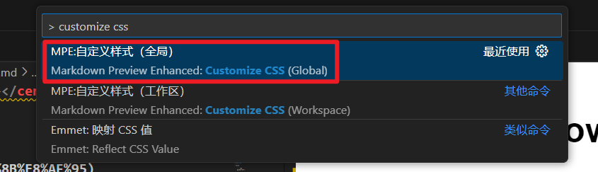
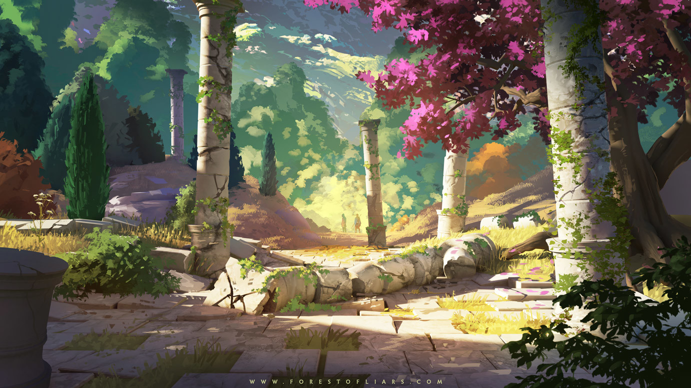

**<center><BBBG>Markdown测试文档</BBBG></center>**

<!-- TOC -->

- [1.字体测试](#1字体测试)
- [2.代码测试](#2代码测试)
- [3.列表测试](#3列表测试)
- [4.超链接测试](#4超链接测试)
- [5.图片测试](#5图片测试)

<!-- /TOC -->

**<DRD>注意：本文档为VSCode专用(尝试过放在Typora中，无法渲染)</DRD>**
目前方案为VSCode与Typora的通用方案，我希望能够在Typora中正常显示，同时如果只能在VSCode中打开同样能够得到一样的效果，所以尽量保持了语法的纯净<VT>(改色我认为很重要，所以还是添加了)</VT>

<br>

**所需VSCode插件：** 
- Markdown All in One (Yu Zhang)　**<DRD>必须</DRD>**
- Markdown Preview Enhanced (Yiyi Wang)　**<DRD>必须</DRD>**
- markdownlint (David Anson)

**关键：`<style>`标签被全局设置替代**
**更改方式：** 在VSCode搜索栏中搜索`> customize css`，然后像在`<style>`中添加字体模板


``` css
.markdown-preview.markdown-preview {
  /* 个性化字体 */
  VT, vt {color: rgb(126, 0, 98);}
  GN, gn {color: rgb(74, 117, 0);}
  RD, rd {color: rgb(255, 0, 0);}
  DRD, drd {color: rgb(131, 0, 15);}
  BL, bl {color: rgb(45, 0, 129);}
  YL, yl {color: rgb(180, 121, 0);}
  BG, bg {font-size:1.25em;}
  BBG, bbg {font-size:1.5em;}
  BBBG, bbbg {font-size:2em;}
  T, t {font-size:2.5em;}

  /* 限制代码块最大高度 */
  pre {
    max-height: 515px;
    overflow: auto;
  }
  
  /* 更改标题色 */
  h1, h2, h3, h4, h5, h6 {
    color: #0857a5;
  }
  /* 更改标题大小 */
  h1 {
    font-size: 2.0em;
  }
  h2 {
    font-size: 1.5em;
  }
  h3, h4, h5, h6 {
    font-size: 1.15em;
  }
}
```

可以看到名字叫`style.less`，位置就在`C:\Users\Administrator\.crossnote\style.less`

<!-- 标题开头不能是数字字符，否则无法使用TOC -->
<!-- 但是可以通过手动将某个改为如[1.xxx](#1.xxx)的形式，保存后即可使用 -->
# 1.字体测试

**加粗** | *斜体* | ***斜体加粗***  

HTML语法：  
这是<font color="red">红色</font> | 这是<font color="purple">紫色</font> | 这是<font color="green">绿色</font>  

CSS语法：　　**<VT>我通常会使用该方法</VT>**
这是<VT>注释色</VT> | 这是<RD>警告色</RD> | 这是<DRD>注意色</DRD> | 这是<GN>名词色</GN> | 这是<YL>例子色</YL> | 这是<BL>问题色</BL>

# 2.代码测试

代码句：`print("Hello")`  

---

1.Lua代码

``` lua
-- 输出"Hello"
function printHello()
    print("Hello")
end
```

2.C#代码

``` CSharp
private void PrintHello()
{
    Console.WriteLine("Hello");
}
```

# 3.列表测试

- first
  
    ``` lua
    print("OK")
    ```

- second
    > ok
- third

1. first
2. second
3. third

# 4.超链接测试

这是 **[BILIBILI](https://www.bilibili.com "备注:视频网站")** 网站
这也是<https://www.bilibili.com>

# 5.图片测试

{width=200 height=100 align=left}

  
