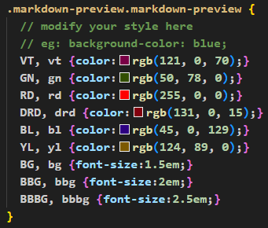

**<center><BBBG>Markdown测试文档</BBBG></center>**

<!-- TOC -->

- 字体测试
- 代码测试
- 列表测试
- 超链接测试
- 图片测试

<!-- /TOC -->

**个人总结:**
**<DRD>注意：本文档为VSCode专用(尝试过放在Typora中，无法渲染)</DRD>**
目前方案为VSCode与Typora的通用方案，我希望能够在Typora中正常显示，同时如果只能在VSCode中打开同样能够得到一样的效果，所以尽量保持了语法的纯净<VT>(改色我认为很重要，所以还是添加了)</VT>

**所需VSCode插件：** 
- Markdown All in One (Yu Zhang)　**<DRD>必须</DRD>**
- Markdown Preview Enhanced (Yiyi Wang)　**<DRD>必须</DRD>**
- markdownlint (David Anson)

**关键：`<style>`标签被全局设置替代**
**更改方式：** 在VSCode搜索栏中搜索`> customize css`，然后像在`<style>`中添加字体模板


可以看到名字叫`style.less`，位置就在`C:\Users\Administrator\.crossnote\style.less`

# 字体测试

**加粗** | *斜体* | ***斜体加粗***  

HTML语法：  
这是<font color="red">红色</font> | 这是<font color="purple">紫色</font> | 这是<font color="green">绿色</font>  

CSS语法：　　**<VT>我通常会使用该方法</VT>**
这是<VT>注释色</VT> | 这是<RD>警告色</RD> | 这是<DRD>注意色</DRD> | 这是<GN>名词色</GN> | 这是<YL>例子色</YL> | 这是<BL>问题色</BL>

# 代码测试

代码句：`print("Hello")`  

---

1.Lua代码

``` lua
-- 输出"Hello"
function printHello()
    print("Hello")
end
```

2.C#代码

``` CSharp
private void PrintHello()
{
    Console.WriteLine("Hello");
}
```

# 列表测试

- first
  
    ``` lua
    print("OK")
    ```

- second
    > ok
- third

1. first
2. second
3. third

# 超链接测试

这是 **[BILIBILI](https://www.bilibili.com "备注:视频网站")** 网站
这也是<https://www.bilibili.com>

# 图片测试

{width=200 height=100 align=left}

  
