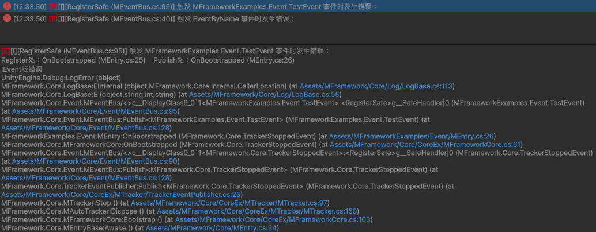
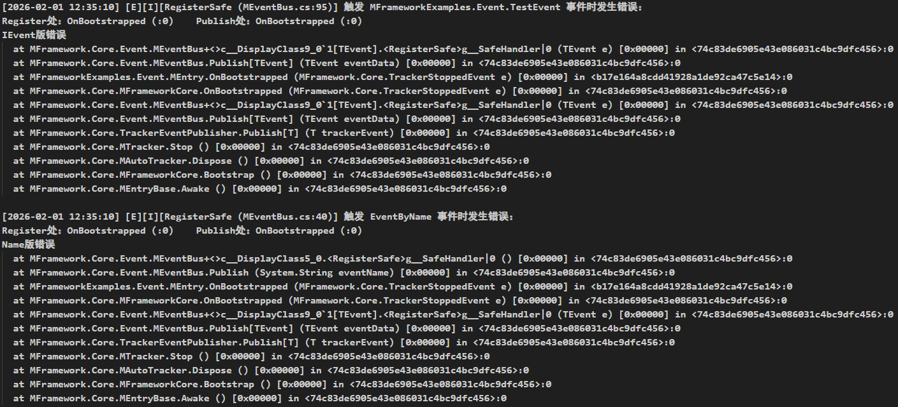

**<center><BBBG>核心模块</BBBG></center>**

# v1.0

## 概述

**核心设计**如下：

- MEventBus：事件中心，提供`Register()`/`RegisterSafe()`/`Publish()`方法

<BR>

一些**注意事项**：

- 提供了2组声明：
  - 提供`(string eventName, Action handler)`，通过`(string eventName)`发布
  - 提供`(Action<TEvent> handler) where TEvent : IEvent`，通过`(TEvent eventData) where TEvent : IEvent`发布
- IEvent接口为空接口，仅供提示作用
- 一般使用`RegisterSafe()`，会保证执行Action错误时catch
  如果能确保不发生错误，使用`Register()`也行

## 使用例

``` csharp
public class TestEvent : IEvent
{
    private string _message;
    public string Message => _message;

    public TestEvent(string message)
    {
        _message = message;
    }
}

public class MEntry : MEntryBase
{
    private MEventBus _eventBus = new MEventBus();
    
    protected override void OnBootstrapped(TrackerStoppedEvent e)
    {
        // IEvent版
        _eventBus.RegisterSafe<TestEvent>((e) => throw new Exception(e.Message));
        _eventBus.Publish(new TestEvent("IEvent版错误"));
        
        // Name版
        _eventBus.RegisterSafe("EventByName", () => throw new Exception("Name版错误"));
        _eventBus.Publish("EventByName");
    }
}
```



可以看到打包后堆栈信息获取异常，但总的来说信息还有有一点的