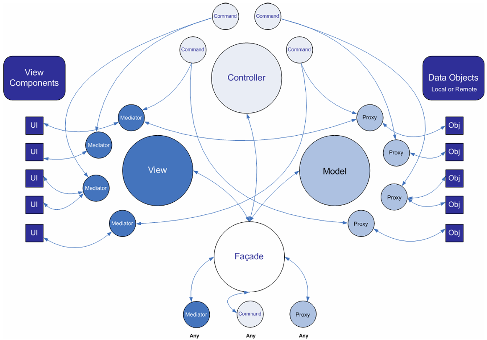

<center><b><font size=10>PureMVC分析</font></b></center>

<!-- TOC -->

- [简述](#简述)
- [逻辑梳理](#逻辑梳理)
  - [源码分析](#源码分析)
    - [Facade](#facade)
    - [Notifier](#notifier)
    - [Controller与Command](#controller与command)
      - [Command是什么](#command是什么)
    - [Model与Proxy](#model与proxy)
      - [Proxy是什么](#proxy是什么)
    - [View与Mediator](#view与mediator)
      - [Mediator是什么](#mediator是什么)
      - [Observer与Notification](#observer与notification)
        - [Notification是什么](#notification是什么)
        - [Observer是什么](#observer是什么)
      - [关系(View/Mediator/Observer/Notification)](#关系viewmediatorobservernotification)
    - [整体流程](#整体流程)
  - [文档分析](#文档分析)
    - [PureMVC结构](#puremvc结构)
    - [Facade](#facade-1)
    - [其它](#其它)
      - [Notification](#notification)
      - [Command](#command)
      - [Mediator](#mediator)
      - [Proxy](#proxy)

<!-- /TOC -->

# 简述

从PureMVC这个名字上来看，我们就能知道：<B><VT>PureMVC是基于MVC的</VT></B>
以下是官方的一张图，个人认为是最好理解的一种方式了：



# 逻辑梳理

由图中我们可以发现，原本的MVC被各类设计模式所包装，即：

- **Model**使用了<B><GN>代理模式</GN></B>
- **View**使用了<B><GN>中介者模式</GN></B>
- **Controller**使用了<B><GN>命令模式</GN></B>

最终使用<B><GN>门面模式</GN></B>将三者汇总，指定唯一入口进行流程(所以也是一种<B><GN>"单例模式"</GN></B>)

## 源码分析

最好的梳理方式还是看源码，可以看到一共就是4大板块---M/V/C/Facade

### Facade

从<B><GN>门面Facade</GN></B>入手是最为合适的，因为在这里将汇聚MVC三者
**实际调用**可能如下所示：

``` csharp
public class PureMVC_Main : MonoBehaviour
{
    private void Start()
    {
        var hpFacade = Facade.GetInstance(() => new HPFacade()) as HPFacade;
        hpFacade.Reset();
    }
}
```

``` csharp
public class HPFacade : Facade
{
    public HPFacade()
    {
        RegisterCommand("Reg_TakeDamageCommand", () => { return new TakeDamageCommand(); });
        RegisterCommand("Reg_HealCommand", () => { return new HealCommand(); });
        RegisterCommand("Reg_ResetCommand", () => { return new ResetCommand(); });

        RegisterMediator(new HPMediator());

        RegisterProxy(new HPDataProxy());
    }

    public void Reset()
    {
        SendNotification("Reg_ResetCommand");
    }
}
```

这就是<B>门面的核心：<VT>注册M(Proxy)/V(Mediator)/C(Command)</VT></B>

从源码中我们知道其**执行流程**：

- 通过单例方法`GetInstance()`创建IFacade实例
  - 构造函数本质上只干了一件事就是`InitializeFacade()`，即`InitializeModel()`/`InitializeController()`/`InitializeView()`
    - 而这些Init方法又和Facade一样，通过`GetInstance()`创建实例，仅此而已(同样会执行构造函数)　　<VT>Tip：Controller甚至又套了一层View</VT>
- 当然，之后还要进行上述我们创建的实际业务逻辑

<BR>

``` csharp
public class Facade : IFacade
{
    public Facade()
    {
        if (instance != null) throw new Exception(SingletonMsg);
        instance = this;
        InitializeFacade();
    }

    protected virtual void InitializeFacade()
    {
        InitializeModel();
        InitializeController();
        InitializeView();
    }
    protected virtual void InitializeModel()
    {
        model = Model.GetInstance(() => new Model());
    }
    protected virtual void InitializeController()
    {
        controller = Controller.GetInstance(() => new Controller());
    }
    protected virtual void InitializeView()
    {
        view = View.GetInstance(() => new View());
    }
}

```

<B><BL>问题：GetInstance()为什么是这样的</BL></B>
<BL>根据`GetInstance()`源码，可以发现工厂函数是在instance为null时使用的，所以这里就是一种充当创建与获取的方式</BL>

除此以外，源码中还提供了**必须的功能函数**，比如上述业务代码用到的`RegisterXXX()`
**具体如下：**

- **Command**
  - RegisterCommand()
  - RemoveCommand()
  - HasCommand()
- **Proxy**
  - RegisterProxy()
  - RetrieveProxy()
  - RemoveProxy()
  - HasProxy()
- **Mediator**
  - RegisterMediator()
  - RetrieveMediator()
  - RemoveMediator()
  - HasMediator()
- **通知**
  - SendNotification()
  - NotifyObservers()

可以看到就是非常清晰的4类函数：M/V/C基本操作/通知

### Notifier

如果我们查看各个类的声明，会发现**有很多类继承自Notifier**，有：

- SimpleCommand/MacroCommand
- Mediator
- Proxy

<BR>

``` csharp
public class Notifier : INotifier
{
    public virtual void SendNotification(string notificationName, object body = null, string type = null)
    {
        Facade.SendNotification(notificationName, body, type);
    }

    protected IFacade Facade
    {
        get
        {
            return Patterns.Facade.Facade.GetInstance(() => new Facade.Facade());
        }
    }
}
```

通过以上代码可以得知：<B><VT>Notifier提供了`SendNotification()`，便于我们在各处直接调用`SendNotification()`无需通过`Facade.SendNotification()`调用(即隐藏前缀)</VT></B>

### Controller与Command

> Controller 保存所有 Command 的映射。Command 类是无状态的，只在需要时才被创建
> Command 可以获取 Proxy 对象并与之交互，发送 Notification，执行其他
的Command。经常用于复杂的或系统范围的操作，如应用程序的“启动”和
“关闭”。应用程序的业务逻辑应该在这里实现。

在传统MVC中，Controller是联系Model与View的桥梁，在PureMVC中肯定也是如此
Controller即<B><GN>命令模式</GN></B>：
命令模式本身很简单，它就是一个**Command**，override一下`Execute()`即可

其类函数就是Facade收集的Command操作：　<VT>Facade只是作为门面重新封装了一下</VT>

- ExecuteCommand()　<VT>Facade没有，即框架内部使用</VT>
- RegisterCommand()
- RemoveCommand()
- HasCommand()

**核心**是<B><GN>注册RegisterCommand()</GN></B>：

``` csharp
public virtual void RegisterCommand(string notificationName, Func<ICommand> factory)
{
    //所以说：观察者只能注册一次，而命令可以重新更换

    //如果命令没有注册过，则让view注册一下观察者
    if (commandMap.TryGetValue(notificationName, out _) == false)
    {
        view.RegisterObserver(notificationName, new Observer(ExecuteCommand, this));
    }
    //存储工厂函数
    commandMap[notificationName] = factory;
}

public virtual void ExecuteCommand(INotification notification)
{
    if (commandMap.TryGetValue(notification.Name, out var factory))
    {
        var commandInstance = factory();
        commandInstance.Execute(notification);
    }
}
```

可以看到注册其实是提供了一个工厂函数，更重要的是<B><VT>将其注册进view中作为观察者存在</VT></B>

#### Command是什么

``` csharp
public class SimpleCommand : Notifier, ICommand
{
    public virtual void Execute(INotification notification)
    {
    }
}

public class MacroCommand : Notifier, ICommand
{
    public MacroCommand()
    {
        subcommands = new List<Func<ICommand>>();
        InitializeMacroCommand();
    }

    protected virtual void InitializeMacroCommand()
    {
    }

    protected void AddSubCommand(Func<ICommand> factory)
    {
        subcommands.Add(factory);
    }

    public virtual void Execute(INotification notification)
    {
        while(subcommands.Count > 0)
        {
            var factory = subcommands[0];
            var commandInstance = factory();
            commandInstance.Execute(notification);
            subcommands.RemoveAt(0);
        }
    }

    public readonly IList<Func<ICommand>> subcommands;
}
```

通过以上代码可以得知：<B><VT>SimpleCommand是一个单纯的Command，而MacroCommand是多个Command的组合</VT></B>

### Model与Proxy

> Model 保存对 Proxy 对象的引用，Proxy 负责操作数据模型，与远程服务通信存取数据。
> 这样保证了Model层的可移植性。

Proxy即<B><GN>代理模式</GN></B>，简单来说就是<B><VT>Model的一个"子项"</VT></B>
同样是Facade收集的Proxy操作：

- RegisterProxy()
- RetrieveProxy()
- RemoveProxy()
- HasProxy()

核心是<B><GN>注册RegisterProxy()</GN></B>与<B><GN>取回(获取)RetrieveProxy()</GN></B>：

``` csharp
public virtual void RegisterProxy(IProxy proxy)
{
    //将参数proxy存入map中，并回调
    proxyMap[proxy.ProxyName] = proxy;
    proxy.OnRegister();
}

public virtual IProxy RetrieveProxy(string proxyName)
{
    //取出名为proxyName的proxy
    return proxyMap.TryGetValue(proxyName, out var proxy) ? proxy : null;
}
```

可以发现Model异常简单，可以说就是一个<B><VT>记录了多个proxy的集合</VT></B>
所以我们可以认为：<B><VT>Proxy就是子Model</VT></B>

#### Proxy是什么

``` csharp
public class Proxy: Notifier, IProxy
{
    public const string NAME = "Proxy";

    public Proxy(string proxyName, object data = null)
    {
        ProxyName = proxyName ?? NAME;
        if (data != null) Data = data;
    }

    public string ProxyName { get; protected set; }
    public object Data { get; set; }
}
```

通过以上代码可以得知：<B><VT>Proxy只是一个名为ProxyName的Data</VT></B>

### View与Mediator

> View 保存对 Mediator 对象的引用 。由 Mediator 对象来操作具体的视图组
件（View Component，例如 Flex 的 DataGrid 组件），包括：添加事件监
听器 ，发送或接收Notification ，直接改变视图组件的状态。  
> 这样做实现了把视图和控制它的逻辑分离开来。

Mediator即<B><GN>中介者模式</GN></B>，在这里<B><VT>观察者为Mediator/Command，被观察者为Proxy</VT></B>
与M/C不同，V的话处理是Facade收集的Mediator操作，还具有Observer操作：

- RegisterObserver()
- NotifyObservers()
- RemoveObserver()
- RegisterMediator()
- RetrieveMediator()
- RemoveMediator()
- HasMediator()

那么先来看一下**Mediator**，核心当然是<B><GN>RegisterMediator()</GN></B>与<B><GN>取回(获取)RetrieveMediator()</GN></B>：

``` csharp
public virtual void RegisterMediator(IMediator mediator)
{
    //尝试存入mediator
    if(mediatorMap.TryAdd(mediator.MediatorName, mediator))
    {
        var interests = mediator.ListNotificationInterests();

        if (interests.Length > 0)
        {
            //创建观察者并订阅兴趣事件(注册)
            IObserver observer = new Observer(mediator.HandleNotification, mediator);
            foreach (var interest in interests)
            {
                RegisterObserver(interest, observer);
            }
        }
        mediator.OnRegister();
    }
}

public virtual IMediator RetrieveMediator(string mediatorName)
{
    //取出名为mediatorName的mediator
    return mediatorMap.TryGetValue(mediatorName, out var mediator) ? mediator : null;
}
```

**可以发现：<VT>Mediator其实是在创建Observer</VT>**

#### Mediator是什么

``` csharp
public class Mediator : Notifier, IMediator
{
    public virtual string[] ListNotificationInterests()
    {
        return new string[0];
    }
    public virtual void HandleNotification(INotification notification)
    {
    }
}
```

通过以上代码可以得知：<B><VT>Mediator中有2个重要函数：`ListNotificationInterests()`与`HandleNotification()`</VT></B>，需要我们自行实现

- `ListNotificationInterests()`---返回值应该为一个string列表，即**Command名**
- `HandleNotification()`---是一个操作，即**对于notification应该进行的操作**

#### Observer与Notification

> PureMVC 的通信并不采用 Flash 的 EventDispatcher/Event，因为PureMVC 可能运行在没有 Flash Event 和 EventDispatcher 类的环境中，它的通信是使用观察者模式以一种松耦合的方式来实现的。
> 你可以不用关心PureMVC的Observer/Notification 机制是怎么实现的，它已经在框架内部实现了。你只需要使用一个非常简单的方法从 Proxy, Mediator, Command 和 Facade 发送 Notification，甚至不需要创建一个Notification 实例。

根据Mediator部分源码的观察，会发现Mediator其实是个"壳子"，核心是其中注册的Observer
先来看一下其重要函数<B><GN>RegisterObserver()</GN></B>与<B><GN>取回(获取)NotifyObservers()</GN></B>：

``` csharp
public virtual void RegisterObserver(string notificationName, IObserver observer)
{
    //添加兴趣事件
    if (observerMap.TryGetValue(notificationName, out var observers))
    {
        observers.Add(observer);
    }
    //创建
    else
    {
        observerMap.TryAdd(notificationName, new List<IObserver> { observer });
    }
}

public virtual void NotifyObservers(INotification notification)
{
    if (observerMap.TryGetValue(notification.Name, out var observersRef))
    {
        var observers = new List<IObserver>(observersRef);

        //对每一个观察者通知
        foreach (var observer in observers)
        {
            observer.NotifyObserver(notification);
        }
    }
}
```

可以看到observerMap可能和我们想的不太一样：key-`string` value-`IList<IObserver>>`
我们可能由于注册的方式(为Observer添加所有兴趣事件)误解为Observer名对应着其事件，
但事实恰恰相反，具体来说是：**为通知绑定其观察者**
仔细想的话是**合理的**：<B><VT>发生某种情况，应该通知所有感兴趣的观察者</VT></B>

##### Notification是什么

``` csharp
public class Notification: INotification
{
    public Notification(string name, object body = null, string type = null)
    {
        Name = name;
        Body = body;
        Type = type;
    }
}

// Facade
public virtual void SendNotification(string notificationName, object body = null, string type = null)
{
    NotifyObservers(new Notification(notificationName, body, type));
}
```

通过以上代码可以得知：<B><VT>Notification只是一个name</VT></B>

##### Observer是什么

``` csharp
public class Observer: IObserver
{
    public Observer(Action<INotification> notifyMethod, object notifyContext)
    {
        NotifyMethod = notifyMethod;
        NotifyContext = notifyContext;
    }

    public virtual void NotifyObserver(INotification notification)
    {
        NotifyMethod(notification);
    }
}
```

通过以上代码可以得知：<B><VT>Observer核心是一个构造函数中传入的通知函数，可以通过`NotifyObserver()`触发</VT></B>

#### 关系(View/Mediator/Observer/Notification)

通过View/Mediator/Observer/Notification的简单解读，我们能大致说出它们的**关系**：

- **View**主要是一个存储Mediator的地方(还有一个observerMap)，并提供Mediator与Observer相关的操作函数
- **Mediator**为"中转站"，创建Mediator本质上是创建Observer，主要通过`ListNotificationInterests`与`HandleNotification()`建立了与Notification的联系
- **Observer**即观察者，会根据Notification通知到所有相关的Observer
- **Notification**即通知，仅仅是一个名字

### 整体流程

PureMVC的各个模块已经大致介绍完毕，我们已经基本了解了流程
那么在这里**按流程看看具体的操作**：

- 起始点必然是从**Facade**，也就是门面开始：
  - Facade构造函数自身进行了初始化操作，即存储MVC单例
  - 由于**依赖关系**的原因，<B><VT>我们应该以Command/Proxy/Mediator的顺序进行注册</VT></B>
- 首先是**Command注册**：
  - Command是附属于Controller的，其中commandMap会存储所有的ICommand
  - <B><GN>RegisterCommand()</GN></B>为注册方法，核心为<B><VT>往commandMap存储了一组键值对</VT></B>
    <B><YL>举例：</YL></B>`RegisterCommand("Reg_TakeDamageCommand", () => { return new TakeDamageCommand(); });`
    - 该函数中会通过<B>View.RegisterObserver()</B>创建通知对应的Observer
      **函数为：**`view.RegisterObserver(notificationName, new Observer(ExecuteCommand, this));`
      与Controller.RegisterCommand()类似，这里是<B><VT>通过observerMap进行存储</VT></B><DRD>(注意：键值对是"通过通知名找已订阅观察者")</DRD>
      - 首先需要创建Observer，构造函数传入了2个参数：
        - 通知函数ExecuteCommand---执行的话流程为从commandMap获取ICommand工厂，创建ICommand实例，执行操作(Execute接口)
        - 上下文，即自身Controller
- 然后是**Proxy注册**：
  - Proxy是附属于Model的，其中proxyMap会存储所有的IProxy
  - <B><GN>RegisterProxy()</GN></B>为注册方法，本质上就是<B><VT>往proxyMap存储了一组键值对</VT></B>
    <B><YL>举例：</YL></B>`RegisterProxy(new HPDataProxy());`
- 最后是**Mediator注册**：
  - Mediator是附属于View的，其中mediatorMap会存储所有的IMediator
  - <B><GN>RegisterMediator()</GN></B>为注册方法，核心为<B><VT>往mediatorMap存储了一组键值对</VT></B>
    <B><YL>举例：</YL></B>`RegisterMediator(new HPMediator());`
    存储后需要建立与Observer/Notification的联系：
    - 我们需要<B>为Mediator重写ListNotificationInterests()</B>以了解Mediator所感兴趣的通知
    - 对于每一个Mediator，都会创建<DRD>另一种形式</DRD>的Observer：
      `IObserver observer = new Observer(mediator.HandleNotification, mediator);`
      构造函数传入了2个参数：
      - **重写的处理函数HandleNotification()**，需要根据通知的不同进行不同的视图刷新处理
      - 上下文，即Mediator
    - 对于每一个兴趣通知，都需要通过<B>RegisterObserver()</B>的方式与刚刚创建的Observer关联

<BR>

上述内容是比较好理解的，关键点在于：**2种Observer的创建方式/整体协作方式**
通过一个<B><YL>具体实例</YL></B>分析一下：

``` csharp
public class HPFacade : Facade
{
    public HPFacade()
    {
        RegisterCommand("Reg_TakeDamageCommand", () => { return new TakeDamageCommand(); });
        RegisterCommand("Reg_HealCommand", () => { return new HealCommand(); });
        RegisterCommand("Reg_ResetCommand", () => { return new ResetCommand(); });

        RegisterProxy(new HPDataProxy());
        RegisterMediator(new HPMediator());
    }

    public void Reset()
    {
        SendNotification("Reg_ResetCommand");
    }
}
```

- **注册**
  - 通过Command的注册，我们创建了一个Observer，调用即可执行Command
    核心：Observer存储在View的observerMap中(通过通知名获取)，同时Command存储在Controller的commandMap中(延迟创建，后续通过工厂函数创建)
  - 通过Proxy的注册，我们会在proxyMap中存储该proxy，proxy派生类具有对应的执行函数，用于数据更新
  - 通过Mediator的注册，我们又创建了一个Observer，调用即可执行mediator派生类所实现的函数(`HandleNotification()`)，用于视图更新
    核心：Mediator是一个观察者，会将其与observerMap中的每一个兴趣事件建立联系(订阅)，而Mediator本身存储在mediatorMap中
- **刷新**
  - 刷新方式为`SendNotification()`，我们的初始化刷新为：`SendNotification("Reg_ResetCommand");`
    该函数本质上是引用的`View.NotifyObservers()`，即找到所有需要通知的observer，调用对应的执行函数，这里就是ResetCommand，数据更新后又通过`SendNotification()`进行视图刷新

    <BR>

    ``` csharp
    //重置函数
    public void Reset()
    {
        SendNotification("Reg_ResetCommand");
    }
    //触发的Command
    public override void Execute(INotification notification)
    {
        HPDataProxy dataProxy = Facade.RetrieveProxy(HPDataProxy.NAME) as HPDataProxy;
        dataProxy.ResetHP();
    }
    public void ResetHP()
    {
        //先Max再Cur，否则因Clamp导致Cur赋值失败
        _hpData.MaxHP = 100;
        _hpData.CurrentHP = 100;

        SendNotification("Msg_Refresh", _hpData);
    }
    //触发的视图刷新
    public override void HandleNotification(INotification notification)
    {
        switch (notification.Name)
        {
            case "Msg_TakeDamage":
            case "Msg_Heal":
            case "Msg_Refresh":
                HPData hpData = notification.Body as HPData;
                _hpText.text = $"HP:{hpData.CurrentHP}/{hpData.MaxHP}";
                break;
        }
    }
    ```

    那么对于2个按钮来说也是同理，本质上就是：
    **<VT>发送通知执行Command刷新数据，再发送通知执行视图刷新</VT>**

<BR>

**<BL>问题解答：2种Observer的创建方式</BL>**
<BL>2种Observer分别用于数据刷新(XXXComand)和视图刷新(HandleNotification)</BL>
至此，脉络已经非常清晰了，核心点就是<B><VT>2种Observer的创建以及SendNotification()全流程</VT></B>

## 文档分析

在PureMVC的官网中，给出了一个文档，那么可以通过文档详细地了解一下

### PureMVC结构

在前面的分析中，我们每一组模块的引用都是来自于此，这我们其实已经了解：

- Model/Proxy
- View/Mediator
- Controller/Command
- Facade/Core
- Observer/Notification

除此以外，还有**几条Tips**：

- **<VT>Notification可以被用来触发Command的执行</VT>**
  > 发出时，对应的Command（命令）就会自动地由Controller执行。Command实现复杂的交互，降低View和Model之间的耦合性。

  根据我们的分析的确如此：
  `SendNotification()`中有一种就是来自于存储ICommand的Observer，通过Notification即可触发
  其中，Command是一个独立的脚本，并没有放在Model中，自然降低了VM之间的耦合
- **<VT>Mediator发送、声明、接收Notification</VT>**
  > 当用View 注册 Mediator 时，Mediator 的 listNotifications 方法会被调用，以数组形式返回该Mediator对象所关心的所有Notification。  
  > 之后，当系统其它角色发出同名的 Notification（通知）时，关心这个通知的Mediator 都会调用handleNotification 方法并将 Notification 以参数传递到方法。

  Mediator即中介者，自然需要**承担中介的职责**，也就是：

  - 声明Notification(注册Mediator时需要通过`ListNotificationInterests()`确定Mediator关心的Notification)
  - 发送Notfication(中介者需要`SendNotification()`以执行Command以执行HandleNotification)
  - 接收Notification(执行`NotifyObserver()`时会有Command与HandleNotification两种情况，其中HandleNotification就属于Mediator)

  更简单来说就是上述引用所描述的那样
- **<VT>Proxy发送，但不接受Notification</VT>**
  > 在很多场合下Proxy需要发送Notification（通知），比如：Proxy从远程服务接收到数据时，发送 Notification 告诉系统；或当 Proxy 的数据被更新时，发送Notification 告诉系统。  
  > 如果让 Proxy 也侦听 Notification（通知）会导致它和 View（视图）层、Controller（控制）层  的耦合度太高。  
  > View 和Controller 必须监听 Proxy 发送的Notification，因为它们的职责是通过可视化的界面使  用户能与Proxy持有的数据交互。  
  > 不过对View层和Controller层的改变不应该影响到Model层。  
  > 例如，一个后台管理程序和一个面向用户程序可能共用一个Model类。如果只是用例不同，那么 View/Controller 通过传递不同的参数就可以共用相同的Model 类。

  这句话其实通过我们的流程就可以知道了：
  `SendNotification()`触发Command，Command中的函数是由Proxy提供的，然后再通过Command中的`SendNotification()`触发视图更新
  可以发现**2种通知的区别**：

  - Command是被封装成一个一个的，其实此时已经拆解，Proxy中一个函数会对应一个Command(通知)
  - 视图更新是集合形态的，一个Observer(Mediator)对应多个通知，需要有一种方式知道Mediator关心哪些通知，也就是`ListNotificationInterests()`

  所以<B><VT>不接受，本质上其实是不需要，Command已经通过注册的方式完成了</VT></B>

### Facade

Facade在我们看来是非常容易理解的一个模块，但同样非常重要：

> Facade是Model/View/Controller三者的"经纪人"

事实确实如此，Facade的存在非常好地协调了三者，而且把繁琐的执行操作隐藏起来，我们仅需关注MVC的子部分(Proxy/Mediator/Command)的关键内容即可

> 一般地，实际的应用程序都有一个 Façade 子类，这个 Façade 类对象负责初始化Controller（控制器），建立Command与Notification名之间的映射，并执行一个Command注册所有的Model和View。

这里提出了**一个建议**：<B><VT>我们需要通过Command注册Model与View</VT></B>
这是一个非常好的建议，这<B><VT>有助于建立标准流程</VT></B>
所以我们需要**改造一下：**
使用MacroCommand创建一个StartupCommand即可：

``` csharp
public class StartupCommand : MacroCommand
{
    protected override void InitializeMacroCommand()
    {
        AddSubCommand(() => new ModelPrepCommand());
        AddSubCommand(() => new ViewPrepCommand());
        AddSubCommand(() => new ResetHPCommand());
    }
}
```

### 其它

#### Notification
通知是一种**观察者模式**，可以使各层<B><VT>松耦合通信</VT></B>
文档中提到：

> Notification（通知）机制并不仅仅是 Event（事件）机制的替代品，它们的工作方式有本质上的不同。但这两者相互协作可以提高视图组件的可重用性 ，甚至，如果设计得当，视图组件可以和PureMVC“脱耦”。

这里提到的Event是AS语言中的机制，在PureMVC中使用**Notification机制**实现
**<BL>问题：什么是Event</BL>**
<BL>Event使用了<B><GN>责任链模式</GN></B>，核心是<B>"冒泡"</B>：只有父子级关系的对象才会接收到事件，也就是说有一种<B>逐层递进</B>的关系<B>(紧耦合)</B></BL>

各个类的配合是一种<B><GN>发布/订阅模式</GN></B>：

- **Facade 和 Proxy 只能发送Notification**
- **Mediators 既可以发送也可以接收Notification**
- **Notification 被映射到 Command，同时Command也可以发送Notification**

**<BL>问题："类型"参数</BL>**
<BL>观察`SendNotification()`，有时我们会传入额外参数如：`SendNotification(HPMediator.TAKE_DAMAGE, _hpData)`
具体来说有：`public virtual void SendNotification(string notificationName, object body = null, string type = null)`
显然：</BL>

- <BL>body---主体，即"类型"参数，用于唯一标识对象</BL>
- <BL>type(不常用)---类型，大概率是string，用于区分不同情况(如：TAKE_DAMAGE情况可以有"Normal"/"Critical"不同情况)</BL>

**<VT>Tip：除非Notification是框架级的(如STARTUP/EXIT)可以放在Facade，其余情况的常量名应定义在发送方类中(如Mediator/Command)，或被多个模块共享时放在独立的常量类中(如GameNotifications.cs)，Facade应仅包含框架核心逻辑，不管理业务相关的通知名</VT>**

#### Command

文档中提到一点：

> Command 对象是无状态的；只有在需要的时候（Controller 收到相应的Notification）才会被创建，并且在被执行（调用 execute 方法）之后就会被删除。所以不要在那些生命周期长的对象（long-living object）里引用Command对象。

``` csharp
public virtual void RegisterCommand(string notificationName, Func<ICommand> factory)
{
    if (commandMap.TryGetValue(notificationName, out _) == false)
    {
        view.RegisterObserver(notificationName, new Observer(ExecuteCommand, this));
    }
    commandMap[notificationName] = factory;
}
public virtual void ExecuteCommand(INotification notification)
{
    if (commandMap.TryGetValue(notification.Name, out var factory))
    {
        var commandInstance = factory();
        commandInstance.Execute(notification);
    }
}
```

可以看到确实如此：注册时传入的是工厂，执行时才会创建出来，而且由于没有引用，自然会消失
但是：<B><VT>如果我们规范使用框架，根本不会出现引用情况</VT></B>

**Command所需要做的是：**

- **注册、删除 Mediator、Proxy 和 Command，或者检查它们是否已经注册**
- **发送Notification通知Command或Mediator做出响应**
- **获取Proxy和Mediator对象并直接操作它们**

**<VT>Tip：Command与Mediator和Proxy交互，应避免Mediator与Proxy直接交互</VT>**
这是当然的，Mediator和Proxy不该暴露自身，而是提供函数用于隐藏细节

除此以外还有一点：

> 比较特殊的是Application的Mediator，它是唯一的被允许知道Application 一切的类，所以我们会在Application Mediator的构造函数中创建其他的Mediator对象。

这其实也意味着：<B><VT>Mediator是需要有层级的</VT></B>
**<YL>可能有：</YL>**

``` csharp
public class MainMediator : Mediator
{
    public new const string NAME = "MainMediator";

    public MainMediator(GameObject view) : base(NAME, view)
    {
        InitHPView();
    }

    private void InitHPView()
    {
        //通过Main找到下一层级的view
        GameObject hpPnlGO = ((GameObject)ViewComponent).transform.Find("HPPnl").gameObject;
        Facade.RegisterMediator(new HPMediator(hpPnlGO));
    }
}

public class HPMediator : Mediator
{
    public new const string NAME = "HPMediator";

    public HPMediator(GameObject view) : base(NAME, view)
    {
        //...
    }

    public override string[] ListNotificationInterests(){/*...*/}
    public override void HandleNotification(INotification notification){/*...*/}
}
```

#### Mediator

Mediator的**事件响应处理方式**如下：

- **检查事件类型或事件的自定义内容**
- **检查或修改View Component的属性（或调用提供的方法）**
- **检查或修改Proxy对象公布的属性（或调用提供的方法）**
- **发送一个或多个Notification，通知别的 Mediator 或Command作出响应（甚至有可能发送给自身）**

**一些经验**：

- 如果有多个的 Mediator 对同一个事件做出响应，那么应该发送一个Notification，然后相关的Mediator做出各自的响应
- 如果一个 Mediator 需要和其他的 Mediator 进行大量的交互，那么一个好方法是利用 Command 把交互步骤定义在一个地方
- 不应该让一个 Mediator 直接去获取调用其他的 Mediator，在Mediator 中定义这样的操作本身就是错误的
- Proxy 是有状态的，当状态发生变化时发送 Notification 通知Mediator，将数据的变化反映到视图

文档提到：

> 还要注意的是，Mediator的职责应该要细分。如果处理的Notification很多，则意味着Mediator需要被拆分，在拆分后的子模块的Mediator里处理要比全部放在一起更好

个人认为**具体情况具体分析**，确实职责不同就拆分

文档还提到：

> 虽然Mediator 可以任意访问 Proxy，通过 Proxy的 API读取、操作 Data Object，但是，由Command来做这些工作可以实现View和Model之间的松耦合。
> 如果一个 Mediator 要和其他 Mediator 通信，那它应该发送 Notification 来实现，
而不是直接引用这个Mediator来操作。
> Mediator 对外不应该公布操作View Component的函数。而是自己接收Notification 做出响应来实现。

以上是一些解耦的操作

#### Proxy

文档提到了<B><VT>Proxy应该创建子类扩展方法</VT></B>，有以下**Proxy Pattern**：

- Remote Proxy, 当 Proxy管理的数据存放在远程终端，通过某种服务访问
- Proxy and Delegate, 多个 Proxy 共享对一个服务的访问，由 Delegate 封装对服务的控制访问，确保响应正确的返回给相应的请求者
- Protection Proxy, 用于数据对象的访问有不同的权限时
- Virtual Proxy, 对创建开销很大的数据对象进行管理
- Smart Proxy, 首次访问时载入数据对象到内存，并计算它被引用的次数，允许锁定确保其他对象不能修改

如有需求可以进行扩展

文档还提到了**Proxy与其它模块的联系**：

> Proxy 不监听 Notification，也永远不会被通知，因为 Proxy 并不关心 View的状态。但是，Proxy提供方法和属性让其它角色更新数据。
> Proxy应该采取的方式是发送Notification（这些Notification可能被Command或Mediator 响应）。Proxy 不关心这些 Notification 被发出后会影响到系统的什么。

> 把Model 层和系统操作隔离开来，这样当View 层和 Controller 层被重构时就不会影响到Model层。但反过来就不是这样了：Model层的改变很难不影响到View层和Controller层。毕竟，它们存在的目的就是让用户与Model层交互的。
