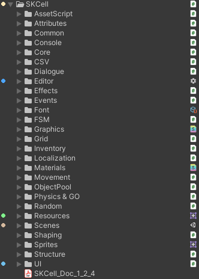

**
<BBBG>SKCell分析</BBBG>
**

# 简述

**结论：<VT>基于Unity的功能库</VT>**

SKCell是一个**功能性框架**，个人比较喜欢，是一个逻辑上非常清晰的框架，而且提供了很多**编辑器**方面的**便捷工具**方便使用<YL>(编辑器美化/对话编辑器/本地化编辑器/...)</YL>

# 分析

## 结构分析

简单观察便可得出**结论**：

- **<GN>结构清晰</GN>**，由功能构成，使用者也自行根据需求寻找相应功能
  - 核心Core---`SKCore.cs`
  - CSV/FSM/ObjectPool/UI/...
- **<DRD>过于简单</DRD>**，没有任何结构上的联系，只是一堆"散件"
- **<DRD>方便使用</DRD>**，但与Unity关联性较高，可以看到大量挂载在GameObject的脚本：
  - 无关联脚本(接口/结构类/数据类)
  - 挂载脚本(即MonoBehaviour脚本)
  - Manager脚本(SKCell中本质上是MonoBehaviour脚本)

## 实用模块

可以看到以上每个文件夹都是SKCell的一个模块，整体来说写得都是简单而实用的，大部分在自己实现的时候都可以参考以下

### xxx模块