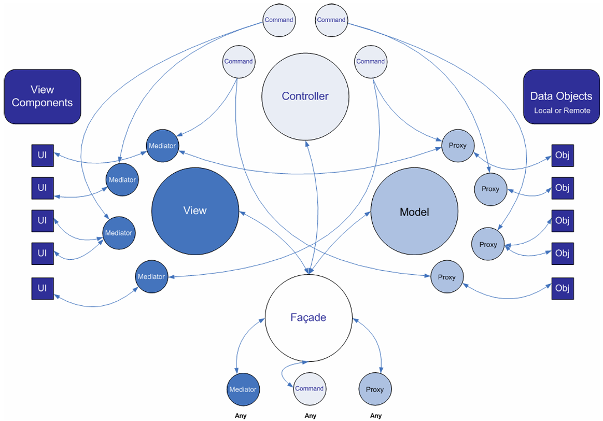

<center><b><font size=10>PureMVC分析</font></b></center>

<!-- TOC -->

- [简述](#简述)
- [逻辑梳理](#逻辑梳理)
  - [源码分析](#源码分析)
    - [门面Facade](#门面facade)

<!-- /TOC -->

# 简述

从PureMVC这个名字上来看，我们就能知道：<B><VT>PureMVC是基于MVC的</VT></B>
以下是官方的一张图，个人认为是最好理解的一种方式了：



# 逻辑梳理

由图中我们可以发现，原本的MVC被各类设计模式所包装，即：

- **Model**使用了<B><GN>代理模式</GN></B>
- **View**使用了<B><GN>中介者模式</GN></B>
- **Controller**使用了<B><GN>命令模式</GN></B>

最终使用<B><GN>门面模式</GN></B>将三者汇总，指定唯一入口进行流程(所以也是一种<B><GN>"单例模式"</GN></B>)

## 源码分析

最好的梳理方式还是看源码，可以看到一共就是4大板块---M/V/C/Facade

### 门面Facade

从门面入手是最为合适的，因为在这里将汇聚MVC三者
**实际调用**可能如下所示：

``` csharp
public class HPFacade : Facade
{
    public HPFacade()
    {
        RegisterCommand("Reg_TakeDamageCommand", () => { return new TakeDamageCommand(); });
        RegisterCommand("Reg_HealCommand", () => { return new HealCommand(); });
        RegisterCommand("Reg_ResetCommand", () => { return new ResetCommand(); });

        RegisterMediator(new HPMediator());

        RegisterProxy(new HPDataProxy());
    }

    public void Reset()
    {
        SendNotification("Reg_ResetCommand");
    }
}
```

这就是<B>门面的核心：<VT>注册M(Proxy)/V(Mediator)/C(Command)</VT></B>

源码如下所示：

``` csharp
public class Facade : IFacade
{
    public Facade()
    {
        if (instance != null) throw new Exception(SingletonMsg);
        instance = this;
        InitializeFacade();
    }

    protected virtual void InitializeFacade()
    {
        InitializeModel();
        InitializeController();
        InitializeView();
    }

    public static IFacade GetInstance(Func<IFacade> facadeFunc)
    {
        if (instance == null)
        {
            instance = facadeFunc();
        }
        return instance;
    }

    protected virtual void InitializeController()
    {
        controller = Controller.GetInstance(() => new Controller());
    }

    protected virtual void InitializeModel()
    {
        model = Model.GetInstance(() => new Model());
    }

    protected virtual void InitializeView()
    {
        view = View.GetInstance(() => new View());
    }

    public virtual void RegisterCommand(string notificationName, Func<ICommand> factory)
    {
        controller.RegisterCommand(notificationName, factory);
    }

    public virtual void RemoveCommand(string notificationName)
    {
        controller.RemoveCommand(notificationName);
    }

    public virtual bool HasCommand(string notificationName)
    {
        return controller.HasCommand(notificationName);
    }

    public virtual void RegisterProxy(IProxy proxy)
    {
        model.RegisterProxy(proxy);
    }

    public virtual IProxy RetrieveProxy(string proxyName)
    {
        return model.RetrieveProxy(proxyName);
    }

    public virtual IProxy RemoveProxy(string proxyName)
    {
        return model.RemoveProxy(proxyName);
    }

    public virtual bool HasProxy(string proxyName)
    {
        return model.HasProxy(proxyName);
    }

    public virtual void RegisterMediator(IMediator mediator)
    {
        view.RegisterMediator(mediator);
    }

    public virtual IMediator RetrieveMediator(string mediatorName)
    {
        return view.RetrieveMediator(mediatorName);
    }

    public virtual IMediator RemoveMediator(string mediatorName)
    {
        return view.RemoveMediator(mediatorName);
    }

    public virtual bool HasMediator(string mediatorName)
    {
        return view.HasMediator(mediatorName);
    }

    public virtual void SendNotification(string notificationName, object body = null, string type = null)
    {
        NotifyObservers(new Notification(notificationName, body, type));
    }

    public virtual void NotifyObservers(INotification notification)
    {
        view.NotifyObservers(notification);
    }

    protected IController controller;
    protected IModel model;
    protected IView view;
    protected static IFacade instance;
    protected const string SingletonMsg = "Facade Singleton already constructed!";
}
```