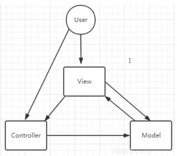
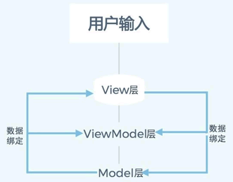

<center><b><font size=10>UI框架基础</font></b></center>

<!-- TOC -->

- [前置](#前置)
- [简述](#简述)
- [分析](#分析)
  - [MVC](#mvc)
  - [MVP](#mvp)
  - [MVVM](#mvvm)
  - [区别](#区别)
  - [问题：BindableProperty](#问题bindableproperty)
  - [问题：BindableCommand](#问题bindablecommand)

<!-- /TOC -->

## 前置

既然我们是用于**UI**，那么我们所讨论的即<B>"前端"</B>的
简单讲述一下**它们的历史**：

- 最早以前(web1.0)，前后端并没有分离，可以想象最原始的做法就是杂糅在一起做，但是难以维护，所以推出了后端MVC<VT>(前端V，后端M/C，所以我称为前后端MVC)</VT>
- MVC虽然分层清晰，但是可能不够灵活，也可能数据流混乱/V庞大C单薄，依旧导致维护问题，所以推出了后端MVP
- MVP解决了耦合问题，但这从而导致了P的臃肿，依旧存在维护问题，所以推出了MVVM(前后端通用)
- MVVM是一开始提出的MVC的最终演化版

## 简述

一般来说，我们可能听到最多的就是MVC，MVVM与MVP可能较少，但是从缩写上我们就能看出，它们具有**共同点：M与V**
三者都是<VT><B>UI规范</B></VT>，只是**实现细节**上略有不同：

- **MVC**
  - Model：管理数据
  - View：负责UI显示
  - Controller：处理用户输入，更新Model，并通知View刷新
  
  **大致流程**为：<VT>用户输入，此时Controller响应(更新Model，通知View)，最终View收到回调进行更新</VT>

  
  

  可以看到MVC是一种很<B><VT>多变</VT></B>的框架，如上图所示：

  - MVC可以是简单的一组单向链
  - MVC也可以添加各个链
  
  但是各有各的**缺点**：

  - 单向链逻辑清晰，但是不够灵活
  - 多向链数据流混乱
  - 两者内容集中在V中，C非常单薄(基本上就是个"绑定触发器")

- **MVP** <VT>("MVC2.0")</VT>
  - Model：同MVC，管理数据
  - View：仅负责显示(通过接口与Presenter交互)
  - Presenter：处理所有业务逻辑，更新Model并控制View

  **大致流程**为：<VT>用户输入，此时Presenter进行操作处理(更新Model，调用View接口)</VT>

  

  看图就能理解，这其实是将C的职责更加明确的形式，一切都走P，M和V不能私自沟通
  但是这也很容易发现**缺点**：都走P那么**P**自然<B><VT>很重</VT></B>

- **MVVM** <VT>("MVC3.0")</VT>
  - Model：管理数据
  - View：绑定ViewModel的数据，自动更新
  - ViewModel：暴露数据属性和命令(绑定到View)

  **大致流程**为：<VT>用户输入，此时ViewModel存在某绑定数据(与View)的操作，使得Model更新，View自动更新(数据驱动)</VT>

  

  可以发现其思路与MVP是类似的，但是**极其有利的一点**在于：
  **数据驱动**可以使VM的改变自动体现在V上，简单来说就是我们可以少一步
  所以说可以认为MVVM是<B><VT>MVP的绑定版</VT></B>

<BR>

从上述描述中，我们能看出**细微的差别**：

- **MVC**比较<VT><B>纯净</B></VT>
- **MVP**中<VT><B>P作为MV的唯一沟通方式</B></VT>
- **MVVM**使用了<VT><B>数据驱动</B></VT>

## 分析

根据前面的简述，我们其实可以知道：

- 三者都是UI框架，用于使结构更加清晰
- MVC是初版框架，后来推出了MVP以及MVVM迭代

所以说到底我们可以认为**三者是同一种框架，只是多使用了一些额外思想**

三者的**核心**：<B><VT>数据 | 表现 | 中间件</VT></B>
大致含义就是：**有数据要显示在界面上，为了能够将<VT>数据表现分离</VT>，使用一个中间件进行拆分，数据中只有数据，表现中只管表现**

### MVC

MVC即基础版，它有很多变体，但是万变不离其宗，**核心**就是：
**<VT>初始化MVC，各个模块互相触发/调用/绑定，最终使按钮具有更新Model+更新View功能</VT>**

我认为**最传统**的一种方式是这样的：

``` csharp
public class MVC2_Main : MonoBehaviour
{
    private void Start()
    {
        HPModel model = new HPModel(100);
        HPView view = new HPView();

        HPController controller = new HPController(view, model);
        view.Init(controller);//延迟Init
        controller.UpdateView();//初次初始化
    }
}
```

作为一个框架，<B>入口(即MVC2_Main.cs)</B>还是需要有的，然后在其中进行对MVC的初始化即可
更核心的即内部逻辑关系，大概有：

- `M`提供数据，并提供用于更改数据的函数
- `V`提供视图控件，如text提供更改函数，如btn进行绑定
- `C`对`M` `V`进行封装，封装的函数会用于绑定btn或直接调用

可以发现总的来说还是**非常清晰**的框架

**传统版问题：**
对于`V`与`C`来说是<B><DRD>互相引用</DRD></B>的，而且由于是纯C#，目前使用了延迟初始化`V`来解决这一问题，相互引用必然是不好的一件事

**变体点：**

- **`M`可以添加回调事件优化`V`更新机制**
  `public event Action<int> OnHPChanged;`
  这样的话多了绑定，但是在执行函数时会自动触发`V`更新
- **添加单例**
  是否添加具体要单例基于实际情况判断：
  - <VT>存在多实例情况</VT>
  对于HPModel来说，实际上是不应该使用单例的，因为无论是敌人还是主角，只要是一个实体都需要有属于自己的HPModel
  而对于ConfigModel，则只可能存在一份
  - <VT>需要单元测试</VT>
- **`V`/`C`使用MonoBehaviour**
  `C`使用的话相当于优化掉了MVC2_Main.cs，文件更少但是相对逻辑不够清晰
  `V`使用的话控件获取有更简单的方式
  主要的话就是具有了Unity生命周期，在某些方面自然会更简单，如：
  - 绑定很轻松(Start绑定，OnDestroy解绑)
  - `C` `V`同时使用V可直接获取C，C也可直接获取V
  相对的，在`C` `V`同时使用会需要挂载2个组件，而且挂载`C` `V`逻辑上没有`Main`合理

### MVP

MVP在MVC的基础上更新了<B>职能分配：<VT>`P`作为唯一中间件建立`M` `V`之间的联系</VT></B>
以下`P`代码即MVP的**核心**：

``` csharp
public class HPPresenter
{
    private HPModel _hpModel;
    private HPView _hpView;

    public HPPresenter(HPModel model, HPView view) 
    {
        _hpModel = model;
        _hpView = view;

        _hpView._btnAttack.onClick.AddListener(() => 
        { 
            _hpModel.TakeDamage(10);
            _hpView.UpdateHPDisplay(_hpModel.CurrentHP, _hpModel.MaxHP);
        });
        _hpView._btnHeal.onClick.AddListener(() => 
        {
            _hpModel.Heal(10);
            _hpView.UpdateHPDisplay(_hpModel.CurrentHP, _hpModel.MaxHP);
        });
    }

    public void UpdateView()
    {
        _hpView.UpdateHPDisplay(_hpModel.CurrentHP, _hpModel.MaxHP);
    }
}
```

可以看到区别有且只有**将绑定转移到了`P`中**，但是带来的效果是显而易见的：
**互相引用情况消失了，而且管理逻辑非常清晰**
但是带来的后果就是`P`需要负责所有内容，可以看到无论是`M`的函数还是`V`的函数，这里基本都需要重复封装或调用，<B><DRD>极其重</DRD></B>

### MVVM

MVVM又在MVP的基础上添加了绑定，绑定有2组：

- `M`与`VM`的绑定，M的数据被拷贝了一份到VM上进行操作，两者进行双向绑定
- `V`与`VM`的绑定，其实指的就是数据驱动(数据一旦改变，进行回调以更新视图)

与MVP一样，代码其实还是集中在VM上：

``` csharp
public class HPViewModel
{
    private HPModel _hpModel;
    private HPView _hpView;

    public BindableProperty<int> CurrentHP = new BindableProperty<int>();
    public BindableProperty<int> MaxHP = new BindableProperty<int>();

    public HPViewModel(HPModel model, HPView view)
    {
        _hpModel = model;
        _hpView = view;

        //M<--->VM
        _hpModel.OnHPChanged += OnHPChanged;
        //VM<--->V
        CurrentHP.OnValueChanged += UpdateView;

        _hpView.OnAttackClicked += () => _hpModel.TakeDamage(10);
        _hpView.OnHealClicked += () => _hpModel.Heal(10);

        MaxHP.Value = _hpModel.MaxHP;
        CurrentHP.Value = _hpModel.CurrentHP;
    }

    public void Exit()
    {
        _hpModel.OnHPChanged -= OnHPChanged;
        CurrentHP.OnValueChanged -= UpdateView;
    }

    private void UpdateView(int hp)
    {
        _hpView.UpdateHPDisplay(hp, MaxHP.Value);
    }

    private void OnHPChanged(int hp)
    {
        CurrentHP.Value = hp;
    }
}
```

可以发现一个很大的**区别**就是：<VT>btn绑定中无需手动触发View更新，绑定后自动触发</VT>
可以发现绑定的机制是**非常精妙**的：

- btn以更新M数据，M绑定后又可更新VM数据，从而M与VM的双向绑定
- VM数据一旦更新，由于VM绑定的原因又可自动更新V，从而实现VM与V的双向绑定

所以MVVM做到了触发后<B>`M`/`VM`/`V`三者同时自动更新</B>的优点

**变体点：**

- btn绑定可以在`VM`中进行(上述**事件**方式)，也可以使用**命令模式**直接转移至`V`中
  观察下方代码会发现区别极小，只是一点细节差别
<BR>

``` csharp
//方式1：在VM中注册注册回调，在V中绑定
//VM---注册
_hpView.OnAttackClicked += () => _hpModel.TakeDamage(10);
_hpView.OnHealClicked += () => _hpModel.Heal(10);
//V---绑定
_btnAttack.onClick.AddListener(() => OnAttackClicked?.Invoke());
_btnHeal.onClick.AddListener(()=> OnHealClicked?.Invoke());

//方式2：在VM中提供命令，在V中绑定
//VM---编写命令
AttackCommand = new BindableCommand(() => TakeDamage(10));
HealCommand = new BindableCommand(() => Heal(10));
//V---绑定
_btnAttack.onClick.AddListener(() => { _hpViewModel.AttackCommand.Execute(); });
_btnHeal.onClick.AddListener(() => { _hpViewModel.HealCommand.Execute(); });
```

### 区别

根据前面的分析，可以得知三者的差距不大，只是代码位置或设计模式的区别：

- 三者的**内容点是完全相同**的：
  有`M`有`V`，`C`/`P`/`VM`用来沟通
- MVC较随意，MVP中P具有严格的中间件职责，MVVM额外进行绑定

### 问题：BindableProperty

在MVVM的绑定中，**BindableProperty**起到了非常重要的作用，代码如下：

``` csharp
public class BindableProperty<T>
{
    private T _value;

    public T Value
    {
        get => _value;
        set
        {
            if (!Equals(_value, value))
            {
                _value = value;
                OnValueChanged?.Invoke(value);
            }
        }
    }

    public Action<T> OnValueChanged;
}
```

可以看到经典的组合：**私有字段+公开属性**
该类型在此基础上<B><VT>额外添加了set事件回调</VT></B>
该类型很重要，也是MVVM相对MVC/MVP的核心改动，我们可以注意到一个结论：

- **<VT>BindableProperty字段其实是Model字段的一个拷贝</VT>**
  这也是**双侧双向绑定**的关键：

  - Model字段的事件回调把`M`与`VM`联系了起来(`M`字段通知`VM`字段更新)
  - BindableProperty字段的事件回调把`VM`与`V`联系了起来(`VM`字段通知更新`V`视图)

### 问题：BindableCommand

根据前面所述，命令模式是一种很好的代码位置转换的工具，代码如下：

``` csharp
//Tip：同时存在泛型版本BindableCommand<T>(实现一致)
public class BindableCommand : IDisposable
{
    private readonly Action _execute;
    private readonly Func<bool> _canExecute;
    public event Action OnCanExecuteChanged;

    public BindableCommand(Action execute, Func<bool> canExecute = null)
    {
        _execute = execute;
        _canExecute = canExecute;
    }

    public bool CanExecute() => _canExecute?.Invoke() ?? true;
    public void Execute() => _execute?.Invoke();

    /// <summary>
    /// 通知UI刷新(注意：仅刷新，需在UI侧调用CanExecute()判断是否可刷新)
    /// </summary>
    public void RaiseCanExecuteChanged() => OnCanExecuteChanged?.Invoke();

    public void Dispose() => OnCanExecuteChanged = null;
}
```

**代码逻辑**十分清晰：

- 需要执行命令时调用`Execute()`
- 需要更新UI时先调用`CanExecute()`判断是否可调用，然后调用`RaiseCanExecuteChanged()`