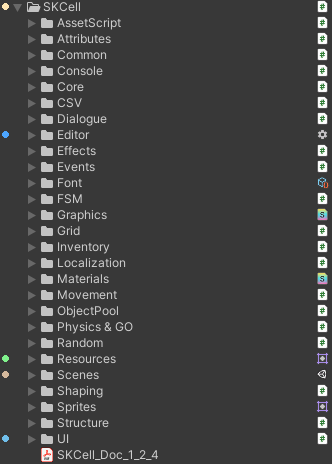

**
<BBBG>框架简述</BBBG>
**

<!-- TOC -->

- [MFramework](#mframework)
- [框架思想](#框架思想)
  - [什么是框架](#什么是框架)
  - [设计规范](#设计规范)
  - [规范简述](#规范简述)
    - [UI框架](#ui框架)
- [框架分析](#框架分析)
  - [SKCell](#skcell)
    - [简述](#简述)
    - [分析](#分析)

<!-- /TOC -->

# MFramework

为了构建一个属于本人的框架(MFramework)，那么框架是比不可少的
截至至2024.9.19，MFramework"发布"了1.0.0版本包，这是由本人制作的一个框架，其使用的就是最简单的**思路：<VT>由功能成体系</VT>**

**这种思路很好想到，因为：**
我可能想制作某个类型的游戏，那么我需要从头到尾编写所有的脚本，这必然会接触到UI/计时器/对象池以及各种模块，那么很自然地就会不断扩充模块库，从而形成框架

但是显然这并**不能完全称之为框架**，虽然通过学习知识点/制作某类型游戏会不断地扩充，每扩充一点，下一次制作都会简单一点，但是<VT><B>框架核心-体系</B></VT>却没有体现

我可以想到某处**存在的问题**：
某几个模块的<DRD><B>耦合是极高的</B></DRD>，比如说：UGUI(TMP_Text)/MTextAnimator/MLocalization
这些内容其实是**一条流水线**：
- 我为TMP_Text添加了动画以及本地化功能，首先动画与本地化都是独立塞进MText(TMP_Text的派生类)中的，它们的<DRD>添加略有不好看</DRD>，
- 更关键的是由于UGUI本身有自己的执行时机，两个模块也有先后顺序关系(先要更新文字再执行动画)，那么就会<DRD>存在延迟执行问题与逻辑混乱问题</DRD>

 

**我希望的框架**是这样的：

- **不基于Unity**
  目前来说，我的框架与Unity可以说是绑定在一起的，如`MonoSingleton`/`ComponentSingleton`以及最普通的`Monobehaviour`都会<DRD><B>使我们的脚本仅能用于Unity</B></DRD>
  我所希望的是：**<VT>如果某引擎使用C#，我的脚本同样能用于该引擎</VT>**
- **适中的架构**
  目前来说，**我的框架过于简单**，可以认为是<GN><B>模块库</B></GN>，但是同样又存在如QTFramework这种**庞大的框架**
  我所希望的是：**<VT>使用便捷，但有有一定的体系</VT>**

# 框架思想

## 什么是框架

**在我的理解中：**
<VT><B>框架的本质一定是模块</B></VT>，因为模块提供了功能，我们所需要的就是使用功能
那么我的Mframwork1.0.0已经做到了这一点，但是同样地，我们也需要一些**锦上添花的内容**

**<VT>如果说框架的本质是模块，那么框架的核心就是体系</VT>**
**<BL>问题：为什么</BL>**
<BL>模块是一个一个部分，可能有UI模块/AB模块/本地化模块/...，但是如果只是这样，它们只是一堆散件，没有一定的约束与规范</BL>
**<VT>我们所希望的就是额外添加一定的约束以及设计规范</VT>**

## 设计规范

既然要在我们自己的框架中添加设计规范，那么首先我们需要的当然是了解所有的设计规范
**具体如下：**

- **UI底层框架**
  - **<GN>MVC</GN>**---即<GN><B>Model-View-Controller</B></GN>，<VT>最经典的UI思想</VT>
  - **<GN>MVVM</GN>**---即<GN><B>Model-View-ViewModel</B></GN>，<VT>与MVC类似，对于大量动态UI会比MVC更高效</VT>
  - **<GN>MVP</GN>**---即<GN><B>Model-View-Presenter</B></GN>，<VT>与MVC类似，但是View与Model完全隔离</VT>
- **<GN>ECS</GN>**---即<GN><B>Entity Component System</B></GN>，<VT>是一个gameplay层面框架，用于解决GameObject的更新操作</VT>
  - Unity本身提供了Entities包，即ECS
  - **<GN>DOTS</GN>**，即<GN><B>Data-Oriented Technology Stack</B></GN>，<VT>由ECS/Job System/Burst组建而成</VT>
- **事件驱动**
  - C#的delegate/event与Action/Func
  - Unity的UnityEvent
  - 中介者模式
  - **<GN>UniRx</GN>**，Unity的<VT>响应式编程框架</VT>
- **七大设计原则**
  - 单一职责原则SRP
  - 开放-关闭原则OCP
  - 里氏替换原则LSP
  - **依赖倒转原则DIP**
    - **<GN>IoC</GN>**，即<GN><B>控制反转Inversion of Control</B></GN>，是一种<VT>实现DIP的方式</VT>
      - **<GN>DI</GN>**，即<GN><B>依赖注入Dependency Injection</B></GN>，是一种<VT>IoC的具体技术手段</VT>
        - **框架：**
          - Zenject
          - Extenject
          - VContainer
  - 接口隔离原则ISP
  - 迪米特法则LOD
  - **组合/聚合复用原则CARP**
- **设计模式**
  - 创建型模式
  - 结构型模式
  - 行为型模式
  - GoF23种外：
    - <GN><B>服务定位器模式Service Locator</B></GN><VT>(行为性)</VT>，一种<VT>IoC的实现方式</VT>
- **<GN>分层架构</GN>**，即<GN><B>Layered Architecture</B></GN>，大致就是通过分层使<VT>职责分离，耦合降低</VT>
  - **可能的分层形式：**
    - 表现层/逻辑层/数据层---最简单的形式
    - 表现层/逻辑层/服务层/领域层/数据层/基础设施层---扩展形式
- **<GN>CQRS</GN>**，即<GN><B>命令查询职责分离Command Query Responsibility Segregation</B></GN>
  核心就是<VT>将写入与读取分离</VT>

## 规范简述

### UI框架

# 框架分析

**框架：**

- **QFramework**
- **SKCell**
  - [Github](https://github.com/Skyrim07/SKCell)
  - [Document](https://skyrim07.github.io/SKCell/#/)
- **GameFramework**
- **MyUnityFramework**
- **QTFramework(暂未下载)**
  - [配置方法](https://www.bilibili.com/video/BV138y6YDEG6)
- **LoxodonFramework**---UI解决方案
  
## SKCell

### 简述

**结论：<VT>基于Unity的功能库</VT>**

SKCell是一个**功能性框架**，个人比较喜欢，是一个逻辑上非常清晰的框架，而且提供了很多**编辑器**方面的**便捷工具**方便使用<YL>(编辑器美化/对话编辑器/本地化编辑器/...)</YL>

### 分析

简单观察便可得出**结论**：

- **<GN>结构清晰</GN>**，由功能构成，使用者也自行根据需求寻找相应功能
  - 核心Core---`SKCore.cs`
  - CSV/FSM/ObjectPool/UI/...
- **<DRD>过于简单</DRD>**，没有任何结构上的联系，只是一堆"散件"
- **<DRD>方便使用</DRD>**，但与Unity关联性较高，可以看到大量挂载在GameObject的脚本：
  - 无关联脚本(接口/结构类/数据类)
  - 挂载脚本(即MonoBehaviour脚本)
  - Manager脚本(SKCell中本质上是MonoBehaviour脚本)