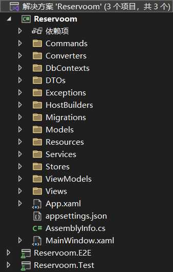

**<center><BBBG>WPFMVVM分析</BBBG></center>**

<!-- TOC -->

- [简述](#简述)
- [分析](#分析)
  - [核心-MVVM](#核心-mvvm)
    - [Models](#models)
    - [Views](#views)
    - [ViewModels](#viewmodels)
      - [绑定](#绑定)
  - [辅助](#辅助)
    - [Commands](#commands)
    - [Host/Services/Stores](#hostservicesstores)
      - [Hotel分析](#hotel分析)
      - [Navigation分析](#navigation分析)
    - [总结](#总结)

<!-- /TOC -->

# 简述

WPF是.NET框架下用于制作Windows桌面应用程序的框架
当然，与UI相关的内容最合适的就是<B><VT>使用MVVM</VT></B>

在WPF中，最值得注意的内容就是<B><GN>xaml文件</GN></B>了，这是一种用于定义界面信息的语言，可能长这样：

``` xaml
<UserControl
    x:Class="Reservoom.Views.MakeReservationView"
    xmlns="http://schemas.microsoft.com/winfx/2006/xaml/presentation"
    xmlns:x="http://schemas.microsoft.com/winfx/2006/xaml"
    xmlns:custom="clr-namespace:LoadingSpinnerControl;assembly=LoadingSpinnerControl"
    xmlns:d="http://schemas.microsoft.com/expression/blend/2008"
    xmlns:local="clr-namespace:Reservoom.Views"
    xmlns:mc="http://schemas.openxmlformats.org/markup-compatibility/2006"
    d:DesignHeight="450"
    d:DesignWidth="800"
    mc:Ignorable="d">
    <UserControl.Resources>
        <BooleanToVisibilityConverter x:Key="BooleanToVisibilityConverter" />
    </UserControl.Resources>
    <Grid Grid.IsSharedSizeScope="True">
        <Grid.RowDefinitions>
            <RowDefinition Height="auto" />
            <RowDefinition Height="auto" />
            <RowDefinition Height="auto" />
            <RowDefinition Height="auto" />
            <RowDefinition Height="auto" />
            <RowDefinition Height="auto" />
        </Grid.RowDefinitions>

        更多内容
    </Grid>
</UserControl>
```

可以看得出确实都是各个组件以及其信息，其中最重要的是<B><GN>Binding</GN></B><VT>(后续分析)</VT>

# 分析

这里是以<B>youtube的SingletonSean的[WPF MVVM TUTORIAL](https://www.youtube.com/watch?v=fZxZswmC_BY)</B>，<B><VT>一个旅馆预定系统</VT></B>为例进行分析

首先使用的是MVVM，所以框架本身怎么都脱离不了**Model/View/ModelView**三个内容
其次，由于是基于C#(.NET)，微软本身提供了非常多有用的**Extensions**，比如说这里最实用的<B><GN>DI(`Microsoft.Extensions.DependencyInjection`)</GN></B>

所以我们先来看一下**目录结构**：


**<BL>问题:Test/E2E是什么</BL>**
<BL>Test我们大概率会知道，即<B><GN>单元测试<GN></B>，这是比较常见的
而E2E其实也是一种单元测试，只是是针对于<B><GN>端到端(End-to-End)<GN></B>，即<B><VT>从用户输入到数据用于验证操作执行正确性</VT></B></BL>

我们更需要关注的是本体项目的内容：

- **MVVM**
  - Models
  - Views
  - ViewModels
- **辅助**
  - Commands，操作的包装
  - Converters，view的可见性绑定
  - DbContexts，数据库相关
  - DTOs，数据传输对象Data Transfer Object
  - Exceptions，异常处理
  - HostBuilders，Host相关
  - Migrations，EFCore(Entity Framework Core)自动生成
  - Services，服务类，用于完成某项任务
  - Stores，储存类，用于收集并储存，还可以提供操作

可以看到整体来说就是<B><VT>MVVM并向下细分各种类用于构建</VT></B>

## 核心-MVVM

我们还是先看一下基础的M/V/VM，毕竟这是核心部分，扩展也只会从它们开始扩展

### Models
Models我们知道，核心必然是用于存储数据的，但是具体来说是<B><VT>形态各异</VT></B>的
对于该例来说，分为4个Model：

- Hotel，旅馆本体，核心为存储一本ReservationBook
- ReservationBook，预定簿
- Reservation，预定单，为预定簿的一次预定信息
- RoomID，Reservation中的房间信息

**形态1：纯数据**

``` csharp
public class Reservation
{
    public RoomID RoomID { get; }
    public string Username { get; }
    public DateTime StartTime { get; }
    public DateTime EndTime { get; }

    public TimeSpan Length => EndTime.Subtract(StartTime);

    public Reservation(RoomID roomID, string username, DateTime startTime, DateTime endTime)
    {
        RoomID = roomID;
        Username = username;
        StartTime = startTime;
        EndTime = endTime;
    }
}
```

**形态2：数据+比较**

``` csharp
public class RoomID
{
    public int FloorNumber { get; }
    public int RoomNumber { get; }

    public RoomID(int floorNumber, int roomNumber)
    {
        FloorNumber = floorNumber;
        RoomNumber = roomNumber;
    }

    public override string ToString()
    {
        return $"{FloorNumber}_{RoomNumber}";
    }

    public override bool Equals(object obj)
    {
        return obj is RoomID roomID &&
            FloorNumber == roomID.FloorNumber &&
            RoomNumber == roomID.RoomNumber;
    }

    public override int GetHashCode()
    {
        return HashCode.Combine(FloorNumber, RoomNumber);
    }

    public static bool operator ==(RoomID roomID1, RoomID roomID2)
    {
        if(roomID1 is null && roomID2 is null)
        {
            return true;
        }

        return !(roomID1 is null) && roomID1.Equals(roomID2);
    }

    public static bool operator !=(RoomID roomID1, RoomID roomID2)
    {
        return !(roomID1 == roomID2);
    }
}
```

**形态3：数据+操作**

``` csharp
public class Hotel
{
    private readonly ReservationBook _reservationBook;

    public string Name { get; }

    public Hotel(string name, ReservationBook reservationBook)
    {
        Name = name;
        _reservationBook = reservationBook;
    }

    public async Task<IEnumerable<Reservation>> GetAllReservations()
    {
        return await _reservationBook.GetAllReservations();
    }

    public async Task MakeReservation(Reservation reservation)
    {
        await _reservationBook.AddReservation(reservation);
    }
}
```

**所以大致其实就是：**
**<VT>子提供数据(可附带比较)，父整合子数据并提供函数</VT>**

以上三个类都是很好理解的，而剩下的**ReservationBook**由于使用了<VT>DI包装</VT>，具体理解起来是比较非常复杂的：

``` csharp
public class ReservationBook
{
    private readonly IReservationProvider _reservationProvider;
    private readonly IReservationCreator _reservationCreator;
    private readonly IReservationConflictValidator _reservationConflictValidator;

    public ReservationBook(IReservationProvider reservationProvider, IReservationCreator reservationCreator, IReservationConflictValidator reservationConflictValidator)
    {
        _reservationProvider = reservationProvider;
        _reservationCreator = reservationCreator;
        _reservationConflictValidator = reservationConflictValidator;
    }

    public async Task<IEnumerable<Reservation>> GetAllReservations()
    {
        return await _reservationProvider.GetAllReservations();
    }

    public async Task AddReservation(Reservation reservation)
    {
        if(reservation.StartTime > reservation.EndTime)
        {
            throw new InvalidReservationTimeRangeException(reservation);
        }

        Reservation conflictingReservation = await _reservationConflictValidator.GetConflictingReservation(reservation);

        if(conflictingReservation != null)
        {
            throw new ReservationConflictException(conflictingReservation, reservation);
        }

        await _reservationCreator.CreateReservation(reservation);
    }
}
```

DI简化了类中理解难度，但继承调用链理解起来还是有一定的难度
<B>专注于该类</B>，其实就是：<VT><B>Services中的三项服务</B>(后续分析)</VT>

### Views

在WPF中，视图展示就是通过xaml文件完成的，**大致就是**：
<B><VT>一个MainWindow.xaml管理多个xaml文件</VT></B>
对于该例来说，是通过绑定ViewModel切换界面：

``` xaml
// MainWindow.xmal的切换语句
<ContentControl Content="{Binding CurrentViewModel}" />
```

在脚本中有所对应：
**核心：<VT>继承自`INotifyPropertyChanged`，由`OnPropertyChanged()`触发PropertyChanged
　　　这意味着每当Store中的`CurrentViewModel`改变则会触发</VT>**

``` csharp
public class MainViewModel : ViewModelBase 
{
    private readonly NavigationStore _navigationStore;

    public ViewModelBase CurrentViewModel => _navigationStore.CurrentViewModel;

    public MainViewModel(NavigationStore navigationStore)
    {
        _navigationStore = navigationStore;

        _navigationStore.CurrentViewModelChanged += OnCurrentViewModelChanged;
    }

    private void OnCurrentViewModelChanged()
    {
        OnPropertyChanged(nameof(CurrentViewModel));
    }
}

public class ViewModelBase : INotifyPropertyChanged
{
    public event PropertyChangedEventHandler PropertyChanged;

    protected void OnPropertyChanged(string propertyName)
    {
        PropertyChanged?.Invoke(this, new PropertyChangedEventArgs(propertyName));
    }

    public virtual void Dispose() { }
}
```

除了切换绑定，还有几种绑定：

``` xaml
// 数据绑定
<TextBox
    Grid.Row="1"
    Grid.Column="1"
    Margin="10,5,0,0"
    AutomationProperties.AutomationId="MakeReservationRoomNumberTextBox"
    Text="{Binding RoomNumber, UpdateSourceTrigger=PropertyChanged}" />

// 按钮绑定
<Button
    AutomationProperties.AutomationId="MakeReservationSubmitButton"
    Command="{Binding SubmitCommand}"
    Content="Submit" />

// 列表绑定
<ListView ItemsSource="{Binding Reservations}" Visibility="{Binding HasReservations, Converter={StaticResource BooleanToVisibilityConverter}}">
    <ListView.ItemContainerStyle>
        <Style TargetType="ListViewItem">
            <Setter Property="HorizontalContentAlignment" Value="Stretch" />
            <Setter Property="AutomationProperties.AutomationId" Value="{Binding RoomID, StringFormat={}{0}_ReservationListingItem}" />
        </Style>
    </ListView.ItemContainerStyle>
    <ListView.View>
        // ...
    </ListView.View>
</ListView>
```

绑定可以说是WPF中的重点，也是MVVM的重点，需要着重考虑其原理

### ViewModels

ViewModels是MVVM中的核心，比较MVX中都是通过X来沟通Model与View的

与Models一样承担的**职责**都有所**不同**：

- MainViewModel，核心VM，用于管理各个VM
- MakeReservationViewModel，预定VM
- ReservationListingViewModel，预定列表展示VM
- ReservationViewModel，Reservation包装

形态情况如下：
- 形态1：数据+绑定(`MainViewModel`)
- 形态2：数据+绑定+操作(`MakeReservationViewModel`/`ReservationListingViewModel`)
- 形态3：数据(`ReservationViewModel`)

<BR>

具体来说对应的就是：
**数据**
``` csharp
public class ReservationViewModel : ViewModelBase
{
    // 很明显，这里就是Reservation的一层包装
    // 直接转换为视图所需的string类型，方便后续使用
    private readonly Reservation _reservation;
    public string RoomID => _reservation.RoomID?.ToString();
    // ...
}
```

**绑定**
``` csharp
public class MainViewModel : ViewModelBase 
{
    private readonly NavigationStore _navigationStore;

    public ViewModelBase CurrentViewModel => _navigationStore.CurrentViewModel;

    public MainViewModel(NavigationStore navigationStore)
    {
        _navigationStore = navigationStore;

        _navigationStore.CurrentViewModelChanged += OnCurrentViewModelChanged;
    }

    private void OnCurrentViewModelChanged()
    {
        OnPropertyChanged(nameof(CurrentViewModel));
    }
}
```

**操作**

``` csharp
public void UpdateReservations(IEnumerable<Reservation> reservations)
{
    _reservations.Clear();

    foreach (Reservation reservation in reservations)
    {
        ReservationViewModel reservationViewModel = new ReservationViewModel(reservation);
        _reservations.Add(reservationViewModel);
    }
}
```

#### 绑定

前面也提到过，绑定是WPF的关键，所以**详细**来**分析**一下绑定：
比较典型的绑定就是**属性绑定**了：

``` csharp
private string _username;
public string Username
{
    get
    {
        return _username;
    }
    set
    {
        _username = value;
        OnPropertyChanged(nameof(Username));

        ClearErrors(nameof(Username));

        if(!HasUsername)
        {
            AddError("Username cannot be empty.", nameof(Username));
        }

        OnPropertyChanged(nameof(CanCreateReservation));
    }
}
```

绑定的核心在于其父类`ViewModelBase`，其声明为：
`public class ViewModelBase : INotifyPropertyChanged`
INotifyPropertyChanged为视图绑定的核心，即调用`PropertyChanged`事件以触发相应绑定
**<YL>以这里的Username为例：</YL>**
<YL>在某xaml中有：</YL>

``` xaml
<TextBox
    Grid.Row="1"
    Margin="0,5,0,0"
    AutomationProperties.AutomationId="MakeReservationUsernameTextBox"
    Text="{Binding Username, UpdateSourceTrigger=PropertyChanged}" />
```

<YL>具体来说是这样的：</YL>

- <YL>属性本身---`View->ViewModel`的绑定，即TextBox的更改事件</YL>
- <YL>INotifyPropertyChanged---`ViewModel->View`的绑定，即视图刷新</YL>

<YL>简单理解的话就是Binding会自动寻找同名属性绑定，同时再通过INotifyPropertyChanged事件进行视图刷新</YL>

**简单解释：**
<B><GN>DataContext</GN></B>是WPF的核心概念，是<B><VT>绑定操作的默认数据源</VT></B>
DataContext可能设置于各处，在该项目中有：

``` csharp
// App.cs
services.AddSingleton(s => new MainWindow()
{
    DataContext = s.GetRequiredService<MainViewModel>()
});
```

这意味着DataContext为MainViewModel

``` xaml
// MainWindow.xaml
<Grid.Resources>
    <DataTemplate DataType="{x:Type vms:MakeReservationViewModel}">
        <views:MakeReservationView />
    </DataTemplate>
    <DataTemplate DataType="{x:Type vms:ReservationListingViewModel}">
        <views:ReservationListingView />
    </DataTemplate>
</Grid.Resources>

<ContentControl Content="{Binding CurrentViewModel}" />
```

这又意味着CurrentViewModel会在MakeReservationViewModel/ReservationListingViewModel两者中切换

**更重要的是：<VT>所有子元素默认继承父元素的DataContext</VT>**
**这意味着：<VT>该ViewModel下的所有属性都可以自动绑定</VT>**

## 辅助

前面也说了，MVVM仅包含了最重要的部分，其余内容都被拆解为子部分了，那么这里就来详细看一下

### Commands

这里先从一个最熟悉的说起，即<B><GN>命令</GN></B>
命令模式我们都清楚，核心就是一个非常简单的`Execute()`
在WPF中，有自己的**ICommand**：

``` csharp
public interface ICommand
{
    event EventHandler? CanExecuteChanged;

    bool CanExecute(object? parameter);
    void Execute(object? parameter);
}
```

该例中**扩展**了一点：

``` csharp
public abstract class CommandBase : ICommand
public abstract class AsyncCommandBase : CommandBase
```

先看**执行**：
**核心：<VT>ICommand会被存入ViewModel，并在相应函数调用</VT>**

``` csharp
public ReservationListingViewModel(...)
{
    //...
    LoadReservationsCommand = new LoadReservationsCommand(this, hotelStore);
    //...
}

public static ReservationListingViewModel LoadViewModel(...)
{
    //...
    viewModel.LoadReservationsCommand.Execute(null);

    return viewModel;
}
```

再看**绑定**：
以上是一种<VT>绑定无关的命令模式</VT>，对于这种形式，可以说就是简单的封装，一种使结构更加清晰的方式
但是在WPF中是可以绑定的：

``` csharp
public AsyncCommandBase SubmitCommand { get; }
public ICommand CancelCommand { get; }

public MakeReservationViewModel(...)
{
    SubmitCommand = new MakeReservationCommand(this, hotelStore, reservationViewNavigationService);
    CancelCommand = new NavigateCommand<ReservationListingViewModel>(reservationViewNavigationService);
    // ...
}
```

在类中，我们无法找到对应的Execute，因为它们在View中：

``` xaml
<Button
    AutomationProperties.AutomationId="MakeReservationSubmitButton"
    Command="{Binding SubmitCommand}" // 这里
    Content="Submit" />
<Button
    Margin="10,0,0,0"
    Command="{Binding CancelCommand}" // 这里
    Content="Cancel">
    <Button.Style>
        <Style BasedOn="{StaticResource {x:Type Button}}" TargetType="Button">
    <Style.Triggers>
        <DataTrigger Binding="{Binding IsSubmitting}" Value="True">
            <Setter Property="IsEnabled" Value="False" /> // Tip：当IsSubmitting为true时，执行隐藏
        </DataTrigger>
    </Style.Triggers>
</Style>
    </Button.Style>
</Button>
```

**<BL>问题：CanExecute是什么</BL>**

``` csharp
public abstract class CommandBase : ICommand
{
    public event EventHandler CanExecuteChanged;

    public virtual bool CanExecute(object parameter)
    {
        return true;
    }

    public abstract void Execute(object parameter);

    protected void OnCanExecutedChanged()
    {
        CanExecuteChanged?.Invoke(this, new EventArgs());
    }
}

public abstract class AsyncCommandBase : CommandBase
{
    private bool _isExecuting;
    private bool IsExecuting
    {
        get
        {
            return _isExecuting;
        }
        set
        {
            _isExecuting = value;
            OnCanExecutedChanged();
        }
    }

    public override bool CanExecute(object parameter)
    {
        return !IsExecuting && base.CanExecute(parameter);
    }

    public override async void Execute(object parameter)
    {
        IsExecuting = true;

        try
        {
            await ExecuteAsync(parameter);
        }
        finally
        {
            IsExecuting = false;
        }
    }

    public abstract Task ExecuteAsync(object parameter);
}
```

在ICommand中，与INotifyPropertyChanged类似，同样**存在绑定**
先看上述**基础继承链**：
在CommandBase中，
可以发现`CanExecuteChanged`事件+`CanExecute()`+`OnCanExecutedChanged()`机制与INotifyPropertyChanged是一致的，所以说：只需在相应处执行`OnCanExecutedChanged()`并在View中绑定即可
在AsyncCommandBase中，
是异步形式，我们会发现`OnCanExecutedChanged()`已经被融入到`IsExecuting`中了，所以说一旦命令执行或结束，都会进行`CanExecute()`检测

**<YL>以MakeReservationCommand为例：</YL>**

``` csharp
public class MakeReservationCommand : AsyncCommandBase
{
    public MakeReservationCommand(...)
    {
        // 这里绑定到PropertyChanged上了，即可以通过OnPropertyChanged触发OnViewModelPropertyChanged
        _makeReservationViewModel.PropertyChanged += OnViewModelPropertyChanged;
    }

    public override bool CanExecute(object parameter)
    {
        return _makeReservationViewModel.CanCreateReservation && base.CanExecute(parameter);
    }

    public override async Task ExecuteAsync(object parameter)
    {
        // ...
        _makeReservationViewModel.IsSubmitting = true;

        // 一系列操作

        _makeReservationViewModel.IsSubmitting = false;
    }

    // 触发内容：执行OnCanExecutedChanged，即CanExecuteChanged
    private void OnViewModelPropertyChanged(object sender, PropertyChangedEventArgs e)
    {
        if(e.PropertyName == nameof(MakeReservationViewModel.CanCreateReservation))
        {
            OnCanExecutedChanged();
        }
    }
}
```

以上内容将`CanExecute()`绑定至`OnPropertyChanged()`，执行在相应处调用以触发即可：

``` csharp
// MakeReservationViewModel
private string _username;
public string Username
{
    get
    {
        return _username;
    }
    set
    {
        _username = value;
        OnPropertyChanged(nameof(Username));

        ClearErrors(nameof(Username));

        if(!HasUsername)
        {
            AddError("Username cannot be empty.", nameof(Username));
        }

        // 是这个
        OnPropertyChanged(nameof(CanCreateReservation));
    }
}
// 还有相关的FloorNumber/StartDate/EndDate都具有该OnPropertyChanged

public bool CanCreateReservation =>
    HasUsername &&
    HasFloorNumberGreaterThanZero &&
    HasStartDateBeforeEndDate &&
    !HasErrors;
```

**调用链：**`Username`变更触发`OnPropertyChanged(nameof(CanCreateReservation))`触发`OnViewModelPropertyChanged()`执行`OnCanExecutedChanged()`触发`CanExecuteChanged`事件，执行`CanExecute()`并更新激活性
**简述：<VT>Username属性的变更会触发到`OnCanExecutedChanged()`，即执行`CanExecute()`并更新激活性</VT>**

**总结：**
**<VT>结合代码与view来看，Button通常会绑定一个ICommand，核心会执行`Execute()`，
同时通过上述流程可通过`CanExecute()`控制按钮可用性</VT>**

### Host/Services/Stores

在该例中，**Services**是很重要的：
在核心的App.xaml.cs中大量出现，这其实就是我们所熟知<B><GN>DI框架</GN></B>，即<B><VT>通过接口代替类注册与创建</VT></B>

该例中涉及的服务有这几种：

- ReservationBook工具
  - DatabaseReservationConflictValidator
  - DatabaseReservationCreator
  - DatabaseReservationProvider
- 一般服务
  - NavigationService

前三者都是在为ReservationBook服务，而`NavigationService`显然是导航功能

在该例中，**Stores**同样是很重要的：
有2个：

- HotelStore---Hotel存储
- NavigationStore---导航存储

而真正的汇总工具为**Host**：

``` csharp
// App.xaml.cs
public App()
{
    _host = Host.CreateDefaultBuilder()
        .AddViewModels()
        .ConfigureServices((hostContext, services) =>
        {
            // ...
        })
        .Build();
}
```

基本上来说，就是由这三者的配合从而完成构建

<BR>

**接下来详细来看一下：**
根据上述内容，可以得知有2个部分：**Hotel/Navigation**

#### Hotel分析

Hotel本身是Models中的一个类，也就是旅馆本身，回忆一下，是一个存放了一个`ReservationBook`并提供`GetAllReservations()`/`MakeReservation()`以创建或获取的类
**<BL>问题：Hotel是怎么被创建出来的</BL>**
<BL>一切的创建都会在App.xaml.cs中执行，如下：</BL>

``` csharp
public App()
{
    _host = Host.CreateDefaultBuilder()
        .AddViewModels()
        .ConfigureServices((hostContext, services) =>
        {
            // ...
            // 创建ReservationBook的前提
            services.AddSingleton<IReservationProvider, DatabaseReservationProvider>();
            services.AddSingleton<IReservationCreator, DatabaseReservationCreator>();
            services.AddSingleton<IReservationConflictValidator, DatabaseReservationConflictValidator>();

            // 创建Hotel的前提
            services.AddTransient<ReservationBook>();

            // 创建HotelStore的前提
            string hotelName = hostContext.Configuration.GetValue<string>("HotelName");
            services.AddSingleton((s) => new Hotel(hotelName, s.GetRequiredService<ReservationBook>()));

            services.AddSingleton<HotelStore>();
            // ...
        })
        .Build();
}
```

<BL>可以看到这其实是<B>嵌套</B>的：
为了创建HotelStore，我们需要先创建构造函数所需的Hotel，
为了创建Hotel，我们需要先创建构造函数所需的ReservationBook，
为了创建ReservationBook，我们需要先创建构造函数所需的3个服务工具</BL>
由此逻辑也清晰了起来，我们也能得知：<B><VT>Services是独立的功能，无需结合来看</VT></B>

**<YL>这里就拿最简单的IReservationProvider为例：</YL>**
<YL>在ReservationBook中只是一个简单的调用：</YL>

``` csharp
// ReservationBook中
public async Task<IEnumerable<Reservation>> GetAllReservations()
{
    return await _reservationProvider.GetAllReservations();
}

public class DatabaseReservationProvider : IReservationProvider
{
    private readonly IReservoomDbContextFactory _dbContextFactory;

    public DatabaseReservationProvider(IReservoomDbContextFactory dbContextFactory)
    {
        _dbContextFactory = dbContextFactory;
    }

    public async Task<IEnumerable<Reservation>> GetAllReservations()
    {
        using (ReservoomDbContext context = _dbContextFactory.CreateDbContext())
        {
            IEnumerable<ReservationDTO> reservationDTOs = await context.Reservations.ToListAsync();

            return reservationDTOs.Select(r => ToReservation(r));
        }
    }

    private static Reservation ToReservation(ReservationDTO dto)
    {
        return new Reservation(new RoomID(dto.FloorNumber, dto.RoomNumber), dto.Username, dto.StartTime, dto.EndTime);
    }
}
```

<YL>可以看得出：<B><VT>不论过程，核心就是一个获取Reservation列表的工具类</VT></B></YL>

而<B><VT>HotelStore则是Hotel的封装</VT></B>，内容如下：

``` csharp
public HotelStore(Hotel hotel)
{
    _hotel = hotel;
    _initializeLazy = new Lazy<Task>(Initialize);

    _reservations = new List<Reservation>();
}

// 以及一些操作函数
```

**<BL>问题：为什么要封装一个Store，Hotel本身不够吗？</BL>**
<BL>确实如此，以一个函数为例：</BL>

``` csharp
public async Task MakeReservation(Reservation reservation)
{
    await _hotel.MakeReservation(reservation);
    _reservations.Add(reservation);
    OnReservationMade(reservation);
}
```

<BL>很明显，虽然是同一件事，但是还需要额外操作，这并不在Hotel本身中
所以说<B>封装是有必要的</B></BL>

大致阅读代码可发现，**HotelStore的核心**为：

- `Load()`---延迟执行的初始化，用于更新`_reservations`
- `MakeReservation()`---添加新预定，并更新到`_reservations`

所以可以发现<B>`_reservations`是HotelStore中添加的重要内容</B>
其**目的**当然是<B><VT>提供`_reservations`:</VT></B>

``` csharp
// LoadReservationsCommand
public override async Task ExecuteAsync(object parameter)
{
    // ...
    try
    {
        await _hotelStore.Load();
        _viewModel.UpdateReservations(_hotelStore.Reservations); // 用于更新真正VM的数据
    }
    catch (Exception) {...}
    // ...
}
```

**由此我们也能看出：**
<B><VT>`HotelStore._reservations`并非最终数据，而应该是`ReservationListingViewModel._reservations`</VT></B>
简单描述一下它们的**区别**：

- `Reservation`---一个Model，是预定信息本体
- `HotelStore._reservations`---Hotel本身具有一个ReservationBook，可以认为是Reservation列表，HotelStore作为一个存储管理类进行了一次包装
- `ReservationListingViewModel._reservations`---ViewModel作为真正的视图刷新数据通过`HotelStore._reservations`封装成了**ReservationViewModel列表**供视图刷新使用

#### Navigation分析

Navigation指的是**导航功能**，简单来说就是<VT>从界面a跳转至界面b</VT>
与其相关的当然是**NavigationService**与**NavigationStore**
先来看一下Service的声明：
`public class NavigationService<TViewModel> where TViewModel : ViewModelBase`
这说明了：

- NavigationService是泛型，存在多个
- 需要的TViewModel是ViewModel

结合代码可以**推论**：<B><VT>NavigationService提供了切换ViewModel的服务</VT></B>

NavigationService的代码如下：

``` csharp
public class NavigationService<TViewModel> where TViewModel : ViewModelBase
{
    private readonly NavigationStore _navigationStore;
    private readonly Func<TViewModel> _createViewModel;

    public NavigationService(NavigationStore navigationStore, Func<TViewModel> createViewModel)
    {
        _navigationStore = navigationStore;
        _createViewModel = createViewModel;
    }

    public void Navigate()
    {
        _navigationStore.CurrentViewModel = _createViewModel();
    }
}
```

从该脚本我们就可以看出：
**<VT>`_navigationStore`是一个管理CurrentViewModel的地方，同时仅存在一个ViewModel，通过`NavigationService.Navigate()`可延迟调用初始化工厂以更新CurrentViewModel</VT>**

**最终存放处：`MainViewModel.CurrentViewModel`<VT>(为了视图更新绑定)</VT>**

**调用有2种：**
一种当然是App.xaml.cs的初始化：

``` csharp
protected override void OnStartup(StartupEventArgs e)
{
    // ...
    // 初始化使用ReservationListingViewModel
    NavigationService<ReservationListingViewModel> navigationService = _host.Services.GetRequiredService<NavigationService<ReservationListingViewModel>>();
    navigationService.Navigate();
    // ...
}
```

另一种是被封装为Command：

- 在初始列表界面ReservationListingViewModel时
  - MakeReservationCommand(`NavigateCommand<MakeReservationViewModel>`)可进入预定界面
- 在预定界面MakeReservationViewModel时
  - CancelCommand(`NavigateCommand<ReservationListingViewModel>`)可回退至列表界面
  - SubmitCommand(`MakeReservationCommand`)也回退至列表界面，但会进行额外的更新列表操作

### 总结

总的来说，这是一个非常完整的项目，它通过大量.NET库辅助完成的项目
虽然它<B><GN>很完整很"清晰"</GN></B>，但是对于我第一次看源码，会感觉<B><DRD>非常"碎"非常不好理解，类需要其它类进行构造，嵌套非常深</DRD></B>
但作为一个完整项目，这种拆分其实应该是比较好的一种构建，只是需要个人具有一定的熟练度才能比较容易地看懂

**从MVVM的角度进行分析：**
前面也提到过，MVVM本身就是一种框架用于联系数据与视图
在WPFMVVM中，我认为<B><VT>.NET底层进行的绑定才是关键</VT></B>
细节方面实在过于复杂，我这里先列举出网上的信息：

- 绑定依赖于：
  - DependencyProperty
  - 反射
  - 事件(INotifyPropertyChanged)

绑定带来的最大的一个**好处**就是<VT><B>低耦合</B>：ViewModel与View不需要有引用(在表面上消失，但实际还是存在的)</VT>

**所以说：**
**<VT>以上的分析只能代表MVVM的功能以及拆分方式，而具体的核心双向绑定被WPF隐藏在底层了</VT>**

那么就从**表层**来看一下吧：

- 在WPF中，显示的基础是创建一个MainWindow，其中存储了DataContext，而DataContext是某个ViewModel
- ViewModels中有属性，在View中需要Binding，也就是：
  用户输入->set方法触发(含事件回调INotifyPropertyChanged)->视图变更
- 各项模块：
  - Models---纯数据+数据操作函数
  - Views---纯视图+绑定(与ViewModel)
  - ViewModels---Models的包装，具有View所想要的数据并在set方法中有事件回调(INotifyPropertyChanged)
  - Stores---Models的包装，是"共享容器"，用于提供某些属性
  - Services---服务，其实就是功能函数，供其它类使用
- 各项模块最终会在App.xaml.cs，也就是主函数中通过DI的方式注册与使用

**<BL>问题：Models/ViewModels/Stores的区别</BL>**
<BL>Models是数据本身，ViewModels是View所需的数据
而Stores是一种在Models之上，ViewModels之下的数据，包装Models后唯一存在，供ViewModels使用</BL>

虽然不分析底层，我们无法得知真正的流程，但是我们最起码还是了解了**ViewModels与Models/Views的关系，简单来说：**
**<VT>ViewModels是Models的一层包装，其中收集了视图刷新所需的所有数据，数据有2种：</VT>**

- 绑定数据，如`MakeReservationViewModel.Username`
- 数据的数据，如`ReservationViewModel`类的属性，在ReservationListingViewModel中有字段：`ObservableCollection<ReservationViewModel> _reservations`