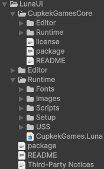
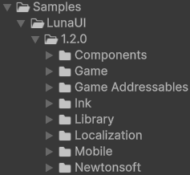

<B><BBBG>LunaUI分析</BBBG></B>

---
---
---

# 简述

LunaUI是一套<B>基于Unity</B>的<B>UI框架</B>
总体来说<B><VT>比较复杂</VT>，特点</B>如下：

- <B><GN>优点</GN></B>
  - 体系完整，内容多
- <B><DRD>缺点</DRD></B>
  - 版本虽新，但必须是Unity6之后的版本
  - 引用库很多，即依赖很多
  - 多也意味着学习成本较高

 

从表现上来看，效果非常不错，是一个值得学习的框架
再来看看<B>涉及内容</B>：
 <B>本体</B>
 <B>示例</B>
<B>提供解决方案</B>如下：

- 库
- 组件扩展
- 实例(PC/移动端)
- Addressable包
- 对话
- 本地化
- Json存储

都是非常实用的，它们的<B>基</B>就是本体中的内容：

- CupkekGames.Core：核心组件，更多的是提供支持(即底层)
  - Singleton，这很好地说明了Core中的内容
  - Fadeable---渐变动画
  - Pool---池
  - Input---输入系统
  - ...
- CupkekGames.Luna：可以说是业务层底层
  可以看到更多的是一些组件层面的内容，可能是小组件，也可能是组件组
  - Controllers---MonoBehaviour脚本，用于预制界面(view)/组件(component)
  - CustomComponents---自建新组件
  - Managers---核心管理器
  - ...

经过脚本的翻阅，我对其<B>定义</B>为：<B><VT>一个基于UI Toolkit的全方位UI扩展库</VT></B>

<BL>问题：有框架吗</BL>
<BL>可能是有的，大致浏览下来LunaUIManager/UIView文件夹可以算的上基，但本质上算不上框架</BL>