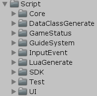
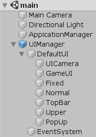

**<center><BBBG>MyUnityFramework分析</BBBG></center>**

<!-- TOC -->

- [简述](#简述)
- [框架](#框架)
  - [ApplicationManager](#applicationmanager)
  - [UIManager](#uimanager)
  - [总结](#总结)

<!-- /TOC -->

# 简述

该框架是一个比较老旧的框架了，查看其[Github](https://github.com/kisence-mian/MyUnityFrameWork)会发现上一次更新已经是2020年了，但整体来说也不算太过久远
简单看一下**框架目录**：

其中Core是核心部分，查看每一部分(Application/Audio/...)，会发现是<B><VT>由Mananger构成的</VT></B>

# 框架

对于该框架，可以说简单到没有框架了，查看其**示例项目main**：

可以看到程序部分由ApplicationManager中的**ApplicationManager.cs**管理
而UI部分由UIManager中的**UIManager.cs/UIAnimManager.cs/UILayerManager.cs/UIStackManager.cs**管理

## ApplicationManager

对于Manager来说，该框架使用的是最简单的<B><VT>单例</VT></B>构成：

``` csharp
private static ApplicationManager instance;
public static ApplicationManager Instance
{
    get {
        if (instance == null)
        {
            instance =  FindObjectOfType<ApplicationManager>();
        }
        return ApplicationManager.instance; }
    set { ApplicationManager.instance = value; }
}
```

对于该最大的Manager中**启动流程Awake**是至关重要的：

``` csharp
public void Awake()
{
    //Debug.Log("persistentDataPath:" + Application.persistentDataPath);
    instance = this;

    if (Application.platform != RuntimePlatform.WindowsEditor &&
        Application.platform != RuntimePlatform.OSXEditor)
    {
        try
        {
            string modeStr = PlayerPrefs.GetString("AppMode", m_AppMode.ToString());
            m_AppMode = (AppMode)Enum.Parse(typeof(AppMode), modeStr);
        }
        catch (Exception e)
        {
            Debug.LogError(e);
        }
    }
    
    AppLaunch();
}

public void AppLaunch()
{
    DontDestroyOnLoad(gameObject);
    Application.runInBackground = true;
    Screen.sleepTimeout = SleepTimeout.NeverSleep;

    SetResourceLoadType(useCacheWhenLoadResource);               //设置资源加载类型

    AudioPlayManager.Init();
    MemoryManager.Init();                //内存管理初始化
    Timer.Init();                        //计时器启动
    InputManager.Init();                 //输入管理器启动

#if !UNITY_WEBGL
    UIManager.Init();                    //UIManager启动
#else
    UIManager.InitAsync();               //异步加载UIManager
#endif
    ApplicationStatusManager.Init();     //游戏流程状态机初始化
    GlobalLogicManager.Init();           //初始化全局逻辑

    if (AppMode != AppMode.Release)
    {
        GUIConsole.Init(); //运行时Console

        DevelopReplayManager.OnLunchCallBack += () =>
        {
            SDKManager.Init();                   //初始化SDKManger
#if USE_LUA
            LuaManager.Init();
#endif
            InitGlobalLogic();                                //全局逻辑
            ApplicationStatusManager.EnterTestModel(m_Status);//可以从此处进入测试流程
        };

        DevelopReplayManager.Init(m_quickLunch);   //开发者复盘管理器
        LanguageManager.Init();
    }
    else
    {
        Log.Init(false); //关闭 Debug
        SDKManager.Init();                   //初始化SDKManger
#if USE_LUA
        LuaManager.Init();
#endif
        InitGlobalLogic();                             //全局逻辑
        ApplicationStatusManager.EnterStatus(m_Status);//游戏流程状态机，开始第一个状态

        LanguageManager.Init();
    }


    if (s_OnApplicationModuleInitEnd != null)
    {
        s_OnApplicationModuleInitEnd();
    }
}
```

可以看到简单来说就是<B><VT>以一定的顺序进行子Manager的初始化操作</VT></B>
所以我说这个框架并不能算严格意义上的框架

另一点是**生命周期事件回调**：

``` csharp
public delegate void ApplicationBoolCallback(bool status);
public delegate void ApplicationVoidCallback();

public static ApplicationVoidCallback s_OnApplicationModuleInitEnd = null;
public static ApplicationVoidCallback s_OnApplicationQuit = null;
public static ApplicationBoolCallback s_OnApplicationPause = null;
public static ApplicationBoolCallback s_OnApplicationFocus = null;
public static ApplicationVoidCallback s_OnApplicationUpdate = null;
public static ApplicationVoidCallback s_OnApplicationFixedUpdate = null;
public static ApplicationVoidCallback s_OnApplicationOnGUI = null;
public static ApplicationVoidCallback s_OnApplicationOnDrawGizmos = null;
public static ApplicationVoidCallback s_OnApplicationLateUpdate = null;

void OnApplicationQuit()
{
    if (s_OnApplicationQuit != null)
    {
        try
        {
            s_OnApplicationQuit();
        }
        catch (Exception e)
        {
            Debug.LogError(e.ToString());
        }
    }
}
void OnApplicationPause(bool pauseStatus)
{
    if (s_OnApplicationPause != null)
    {
        try
        {
            s_OnApplicationPause(pauseStatus);
        }
        catch (Exception e)
        {
            Debug.LogError(e.ToString());
        }
    }
}
void OnApplicationFocus(bool focusStatus)
{
    if (s_OnApplicationFocus != null)
    {
        try
        {
            s_OnApplicationFocus(focusStatus);
        }
        catch (Exception e)
        {
            Debug.LogError(e.ToString());
        }
    }
}
void Update()
{
    if (s_OnApplicationUpdate != null)
        s_OnApplicationUpdate();
}
private void LateUpdate()
{
    if (s_OnApplicationLateUpdate != null)
    {
        s_OnApplicationLateUpdate();
    }
}
private void FixedUpdate()
{
    if (s_OnApplicationFixedUpdate != null)
        s_OnApplicationFixedUpdate();
}
void OnGUI()
{
    if (s_OnApplicationOnGUI != null)
        s_OnApplicationOnGUI();
}
private void OnDrawGizmos()
{
    if (s_OnApplicationOnDrawGizmos != null)
        s_OnApplicationOnDrawGizmos();
}
```

可以看到本质上仅是一个**delegate**，会在需要时添加而已
<YL>随便举个例子如Timer：</YL>

``` csharp
public static void Init()
{
    ApplicationManager.s_OnApplicationUpdate += Update;
}
```

## UIManager

UIManager本质上**管理着其它几个Manager**：

``` csharp
public class UIManager : MonoBehaviour
{
    private static UILayerManager s_UILayerManager; //UI层级管理器
    private static UIAnimManager s_UIAnimManager;   //UI动画管理器
    private static UIStackManager s_UIStackManager; //UI栈管理器
    // ...
}
```

看似UIManager独立于ApplicationManager(因为需要挂载)，但事实并不如此：
UIManager依旧出现在ApplicationManager.Awake的启动流程中
之所以这样是因为：
**<VT>ApplicationStatusManager是一个MonoBehaviour，需要挂载，而像Timer/InputManager之类的，虽然有些有Manager后缀，但不意味着继承了MonoBehaviour</VT>**

## 总结

该框架是极易的框架，对于框架部分并无任何体系可言，但只要保证流程正确其实也就足够了

