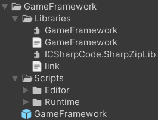
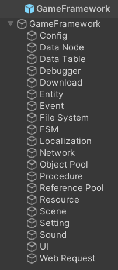
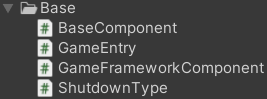

**<center><BBBG>UnityGameFramework分析</BBBG></center>**

<!-- TOC -->

- [简述](#简述)
- [框架](#框架)
  - [UnityGameFramework.Runtime.asmdef](#unitygameframeworkruntimeasmdef)
    - [GameEntry](#gameentry)
    - [BaseComponent](#basecomponent)
  - [GameFramework.dll](#gameframeworkdll)
    - [GameFrameworkEntry](#gameframeworkentry)
    - [其它](#其它)
  - [简单总结](#简单总结)

<!-- /TOC -->

# 简述

查看该Unity项目，大致可以发现，**框架功能偏多，框架虽有但比较简单**
首先看看**框架结构**：

可以看到是：**dll+asmdef**的搭配

# 框架

由于dll+asmdef的拆分，框架会显得比较"散"，但并不是没有，大致了解一下代码就会发现体系其实是很完整的

**<VT>该框架基本上基于一个prefab：GameFramework</VT>**

可以看到这就是**框架的形式**：
<B><VT>Component构成(每个GameObject分别对应一个功能)</VT></B>
在GameFramework物体上有Base组件，在Config物体上有Config组件，由于都是MonoBehaviour，所以可以执行相应操作，同时由某种方式可按顺序执行

## UnityGameFramework.Runtime.asmdef

该部分为dll扩展部分，必然会基于dll的实现进行添加或者扩展
其文件夹大致分类为：

- 基
  - Base
- 功能
  - Config
  - Localization
  - ...

显然框架必然会是Base中的内容，内容不多：


### GameEntry

<B><GN>GameEntry</GN></B>是其**游戏入口**，是一个静态类，也就是提供功能的
功能不多，但很重要：

- GetComponent()：获取组件(框架扩展的)
- Showdown()：程序关闭(None/Restart/Quit)
- RegisterComponent()：注册组件

显然，这里最重要的是**注册组件**，这在Component基类即<B><GN>GameFrameworkComponent</GN></B>中有所调用：

``` csharp
public abstract class GameFrameworkComponent : MonoBehaviour
{
    protected virtual void Awake()
    {
        GameEntry.RegisterComponent(this);
    }
}
```

**GameFrameworkComponent**唯一做的就是<B><VT>在Awake时将自己注册进GameEntry</VT></B>
由此会**通过`s_GameFrameworkComponents`在GameEntry中进行存储**

### BaseComponent

<B><GN>BaseComponent</GN></B>的**声明**如下：
`public sealed class BaseComponent : GameFrameworkComponent`
包括BaseComponent，以及其它所有功能的扩展Component都将**继承于GameFrameworkComponent**，由此可将所有的内容都注册到GameEntry中
显然BaseComponent承担的职责是更多的

BaseComponent具有一定的**不可配置字段/可配置字段/属性**，都将在不同的地方使用
除此以外，更重要的是其**生命周期**：

``` csharp
protected override void Awake()
{
    base.Awake();

    InitVersionHelper();
    InitLogHelper();
    Log.Info("Game Framework Version: {0}", GameFramework.Version.GameFrameworkVersion);
    Log.Info("Game Version: {0} ({1})", GameFramework.Version.GameVersion, GameFramework.Version.InternalGameVersion.ToString());
    Log.Info("Unity Version: {0}", Application.unityVersion);

#if UNITY_5_3_OR_NEWER || UNITY_5_3
    InitCompressionHelper();
    InitJsonHelper();

    Utility.Converter.ScreenDpi = Screen.dpi;
    if (Utility.Converter.ScreenDpi <= 0)
    {
        Utility.Converter.ScreenDpi = DefaultDpi;
    }

    m_EditorResourceMode &= Application.isEditor;
    if (m_EditorResourceMode)
    {
        Log.Info("During this run, Game Framework will use editor resource files, which you should validate first.");
    }

    Application.targetFrameRate = m_FrameRate;
    Time.timeScale = m_GameSpeed;
    Application.runInBackground = m_RunInBackground;
    Screen.sleepTimeout = m_NeverSleep ? SleepTimeout.NeverSleep : SleepTimeout.SystemSetting;
#else
    Log.Error("Game Framework only applies with Unity 5.3 and above, but current Unity version is {0}.", Application.unityVersion);
    GameEntry.Shutdown(ShutdownType.Quit);
#endif
#if UNITY_5_6_OR_NEWER
    Application.lowMemory += OnLowMemory;
#endif
}

private void Start()
{
}

private void Update()
{
    GameFrameworkEntry.Update(Time.deltaTime, Time.unscaledDeltaTime);
}

private void OnApplicationQuit()
{
#if UNITY_5_6_OR_NEWER
    Application.lowMemory -= OnLowMemory;
#endif
    StopAllCoroutines();
}

private void OnDestroy()
{
    GameFrameworkEntry.Shutdown();
}
```

可以发现：其中<B><VT>涉及许多dll内部实现</VT></B>
比如说`InitVersionHelper()`就是在填充GameFramework命名空间中的`Version.s_VersionHelper`
其中**值得注意**的有：
`GameFrameworkEntry.Update(Time.deltaTime, Time.unscaledDeltaTime);`
`GameFrameworkEntry.Shutdown();`
显然这是dll中的生命周期函数

## GameFramework.dll

dll部分被拆分成各个命名空间，简单来说有：

- `GameFramework`
- `GameFramework.xxx`(Config/Localization/...)

显然<B><VT>GameFramework命名空间是主体部分，其余的都是功能实现</VT></B>

### GameFrameworkEntry

与Unity的asmdef部分非常类似，GameEntry对应着这里的<B><GN>GameFrameworkEntry</GN></B>
两者的结构是非常相似的，**内容**如下：

- s_GameFrameworkModules：收集的GameFrameworkModule
- Update()
- Shutdown()
- GetModule()　没有则会CreateModule()

在GameEntry中是Component，GameFrameworkEntry中则是**Module**

**Module**
实际中就会有这样的使用：
`m_SoundManager = GameFrameworkEntry.GetModule<ISoundManager>();`
流程如下：

``` csharp
public static T GetModule<T>() where T : class
{
Type type = typeof (T);
if (!type.IsInterface)
    throw new GameFrameworkException(Utility.Text.Format("You must get module by interface, but '{0}' is not.", (object) type.FullName));
if (!type.FullName.StartsWith("GameFramework.", StringComparison.Ordinal))
    throw new GameFrameworkException(Utility.Text.Format("You must get a Game Framework module, but '{0}' is not.", (object) type.FullName));
string typeName = Utility.Text.Format("{0}.{1}", (object) type.Namespace, (object) type.Name.Substring(1));
return GameFrameworkEntry.GetModule(Type.GetType(typeName) ?? throw new GameFrameworkException(Utility.Text.Format("Can not find Game Framework module type '{0}'.", (object) typeName))) as T;
}

private static GameFrameworkModule GetModule(Type moduleType)
{
foreach (GameFrameworkModule gameFrameworkModule in GameFrameworkEntry.s_GameFrameworkModules)
{
    if (gameFrameworkModule.GetType() == moduleType)
    return gameFrameworkModule;
}
return GameFrameworkEntry.CreateModule(moduleType);
}

private static GameFrameworkModule CreateModule(Type moduleType)
{
GameFrameworkModule instance = (GameFrameworkModule) Activator.CreateInstance(moduleType);
if (instance == null)
    throw new GameFrameworkException(Utility.Text.Format("Can not create module '{0}'.", (object) moduleType.FullName));
LinkedListNode<GameFrameworkModule> node = GameFrameworkEntry.s_GameFrameworkModules.First;
while (node != null && instance.Priority <= node.Value.Priority)
    node = node.Next;
if (node != null)
    GameFrameworkEntry.s_GameFrameworkModules.AddBefore(node, instance);
else
    GameFrameworkEntry.s_GameFrameworkModules.AddLast(instance);
return instance;
}
```

由此可知：所有Module都是继承与<B><GN>GameFrameworkModule</GN></B>的
就像：
`internal sealed class SoundManager : GameFrameworkModule, ISoundManager`
**<BL>问题：为什么module是GameFrameworkModule，但是能获取到如ISoundManager等接口</BL>**
<BL>要知道的是`GetModule()`并非获取的是GameFrameworkModule基类，而是具体类，可以看到在`GetMoudle<T>()`中首先获取了实际的类名typeName，通过typeName转换为Type获取了具体类，由此生成的类必然是具体类</BL>

**生命周期**
虽然dll并不基于MonoBehaviour，但是会被BaseComponent调用：

``` csharp
private void Update()
{
    GameFrameworkEntry.Update(Time.deltaTime, Time.unscaledDeltaTime);
}

private void OnDestroy()
{
    GameFrameworkEntry.Shutdown();
}
```

具体实现如下：

``` csharp
public static void Update(float elapseSeconds, float realElapseSeconds)
{
    foreach (GameFrameworkModule gameFrameworkModule in GameFrameworkEntry.s_GameFrameworkModules)
        gameFrameworkModule.Update(elapseSeconds, realElapseSeconds);
}

public static void Shutdown()
{
    for (LinkedListNode<GameFrameworkModule> linkedListNode = GameFrameworkEntry.s_GameFrameworkModules.Last; linkedListNode != null; linkedListNode = linkedListNode.Previous)
        linkedListNode.Value.Shutdown();
    GameFrameworkEntry.s_GameFrameworkModules.Clear();
    ReferencePool.ClearAll();
    Utility.Marshal.FreeCachedHGlobal();
    GameFrameworkLog.SetLogHelper((GameFrameworkLog.ILogHelper) null);
}
```

显然：<B><VT>GameFrameworkModule具有`Update()`/`Shutdown()`，每个模块(Manager)需实现</VT></B>
所以说**对于模块来说有如下生命周期**：

- 第一次`GetModule()`即创建，此时会通过构造函数初始化
- Update时对所有模块进行`Update()`
- OnDestroy时对所有模块进行`Shutdown()`

Update轮询我们可能觉得不太常见，毕竟这些本质上都属于功能类，提供服务即可，但并不如此
**持续轮询的有以下模块：**

- DownloadManager
- EntityManager
- EventManager
- FsmManager
- NetworkManager
- ObjectPoolManager
- ResourceManager
- UIManager
- WebRequestManager

<BR>

### 其它

以上可以说是框架构成的重要部分，在GameFramework命名空间下还有一些其它的内容：

- 数据结构扩展新增
  - GameFrameworkLinkedListRange
  - GameFrameworkLinkedList
  - GameFrameworkMultiDictionary
  - ReferencePool
  - TaskPool
- 基础功能
  - Version
  - GameFrameworkSerializer
  - GameFrameworkLog
  - 数据解析
    - DataProviderCreator
    - DataProvider
    - IDataProviderHelper(需派生)
- 功能
  - Utility

<VT>以上并非内容的所有，同时其它命名空间下有着更多的内容，在Unity的asmdef中也会进行扩展</VT>

<BR>

## 简单总结

可以看得出来，框架部分其实内容不多，只是将dll与asmdef联系起来，并且以Moudle的形式编写功能类，以Component的形式在Unity中扩展
整体来说<B><VT>简单，但条理是比较清晰的</VT></B>