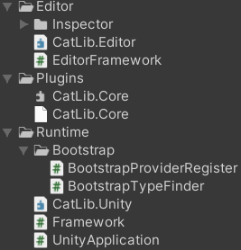
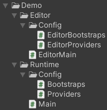
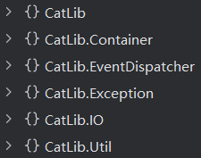

**<center><BBBG>CatLib分析</BBBG></center>**

<!-- TOC -->

- [简述](#简述)
- [分析](#分析)
  - [官方例子](#官方例子)
  - [框架](#框架)
    - [App](#app)
    - [Application](#application)
      - [Container](#container)
      - [Container总结](#container总结)
      - [Application流程](#application流程)

<!-- /TOC -->

# 简述

CatLib本质上并非一个Unity框架，它是由这几个部分组成：

- CatLib.Core.dll(C#端)
- CatLib.Unity.asmdef/CatLib.Editor.asmdef(Unity端适配)
- 扩展(如ILRuntime)

浏览其Demo可发现确实是一个<B><VT>最基础的框架</VT></B>

# 分析

其内容相当简单，下图就是框架的全部：　<VT>虽然dll里还有(但也不多)</VT>


## 官方例子

官方提供了一个例子，结构如下：

**可以发现：**

- 具有Runtime以及Editor部分
- 无论是Runtime/Editor，都具有相应的Bootstraps/Providers

先看**Runtime**：
可以看到核心就是**Main.cs**，具体如下：

``` csharp
/// <summary>
/// Main project entrance.
/// </summary>
[DisallowMultipleComponent]
public sealed class Main : Framework
{
    protected override void OnStartCompleted(IApplication application, StartCompletedEventArgs args)
    {
        // Application entry, Your code starts writing here
        // called this function after, use App.Make function to get service
        // ex: App.Make<IYourService>().Debug("hello world");
        Debug.Log("Hello CatLib, Debug Level: " + App.Make<DebugLevel>());
        App.Watch<DebugLevel>(newLevel =>
        {
            Debug.Log("Change debug level: " + newLevel);
        });
    }

    protected override IBootstrap[] GetBootstraps()
    {
        return Arr.Merge(base.GetBootstraps(), Bootstraps.GetBoostraps(this));
    }
}
```

这里很清楚地看到，summary提到这里是**项目主入口**
该类中做的仅是override，实现了一些操作：

- `OnStartCompleted()`：初始化完成后回调
- `GetBootstraps()`

**Framework.cs**是定义处：

``` csharp
[DisallowMultipleComponent]
[HelpURL("https://catlib.io/lasted")] // 已失效
public abstract class Framework : MonoBehaviour
{
    public DebugLevel DebugLevel = DebugLevel.Production;
    private Application application;

    /// <summary>
    /// Gets a value represents a application instance.
    /// </summary>
    public IApplication Application
    {
        get { return application; }
    }

    protected virtual void Awake()
    {
        DontDestroyOnLoad(gameObject);
        App.That = application = CreateApplication(DebugLevel);
        BeforeBootstrap(application);
        application.Bootstrap(GetBootstraps());
    }

    protected virtual void Start()
    {
        application.Init();
    }

    /// <summary>
    /// Create a new Application instance.
    /// </summary>
    protected virtual Application CreateApplication(DebugLevel debugLevel)
    {
        return new UnityApplication(this)
        {
            DebugLevel = debugLevel
        };
    }

    /// <summary>
    /// Trigged before booting.
    /// </summary>
    protected virtual void BeforeBootstrap(IApplication application)
    {
        application.GetDispatcher()?.AddListener(ApplicationEvents.OnStartCompleted, (sender, args) =>
        {
            OnStartCompleted((IApplication)sender, (StartCompletedEventArgs)args);
        });
    }

    /// <summary>
    /// Returns an array representing the bootstrap of the framework.
    /// </summary>
    protected virtual IBootstrap[] GetBootstraps()
    {
        return GetComponents<IBootstrap>();
    }

    /// <summary>
    /// Trigged when the framework will destroy.
    /// </summary>
    protected virtual void OnDestroy()
    {
        application?.Terminate();
    }

    /// <summary>
    /// Triggered when the framework is started
    /// </summary>
    protected abstract void OnStartCompleted(IApplication application, StartCompletedEventArgs args);
}
```

**Framework提供了以下功能：**

- Framework是一个MonoBehaviour脚本，具有可挂载功能
- 该MonoBehaviour是DontDestroy的
- application是该套框架的核心，这里创建的是一个<B><GN>UnityApplication</GN></B>
  - UnityApplication需要提供自己的MonoBehaviour(其实就是反向注入)，并设置DebugLevel
- 具体内容被隐藏在框架内部(CatLib.Core.dll)了，从表象上来看：　<VT>按顺序</VT>
  - application被设置到`App.That`
  - Awake中进行Bootstrap操作
  - Start中进行Init操作
  - OnDestroy中进行Terminate操作

以上看起来极其简单，但事实上是<VT>dll隐藏了大部分细节</VT>

<BR>

## 框架

使用反编译可看到CatLib.Core.dll的**结构**：

真的是<B><VT>非常的精简</VT></B>

### App

<B><GN>App</GN></B>是框架的<B><VT>核心管理类</VT></B>，由`App.That`即可知晓
其**声明**如下：
`[ExcludeFromCodeCoverage] public abstract class App`
**<BL>问题：为什么是一个abstract类</BL>**
<BL>查看代码可发现，该类所有内容都是static的，所以本质上该类是一个静态类，但是抽象类也是可行的，这可能是为了后续的扩展而准备的</BL>
**汇总**如下：

- That：核心，一个IApplication
- OnNewApplication事件：更换新IApplication时事件(当前有Application时添加会直接触发)
- IApplication封装：其它所有函数

由此可见，确切的来说：<B><VT>App是一个IApplication的包装，提供了切换的功能</VT></B>

### Application

那么核心中的核心其实就是Application了，观察后发现，其实只有一种Application，即<B><GN>UnityApplication</GN></B>
其**声明**如下：
`public class UnityApplication : Application`
<B>要注意的是：</B>UnityApplication是在Unity的CatLib.Unity中创建，即<B><VT>CatLib.Core.dll的Unity扩展适配</VT></B>

我们首先需要关注的是<B><GN>Application</GN></B>
**声明**如下：
`public class Application : CatLib.Container.Container, IApplication, IContainer`
`public class Container : IContainer`
可以看到Application其实是**继承于Container**的
观察后，可以发现我们应该这么理解：
**<VT>Application具有IApplication的功能，同时又具有IContainer的功能</VT>**

#### Container

Container继承了IContainer接口，内容很多，简单**整理**如下：

- **服务绑定** `Bind()` `BindIf()` `Unbind()` `GetBind()` `HasBind()`
- **服务解析** `Make()` `this[]` `CanMake()` `IsResolved()` `HasInstance()`
- **生命周期** `Instance()` `Release()` `Flush()` `IsStatic()`
- **方法注入** `BindMethod()` `UnbindMethod()` `Invoke()` `Call()`
- **服务标记** `Tag()` `Tagged()`
- **别名系统** `Alias()` `IsAlias()`
- **扩展事件** `Extend()` `OnResolving()` `OnAfterResolving()` `OnRelease()` `OnRebound()`
- **类型处理** `OnFindType()` `Type2Service()`
- **依赖添加** `Needs()` `Given()` <VT>需连写</VT>

由此我们可以得知：<B><VT>Container指的是DI Container，即依赖注入容器</VT></B>
**绑定**
作为DI，绑定是很重要的部分
`Bind()`有2种形式：
`IBindData Bind(string service, Type concrete, bool isStatic);`
`IBindData Bind(string service, Func<IContainer, object[], object> concrete, bool isStatic);`
第二种是更通用的：

``` csharp
public IBindData Bind(string service, Func<IContainer, object[], object> concrete, bool isStatic)
{
    // 防御代码
    Guard.ParameterNotNull((object) service, nameof (service));
    Guard.ParameterNotNull((object) concrete, nameof (concrete));
    this.GuardServiceName(service);
    this.GuardFlushing();
    // service检测
    service = this.FormatService(service);
    if (this.bindings.ContainsKey(service))
        throw new LogicException($"Bind [{service}] already exists.");
    if (this.instances.ContainsKey(service))
        throw new LogicException($"Instances [{service}] is already exists.");
    if (this.aliases.ContainsKey(service))
        throw new LogicException($"Aliase [{service}] is already exists.");
    // 绑定
    BindData bindData = new BindData(this, service, concrete, isStatic);
    this.bindings.Add(service, bindData); // 由于上方已检测，所以可以安心添加
    // 根据是否已解析决定是否特殊处理
    if (!this.IsResolved(service))
        return (IBindData) bindData;
    if (isStatic)
        this.Make(service, Array.Empty<object>());
    else
        this.TriggerOnRebound(service);
    return (IBindData) bindData;
}
```

<B><GN>Guard</GN></B>是CatLib的一个**Utility类**，用于<B><VT>代码安全相关</VT></B>，如`ParameterNotNull()`就是用于保证传参的正确性的，同时`GuardServiceName()`/`GuardFlushing()`也是一些防御代码
真正**关键**的是这一句：`BindData bindData = new BindData(this, service, concrete, isStatic);`
**<VT>BindData的创建意味着绑定的完成</VT>**，在此之后根据`IsResolved()`的情况进行了特殊处理

<B><GN>BindData</GN></B>看似是一个类，但实际上就包含了绑定操作
其**声明**如下：
`public sealed class BindData : Bindable<IBindData>, IBindData, IBindable<IBindData>, IBindable`
那么其实本质就是IBindData/IBindable
<B><GN>Bindable</GN></B>是其基，其**接口IBindable**具有以下内容：

- Service：服务名(注入)
- Container：就是Container自身，即this(注入)
- Unbind()

除此以外还有一些internal函数，是<VT>上下文相关</VT>的：

- AddContextual()
- GetContextual()
- GetContextualClosure()

**接口IBindData**是BindData扩展的内容，有：

- Concrete事件/IsStatic
- Alias()/Tag()/OnResolving()/OnAfterResolving()/OnRelease()

**Concrete**如下所示：`public Func<IContainer, object[], object> Concrete { get; }`
仅有get方法，这意味着仅能通过构造函数传入
由其名字与返回值可知：<B><VT>是一个用于真正创建IContainer的事件</VT></B>
与Concrete类似的有**IsStatic**，同通过构造函数传入
**其余函数**我们<VT>都在Container声明中见过，同时也确实用的就是Container的</VT>
**要注意的是：**
Bindata使用的是<B>`Bindable<IBindData>`</B>，即类似与Singleton的反向引用
在类中，IBindData泛型被称为**TReturn**，也就是<B><VT>返回值</VT></B>的含义
`IBindable<TReturn>`提供了唯一函数：`Needs()`

``` csharp
private GivenData<TReturn> given;

public IGivenData<TReturn> Needs(string service)
{
    Guard.ParameterNotNull((object) service, nameof (service));
    this.AssertDestroyed();
    if (this.given == null)
        this.given = new GivenData<TReturn>((CatLib.Container.Container) this.Container, this);
    this.given.Needs(service);
    return (IGivenData<TReturn>) this.given;
}

public IGivenData<TReturn> Needs<TService>()
{
    return this.Needs(this.Container.Type2Service(typeof (TService)));
}
```

那么本质就是通过`given.Needs()`来获取given(更新了)
如果given还没有，则会创建一个<B><GN>GivenData</GN></B>，其**声明**如下：
`internal sealed class GivenData<TReturn> : IGivenData<TReturn> where TReturn : class, IBindable<TReturn>`
作为**IGivenData**，唯一功能为`Given()`
GivenData的构造传入了container以及bindable，会在函数中用到
`Given()`如下所示：

``` csharp
public TReturn Given(string service)
{
Guard.ParameterNotNull((object) service, nameof (service));
this.bindable.AddContextual(this.needs, service);
return this.bindable as TReturn;
}

public TReturn Given<TService>() => this.Given(this.container.Type2Service(typeof (TService)));

public TReturn Given(Func<object> closure)
{
Guard.Requires<ArgumentNullException>(closure != null);
this.bindable.AddContextual(this.needs, closure);
return this.bindable as TReturn;
}
```

`needs`是通过`Needs()`设置，后续调用`Given()`则会通过`bindable.AddContextual()`将key-needs(service)/value-given(service)添加进contextual或contextualClosure字典中
将上述几者**联系一下**，即可了解到：

- `Bindable.AddContextual()`接收的needs与given其实都是service，也就是DI中对应的接口与接口实现
- `GivenData<TReturn>.Needs()`设置了所需服务(接口)，`Bindable<TReturn>`对其进行了包装
- `GivenData<TReturn>.Given()`设置了获取的服务(实例)
  - `Given()`具有2种形式，一种是string，一种是`Func<object>`，即服务名或闭包形式直接获取服务，这与`Bindable.contextual`/`Bindable.contextualClosure`两字典对应

<BR>

就这么来看，**BindData的创建**并未收集到太多信息，收集到的信息核心就只是`Needs()`的service，同时，前面提到的`Given()`此时还未调用

<BR>

**解析**
`Bind()`之后只是获取了BindData，此时实例并未创建，解析才是创建的地方
所对应的函数为<B>`Make()`</B>：

``` csharp
public object Make(string service, params object[] userParams)
{
    this.GuardConstruct(nameof (Make));
    return this.Resolve(service, userParams);
}

protected object Resolve(string service, params object[] userParams)
{
    Guard.ParameterNotNull((object) service, nameof (service));
    service = this.AliasToService(service); // 服务名更名
    object obj1;
    // 缓存检测
    if (this.instances.TryGetValue(service, out obj1))
        return obj1;
    // 循环依赖检测
    if (this.BuildStack.Contains(service))
        throw this.MakeCircularDependencyException(service);
    this.BuildStack.Push(service);
    this.UserParamsStack.Push(userParams);
    try
    {
        // 创建操作
        BindData bindFillable = this.GetBindFillable(service);
        object instance1 = this.Build(bindFillable, userParams);
        object instance2 = this.Extend(service, instance1);
        object obj2 = bindFillable.IsStatic ? this.Instance(bindFillable.Service, instance2) : this.TriggerOnResolving(bindFillable, instance2);
        this.resolved.Add(bindFillable.Service);
        return obj2;
    }
    finally
    {
        this.UserParamsStack.Pop();
        this.BuildStack.Pop();
    }
}
```

可以看到`Make()`本质上是`Resolve()`，可以看到核心必然是`Build()`/`Extend()`
**先看`Build()`：**

``` csharp
protected virtual object Build(BindData makeServiceBindData, object[] userParams)
{
    object instance = makeServiceBindData.Concrete != null ? makeServiceBindData.Concrete((IContainer) this, userParams) : this.CreateInstance((Bindable) makeServiceBindData, this.SpeculatedServiceType(makeServiceBindData.Service), userParams);
    return this.Inject((Bindable) makeServiceBindData, instance);
}

private object Inject(Bindable bindable, object instance)
{
    this.GuardResolveInstance(instance, bindable.Service);
    this.AttributeInject(bindable, instance);
    return instance;
}
```

可以看到：

- instance的创建有2种方式：
  - 如果有Concrete，则使用该事件创建
    如this索引器中有：
    <BR>

    ``` csharp
    set
    {
        this.GetBind(service)?.Unbind();
        this.Bind(service, (Func<IContainer, object[], object>) ((container, args) => value), false);
    }
    ```

    可以看出这是一种<B><VT>直接的创建</VT></B>，set传入的value即实例
    可能的形式有：`container["my.service"] = new MyService();`
  - 如果没有Concrete，则会通过这种方式创建：
    `this.CreateInstance((Bindable) makeServiceBindData, this.SpeculatedServiceType(makeServiceBindData.Service), userParams)`
    <BR>

    ``` csharp
    protected virtual object CreateInstance(
        Bindable makeServiceBindData,
        Type makeServiceType,
        object[] userParams)
    {
        if (this.IsUnableType(makeServiceType))
            return (object) null;
        userParams = this.GetConstructorsInjectParams(makeServiceBindData, makeServiceType, userParams);
        try
        {
            return this.CreateInstance(makeServiceType, userParams);
        }
        catch (System.Exception ex)
        {
            throw this.MakeBuildFaildException(makeServiceBindData.Service, makeServiceType, ex);
        }
    }
    ```

    第一件事是**判断类型可用性**：`this.IsUnableType(makeServiceType)`
    对于abstract/interface/array/enum/可空类型/null是不可用的
    对于其它一般的类型都是可用的
    由于类型是用string表示的，所以需要通过`SpeculatedServiceType()`进行获取，这主要是通过**findType**(`SortSet<Func<string, Type>, int>`，大致是一种具有优先级的string转Type的事件)
    **findType的添加**是通过`Container.OnFindType()`完成的，对于Application.cs来说，有**默认实现**：
    `this.OnFindType((Func<string, Type>) (finder => Type.GetType(finder)), int.MaxValue);`
    同时**App.cs也提供了`OnFindType()`的包装**
    所以说转换其实很方便，简单来说就是<VT>调用了`Type.GetType()`进行了转换</VT>

    第二件事是**获取构造函数参数列表**：`this.GetConstructorsInjectParams(makeServiceBindData, makeServiceType, userParams);`
    这里比较复杂，首先会做的是遍历所有构造函数，进行`this.GetDependencies(makeServiceBindData, constructorInfo.GetParameters(), userParams);`操作，该函数非常复杂，简单来说就是<VT>通过解析获取到了该构造函数需要的实例参数</VT>

    最后非常简单，就是**创建实例**：`this.CreateInstance(makeServiceType, userParams)`
    本质上就是在调用`Activator.CreateInstance()`
    显然，核心在于`GetDependencies()`，这里会非常复杂，因为一个类会有多种构造函数，同时参数有可能是基础类型，也有可能是某接口，那么创建起来必然是非常复杂的

- instance创建完成后还需进行`Inject()`操作，本质上就是进行了`AttributeInject()`操作，这与`[Inject]`特性有关，对于具有`[Inject]`特性且符合要求的属性可被注入，对于可注入内容，会进行：
`property.SetValue(makeServiceInstance, instance, (object[]) null)`即赋值操作
- **<VT>Tip：instance创建与`[Inject]`并不冲突，构造函数可以传统注入一些，而属性注入可以注入另一些</VT>**

**再看`Extend()`：**

``` csharp
private object Extend(string service, object instance)
{
    List<Func<object, IContainer, object>> funcList;
    if (this.extenders.TryGetValue(service, out funcList))
    {
        foreach (Func<object, IContainer, object> func in funcList)
        instance = func(instance, (IContainer) this);
    }
    if (!this.extenders.TryGetValue(string.Empty, out funcList))
        return instance;
    foreach (Func<object, IContainer, object> func in funcList)
        instance = func(instance, (IContainer) this);
    return instance;
}
```

可以看到这是一个<B><VT>局部/全局扩展器</VT></B>，可以<VT>将extenders中的事件附加到instance中</VT>
**extenders的添加**在`Extend()`的另一个public声明中完成：

``` csharp
public void Extend(string service, Func<object, IContainer, object> closure)
{
    Guard.Requires<ArgumentNullException>(closure != null);
    this.GuardFlushing();
    service = string.IsNullOrEmpty(service) ? string.Empty : this.AliasToService(service);
    object obj;
    // 如果服务已经有实例，立即应用扩展
    if (!string.IsNullOrEmpty(service) && this.instances.TryGetValue(service, out obj))
    {
        object key = obj;
        this.instances[service] = obj = closure(obj, (IContainer) this);
        if (!key.Equals(obj))
        {
        this.instancesReverse.Remove(key);
        this.instancesReverse.Add(obj, service);
        }
        this.TriggerOnRebound(service, obj);
    }
    else
    {
        // 否则保存扩展器，待后续解析时应用
        List<Func<object, IContainer, object>> funcList;
        if (!this.extenders.TryGetValue(service, out funcList))
        this.extenders[service] = funcList = new List<Func<object, IContainer, object>>();
        funcList.Add(closure);
        if (string.IsNullOrEmpty(service) || !this.IsResolved(service))
        return;
        this.TriggerOnRebound(service); // 重绑定机制
    }
}
```

可以看到：其实**extenders**是用于解析时的，如果实例已创建则根本无需extenders的，但同时需要更改一下**instancesReverse**的对象
但这里更重要的是`TriggerOnRebound()`，即<VT><B>重绑定机制</VT></B>：

``` csharp
private void TriggerOnRebound(string service, object instance = null)
{
    IList<Action<object>> reboundCallbacks = this.GetOnReboundCallbacks(service);
    if (reboundCallbacks == null || reboundCallbacks.Count <= 0)
        return;
    IBindData bind = this.GetBind(service);
    instance = instance ?? this.Make(service, Array.Empty<object>());
    for (int index = 0; index < reboundCallbacks.Count; ++index)
    {
        reboundCallbacks[index](instance);
        // 对非单例进行重创建实例操作(避免污染)
        if (index + 1 < reboundCallbacks.Count && (bind == null || !bind.IsStatic))
        instance = this.Make(service, Array.Empty<object>());
    }
}
```

简单来说就是<VT>执行所有重绑定回调，以更新instance</VT>
**rebound注册**则是通过`OnRebound()`完成

最终创建则是通过以下这句收尾：
`object obj2 = bindFillable.IsStatic ? this.Instance(bindFillable.Service, instance2) : this.TriggerOnResolving(bindFillable, instance2);`
也就是说对于IsStatic，具有2种形式：　<VT>注意不是static关键字</VT>

- IsStatic：单例服务，具有缓存　`Instance()`
- !IsStatic：瞬态服务，每次都会创建新的　`TriggerOnResolving()`
- 而<B><VT>是否是Static的则在`Bind()`时决定</VT></B>

<BR>

**<BL>问题：`Resolve()`中的BuildStack/UserParamsStack的作用是什么</BL>**
<BL>首先要注意到的一点是：<B><VT>`Resolve()`是会发生递归的，不考虑代码，仅考虑何时发生，那么在服务A需要服务B时必然会先进行服务B的解析，即2次`Resolve()`</VT></B>
那么BuildStack会在`Resolve()`的开始进行检查，防止发生A->B->A这种循环依赖情况
但UserParamsStack好像没有用到</BL>

**总之：<VT>执行`Make()`则会真正获取到service实例</VT>**

绑定与解析可以说是DI的核心，**其余**还存在一些**特性**：

<B>`Call()`</B>是一种方法调用方式，考虑在这种服务注入形式的框架下，方法同样可能需要注入接口(因为并没有被注入类，所以获取不到)，那么调用起来是比较麻烦的，该函数补充了这一点：

``` csharp
public object Call(object target, MethodInfo methodInfo, params object[] userParams)
{
    Guard.Requires<ArgumentNullException>(methodInfo != (MethodInfo) null);
    if (!methodInfo.IsStatic)
        Guard.Requires<ArgumentNullException>(target != null);
    this.GuardConstruct(nameof (Call));
    ParameterInfo[] parameters = methodInfo.GetParameters();
    userParams = this.GetDependencies((Bindable) this.GetBindFillable(target != null ? this.Type2Service(target.GetType()) : (string) null), parameters, userParams) ?? Array.Empty<object>();
    return methodInfo.Invoke(target, userParams);
}
```

该函数没有什么特别的，只是针对接口使用`GetDependencies()`进行了获取而已
相比`Call()`的**一次性调用**，<B>`BindMethod()`+`Invoke()`</B>是一种**更持久的注册**
相对的，这里的处理会更加麻烦：

``` csharp
public IMethodBind BindMethod(string method, object target, MethodInfo called)
{
    this.GuardFlushing();
    this.GuardMethodName(method);
    return this.methodContainer.Bind(method, target, called);
}

public object Invoke(string method, params object[] userParams)
{
    this.GuardConstruct(nameof (Invoke));
    return this.methodContainer.Invoke(method, userParams);
}
```

<B><GN>MethodContainer</GN></B>是一个Container下的**附属Container**，专用于方法绑定
相比Container来说，MethodContainer简单许多
MethodContainer的核心其实就是上述函数中的实现`Bind()`/`Invoke()`：

``` csharp
public IMethodBind Bind(string method, object target, MethodInfo methodInfo)
{
    Guard.ParameterNotNull((object) method, nameof (method));
    Guard.ParameterNotNull((object) methodInfo, nameof (methodInfo));
    if (!methodInfo.IsStatic)
        Guard.Requires<ArgumentNullException>(target != null);
    if (this.methodMappings.ContainsKey(method))
        throw new LogicException($"Method [{method}] is already Bind");
    MethodBind methodBind = new MethodBind(this, this.container, method, target, methodInfo);
    this.methodMappings[method] = methodBind;
    if (target == null)
        return (IMethodBind) methodBind;
    List<string> stringList;
    if (!this.targetToMethodsMappings.TryGetValue(target, out stringList))
        this.targetToMethodsMappings[target] = stringList = new List<string>();
    stringList.Add(method);
    return (IMethodBind) methodBind;
}

public object Invoke(string method, params object[] userParams)
{
    Guard.ParameterNotNull((object) method, nameof (method));
    MethodBind makeServiceBindData;
    if (!this.methodMappings.TryGetValue(method, out makeServiceBindData))
        throw MethodContainer.MakeMethodNotFoundException(method);
    object[] parameters = this.container.GetDependencies((Bindable) makeServiceBindData, makeServiceBindData.ParameterInfos, userParams) ?? Array.Empty<object>();
    return makeServiceBindData.MethodInfo.Invoke(makeServiceBindData.Target, parameters);
}
```

可以看到，与Container类似，在MethodContainer中的`Bind()`会创建出<B><GN>MethodBind</GN></B>，其本质与BindData相同，其**声明**为：
`internal sealed class MethodBind : Bindable<IMethodBind>, IMethodBind, IBindable<IMethodBind>, IBindable`
两者同为Bindable，但具有**IMethodBind特性**而非IBindData，而该接口仅为一个接口：
`public interface IMethodBind : IBindable<IMethodBind>, IBindable {}`
`Bind()`创建了MethodBind，在`Invoke()`中则会取出并通过`Container.GetDependencies()`获取所有参数进行方法(MethodInfo)真正的`Invoke()`
**<VT>本质上这与Container的操作无异</VT>**

<B>`Tag()`/`Tagged`</B>可以说是一组便捷工具，<B><VT>可以对一组service进行打标签，通过标签即可获取这组服务</VT></B>：

``` csharp
public void Tag(string tag, params string[] services)
{
    Guard.ParameterNotNull((object) tag, nameof (tag));
    this.GuardFlushing();
    List<string> stringList;
    if (!this.tags.TryGetValue(tag, out stringList))
        this.tags[tag] = stringList = new List<string>();
    foreach (string str in services ?? Array.Empty<string>())
    {
        if (!string.IsNullOrEmpty(str))
        stringList.Add(str);
    }
}

public object[] Tagged(string tag)
{
    Guard.ParameterNotNull((object) tag, nameof (tag));
    List<string> source;
    if (!this.tags.TryGetValue(tag, out source))
        throw new LogicException($"Tag \"{tag}\" is not exist.");
    return Arr.Map<string, object>((IEnumerable<string>) source, (Func<string, object>) (service => this.Make(service, Array.Empty<object>())));
}
```

可以看到其中具有一个**特性**：
**<VT>通过`Tagged()`获取到的内容并非string，而是由`Make()`生成的service实例</VT>**

<B>`Alias()`</B>是一种<B><VT>设别名操作</VT></B>，在前面的分析中出现过`AliasToService()`的用法：

``` csharp
private string AliasToService(string name)
{
    name = this.FormatService(name);
    string str;
    return !this.aliases.TryGetValue(name, out str) ? name : str;
}
```

本质上就是<VT>看看aliases中有没有存储别名</VT>
而别名的添加则就是通过`Alias()`完成：

``` csharp
public IContainer Alias(string alias, string service)
{
    Guard.ParameterNotNull((object) alias, nameof (alias));
    Guard.ParameterNotNull((object) service, nameof (service));
    if (alias == service)
        throw new LogicException($"Alias is same as service: \"{alias}\".");
    this.GuardFlushing();
    alias = this.FormatService(alias);
    service = this.AliasToService(service);
    if (this.aliases.ContainsKey(alias))
        throw new LogicException($"Alias \"{alias}\" is already exists.");
    if (this.bindings.ContainsKey(alias))
        throw new LogicException($"Alias \"{alias}\" has been used for service name.");
    if (!this.bindings.ContainsKey(service) && !this.instances.ContainsKey(service))
        throw new LogicException("You must Bind() or Instance() serivce before and you be able to called Alias().");
    this.aliases.Add(alias, service);
    List<string> stringList;
    if (!this.aliasesReverse.TryGetValue(service, out stringList))
        this.aliasesReverse[service] = stringList = new List<string>();
    stringList.Add(alias);
    return (IContainer) this;
}
```

在前面提到过`Extend()`/`OnRebound()`/`OnFindType()`几种扩展，其实还有一些扩展：

- `Extend()`：包装服务
- `OnFindType()`：类型转换扩展
- `OnRebound()`：重绑回调
- `OnResolving()`：解析完成回调
- `OnAfterResolving()`：解析完成回调
- `OnRelease()`：释放回调

#### Container总结

以上为Container的全部，但总的来说，其实非常简单：
**<VT>`Bind()`用于绑定，`Make()`用于解析，其余基本都是扩展</VT>**

<BR>

#### Application流程

**回到Application.cs：**
回看其声明：
`public class Application : CatLib.Container.Container, IApplication, IContainer`
我们其实能够明白：<B><VT>Application是具有DI功能的</VT></B>
与其说是继承，不如说其实本来就只是一个Application的功能
**IApplication接口**才是真正提供的功能：

``` csharp
public interface IApplication : IContainer
{
    bool IsMainThread { get; }
    DebugLevel DebugLevel { get; set; }
    IEventDispatcher GetDispatcher();
    void Register(IServiceProvider provider, bool force = false);
    bool IsRegistered(IServiceProvider provider);
    long GetRuntimeId();
    void Terminate();
}
```

这些内容算是非常熟悉的，毕竟这是**在Unity层中所需要调用的内容**
但同时也存在一些重要函数直接定义在Application中，考虑Framework中的流程：

在Awake阶段执行了**Bootstrap系列**操作：
首先是`BeforeBootstrap()`：本质上这是在调用`application.GetDispatcher()?.AddListener()`进行回调的添加，所谓的dispatcher即<B><GN>EventDispatcher</GN></B>，总之肯定是**某种事件触发机制**
更重要的是`application.Bootstrap(GetBootstraps())`：

``` csharp
protected virtual IBootstrap[] GetBootstraps()
{
    return GetComponents<IBootstrap>();
}
```

由`GetBootstraps()`我们可以确认：<B><VT>IBootstrap是一个MonoBehaviour脚本</VT></B>

``` csharp
public virtual void Bootstrap(params IBootstrap[] bootstraps)
{
    Guard.Requires<ArgumentNullException>(bootstraps != null);
    this.Process = !this.bootstrapped && this.Process == StartProcess.Construct ? StartProcess.Bootstrap : throw new LogicException("Cannot repeatedly trigger the Bootstrap()");
    bootstraps = this.Raise<BeforeBootEventArgs>(new BeforeBootEventArgs(bootstraps, (IApplication) this)).GetBootstraps();
    this.Process = StartProcess.Bootstrapping;
    HashSet<IBootstrap> bootstrapSet = new HashSet<IBootstrap>();
    foreach (IBootstrap bootstrap in bootstraps)
    {
        if (bootstrap != null)
        {
        if (bootstrapSet.Contains(bootstrap))
            throw new LogicException($"The bootstrap already exists : {bootstrap}");
        bootstrapSet.Add(bootstrap);
        if (!this.Raise<BootingEventArgs>(new BootingEventArgs(bootstrap, (IApplication) this)).IsSkip)
            bootstrap.Bootstrap();
        }
    }
    this.Process = StartProcess.Bootstraped;
    this.bootstrapped = true;
    this.Raise<AfterBootEventArgs>(new AfterBootEventArgs((IApplication) this));
}
```

`Bootstrap()`是bootstrap即<B><VT>启动流程的核心</VT></B>
核心一句自然是`bootstrap.Bootstrap()`，也就是说需要<VT>我们需要实现IBootstrap进行启动流程</VT>
**IBootstrap接口**非常简单：
`public interface IBootstrap{void Bootstrap();}`
接口仅需要一个`Bootstrap()`操作，也就意味着：
**<VT>`Bootstrap()`是Awake时的一个流程，我们需要自行实现若干个IBootstrap以完成Awake流程，具体做什么都是可行的(但DI创建是最关键的)</VT>**

在Start阶段执行了**Init**操作：

``` csharp
public virtual void Init()
{
    if (!this.bootstrapped)
        throw new LogicException("You must call Bootstrap() first.");
    this.Process = !this.inited && this.Process == StartProcess.Bootstraped ? StartProcess.Init : throw new LogicException("Cannot repeatedly trigger the Init()");
    this.Raise<BeforeInitEventArgs>(new BeforeInitEventArgs((IApplication) this));
    this.Process = StartProcess.Initing;
    foreach (IServiceProvider loadedProvider in (IEnumerable<IServiceProvider>) this.loadedProviders)
        this.InitProvider(loadedProvider);
    this.inited = true;
    this.Process = StartProcess.Inited;
    this.Raise<AfterInitEventArgs>(new AfterInitEventArgs((IApplication) this));
    this.Process = StartProcess.Running;
    this.Raise<StartCompletedEventArgs>(new StartCompletedEventArgs((IApplication) this));
}
```

可以看到除开事件回调，操作为`InitProvider()`，而provider来自于`Register()`：

``` csharp
public virtual void Register(IServiceProvider provider, bool force = false)
{
    Guard.Requires<ArgumentNullException>(provider != null, "Parameter \"provider\" can not be null.");
    if (this.IsRegistered(provider))
    {
        if (!force)
        throw new LogicException($"Provider [{provider.GetType()}] is already register.");
        this.loadedProviders.Remove(provider);
    }
    if (this.Process == StartProcess.Initing)
        throw new LogicException("Unable to add service provider during Initing");
    if (this.Process > StartProcess.Running)
        throw new LogicException("Unable to Terminate in-process registration service provider");
    if (provider is ServiceProvider serviceProvider)
        serviceProvider.SetApplication((IApplication) this);
    if (this.Raise<RegisterProviderEventArgs>(new RegisterProviderEventArgs(provider, (IApplication) this)).IsSkip)
        return;
    try
    {
        this.registering = true;
        provider.Register();
    }
    finally
    {
        this.registering = false;
    }
    this.loadedProviders.Add(provider);
    if (!this.inited)
        return;
    this.InitProvider(provider);
}
```

`Register()`需要IServiceProvider，这显然是<B><VT>服务的一层包装</VT></B>，其**声明**为：

``` csharp
public interface IServiceProvider
{
  void Init();
  void Register();
}
```

结合`Register()`来看，首先IServiceProvider具有一层抽象封装<B><GN>ServiceProvider</GN></B>，多了一个`SetApplication()`：
`internal void SetApplication(IApplication application) => this.App = application;`
简单来说就是<VT>设置了一下当前Application而已</VT>
provider首先会进行`Register()`操作，然后进行`Init()`操作，两者都是在`application.Register()`中完成的

结合`application.Init()`与`application.Register()`可以了解到：
`application.Register()`会先进行，会执行`provider.Register()`与`provdier.Init()`生成provider，此时有2种情况：

- !this.inited：即未执行`application.Init()`初始化，此时先返回，等待Init操作完成所有provider的`Init()`
- this.inited：即已执行`application.Init()`初始化，此时则直接`Register()`/`Init()`一并完成

所以说可以了解到，**实际上应该是这样运作的**：
`Register()`可以进行provider的注册，结合上Bootstrap，应该通过一个具有IBootstrap接口的MonoBehaviour实现`Register()`注册，那么Start时`Init()`则会按流程完成操作

在OnDestroy阶段执行了**Terminate**操作：

``` csharp
public virtual void Terminate()
{
    this.Process = StartProcess.Terminate;
    this.Raise<BeforeTerminateEventArgs>(new BeforeTerminateEventArgs((IApplication) this));
    this.Process = StartProcess.Terminating;
    this.Flush();
    if (App.That == this)
        App.That = (IApplication) null;
    this.Process = StartProcess.Terminated;
    this.Raise<AfterTerminateEventArgs>(new AfterTerminateEventArgs((IApplication) this));
}

public virtual void Flush()
{
    try
    {
        this.flushing = true;
        foreach (object mixed in this.instanceTiming.GetIterator(false))
            this.Release(mixed);
        Guard.Requires<AssertException>(this.instances.Count <= 0);
        this.tags.Clear();
        this.aliases.Clear();
        this.aliasesReverse.Clear();
        this.instances.Clear();
        this.bindings.Clear();
        this.resolving.Clear();
        this.release.Clear();
        this.extenders.Clear();
        this.resolved.Clear();
        this.findType.Clear();
        this.findTypeCache.Clear();
        this.BuildStack.Clear();
        this.UserParamsStack.Clear();
        this.rebound.Clear();
        this.methodContainer.Flush();
        this.instanceTiming.Clear();
        this.instanceId = 0;
    }
    finally
    {
        this.flushing = false;
    }
}
```

可以看到本质上就是`Flush()`，即<B><VT>重置操作</VT></B>
但是可以注意到其中有一个不同，就是对**instanceTiming**的操作`Release()`：

``` csharp
public bool Release(object mixed)
{
    if (mixed == null)
        return false;
    object obj = (object) null;
    string str;
    if (!(mixed is string))
    {
        str = this.GetServiceWithInstanceObject(mixed);
    }
    else
    {
        str = this.AliasToService(mixed.ToString());
        if (!this.instances.TryGetValue(str, out obj))
        str = this.GetServiceWithInstanceObject(mixed);
    }
    if (obj == null && (string.IsNullOrEmpty(str) || !this.instances.TryGetValue(str, out obj)))
        return false;
    BindData bindFillable = this.GetBindFillable(str);
    bindFillable.TriggerRelease(obj);
    this.TriggerOnRelease((IBindData) bindFillable, obj);
    if (obj != null)
    {
        this.DisposeInstance(obj);
        this.instancesReverse.Remove(obj);
    }
    this.instances.Remove(str);
    if (!this.HasOnReboundCallbacks(str))
        this.instanceTiming.Remove(str);
    return true;
}
```

简单理解的话<B><GN>instanceTiming</GN></B>是一个具有顺序的instance列表，怎么创建的，此时就需要反向清理，那么核心则是`Dispose()`

以上可以说是框架的全部，除了提到的函数，基本上所有的函数都在**Application.cs/Container.cs/ContainerExtension.cs**中定义

