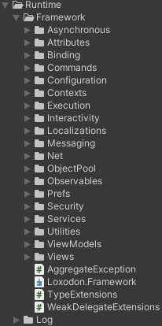

**<center><BBBG>LoxodonFramework分析</BBBG></center>**

<!-- TOC -->

- [简述](#简述)
- [分析](#分析)
  - [分层架构](#分层架构)
  - [业务层面分析](#业务层面分析)
    - [Domains](#domains)
      - [ObservableObject简述](#observableobject简述)
    - [Views](#views)
      - [Window简述](#window简述)
    - [ViewModels](#viewmodels)
      - [ViewModelBase简述](#viewmodelbase简述)
      - [Command/InteractionRequest/InteractionAction简述](#commandinteractionrequestinteractionaction简述)
      - [Services简述](#services简述)
    - [其它](#其它)
      - [Localization简述](#localization简述)
      - [Locator简述](#locator简述)
    - [Launcher](#launcher)
  - [框架层面分析](#框架层面分析)
    - [宏](#宏)
    - [UI框架](#ui框架)
      - [核心](#核心)
        - [Window](#window)
        - [GlobalWindowManager](#globalwindowmanager)
        - [ViewModelBase](#viewmodelbase)
      - [动画](#动画)
        - [连点实现](#连点实现)
        - [动画总结](#动画总结)
      - [绑定](#绑定)
        - [Context](#context)
        - [Container简述](#container简述)
        - [BindingServiceBundle](#bindingservicebundle)
        - [绑定流程详解](#绑定流程详解)
          - [创建](#创建)
          - [Binding：builder部分](#bindingbuilder部分)
          - [BindingContext](#bindingcontext)
          - [IBinder服务](#ibinder服务)
          - [Description](#description)
          - [UI框架简单总结](#ui框架简单总结)
          - [其它](#其它-1)
    - [其它](#其它-2)
      - [Execution](#execution)
      - [Preferences](#preferences)
      - [Configuration](#configuration)
      - [Log](#log)
      - [Asynchronous](#asynchronous)
      - [Observables](#observables)
      - [Interactivity](#interactivity)
      - [Messaging](#messaging)
      - [ObjectPool](#objectpool)
      - [Localizations](#localizations)

<!-- /TOC -->
<!-- /TOC -->
<!-- /TOC -->

# 简述

LoxodonFramework是一套**基于Unity**的**UI框架**
它自称为**MVVM+数据绑定框架**
但从项目结构来看，是<B><VT>比较清晰的</VT>，特点</B>如下：

- **<GN>优点</GN>**
  - 体系完整，内容多
  - 提供Lua方案
  - 有大量案例以及说明文档
- **<DRD>缺点</DRD>**
  - 咱无

<BR>

该框架并没有着重于表现效果(如LunaUI)，是比较<B><VT>偏向于架构</VT></B>的框架
在文档中其实已经提及其**关键特性**，这里再**从项目结构上来看一下**：
 <VT>核心脚本都在Framework中</VT>
我们也能看到**除此以外的内容**：

- Editor---编辑器工具
- PackageResources
  - Examples---完整解决方案
  - Tutorials---单项解决方案

可以看到就是那么的<B><VT>简单清晰</VT></B>
研究后会发现：该框架是以**扩展**的形式添加非必须内容的，在github上有各个包可供下载：

这也是一个非常不错的选择，可以<B><VT>使使用者在初期先熟悉必要内容，再选择是否添加可选内容</VT></B>

# 分析

## 分层架构

在文档的最后提到了其使用的分层架构，这大概最符合我们所说的框架的部分，其项目目录如下所示：


- 表现层
  - View
  - ViewModel
- 服务层
  - Service
- 领域层(Domain Model，可以认为是Model)
- 基础层
  - 框架
  - 各类组件(如网络/Log/...)
  - 辅助类

**<BL>问题：Gen中的`R.cs`是什么</BL>**
<BL>是本地化自动生成的文件</BL>

**基础层**就是<B><VT>基础功能</VT></B>
**领域层+表现层**就是<B><VT>MVVM</VT></B>
**服务层**就是<B><VT>业务功能</VT></B>

**大致浏览代码后可以发现一些基础规则：**

- Launcher.cs进行初始化设置操作
- View脚本继承自Window
- Model脚本(领域)继承自ObservableObject
- ViewModel脚本继承自ViewModelBase

## 业务层面分析

既然我们了解了框架的分层架构方式，那么就来详细看一下这些部分的**用法**
<YL>这里以官方提供的<B>登录界面示例</B>为例进行分析：</YL>

### Domains

Domains就是领域层，在该示例中，仅有一个**脚本Account**：

``` csharp
public class Account : ObservableObject
{
  private string username;
  private string password;
  private DateTime created;

  public string Username {
    get{ return this.username; }
    set{ this.Set(ref this.username, value); }
  }
  public string Password {
    get{ return this.password; }
    set{ this.Set(ref this.password, value); }
  }
  public DateTime Created {
    get{ return this.created; }
    set{ this.Set(ref this.created, value); }
  }
}
```

就从代码上来看和Model无异
首先我们需要理解一下<B><BL>ObservableObject是什么</BL></B>

#### ObservableObject简述

那么先来看一下其**声明**：

``` csharp
[Serializable]
public abstract class ObservableObject : INotifyPropertyChanged
```
可以看到这里继承了WPFMVVM中使用的<B><GN>INotifyPropertyChanged</GN></B>，显然这是**双向绑定的核心**

**总结一下**是这样的：

- PropertyChanged---INotifyPropertyChanged事件本身
- `Set()`---更新参数
  - `RaisePropertyChanged()`---触发
  - `ParserPropertyName()`---表达式树转换

所以简单来说就是<B><VT>为所有属性添加了一种事件回调机制</VT></B>
而这里**最关键**的就是：**PropertyChanged的事件订阅**
在代码中，我们并不能发现任何有关订阅的内容，显然这**被隐藏在其自动订阅机制**中了
也就是框架中的<B><GN>Binding</GN></B>

不考虑底层，对我们来说使用起来是非常方便的

### Views

Views就是视图，以**LoginWindow**为例：

``` csharp
public class LoginWindow : Window
    {
        //private static readonly ILog log = LogManager.GetLogger(typeof(LoginWindow));

        public InputField username;
        public InputField password;
        public Text usernameErrorPrompt;
        public Text passwordErrorPrompt;
        public Button confirmButton;
        public Button cancelButton;

        private ToastInteractionAction toastAction;

        protected override void OnCreate(IBundle bundle)
        {
            this.toastAction = new ToastInteractionAction(this);
            BindingSet<LoginWindow, LoginViewModel> bindingSet = this.CreateBindingSet<LoginWindow, LoginViewModel>();
            bindingSet.Bind().For(v => v.OnInteractionFinished).To(vm => vm.InteractionFinished);
            bindingSet.Bind().For(v => v.toastAction).To(vm => vm.ToastRequest);

            bindingSet.Bind(this.username).For(v => v.text, v => v.onEndEdit).To(vm => vm.Username).TwoWay();
            bindingSet.Bind(this.usernameErrorPrompt).For(v => v.text).To(vm => vm.Errors["username"]).OneWay();
            bindingSet.Bind(this.password).For(v => v.text, v => v.onEndEdit).To(vm => vm.Password).TwoWay();
            bindingSet.Bind(this.passwordErrorPrompt).For(v => v.text).To(vm => vm.Errors["password"]).OneWay();
            bindingSet.Bind(this.confirmButton).For(v => v.onClick).To(vm => vm.LoginCommand);
            bindingSet.Bind(this.cancelButton).For(v => v.onClick).To(vm => vm.CancelCommand);
            bindingSet.Build();
        }

        public virtual void OnInteractionFinished(object sender, InteractionEventArgs args)
        {
            this.Dismiss();
        }
    }
```

我们可以得知：

- 需要进行初始化绑定操作
- 需要手动将该脚本挂载在GameObject上
- 继承自Window，同时也一定是一个MonoBehaviour脚本

从中我们已经可以简单地了解到**绑定的基本信息**：

- <B><VT>`BindingSet<LoginWindow, LoginViewModel>`表明了View与ViewModel的具体对象，即`View-LoginWindow`以及`ViewModel-LoginViewModel`</VT></B>
- <B><VT>绑定方式为从(For)A的某属性到(To)B</VT></B>

显然直接看是看不出太多的，再稍微看一下其<B><GN>继承类Window</GN></B>

#### Window简述

Window代码不长(500行)，但还是略显复杂的，其声明为：

``` csharp
[DisallowMultipleComponent]
public abstract class Window : WindowView, IWindow, IManageable
```

简单看一下代码，大致来说就是：<B><VT>一组视图的管理类</VT></B>
在这个项目中就有2个：`StartupWindow`用于启动界面，`LoginWindow`用于登录界面，每个界面都是一个Window

简单看一下代码，大致会发现内容就是对接口的实现，显然其本质是一条**继承链**：
`Window`->`WindowView`->`UIView`

### ViewModels

ViewModels就是使用层面上的Models了，
在**LoginViewModel**话就是在领域层的Account基础上进行的
可以看到就是一个构造函数以及一些函数/属性：

``` csharp
public LoginViewModel(IAccountService accountService, Localization localization, Preferences globalPreferences)
{
    this.localization = localization;
    this.accountService = accountService;
    this.globalPreferences = globalPreferences;

    this.interactionFinished = new InteractionRequest(this);
    this.toastRequest = new InteractionRequest<ToastNotification>(this);

    if (this.username == null)
    {
        this.username = globalPreferences.GetString(LAST_USERNAME_KEY, "");
    }

    this.loginCommand = new SimpleCommand(this.Login);
    this.cancelCommand = new SimpleCommand(() =>
    {
        this.interactionFinished.Raise();/* Request to close the login window */
    });
}

public string Username
{
    get { return this.username; }
    set
    {
        if (this.Set(ref this.username, value))
        {
            this.ValidateUsername();
        }
    }
}
public string Password
{
    get { return this.password; }
    set
    {
        if (this.Set(ref this.password, value))
        {
            this.ValidatePassword();
        }
    }
}
public ICommand LoginCommand
{
    get { return this.loginCommand; }
}
public ICommand CancelCommand
{
    get { return this.cancelCommand; }
}
public Account Account
{
    get { return this.account; }
}
```

可以发现这些内容都是View中**绑定**的内容，如：
`bindingSet.Bind().For(v => v.OnInteractionFinished).To(vm => vm.InteractionFinished);`<VT>一个交互请求</VT>
`bindingSet.Bind(this.confirmButton).For(v => v.onClick).To(vm => vm.LoginCommand);`<VT>是确认按钮上绑定，绑定的操作为</VT>`LoginViewModel.Login()`
`bindingSet.Bind(this.username).For(v => v.text, v => v.onEndEdit).To(vm => vm.Username).TwoWay();`<VT>是视图上的username绑定到ViewModel上的Username</VT>

可以说<B><VT>ViewModel就是一个为View服务的类</VT></B>

#### ViewModelBase简述

可以看到ViewModel是需要**继承自ViewModelBase**的，其**定义**为：
`public abstract class ViewModelBase : ObservableObject, IViewModel`
而ObservableObject就是前面提到的Domains的继承类，所以ViewModel就是在此基础上再多了一些特性，由IViewModel可得知：多了一个IDisposable接口以及归属于IViewModel

#### Command/InteractionRequest/InteractionAction简述

前面提到了一些绑定内容，有两种涉及到了类型：

- Command---熟悉的命令，也就是封装了按钮的操作
- InteractionRequest---交互请求

**Command**我们大概率很熟悉，就是一个分离出来的函数而已，但问题是：
<B><BL>InteractionRequest到底是什么？</BL></B>
浏览实例代码后可以大概了解其**用法**：

``` csharp
// LoginViewModel
public LoginViewModel(IAccountService accountService, Localization localization, Preferences globalPreferences)
{
    this.interactionFinished = new InteractionRequest(this);
    this.toastRequest = new InteractionRequest<ToastNotification>(this);

    this.cancelCommand = new SimpleCommand(() =>
    {
        this.interactionFinished.Raise(); // Raise即调用
    });
}
public async void Login()
{
    try
    {
        // 其中会执行：
        this.interactionFinished.Raise();
        this.toastRequest.Raise(new ToastNotification(tipContent, 2f));
    }
    catch (Exception e){}
    finally{}
}

// LoginWindow
protected override void OnCreate(IBundle bundle)
{
    this.toastAction = new ToastInteractionAction(this);
    BindingSet<LoginWindow, LoginViewModel> bindingSet = this.CreateBindingSet<LoginWindow, LoginViewModel>();
    bindingSet.Bind().For(v => v.OnInteractionFinished).To(vm => vm.InteractionFinished);
    bindingSet.Bind().For(v => v.toastAction).To(vm => vm.ToastRequest);

    // ...

    bindingSet.Build();
}
public virtual void OnInteractionFinished(object sender, InteractionEventArgs args)
{
    this.Dismiss();
}
```

精简一下就是：<B><VT>ViewModel与View做绑定，执行View中设置的函数</VT></B>
观察上述代码，可以注意到执行函数有两种：

- InteractionFinished使用了View函数OnInteractionFinished
- ToastRequest使用了**ToastInteractionAction实例**

<B><GN>InteractionAction</GN></B>是<B><VT>一种函数的复用方式</VT></B>
既然是一个类，那么就可以**复用在任何View中**

#### Services简述

在ViewModel中，存在服务层内容，可以看到在构造函数中就添加了一个**IAccountService**，即**AccountService**：

``` csharp
public class AccountService : IAccountService
{
    private IAccountRepository repository;
    private IMessenger messenger;

    public IMessenger Messenger { get { return messenger; } }

    public AccountService(IAccountRepository repository)
    {
        this.repository = repository;
        this.messenger = new Messenger();
    }

    public virtual async Task<Account> Register(Account account)
    {
      // ...
    }
    public virtual async Task<Account> Update(Account account)
    {
      // ...
    }
    public virtual async Task<Account> Login(string username, string password)
    {
      // ...
    }
    public virtual Task<Account> GetAccount(string username)
    {
      // ...
    }
}
```

可以看到：作为一个服务，存储了Account数据(IAccountRepository即Account组)，并用该数据提供服务函数
**其中：**
**<VT>AccountRepository是Account的封装，存储了多个Account并提供函数，但它还是数据本身，而AccountService则是一个需要利用AccountRepository完成某项服务的功能类</VT>**

观察ViewModel代码，还能发现其中的

### 其它

除了上述内容外，还有一些没有提及的脚本，这里来简单看一下：

- Locator
- Localization

#### Localization简述

**Localization**也就是**本地化**，在该示例中有2个脚本：

- AssetBundleDataProvider
- ResourcesDataProvider

它们都继承于<B><GN>IDataProvider</GN></B>：

``` csharp
namespace Loxodon.Framework.Localizations
{
    public interface IDataProvider
    {
        Task<Dictionary<string, object>> Load(CultureInfo cultureInfo);
    }
}
```

由其命名空间可知，<VT>这个接口就是专为本地化创建的</VT>
查询接口的使用，我们可以发现在**Localization.cs**中使用到了：

``` csharp
protected virtual async Task Load(params ProviderEntry[] providers)
{
    if (providers == null || providers.Length <= 0)
        return;

    int count = providers.Length;
    var cultureInfo = this.CultureInfo;
    for (int i = 0; i < count; i++)
    {
        try
        {
            var entry = providers[i];
            var provider = entry.Provider;
            var dict = await provider.Load(cultureInfo);
            OnLoadCompleted(entry, dict);
        }
        catch (Exception) { }
    }
}
```

可以看得出<B><VT>provider是一种服务，是偏向于"提供"的服务</VT></B>

#### Locator简述

**Locator**即定位器，也就是<B><GN>服务定位器模式Service Locator Pattern</GN></B>
简单来说功能就是：<B><VT>提供A，找到B(隐藏细节)</VT></B>
**核心点：<VT>查找能力</VT>**

在Launcher.cs中，是这么注册以及使用的：

``` csharp
public class Launcher : MonoBehaviour
{

    //private static readonly ILog log = LogManager.GetLogger(System.Reflection.MethodBase.GetCurrentMethod().DeclaringType);

    private ApplicationContext context;
    ISubscription<WindowStateEventArgs> subscription;
    void Awake()
    {
        // ...
        /* Initialize the ui view locator and register UIViewLocator */
        container.Register<IUIViewLocator>(new ResourcesViewLocator());
        // ...
    }

    IEnumerator Start()
    {
        // ...
        IUIViewLocator locator = context.GetService<IUIViewLocator>();
        StartupWindow window = locator.LoadWindow<StartupWindow>(winContainer, "UI/Startup/Startup");
        window.Create();
        // ...
    }
}
```

也就是说：<B><VT>locator本质上也是一种服务，是偏向于"查找"的服务</VT></B>

在该示例中，类为**ResourcesViewLocator**，它继承于<B><GN>UIViewLocatorBase</GN></B>，内容很简单，就是抽象了一些加载函数等待实现类重写

### Launcher

前面也提到过，Launcher为**初始化核心入口**
如果稍微仔细一点看的话整体内容基本都清晰了：

``` csharp
public class Launcher : MonoBehaviour
{
    private ApplicationContext context;
    ISubscription<WindowStateEventArgs> subscription;
    void Awake()
    {
        // 界面中肯定存在一个带有GlobalWindowManagerBase的GameObject(在Canvas)
        GlobalWindowManagerBase windowManager = FindObjectOfType<GlobalWindowManagerBase>();
        if (windowManager == null)
            throw new NotFoundException("Not found the GlobalWindowManager.");

        // 上下文
        context = Context.GetApplicationContext();
        // 上下文可以获取容器
        IServiceContainer container = context.GetContainer();

        // 启动数据绑定内置服务
        BindingServiceBundle bundle = new BindingServiceBundle(context.GetContainer());
        bundle.Start();

        // 在容器中注册ResourcesViewLocator
        container.Register<IUIViewLocator>(new ResourcesViewLocator());

        // 在容器中注册Localization
        CultureInfo cultureInfo = Locale.GetCultureInfo();
        var localization = Localization.Current;
        localization.CultureInfo = cultureInfo;
        localization.AddDataProvider(new ResourcesDataProvider("LocalizationExamples", new XmlDocumentParser()));
        container.Register<Localization>(localization);

        // 在容器中注册AccountService
        IAccountRepository accountRepository = new AccountRepository();
        container.Register<IAccountService>(new AccountService(accountRepository));

        // 全局开启设置
        GlobalSetting.enableWindowStateBroadcast = true;
        GlobalSetting.useBlocksRaycastsInsteadOfInteractable = true;

        // 订阅Window.Messenger
        subscription = Window.Messenger.Subscribe<WindowStateEventArgs>(e =>
        {
            Debug.LogFormat("The window[{0}] state changed from {1} to {2}", e.Window.Name, e.OldState, e.State);
        });
    }

    IEnumerator Start()
    {
        // 创建窗口容器
        WindowContainer winContainer = WindowContainer.Create("MAIN");

        yield return null;

        // 创建窗口
        IUIViewLocator locator = context.GetService<IUIViewLocator>();
        StartupWindow window = locator.LoadWindow<StartupWindow>(winContainer, "UI/Startup/Startup");
        window.Create();
        // 事件监听
        ITransition transition = window.Show().OnStateChanged((w, state) =>
        {
            //log.DebugFormat("Window:{0} State{1}",w.Name,state);
        });

        yield return transition.WaitForDone();
    }
}
```

可以看到基本上就是前面提到的内容，除此以外就是内置的一些功能了

## 框架层面分析

如果只观察业务层的代码，只是稍微了解了一下该框架的使用方式，**框架的本质**才是我们所需要观察的内容
该项目是<B><VT>极其庞大</VT></B>的：

- **核心**部分主要聚焦于2个内容上：**绑定/UI**
- **辅助**的话就是一些**上下文/容器/配置/本地化**之类的内容

### 宏

这里先提前看一下宏，我们经常会在代码中看到：
`#elif NETFX_CORE || !NET_LEGACY`
[Microsoft官方文档](https://learn.microsoft.com/zh-cn/windows/uwp/gaming/missing-dot-net-apis-in-unity-and-uwp)
以上是官方文档，**大致有：**
**<VT>`NETFX_CORE`是为了适配UMP代码
如果是.NET脚本后端，使用`NETFX_CORE`即可，但如果是如IL2CPP等后端，则需要改用`ENABLE_WINMD_SUPPORT`</VT>**

### UI框架

UI框架是我们所希望了解的重点，MVVM必然基于它
首先在这里列出**UML类图**供参考：


#### 核心

通过前面示例的分析，我们根据其绑定，我们大概可以了解到：
**View(Window)与ViewModel(ViewModelBase)两者进行绑定**，如：
`BindingSet<LoginWindow, LoginViewModel> bindingSet = this.CreateBindingSet<LoginWindow, LoginViewModel>();`
所以核心肯定在Window与ViewModelBase以及绑定机制上了

这里先简单看一下**创建函数**：

``` csharp
public static BindingSet<TBehaviour, TSource> CreateBindingSet<TBehaviour, TSource>(this TBehaviour behaviour) where TBehaviour : Behaviour
{
    IBindingContext context = behaviour.BindingContext();
    return new BindingSet<TBehaviour, TSource>(context, behaviour);
}
```

显然<B><VT>TBehaviour指代View，TSource指代ViewModel</VT></B>

##### Window

Window是**视图的关键**，继承链如下：
`Window : WindowView, IWindow, IManageable`
`WindowView : UIView, IWindowView`
`UIView : UIBehaviour, IUIView`
`UIBehaviour : MonoBehaviour`<VT>(是UGUI的)</VT>
可以看到其中一个**设计原则**就是：<B><VT>每个类都创建一个IXXX，实现相应内容</VT></B>

<B><GN>UIBehaviour</GN></B>---<VT>UGUI类，一种优化过的MonoBehaviour</VT>

<B><GN>UIView</GN></B>
既然如此，那么当然先从底层代码看起，简单来说：<B><VT>UIView是一个提供了一些操作并收集了一定UGUI信息的类</VT></B>

- **两个事件：开启/关闭**
<BR>

``` csharp
protected override void OnEnable()
{
    base.OnEnable();
    this.OnVisibilityChanged();
    this.RaiseOnEnabled();
}

protected override void OnDisable()
{
    this.OnVisibilityChanged();
    base.OnDisable();
    this.RaiseOnDisabled();
}

protected virtual void OnVisibilityChanged()
{
}

private EventHandler onDisabled;
private EventHandler onEnabled;
protected void RaiseOnEnabled()
{
    try
    {
        if (this.onEnabled != null)
            this.onEnabled(this, EventArgs.Empty);
    }
    catch (Exception e)
    {
        if (log.IsWarnEnabled)
            log.WarnFormat("{0}", e);
    }
}
protected void RaiseOnDisabled()
{
    try
    {
        if (this.onDisabled != null)
            this.onDisabled(this, EventArgs.Empty);
    }
    catch (Exception e)
    {
        if (log.IsWarnEnabled)
            log.WarnFormat("{0}", e);
    }
}
```

- **组件属性**
  - Name：`gameObject.name`
  - Parent：`transform.parent`
  - Owner：`gameObject`
  - Transform：`transform`
  - Visibility：gameObject可见性
  - RectTransform：组件
  - CanvasGroup：组件
    - Alpha：`CanvasGroup.alpha`
    - Interactable：`CanvasGroup.interactable`
- **附加属性**
  - EnterAnimation/ExitAnimation：IAnimation
  - ExtraAttributes：IAttributes

所以这里就是一些<B>基础建设，<VT>方便后续使用</VT></B>
其中可以发现：<VT>作为一个UIView，可以存在<B>进入/退出动画</B></VT>

<B><GN>WindowView</GN></B>
大致观察代码后就会发现：<B><VT>WindowView是IUIView，也就是UIView的管理类</VT></B>
要注意的是**WindowView也继承自UIView**，那么这说明：<B><VT>WindowView同样具有UIView的特性</VT></B>

其**内容**是**简单明了**的：

- **属性**
  - Views：IUIView的集合
  - ActivationAnimation/PassivationAnimation：IAnimation
- **函数**
  - GetView()
  - AddView()
  - RemoveView()

其中可以发现：<VT>作为一个Window，可以存在<B>激活/失活动画</B></VT>

<B><GN>Window</GN></B>
然后就是Window本体了，内容看起来挺多
那么先从**接口**观察一下：

``` csharp
public interface IManageable : IWindow
{
    // 控制窗口显隐
    IAsyncResult Activate(bool ignoreAnimation);
    IAsyncResult Passivate(bool ignoreAnimation);
    IAsyncResult DoShow(bool ignoreAnimation = false);
    IAsyncResult DoHide(bool ignoreAnimation = false);
    void DoDismiss();
}

public interface IWindow
{
    // 作为Window需要的内容
    event EventHandler VisibilityChanged;
    event EventHandler ActivatedChanged;
    event EventHandler OnDismissed;
    event EventHandler<WindowStateEventArgs> StateChanged;
    string Name { get; set; }
    bool Created { get; }
    bool Dismissed { get; }
    bool Visibility { get; }
    bool Activated { get; }
    IWindowManager WindowManager { get; set; }
    WindowType WindowType { get; set; }
    int WindowPriority { get; set; }
    void Create(IBundle bundle = null);
    ITransition Show(bool ignoreAnimation = false);
    ITransition Hide(bool ignoreAnimation = false);
    ITransition Dismiss(bool ignoreAnimation = false);
}
```

可以看到可以分为2个部分：**作为窗口的能力**以及**作为管理者的能力**

这里找了几个比较关键的内容：

- `WindowState state`：当前状态(如CREATE_BEGIN开始创建)
- `IWindowManager windowManager`：窗口管理器
- `WindowType windowType`：窗口类型
- Create()：其实是初始化，核心：`this.WindowManager.Add(this);`
- Show()/Hide()/Dismiss()：显示/隐藏/删除

可以看出其中最关键的就是**windowManager**：

``` csharp
public IWindowManager WindowManager
{
    get { return this.windowManager ?? (this.windowManager = GameObject.FindObjectOfType<GlobalWindowManagerBase>()); }
    set { this.windowManager = value; }
}
```

由此，我们可以知道，UI最终的管理类为**GlobalWindowManager(Base)**

##### GlobalWindowManager

既然能够被`GameObject.FindObjectOfType()`，那么就说明是一个MonoBehaviour
但具体的还是要看类：

``` csharp
[RequireComponent(typeof(RectTransform), typeof(Canvas))]
public class GlobalWindowManager : GlobalWindowManagerBase
{
}
```

这意味着它是挂载在Canvas下的
**<BL>问题：可以存在多个GlobalWindowManager吗</BL>**
<BL>可以看得出，原则上肯定是可以的，但是结合Window的寻找方式(FindObjectOfType)，显然<B>只能存在一个</B></BL>

其**父类GlobalWindowManagerBase**也很简单：

``` csharp
[DisallowMultipleComponent]
public abstract class GlobalWindowManagerBase : WindowManager
{
    public static GlobalWindowManagerBase Root;

    protected virtual void Start()
    {
        Root = this;
    }

    protected override void OnDestroy()
    {
        base.OnDestroy();
        Root = null;
    }
}
```

可以说该Manager**是一个"单例"**

那么核心其实就在**WindowManager**中了，其**声明**如下：
`public class WindowManager : MonoBehaviour, IWindowManager`
通过**接口**我们即可知道其作用：

``` csharp
public interface IWindowManager
{
    bool Activated { get; set; }
    IWindow Current { get; }
    int Count { get; }
    IEnumerator<IWindow> Visibles();
    IWindow Get(int index);
    void Add(IWindow window);
    bool Remove(IWindow window);
    IWindow RemoveAt(int index);
    bool Contains(IWindow window);
    int IndexOf(IWindow window);
    List<IWindow> Find(bool visible);
    T Find<T>() where T : IWindow;
    T Find<T>(string name) where T : IWindow;
    List<T> FindAll<T>() where T : IWindow;
    void Clear();
    ITransition Show(IWindow window);
    ITransition Hide(IWindow window);
    ITransition Dismiss(IWindow window);
}
```

可以看得出这的的确确就是一个管理类，<B><VT>用于管理Window</VT></B>
**核心**也就是：`List<IWindow> windows`所有Window | `IWindow Current`当前Window
所有的操作都必然围绕着它们进行

<BR>

以上基本上就是Window本身的信息了，为了获得更多信息，**Launcher.cs**是值得关注的：
在`Start()`中有：
`WindowContainer winContainer = WindowContainer.Create("MAIN");`

<B><GN>WindowContainer</GN></B>听名字就知道它是一个**容器**
先看**声明**：
`public class WindowContainer : Window, IWindowManager`
我们会发现它是继承于Window又同时实现IWindowManager，这**说明**：
**<VT>有2种WindowManager，一种是Global的，所有Window都会反向引用GlobalWindowManager，而另一种是Local的，每个WindowContainer都会有自己的LocalWindowManager</VT>**
该类所做的操作就是<VT>封装了一下WindowManager</VT>，如：

``` csharp
public IWindow Get(int index)
{
    return localWindowManager.Get(index);
}
```

**核心**在**创建**上：

``` csharp
public static WindowContainer Create(string name)
{
    return Create(null, name);
}

public static WindowContainer Create(IWindowManager windowManager, string name)
{
    GameObject root = new GameObject(name, typeof(CanvasGroup));
    RectTransform rectTransform = root.AddComponent<RectTransform>();
    rectTransform.anchorMin = Vector2.zero;
    rectTransform.anchorMax = Vector2.one;
    rectTransform.offsetMax = Vector2.zero;
    rectTransform.offsetMin = Vector2.zero;
    rectTransform.pivot = new Vector2(0.5f, 0.5f);
    rectTransform.localPosition = Vector3.zero;

    WindowContainer container = root.AddComponent<WindowContainer>();
    container.WindowManager = windowManager;
    container.Create();
    container.Show(true);
    return container;
}

private IWindowManager localWindowManager;

protected override void OnCreate(IBundle bundle)
{
    /* Create Window View */
    this.WindowType = WindowType.FULL;
    this.localWindowManager = this.CreateWindowManager();
}

protected virtual IWindowManager CreateWindowManager()
{
    return this.gameObject.AddComponent<WindowManager>();
}
```

我们可以得知：
<VT>`WindowContainer.Create()`后可以得到一个WindowContainer实例，同时`OnCreate()`的重写会在GameObject中添加一个LocalWindowManager</VT>
实际情况如下：

**<BL>问题：为什么MAIN在Canvas子物体上，`new GameObject()`创建应该在根物体上才对</BL>**
<BL>这被隐藏在了`container.Create()`之中，逻辑比较复杂：</BL>

``` csharp
// 由于container继承于Window，所以会找到Window.Create(null)
public void Create(IBundle bundle = null)
{
    if (this.dismissTransition != null || this.dismissed)
        throw new ObjectDisposedException(this.Name);

    if (this.created)
        return;

    this.State = WindowState.CREATE_BEGIN;
    this.Visibility = false;
    this.Interactable = this.Activated;
    this.WindowManager.Add(this); // 在这
    this.OnCreate(bundle);
    this.created = true;
    this.State = WindowState.CREATE_END;
}

// 事实上是通过GlobalWindowManager进行操作：在其中添加WindowContainer(一个Window)
public virtual void Add(IWindow window)
{
    if (window == null)
        throw new ArgumentNullException("window");

    if (this.windows.Contains(window))
        return;

    this.windows.Add(window);
    this.AddChild(GetTransform(window));
}
protected virtual void AddChild(Transform child, bool worldPositionStays = false)
{
    if (child == null || this.transform.Equals(child.parent))
        return;

    child.gameObject.layer = this.gameObject.layer;
    child.SetParent(this.transform, worldPositionStays);
    child.SetAsFirstSibling();
}
```

由以上内容，我们能深刻地感受到：
**<VT>GlobalWindowManager与LocalWindowManager是MonoBehaviour控制器
WindowContainer是Window，Window派生类也是Window
几个类相互配合完成了Window的定义</VT>**

##### ViewModelBase

上述Window/WindowManager是用于实现View的，那么ViewModelBase则是用于实现ViewModel的
其**声明**为：
`public abstract class ViewModelBase : ObservableObject, IViewModel`
**前文已有所提及：**

- ObservableObject是domain的基础
- ViewModelBase则是在此基础上实现IViewModel

来看一下其**接口IViewModel**：
`public interface IViewModel : IDisposable`
可以发现是除了IDisposable机制外是空接口，那么这说明<B><VT>IViewModel本身其实只是一种身份</VT></B>

那么再来看一下类本身，内容不多：

- `IMessenger messenger`：用于`Broadcast()`
- `Set<T>()`

简单来说<B>`Set()`</B>就是类的唯一功能
但是结合ObservableObject来看，这只是<B><VT>额外的重载</VT></B>
也就是说<B><VT>ViewModelBase添加了几种可Broadcast的Set()方法</VT></B>
**所以：**
<B><VT>ViewModelBase本质上就是ObservableObject</VT></B>

#### 动画

在`WindowContainer.Create()`中，除了上述的`container.Create()`外，同样重要的就是<B>`container.Show(true)`</B>了：

``` csharp
// Window
public ITransition Show(bool ignoreAnimation = false)
{
    if (this.dismissTransition != null || this.dismissed)
        throw new InvalidOperationException("The window has been destroyed");

    if (this.Activated)
        return new CompletedTransition(this);

    if (this.Visibility)
        DoHide(true);

    return this.WindowManager.Show(this).DisableAnimation(ignoreAnimation);
}
// WindowManager
public ITransition Show(IWindow window)
{
    ShowTransition transition = new ShowTransition(this, (IManageable)window);
    GetTransitionExecutor().Execute(transition); // **Tip：过渡操作在这**
    return transition.OnStateChanged((w, state) =>
        {
            /* Control the layer of the window */
            if (state == WindowState.VISIBLE)
                this.MoveToIndex(w, transition.Layer);

            //if (state == WindowState.INVISIBLE)
            //    this.MoveToLast(w);
        });
}
```

由此，我们可以很明确地知道：
**<VT>WindowManager具有自动创建ShowTransition/HideTransition功能</VT>**
那么就先来详细看看UI框架的动画部分

可以看到<B><GN>ITransition</GN></B>是**动作的核心**，具体如下：

``` csharp
public interface ITransition
{
    bool IsDone { get; }
    object WaitForDone();
#if NETFX_CORE || NET_STANDARD_2_0 || NET_4_6
    IAwaiter GetAwaiter();
#endif
    ITransition DisableAnimation(bool disabled);
    ITransition AtLayer(int layer);
    ITransition Overlay(Func<IWindow, IWindow, ActionType> policy);
    ITransition OnStart(Action callback);
    ITransition OnStateChanged(Action<IWindow, WindowState> callback);
    ITransition OnFinish(Action callback);
}
```

由此我们可以看出<VT>ITransition仅定义了一些基本的事件回调，其中没有关键动作操作</VT>
在其<B><GN>派生类Transition</GN></B>中可以发现关键操作：

``` csharp
public virtual IEnumerator TransitionTask()
{
    this.running = true;
    this.OnStart();
#if UNITY_5_3_OR_NEWER
    yield return this.DoTransition();
#else
    var transitionAction = this.DoTransition();
    while (transitionAction.MoveNext())
        yield return transitionAction.Current;
#endif
    this.OnEnd();
}

protected abstract IEnumerator DoTransition();
```

`DoTransition()`就是最关键的动画操作
<YL>以ShowTransition进入动画为例，有：</YL>

``` csharp
protected override IEnumerator DoTransition()
{
    // 拿这一个
    IManageable current = this.Window;
    int layer = (this.Layer < 0 || current.WindowType == WindowType.DIALOG || current.WindowType == WindowType.PROGRESS) ? 0 : this.Layer;
    if (layer > 0)
    {
        int visibleCount = this.manager.VisibleCount;
        if (layer > visibleCount)
            layer = visibleCount;
    }
    this.Layer = layer;

    // 关上一个
    IManageable previous = (IManageable)this.manager.GetVisibleWindow(layer);
    if (previous != null)
    {
        if (previous.Activated)
        {
            // 失活
            IAsyncResult passivate = previous.Passivate(this.AnimationDisabled);
            yield return passivate.WaitForDone();
        }

        // 获取ActionType
        Func<IWindow, IWindow, ActionType> policy = this.OverlayPolicy;
        if (policy == null)
            policy = this.Overlay;
        ActionType actionType = policy(previous, current);
        // DoHide操作
        switch (actionType)
        {
            case ActionType.Hide:
                previous.DoHide(this.AnimationDisabled);
                break;
            case ActionType.Dismiss:
                previous.DoHide(this.AnimationDisabled).Callbackable().OnCallback((r) =>
                {
                    previous.DoDismiss();
                });
                break;
            default:
                break;
        }
    }

    // DoShow操作
    if (!current.Visibility)
    {
        IAsyncResult show = current.DoShow(this.AnimationDisabled);
        yield return show.WaitForDone();
    }
    // 激活
    if (this.manager.Activated && current.Equals(this.manager.Current))
    {
        IAsyncResult activate = current.Activate(this.AnimationDisabled);
        yield return activate.WaitForDone();
    }
}
```

**<BL>问题：Activate/Passivate与DoShow/DoHide的区别</BL>**
<BL>两者看似是一个意思，但其实并不是，以<B>开</B>为例：</BL>

``` csharp
public virtual IAsyncResult DoShow(bool ignoreAnimation = false)
{
    AsyncResult result = new AsyncResult();
    try
    {
        if (!this.created)
            this.Create();

        this.OnShow();
        this.Visibility = true; // **这其实也是关键之一，会setActive(true)**
        this.State = WindowState.VISIBLE;
        if (!ignoreAnimation && this.EnterAnimation != null)
        {
            this.EnterAnimation.OnStart(() =>
            {
                this.State = WindowState.ENTER_ANIMATION_BEGIN;
            }).OnEnd(() =>
            {
                this.State = WindowState.ENTER_ANIMATION_END;
                result.SetResult();
            }).Play();
        }
        else
        {
            result.SetResult();
        }
    }
    catch (Exception e)
    {
        result.SetException(e);

        if (log.IsWarnEnabled)
            log.WarnFormat("The window named \"{0}\" failed to open!Error:{1}", this.Name, e);
    }
    return result;
}

public virtual IAsyncResult Activate(bool ignoreAnimation)
{
    AsyncResult result = new AsyncResult();
    try
    {
        if (!this.Visibility)
        {
            result.SetException(new InvalidOperationException("The window is not visible."));
            return result;
        }

        if (this.Activated)
        {
            result.SetResult();
            return result;
        }

        if (!ignoreAnimation && this.ActivationAnimation != null)
        {
            this.ActivationAnimation.OnStart(() =>
            {
                this.State = WindowState.ACTIVATION_ANIMATION_BEGIN;
            }).OnEnd(() =>
            {
                this.State = WindowState.ACTIVATION_ANIMATION_END;
                this.Activated = true;
                this.State = WindowState.ACTIVATED;
                result.SetResult();
            }).Play();
        }
        else
        {
            this.Activated = true;
            this.State = WindowState.ACTIVATED;
            result.SetResult();
        }
    }
    catch (Exception e)
    {
        result.SetException(e);
    }
    return result;
}
```

在`DoShow()`中，EnterAnimation进行了`OnStart()`/`OnEnd()`的设置并执行了`Play()`，在`Activate()`中的ActivationAnimation同样如此，此时我们可能会有疑问
首先先看一下Animation所属的IAnimation：

``` csharp
public interface IAnimation
{
    IAnimation OnStart(Action onStart);
    IAnimation OnEnd(Action onEnd);
    IAnimation Play();
}
```

**<BL>子问题：EnterAnimation/ActivationAnimation从哪来的，这里明显没有真正的定义操作</BL>**
它们来自于<B><GN>AlphaAnimation</GN></B>，是一个挂载在GameObject的脚本：
 
在Login界面中，Login根物体上除了基本的LoginWindow组件外，还挂载了两个动画组件
在其`OnEnable()`就可以发现设置操作：

``` csharp
void OnEnable()
{
    this.view = this.GetComponent<IUIView>();
    switch (this.AnimationType)
    {
        case AnimationType.EnterAnimation:
            this.view.EnterAnimation = this;
            break;
        case AnimationType.ExitAnimation:
            this.view.ExitAnimation = this;
            break;
        case AnimationType.ActivationAnimation:
            if (this.view is IWindowView)
                (this.view as IWindowView).ActivationAnimation = this;
            break;
        case AnimationType.PassivationAnimation:
            if (this.view is IWindowView)
                (this.view as IWindowView).PassivationAnimation = this;
            break;
    }

    if (this.AnimationType == AnimationType.ActivationAnimation || this.AnimationType == AnimationType.EnterAnimation)
    {
        this.view.CanvasGroup.alpha = from;
    }
}
```

事实上渐隐操作本身很简单：

``` csharp
public override IAnimation Play()
{
    this.StartCoroutine(DoPlay());
    return this;
}

IEnumerator DoPlay()
{
    this.OnStart();

    var delta = (to - from) / duration;
    var alpha = from;
    this.view.Alpha = alpha;
    if (delta > 0f)
    {
        while (alpha < to)
        {
            alpha += delta * Time.deltaTime;
            if (alpha > to)
            {
                alpha = to;
            }
            this.view.Alpha = alpha;
            yield return null;
        }
    }
    else
    {
        while (alpha > to)
        {
            alpha += delta * Time.deltaTime;
            if (alpha < to)
            {
                alpha = to;
            }
            this.view.Alpha = alpha;
            yield return null;
        }
    }

    this.OnEnd();
}
```

**本质**上就是<B><VT>随时间控制Alpha，即`this.CanvasGroup.alpha`</VT></B>

<BL>回到原问题上，由上述名字的反复出现我们其实已经能<B>意识到</B>：
<B><VT>EnterAnimation/ExitAnimation是UIView的操作
ActivationAnimation/PassivationAnimation是WindowView的操作</VT></B>
但事实上和这个无关，因为只有Window才具有IManageable，这也就意味着两种情况都是一个Window，是UIView或WindowView的子类
两者的区别实际在于<B>功能</B>：</BL>

``` csharp
if (!current.Visibility)
{
    IAsyncResult show = current.DoShow(this.AnimationDisabled);
    yield return show.WaitForDone();
}
if (this.manager.Activated && current.Equals(this.manager.Current))
{
    IAsyncResult activate = current.Activate(this.AnimationDisabled);
    yield return activate.WaitForDone();
}
```

以上是前面提到的AlphaAnimation的部分操作，可以看到两者的前提条件：

- `Doshow()`---window不可见(GameObject失活状态)
- `Activate()`---激活状态且window就是激活window(置顶)

**可以看到：**
**<VT>`Doshow()`只是打开界面，而`Activate()`是激活界面，是开启后可能的操作</VT>**

##### 连点实现

可以看到，在代码中常常会出现连点的形式，就比如说Launcher.cs中有：
`window.Show().OnStateChanged((w, state) => {...}`
之所以能够连点就是因为其**实现方式**：
`Show()`是其核心操作，只要操作能够返回ITransition，就能为其添加这些事件，也就是说<B><VT>无论做什么都返回操作所需的类型就可以无限点下去</VT></B>
**<YL>详细解释一下这个例子：</YL>**
<YL>首先是`Window.Show()`，本质上其实是`WindowManager.Show()`，在这里创了一个ShowTransition，也就是一个ITransiton，然后执行`transition.OnStateChanged()`调用了一个事件添加函数，返回的依旧是ITransiton，在此基础上又进行了`.DisableAnimation()`返回一个ITransiton，最后`.OnStateChanged()`依旧返回一个ITransiton</YL>

##### 动画总结

这里先来简单地对**动画类**进行汇总：

- **ITransition**：渐变动画核心
  - 派生Transition，再派生业务类XXXTransition
  - 核心操作：`TransitionTask()`，即执行业务类实现的`DoTransition()`操作
- **IAnimation**：`DoTransition()`操作的核心，即播放动画
  - 派生UIAnimation，再派生AlphaAnimation，也就是一般用的最基础的渐变动画
  - 是一个挂载脚本(MonoBehaviour)
  - 挂载脚本后会自动将自身注册进Window中

**核心流程：　　<VT>以开为例</VT>**

- `window.Show()`
- `this.WindowManager.Show()`，即通过GlobalWindowManager进行操作
- `GetTransitionExecutor().Execute(showTransition)`
- `Executors.RunOnCoroutine(this.DoTask())`
- `Executors.RunOnCoroutine(transition.TransitionTask())`
- `DoTransition()`
- 一般来说会是一个`IAnimation.Play()`

流程非常复杂，但总的来说核心就是<B><VT>执行`IAnimation.Play()`触发动画本身</VT></B>

#### 绑定

在上述的分析中，我们已经把UI框架的类大致分析了一遍，虽然我们对其用法已经有了了解，但是我们无法将ViewModel与View联系起来
那么**核心**其实就在**View进行的绑定**上

回顾一下LoginWindow.cs的`OnCreate()`：

``` csharp
protected override void OnCreate(IBundle bundle)
{
    this.toastAction = new ToastInteractionAction(this);
    BindingSet<LoginWindow, LoginViewModel> bindingSet = this.CreateBindingSet<LoginWindow, LoginViewModel>();
    bindingSet.Bind().For(v => v.OnInteractionFinished).To(vm => vm.InteractionFinished);
    //bindingSet.Bind().For(v => v.OnToastShow).To(vm => vm.ToastRequest);
    bindingSet.Bind().For(v => v.toastAction).To(vm => vm.ToastRequest);

    bindingSet.Bind(this.username).For(v => v.text, v => v.onEndEdit).To(vm => vm.Username).TwoWay();
    bindingSet.Bind(this.usernameErrorPrompt).For(v => v.text).To(vm => vm.Errors["username"]).OneWay();
    bindingSet.Bind(this.password).For(v => v.text, v => v.onEndEdit).To(vm => vm.Password).TwoWay();
    bindingSet.Bind(this.passwordErrorPrompt).For(v => v.text).To(vm => vm.Errors["password"]).OneWay();
    bindingSet.Bind(this.confirmButton).For(v => v.onClick).To(vm => vm.LoginCommand);
    bindingSet.Bind(this.cancelButton).For(v => v.onClick).To(vm => vm.CancelCommand);
    bindingSet.Build();
}
```

这就是我们所做的绑定操作
在文档中提到了**绑定的前置---启动服务**：

``` csharp
context = Context.GetApplicationContext();

BindingServiceBundle bundle = new BindingServiceBundle(context.GetContainer());
bundle.Start();
```

##### Context

可以看到，要启动服务，首先需要在构造函数中传入一个context的Container，也就是<B><GN>ApplicationContext</GN></B>
其**声明**为：
`public class ApplicationContext : Context`
`public class Context : IDisposable`
观察两个类，可以发现<VT>其构造有些许奇怪</VT>：
在Context.cs中：
`private static ApplicationContext context = null;`
`private static Dictionary<string, Context> contexts = null;`
显然，情况是：

- context是单例，存储着唯一ApplicationContext实例
- contexts存储着多个Context实例

**<BL>问题：contexts是什么</BL>**
<BL>是独立上下文，一般来说无需使用，通过`Context.GetApplicationContext()`获取全局的上下文即可
如需使用，其用法与单例的ApplicationContext完全一致，毕竟ApplicationContext也是一个Context
其作用当然是<B>区分上下文</B>，某些时候需要区分服务可能就会用到
</BL>

其函数看起来很多，但实际上就几类：

- **上下文管理**
  - `(Add/Get/Remove)Context()`
  - `(Set/Get)ApplicationContext)()`
- **属性存取**
  <B><VT>Tip：这里的属性对应的就是C#中具有GetSet方法的那个属性，可用于全局存储属性值</VT></B>
  - `Set()`/`Get()`/`Contains()`/`Remove()`/`GetEnumerator()`
- **服务相关**
  - `GetContainer()`---获取容器<VT>(可在其中注册服务)</VT>
  - `GetService()`---获取服务

回顾上述用法`new BindingServiceBundle(context.GetContainer())`，我们可以发现<B>`context.GetContainer()`是服务所需的关键</B>

回到**ApplicationContext**，它也就是充当核心主Context，具有一些**额外的特性**：

- **`IMainLoopExecutor mainLoopExecutor`**
  这是一个Executor，在下方会提到其本质**Executors**
  先看眼**声明**：
  `public class MainLoopExecutor : AbstractExecutor, IMainLoopExecutor`
  <BR>

  ``` csharp
  public abstract class AbstractExecutor
  {
      static AbstractExecutor()
      {
          Executors.Create();
      }
  }
  public interface IMainLoopExecutor
  {
      void RunOnMainThread(Action action, bool waitForExecution = false);

      TResult RunOnMainThread<TResult>(Func<TResult> func);
  }
  ```

  此处就可以清晰地了解到：<B><VT>MainLoopExecutor是一个Executors的封装类，在执行前隐式执行了`Executors.Create()`以正常启动</VT></B>

- **Preferences**
  可以看到有2个：
  - `GetGlobalPreferences()`
  - `GetUserPreferences()`
  它们本质上就是在调用`Preferences.GetPreferences()`
  **Preferences简述：<VT>一个持久化存储机制</VT>**

##### Container简述

观察代码后会发现，为<B><GN>ServiceContainer</GN></B>，其**声明**为：
`public class ServiceContainer : IServiceContainer, IDisposable`
从名字我们就可以看出，这显然是一个<B><VT>用于存放Service的容器</VT></B>
简单看一下**接口**：

``` csharp
public interface IServiceContainer : IServiceLocator, IServiceRegistry
{
}

public interface IServiceLocator
{
    object Resolve(Type type);
    T Resolve<T>();
    object Resolve(string name);
    T Resolve<T>(string name);
}
public interface IServiceRegistry
{
    void Register(Type type, object target);
    void Register<T>(T target);
    void Register(string name, object target);
    void Register<T>(string name, T target);
    void Register<T>(Func<T> factory);
    void Register<T>(string name, Func<T> factory);
    void Unregister<T>();
    void Unregister(Type type);
    void Unregister(string name);
}
```

显然这是一个<B><VT>提供了注册/反注册服务与寻找服务的容器</VT></B>
其实从**实际调用**中也可以**验证**这一点：

``` csharp
// BindingServiceBundle服务开始时
protected override void OnStart(IServiceContainer container)
{
    // ...

    container.Register<IBinder>(binder);
    container.Register<IBindingFactory>(bindingFactory);
    container.Register<IConverterRegistry>(converterRegistry);

    container.Register<IExpressionPathFinder>(expressionPathFinder);
    container.Register<IPathParser>(pathParser);

    container.Register<INodeProxyFactory>(objectSourceProxyFactory);
    container.Register<INodeProxyFactoryRegister>(objectSourceProxyFactory);

    container.Register<ISourceProxyFactory>(sourceFactory);
    container.Register<ISourceProxyFactoryRegistry>(sourceFactory);

    container.Register<ITargetProxyFactory>(targetFactory);
    container.Register<ITargetProxyFactoryRegister>(targetFactory);
}
```

``` csharp
// 我们的注册也是如此
// Launcher.cs中
void Awake()
{
    // ...
    context = Context.GetApplicationContext();
    IServiceContainer container = context.GetContainer();

    container.Register<IUIViewLocator>(new ResourcesViewLocator());
    container.Register<Localization>(localization);
    container.Register<IAccountService>(new AccountService(accountRepository));
    // ...
}
```

注册完就是获取，在**Launcher.cs**中有：
`IUIViewLocator locator = context.GetService<IUIViewLocator>();`
那么BindingServiceBundle注册的服务一定也在某处使用到了

**<DRD>注意：注册是由Container完成的，而获取是由Context完成的</DRD>**

##### BindingServiceBundle

回到核心，也就是<B><GN>BindingServiceBundle</GN></B>
先看**声明**：
`public class BindingServiceBundle : AbstractServiceBundle`
`public abstract class AbstractServiceBundle : IServiceBundle`

观察过后会发现非常简单：<B><VT>IServiceBundle定义了功能，AbstractServiceBundle定义了流程</VT></B>

``` csharp
public interface IServiceBundle
{
    void Start();
    void Stop();
}
public abstract class AbstractServiceBundle : IServiceBundle
{
    private IServiceContainer container;
    public AbstractServiceBundle(IServiceContainer container)
    {
        this.container = container;
    }
    public void Start()
    {
        this.OnStart(container);
    }
    protected abstract void OnStart(IServiceContainer container);
    public void Stop()
    {
        this.OnStop(container);
    }
    protected abstract void OnStop(IServiceContainer container);
}
```

<B>即：<VT>开启与关闭功能</VT></B>
那么具体实现就在BindingServiceBundle之中，简单观察，会发现有**两种注册**：

- Factory注册
- Container注册

**Container注册**在前面**Container简述**中已经有所提及，
在这里稍微再看一下**Factory注册**：
上述代码中有3个工厂：`ObjectSourceProxyFactory`/`SourceProxyFactory`/`TargetProxyFactory`
它们的继承类都有相似点但各不相同：
`ObjectSourceProxyFactory : TypedSourceProxyFactory<ObjectSourceDescription>, INodeProxyFactory, INodeProxyFactoryRegister`
`SourceProxyFactory : ISourceProxyFactory, ISourceProxyFactoryRegistry`
`TargetProxyFactory : ITargetProxyFactory, ITargetProxyFactoryRegister`

最核心的是几个函数：

- `CreateProxy()`
- `Register()`
- `Unregister()`

**<YL>这里以SourceProxyFactory为例看一下：</YL>**
<YL>内部核心为`List<PriorityFactoryPair> factories`，其中<B><GN>ProiorityFactoryPair</GN></B>是一个<B><VT>具有priority的factory</VT></B>
`Register()`/`UnRegister()`是用于<B>添加或删除</B>的，而`CreateProxy()`是用于<B>选择并创建的</B></YL>

``` csharp
// CreateProxy()的核心
protected virtual bool TryCreateProxy(object source, SourceDescription description, out ISourceProxy proxy)
{
    proxy = null;
    // 遍历factories(按priority排序)
    foreach (PriorityFactoryPair pair in this.factories)
    {
        var factory = pair.factory;
        if (factory == null)
            continue;

        try
        {
            // 工厂创建proxy
            proxy = factory.CreateProxy(source, description);
            if (proxy != null)
                return true;
        }
        // ...
    }

    proxy = null;
    return false;
}
```

这样看Factory是什么就显而易见了，即<B><VT>创建Proxy</VT></B>

**简单总结**一下两种注册：

- <B>Factory注册：<VT>一种具有优先级的Proxy创建工厂</VT></B>
- <B>Container注册：<VT>服务注册容器</VT></B>

所以我们只需要知道后续会通过`factory.CreateProxy()`/`context.GetService()`取出即可

<BR>

##### 绑定流程详解

###### 创建

既然要分析绑定流程，那么还是需要从绑定操作本身来分析，首先做的当然是创建，有：
`BindingSet<LoginWindow, LoginViewModel> bindingSet = this.CreateBindingSet<LoginWindow, LoginViewModel>();`

``` csharp
public static BindingSet<TBehaviour, TSource> CreateBindingSet<TBehaviour, TSource>(this TBehaviour behaviour) where TBehaviour : Behaviour
{
    IBindingContext context = behaviour.BindingContext();
    return new BindingSet<TBehaviour, TSource>(context, behaviour);
}
```

在核心中已经提及：
> TBehaviour指代View，TSource指代ViewModel

那么我们再详细看一下**创建内容**：
首先就是一个**IBindingContext的绑定**，这绑定函数就在同类BehaviourBindingExtension中定义：

``` csharp
public static IBindingContext BindingContext(this Behaviour behaviour)
{
    if (behaviour == null || behaviour.gameObject == null)
        return null;

    BindingContextLifecycle bindingContextLifecycle = behaviour.GetComponent<BindingContextLifecycle>();
    if (bindingContextLifecycle == null)
        bindingContextLifecycle = behaviour.gameObject.AddComponent<BindingContextLifecycle>();

    IBindingContext bindingContext = bindingContextLifecycle.BindingContext;
    if (bindingContext == null)
    {
        bindingContext = new BindingContext(behaviour, Binder);
        bindingContextLifecycle.BindingContext = bindingContext;
    }
    return bindingContext;
}
```

简单来说就是：<B><VT>先创/拿一个BindingContextLifecycle脚本组件，然后由它创/拿一个BindingContext</VT></B>

大致查看源码，可知道两个类：

- <B><GN>BindingContextLifecycle</GN></B>：一个单纯的MonoBehaviour类，其中仅管理一个IBindingContext的生命周期
- <B><GN>BindingContext</GN></B>：一个数据绑定管理类

###### Binding：builder部分

经过创建后接下来就是绑定操作，如：
`bindingSet.Bind(this.username).For(v => v.text, v => v.onEndEdit).To(vm => vm.Username).TwoWay();`

查看<B><GN>BindingSet</VT></B>源码，会发现有多个泛型版本，这里就查看非泛型版本：
`public class BindingSet : BindingSetBase`
`public abstract class BindingSetBase : IBindingBuilder`
**IBindingBuilder**只要求了一个功能，即<B>`Build()`</B>
在BindingSetBase中有：

``` csharp
public virtual void Build()
{
    foreach (var builder in this.builders)
    {
        try
        {
            builder.Build();
        }
        catch (Exception e)
        {
            if (log.IsErrorEnabled)
                log.ErrorFormat("{0}", e);
        }
    }
    this.builders.Clear();
}
```

功能很简单，就是对收集的builders进行`Build()`操作即可
这所对应的就是View代码中**绑定的最后一句**：
`bindingSet.Build();`

那么`Build()`前当然需要的是<B>`Bind()`</B>即可完成**添加**
仔细观察这里的**连点**：
**<VT>返回值都是`BindingBuilder<>`类型的，也就是说`Bind()`是在构建，其余的是在设置</VT>**
先看`Bind()`：

``` csharp
public virtual BindingBuilder Bind(object target)
{
    var builder = new BindingBuilder(context, target);
    this.builders.Add(builder);
    return builder;
}
```

**BindingBuilder**的**声明**是这样的：　　<VT>对于泛型版本也是如此</VT>
`public class BindingBuilder : BindingBuilderBase`
`public class BindingBuilderBase : IBindingBuilder`
简单看一下BindingBuilder源码，会发现其函数都是<VT>对参数进行设置</VT>，所以真正的核心在其**Base类**中

浏览代码后会发现：
绝大多数的函数都是`SetXXX()`，所操作的当然是其**属性**，有：

- `bool builded`
- `object scopeKey`
- `object target`
- `IBindingContext context`
- `BindingDescription description`

除此以外还有2个**功能属性**：

- `IPathParser PathParser`
- `IConverterRegistry ConverterRegistry`

最关键的当然是<B>`Build()`</B>：

``` csharp
public void Build()
{
    try
    {
        if (this.builded)
            return;

        this.CheckBindingDescription();
        this.context.Add(this.target, this.description, this.scopeKey);
        this.builded = true;
    }
    catch (BindingException e)
    {
        throw e;
    }
    catch (Exception e)
    {
        throw new BindingException(e, "An exception occurred while building the data binding for {0}.", this.description.ToString());
    }
}
```
看起来并没有做什么事，唯一的核心操作就是<B><VT>在context中添加了一项</VT></B>

**结合来看：**
一旦完成`bindingSet.Build()`，就会收集到最终的context
而context是BindingSet的成员，并分发给BindingBuilder
所以<B><VT>在`BindingSet.context`中会收集到所有的绑定信息</VT></B>

###### BindingContext

由上述内容可知<B><GN>BindingContext</GN></B>必然是最关键的一个类

**IBindingContext**如下所示：

``` csharp
public interface IBindingContext : IDisposable
{
    event EventHandler DataContextChanged;
    object Owner { get; }
    object DataContext { get; set; }
    void Add(IBinding binding,object key=null);
    void Add(IEnumerable<IBinding> bindings,object key = null);
    void Add(object target, BindingDescription description,object key = null);
    void Add(object target, IEnumerable<BindingDescription> descriptions, object key = null);
    void Clear(object key);
    void Clear();
}
```

仅有的**操作**即添加`Add()`与清除`Clear()`
而**属性**`Owner`与`DataContext`查看其构造函数后就会发现是<VT>传入的</VT>：

``` csharp
// 核心构造函数
public BindingContext(object owner, IBinder binder, object dataContext)
{
    this.owner = owner;
    this.binder = binder;
    this.DataContext = dataContext;
}
```

更具体一点，看一下创建使用的构造函数，有`bindingContext = new BindingContext(behaviour, Binder)`：
`public BindingContext(object owner, IBinder binder) : this(owner, binder, (object)null) {}`

**对应一下：**

- owner---TBehaviour，即View实例脚本(如LoginWindow.cs)
- binder---IBinder服务
- DataContext---此处无

<B>`Add()`</B>就是前面`Build()`中会执行的操作：
`this.context.Add(this.target, this.description, this.scopeKey);`

``` csharp
public virtual void Add(object target, BindingDescription description, object key = null)
{
    IBinding binding = this.Binder.Bind(this, this.DataContext, target, description);
    this.Add(binding, key);
}

public virtual void Add(IBinding binding, object key = null)
{
    if (binding == null)
        return;

    List<IBinding> list = this.GetOrCreateList(key);
    binding.BindingContext = this;
    list.Add(binding);
}
```

可以看到<VT>是使用Binder(服务)创建了一个IBinding，然后加到了一个key下的IBinding列表中</VT>
既然如此，IBinder服务就有必要查看了，回顾一下BindingServiceBundle.cs注册处：

``` csharp
BindingFactory bindingFactory = new BindingFactory(sourceFactory, targetFactory);
StandardBinder binder = new StandardBinder(bindingFactory);

container.Register<IBinder>(binder);
```

###### IBinder服务

可以看到StandardBinder是基于**BindingFactory**的

**<GN>BindingFactory</GN>**
从名字上可以知道：这是一个用于绑定的工厂
内容上核心就是两个属性和一个函数：

- `ISourceProxyFactory sourceProxyFactory`
- `ITargetProxyFactory targetProxyFactory`
- `Create()`

这**两个工厂**我们会非常熟悉，就是前面提到过的**BindingServiceBundle的Factory注册**
而<B>`Create()`</B>就是：

``` csharp
public IBinding Create(IBindingContext bindingContext, object source, object target, BindingDescription bindingDescription)
{
    return new Binding(bindingContext, source, target, bindingDescription, this.sourceProxyFactory, this.targetProxyFactory);
}
```

可以看到在IBindingContext之上，还有更高级的**IBinding**的存在，这也就是<B><VT>IBindingContext仅在收集信息而没有绑定操作的原因</VT></B>

**<GN>Binding</GN>**
**Binding**的**声明**如下：
`public class Binding : AbstractBinding`
`public abstract class AbstractBinding : IBinding`

先看**接口**：

``` csharp
public interface IBinding : IDisposable
{
    IBindingContext BindingContext { get; set; }
    object Target { get; }
    object DataContext { get; set; }
}
```

可以看到都是些属性，在**AbstractBinding**可以找到它们具体的内容：

- BindingContext---就是IBindingContext
- Target---一个<B><GN>WeakReference</GN></B>
- DataContext---就是DataContext(BindingContext中也有该属性)

而**Binding**通过收集到的信息完成了绑定操作，这一切都发生在**构造函数**中<VT>(仅有的公开操作，所有函数都是protected/private的)</VT>

``` csharp
public Binding(IBindingContext bindingContext, object source, object target, BindingDescription bindingDescription, ISourceProxyFactory sourceProxyFactory, ITargetProxyFactory targetProxyFactory) : base(bindingContext, source, target)
{
    this.targetTypeName = target.GetType().Name;
    this.bindingDescription = bindingDescription;

    this.converter = bindingDescription.Converter;
    this.sourceProxyFactory = sourceProxyFactory;
    this.targetProxyFactory = targetProxyFactory;

    this.CreateTargetProxy(target, this.bindingDescription);
    this.CreateSourceProxy(this.DataContext, this.bindingDescription.Source);
    this.UpdateDataOnBind();
}
```

动作为以**创建Proxy**及**UpdateDataOnBind**
创建Proxy的核心很简单，就是：
`this.sourceProxyFactory.CreateProxy()`/`this.targetProxyFactory.CreateProxy()`

**Proxy：**

根据以上结构我们就能推断出一些内容了：

- Sources和Targets是不同的分支，而在此之下又有几种分支，如Sources的Expressions/Object/Text
- 通过具体分支我们能看出<B><VT>Source指的是ViewModel，Target指的是UI控件</VT></B>

在Factory创建Proxy之前，我们更应该理解一下<B><BL>Proxy究竟是什么含义</BL></B>：
那么这里就来先看一下**共通部分**，也就是<B><GN>BindingProxyBase</GN></B>：
`public abstract class BindingProxyBase : IBindingProxy`
`public interface IBindingProxy : IDisposable {}`

``` csharp
public abstract class BindingProxyBase : IBindingProxy
{
    #region IDisposable Support

    protected virtual void Dispose(bool disposing)
    {
    }

    ~BindingProxyBase()
    {
        Dispose(false);
    }

    public void Dispose()
    {
        Dispose(true);
        GC.SuppressFinalize(this);
    }
    #endregion
}
```

可以发现<B><VT>BindingProxyBase仅是一个基，并无任何实现</VT></B>

<B><GN>SourceProxyBase</GN></B>：
`public abstract class SourceProxyBase : BindingProxyBase, ISourceProxy`
ISourceProxy如下所示：

``` csharp
public interface ISourceProxy : IBindingProxy
{
    Type Type { get; }
    TypeCode TypeCode { get; }
    object Source { get; }
}
```

<B><GN>TypeCode</GN></B>是来自于System下的一种<B><VT>表示类型的枚举</VT></B>
这么看来主要就是在<B><VT>管理Source</VT></B>，有表示其类型的Type/TypeCode

那么**Proxy与ProxyFactory的含义**就很明显了：
<B><VT>ProxyFactory是一种创建Proxy的工具，而Proxy是一种Source的包装</VT></B>

Factory前面我们已经分析过，它有一个功能就是**筛选优先级最高的工厂**

我们会发现一个与它非常相似连名字都很像的类：<B><GN>TypedSourceProxyFactory<></GN></B>
它们所扮演的角色是**完全不同**的

- <B>SourceProxyFactory：<VT>管理TypedSourceProxyFactory</VT></B>
- <B>TypedSourceProxyFactory：<VT>工厂实现</VT></B>

其实从**声明**上就能看出一丝含义：
`public class SourceProxyFactory : ISourceProxyFactory, ISourceProxyFactoryRegistry`
`public abstract class TypedSourceProxyFactory<T> : ISourceProxyFactory where T : SourceDescription`
首先SourceProxyFactory多了注册功能，而且TypedSourceProxyFactory是抽象的，这都能体现

接下来就应该看一下**具体实现类**了：
先来看看最简单的<B><GN>LiteralSourceProxy</GN></B>：
`public class LiteralSourceProxy : SourceProxyBase, ISourceProxy, IObtainable`
可以看到声明中只是多了一个**IObtainable**，即`GetValue()`

``` csharp
public class LiteralSourceProxy : SourceProxyBase, ISourceProxy, IObtainable
{
    public LiteralSourceProxy(object source) : base(source)
    {
    }

    public override Type Type { get { return this.source != null ? this.source.GetType() : typeof(object); } }

    public virtual object GetValue()
    {
        return this.source;
    }

    public virtual TValue GetValue<TValue>()
    {
        return (TValue)Convert.ChangeType(this.source, typeof(TValue));
    }
}
```

可以看到异常简单，这里的**Literal**指的就是如`int`这种字面值
所做的就是<VT>简单地获取这个字面值</VT>

其对应的工厂当然是<B><GN>LiteralSourceProxyFactory</GN></B>：

``` csharp
public class LiteralSourceProxyFactory : TypedSourceProxyFactory<LiteralSourceDescription>
{
    protected override bool TryCreateProxy(object source, LiteralSourceDescription description, out ISourceProxy proxy)
    {
        var value = description.Literal;
        if (value != null && value is IObservableProperty)
            proxy = new ObservableLiteralSourceProxy(value as IObservableProperty);
        else
            proxy = new LiteralSourceProxy(value);
        return true;
    }
}
```

这里有一个**关键点**：
**<VT>根据description的情况，会选择不同的Proxy，即`LiteralSourceProxy`/`ObservableLiteralSourceProxy`</VT>**
先看一下<B><GN>ObservableLiteralSourceProxy</GN></B>：
`public class ObservableLiteralSourceProxy : NotifiableSourceProxyBase, ISourceProxy, IObtainable`
显然它们的基不同，这里是**NotifiableSourceProxyBase**：
`public abstract class NotifiableSourceProxyBase : SourceProxyBase, INotifiable`
显然这是一个<VT>基于SourceProxyBase并添加了INotifiable功能</VT>的Proxy，具体体现的话就是一个**ValueChanged事件**


值得我们注意的就是这里的<B><GN>LiteralSourceDescription</GN></B>

###### Description

所有description的基都是**SourceDescription**，内容很简单：

``` csharp
[Serializable]
public abstract class SourceDescription
{
    private bool isStatic = false;
    public virtual bool IsStatic
    {
        get { return this.isStatic; }
        set { this.isStatic = value; }
    }
}
```

**LiteralSourceDescription**同样很简单：

``` csharp
[Serializable]
public class LiteralSourceDescription : SourceDescription
{
    public object Literal { get; set; }

    public LiteralSourceDescription()
    {
        this.IsStatic = true;
    }

    public override string ToString()
    {
        return this.Literal == null ? "Literal:null" : "Literal:" + this.Literal.ToString();
    }
}
```

我们可以得知：

- 描述指的就是<B><VT>对应内容的核心信息</VT></B>
- Literal核心描述信息就是字面值
- `IsStatic`代表着<B><VT>数据源是否可变</VT></B>

在Binding构造函数中是这样的：
`this.CreateSourceProxy(this.DataContext, this.bindingDescription.Source);`
具体有：

``` csharp
protected void CreateSourceProxy(object source, SourceDescription description)
{
    this.DisposeSourceProxy();

    this.sourceProxy = this.sourceProxyFactory.CreateProxy(description.IsStatic ? null : source, description);

    if (this.IsSubscribeSourceValueChanged(this.BindingMode) && this.sourceProxy is INotifiable)
    {
        this.sourceValueChangedHandler = (sender, args) => this.UpdateTargetFromSource();
        (this.sourceProxy as INotifiable).ValueChanged += this.sourceValueChangedHandler;
    }
}
```

这里有一个奇怪的事：
`CreateProxy()`是否传入source取决于`description.IsStatic`
但这其实是正确的：<B><VT>对于Static即类似Literal字面量情况，是不需要source的</VT></B>
这在工厂中其实有所体现：<B><VT>`TryCreateProxy()`并不需要传入形参source，source来自于description</VT></B>

仔细观察我们会发现一些**异常点**：
我们也许会认为`Literal`指的是如`int a`这种情况，但是由`value is IObservableProperty`可以发现显然不是
**<BL>问题：Literal指的是什么</BL>**
<BL>这是由BindingBuidler完成的，其中的`ToValue()`进行了`SetLiteral()`操作</BL>

``` csharp
protected void SetLiteral(object value)
{
    if (this.description.Source != null)
        throw new BindingException("You cannot set the source path of a Fluent binding more than once");

    this.description.Source = new LiteralSourceDescription()
    {
        Literal = value
    };
}
```

<BL>可以看到这里创建了一个LiteralSourceDescription并放入了一个BindingDescription中
`this.CreateSourceProxy(this.DataContext, this.bindingDescription.Source);`
使用时取出即可</BL>
由此，我们可以这样认为：
**<VT>Literal当然可以是普通字面值如int，但也可以是一种包装过的IObservableProperty</VT>**

**<BL>问题：怎么设置的</BL>**
<BL>这也是一个非常关键的问题，路线其实是很清晰的，但是还是需要解释一下的
我们应该已经熟知Window下的绑定了，如：
`bindingSet.Bind(this.username).For(v => v.text, v => v.onEndEdit).To(vm => vm.Username).TwoWay();`
`Bind()`操作后，得到的为**BindingBuilder**，该类就是关键：
相应的操作为<B>`ToValue()`</B>：</BL>

``` csharp
public BindingBuilder ToValue(object value)
{
    this.SetLiteral(value);
    return this;
}
protected void SetLiteral(object value)
{
    if (this.description.Source != null)
        throw new BindingException("You cannot set the source path of a Fluent binding more than once");

    this.description.Source = new LiteralSourceDescription()
    {
        Literal = value
    };
}
```

<BL>由此，会创建一个LiteralSourceDescription放在BindingDescription中</BL>

事实上这是一种为了**本地化**而准备的一组内容，有：
`var builder = bindingSet.Bind(target).For(propertyName).ToValue(value);`
很明显，含义就是将target的某property设置为value

我们可能更想知道的两种设置函数为`For()`/`To()`，在示例中大量出现
**For()**
``` csharp
public BindingBuilder<TTarget, TSource> For<TResult, TEvent>(Expression<Func<TTarget, TResult>> memberExpression, Expression<Func<TTarget, TEvent>> updateTriggerExpression)
{
    string targetName = this.PathParser.ParseMemberName(memberExpression);
    string updateTrigger = this.PathParser.ParseMemberName(updateTriggerExpression);
    this.description.TargetName = targetName;
    this.description.UpdateTrigger = updateTrigger;
    return this;
}
```

**memberExpression**具体有：`v => v.text`
其中**v**就是InputField组件，这是在`Bind()`时已经确认的泛型，也就是`this.username`
可以看到做的事情就是我们所关心的，即**路径解析**：
`this.PathParser.ParseMemberName(memberExpression)`
其中PathParser是注册的一个**IPathParser服务**
具体类就是<B><GN>PathParser</GN></B>:
解析具体来说是很复杂的，但是简单来看其实就是几种可能，以下是示例：

- `v => v.text`---解析为`text`
- `v => v.Items[0]`---解析为`Items[0]`
- `v => v.OnClick()`---解析为`OnClick`

可以看到这两个解析后的string就作为了description的属性，有：

- TargetName---绑定目标名<YL>(如InputField的text属性，Button的onClick函数)</YL>
- updateTrigger---更新时机<YL>(如onEndEdit就是改为了解释编辑时触发)</YL>

然后是<B>To()</B>：
和`For()`两者是类似的，当然是另一侧的绑定，操作为：
`this.SetMemberPath(this.PathParser.Parse(path))`

``` csharp
public BindingBuilder<TTarget, TSource> To<TResult>(Expression<Func<TSource, TResult>> path)
{
    this.SetMemberPath(this.PathParser.Parse(path));
    return this;
}
protected void SetMemberPath(Path path)
{
    if (this.description.Source != null)
        throw new BindingException("You cannot set the source path of a Fluent binding more than once");

    if (path == null)
        throw new ArgumentException("the path is null.");

    if (path.IsStatic)
        throw new ArgumentException("Need a non-static path in here.");

    this.description.Source = new ObjectSourceDescription()
    {
        Path = path
    };
}
```

<BR>

以上我们能看到另一种形式的description，即ObjectSourceDescription
显然**ObjectSource**是我们需要分析的
可以看到Sources.Object文件夹下有大量的Proxy，而且我们会发现：找得到`ObjectSourceProxyFactory`/`ObjectSourceDescription`，但是找不到`ObjectSourceProxy`
而我们会发现有2种Factory：<B><GN>ObjectSourceProxyFactory</GN></B>和<B><GN>UniversalNodeProxyFactory</B></GN>
它们之间的关系就有些类似SourceProxyFactory与TypedSourceProxyFactory

- ObjectSourceProxyFactory：组织工厂，选择优先级最高的Proxy(不完全是这样，只是一种情况)
- UniversalNodeProxyFactory：具体Proxy选择工厂

先来看一下更高级别的**ObjectSourceProxyFactory**，`TryCreateProxy()`是其中的关键：

``` csharp
protected override bool TryCreateProxy(object source, ObjectSourceDescription description, out ISourceProxy proxy)
{
    proxy = null;
    var path = description.Path;
    if (path.Count <= 0)
    {
        proxy = new LiteralSourceProxy(source);
        return true;
    }

    if (path.Count == 1)
    {
        proxy = this.Create(source, path.AsPathToken());
        if (proxy != null)
            return true;
        return false;
    }

    proxy = new ChainedObjectSourceProxy(source, path.AsPathToken(), this);
    return true;
}
public virtual ISourceProxy Create(object source, PathToken token)
{
    ISourceProxy proxy = null;
    foreach (PriorityFactoryPair pair in this.factories)
    {
        var factory = pair.factory;
        if (factory == null)
            continue;

        proxy = factory.Create(source, token);
        if (proxy != null)
            return proxy;
    }
    return proxy;
}
```

显然这里有3种情况，即：

- path.Count=0，此时为LiteralSourceProxy
- path.Count=1，此时就会通过`Register()`的最高优先级工厂进行创建
- path.Count>=2，此时为ChainedObjectSourceProxy

这里比较有意思的是数量为1的情况，在注册中有：

``` csharp
ObjectSourceProxyFactory objectSourceProxyFactory = new ObjectSourceProxyFactory();
objectSourceProxyFactory.Register(new UniversalNodeProxyFactory(), 0);
```

只有UniversalNodeProxyFactory一种情况
可以知道<B>`description.Path`</B>才是这里的**关键**，但是还是应该看看**UniversalNodeProxyFactory**是什么
`public class UniversalNodeProxyFactory : INodeProxyFactory`
INodeProxyFactory只有一个函数：`ISourceProxy Create(object source, PathToken token)`

``` csharp
public ISourceProxy Create(object source, PathToken token)
{
    IPathNode node = token.Current;
    if (source == null && !node.IsStatic)
        return null;

    if (node.IsStatic)
        return this.CreateStaticProxy(node);

    return CreateProxy(source, node);
}
```

可以看到有2种形式，即`CreateStaticProxy()`/`CreateProxy()`
但无论如何都是在创建各种Proxy

可以感受到的是Path在这里一定是一种非常重要的内容
前面也有所提及，在绑定的`To()`中有deescription的创建：

``` csharp
public BindingBuilder<TTarget, TSource> To<TResult>(Expression<Func<TSource, TResult>> path)
{
    this.SetMemberPath(this.PathParser.Parse(path));
    return this;
}
protected void SetMemberPath(Path path)
{
    // ...
    this.description.Source = new ObjectSourceDescription()
    {
        Path = path
    };
}
```

显然`Parse()`是转化为Path的关键：
在BindingBuilderBase中有：
`protected IPathParser PathParser { get { return this.pathParser ?? (this.pathParser = Context.GetApplicationContext().GetService<IPathParser>()); } }`
这是一个**服务**，回到注册处，可以发现实际类为<B><GN>PathParser</GN></B>
这里最好通过一些例子来分析：
`vm => vm.Username`
这本身是一个Expression，传入TSource(`vm`)，传出TResult(`vm.Username`)
`Parse()`如下所示：

``` csharp
public virtual Path Parse(LambdaExpression expression)
{
    if (expression == null)
        throw new ArgumentNullException("expression");

    Path path = new Path();
    var body = expression.Body as MemberExpression;
    if (body != null)
    {
        this.Parse(body, path);
        return path;
    }

    var method = expression.Body as MethodCallExpression;
    if (method != null)
    {
        this.Parse(method, path);
        return path;
    }

    var unary = expression.Body as UnaryExpression;
    if (unary != null && unary.NodeType == ExpressionType.Convert)
    {
        this.Parse(unary.Operand, path);
        return path;
    }

    var binary = expression.Body as BinaryExpression;
    if (binary != null && binary.NodeType == ExpressionType.ArrayIndex)
    {
        this.Parse(binary, path);
        return path;
    }
    return path;
    //throw new ArgumentException(string.Format("Invalid expression:{0}", expression));
}
```

由此可见，解析支持多种表达式的解析
而这里就是**MemberExpression情况**，所对应的具体创建Path的`Parse()`部分如下所示：

``` csharp
if (expression is MemberExpression memberExpression)
{
    var memberInfo = memberExpression.Member;
    if (memberInfo.IsStatic())
    {
        path.Prepend(new MemberNode(memberInfo));
        return;
    }
    else
    {
        path.Prepend(new MemberNode(memberInfo));
        if (memberExpression.Expression != null)
            this.Parse(memberExpression.Expression, path);
        return;
    }
}
```

所做的就是<B><VT>在Path中进行头插</VT></B>，而插入的是一个成员Node，即<B><GN>MemberNode</GN></B>
这样一来，即使不看Node的源码我们也能了解到**Node大致功能**了：<B><VT>支持递归路径</VT></B>
这也是类似`vm => vm.GetCustomer().Name`可支持的原因

此时，三种所对应的情况就很清晰了：

- path.Count=0，`vm => "Mineself"`　　<VT>空Path情况</VT>
- path.Count=1，`vm => vm.Username`
- path.Count>=2，`vm => vm.User.Name`

<BR>

继续以`vm => vm.Username`为例：
事实上就是通过UniversalNodeProxyFactory创建实际Proxy
创建时会传入一个<B><GN>PathToken</GN></B>，这是由`path.AsPathToken()`获取的，这很简单：

``` csharp
public PathToken AsPathToken()
{
    if (this.nodes.Count <= 0)
        throw new InvalidOperationException("The path node is empty");
    return new PathToken(this, 0);
}
```

这显然就是<VT>把Path扩展了一个指针，指向当前进行到哪了</VT>

前面这些其实是通过`To()`将`this.description.Source`设置为一个Description，但是在绑定中更关键的可能是**DataContext**：
`this.CreateSourceProxy(this.DataContext, this.bindingDescription.Source)`
为了研究具体的`CreateProxy()`流程，首先需要清楚了解<B><BL>DataContext到底是什么
</BL></B>
追溯的话会发现核心应该是在BindingContext中：

``` csharp
public object DataContext
{
    get { return this.dataContext; }
    set
    {
        if (this.dataContext == value)
            return;

        this.dataContext = value;
        this.OnDataContextChanged(); // 这里
        this.RaiseDataContextChanged();
    }
}

protected virtual void OnDataContextChanged()
{
    try
    {
        foreach (var kv in this.bindings)
        {
            foreach (var binding in kv.Value)
            {
                binding.DataContext = this.DataContext;
            }
        }
    }
    // ...
}
```

简单来说就是：当BindingContext下的dataContext发生变化时会分发给各个IBinding
再往上追寻就会发现在业务类StartupWindow中有：
`BindingSet<StartupWindow, StartupViewModel> bindingSet = this.CreateBindingSet(viewModel);`
这我们很熟悉，更重要的是：

``` csharp
public static BindingSet<TBehaviour, TSource> CreateBindingSet<TBehaviour, TSource>(this TBehaviour behaviour, TSource dataContext) where TBehaviour : Behaviour
{
    IBindingContext context = behaviour.BindingContext();
    context.DataContext = dataContext;
    return new BindingSet<TBehaviour, TSource>(context, behaviour);
}
```

这种情况下DataContext其实就是**ViewModel**
但是我们又会发现另类---LoginWindow中是这么使用的：
`BindingSet<LoginWindow, LoginViewModel> bindingSet = this.CreateBindingSet<LoginWindow, LoginViewModel>();`
然而其函数为：

``` csharp
public static BindingSet<TBehaviour, TSource> CreateBindingSet<TBehaviour, TSource>(this TBehaviour behaviour) where TBehaviour : Behaviour
{
    IBindingContext context = behaviour.BindingContext();
    return new BindingSet<TBehaviour, TSource>(context, behaviour);
}
```

显然是没有设置的，查看`BindingContext()`，会发现的的确确如果不传就没有设置了
但断点后发现其实是有的，<B><BL>为什么</BL></B>
<BL>经过测试，其实是走了`SetDataContext()`：</BL>

``` csharp
public static void SetDataContext(this Behaviour behaviour, object dataContext)
{
    behaviour.BindingContext().DataContext = dataContext;
}
```

<BL>为什么会走进来看起来就非常复杂了，目前观察下来起始点应该是在StartupWindow的创建中：</BL>

``` csharp
protected override void OnCreate(IBundle bundle)
{
    // ...
    this.loginWindowInteractionAction = new AsyncWindowInteractionAction("UI/Logins/Login", viewLocator, this.WindowManager);

    bindingSet.Bind().For(v => v.loginWindowInteractionAction).To(vm => vm.LoginRequest);
    // ...
}
```

目前来说我们了解到这就行了，只要知道<B><VT>无论如何dataContext肯定是存在</VT></B>的即可

**举个例子：**
`bindingSet.Bind(this.tipText).For(v => v.text).To(vm => vm.ProgressBar.Tip).OneWay();`
最好的起始点为Binding构造中的`CreateSourceProxy()`：

``` csharp
protected void CreateSourceProxy(object source, SourceDescription description)
{
    this.DisposeSourceProxy();

    this.sourceProxy = this.sourceProxyFactory.CreateProxy(description.IsStatic ? null : source, description);

    if (this.IsSubscribeSourceValueChanged(this.BindingMode) && this.sourceProxy is INotifiable)
    {
        this.sourceValueChangedHandler = (sender, args) => this.UpdateTargetFromSource();
        (this.sourceProxy as INotifiable).ValueChanged += this.sourceValueChangedHandler;
    }
}
```

对于以上绑定，source是显然的，为StartupViewModel，而description中的核心Path为`ProgressBar.Tip`
接下来可能和我们想的不太一样，流程是这样的：

- `this.sourceProxyFactory.CreateProxy()`确实就是SourceProxyFactory，内部会走`TryCreateProxy()`，使用最高优先级的Factory即ObjectSourceProxyFactory
- ObjectSourceProxyFactory同样会走`TryCreateProxy()`，由于Path具有2个(ProgressBar和Tip)，会创建一个ChainedObjectSourceProxy
- ChainedObjectSourceProxy的构造中执行了`Bind()`，其中有`factory.Create()`，而factory就是其刚刚的ObjectSourceProxyFactory，实际就会选择优先级最高的UniversalNodeProxyFactory(其实只有它)进行`Create()`操作
- 仔细查看`Bind()`，会发现是递归，所以会多次执行`Bind()`即`Create()`

此时我们可能会意识到一个**与想象中不同的内容**：
**<VT>ObjectSourceProxyFactory其实具有2层，一层是自己的`CreateProxy()`，会选择创建一种Proxy，另一层是`Create()`，这其实是来自于ChainedObjectSourceProxy情况的创建</VT>**
回顾一下`BindingServiceBundle.OnStart()`就知道了：

``` csharp
ObjectSourceProxyFactory objectSourceProxyFactory = new ObjectSourceProxyFactory();
objectSourceProxyFactory.Register(new UniversalNodeProxyFactory(), 0);

SourceProxyFactory sourceFactory = new SourceProxyFactory();
sourceFactory.Register(new LiteralSourceProxyFactory(), 0);
sourceFactory.Register(new ExpressionSourceProxyFactory(sourceFactory, expressionPathFinder), 1);
sourceFactory.Register(objectSourceProxyFactory, 2);
```

以上其实很能说明了，其实本质上这里的`Bind()`才是绑定核心流程
仔细看一下，首先是ProgressBar进行：为MemberNode

``` csharp
protected virtual ISourceProxy CreateProxy(object source, IPathNode node)
{
    Type type = source.GetType();
    if (node is IndexedNode)
    {
        // IndexedNode情况
    }

    var memberNode = node as MemberNode;
    if (memberNode == null)
        return null;

    var memberInfo = memberNode.MemberInfo;
    if (memberInfo != null && !memberInfo.DeclaringType.IsAssignableFrom(type))
        return null;

    if (memberInfo == null)
        memberInfo = type.FindFirstMemberInfo(memberNode.Name);

    if (memberInfo == null || memberInfo.IsStatic())
        throw new MissingMemberException(type.FullName, memberNode.Name);

    var propertyInfo = memberInfo as PropertyInfo;
    if (propertyInfo != null)
    {
        IProxyPropertyInfo proxyPropertyInfo = propertyInfo.AsProxy();
        var valueType = proxyPropertyInfo.ValueType;
        if (typeof(IObservableProperty).IsAssignableFrom(valueType))
        {
            object observableValue = proxyPropertyInfo.GetValue(source);
            if (observableValue == null)
                return null;

            return new ObservableNodeProxy(source, (IObservableProperty)observableValue);
        }
        else if (typeof(IInteractionRequest).IsAssignableFrom(valueType))
        {
            object request = proxyPropertyInfo.GetValue(source);
            if (request == null)
                return null;

            return new InteractionNodeProxy(source, (IInteractionRequest)request);
        }
        else
        {
            return new PropertyNodeProxy(source, proxyPropertyInfo);
        }
    }

    var fieldInfo = memberInfo as FieldInfo;
    if (fieldInfo != null)
    {
        IProxyFieldInfo proxyFieldInfo = fieldInfo.AsProxy();
        var valueType = proxyFieldInfo.ValueType;
        if (typeof(IObservableProperty).IsAssignableFrom(valueType))
        {
            object observableValue = proxyFieldInfo.GetValue(source);
            if (observableValue == null)
                return null;

            return new ObservableNodeProxy(source, (IObservableProperty)observableValue);
        }
        else if (typeof(IInteractionRequest).IsAssignableFrom(valueType))
        {
            object request = proxyFieldInfo.GetValue(source);
            if (request == null)
                return null;

            return new InteractionNodeProxy(source, (IInteractionRequest)request);
        }
        else
        {
            return new FieldNodeProxy(source, proxyFieldInfo);
        }
    }

    var methodInfo = memberInfo as MethodInfo;
    if (methodInfo != null && methodInfo.ReturnType.Equals(typeof(void)))
        return new MethodNodeProxy(source, methodInfo.AsProxy());

    var eventInfo = memberInfo as EventInfo;
    if (eventInfo != null)
        return new EventNodeProxy(source, eventInfo.AsProxy());

    return null;
}
```

看下来大概是这样的：
首先MemberNode一定是个成员，此时可能提前或反射获取MemberInfo，接下来有4种情况：

- 转PropertyInfo，即属性
- 转FieldInfo，即字段
- 转MethodInfo，即方法
- 转EventInfo，即事件

无论是哪种，核心都是`xxxInfo.AsProxy()`获取相应**IProxyXXXInfo**并调用其`GetValue()`获取实际值

所以最终会创建**PropertyNodeProxy**：

``` csharp
public PropertyNodeProxy(object source, IProxyPropertyInfo propertyInfo) : base(source)
{
    this.propertyInfo = propertyInfo;

    if (this.source == null)
        return;

    if (this.source is INotifyPropertyChanged)
    {
        var sourceNotify = this.source as INotifyPropertyChanged;
        sourceNotify.PropertyChanged += OnPropertyChanged;
    }
    else
    {
        if (log.IsWarnEnabled)
            log.WarnFormat("The type {0} does not inherit the INotifyPropertyChanged interface and does not support the PropertyChanged event.", propertyInfo.DeclaringType.Name);
    }
}
```

由构造函数所示，这可以说就是绑定的本质了，在MVVM中见过这种形式，由于source即StartupViewModel本身就是具有INotifyPropertyChanged的，所以为其添加了PropertyChanged事件，也就是相应变化触发事件，创建时也会添加事件：

``` csharp
protected void CreateSourceProxy(object source, SourceDescription description)
{
    this.DisposeSourceProxy();

    this.sourceProxy = this.sourceProxyFactory.CreateProxy(description.IsStatic ? null : source, description);

    // 这里
    if (this.IsSubscribeSourceValueChanged(this.BindingMode) && this.sourceProxy is INotifiable)
    {
        this.sourceValueChangedHandler = (sender, args) => this.UpdateTargetFromSource();
        (this.sourceProxy as INotifiable).ValueChanged += this.sourceValueChangedHandler;
    }
}
```

**<BL>问题：为什么要创建那么多Proxy</BL>**
<BL>因为我们需要进行对任意层级进行监控，假设就是上面的`vm.ProgressBar.Tip`，ProgressBar.Tip发生改变我们需要检测，ProgressBar本身发生改变我们也需要检测</BL>

###### UI框架简单总结

首先，我们先**总结**一下我们目前看到的绑定流程：

- 绑定流程的头必然是View下的绑定，先是大框架`CreateBindingSet()`
  目的当然是创建BindingSet，通过`Bind()`连点构建绑定内容，最终通过`Build()`完成构建
  但是我们可能对其中的BindingContext更关心
  我们最关心的是BindingContext.DataContext，它本质上其实是ViewModel
- `Build()`的本质是对其所有BindingBuilder进行`Build()`操作，更本质上来说其实就是把收集到的每个信息重组为Binding(`StandardBinder.Bind()`)并扔到BindingContext的list中
- 在此之前BindingBuilder的构建由`Bind()`以及如`For()`/`To()`之类的操作完成
  - `Bind()`当然是创建的基本，核心就是创了个BindingBuilder，然后扔到builders列表中
    `Bind()`的关键在于告知了目标target(如`this.username`，一个InputField控件)，以及告知了BindingContext(即`CreateBindingSet()`时创建出来的)
  - `For()`与`To()`都是绑定的重中之重
    简单来看：`For()`是指定UI属性，`To()`是指定VM目标
    - `For()`的功能为确定TargetName与UpdateTrigger(都是string)，这需要通过PathParser进行解析Lambda表达式来获取
      举例：`v => v.text`---解析为`text`
    - `To()`的功能为确定Source，同样通过PathParser能进行解析，但这里会解析出Path(链式PathNode，string的超级扩展版)，Path会用于构建ObjectSourceDescription
- `Build()`最终会通过`BindingFactory.Create()`进行绑定
  这其实是通过创建Binding完成的，在Binding构造函数中，就会借助前面收集到的所有信息(核心是BindingDescription)进行绑定操作
  - 核心是创建Target与Source的Proxy，其中target指的是View，Source指的是ViewModel
    无论Target还是Source的创建方式都是相同的：
    Factory选优先级最高的Factory进行创建，对于Source还会多一层这种选择，具体创建则就是通过各种信息进行，其中必然会进行绑定操作

###### 其它

以上便是上述内容的总结，流程上框架已经基本出来了，但是如果查看Binding文件夹，会发现有大量的类我们见都没见过，显然还需要**继续深入**

回顾文件夹，有这些子文件夹：

- 核心
- Binders
- Builder
- Contexts
- Converters(没讲)
- Expressions(没讲)
- Parameters(没讲)
- Paths(部分没讲)
- Proxy
- Reflection(没讲)
- Registry(没讲)

显然目前还有很多我们不太清楚的内容，这里就来继续看看：

先看看**Paths**：
Path的核心`Path`/`PathParser`/`PathToken`/`TextPathParser`我们都有所了解
我们所未知的类为<B><GN>ExpressionPathFinder</GN></B>，类极其简单，提供了`FindPaths()`：

``` csharp
public class ExpressionPathFinder : IExpressionPathFinder
{
    //private static readonly ILog log = LogManager.GetLogger(typeof(ExpressionPathFinder));

    public List<Path> FindPaths(LambdaExpression expression)
    {
        PathExpressionVisitor visitor = new PathExpressionVisitor();
        visitor.Visit(expression);
        return visitor.Paths;
    }
}
```

可以看到这牵扯到一个Visitor，即<B><GN>PathExpressionVisitor</GN></B>：
该类本质上仅有一个函数`Visit()`：

``` csharp
public virtual Expression Visit(Expression expression)
{
    if (expression == null)
        return null;

    var bin = expression as BinaryExpression;
    if (bin != null)
        return VisitBinary(bin);

    var cond = expression as ConditionalExpression;
    if (cond != null)
        return VisitConditional(cond);

    var constant = expression as ConstantExpression;
    if (constant != null)
        return VisitConstant(constant);

    var lambda = expression as LambdaExpression;
    if (lambda != null)
        return VisitLambda(lambda);

    var listInit = expression as ListInitExpression;
    if (listInit != null)
        return VisitListInit(listInit);

    var member = expression as MemberExpression;
    if (member != null)
        return VisitMember(member);

    var memberInit = expression as MemberInitExpression;
    if (memberInit != null)
        return VisitMemberInit(memberInit);

    var methodCall = expression as MethodCallExpression;
    if (methodCall != null)
        return VisitMethodCall(methodCall);

    var newExpr = expression as NewExpression;
    if (newExpr != null)
        return VisitNew(newExpr);

    var newArrayExpr = expression as NewArrayExpression;
    if (newArrayExpr != null)
        return VisitNewArray(newArrayExpr);

    var param = expression as ParameterExpression;
    if (param != null)
        return VisitParameter(param);

    var typeBinary = expression as TypeBinaryExpression;
    if (typeBinary != null)
        return VisitTypeBinary(typeBinary);

    var unary = expression as UnaryExpression;
    if (unary != null)
        return VisitUnary(unary);

    var invocation = expression as InvocationExpression;
    if (invocation != null)
        return VisitInvocation(invocation);

    throw new NotSupportedException("Expressions of type " + expression.Type + " are not supported.");
}
```

可以看得出来，该类的作用就是<B><VT>解析一个Expression，最终会由list接收所有Path</VT></B>
该类最终会用于**ExpressionSourceProxyFactory的路径获取**：

``` csharp
protected override bool TryCreateProxy(object source, ExpressionSourceDescription description, out ISourceProxy proxy)
{
    proxy = null;
    var expression = description.Expression;
    List<ISourceProxy> list = new List<ISourceProxy>();
    List<Path> paths = this.pathFinder.FindPaths(expression);
    foreach (Path path in paths)
    {
        // ...
    }
    // ...
}
```

<B><GN>Converters</GN></B>　　以及<B><GN>Parameters/Registry</GN></B>
名字上来看应该是用于转换的，可以看得出**继承链**是这样的：
IConverter--->AbstractConverter--->GenericConverter/ParameterWrapConverter
两个实现类最明显的差别就是它们的泛型形式：
`public class ParameterWrapConverter : AbstractConverter`
`public class ParameterWrapConverter<T> : AbstractConverter`
`public class GenericConverter<TFrom, TTo> : AbstractConverter<TFrom, TTo>`
看起来GenericConverter会具有朝向

目前来说我们无法理解Converter是干什么的，那么就先看一下实际调用：
对于ParameterWrapConverter，可以发现它是BindingBuilder中的一种操作，类似于`To()`，有：

``` csharp
// 调用
bindingSet.Bind(this.selectButton).For(v => v.onClick).To(vm => vm.SelectCommand).CommandParameter(this.GetDataContext);

public BindingBuilder<TTarget, TSource> CommandParameter<TParam>(Func<TParam> parameter)
{
    this.SetCommandParameter(parameter);
    return this;
}
protected void SetCommandParameter<TParam>(Func<TParam> parameter)
{
    this.description.CommandParameter = parameter;
    this.description.Converter = new ParameterWrapConverter<TParam>(new ExpressionCommandParameter<TParam>(parameter));
}
```

同样的，操作本身必然是为description添加属性
首先先看一下，传入的parameter是一个函数，如下所示：

``` csharp
public static object GetDataContext(this Behaviour behaviour)
{
    return behaviour.BindingContext().DataContext;
}
```

是一个用于获取DataContext的函数
更重要的我们会发现Converter是ParameterWrapConverter，而内部是创建的一个<B><GN>ExpressionCommandParameter</GN></B>，可以看到我们传入的parameter其实是用于填充它的
其声明如下所示：
`public class ExpressionCommandParameter<TParam> : ICommandParameter<TParam>`

``` csharp
public interface ICommandParameter
{
    object GetValue();
    Type GetValueType();
}
public interface ICommandParameter<T> : ICommandParameter
{
    new T GetValue();
}
```

可以看到这看起来好像确实就是一个**参数parameter**
看了实现类就更清晰了：

``` csharp
public class ExpressionCommandParameter<TParam> : ICommandParameter<TParam>
{
    private Func<TParam> expression;
    public ExpressionCommandParameter(Func<TParam> expression)
    {
        this.expression = expression;
    }

    object ICommandParameter.GetValue()
    {
        return GetValue();
    }

    public Type GetValueType()
    {
        return typeof(TParam);
    }

    public TParam GetValue()
    {
        return expression();
    }
}
```

显然<B><VT>ExpressionCommandParameter就是一个参数，只是获取方式是通过ExpressionCommand去获取而已</VT></B>
所以这么看的话，其实就是<B><VT>ParameterWrapConverter要了一个参数DataContext</VT></B>
作为一个Convert，那么必然需要有相关操作，看一下接口：

``` csharp
public abstract class AbstractConverter : IConverter
{
    public virtual object Convert(object value)
    {
        return value;
    }
    public virtual object ConvertBack(object value)
    {
        return value;
    }
}
```

Convert当然是用来转换Convert的，实现如下：　<VT>`ConvertBack()`未实现</VT>

``` csharp
public override object Convert(object value)
{
    if (value == null)
        return null;

    if (value is IInvoker<T> invoker)
        return new ParameterWrapInvoker<T>(invoker, commandParameter);

    if (value is ICommand<T> command)
        return new ParameterWrapCommand<T>(command, commandParameter);

    if (value is Action<T> action)
        return new ParameterWrapActionInvoker<T>(action, commandParameter);

    if (value is Delegate)
        return new ParameterWrapDelegateInvoker(value as Delegate, commandParameter);

    if (value is ICommand)
        return new ParameterWrapCommand(value as ICommand, commandParameter);

    if (value is IScriptInvoker)
        return new ParameterWrapScriptInvoker(value as IScriptInvoker, commandParameter);

    if (value is IProxyInvoker)
        return new ParameterWrapProxyInvoker(value as IProxyInvoker, commandParameter);

    if (value is IInvoker)
        return new ParameterWrapInvoker(value as IInvoker, commandParameter);

    throw new NotSupportedException(string.Format("Unsupported type \"{0}\".", value.GetType()));
}
```

可以看到转换支持很多类型，就拿前两个举例：
**例子1：**

``` csharp
if (value is IInvoker<T> invoker)
    return new ParameterWrapInvoker<T>(invoker, commandParameter);

public class ParameterWrapInvoker<T> : IInvoker
{
    protected readonly IInvoker<T> invoker;
    protected readonly ICommandParameter<T> commandParameter;
    public ParameterWrapInvoker(IInvoker<T> invoker, ICommandParameter<T> commandParameter)
    {
        if (invoker == null)
            throw new ArgumentNullException("invoker");
        if (commandParameter == null)
            throw new ArgumentNullException("commandParameter");

        this.invoker = invoker;
        this.commandParameter = commandParameter;
    }

    public object Invoke(params object[] args)
    {
        return this.invoker.Invoke(commandParameter.GetValue());
    }
}
```

意思就是<VT>如果是invoker，那么就可以用`Invoke()`传入参数进行invoke</VT>
**例子2：**

``` csharp
if (value is ICommand<T> command)
    return new ParameterWrapCommand<T>(command, commandParameter);

public class ParameterWrapCommand<T> : ICommand
{
    private readonly object _lock = new object();
    private readonly ICommand<T> wrappedCommand;
    private readonly ICommandParameter<T> commandParameter;
    public ParameterWrapCommand(ICommand<T> wrappedCommand, ICommandParameter<T> commandParameter)
    {
        if (wrappedCommand == null)
            throw new ArgumentNullException("wrappedCommand");
        if (commandParameter == null)
            throw new ArgumentNullException("commandParameter");

        this.commandParameter = commandParameter;
        this.wrappedCommand = wrappedCommand;
    }

    public event EventHandler CanExecuteChanged
    {
        add { lock (_lock) { this.wrappedCommand.CanExecuteChanged += value; } }
        remove { lock (_lock) { this.wrappedCommand.CanExecuteChanged -= value; } }
    }

    public bool CanExecute(object parameter)
    {
        return wrappedCommand.CanExecute(commandParameter.GetValue());
    }

    public void Execute(object parameter)
    {
        var param = commandParameter.GetValue();
        if (wrappedCommand.CanExecute(param))
            wrappedCommand.Execute(param);
    }
}
```

意思就是<VT>如果是command，那么就可以用`Execute()`传入参数进行execute</VT>

显然Convert的**含义**就是：
<B><VT>你给我一个value，我可以利用早已设置好的commandParameter帮助完成Invoker或Command的创建</VT></B>

以上牵扯到了Parameters下的文件夹，基本上就是**Parameter本身/Command/Invoker**

对于上述例子，绑定阶段我们只是获取了一个Converter，**实际使用**会发现其实在**Binding**中：

``` csharp
protected void SetTargetValue<T>(IModifiable modifier, T value)
{
    if (this.converter == null && typeof(T).Equals(this.targetProxy.Type))
    {
        modifier.SetValue(value);
        return;
    }

    object safeValue = value;
    if (this.converter != null)
        safeValue = this.converter.Convert(value);

    if (!typeof(UnityEventBase).IsAssignableFrom(this.targetProxy.Type))
        safeValue = this.targetProxy.Type.ToSafe(safeValue);

    modifier.SetValue(safeValue);
}

// 同上
private void SetSourceValue<T>(IModifiable modifier, T value) {...}
```

可以看到就是<B><VT>通过Converter提供了一种更安全的获取value的方式</VT></B>
最终会在`DoUpdateTargetFromSource()`调用，这就是Binding构造函数中的一部分，指的应该就是初始化更新值

那么再把两个类的边边角角再看一下：

首先可以看到一个<B><GN>ConvertRegistry</GN></B>：
`public class ConverterRegistry : KeyValueRegistry<string, IConverter>, IConverterRegistry`
`public class KeyValueRegistry<K, V> : IKeyValueRegistry<K, V>`
`public interface IConverterRegistry : IKeyValueRegistry<string, IConverter>`
这牵扯到Registry的两个类
可以发现本质上ConverterRegistry仅继承于KeyValueRegistry，而IConverterRegistry可以认为是一个封装接口用于表明特性
那么就来看一下底层接口：

``` csharp
public interface IKeyValueRegistry<K,V>
{
    V Find(K key);
    V Find(K key, V defaultValue);
    void Register(K key, V value);
    void Unregister(K key);
}
```

很显然，这是一个<B><VT>类似与字典的功能</VT></B>，`Register()`就好像`Add()`，`Unregister()`就好像`Remove()`，`Find()`就好像索引访问
而底层的**KeyValueRegistry**扩展成了类，本质上也确实就是一个**字典**：
`protected readonly Dictionary<K, V> lookups = new Dictionary<K, V>();`
最后再看一下**实现类ConverterRegistry**：
它仅<B><VT>重写了一下`Unregister()`，完成了具有IDisposable的key的`Dispose()`，仅此而已</VT></B>
在BindingServiceBundle中可看到注册：

``` csharp
protected override void OnStart(IServiceContainer container)
{
    ConverterRegistry converterRegistry = new ConverterRegistry();

    container.Register<IConverterRegistry>(converterRegistry);
}
```

由此我们也能看出IConverterRegistry接口的本质作用，即<B><VT>为Service做准备</VT></B>
该服务**最核心的作用**为<B><VT>为BindingBuilderBase提供了一种操作`ConverterByName()`</VT></B>：

``` csharp
protected IConverter ConverterByName(string name)
{
    return this.ConverterRegistry.Find(name);
}

public BindingBuilder<TTarget, TSource> WithConversion(string converterName)
{
    var converter = this.ConverterByName(converterName);
    return this.WithConversion(converter);
}
public BindingBuilder<TTarget, TSource> WithConversion(IConverter converter)
{
    this.description.Converter = converter;
    return this;
}
```

所以这也是<B><VT>一种连点操作，其功能同样是填充Converter</VT></B>
**举例：ListItemView**
`bindingSet.Bind(this.image).For(v => v.sprite).To(vm => vm.Icon).WithConversion("spriteConverter").OneWay();`
这看起来有些奇怪，因为我们并没有进行注册，其注册点其实在名为ListViewDatabindingExample的MonoBehaviour脚本中：
`converterRegistry.Register("spriteConverter", new SpriteConverter(sprites));`
那么一切都明确了，就是一种<B><VT>自定义Converter形式</VT></B>

然后再来看一下<B><GN>Expressions</GN></B>：
文件夹下仅有2个Visitor和1个Extensions，显然这是<B><VT>用于表达式的功能类</VT></B>
**继承链**为：ExpressionVisitor派生出EvaluatingVistor与ParameterReplacer
观察类后，会发现ParameterReplacer有一种用于EvaluatingVistor的类，所以核心其实是EvaluatingVistor与其父类ExpressionVisitor
先看父类<B><GN>ExpressionVisitor</GN></B>：
本质上类只有一个函数，即`Visit()`：

``` csharp
public virtual Expression Visit(Expression expr)
{
    if (expr == null)
        return null;

    switch (expr.NodeType)
    {
        case ExpressionType.Negate:
        case ExpressionType.NegateChecked:
        case ExpressionType.Not:
        case ExpressionType.Convert:
        case ExpressionType.ConvertChecked:
        case ExpressionType.ArrayLength:
        case ExpressionType.Quote:
        case ExpressionType.TypeAs:
            return this.VisitUnary((UnaryExpression)expr);

        case ExpressionType.Add:
        case ExpressionType.AddChecked:
        case ExpressionType.Subtract:
        case ExpressionType.SubtractChecked:
        case ExpressionType.Multiply:
        case ExpressionType.MultiplyChecked:
        case ExpressionType.Divide:
        case ExpressionType.Modulo:
        case ExpressionType.And:
        case ExpressionType.AndAlso:
        case ExpressionType.Or:
        case ExpressionType.OrElse:
        case ExpressionType.LessThan:
        case ExpressionType.LessThanOrEqual:
        case ExpressionType.GreaterThan:
        case ExpressionType.GreaterThanOrEqual:
        case ExpressionType.Equal:
        case ExpressionType.NotEqual:
        case ExpressionType.Coalesce:
        case ExpressionType.ArrayIndex:
        case ExpressionType.RightShift:
        case ExpressionType.LeftShift:
        case ExpressionType.ExclusiveOr:
            return this.VisitBinary((BinaryExpression)expr);

        case ExpressionType.Call:
            return this.VisitMethodCall((MethodCallExpression)expr);

        case ExpressionType.Invoke:
            return this.VisitInvocation((InvocationExpression)expr);

        case ExpressionType.MemberAccess:
            return this.VisitMember((MemberExpression)expr);

        case ExpressionType.TypeIs:
            return this.VisitTypeBinary((TypeBinaryExpression)expr);

        case ExpressionType.Lambda:
            return this.VisitLambda((LambdaExpression)expr);

        case ExpressionType.Conditional:
            return this.VisitConditional((ConditionalExpression)expr);

        case ExpressionType.Constant:
            return this.VisitConstant((ConstantExpression)expr);

        case ExpressionType.Parameter:
            return this.VisitParameter((ParameterExpression)expr);
        case ExpressionType.NewArrayInit:
            return this.VisitNewArrayInit((NewArrayExpression)expr);
        //case ExpressionType.New:
        //return this.VisitNew((NewExpression)expr);
        //case ExpressionType.NewArrayBounds:
        //    return this.VisitNewArray((NewArrayExpression)expr);
        //case ExpressionType.MemberInit:
        //    return this.VisitMemberInit((MemberInitExpression)expr);
        //case ExpressionType.ListInit:
        //    return this.VisitListInit((ListInitExpression)expr);
        default:
            throw new NotSupportedException("Expressions of type " + expr.Type + " are not supported.");
    }
}
```

大致来看，意思就是给定一个Expression，通过`VisitXXX()`转换成另一个Expression
这和前面提到的PathExpressionVisitor是极其相似的
结合一下实际调用的函数来看：

``` csharp
// ExpressionExtensions
public static Func<object[], object> DynamicCompile(this LambdaExpression expr)
{
    return (Func<object[], object>)((ConstantExpression)new EvaluatingVisitor().Visit(expr)).Value;
}

// ExpressionSourceProxyFactory
protected override bool TryCreateProxy(object source, ExpressionSourceDescription description, out ISourceProxy proxy)
{
    // ...
#if UNITY_IOS || ENABLE_IL2CPP
    Func<object[], object> del = expression.DynamicCompile();
    proxy = new ExpressionSourceProxy(description.IsStatic ? null : source, del, description.ReturnType, list);
#else
    try
    {
        var del = expression.Compile();
        Type returnType = del.ReturnType();
        Type parameterType = del.ParameterType();
        if (parameterType != null)
        {
            proxy = (ISourceProxy)Activator.CreateInstance(typeof(ExpressionSourceProxy<,>).MakeGenericType(parameterType, returnType), source, del, list);
        }
        else
        {
            proxy = (ISourceProxy)Activator.CreateInstance(typeof(ExpressionSourceProxy<>).MakeGenericType(returnType), del, list);
        }
    }
    catch (Exception)
    {
        //JIT Exception
        Func<object[], object> del = expression.DynamicCompile();
        proxy = new ExpressionSourceProxy(description.IsStatic ? null : source, del, description.ReturnType, list);
    }
#endif
    if (proxy != null)
        return true;

    return false;
}
```

**可以了解到：**
<B><VT>Expressions相关类是用于实现动态编译表达式的，在JIT下，正常情况可以直接编译成IL，发生以外则使用备用`DynamicCompile()`，而对于AOT等不支持运行时编译则直接使用`DynamicCompile()`</VT></B>

接下来还剩的就是<B><GN>Reflection了</GN></B>：
就看类名，大致可以看出重点类：

- 2个Proxy(ProxyInvoker/WeakProxyInvoker)
- 1个Factory(ProxyFactory)
- 一堆Info
- ProxyType

在这里我们最关心的应该就是<B><GN>ProxyFactory</GN></B>了：
先看一下用法，是用在UnityProxyRegister中的：

``` csharp
static void Register<T, TValue>(string name, Func<T, TValue> getter, Action<T, TValue> setter)
{
    var propertyInfo = typeof(T).GetProperty(name);
    if (propertyInfo is PropertyInfo)
    {
        ProxyFactory.Default.Register(new ProxyPropertyInfo<T, TValue>(name, getter, setter));
        return;
    }

    var fieldInfo = typeof(T).GetField(name);
    if (fieldInfo is FieldInfo)
    {
        ProxyFactory.Default.Register(new ProxyFieldInfo<T, TValue>(name, getter, setter));
        return;
    }

    throw new Exception(string.Format("Not found the property or field named '{0}' in {1} type", name, typeof(T).Name));
}

[RuntimeInitializeOnLoadMethod(RuntimeInitializeLoadType.BeforeSceneLoad)]
static void Initialize()
{
    Register<Transform, Vector3>("localPosition", t => t.localPosition, (t, v) => t.localPosition = v);
    // ...
}
```

简单来看，这就是一种<B><VT>自动注册Unity相关Proxy的方式</VT></B>
ProxyFactory的本身还是比较简单的，核心当然就是我们做的`Register()`操作：

``` csharp
public void Register(IProxyMemberInfo proxyMemberInfo)
{
    if (proxyMemberInfo == null)
        return;

    ProxyType proxyType = this.GetType(proxyMemberInfo.DeclaringType);
    proxyType.Register(proxyMemberInfo);
}
```

该函数基本上就把这些类都串上了：
<VT>`Register()`需要IProxyMemberInfo，也就是ProxyFieldInfo进行ProxyType的获取，然后通过ProxyType进行真正的`Register()`</VT>
看得出，`proxyType.Register()`才是关键，但在此之前，还是需要先看一下`GetType()`到底获取的是什么：

``` csharp
internal virtual ProxyType GetType(Type type, bool create = true)
{
    ProxyType ret;
    if (this.types.TryGetValue(type, out ret) && ret != null)
        return ret;

    return create ? this.types.GetOrAdd(type, (t) => new ProxyType(t, this)) : null;
}
```

很简单的逻辑，<VT>有就拿，没就创</VT>
所以其实就会拿到相应ProxyType，观察一下ProxyType，简单理解的话它就是<B><VT>Type的扩展</VT></B>
那么接下来就看看`Register()`操作：


``` csharp
public void Register(IProxyMemberInfo memberInfo)
{
    if (!memberInfo.DeclaringType.Equals(type))
        throw new ArgumentException();

    string name = memberInfo.Name;
    if (memberInfo is IProxyPropertyInfo)
    {
        this.properties.Add(name, (IProxyPropertyInfo)memberInfo);
    }
    else if (memberInfo is IProxyMethodInfo)
    {
        this.AddMethodInfo((IProxyMethodInfo)memberInfo);
    }
    else if (memberInfo is IProxyFieldInfo)
    {
        this.fields.Add(name, (IProxyFieldInfo)memberInfo);
    }
    else if (memberInfo is IProxyEventInfo)
    {
        this.events.Add(name, (IProxyEventInfo)memberInfo);
    }
    else if (memberInfo is IProxyItemInfo)
    {
        this.itemInfo = (IProxyItemInfo)memberInfo;
    }
}
```

看起来大概就是会根据info的类型放置到对应处
此时有<B><BL>2个重要的问题：传入的IProxyMemberInfo是什么，获取的ProxyType又是什么</BL></B>
就以前面的举例的**localPosition**为例：
可以看到就是在尝试Transform类型下名为localPosition的属性或字段，是哪个就创建哪个的info
localPosition是一个属性，所以创建了一个**ProxyPropertyInfo**，传入信息就是相应PropertyInfo以及传入的getter和setter，这就是info的所有
所以简单来说：<B><VT>ProxyPropertyInfo就是PropertyInfo的扩展，多了getter和setter</VT></B>
那么接下来就清楚了，`proxyMemberInfo.DeclaringType`指的是成员的最初声明类，显然对于localPosition来说，应该就是Transform(因为接下来就在C++层了)
**所以：<VT>该注册会在Transform(ProxyType)下放置localPosition的PropertyInfo(ProxyPropertyInfo)在properties下</VT>**
**更深刻一点来说，就是：<VT>在对应类型下(ProxyType)汇总了Unity的各组件的相关成员，注册了一套info(反射info+getter+setter)</VT>**

**<BL>问题：有啥用呢</BL>**
<BL>其实在前面的分析中我们已经使用过它，也就是`AsProxy()`，在`UniversalNodeProxyFactory.CreateProxy()`中使用到很多：</BL>

``` csharp
protected virtual ISourceProxy CreateProxy(object source, IPathNode node)
{
    Type type = source.GetType();
    if (node is IndexedNode)
    {
        IProxyType proxyType = type.AsProxy();
        // ...
    }

    var memberNode = node as MemberNode;
    // ...
    var propertyInfo = memberInfo as PropertyInfo;
    if (propertyInfo != null)
    {
        IProxyPropertyInfo proxyPropertyInfo = propertyInfo.AsProxy();
        // ...
    }
    // fieldInfo/methodInfo/eventInfo
}
```

<BR>

除此之外Reflection中基本上只剩下2个**Invoker**了：
就看<B><GN>ProxyInvoker</GN></B>：
内容很简单，需要触发的即Method，记录并提供`Invoke()`，仅此而已

``` csharp
public class ProxyInvoker : IProxyInvoker
{
    private object target;
    private IProxyMethodInfo proxyMethodInfo;
    public ProxyInvoker(object target, IProxyMethodInfo proxyMethodInfo)
    {
        this.target = target;
        this.proxyMethodInfo = proxyMethodInfo;
    }

    public virtual IProxyMethodInfo ProxyMethodInfo { get { return this.proxyMethodInfo; } }

    public object Invoke(params object[] args)
    {
        return this.proxyMethodInfo.Invoke(this.target, args);
    }
}
```

调用处也就是**MethodNodeProxy**，一种函数包装
<B><GN>WeakProxyInvoker</GN></B>本质上是同理的

<BR>

### 其它

除了UI框架以外，其它内容其实都可以认为是<B><VT>用于辅助UI框架(大部分确实如此)</VT></B>的
在前文中其实到处都在使用，现在来详细看一下

#### Execution

在上述内容中，有一种非常常见的调用方式
就拿Launcher.cs说，最后执行了一步：
`taskResult = Executors.RunOnCoroutine(this.DoTask());`
可以看得出<VT>与携程有关</VT>

在那么多类中，看起来像核心的就是<B><GN>Executors</GN></B>
同时也有很多**分支Executor**：　　<VT>都继承于AbstractExecutor</VT>

- CoroutineExecutor
- CoroutineScheduledExecutor
- MainLoopExecutor
- ThreadExecutor
- ThreadScheduledExecutor

稍微研究一下会发现一个关键点，在**AbstractExecutor**：

``` csharp
public abstract class AbstractExecutor
{
    static AbstractExecutor()
    {
        Executors.Create();
    }
}
```

更关键的其实是这些派生类，就以MainLoopExecutor为例：

``` csharp
public virtual void RunOnMainThread(Action action, bool waitForExecution = false)
{
    Executors.RunOnMainThread(action, waitForExecution);
}
```

**显然：<VT>Executors是集合了所有Executor的汇总类</VT>**

**<BL>问题：Scheduled版本是什么</BL>**
<BL>大致浏览后会发现，这显然是一种更复杂的实现，它会与时间有所联系，以下是官方例子：</BL>

``` csharp
public class ScheduledExecutorExample : MonoBehaviour
{
    private IScheduledExecutor scheduled;

    void Start()
    {
        //		this.scheduled = new CoroutineScheduledExecutor (); /* run on the main thread. */
        this.scheduled = new ThreadScheduledExecutor(); /* run on the background thread. */
        this.scheduled.Start();


        IAsyncResult result = this.scheduled.ScheduleAtFixedRate(() =>
        {
            Debug.Log("This is a test.");
        }, 1000, 2000);
    }

    void OnDestroy()
    {
        if (this.scheduled != null)
        {
            this.scheduled.Stop();
            this.scheduled = null;
        }
    }
}
```

<BL>可以发现：需要Start/Stop，同时具有时间(上述就是延迟1000执行，每2000执行一次)</BL>

稍微看看，我们就会发现一个**奇怪的现象**
**<BL>问题：明明创建了如MainLoopExecutor的专项类，但实际上几乎没有使用，还是在使用Executors</BL>**
<BL>我们可以发现MainLoopExecutor是的的确确被ApplicationContext获取了，但是其余Executor是没有被使用的
个人认为还是因为Executors这种汇总类会更好用</BL>

所以我们只需看**Executors**类即可：
根据上面所述，`Create()`是一开始执行的操作，即使是Executors本身也是如此：

``` csharp
[RuntimeInitializeOnLoadMethod(RuntimeInitializeLoadType.BeforeSceneLoad)]
static void OnRuntimeCreate()
{
    //For compatibility with the "Configurable Enter Play Mode" feature
#if UNITY_2019_3_OR_NEWER //&& UNITY_EDITOR
    disposed = false;
    executor = null;
    context = null;
#endif
    Create();
}

public static void Create(bool dontDestroy = true, bool useFixedUpdate = false)
{
    lock (syncLock)
    {
        try
        {
            if (executor != null)
                return;
#if NETFX_CORE || !NET_LEGACY
            mainThreadId = Environment.CurrentManagedThreadId;
#else
            Thread currentThread = Thread.CurrentThread;
            if (currentThread.ManagedThreadId > 1 || currentThread.IsThreadPoolThread)
                throw new Exception("Initialize the class on the main thread, please!");

            mainThread = currentThread;
#endif
            executor = CreateMainThreadExecutor(dontDestroy, useFixedUpdate);
            context = SynchronizationContext.Current;
        }
        catch (Exception e)
        {
            if (log.IsErrorEnabled)
                log.ErrorFormat("Start Executors failure.Exception:{0}", e);
        }
    }
}
```

可以看到的是当场景加载前一定会执行一次`Create()`，AbstractExecutor只是起了保护作用
可以看到核心就是executor，通过`CreateMainThreadExecutor()`创建：

``` csharp
private static MainThreadExecutor CreateMainThreadExecutor(bool dontDestroy, bool useFixedUpdate)
{
    GameObject go = new GameObject("MainThreadExecutor");
    var executor = go.AddComponent<MainThreadExecutor>();
    go.hideFlags = HideFlags.HideAndDontSave;
    if (dontDestroy)
        GameObject.DontDestroyOnLoad(go);

    executor.useFixedUpdate = useFixedUpdate;
    return executor;
}
```

显然它是一个挂载在GameObject上的MonoBehaviour，<B><GN>MainThreadExecutor</GN></B>为核心Executor
这是一个<B><VT>基于队列的协程和回调执行工具</VT></B>
**特性1：具有队列**
`private List<object> pendingQueue = new List<object>();`
`private List<object> stopingQueue = new List<object>();`

``` csharp
void Update()
{
    if (useFixedUpdate)
        return;
    if (pendingQueue.Count <= 0 && stopingQueue.Count <= 0)
        return;

    this.DoStopingQueue();
    this.DoPendingQueue();
}
void FixedUpdate()
{
    if (!useFixedUpdate)
        return;
    if (pendingQueue.Count <= 0 && stopingQueue.Count <= 0)
        return;

    this.DoStopingQueue();
    this.DoPendingQueue();
}
```

可以看得出核心其实就是`DoPendingQueue()`
从中我们能发现：
**特性2：支持同步Action与异步携程**

``` csharp
protected void DoPendingQueue()
{
    // pendingQueue转移至runningQueue
    lock (pendingQueue)
    {
        if (pendingQueue.Count <= 0)
            return;

        runningQueue.Clear();
        runningQueue.AddRange(pendingQueue);
        pendingQueue.Clear();
    }

    float startTime = Time.realtimeSinceStartup;
    for (int i = 0; i < runningQueue.Count; i++)
    {
        try
        {
            object task = runningQueue[i];
            if (task is Action) // Action任务
            {
                ((Action)task)();
                continue;
            }

            if (task is IEnumerator) // 携程任务
            {
                this.StartCoroutine((IEnumerator)task);
                continue;
            }
        }
        catch (Exception e)
        {
            if (log.IsWarnEnabled)
                log.WarnFormat("Task execution exception! error:{0}", e);
        }
    }
    runningQueue.Clear();

    float time = Time.realtimeSinceStartup - startTime;
    if (time > 0.15f)
        log.DebugFormat("The running time of tasks in the main thread executor is too long.these tasks take {0} milliseconds.", (int)(time * 1000));
}
```

在Executors中的调用将**大量依赖**于它

<BR>

AbstractExecutor的派生类其实已经将操作分好了类，排除2种Scheduled版本其实只有**3种**，那么依次来看一下

**MainLoopExecutor**：
它被ApplicationContext保存，显然是比较重要的
简单来说其函数只有一个为<B>`RunOnMainThread()`</B>
`public static void RunOnMainThread(Action action, bool waitForExecution = false)`
`public static TResult RunOnMainThread<TResult>(Func<TResult> func)`
我们会注意到具有一种**返回TResult**的形式，这与<B><GN>AsyncResult</GN></B>有关
**一般形式**：

``` csharp
public static void RunOnMainThread(Action action, bool waitForExecution = false)
{
    if (disposed)
        return;

    if (waitForExecution)
    {
        AsyncResult result = new AsyncResult();
        RunOnMainThread(action, result);
        result.Synchronized().WaitForResult();
        return;
    }

    if (IsMainThread)
    {
        action();
        return;
    }

    //executor.Execute(action);
    context.Post(DoAction, action);
}

public static void RunOnMainThread(Action action, IPromise promise)
{
    try
    {
        CheckDisposed();

        if (IsMainThread)
        {
            action();
            promise.SetResult();
            return;
        }

        context.Post((state) =>
        {
            try
            {
                action();
                promise.SetResult();
            }
            catch (Exception e)
            {
                promise.SetException(e);
            }
        }, null);
    }
    catch (Exception e)
    {
        promise.SetException(e);
    }
}
```

稍微看一下**泛型形式**会发现两者<VT>非常相似</VT>，用到的就是<B><VT>waitForExecution情况下的函数的泛型版</VT></B>
所以**AsyncResult/context**值得看一下

<BR>

context的本质是一个<B><GN>SynchronizationContext</GN></B>，也就是<B><VT>同步上下文</VT></B>
这个类我们会有点熟悉，因为在处理**Unity的Action无法在携程主线程执行的问题**就是通过它解决的　　<VT>可以看MFramework的<B>MainThreadUtility/MainThreadSynchronizationContext</B></VT>
可以看到在`Create()`时会进行`context = SynchronizationContext.Current`的设置，即设置为主线程
**<BL>问题：为什么context会指代的是主线程(UI线程)</BL>**
<BL>Unity自身具有生命周期，代码在BeforeSceneLoad时执行，由于Unity引擎会在此之前进行`SynchronizationContext.Current`的设置，所以此时必然能够获得正在执行的主线程，即UI线程</BL>
而<B>`context.Post()`</B>则是<B><VT>调回主线程操作</VT></B>

<B><GN>AsyncResult</GN></B>的**声明**是这样的：
`AsyncResult : IAsyncResult, IPromise`
那么来看一下这两个接口：

``` csharp
public interface IAsyncResult
{
    object Result { get; }
    Exception Exception { get; }
    bool IsDone { get; }
    bool IsCancelled { get; }
    bool Cancel();
    ICallbackable Callbackable();
    ISynchronizable Synchronized();
    object WaitForDone();
}
public interface IPromise
{
    object Result { get; }
    Exception Exception { get; }
    bool IsDone { get; }
    bool IsCancelled { get; }
    bool IsCancellationRequested { get; }
    void SetCancelled();
    void SetException(string error);
    void SetException(Exception exception);
    void SetResult(object result = null);
}
```

可以看得出，都是一些**异步的状态以及函数**
以常用的<B><YL>完成</YL></B>为例：

``` csharp
public virtual void SetResult(object result = null)
{
    lock (_lock)  // 线程安全锁
    {
        if (this.done) 
            return;  // 防止重复设置

        this.result = result;    // 存储结果
        this.done = true;       // 标记为完成
        Monitor.PulseAll(_lock); // 唤醒等待线程
    }

    this.RaiseOnCallback();      // 触发回调
}
```

**具体来说有：**

- `SetResult()`：完成
- `SetException()`：异常完成(出错了)
- `SetCancelled()`：取消

简单来说**AsyncResult**就是一种<B><VT>收集异步状态的类</VT></B>

回顾一下前面的`RunOnMainThread()`，即3种情况：

- 同步情况
  - 在主线程则直接执行
  - 不在主线程则Post到主线程执行
- 在主线程直接执行
- 不在主线程则Post到主线程执行

对于同步情况，是通过`result.Synchronized().WaitForResult()`确保同步的
所以说这两个函数很关键：

``` csharp
public virtual ISynchronizable Synchronized()
{
    lock (_lock)
    {
        return this.synchronizable ?? (this.synchronizable = new Synchronizable(this, this._lock));
    }
}
```

首先进行的是`Synchronized()`这将会把result转换为一个"可同步内容"
其声明为：

``` csharp
public interface ISynchronizable
{
    bool WaitForDone();
    object WaitForResult(int millisecondsTimeout = 0);
    object WaitForResult(TimeSpan timeout);
}
```

这是当然的，其**功能**就是<B><VT>等待</VT></B>

<B><GN>Synchronizable</GN></B>即具体类，正如上述内容，无非就是：**等待完成/等待结果完成**
先从用到的`WaitForResult()`看起：
说到等待结果完成，其实我们能想到携程的一种用法，即：`yield return xxx`
这里的话是这样实现的：

``` csharp
public object WaitForResult(int millisecondsTimeout = 0)
{
    // 已经完成则直接返回结果
    if (result.IsDone)
    {
        if (result.Exception != null)
            throw result.Exception;

        return result.Result;
    }

    // 等待结果返回
    lock (_lock)
    {
        if (!result.IsDone)
        {
            if (millisecondsTimeout > 0)
                Monitor.Wait(_lock, millisecondsTimeout);
            else
                Monitor.Wait(_lock);
        }
    }

    if (!result.IsDone)
        throw new TimeoutException();

    if (result.Exception != null)
        throw result.Exception;

    return result.Result; // 返回结果
}
```

这里有一个**重要的概念：是如何等待的**
这里不取决于`result.IsDone`，而是<B>`Monitor.Wait()`</B>
`Wait()`函数有所配对，即：

- `Monitor.Wait()`---等待
- `Monitor.PulseAll()`---唤醒

**具体来说**会是这样的：
对于上述`RunOnMainThread()`，子`RunOnMainThread()`有两种行为，即主线程直接执行与非主线程`Post()`执行，但是它们都会进行一次`promise.SetResult()`，其中就有：`Monitor.PulseAll(_lock);`，其中_lock就是AsyncResult传进来的，那么自然会针对该组内容等待完成后唤醒
再看一下`WaitForDone()`，那就更简单了，即<B><VT>等待完成，返回bool</VT></B>：

``` csharp
public bool WaitForDone()
{
    if (result.IsDone)
        return result.IsDone;

    lock (_lock)
    {
        if (!result.IsDone)
            Monitor.Wait(_lock);
    }

    return result.IsDone;
}
```

**CoroutineExecutor**：
Coroutine我们很熟悉，就是携程，显然是一种用于携程情况下的Executor
函数有很多，我们能找到最简单的一种为：

``` csharp
// CoroutineExecutor
public virtual Asynchronous.IAsyncResult RunOnCoroutine(IEnumerator routine)
{
    return Executors.RunOnCoroutine(routine);
}

// Executors
public static Asynchronous.IAsyncResult RunOnCoroutine(IEnumerator routine)
{
    CoroutineResult result = new CoroutineResult();
    DoRunOnCoroutine(routine, result);
    return result;
}
```

首先我们就会发现，**AsyncResult变成CoroutineResult**了
<B><GN>CoroutineResult</GN></B>是在AsyncResult基础上的扩充：
`public class CoroutineResult : AsyncResult, ICoroutinePromise`
看一下扩展的接口：

``` csharp
public interface ICoroutinePromise : IPromise
{
    void AddCoroutine(Coroutine coroutine);
}
```

CoroutineResult同样简单，可以说仅重写了`Cancel()`：

``` csharp
public class CoroutineResult : AsyncResult, ICoroutinePromise
{
    protected List<Coroutine> coroutines = new List<Coroutine>();

    public CoroutineResult() : base(true)
    {
    }

    public override bool Cancel()
    {
        if (this.IsDone)
            return false;

        this.cancellationRequested = true;
        foreach (Coroutine coroutine in this.coroutines)
        {
            Executors.StopCoroutine(coroutine);
        }
        this.SetCancelled();
        return true;
    }

    public void AddCoroutine(Coroutine coroutine)
    {
        this.coroutines.Add(coroutine);
    }
}
```

对比原`Cancel()`：

``` csharp
public virtual bool Cancel()
{
    if (!this.cancelable)
        throw new NotSupportedException();

    if (this.IsDone)
        return false;

    this.cancellationRequested = true;
    this.SetCancelled();
    return true;
}
```

对比可以发现，CoroutineResult只是因为用的是携程，所以需要执行`StopCoroutine()`而已
那么我们还需要了解的就是**Start和Stop的流程**：
**Start**即`DoRunOnCoroutine()`：

``` csharp
internal static void DoRunOnCoroutine(IEnumerator routine, ICoroutinePromise promise)
{
    if (disposed)
    {
        promise.SetException(new ObjectDisposedException("Executors"));
        return;
    }

    if (executor == null)
    {
        promise.SetException(new ArgumentNullException("executor"));
        return;
    }

    if (IsMainThread)
    {
        Coroutine coroutine = executor.StartCoroutine(WrapEnumerator(routine, promise));
        promise.AddCoroutine(coroutine);
        return;
    }

    executor.Execute(() =>
    {
        try
        {
            Coroutine coroutine = executor.StartCoroutine(WrapEnumerator(routine, promise));
            promise.AddCoroutine(coroutine);
        }
        catch (Exception e)
        {
            promise.SetException(e);
        }
    });
}
```

可以看到本质上还是主线程与非主线程两种情况：

- 主线程直接进行
- 非主线程使用`executor.Execute()`，这个就是我们前面提到的MainThreadExecutor的执行方法(队列执行)

而两种方式一旦执行，<B><VT>都会通过UnityMonoBehaviour情况下的`StartCoroutine()`添加携程直接执行</VT></B>
可以注意到携程IEnumerator的传入是包装类<B><GN>InterceptableEnumerator</GN></B>：
`public class InterceptableEnumerator : IEnumerator`
**简单总结**就是：
<B><VT>InterceptableEnumerator重写了IEnumerator的核心内容：Current/MoveNext()/Reset()</VT></B>，以添加了以下功能：

- 条件检查
- 异常捕获
- 最终处理

这在`WarpEnumerator()`中有所体现，即：
`enumerator.RegisterConditionBlock()`/`enumerator.RegisterCatchBlock()`/`enumerator.RegisterFinallyBlock()`
所以<B><VT>本质上其实和IEnumerator无异</VT></B>

**Stop**的话正是因为Start时通过`promise.AddScoroutine()`对携程进行了存储，`Cancel()`就很方便，本质上依旧通过UnityMonoBehaviour下的`StopCoroutine()`完成即可，只是依旧需要考虑是否在主线程：

``` csharp
public override bool Cancel()
{
    if (this.IsDone)
        return false;

    this.cancellationRequested = true;
    foreach (Coroutine coroutine in this.coroutines)
    {
        Executors.StopCoroutine(coroutine);
    }
    this.SetCancelled();
    return true;
}

internal static void StopCoroutine(Coroutine routine)
{
    if (disposed || executor == null)
        return;

    if (IsMainThread)
    {
        executor.StopCoroutine(routine);
        return;
    }

    executor.Stop(routine);
}
```

**ThreadExecutor**：
还有一种就是ThreadExecutor，名字上也知道，针对线程
其声明为：
`public class ThreadExecutor : AbstractExecutor, IThreadExecutor`
先看接口：

``` csharp
public interface IThreadExecutor
{
    Asynchronous.IAsyncResult Execute(Action action);
    IAsyncResult<TResult> Execute<TResult>(Func<TResult> func);
    Asynchronous.IAsyncResult Execute(Action<IPromise> action);
    IProgressResult<TProgress> Execute<TProgress>(Action<IProgressPromise<TProgress>> action);
    IAsyncResult<TResult> Execute<TResult>(Action<IPromise<TResult>> action);
    IProgressResult<TProgress, TResult> Execute<TProgress, TResult>(Action<IProgressPromise<TProgress, TResult>> action);
}
```

可以发现多出的功能为`Execute()`，从含义上来看其实和另两者都算是执行的含义
看一下最简单的一种形式：

``` csharp
public virtual Asynchronous.IAsyncResult Execute(Action action)
{
    AsyncResult result = new AsyncResult(true);
    Executors.RunAsyncNoReturn(() =>
    {
        try
        {
            if (result.IsCancellationRequested)
            {
                result.SetCancelled();
                return;
            }

            action();
            result.SetResult();
        }
        catch (Exception e)
        {
            result.SetException(e);
        }
    });
    return result;
}
```

可以发现核心就在`Executors.RunAsyncNoReturn()`上了：

``` csharp
public static void RunAsyncNoReturn(Action action)
{
    DoRunAsync(action);
}

private static void DoRunAsync(Action action)
{
#if UNITY_WEBGL
    throw new NotSupportedException("Multithreading is not supported on the WebGL platform.");
#elif UNITY_EDITOR
    ThreadPool.QueueUserWorkItem((state) =>
    {
        var thread = Thread.CurrentThread;
        try
        {
            lock (threads)
            {
                threads[thread.ManagedThreadId] = thread;
            }
            action();
        }
        finally
        {
            lock (threads)
            {
                threads.Remove(thread.ManagedThreadId);
            }
        }
    });
#elif NETFX_CORE || !NET_LEGACY
    Task.Factory.StartNew(action);
#else
    ThreadPool.QueueUserWorkItem((state) => { action(); });
#endif
}
```

这里我们主要考虑最后2种情况：
对于现代.NET平台，会使用一种比较现代的方式执行
对于传统.NET平台，会使用**传统线程池**执行
最简单来说就是<B><VT>通过多线程完成action的执行</VT></B>

<BR>

以上就是Executors相关类的大部分情况，简单来说就是<B><VT>多线程执行的多种手段</VT></B>

接下来提一下一些有用的信息：
在WindowManager中，我们用过一种形式：
`yield return show.WaitForDone();`
这其实是**AsyncResult**的一种函数：　　<DRD>注意：不是上述提到的Synchronizable的内容</DRD>

``` csharp
public virtual object WaitForDone()
{
    return Executors.WaitWhile(() => !IsDone);
}

public static object WaitWhile(Func<bool> predicate)
{
    if (executor != null && IsMainThread)
        return new WaitWhile(predicate);

    throw new NotSupportedException("The function must execute on main thread.");
}
```

可以看到这里其实本质上就是重写了一下`UnityEngine.WaitWhile()`，其要求为在主线程中执行
那么来看一下`UnityEngine.WaitWhile()`的官方示例：

``` csharp
public class WaitWhileExample : MonoBehaviour
{
    public int frame;

    void Start()
    {
        StartCoroutine(Example());
    }

    IEnumerator Example()
    {
        Debug.Log("Waiting for prince/princess to rescue me...");
        yield return new WaitWhile(() => frame < 10);
        Debug.Log("Finally I have been rescued!");
    }

    void Update()
    {
        if (frame <= 10)
        {
            Debug.Log("Frame: " + frame);
            frame++;
        }
    }
}
```

可以发现：<B><VT>WaitWhile其实是一种类似于WaitForSeconds的类，只是功能为等待任务执行完毕</VT></B>

#### Preferences

Preferences是项目的重要组成部分，因为在ApplicationContext中有：

``` csharp
public virtual Preferences GetGlobalPreferences()
{
    return Preferences.GetGlobalPreferences();
}

public virtual Preferences GetUserPreferences(string name)
{
    return Preferences.GetPreferences(name);
}
```

显然<B><VT>一个项目会有一个全局Preference，也有可能有多个用户Preference</VT></B>
经过查阅后，我们会发现，两者其实都指向一种类，即<B><GN>PlayerPrefsPreferencesFactory</GN></B>
其**声明**为：
`public class PlayerPrefsPreferences : Preferences`
那么我们先来看一下作为一个**Preferences**有什么功能：

- **创建**
  对于Preferences，创建是通过工厂完成的，即`prefs = GetFactory().Create(name)`
  具体选择哪个工厂当然取决于`GetFactory()`，有2个选项：`_factory`/`_defaultFactory`
  `_defaultFactory`是一个PlayerPrefsPreferencesFactory
  而`_factory`是通过`Register()`注册存放的(只有1个)
- **获取**
  获取其实和创建是合二为一的，如下：
  <BR>

  ``` csharp
  public static Preferences GetPreferences(string name)
  {
      Preferences prefs;
      if (cache.TryGetValue(name, out prefs))
          return prefs;
  
      prefs = GetFactory().Create(name);
      cache[name] = prefs;
      return prefs;
  }
  ```

- **Get/Set**
  可以说Preferences就是用来进行该操作的，即存储信息获取信息
  在类中可以看到极大量的操作，但核心都指向了`GetObject()`/`SetObject()`
  但其实是abstract函数，需子类实现
- **其它操作**
  除此以外还有一些abstract函数，为：`Save()`/`Delete()`/`Load()`/`Remove()`

再来看一下**PlayerPrefsPreferencesFactory**的实现：
Get/Set必然是其中最重要的操作，先看**Set**：

``` csharp
public override void SetObject(string key, object value)
{
    // 序列化为string
    string str = value == null ? "" : serializer.Serialize(value);
    // 加密
    if (this.encryptor != null)
    {
        // 加密方式：转strng明文(二进制)，加密，转string
        byte[] data = Encoding.UTF8.GetBytes(str);
        data = this.encryptor.Encode(data);
        str = Convert.ToBase64String(data);
    }

    PlayerPrefs.SetString(Key(key), str);

    if (!this.keys.Contains(key))
    {
        this.keys.Add(key);
        this.SaveKeys();
    }
}
```

可以看到处理好数据后，本质上其实就是在<B><VT>调用Unity的PlayerPrefs类进行存储</VT></B>
我们可以发现这里的key用的是`Key(key)`：

``` csharp
protected string Key(string key)
{
    StringBuilder buf = new StringBuilder(this.Name); // Name为构造函数传入，默认为GLOBAL_NAME，即"_GLOBAL_"
    buf.Append(".").Append(key);
    return buf.ToString();
}
```

所以简单来说这种形式下就是**加了一个前缀**，本质上只是用于<B><VT>区分来自的Preferences</VT></B>

另一件事就是`SaveKeys()`：

``` csharp
protected virtual void SaveKeys()
{
    if (this.keys == null || this.keys.Count <= 0)
    {
        PlayerPrefs.DeleteKey(Key(KEYS));
        return;
    }

    string[] values = keys.ToArray(); // 取出keys
    // 拼接keys
    StringBuilder buf = new StringBuilder();
    for (int i = 0; i < values.Length; i++)
    {
        if (string.IsNullOrEmpty(values[i]))
            continue;

        buf.Append(values[i]);
        if (i < values.Length - 1)
            buf.Append(",");
    }
    
    PlayerPrefs.SetString(Key(KEYS), buf.ToString());
}
```

可以看到<B><VT>`SaveKeys()`这是在将所有的key直接用另一个key保存了</VT></B>，它的key就是`Pref名._KEYS_`

所以不用说太多，这里<B><YL>举个例子</YL></B>就比较好理解了：
`globalPreferences.SetString(LAST_USERNAME_KEY, "mineself")`
对于GlobalPreferences来说，其Name为`_GLOBAL_`
核心当然是`PlayerPrefs.SetString()`，那么此时key为`_GLOBAL_.LAST_USERNAME`，value为`"mineself"`的加密string形式
同时`SaveKeys()`也会存储另一份合集形式，此时key为`_GLOBAL_._KEYS_`，value为`"LAST_USERNAME"`

我们能**更清晰第地了解**到：
**<VT>本质上`PlayerPrefs.SetString()`是存储，而`SaveKeys()`是更高层面的存储，也就是存储了有哪些key</VT>**
所以我们就有了这种**清除手段**：

``` csharp
public override void RemoveAll()
{
    foreach (string key in keys)
    {
        PlayerPrefs.DeleteKey(Key(key));
    }
    PlayerPrefs.DeleteKey(Key(KEYS));
    this.keys.Clear();
}
```

所以简单来说：<B><VT>Preferences就是一种持久化存储的方式</VT></B>

从前面的内容我们可以了解到Preferences是可以具有多个的，除了Global的，还可以自行创建，这没有什么特殊的，只是多份Preference(通过`GetPreferences()`)
但前面提到了我们是可以`Register()`更换Factory的，项目只能选择一种Factory，默认使用的就是创建PlayerPrefsPreferences的<B><GN>PlayerPrefsPreferencesFactory</GN></B>
那么这当然是可以换一套的，作者提供了一种**BinaryFile**的形式，从名字我们其实就能了解区别：
<B><VT>PlayerPrefsPreferences用的是PlayerPrefs</VT></B>
<B><VT>BinaryFilePreferences用的是BinaryFile，也就是文件流</VT></B>

#### Configuration

要说和Preferences非常相似的，那么必然是Configuration了，听起来都是**设置相关**的
大致看一下类的话，其基必然是<B><GN>ConfigurationBase</GN></B>：
`public abstract class ConfigurationBase : IConfiguration`
先看接口：

``` csharp
public interface IConfiguration
{
    IConfiguration Subset(string prefix);
    bool IsEmpty { get; }
    bool ContainsKey(string key);
    [Obsolete("This method will be removed in version 3.0")]
    IEnumerator<string> GetKeys(string prefix);
    IEnumerator<string> GetKeys();
    bool GetBoolean(string key);
    bool GetBoolean(string key, bool defaultValue);
    float GetFloat(string key);
    float GetFloat(string key, float defaultValue);
    double GetDouble(string key);
    double GetDouble(string key, double defaultValue);
    short GetShort(string key);
    short GetShort(string key, short defaultValue);
    int GetInt(string key);
    int GetInt(string key, int defaultValue);
    long GetLong(string key);
    long GetLong(string key, long defaultValue);
    string GetString(string key);
    string GetString(string key, string defaultValue);
    string GetFormattedString(string key, params object[] args);
    DateTime GetDateTime(string key);
    DateTime GetDateTime(string key, DateTime defaultValue);
    Version GetVersion(string key);
    Version GetVersion(string key, Version defaultValue);
    T GetObject<T>(string key);
    T GetObject<T>(string key, T defaultValue);
    object[] GetArray(string key, Type type);
    object[] GetArray(string key, Type type, object[] defaultValue);
    T[] GetArray<T>(string key);
    T[] GetArray<T>(string key, T[] defaultValue);
    object GetProperty(string key);
    void AddProperty(string key, object value);
    void SetProperty(string key, object value);
    void RemoveProperty(string key);
    void Clear();
}
```

可以看到和Preferences有一点相似，由极大量的Get组成，但没有Set，这也说明了两者有**显著差异**
在**ConfigurationBase**中我们就可以看出：

- 一个Get函数有2个版本，其实单key版本就是默认设置默认值版本：
<BR>

  ``` csharp
  public int GetInt(string key)
  {
      return this.GetInt(key, 0);
  }
  public int GetInt(string key, int defaultValue)
  {
      return this.GetProperty(key, defaultValue);
  }
  ```

- 和Preferences一样，这里有最终Get为`GetProperty()`，这是和`GetObject()`类似的
  具体如何`GetPorperty()`被编写为abstract了
- 同样被编写为abstract的有：
  - `GetKeys()`
  - `ContainsKey()`
  - `GetProperty()`
  - `AddProperty()`
  - `RemoveProperty()`
  - `SetProperty()`
  - `Clear()`

其中`GetProperty()`是比较重要的：

``` csharp
protected virtual T GetProperty<T>(string key, T defaultValue)
{
    object value = GetProperty(key);
    if (value == null)
        return defaultValue;

    return (T)ConvertTo(typeof(T), value);
}
```

简单来说就是用派生类的实现获取value后转换为相应类型即可
**转换流程**也很简单：

``` csharp
protected virtual object ConvertTo(Type type, object value)
{
    try
    {
        for (int i = 0; i < converters.Count; i++)
        {
            var converter = converters[i];
            if (!converter.Support(type))
                continue;

            return converter.Convert(type, value);
        }
    }
    // 异常处理
}
```

其中转换器默认添加了一种<B><GN>DefaultTypeConverter</GN></B>，显然会支持基础类型，同时也会支持接口中存在的DateTime/Version之类的类型

<BR>

其派生类有4种，分别为：**MemoryConfiguration/PropertiesConfiguration/SubsetConfiguration/CompositeConfiguration**，显然基础的是前两种

**<GN>MemoryConfiguration/PropertiesConfiguration</GN>**：
显然基础是**Property操作**：

``` csharp
// MemoryConfiguration
private readonly Dictionary<string, object> dict = new Dictionary<string, object>();

public override object GetProperty(string key)
{
    object value = null;
    dict.TryGetValue(key, out value);
    return value;
}
public override void AddProperty(string key, object value)
{
    if (dict.ContainsKey(key))
        throw new AlreadyExistsException(key);

    dict.Add(key, value);
}
public override void SetProperty(string key, object value)
{
    dict[key] = value;
}
public override void RemoveProperty(string key)
{
    dict.Remove(key);
}
```

可以说它就是**简单的字典**
观察PropertiesConfiguration，会发现它们是**完全一致**的，这也意味着它们在其它实现了一定有所区别，但Property操作上是完全一致的
在此之前先看一下<B>`GetKeys()`</B>：
`GetKeys()`有一些特别的功能，但基础的来看，它就是一个IEnumerator，可以用于获取或检测，Base中有：

``` csharp
public virtual bool IsEmpty { get { return !this.GetKeys().MoveNext(); } }

public override string ToString()
{
    IEnumerator<string> it = this.GetKeys();
    StringBuilder buf = new StringBuilder();
    buf.Append(this.GetType().Name).Append("{ \r\n");
    while (it.MoveNext())
    {
        string key = it.Current;
        buf.AppendFormat("  {0} = {1}\r\n", key, GetProperty(key));
    }
    buf.Append("}");
    return buf.ToString();
}
```

两类的具体实现是非常简单的，就是**字典函数的调用**：

``` csharp
public override IEnumerator<string> GetKeys()
{
    return dict.Keys.GetEnumerator();
}
```

两者实际的区别其实在构造，即初始化上：

``` csharp
public MemoryConfiguration(Dictionary<string, object> dict):base()
{
    if (dict != null && dict.Count > 0)
    {
        foreach (var kv in dict)
        {
            dict.Add(kv.Key, kv.Value);
        }
    }
}

public PropertiesConfiguration(string text):base()
{
    this.Load(text);
}
protected void Load(string text)
{
    StringReader reader = new StringReader(text);
    string line = null;
    while (null != (line = reader.ReadLine()))
    {
        line = line.Trim();
        if (string.IsNullOrEmpty(line))
            continue;

        if (Regex.IsMatch(line, @"^((#)|(//))"))
            continue;

        int index = line.IndexOf("=");
        if (index <= 0 || (index + 1) >= line.Length)
            throw new FormatException(string.Format("This line is not formatted correctly.line:{0}", line));

        string key = line.Substring(0, index).Trim();
        string value = line.Substring(index + 1).Trim();
        if (string.IsNullOrEmpty(key))
            throw new FormatException(string.Format("The key is null or empty.line:{0}", line));

        if (dict.ContainsKey(key))
            throw new AlreadyExistsException(string.Format("This key already exists.line:{0}", line));

        dict.Add(key, value);
    }
}
```

显然：

- MemoryConfiguration是通过一个来自程序的字典完成的，所以可能来自json等序列化文件
- PropertiesConfiguration是通过文本完成的，所以可能来自某txt文本

总的来说，MemoryConfiguration更像是一种**基础形式**，而PropertiesConfiguration是一种**自定义形式**，因为文件的读取方式完全是自定义的：

- MemoryConfiguration：<B><VT>基础的一一配对</VT></B>
- PropertiesConfiguration：<B><VT>基于行的配置</VT></B>
  如：`server.host = 192.168.1.1`会被存入为`["server.host"] = "192.168.1.1"`

<BR>

看完基础的两个，还剩2个更高层面的
**<GN>SubsetConfiguration</GN>**：
从其**构造函数**我们就能看出端倪：

``` csharp
public SubsetConfiguration(ConfigurationBase parent, string prefix)
{
    this.parent = parent;
    this.prefix = prefix;
}
```

这与其名中的**Subset子集**对应
回看接口中存在一个`SubSet()`函数，显然，这是一种<B><VT>组合模式</VT></B>
其中有几个比较特殊的函数：

``` csharp
public override IConfiguration Subset(string prefix)
{
    return parent.Subset(GetParentKey(prefix));
}

protected string GetParentKey(string key)
{
    if ("".Equals(key) || key == null)
        throw new ArgumentNullException(key);

    return prefix + KEY_DELIMITER + key;
}

protected string GetChildKey(string key)
{
    if (!key.StartsWith(prefix))
        throw new ArgumentException(string.Format("The parent key '{0}' is not in the subset.", key));
    // 从前缀之后开始获取
    return key.Substring(prefix.Length + KEY_DELIMITER.Length); 
}
```

<B><YL>举个例子</YL></B>会很好说明：
对于`database.connection.host`/`database.connection.port`之类的key，在原始Configuration下，都被存放在一个字典中了
此时可以有`conf.Subset("database.connection")`，作为一个非SubsetConfiguration情况都将使用Base实现的`Subset()`，就会创建一个prefix为`"database.connection"`的SubsetConfiguration
此时以上三个动作就很好理解了：

- `GetParentKey()`---完整key，如`"database.connection.host"`
- `GetChildKey()`---子key，如`"host"`
- `Subset()`---在该SubsetConfiguration基础上继续创子SubsetConfiguration

简单来说，<B><VT>SubsetConfiguration就是一种额外的细分层级，可针对某组数据进行操作</VT></B>
看一下Property操作就能更清楚了：

``` csharp
public override object GetProperty(string key)
{
    return parent.GetProperty(GetParentKey(key));
}
```

其实<B><VT>SubsetConfiguration并没有进行操作，而是交还给最上级进行</VT></B>
当然，SubsetConfiguration是**递归的**，无论第几层都将交还给最上级

**<GN>CompositeConfiguration</GN>**：
组合一词充分说明其形态，当然它是一个<B><VT>由多个Configuration组成的Configuration</VT></B>
其构造函数如下：

``` csharp
public CompositeConfiguration(List<IConfiguration> configurations)
{
    this.memoryConfiguration = new MemoryConfiguration();
    this.configurations.Add(memoryConfiguration);

    if (configurations != null && configurations.Count > 0)
    {
        for (int i = 0; i < configurations.Count; i++)
        {
            var config = configurations[i];
            if (config == null)
                continue;

            AddConfiguration(config);
        }
    }
}

public void AddConfiguration(IConfiguration configuration)
{
    if (!configurations.Contains(configuration))
    {
        configurations.Insert(1, configuration);
    }
}
```

configurations列表是显而易见的，其对应的`GetProperty()`也进行了扩展：

``` csharp
public override object GetProperty(string key)
{
    for (int i = 0; i < configurations.Count; i++)
    {
        IConfiguration config = configurations[i];
        if (config != null && config.ContainsKey(key))
            return config.GetProperty(key);
    }
    return null;
}
```

简单来说就是<B><VT>选第一个能用</VT></B>的而已
比较特殊的是在**构造函数中的预制MemoryConfiguration**，显然这是一个<B><VT>保底选项</VT></B>

那么就用一个官方的例子**总结**一下这些内容：

``` csharp
public class ConfigurationExample : MonoBehaviour
{
    private void Start()
    {
        IConfiguration conf = CreateConfiguration();
        Version appVersion = conf.GetVersion("application.app.version");
        Version dataVersion = conf.GetVersion("application.data.version");

        Debug.LogFormat("application.app.version:{0}", appVersion);
        Debug.LogFormat("application.data.version:{0}", dataVersion);

        string groupName = conf.GetString("application.config-group");
        IConfiguration currentGroupConf = conf.Subset("application." + groupName);

        string upgradeUrl = currentGroupConf.GetString("upgrade.url");
        string username = currentGroupConf.GetString("username");
        string password = currentGroupConf.GetString("password");
        string[] gatewayArray = currentGroupConf.GetArray<string>("gateway");

        Debug.LogFormat("upgrade.url:{0}", upgradeUrl);
        Debug.LogFormat("username:{0}", username);
        Debug.LogFormat("password:{0}", password);

        int i = 1;
        foreach (string gateway in gatewayArray)
        {
            Debug.LogFormat("gateway {0}:{1}", i++, gateway);
        }
    }

    private IConfiguration CreateConfiguration()
    {
        List<IConfiguration> list = new List<IConfiguration>();

        //Load default configuration file
        TextAsset text = Resources.Load<TextAsset>("application.properties");
        list.Add(new PropertiesConfiguration(text.text));

        //Load configuration files based on platform information. Configuration files loaded later 
        //have a higher priority than configuration files loaded first.
        text = Resources.Load<TextAsset>(string.Format("application.{0}.properties", Application.platform.ToString().ToLower()));
        if (text != null)
            list.Add(new PropertiesConfiguration(text.text));

        if (list.Count == 1)
            return list[0];

        return new CompositeConfiguration(list);
    }
}
```

#### Log

我们会发现Log**充斥在整个项目**之中，几乎在所有内置类开头都有一句：
`private static readonly ILog log = LogManager.GetLogger(typeof(XXX));`
那么可以看到<B><GN>LogManager</GN></B>会是创建的关键
LogManager很简单，大致来说可以说就只有`GetLogger()`一个函数：

``` csharp
public static ILog GetLogger(Type type)
{
    if (_factory != null)
        return _factory.GetLogger(type);

    return _defaultFactory.GetLogger(type);
}
```

显然创建取决于工厂，默认情况下就是<B><GN>DefaultLogFactory</GN></B>，需要的同样是`GetLogger()`：

``` csharp
public ILog GetLogger(Type type)
{
    ILog log;
    if (repositories.TryGetValue(type.FullName, out log))
        return log;

    log = new LogImpl(type.Name, this);
    repositories[type.FullName] = log;
    return log;
}
```

可以看到，其实就是<B><VT>对每个新的类型创建一个LogImpl，然后缓存一下</VT></B>
<B><GN>LogImpl</GN></B>派生自ILog，有：
`internal class LogImpl : ILog`
看一下就能很明确其<B>功能：<VT>Debug类的加强</VT></B>，就比如`Debug()`：

``` csharp
protected virtual string Format(object message, string level)
{
    return string.Format("{0:yyyy-MM-dd HH:mm:ss.fff} [{1}] {2} - {3}", System.DateTime.Now, level, name, message);
}

public virtual void Debug(object message)
{
    if (this._factory.InUnity)
        UnityEngine.Debug.Log(Format(message, "DEBUG"));
#if !NETFX_CORE
    else
        Console.WriteLine(Format(message, "DEBUG"));
#endif
}

public virtual void Debug(object message, Exception exception)
{
    Debug(string.Format("{0} Exception:{1}", message, exception));
}
```

可以看到就是<VT>添加了一些信息</VT>：**时间/log等级/log对象**
level提供了一些等级控制开关，如`IsDebugEnabled()`，这里需要注意的是是否开启取决于对工厂Level的设置，有：

``` csharp
protected bool IsEnabled(Level level)
{
    return level >= this._factory.Level;
}

public enum Level
{
    ALL = 0,
    DEBUG,
    INFO,
    WARN,
    ERROR,
    FATAL,
    OFF
}
```

可以发现这样就处于一种**包含的层级关系**，就像默认的`Level.ALL`就会记录所有level，而`Level.WARN`就只会记录比本身以及比`Level.WARN`更严重的错误(ERROR/FATAL)
可以想到：<B><VT>这是一种基于上线的策略，某些情况，只需记录严重bug即可，其余小问题是无所谓的</VT></B>

#### Asynchronous

Asynchronous本身就是异步的意思，其实其中的内容在前面的**Executors**中已经提及，也就是：**AsyncResult/Synchronizable**<VT>(CoroutineResult不是，是Execution命名空间中的扩展类)</VT>等**异步基础建设**
那么这里再来看看**其余异步内容**

这里先再提及一下**AsyncResult相关**：
我们可以发现AsyncResult具有大量的派生类，就比如说出现过的CoroutineResult，绝大部分来自**Execution相关**，同时也有**自身相关**派生，有：

- ProgressResult
- ImmutableAsyncResult
- ImmutableProgressResult

<B><GN>ProgressResult</GN></B>声明如下：
`public class ProgressResult<TProgress> : AsyncResult, IProgressResult<TProgress>, IProgressPromise<TProgress>`
也就是说它是完全基于AsyncResult的，来看一下额外的接口：

``` csharp
public interface IProgressResult<TProgress> : IAsyncResult
{
    TProgress Progress { get; }
    new IProgressCallbackable<TProgress> Callbackable();
}

public interface IProgressPromise<TProgress> : IPromise
{
    TProgress Progress { get; }
    void UpdateProgress(TProgress progress);
}
```

很明显，本质上这两个接口其实是原本AsyncResult接口的扩展，扩展的内容就是Progress相关
**目的**显然是：当`UpdateProgress()`时，<B><VT>根据注册回调完成相应操作</VT></B>，可能有：

``` csharp
public ProgressResult<float> DownloadFileAsync(string url)
{
    var result = new ProgressResult<float>();
    
    Task.Run(() => {
        try {
            for (int i = 0; i <= 100; i++) {
                if (result.IsCancellationRequested) break;
                
                // 模拟下载进度
                result.UpdateProgress(i / 100f);
                Thread.Sleep(50);
            }
            result.SetResult(); // 完成
        }
        catch (Exception ex) {
            result.SetException(ex);
        }
    });
    
    return result;
}

// 使用
var download = DownloadFileAsync("file.zip");
download.Callbackable().OnProgressCallback(p => UpdateProgressBar(p));
download.Callbackable().OnCallback(r => {
    if (r.IsSuccess) ShowMessage("下载完成!");
});
```

<B><GN>ImmutableAsyncResult</GN></B>：
相比Progress，Immutable不变性就更加简单了，简单来说就是<B><VT>构造即设置</VT></B>：

``` csharp
public class ImmutableAsyncResult : AsyncResult
{
    public ImmutableAsyncResult() : base(false)
    {
        this.SetResult(null);
    }

    public ImmutableAsyncResult(object result) : base(false)
    {
        this.SetResult(result);
    }

    public ImmutableAsyncResult(Exception exception) : base(false)
    {
        this.SetException(exception);
    }
}
```

由于在构造中进行了`SetXXX()`操作，接下来就不可能再设置了<VT>(`SetResult()`后done为true，不可能再次`SetResult()`)</VT>

<B><GN>ImmutableProgressResult</GN></B>：
ImmutableProgressResult就更加简单了，即**两者结合**

<BR>

除了以上内容，可以发现其实还有一个内容：**Task**
比如说：AsyncTask/ProgressTask
但是几乎所有Task都被标记为`[Obsolete]`了，理由很简单：<B><VT>C#本身就有Task操作不需要更多了</VT></B>
但是还有一个Task被保留了下来，就是<B><GN>CoroutineTask</GN></B>
**<BL>问题：为什么只有CoroutineTask被保留</BL>**
<BL>显然，CoroutineTask是Coroutine，是Unity的内容，C#当然没有</BL>
**CoroutineTask**是一个单独的类，并没有继承什么，简单归纳一下其函数：

- 静态
  - `Delay()`---延迟操作
  - `Run()`---函数执行
  - `WhenAll()`---等待所有CoroutineTask完成
  - `WhenAny()`---等待任意CoroutineTask完成
- 实例
  - `ContinueWith()`---在完成某CoroutineTask后继续执行

由此，我们可以明显地了解到：
<B><VT>CoroutineTask 本质上就是对 AsyncResult 的预制封装和高级操作</VT></B>

在其中，有一个比较"隐蔽"的函数：`GetAwaiter()`

``` csharp
#if NETFX_CORE || NET_STANDARD_2_0 || NET_4_6
public virtual IAwaiter<object> GetAwaiter()
{
    return new AsyncResultAwaiter<AsyncResult>(asyncResult);
}
#endif
```

这其实是一种对**await关键字**的扩充，所以也就存在编译限定了
可能的实现如下：

``` csharp
async void MyMethod()
{
    await CoroutineTask.Delay(1000);
    Debug.Log("1秒后执行");
    
    await CoroutineTask.Run(() => {
        // ...
    });
}
```

<B><GN>AsyncResultAwaiter</GN></B>声明如下：
`public struct AsyncResultAwaiter<T> : IAwaiter<object>, ICriticalNotifyCompletion where T : IAsyncResult`
`public interface IAwaiter<T> : ICriticalNotifyCompletion`
这里就需要提一下await关键字了，await类似与foreach，同样需要一定的函数属性才能使用，有：

  - `IsCompleted`
  - `GetResult()`
  - `ICriticalNotifyCompletion : INotifyCompletion`(INotifyCompletion即可)
    即`OnCompleted()`

其实和foreach非常类似，都是状态机执行
大致流程就是：<B><VT>当IsCompleted后通过GetResult()获取结果，然后执行OnCompleted回调</VT></B>
Tip：AI说如果一帧内IsCompleted了，那么就不会注册回调

#### Observables

其实我们在前面已经稍微接触过该类，就是ViewModelBase所继承的ObservableObject
观察者是非常常见的一种技巧，这里来仔细看看这些类
首先先看一下有哪些：

- ObservableObject
- ObservableList
- ObservableDictionary
- ObservableProperty

<BR>

**<GN>ObservableObject</GN>**
该类我们前面已经进行过简述，声明有：
`[Serializable] public abstract class ObservableObject : INotifyPropertyChanged`
INotifyPropertyChanged就是关键，通常都会有这么一种函数：

``` csharp
protected virtual void RaisePropertyChanged(PropertyChangedEventArgs eventArgs)
{
    try
    {
        //VerifyPropertyName(eventArgs.PropertyName);

        if (propertyChanged != null)
            propertyChanged(this, eventArgs);
    }
    catch (Exception e)
    {
        if (log.IsWarnEnabled)
            log.WarnFormat("Set property '{0}', raise PropertyChanged failure.Exception:{1}", eventArgs.PropertyName, e);
    }
}
```

这里是通过`Set()`进行触发的：

``` csharp
protected bool Set<T>(ref T field, T newValue, [CallerMemberName] string propertyName = null)
{
    if (EqualityComparer<T>.Default.Equals(field, newValue))
        return false;

    field = newValue;
    RaisePropertyChanged(propertyName);
    return true;
}
```

随便举个例子的话就是：

``` csharp
public string Username
{
    get { return this.username; }
    set
    {
        if (this.Set(ref this.username, value))
        {
            this.ValidateUsername();
        }
    }
}
```

这里最关键的是<B><GN>[CallerMemberName]</GN></B>，这是一个**编译期特性**，可以<B><VT>自动传入属性名</VT></B>
所以对于上述例子，就相当于是：`this.Set(ref this.username, value, "Username")`
那么这里的**含义**就是：<B><VT>先将`username`设置为value，然后通过该string转换为PropertyChangedEventArgs后进行propertyChanged回调</VT></B>

**<BL>问题：回调内容是什么</BL>**
<BL>显然这才是关键，进行+=的一共有2处：</BL>

- PropertyNodeProxy
<BR>

``` csharp
public PropertyNodeProxy(object source, IProxyPropertyInfo propertyInfo) : base(source)
{
    this.propertyInfo = propertyInfo;

    if (this.source == null)
        return;

    if (this.source is INotifyPropertyChanged)
    {
        var sourceNotify = this.source as INotifyPropertyChanged;
        sourceNotify.PropertyChanged += OnPropertyChanged;
    }
    else{ ... }
}
```

- PropertyTargetProxy
<BR>

``` csharp
protected override void DoSubscribeForValueChange(object target)
{
    if (target is INotifyPropertyChanged)
    {
        var targetNotify = target as INotifyPropertyChanged;
        targetNotify.PropertyChanged += OnPropertyChanged;
    }
}

// 追溯(ValueTargetProxyBase)
public event EventHandler ValueChanged
{
    add
    {
        lock (_lock)
        {
            this.valueChanged += value;

            if (this.valueChanged != null && !this.subscribed)
                this.Subscribe();
        }
    }
    // remove {...}
}
protected void Subscribe()
{
    try
    {
        if (subscribed)
            return;

        var target = this.Target;
        if (target == null)
            return;

        this.subscribed = true;
        this.DoSubscribeForValueChange(target); // 这里
    }
    catch (Exception e)
    {
        if (log.IsWarnEnabled)
            log.WarnFormat("{0} Subscribe Exception:{1}", this.targetName, e);
    }
}
```

**<GN>ObservableList/ObservableDictionary</GN>**
显然它们两个是一组的，也就是List和Dictionary
看一下声明：
`[Serializable] public class ObservableList<T> : IList<T>, IList, INotifyCollectionChanged, INotifyPropertyChanged`
`[Serializable] public class ObservableDictionary<TKey, TValue> : IDictionary<TKey, TValue>, IDictionary, INotifyCollectionChanged, INotifyPropertyChanged`
简单来说，它们都是原数据结构的扩展，扩展内容就是**INotifyCollectionChanged与INotifyPropertyChanged**
INotifyPropertyChanged是与ObservableObject相同的，具体如下：

``` csharp
private static readonly PropertyChangedEventArgs CountEventArgs = new PropertyChangedEventArgs("Count");
private static readonly PropertyChangedEventArgs IndexerEventArgs = new PropertyChangedEventArgs("Item[]");

public event PropertyChangedEventHandler PropertyChanged
{
    add { lock (propertyChangedLock) { this.propertyChanged += value; } }
    remove { lock (propertyChangedLock) { this.propertyChanged -= value; } }
}

protected virtual void OnPropertyChanged(PropertyChangedEventArgs e)
{
    if (this.propertyChanged != null)
    {
        this.propertyChanged(this, e);
    }
}

// 例子：Add，在对应情况都会触发
public void Add(T item)
{
    if (IsReadOnly)
        throw new NotSupportedException("ReadOnlyCollection");

    int index = items.Count;
    InsertItem(index, item);
}
protected virtual void InsertItem(int index, T item)
{
    CheckReentrancy();

    items.Insert(index, item);

    OnPropertyChanged(CountEventArgs);
    OnPropertyChanged(IndexerEventArgs);
    OnCollectionChanged(NotifyCollectionChangedAction.Add, item, index);
}
```

**要注意的一点是：**
**<VT>ObservableList/ObservableDictionary与ObservableObject的+=处是相同的，毕竟它们都是INotifyCollectionChanged</VT>**

再来看一下**INotifyCollectionChanged**：
这本应该和INotifyCollectionChanged一样，是一个C#提供的接口，但是这里扩充了一下：

``` csharp
#if NET_2_0 || NET_2_0_SUBSET || (UNITY_EDITOR && UNITY_METRO  && !(NET_STANDARD_2_0 || NET_4_6)) 
namespace System.Collections.Specialized
{
    public delegate void NotifyCollectionChangedEventHandler(object sender, NotifyCollectionChangedEventArgs e);

    public interface INotifyCollectionChanged
    {
        event NotifyCollectionChangedEventHandler CollectionChanged;
    }
}
#endif
```

显然就是<B><VT>针对旧平台提供支持的</VT></B>
对于INotifyCollectionChanged，功能是类似的，也就是**针对的是Collection**

**<GN>ObservableProperty</GN>**
对于ObservableProperty同样是类似的，但是它没有继承C#接口而是自己创建了一个：
`[Serializable] public class ObservableProperty : ObservablePropertyBase<object>, IObservableProperty`

``` csharp
public interface IObservableProperty
{
    event EventHandler ValueChanged;
    Type Type { get; }
    object Value { get; set; }
}
```

其使用在Observable相关内容上，如ObservableNodeProxy：

``` csharp
public ObservableNodeProxy(object source, IObservableProperty property) : base(source)
{
    this.property = property;
    this.property.ValueChanged += OnValueChanged;
}
```

查询相关调用，会发现<B><VT>ObservableProperty一定是用于本地化Localization的</VT></B>

#### Interactivity

该组内容其实我们稍许接触过，但是不是核心部分
有：

``` csharp
// LoginViewModel
public IInteractionRequest InteractionFinished
{
    get { return this.interactionFinished; }
}
public IInteractionRequest ToastRequest
{
    get { return this.toastRequest; }
}

public LoginViewModel(IAccountService accountService, Localization localization, Preferences globalPreferences)
{
    this.interactionFinished = new InteractionRequest(this);
    this.toastRequest = new InteractionRequest<ToastNotification>(this);

    this.cancelCommand = new SimpleCommand(() =>
    {
        this.interactionFinished.Raise();/* Request to close the login window */
    });
    // 其它处也有toastRequest的Raise()
}

// LoginWindow
bindingSet.Bind().For(v => v.OnInteractionFinished).To(vm => vm.InteractionFinished);
bindingSet.Bind().For(v => v.toastAction).To(vm => vm.ToastRequest);
```

Interactivity也能表明这是一组交互操作，简单来说还是一组**触发机制**
这里就先从使用到的<B><GN>InteractionRequest</GN></B>入手看一下：

`public class InteractionRequest : IInteractionRequest`

``` csharp
public interface IInteractionRequest
{
    event EventHandler<InteractionEventArgs> Raised;
}
```

其内容也是极其的简单：

``` csharp
public class InteractionRequest : IInteractionRequest
{
    private static readonly InteractionEventArgs emptyEventArgs = new InteractionEventArgs(null, null);

    private object sender;

    public InteractionRequest() : this(null)
    {
    }

    public InteractionRequest(object sender)
    {
        this.sender = sender != null ? sender : this;
    }

    public event EventHandler<InteractionEventArgs> Raised;

    public void Raise()
    {
        this.Raise(null);
    }
    public void Raise(Action callback)
    {
        var handler = this.Raised;
        if (handler != null)
            handler(this.sender, callback == null ? emptyEventArgs : new InteractionEventArgs(null, () => { if (callback != null) callback(); }));
    }
}
```

可以看到简单来说这就是一个<B><VT>简单的EventHandler触发器</VT></B>
流程就是<VT>经过绑定后，InteractionFinished在某刻执行到`Raise()`则会执行View中的操作</VT>
结合上述ViewModel与View，很明显，**绑定**才是这里的关键
绑定的事这里就不多考虑了，先来这里相关的另一个类**ToastInteractionAction**：
可以看到对比`OnXXX()`函数形式，这里是<VT>通过一个类来绑定</VT>的，具体如下：

``` csharp
public class ToastInteractionAction : InteractionActionBase<ToastNotification>
{
    private string viewName;
    private IUIViewGroup viewGroup;

    public ToastInteractionAction(IUIViewGroup viewGroup) : this(viewGroup, null)
    {
    }

    public ToastInteractionAction(IUIViewGroup viewGroup, string viewName)
    {
        this.viewGroup = viewGroup;
        this.viewName = viewName;
    }

    public override void Action(ToastNotification notification, Action callback)
    {
        if (notification == null)
            return;

        Toast.Show(this.viewName, this.viewGroup, notification.Message, notification.Duration, null, callback);
    }
}
```

目前我的**猜测**是：
`Action()`是执行的关键，也就是类似与`OnXXX()`的操作，当然，这里有一定自己的操作，2个形参，Toast类，这些我们都没有见过
要注意的一点是：<B><VT>这些相关类都是底层的，并非业务类，只是归属于Views中</VT></B>

目前我们这里不考虑View的内容，仅关心最底层的Interactivity：
这里用到的继承类为<B><GN>InteractionActionBase</GN></B>，内容不多：

``` csharp
public abstract class InteractionActionBase<TNotification> : IInteractionAction
{
    public void OnRequest(object sender, InteractionEventArgs args)
    {
        Action callback = args.Callback;
        TNotification notification = (TNotification)args.Context;
        this.Action(notification, callback);
    }

    public abstract void Action(TNotification notification, Action callback);
}
```

显然需要做的只有一个，即`OnRequest()`
使用处仅有1处，为InteractionTargetProxy：

``` csharp
private void OnRequest(object sender, InteractionEventArgs args)
{
    var target = this.Target;
    if (target == null || (target is Behaviour behaviour && !behaviour.isActiveAndEnabled))
        throw new InvalidOperationException("The window or view has been closed, so the operation is invalid.");

    if (UISynchronizationContext.InThread)
    {
        this.interactionAction.OnRequest(sender, args);
    }
    else
    {
        if (postCallback == null)
        {
            postCallback = state =>
            {
                PostArgs postArgs = (PostArgs)state;
                this.interactionAction.OnRequest(postArgs.sender, postArgs.args);
            };
        }
        UISynchronizationContext.Post(postCallback, new PostArgs(sender, args));
    }
}
```

如何触发就不过多考虑了
对于**InteractionActionBase**，大致总结就是<B><VT>是一种较特殊的绑定事件，官方进行了一定的扩展预制了一些操作</VT></B>

仔细观察，会发现还有一个内容，就是InteractionRequest中的泛型**ToastNotification**：

``` csharp
public class ToastNotification
{
    private readonly float duration;
    private readonly string message;

    public ToastNotification(string message) : this(message, 3f)
    {
    }
    public ToastNotification(string message, float duration)
    {
        this.duration = duration;
        this.message = message;
    }

    public float Duration
    {
        get { return this.duration; }
    }
    public string Message
    {
        get { return this.message; }
    }
}
```

它没有继承谁，显然它只是**一些信息**，Request需要而已
类中有很多Notification：

- DialogNotification
- VisibilityNotification
- WindowNotification

而它们都是**独立存在**的

#### Messaging

该内容同样出现过，在Window中，为Messenger：
`public static readonly IMessenger Messenger = new Messenger();`
其**声明**为：
`public class Messenger : IMessenger`
简单查看接口，本质上就2个函数：`Subscribe()`/`Publish()`，显然这是**发布订阅模式**
**<YL>这里就拿例子看一看：</YL>**

``` csharp
public class Launcher : MonoBehaviour
{
    ISubscription<WindowStateEventArgs> subscription;
    void Awake()
    {
        // ...

        /* Subscribe to window state change events */
        subscription = Window.Messenger.Subscribe<WindowStateEventArgs>(e =>
        {
            Debug.LogFormat("The window[{0}] state changed from {1} to {2}", e.Window.Name, e.OldState, e.State);
        });
    }
}

// Window
protected WindowState State
{
    get { return this.state; }
    set
    {
        if (this.state.Equals(value))
            return;

        WindowState old = this.state;
        this.state = value;
        this.RaiseStateChanged(old, this.state);
    }
}
protected void RaiseStateChanged(WindowState oldState, WindowState newState)
{
    try
    {
        WindowStateEventArgs eventArgs = new WindowStateEventArgs(this, oldState, newState);
        if (GlobalSetting.enableWindowStateBroadcast && stateBroadcast)
            Messenger.Publish(eventArgs);

        if (this.stateChanged != null)
            this.stateChanged(this, eventArgs);
    }
    catch (Exception e)
    {
        if (log.IsWarnEnabled)
            log.WarnFormat("{0}", e);
    }
}
```

可以看出这里就是<VT>完成了一个状态记录，一旦状态改变则通知输出Debug</VT>
先来看<B>订阅`Subscribe()`</B>：

``` csharp
public virtual ISubscription<T> Subscribe<T>(Action<T> action)
{
    Type type = typeof(T);
    SubjectBase notifier;
    if (!notifiers.TryGetValue(type, out notifier))
    {
        notifier = new Subject<T>();
        // 保证线程安全
        if (!notifiers.TryAdd(type, notifier))
            notifiers.TryGetValue(type, out notifier);
    }
    return (notifier as Subject<T>).Subscribe(action);
}
```

可以看到这里的**核心操作**就是<VT>获取SubjectBase然后用它来`Subscribe()`</VT>
**<VT>对于每一个Type都只有一个notifier(因为是字典)</VT>**
`Subscribe()`的另一个版本增加了一个名为channel的string，其实就是在外面再包了一层字典

再来看<B>`Publish()`</B>：

``` csharp
public virtual void Publish<T>(T message)
{
    if (message == null || notifiers.Count <= 0)
        return;

    Type messageType = message.GetType();
    foreach (var kv in notifiers)
    {
        if (kv.Key.IsAssignableFrom(messageType))
            kv.Value.Publish(message);
    }
}
```

很简单，找到相应SubjectBase，`Publish()`即可

那么接下来需要看的就是SubjectBase了
根据上述内容，SubjectBase其实是一个<B><GN>Subject</GN></B>，事实也确实如此：
`public class Subject<T> : SubjectBase`

``` csharp
public abstract class SubjectBase
{
    public abstract void Publish(object message);
}
```

可以看到，作为一个Subject，需要做的最重要的就是`Publish()`了
还是从`Subscribe()`看起：

``` csharp
public ISubscription<T> Subscribe(Action<T> action)
{
    return new Subscription(this, action);
}
```

`Subscribe()`没干什么，做的就是创一个Subscription，这里先不看Subscription是什么，先看看`Publish()`用它做了什么：

``` csharp
public void Publish(T message)
{
    if (subscriptions.Count <= 0)
        return;

    foreach (var kv in subscriptions)
    {
        Subscription subscription;
        kv.Value.TryGetTarget(out subscription);
        if (subscription != null)
            subscription.Publish(message);
        else
            subscriptions.TryRemove(kv.Key, out _);
    }
}
```

可以看到就是取出，进行真正的`Publish()`
<B><GN>Subscription</GN></B>是执行`Publish()`的关键，这里来看一下：

``` csharp
public void Publish(T message)
{
    try
    {
        if (this.context != null)
            context.Post(state => action?.Invoke((T)state), message);
        else
            action?.Invoke(message);
    }
    catch (Exception e)
    {
#if DEBUG
        throw;
#else
        if (log.IsWarnEnabled)
            log.Warn(e);
#endif
    }
}
```

显然，这很简单，就是调用一下`Subscribe()`时的Action即可
可以看到有一种`context.Post()`形式，context是通过`ObserveOn()`传入的，就像这种：
`this.subscriptionInUIsThread = this.messenger.Subscribe<TestMessage>(OnMessageInUIThread).ObserveOn(SynchronizationContext.Current);`
也就是说：<B><VT>`ObserveOn()`可以用来指定执行线程的同步上下文</VT></B>

#### ObjectPool

该框架提供了ObjectPool，但事实上并没有去使用它
一共有**2种形态**：

- ObjectPool
- MixedObjectPool

先看单纯的<B><GN>ObjectPool</GN></B>：
其**声明**为：
`public class ObjectPool<T> : IObjectPool<T> where T : class`
接口内容不多，**核心**就是：`Allocate()`/`Free()`，这也正是对象池该做的事情
该类的构造函数表明了它的基：

``` csharp
public ObjectPool(IObjectFactory<T> factory, int initialSize, int maxSize)
{
    this.factory = factory;
    this.initialSize = initialSize;
    this.maxSize = maxSize;
    this.entries = new Entry[maxSize];

    if (maxSize < initialSize)
        throw new ArgumentException("the maxSize must be greater than or equal to the initialSize");

    for (int i = 0; i < initialSize; i++)
    {
        this.entries[i].value = factory.Create(this);
    }
}
```

一共有3个信息：**初始容量/最大容量/创建工厂**
显然**工厂**是最重要的：
对于ObjectPool，工厂只提供了一种，为<B><GN>UnityGameObjectFactoryBase</GN></B>，内容也很简单：

``` csharp
public abstract class UnityGameObjectFactoryBase : IObjectFactory<GameObject>
{
    public virtual GameObject Create(IObjectPool<GameObject> pool)
    {
        GameObject target = this.Create();
        PooledUnityObject pooledObj = target.AddComponent<PooledUnityObject>();
        pooledObj.pool = pool;
        return target;
    }

    protected abstract GameObject Create();

    public abstract void Reset(GameObject obj);

    public virtual void Destroy(GameObject obj)
    {
        Object.Destroy(obj);
    }

    public virtual bool Validate(GameObject obj)
    {
        return true;
    }

    class PooledUnityObject : MonoBehaviour, IPooledObject
    {
        internal IObjectPool<GameObject> pool;

        public void Free()
        {
            if (pool != null)
                pool.Free(this.gameObject);
        }
    }
}
```

可以看到没什么特殊的，就是<B><VT>创一个GameObject，然后封装成PooledUnityObject</VT></B>

再来看一下**Mixed版本**：
对于Mixed版本，可以发现基础有所变化：

``` csharp
public MixedObjectPool(IMixedObjectFactory<T> factory, int defaultMaxSizePerType)
{
    this.factory = factory;
    this.defaultMaxSizePerType = defaultMaxSizePerType;

    if (defaultMaxSizePerType <= 0)
        throw new ArgumentException("the maxSize must be greater than 0");

    this.entries = new ConcurrentDictionary<string, List<T>>();
    this.typeSize = new ConcurrentDictionary<string, int>();
}
```

可以发现entries变为了一个字典，而且多了一个typeSize字典
最起码我们肯定能知道：<B><VT>这是一个存储多种类型的对象池</VT></B>
同样的，创建还是通过**工厂**完成，即<B><GN>UnityMixedGameObjectFactoryBase</GN></B>：

``` csharp
public virtual GameObject Create(IMixedObjectPool<GameObject> pool, string typeName)
{
    GameObject target = this.Create(typeName);
    PooledUnityObject pooledObj = target.gameObject.AddComponent<PooledUnityObject>();
    pooledObj.pool = pool;
    pooledObj.target = target;
    pooledObj.typeName = typeName;
    return target;
}
```

整体是完全一致的，只是多了一个typeName
拿一个<B><YL>官方例子</YL></B>就能很清晰的说明了：

``` csharp
public class CubeMixedObjectFactory : UnityMixedGameObjectFactoryBase
{
    // ...
    protected override GameObject Create(string typeName)
    {
        Debug.LogFormat("Create a cube.");
        GameObject go = GameObject.Instantiate(this.template, parent);
        go.GetComponent<MeshRenderer>().material.color = GetColor(typeName);
        return go;
    }

    protected Color GetColor(string typeName)
    {
        if (typeName.Equals("red"))
            return Color.red;
        if (typeName.Equals("green"))
            return Color.green;
        if (typeName.Equals("blue"))
            return Color.blue;

        throw new NotSupportedException("Unsupported type:" + typeName);
    }
    // ...
}
```

这些代码足以看出：<B><VT>typeName不一定是Type，只要能做出区分即可</VT></B>
所以：<B><VT>Mixed不一定是多GameObject混合，单GameObject的多形态更是它的主功能</VT></B>

#### Localizations

本地化是所有游戏需要做好的内容，除非只打算发布英文版，这几乎不可能，这里当然提供了一种本地化方法
先拿例子看一下：

``` csharp
public class Launcher : MonoBehaviour
{
    void Awake()
    {
        // ...
        /* Initialize the localization service */
        CultureInfo cultureInfo = Locale.GetCultureInfo();
        var localization = Localization.Current;
        localization.CultureInfo = cultureInfo;
        localization.AddDataProvider(new ResourcesDataProvider("LocalizationExamples", new XmlDocumentParser()));

        /* register Localization */
        container.Register<Localization>(localization);
        // ...
    }
```

这里只看个大概，所以一步一步看：

- <B><GN>Locale</GN></B>类可以帮助获取CultureInfo，简单来说就是<B><VT>Application.systemLanguage到CultureInfo的映射</VT></B>
- `Localization.Current`没什么，只是Localiztion提供的单例方法
- 将cultureInfo设置好后，就是一个`AddDataProvider()`，这应该就是设置的关键了

`AddDataProvider()`如下所示：

``` csharp
public Task AddDataProvider(IDataProvider provider)
{
    return DoAddDataProvider(provider);
}

protected virtual async Task DoAddDataProvider(IDataProvider provider)
{
    if (provider == null)
        return;

    var entry = new ProviderEntry(provider);
    lock (_lock)
    {
        if (this.providers.Exists(e => e.Provider == provider))
            return;
        this.providers.Add(entry);
    }

    await this.Load(entry);
}

protected virtual async Task Load(params ProviderEntry[] providers)
{
    if (providers == null || providers.Length <= 0)
        return;

    int count = providers.Length;
    var cultureInfo = this.CultureInfo;
    for (int i = 0; i < count; i++)
    {
        try
        {
            var entry = providers[i];
            var provider = entry.Provider;
            var dict = await provider.Load(cultureInfo);
            OnLoadCompleted(entry, dict);
        }
        catch (Exception) { }
    }
}
```

显然核心就是provider的`Load()`上，<B><GN>ResourcesDataProvider</GN></B>的`Load()`如下所示：

``` csharp
public virtual Task<Dictionary<string, object>> Load(CultureInfo cultureInfo)
{
    Dictionary<string, object> dict = new Dictionary<string, object>();
    try
    {
        TextAsset[] defaultTexts = Resources.LoadAll<TextAsset>(GetDefaultPath()); //eg:default
        TextAsset[] twoLetterISOTexts = Resources.LoadAll<TextAsset>(GetPath(cultureInfo.TwoLetterISOLanguageName));//eg:zh  en
        TextAsset[] texts = cultureInfo.Name.Equals(cultureInfo.TwoLetterISOLanguageName) ? null : Resources.LoadAll<TextAsset>(GetPath(cultureInfo.Name));//eg:zh-CN  en-US

        FillData(dict, defaultTexts, cultureInfo);
        FillData(dict, twoLetterISOTexts, cultureInfo);
        FillData(dict, texts, cultureInfo);
        return Task.FromResult(dict);
    }
    catch (Exception e)
    {
        return Task.FromException<Dictionary<string, object>>(e);
    }
}

private void FillData(Dictionary<string, object> dict, TextAsset[] texts, CultureInfo cultureInfo)
{
    try
    {
        if (texts == null || texts.Length <= 0)
            return;

        foreach (TextAsset text in texts)
        {
            try
            {
                using (MemoryStream stream = new MemoryStream(text.bytes))
                {
                    var data = parser.Parse(stream, cultureInfo);
                    foreach (KeyValuePair<string, object> kv in data)
                    {
                        dict[kv.Key] = kv.Value;
                    }
                }
            }
            catch (Exception e)
            {
                if (log.IsWarnEnabled)
                    log.WarnFormat("An error occurred when loading localized data from \"{0}\".Error:{1}", text.name, e);
            }
        }
    }
    catch (Exception) { }
}
```

这里使用的是XML解析器<B><GN>XmlDocumentParser</GN></B>，当然能解析XML文件，如：

``` xml
<?xml version="1.0" encoding="utf-8"?>
<resources>
	<string name="app.name">Loxodon Framework 示例</string>
	<string name="framework.name">LoxodonFramework</string>
	<vector3 name="user.position">(20 , 20.2 , 30)</vector3>
  <rect name="button.coordinates">(100.0,100.0,200,60)</rect>
	<color name="color.black">#000000</color>
	<color-array name="button.transition.colors">
		<item>#FFFFFFFF</item>
		<item>#F5F5F5FF</item>
		<item>#C8C8C8FF</item>
		<item>#C8C8C880</item>
	</color-array>
	<datetime name="created">2016-10-27T00:00:00.000</datetime>
</resources>
```

provider需要提供一个**root**，这就是根目录的含义，该例中为`LocalizationExamples`，可以看到：


以上只是初始化的部分，下面简单列举一下发现内容：

- 对于Text来说，会附加LocalizedText组件
- ViewModel会获取localization，调用`this.localization.GetText()`获取内容

