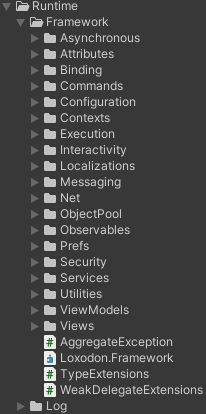
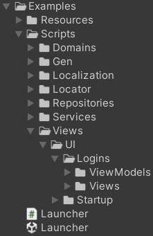
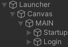
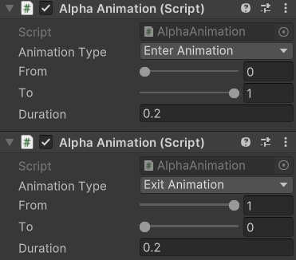
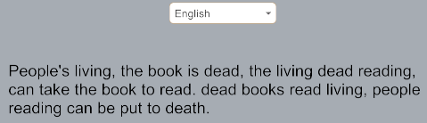
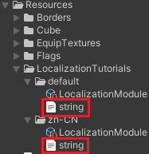
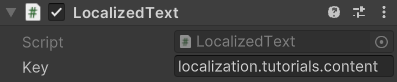
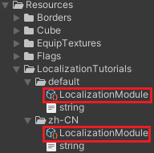
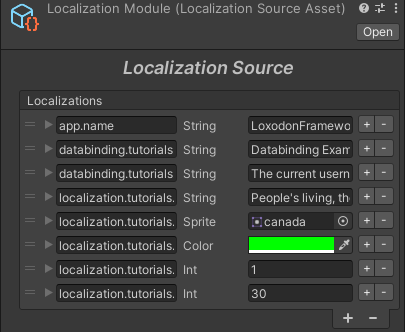

**<center><BBBG>LoxodonFramework分析第二版</BBBG></center>**

<!-- TOC -->

- [业务分析](#业务分析)
  - [分层架构](#分层架构)
  - [例子简析](#例子简析)
    - [Launcher](#launcher)
    - [View/ViewModel](#viewviewmodel)
    - [其它](#其它)
      - [Domains](#domains)
      - [Services](#services)
      - [Locator](#locator)
      - [Provider](#provider)
- [框架分析](#框架分析)
  - [前置](#前置)
    - [宏](#宏)
    - [设计模式](#设计模式)
  - [其它](#其它-1)
    - [Log](#log)
    - [ObjectPool](#objectpool)
    - [Commands](#commands)
    - [存储相关](#存储相关)
      - [Preferences](#preferences)
      - [Configuration](#configuration)
    - [触发相关](#触发相关)
      - [Observables](#observables)
      - [Interactivity](#interactivity)
      - [Messaging](#messaging)
      - [区别](#区别)
    - [Asynchronous](#asynchronous)
      - [AsyncResult](#asyncresult)
      - [Task](#task)
    - [Execution](#execution)
      - [Executors](#executors)
      - [分支Executor](#分支executor)
      - [区别](#区别-1)
    - [Contexts](#contexts)
    - [Services](#services-1)
    - [框架核心](#框架核心)
      - [MVVM](#mvvm)
        - [M](#m)
        - [V](#v)
          - [Window](#window)
          - [WindowManager](#windowmanager)
          - [动画](#动画)
          - [动画总结](#动画总结)
        - [VM](#vm)
      - [绑定](#绑定)
        - [Path](#path)
        - [Proxy](#proxy)
        - [WeakReference](#weakreference)
        - [表层](#表层)
        - [表层总结](#表层总结)
        - [底层](#底层)
        - [底层总结](#底层总结)
        - [实例](#实例)
      - [本地化](#本地化)

<!-- /TOC -->

<BR>

LoxodonFramework是一套<B><VT>基于Unity</VT></B>的**UI框架**
阅读LoxodonFramework源码后，可以直观地感受到它的<B>特性：<VT>代码结构商业化</VT></B>
所以说该框架是非常**值得学习**的

首先先看一下其**功能方向**，也就是它的文件夹：

整体来说这些内容是相辅相成的，主要目标还是为了构建UI框架
在上述文件夹中，我们能发现**ViewModels/Views**，这也说明了该框架是<B><VT>基于MVVM</VT></B>的

# 业务分析

框架制作者提供了一个例子供我们参考，如下所示：


## 分层架构

<B><GN>分层架构</GN></B>是非常常提到的一个名词，我们可以简单地理解为<B><VT>设计规范</VT></B>
简述一下这里使用到的**分层架构**：

- 表现层
  - View层
  - ViewModel层
- 服务层
  - Service
- 领域层(Domain Model，可以认为是Model)
  - Entity
  - Value Object
  - Repository
- 基础层
  - 框架
  - 各类组件(如网络/Log/...)
  - 辅助类

可以看到这些内容与框架内容是**强关联**的,可以说大部分情况下是由框架提供的这些能力

## 例子简析

在分析源码前，看一个例子会是比较好的选择

### Launcher

**Launcher.cs**是主脚本，也就是唯一入口：

``` csharp
public class Launcher : MonoBehaviour
{
    //private static readonly ILog log = LogManager.GetLogger(System.Reflection.MethodBase.GetCurrentMethod().DeclaringType);

    private ApplicationContext context;
    ISubscription<WindowStateEventArgs> subscription;
    void Awake()
    {
        GlobalWindowManagerBase windowManager = FindObjectOfType<GlobalWindowManagerBase>();
        if (windowManager == null)
            throw new NotFoundException("Not found the GlobalWindowManager.");

        context = Context.GetApplicationContext();

        IServiceContainer container = context.GetContainer();

        /* Initialize the data binding service */
        BindingServiceBundle bundle = new BindingServiceBundle(context.GetContainer());
        bundle.Start();

        /* Initialize the ui view locator and register UIViewLocator */
        container.Register<IUIViewLocator>(new ResourcesViewLocator());

        /* Initialize the localization service */
        //CultureInfo cultureInfo = Locale.GetCultureInfoByLanguage (SystemLanguage.English);
        CultureInfo cultureInfo = Locale.GetCultureInfo();
        var localization = Localization.Current;
        localization.CultureInfo = cultureInfo;
        localization.AddDataProvider(new ResourcesDataProvider("LocalizationExamples", new XmlDocumentParser()));

        /* register Localization */
        container.Register<Localization>(localization);

        /* register AccountRepository */
        IAccountRepository accountRepository = new AccountRepository();
        container.Register<IAccountService>(new AccountService(accountRepository));

        /* Enable window state broadcast */
        GlobalSetting.enableWindowStateBroadcast = true;
        /* 
            * Use the CanvasGroup.blocksRaycasts instead of the CanvasGroup.interactable 
            * to control the interactivity of the view
            */
        GlobalSetting.useBlocksRaycastsInsteadOfInteractable = true;

        /* Subscribe to window state change events */
        subscription = Window.Messenger.Subscribe<WindowStateEventArgs>(e =>
        {
            Debug.LogFormat("The window[{0}] state changed from {1} to {2}", e.Window.Name, e.OldState, e.State);
        });
    }

    IEnumerator Start()
    {
        /* Create a window container */
        WindowContainer winContainer = WindowContainer.Create("MAIN");

        yield return null;

        IUIViewLocator locator = context.GetService<IUIViewLocator>();
        StartupWindow window = locator.LoadWindow<StartupWindow>(winContainer, "UI/Startup/Startup");
        window.Create();
        ITransition transition = window.Show().OnStateChanged((w, state) =>
        {
            //log.DebugFormat("Window:{0} State{1}",w.Name,state);
        });

        yield return transition.WaitForDone();
    }
}
```

先看<B>`Awake()`</B>，都是一些**初始化操作**
可以看到出现最多的就是<B>`container.Register()`</B>操作，即<B><VT>服务注册</VT></B>，有：

- UIViewLocator
- Localization
- AccountRepository

除此以外还有：

- Binding初始化
- GlobalSettings设置
- Messenger订阅

<BR>

创建窗口流程在<B>`Start()`</B>中，流程也比较简单，核心当然是`window.Create()`

### View/ViewModel

View和ViewModel是相辅相成的两者，其中：

- View是视图，主要是获取Unity中的控件进行一些操作
- ViewModel是View与Model的中间者，用于沟通两者

**<YL>这里用LoginWindow来展示：</YL>**
先看一下两者的**声明**：
`public class LoginWindow : Window`
`public class LoginViewModel : ViewModelBase`

观察View脚本**LoginWindow.cs**，可以说干了两件事：

- 获取Unity组件(通过public，也就是序列化)
- 在`OnCreate()`中进行绑定：
<BR>

``` csharp
protected override void OnCreate(IBundle bundle)
{
    this.toastAction = new ToastInteractionAction(this);
    BindingSet<LoginWindow, LoginViewModel> bindingSet = this.CreateBindingSet<LoginWindow, LoginViewModel>();
    bindingSet.Bind().For(v => v.OnInteractionFinished).To(vm => vm.InteractionFinished);
    //bindingSet.Bind().For(v => v.OnToastShow).To(vm => vm.ToastRequest);
    bindingSet.Bind().For(v => v.toastAction).To(vm => vm.ToastRequest);

    bindingSet.Bind(this.username).For(v => v.text, v => v.onEndEdit).To(vm => vm.Username).TwoWay();
    bindingSet.Bind(this.usernameErrorPrompt).For(v => v.text).To(vm => vm.Errors["username"]).OneWay();
    bindingSet.Bind(this.password).For(v => v.text, v => v.onEndEdit).To(vm => vm.Password).TwoWay();
    bindingSet.Bind(this.passwordErrorPrompt).For(v => v.text).To(vm => vm.Errors["password"]).OneWay();
    bindingSet.Bind(this.confirmButton).For(v => v.onClick).To(vm => vm.LoginCommand);
    bindingSet.Bind(this.cancelButton).For(v => v.onClick).To(vm => vm.CancelCommand);
    bindingSet.Build();
}
```

而ViewModel脚本**LoginViewModel.cs**当然会与其配对：

``` csharp
public LoginViewModel(IAccountService accountService, Localization localization, Preferences globalPreferences)
{
    // ...
    this.loginCommand = new SimpleCommand(this.Login);
    this.cancelCommand = new SimpleCommand(() =>
    {
        this.interactionFinished.Raise();/* Request to close the login window */
    });
}

public string Username
{
    get { return this.username; }
    set
    {
        if (this.Set(ref this.username, value))
        {
            this.ValidateUsername();
        }
    }
}
// PassWord同上

```

View与ViewModel本质上内容并不多，做的事情就是绑定，比如说：
`bindingSet.Bind(this.username).For(v => v.text, v => v.onEndEdit).To(vm => vm.Username).TwoWay();`
这就是<VT>将username(一个InputField)的text属性绑定上ViewModel中的Username，而且是双向的，这意味着当输入内容修改，代码设置数据了视图会自动更新，用户输入了数据会自动更新</VT>

### 其它

其它内容都是附属于上述内容的，那么来看一下

#### Domains

Domains前面提到过，是领域层，简单理解<B><VT>可以认为是Model</VT></B>
在这里的话就是**Account.cs**，一个**实体**：

``` csharp
public class Account : ObservableObject
{
    private string username;
    private string password;

    private DateTime created;

    public string Username {
        get{ return this.username; }
        set{ this.Set(ref this.username, value); }
    }

    public string Password {
        get{ return this.password; }
        set{ this.Set(ref this.password, value); }
    }

    public DateTime Created {
        get{ return this.created; }
        set{ this.Set(ref this.created, value); }
    }
}
```

由于它具有和ViewModelBase一样的**基类ObservableObject**，所以如`Username`属性是非常相似的，但Account从**功能**上还是**不太一样**的：
它牵扯到两个类：**AccountRepository/AccountService**

**AccountRepository**是<B><VT>领域层的一部分，是Account的存储地(集合)</VT></B>
这是<B><VT>一种拆分</VT></B>，本来在实体Account中可以添加如`Get()`/`Save()`等函数(一个类即可完成所有)，仓储将函数剥离出来，使用起来必然是**更有秩序**的

- 使用字典`Dictionary<string, Account>`完成
- 提供增删查改功能，该类有：
  - `Get()`：获取Account
  - `Save()`：添加Account(Repository本地存储)

<BR>

``` csharp
public class AccountRepository : IAccountRepository
{
    private Dictionary<string, Account> cache = new Dictionary<string, Account>();

    public AccountRepository()
    {
        Account account = new Account() { Username = "test", Password = "test", Created = DateTime.Now };
        cache.Add(account.Username, account);
    }

    public virtual Task<Account> Get(string username)
    {
        Account account = null;
        this.cache.TryGetValue(username, out account);
        return Task.FromResult(account);
    }

    public virtual async Task<Account> Save(Account account)
    {
        if (cache.ContainsKey(account.Username))
            throw new Exception("The account already exists.");

        cache.Add(account.Username, account);
        return account;
    }

    public virtual Task<Account> Update(Account account)
    {
        throw new NotImplementedException();
    }

    public virtual Task<bool> Delete(string username)
    {
        throw new NotImplementedException();
    }
}
```

**关键点：**

- 仓储中<VT><B>存有实体集合</B>(通过一些方式读存(数据库/持久化/网络))</VT>
- 仓储<B><VT>提供增删改查</VT></B>功能

#### Services

服务本质上就是<B><VT>一个个功能(业务相关)</VT></B>，其实本质上也是从实体Account中拆出来的，很明显AccountService就是一个有关Account的功能
**AccountService**则<B><VT>注入了IAccountRepository</VT></B>提供了相关功能，有：

- `Register()`：保存Account
- `Update()`：未实现
- `Login()`：尝试登陆(验证密码是否正确)

注册该服务可执行操作：
`Account account = await this.accountService.Login(this.username, this.password);`


``` csharp
public class AccountService : IAccountService
{
    private IAccountRepository repository;
    private IMessenger messenger;

    public IMessenger Messenger { get { return messenger; } }

    public AccountService(IAccountRepository repository)
    {
        this.repository = repository;
        this.messenger = new Messenger();
    }


    public virtual async Task<Account> Register(Account account)
    {
        await this.repository.Save(account);
        messenger.Publish(new AccountEventArgs(AccountEventType.Register, account));
        return account;
    }

    public virtual async Task<Account> Update(Account account)
    {
        await this.repository.Update(account);
        messenger.Publish(new AccountEventArgs(AccountEventType.Update, account));
        return account;
    }

    public virtual async Task<Account> Login(string username, string password)
    {
        Account account = await this.GetAccount(username);
        if (account == null || !account.Password.Equals(password))
            return null;

        messenger.Publish(new AccountEventArgs(AccountEventType.Login, account));
        return account;
    }

    public virtual Task<Account> GetAccount(string username)
    {
        return this.repository.Get(username);
    }
}
```

#### Locator

**Locator**即定位器，也就是<B><GN>服务定位器模式Service Locator Pattern</GN></B>
简单来说功能就是：<B><VT>提供A，找到B(隐藏细节)</VT></B>
**核心点：<VT>查找能力</VT>**

<B><GN>ResourcesViewLocator</GN></B>则就是通过一定的规则获取Window：
`StartupWindow window = locator.LoadWindow<StartupWindow>(winContainer, "UI/Startup/Startup");`

#### Provider

**Provider**即提供者，能够<B><VT>提供数据</VT></B>
**核心点：<VT>提供能力</VT>**
看一下<B><GN>ResourcesDataProvider</GN></B>/<B><GN>AssetBundleDataProvider</GN></B>的共同接口IDataProvider即可知道：

``` csharp
public interface IDataProvider
{
    Task<Dictionary<string, object>> Load(CultureInfo cultureInfo);
}
```

也就是根据语言信息获取键值对

**<DRD>注意：</DRD>**
**<DRD>Service属于服务层，而Locator/Provider属于基础层，这是因为本质上来说服务层是业务相关，而基础层是业务无关的
Locator/Provider按道理来说不可能是服务层，因为即使它的功能是Locator/Provider但命名依旧应该为Service</DRD>**
**<VT>Tip：Locator/Provider虽然看起来业务相关，但应该称之为整体业务相关，可能就是针对这整个项目编写的特化代码，但不会使用到任何内部数据</VT>**

# 框架分析

框架本身就是**UI框架**，可以说所有创建的内容都是为了实现好的UI效果而创建的
前面也提到过，该框架使用的是<B><GN>MVVM</GN></B>，其中**最重要的就是绑定**
简单分类的话可以这么分：

- 框架---M/V/VM
- 绑定
- 其它

## 前置

在分析代码前，先介绍一下在后续会出现的一些比较特殊的内容

### 宏
在代码中常常会出现如下代码：

``` csharp
#if NETFX_CORE
    // ...
#else
    // ...
#endif
```

在[Unity文档](https://docs.unity.cn/cn/2019.4/Manual/PlatformDependentCompilation.html)中有所介绍：
> UNITY_WSA：用于通用 Windows 平台的 #define 指令。此外，根据 .NET Core 和使用 .NET 脚本后端来编译 C# 文件时会定义 NETFX_CORE。

### 设计模式
设计模式当然是用来构建好代码的关键，该框架使用了很多设计模式

**<GN>工厂模式</GN>**
工厂模式在该框架中极大量的出现，随便看一处：

``` csharp
public static Preferences GetPreferences(string name)
{
    Preferences prefs;
    if (cache.TryGetValue(name, out prefs))
        return prefs;

    prefs = GetFactory().Create(name);
    cache[name] = prefs;
    return prefs;
}
```

以上就是一种<B><VT>工厂创建并存储</VT></B>的方式
**好处：<GN>封装完整</GN>**
<B><YL>就以上述Preferences举例：</YL></B>
<YL>框架本身提供了PlayerPrefsPreferences/BinaryFilePreferences两种派生类供使用，如果没有工厂类，可能会有如下代码：</YL>

``` csharp
Preferences prefs;
if (XXX) {
    prefs = new PlayerPrefsPreferences(...);
} else {
    prefs = new BinaryFilePreferences(...);
}
```

<YL>如果需要新增Preferences：
这是在业务类实现的代码，即使只有一处我们也需要找到该处才能新增
而有工厂类的话逻辑是固定的：</YL>

``` csharp
Preferences.Register(new FilePreferencesFactory());
// 后续直接调用Preferences封装代码即可
var prefs = Preferences.GetPreferences(...);
```

<YL>显然是添加了工厂类的会更加有逻辑</YL>
简单来说：<B><VT>工厂类将需要的操作包装了一层，可见性更加良好</VT></B>

## 其它

无论是框架还是绑定，都将用到许多**组件辅助类**之类的内容，这里先都分析一下
内容比较多，可以在用到后再进行查阅
**简单来说，可以分为以下几种：**

- 辅助类，即Utility
- 功能类，与框架无强关联
  - Log
  - ObjectPool
- 框架功能类，与框架具有较强关联
  - Commands
  - Preferences
  - Configuration
  - Asynchronous
  - Observables
  - Interactivity
  - Commands
  - Messaging
  - Execution
- 框架底层类，与框架具有强关联
  - Contexts
  - Services

### Log

`Debug.Log()`可以说是我们在Unity中最常用的一个API了，**功能**就是<VT><B>输出信息</VT></B>，该框架对其进行了一定的**扩展**

**项目内用法：**
`private static readonly ILog log = LogManager.GetLogger(typeof(XXX));`
**核心类：**

- LogManager
- DefaultLogFactory

<BR>

<B><GN>LogManager</GN></B>
Manager显然是**管理类**，功能很简单：

- `GetLogger()`：获取ILog
- `Registry()`：更改Factory

`GetLogger()`是其关键：

``` csharp
private static readonly DefaultLogFactory _defaultFactory = new DefaultLogFactory();
private static ILogFactory _factory;

public static ILog GetLogger(Type type)
{
    if (_factory != null)
        return _factory.GetLogger(type);

    return _defaultFactory.GetLogger(type);
}
```

显然Manager仅为组织者，具体还是需要**看Factory**
<B><GN>DefaultLogFactory</GN></B>
默认提供的工厂为DefaultLogFactory，当然`GetLogger()`是其关键：

``` csharp
public ILog GetLogger(Type type)
{
    ILog log;
    if (repositories.TryGetValue(type.FullName, out log))
        return log;

    log = new LogImpl(type.Name, this); // 创建log
    repositories[type.FullName] = log;
    return log;
}
```

可以得知：<B><VT>一个Type会创建一个LogImpl，也就是单例</VT></B>
<B><GN>LogImpl</GN></B>当然是一个ILog，也就是我们获取到的内容
LogImpl<B><VT>对Unity的Debug类进行了封装</VT></B>，具体如下：

- `Debug()`：原Log
- `Info()`：原Log
- `Warn()`：原LogWarning
- `Error()`：原LogError
- `Fatal()`：原LogError
- 上述5种函数的Format版本(如`DebugFormat()`)

**<BL>问题：`Debug()`与`Info()`的区别</BL>**
<BL>两者实现是完全一致的，都用的是`Debug.Log()`但它们的level是不一样的：</BL>
`UnityEngine.Debug.Log(Format(message, "DEBUG"));`
`UnityEngine.Debug.Log(Format(message, "INFO"));`
**<VT>`Error()`与`Fatal()`同理</VT>**

下面就用`Debug()`展示一下：

``` csharp
protected virtual string Format(object message, string level)
{
    return string.Format("{0:yyyy-MM-dd HH:mm:ss.fff} [{1}] {2} - {3}", System.DateTime.Now, level, name, message);
}

public virtual void Debug(object message)
{
    if (this._factory.InUnity)
        UnityEngine.Debug.Log(Format(message, "DEBUG"));
#if !NETFX_CORE
    else
        Console.WriteLine(Format(message, "DEBUG"));
#endif
}
public virtual void Debug(object message, Exception exception)
{
    Debug(string.Format("{0} Exception:{1}", message, exception));
}
```

可以看到就是<VT>添加了一些信息</VT>：**时间/log等级/log对象**
level提供了一些等级控制开关，如`IsDebugEnabled()`，这里需要注意的是是否开启取决于对工厂Level的设置，有：

``` csharp
protected bool IsEnabled(Level level)
{
    return level >= this._factory.Level;
}

public enum Level
{
    ALL = 0,
    DEBUG,
    INFO,
    WARN,
    ERROR,
    FATAL,
    OFF
}
```

可以发现这样就处于一种**包含的层级关系**，就像默认的`Level.ALL`就会记录所有level，而`Level.WARN`就只会记录比本身以及比`Level.WARN`更严重的错误(ERROR/FATAL)
可以想到：<B><VT>这是一种基于上线的策略，某些情况，只需记录严重bug即可，其余小问题是无所谓的</VT></B>

### ObjectPool

**<VT>ObjectPool在框架中并无使用，但是作者还是提供了该功能</VT>**
一共有**2种形态**：

- ObjectPool
- MixedObjectPool

先看单纯的<B><GN>ObjectPool</GN></B>：
其**声明**为：
`public class ObjectPool<T> : IObjectPool<T> where T : class`
接口内容不多，**核心**就是：`Allocate()`/`Free()`，这也正是对象池该做的事情
该类的构造函数表明了它的基：

``` csharp
public ObjectPool(IObjectFactory<T> factory, int initialSize, int maxSize)
{
    this.factory = factory;
    this.initialSize = initialSize;
    this.maxSize = maxSize;
    this.entries = new Entry[maxSize];

    if (maxSize < initialSize)
        throw new ArgumentException("the maxSize must be greater than or equal to the initialSize");

    for (int i = 0; i < initialSize; i++)
    {
        this.entries[i].value = factory.Create(this);
    }
}
```

一共有3个信息：**初始容量/最大容量/创建工厂**
显然**工厂**是最重要的：
对于ObjectPool，工厂只提供了一种，为<B><GN>UnityGameObjectFactoryBase</GN></B>，内容也很简单：

``` csharp
public abstract class UnityGameObjectFactoryBase : IObjectFactory<GameObject>
{
    public virtual GameObject Create(IObjectPool<GameObject> pool)
    {
        GameObject target = this.Create();
        PooledUnityObject pooledObj = target.AddComponent<PooledUnityObject>();
        pooledObj.pool = pool;
        return target;
    }

    protected abstract GameObject Create();

    public abstract void Reset(GameObject obj);

    public virtual void Destroy(GameObject obj)
    {
        Object.Destroy(obj);
    }

    public virtual bool Validate(GameObject obj)
    {
        return true;
    }

    class PooledUnityObject : MonoBehaviour, IPooledObject
    {
        internal IObjectPool<GameObject> pool;

        public void Free()
        {
            if (pool != null)
                pool.Free(this.gameObject);
        }
    }
}
```

可以看到没什么特殊的，就是<B><VT>创一个GameObject，然后封装成PooledUnityObject</VT></B>

再来看一下**Mixed版本**：
对于Mixed版本，可以发现基础有所变化：

``` csharp
public MixedObjectPool(IMixedObjectFactory<T> factory, int defaultMaxSizePerType)
{
    this.factory = factory;
    this.defaultMaxSizePerType = defaultMaxSizePerType;

    if (defaultMaxSizePerType <= 0)
        throw new ArgumentException("the maxSize must be greater than 0");

    this.entries = new ConcurrentDictionary<string, List<T>>();
    this.typeSize = new ConcurrentDictionary<string, int>();
}
```

可以发现entries变为了一个字典，而且多了一个typeSize字典
最起码我们肯定能知道：<B><VT>这是一个存储多种类型的对象池</VT></B>
同样的，创建还是通过**工厂**完成，即<B><GN>UnityMixedGameObjectFactoryBase</GN></B>：

``` csharp
public virtual GameObject Create(IMixedObjectPool<GameObject> pool, string typeName)
{
    GameObject target = this.Create(typeName);
    PooledUnityObject pooledObj = target.gameObject.AddComponent<PooledUnityObject>();
    pooledObj.pool = pool;
    pooledObj.target = target;
    pooledObj.typeName = typeName;
    return target;
}
```

整体是完全一致的，只是多了一个typeName
拿一个<B><YL>作者例子</YL></B>就能很清晰的说明了：

``` csharp
public class CubeMixedObjectFactory : UnityMixedGameObjectFactoryBase
{
    // ...
    protected override GameObject Create(string typeName)
    {
        Debug.LogFormat("Create a cube.");
        GameObject go = GameObject.Instantiate(this.template, parent);
        go.GetComponent<MeshRenderer>().material.color = GetColor(typeName);
        return go;
    }

    protected Color GetColor(string typeName)
    {
        if (typeName.Equals("red"))
            return Color.red;
        if (typeName.Equals("green"))
            return Color.green;
        if (typeName.Equals("blue"))
            return Color.blue;

        throw new NotSupportedException("Unsupported type:" + typeName);
    }
    // ...
}
```

这些代码足以看出：<B><VT>typeName不一定是Type，只要能做出区分即可</VT></B>
所以：<B><VT>Mixed不一定是多GameObject混合，单GameObject的多形态更是它的主功能</VT></B>

### Commands

严格来说，Commands是一种<B><VT>与MVVM或者MVC等框架强关联的触发机制</VT></B>，
对于这些框架来说，命令模式最大的**好处**应该是<B><VT>可拆分</VT></B>，但是在该框架下**并非如此**

所有类型的Command都基于**CommandBase**，**声明**为：
`public abstract class CommandBase : ICommand`
看一下**接口**：

``` csharp
public interface ICommand
{
    event EventHandler CanExecuteChanged;
    bool CanExecute (object parameter);
    void Execute (object parameter);
}
```

由此就能看出区别：<B><VT>该Command除了`Execute()`，在CanExecute发生改变时会执行事件</VT></B>

**<GN>SimpleCommand</GN>**
SimpleCommand是几种Command中最简单的，先看**构造**：

``` csharp
public SimpleCommand(Action execute, bool keepStrongRef = false)
{
    if (execute == null)
        throw new ArgumentNullException("execute");

    this.execute = keepStrongRef ? execute : execute.AsWeak();
}
```

这里有一个特殊机制：<B><VT>默认情况下将Action委托设置为弱引用(可回收)</VT></B>
之所以这样是因为：<B><VT>防止View无法回收</VT></B>

其`Execute()`执行流程如下：

``` csharp
public override void Execute(object parameter)
{
    if (this.CanExecute(parameter) && this.execute != null)
        this.execute();
}

public override bool CanExecute(object parameter)
{
    return this.Enabled;
}

public bool Enabled
{
    get { return this.enabled; }
    set
    {
        if (this.enabled == value)
            return;

        this.enabled = value;
        this.RaiseCanExecuteChanged();
    }
}
```

显然：<B><VT>Enabled属性决定了是否可执行</VT></B>
而对于SimpleCommand来说，**不存在Enable属性变更导致的事件触发**

**<GN>RelayCommand</GN>**
Relay即转发，从名字上不太好理解，但我们看一下**构造函数**就清楚了：

``` csharp
public RelayCommand(Action execute, Func<bool> canExecute, bool keepStrongRef = false)
{
    if (execute == null)
        throw new ArgumentNullException("execute");

    this.execute = keepStrongRef ? execute : execute.AsWeak();

    if (canExecute != null)
        this.canExecute = keepStrongRef ? canExecute : canExecute.AsWeak();
}
```

显然，<B><VT>是否可以执行的逻辑交由传入的canExecute决定，起到转发的作用</VT></B>

**<GN>CompositeCommand</GN>**
CompositeCommand是一个ICommand的管理类，核心就是：
`private readonly List<ICommand> commands = new List<ICommand>();`
对于多个ICommand，执行顺序/是否执行这里都会规定

### 存储相关

**Preferences**与**Configuration**两者都是有关存储的内容
当然它们有着**不同的侧重点**：

- Preferences：项目相关
- Configuration：更多的是一种外部设置，不可保存

#### Preferences
Preferences是**ApplicationContext的重要组成部分**，有：

``` csharp
public virtual Preferences GetGlobalPreferences()
{
    // 本质还是Preferences.GetPreferences()
    return Preferences.GetGlobalPreferences();
}
public virtual Preferences GetUserPreferences(string name)
{
    return Preferences.GetPreferences(name);
}
```

那么先来看一下<B><GN>基础类Preferences</GN></B>：

- **创建**
  对于Preferences，创建是通过工厂完成的，即`prefs = GetFactory().Create(name)`
  具体选择哪个工厂当然取决于`GetFactory()`，有2个选项：`_factory`/`_defaultFactory`
  `_defaultFactory`是一个PlayerPrefsPreferencesFactory
  而`_factory`是通过`Register()`注册存放的(只有1个)
- **获取**
  获取其实和创建是合二为一的，与大部分类相同，这里同样使用的是**工厂模式**，方法如下：
  <BR>

  ``` csharp
  public static Preferences GetPreferences(string name)
  {
      Preferences prefs;
      if (cache.TryGetValue(name, out prefs))
          return prefs;
    
      prefs = GetFactory().Create(name);
      cache[name] = prefs;
      return prefs;
  }

  static Preferences()
  {
      _defaultFactory = new PlayerPrefsPreferencesFactory();
  }
  protected static IFactory GetFactory()
  {
      if (_factory != null)
          return _factory;
      return _defaultFactory;
  }
  ```

  显然，<B><GN>PlayerPrefsPreferencesFactory</GN></B>是创建的关键

- **Get/Set**
  可以说Preferences就是用来进行该操作的，即存储信息获取信息
  在类中可以看到极大量的操作，但核心都指向了`GetObject()`/`SetObject()`
  但其实是abstract函数，需子类实现
- **其它操作**
  除此以外还有一些abstract函数，为：`Save()`/`Delete()`/`Load()`/`Remove()`

**用法**如下：
`var globalPreferences = context.GetGlobalPreferences();`
`this.username = globalPreferences.GetString(LAST_USERNAME_KEY, "");`

<BR>

当然，既然<B><VT>有工厂那么必然会生产出不同类型的实例</VT></B>，有：

- PlayerPrefsPreferencesFactory：生产PlayerPrefsPreferences
- BinaryFilePreferencesFactory：生产BinaryFilePreferences

**两工厂声明**如下：
`public class PlayerPrefsPreferencesFactory : AbstractFactory`
`public class BinaryFilePreferencesFactory : AbstractFactory`
作为**AbstractFactory**，其核心为：

- `Create()`：创建Preferences
- `IEncryptor encryptor`：加密功能，默认为<B><GN>DefaultSerializer</GN></B>
- `ISerializer serializer`：序列化功能，默认为<B><GN>DefaultEncryptor</GN></B>
<BR>

``` csharp
public AbstractFactory(ISerializer serializer, IEncryptor encryptor)
{
#if UNITY_IOS
    Environment.SetEnvironmentVariable("MONO_REFLECTION_SERIALIZER", "yes");
#endif
    this.serializer = serializer;
    this.encryptor = encryptor;

    // 当然，作者提供了默认的工具
    if (this.serializer == null)
        this.serializer = new DefaultSerializer();

    if (this.encryptor == null)
        this.encryptor = new DefaultEncryptor();
}
```

**<GN>PlayerPrefsPreferences</GN>**

作为存储数据，获取流程必然是<B><VT>先加载再读取</VT></B>
**加载**即`Load()`，有：

``` csharp
public PlayerPrefsPreferences(string name, ISerializer serializer, IEncryptor encryptor) : base(name)
{
    this.serializer = serializer;
    this.encryptor = encryptor;
    this.Load();
}
protected override void Load()
{
    LoadKeys();
}

protected virtual void LoadKeys()
{
    if (!PlayerPrefs.HasKey(Key(KEYS)))
        return;

    string value = PlayerPrefs.GetString(Key(KEYS));
    if (string.IsNullOrEmpty(value))
        return;

    string[] keyValues = value.Split(new string[] { "," }, StringSplitOptions.RemoveEmptyEntries);
    foreach (string key in keyValues)
    {
        if (string.IsNullOrEmpty(key))
            continue;

        this.keys.Add(key);
    }
}
```

**<BL>问题：`Key(KEY)`是什么</BL>**

``` csharp
protected static readonly string KEYS = "_KEYS_";

protected string Key(string key)
{
     // Name为构造函数传入，默认为GLOBAL_NAME，即"_GLOBAL_"
    StringBuilder buf = new StringBuilder(this.Name);
    buf.Append(".").Append(key);
    return buf.ToString();
}
```

<BL>所以简单来说这种形式下就是<B>加了一个前缀</B>，本质上只是用于<B><VT>区分所属实例Preferences</VT></B></BL>

所以<B>`Load()`</B>所做的就是：
**<VT>获取PlayerPrefs所存储的数据集，并拆解成List形式(`keys`)</VT>**

**存取**是通过<B>`SetObject()`/`GetObject()`</B>完成的：

``` csharp
public override void SetObject(string key, object value)
{
    // 序列化为string
    string str = value == null ? "" : serializer.Serialize(value);
    // 加密
    if (this.encryptor != null)
    {
        // 加密方式：转strng明文(二进制)，加密，转string
        byte[] data = Encoding.UTF8.GetBytes(str);
        data = this.encryptor.Encode(data);
        str = Convert.ToBase64String(data);
    }

    PlayerPrefs.SetString(Key(key), str);

    if (!this.keys.Contains(key))
    {
        this.keys.Add(key);
        this.SaveKeys();
    }
}
```

可以看到处理好数据后，本质上其实就是在<B><VT>调用Unity的PlayerPrefs类进行存储</VT></B>
`PlayerPrefs.SetString()`看似已经保存完毕，但这<B><DRD>还不够</DRD></B>：
我们可能保存了许多键值对，我们当然可以手动取出某一个，但到底有哪些我们其实是不知道的，假设我们需要执行`RemoveAll()`来删除所有已有数据，这是无法做到的
<B>`SaveKeys()`</B>就是关键的一步：<B><VT>将所有key保存至PlayerPrefs</VT></B>：

``` csharp
protected virtual void SaveKeys()
{
    if (this.keys == null || this.keys.Count <= 0)
    {
        PlayerPrefs.DeleteKey(Key(KEYS));
        return;
    }

    string[] values = keys.ToArray(); // 取出keys
    // 拼接keys
    StringBuilder buf = new StringBuilder();
    for (int i = 0; i < values.Length; i++)
    {
        if (string.IsNullOrEmpty(values[i]))
            continue;

        buf.Append(values[i]);
        if (i < values.Length - 1)
            buf.Append(",");
    }
    
    PlayerPrefs.SetString(Key(KEYS), buf.ToString());
}
```

可以看到<B><VT>`SaveKeys()`这是在将所有的key用另一个key保存了</VT></B>，它的key就是`Pref名._KEYS_`

<YL>这里<B>举个例子</B>就很好理解了：
`globalPreferences.SetString("LAST_USERNAME", "A")`
`globalPreferences.SetString("FIRST_USERNAME", "B")`
对于GlobalPreferences来说，其Name为`_GLOBAL_`
对于第一句：
此时key为`"_GLOBAL_.LAST_USERNAME"`，value为`"A"`的加密string形式
同时`SaveKeys()`也会存储另一份合集形式，此时key为`_GLOBAL_._KEYS_`，value为`"LAST_USERNAME"`
对于第二句：
此时key为`"_GLOBAL_.FIRST_USERNAME"`，value为`"B"`的加密string形式
同时`SaveKeys()`会进行扩展，此时key为`_GLOBAL_._KEYS_`，value为`"LAST_USERNAME,FIRST_USERNAME"`</YL>


我们能**更清晰地了解**到：
**<VT>本质上`PlayerPrefs.SetString()`是存储，而`SaveKeys()`是更高层面的存储，也就是存储了有哪些key</VT>**
所以我们就能实现这种**清除手段**：

``` csharp
public override void RemoveAll()
{
    foreach (string key in keys)
    {
        PlayerPrefs.DeleteKey(Key(key));
    }
    PlayerPrefs.DeleteKey(Key(KEYS));
    this.keys.Clear();
}
```

**<GN>BinaryFilePreferences</GN>**
BinaryFilePreferences是同理的，用的是BinaryFile，也就是<B><VT>文件流</VT></B>

#### Configuration

Configuration同样是存储设置，但是是不同的
**<YL>先看例子：</YL>**

``` csharp
public class ConfigurationExample : MonoBehaviour
{
    private void Start()
    {
        IConfiguration conf = CreateConfiguration();
        Version appVersion = conf.GetVersion("application.app.version");
        Version dataVersion = conf.GetVersion("application.data.version");

        Debug.LogFormat("application.app.version:{0}", appVersion);
        Debug.LogFormat("application.data.version:{0}", dataVersion);

        string groupName = conf.GetString("application.config-group");
        IConfiguration currentGroupConf = conf.Subset("application." + groupName);

        string upgradeUrl = currentGroupConf.GetString("upgrade.url");
        string username = currentGroupConf.GetString("username");
        string password = currentGroupConf.GetString("password");
        string[] gatewayArray = currentGroupConf.GetArray<string>("gateway");

        Debug.LogFormat("upgrade.url:{0}", upgradeUrl);
        Debug.LogFormat("username:{0}", username);
        Debug.LogFormat("password:{0}", password);

        int i = 1;
        foreach (string gateway in gatewayArray)
        {
            Debug.LogFormat("gateway {0}:{1}", i++, gateway);
        }
    }

    private IConfiguration CreateConfiguration()
    {
        List<IConfiguration> list = new List<IConfiguration>();

        //Load default configuration file
        TextAsset text = Resources.Load<TextAsset>("application.properties");
        list.Add(new PropertiesConfiguration(text.text));

        //Load configuration files based on platform information. Configuration files loaded later 
        //have a higher priority than configuration files loaded first.
        text = Resources.Load<TextAsset>(string.Format("application.{0}.properties", Application.platform.ToString().ToLower()));
        if (text != null)
            list.Add(new PropertiesConfiguration(text.text));

        if (list.Count == 1)
            return list[0];

        return new CompositeConfiguration(list);
    }
}
```

可以发现同样是通过`GetString()`之类的函数完成获取的，但是整体有很多的不同

**继承链**如下所示：
`ConfigurationBase : IConfiguration`<VT>抽象类</VT>
**派生**出：

- MemoryConfiguration：内存流读取(`Dictionary<string, object>`字典)
- PropertiesConfiguration：自定义属性读取
- SubsetConfiguration：子集Configuration
- CompositeConfiguration：组合Configuration

很明显：<B><VT>MemoryConfiguration/PropertiesConfiguration是原生Configuration，SubsetConfiguration/CompositeConfiguration则是通过原始或自建Configuration扩展而成</VT></B>

**<GN>ConfigurationBase</GN>**
四种Configuration的基，简单分析一下**核心内容**：

- 获取
  - `GetProperty()`：<B><VT>核心</VT></B>
  - `GetString()`
  - `GetXXX()`
  - ...
- 其它
  - `Subset()`
- 抽象
  - `GetKeys()`
  - `ContainsKey()`
  - `GetProperty()`(子部分)
  - `AddProperty()`
  - `RemoveProperty()`
  - `SetProperty()`
  - `Clear()`

显然：<B><VT>Property操作是这里的关键</VT></B>

对于这些实现的内容，我们可能会比较好奇的是`Subset()`，这显然**与SubsetConfiguration有关**
除此之外`GetProperty()`是比较重要的：

``` csharp
protected virtual T GetProperty<T>(string key, T defaultValue)
{
    object value = GetProperty(key); // 这里就是抽象的子部分
    if (value == null)
        return defaultValue;

    return (T)ConvertTo(typeof(T), value);
}
```

简单来说就是用派生类的实现获取value后转换为相应类型即可
**转换流程**也很简单：

``` csharp
protected virtual object ConvertTo(Type type, object value)
{
    try
    {
        for (int i = 0; i < converters.Count; i++)
        {
            var converter = converters[i];
            if (!converter.Support(type))
                continue;

            return converter.Convert(type, value);
        }
    }
    // 异常处理
}
```

其中转换器默认添加了一种<B><GN>DefaultTypeConverter</GN></B>，会<VT>支持基础类型，同时也会支持接口中存在的DateTime/Version之类的类型</VT>

接下来当然是先从**基本原生实现**开始

**<GN>MemoryConfiguration/PropertiesConfiguration</GN>**
观察Property操作，以MemoryConfiguration为例：

``` csharp
private readonly Dictionary<string, object> dict = new Dictionary<string, object>();

public MemoryConfiguration(Dictionary<string, object> dict):base()
{
    if (dict != null && dict.Count > 0)
    {
        foreach (var kv in dict)
        {
            dict.Add(kv.Key, kv.Value);
        }
    }
}

public override object GetProperty(string key)
{
    object value = null;
    dict.TryGetValue(key, out value);
    return value;
}
public override void AddProperty(string key, object value)
{
    if (dict.ContainsKey(key))
        throw new AlreadyExistsException(key);

    dict.Add(key, value);
}
public override void SetProperty(string key, object value)
{
    dict[key] = value;
}
public override void RemoveProperty(string key)
{
    dict.Remove(key);
}
```

我们可以得知：
**<VT>MemoryConfiguration核心是加载dic，并对其进行增删查操作</VT>**
而<B><VT>PropertiesConfiguration仅是加载方式不同</VT></B>：

``` csharp
public MemoryConfiguration(Dictionary<string, object> dict):base()
{
    if (dict != null && dict.Count > 0)
    {
        foreach (var kv in dict)
        {
            dict.Add(kv.Key, kv.Value);
        }
    }
}

public PropertiesConfiguration(string text):base()
{
    this.Load(text);
}
protected void Load(string text)
{
    StringReader reader = new StringReader(text);
    string line = null;
    while (null != (line = reader.ReadLine()))
    {
        line = line.Trim();
        if (string.IsNullOrEmpty(line))
            continue;

        if (Regex.IsMatch(line, @"^((#)|(//))"))
            continue;

        int index = line.IndexOf("=");
        if (index <= 0 || (index + 1) >= line.Length)
            throw new FormatException(string.Format("This line is not formatted correctly.line:{0}", line));

        string key = line.Substring(0, index).Trim();
        string value = line.Substring(index + 1).Trim();
        if (string.IsNullOrEmpty(key))
            throw new FormatException(string.Format("The key is null or empty.line:{0}", line));

        if (dict.ContainsKey(key))
            throw new AlreadyExistsException(string.Format("This key already exists.line:{0}", line));

        dict.Add(key, value);
    }
}
```

**所以：**

- MemoryConfiguration是通过一个来自程序的字典完成的，所以可能来自json等序列化文件
- PropertiesConfiguration是通过文本完成的，所以可能来自某txt文本

总的来说，MemoryConfiguration更像是一种**基础形式**，而PropertiesConfiguration是一种**自定义形式**，因为文件的读取方式完全是自定义的：

- MemoryConfiguration：<B><VT>基础的一一配对</VT></B>
- PropertiesConfiguration：<B><VT>基于行的配置</VT></B>
  如：`server.host = 192.168.1.1`会被存入为`["server.host"] = "192.168.1.1"`

<BR>

以上是基础的两个Configuration，接下来看一下**复合型**的：

<B><GN>SubsetConfiguration</GN></B>
从构造函数我们能得知一些信息：

``` csharp
public SubsetConfiguration(ConfigurationBase parent, string prefix)
{
    this.parent = parent;
    this.prefix = prefix;
}
```

**parent**与其名中的**SubSet子集**对应：
**<VT>SubsetConfiguration是某Configuration的子集</VT>**
这是一种<B><GN>装饰器模式</GN></B><VT>(包装parent，进行扩展)</VT>

在继续分析前，我们需要看一下`ConfigurationBase.Subset()`：

``` csharp
public virtual IConfiguration Subset(string prefix)
{
    if (string.IsNullOrEmpty(prefix))
        throw new ArgumentException("the prefix is null or empty", "prefix");

    return new SubsetConfiguration(this, prefix);
}
```

这意味着：
<B><VT>任何Configuration(除了SubsetConfiguration，因为override了)都能直接创出SubsetConfiguration</VT></B>

回到该类，
其中有1个关键函数：

``` csharp
protected string GetParentKey(string key)
{
    if ("".Equals(key) || key == null)
        throw new ArgumentNullException(key);

    return prefix + KEY_DELIMITER + key; // 补充前缀
}
```

再来看override的`Subset()`：

``` csharp
public override IConfiguration Subset(string prefix)
{
    return parent.Subset(GetParentKey(prefix));
}
```

**<YL>举个例子会很好理解：</YL>**

``` csharp
var baseConfig = new PropertiesConfiguration();
baseConfig.SetProperty("app.database.mysql.host", "localhost");
baseConfig.SetProperty("app.database.mysql.port", "3306");

IConfiguration appConfig = baseConfig.Subset("app");
appConig.GetString("database.mysql.host");
IConfiguration dbConfig = appConfig.Subset("database");
dbConfig.GetString("mysql.host");
```

<YL>对于appConfig，其prefix为"app"
对于dbConfig，其prefix为"app.database"，而且它是通过`baseConfig.Subset("app.database")`创建的</YL>

可以说：<B><VT>每一个SubsetConfiguration都是独立的</VT></B>
对于其它函数，也都是通过parent执行的：
`GetProperty()`：`return parent.GetProperty(GetParentKey(key));`

<B><GN>CompositeConfiguration</GN></B>
Subset意味着子集，而Composite意味着**组合**，即<B><VT>由多个Configuration组成的Configuration</VT></B>
其**构造函数**说明了一切：

``` csharp
public CompositeConfiguration(List<IConfiguration> configurations)
{
    this.memoryConfiguration = new MemoryConfiguration();
    this.configurations.Add(memoryConfiguration);

    if (configurations != null && configurations.Count > 0)
    {
        for (int i = 0; i < configurations.Count; i++)
        {
            var config = configurations[i];
            if (config == null)
                continue;

            AddConfiguration(config);
        }
    }
}

public void AddConfiguration(IConfiguration configuration)
{
    if (!configurations.Contains(configuration))
    {
        configurations.Insert(1, configuration);
    }
}
```

可以说这是一种**具有保底机制的Configuration**：
**<VT>依次查看Configuration有没有对应key，最终保底一个memoryConfiguration</VT>**
**也就是：**

- `AddProperty()`/`SetProperty()`/`RemoveProperty()`针对保底memoryConfiguration操作
- `GetProperty()`按序查询获取

### 触发相关

Observables/Interactivity/Messaging三者都是有关触发的内容
当然它们有着**不同的侧重点**：

- Observables：观察者模式
- Interactivity：交互请求模式
- Messaging：发布订阅模式

#### Observables

从名字上我们就可以得知这是有关<B><GN>观察者模式</GN></B>的一组类，
有**4种实现**：

- ObservableObject
- ObservableList
- ObservableDictionary
- ObservableProperty

很明显，就是针对4种内容：Object/List/Dictionary/Property

**<GN>ObservablesList/ObservableDictionary</GN>**
其中最好理解的肯定是List与Dictionary，因为它们必然是<B><VT>在原数据结构的基础上进行扩展</VT></B>的
其**声明**如下所示：
`[Serializable] public class ObservableList<T> : IList<T>, IList, INotifyCollectionChanged, INotifyPropertyChanged`
`[Serializable] public class ObservableDictionary<TKey, TValue> : IDictionary<TKey, TValue>, IDictionary, INotifyCollectionChanged, INotifyPropertyChanged`
IList/IDictionary就是自定义数据结构的基
而<B><VT>INotifyCollectionChanged/INotifyPropertyChanged则是观察者的关键</VT></B>
<B><GN>INotifyPropertyChanged</GN></B>我们可能在C#实现的MVVM中遇到过，也就是<B><VT>数据绑定的核心</VT></B>，正如其名所示，简单来说就是一个<B><VT>通知UI对象属性发生改变的机制</VT></B>
**<VT>Tip：由于脱离了C#MVVM，所以自动绑定的机制不再可用，但可自行实现</VT>**
**接口实现**本身很简单：

``` csharp
public interface INotifyPropertyChanged
{
  event PropertyChangedEventHandler PropertyChanged;
}

public delegate void PropertyChangedEventHandler(object sender, PropertyChangedEventArgs e);
public class PropertyChangedEventArgs : EventArgs
{
  public PropertyChangedEventArgs(string propertyName);

  public virtual string PropertyName { get; }
}
```

在某种操作下，会触发该事件：

``` csharp
// ObservableList
private static readonly PropertyChangedEventArgs CountEventArgs = new PropertyChangedEventArgs("Count");
private static readonly PropertyChangedEventArgs IndexerEventArgs = new PropertyChangedEventArgs("Item[]");

public event PropertyChangedEventHandler PropertyChanged
{
    add { lock (propertyChangedLock) { this.propertyChanged += value; } }
    remove { lock (propertyChangedLock) { this.propertyChanged -= value; } }
}

protected virtual void OnPropertyChanged(PropertyChangedEventArgs e)
{
    if (this.propertyChanged != null)
    {
        this.propertyChanged(this, e);
    }
}

// 例子：Add，在对应情况(即InsertItem)都会触发
public void Add(T item)
{
    if (IsReadOnly)
        throw new NotSupportedException("ReadOnlyCollection");

    int index = items.Count;
    InsertItem(index, item);
}
protected virtual void InsertItem(int index, T item)
{
    CheckReentrancy();

    items.Insert(index, item);

    OnPropertyChanged(CountEventArgs);
    OnPropertyChanged(IndexerEventArgs);
    OnCollectionChanged(NotifyCollectionChangedAction.Add, item, index);
}
```

那么**重中之重**其实是**PropertyChanged事件的添加**，但这属于是业务层面的内容了

<B><GN>INotifyCollectionChanged</GN></B>同理，但处理的是**集合级别**的
但是有一点**需要注意**：

``` csharp
#if NET_2_0 || NET_2_0_SUBSET || (UNITY_EDITOR && UNITY_METRO  && !(NET_STANDARD_2_0 || NET_4_6)) 
namespace System.Collections.Specialized
{
    public delegate void NotifyCollectionChangedEventHandler(object sender, NotifyCollectionChangedEventArgs e);

    public interface INotifyCollectionChanged
    {
        event NotifyCollectionChangedEventHandler CollectionChanged;
    }
}
#endif
```

即<B><VT>INotifyCollectionChanged针对旧平台提供了支持</VT></B>

**<GN>ObservableProperty</GN>**
ObservableProperty本质上和ObservablesList/ObservableDictionary可以**归为一类**，但是有一点**明显不同**：
**<VT>ObservableProperty不继承C#接口而是自定义了接口</VT>**
其**声明与接口**如下：

``` csharp
[Serializable]
public class ObservableProperty : ObservablePropertyBase<object>, IObservableProperty {...}
    
public interface IObservableProperty
{
    event EventHandler ValueChanged;
    Type Type { get; }
    object Value { get; set; }
}
```

由该接口我们可以得知：<B><VT>Property指的是Value，应该会用于某种属性的包装</VT></B>
实际上**触发原理**还是完全一致的：

``` csharp
[Serializable]
public abstract class ObservablePropertyBase<T>
{
    private EventHandler valueChanged;

    public event EventHandler ValueChanged
    {
        add { lock (_lock) { this.valueChanged += value; } }
        remove { lock (_lock) { this.valueChanged -= value; } }
    }

    protected void RaiseValueChanged()
    {
        this.valueChanged?.Invoke(this, EventArgs.Empty);
    }

    // ...
}

[Serializable]
public class ObservableProperty : ObservablePropertyBase<object>, IObservableProperty
{
    public virtual object Value
    {
        get { return this._value; }
        set
        {
            if (this.Equals(this._value, value))
                return;

            this._value = value;
            this.RaiseValueChanged();
        }
    }

    // ...
}
```

**<GN>ObservableObject</GN>**
ObservableObject是4种中**最特殊**的一种，也是**最关键**的一种，原因就在于：
<B><VT>ViewModelBase继承于ObservableObject</VT></B>
先看一下其**声明**：
`[Serializable] public abstract class ObservableObject : INotifyPropertyChanged`
最明显的一点**区别**就是：<B><VT>ObservableObject是抽象的，而非直接创建的实例</VT></B>
正因该区别**实现**也有所不同：

``` csharp
protected virtual void RaisePropertyChanged(PropertyChangedEventArgs eventArgs)
{
    try
    {
        if (propertyChanged != null)
            propertyChanged(this, eventArgs);
    }
    catch (Exception e)
    {
        if (log.IsWarnEnabled)
            log.WarnFormat("Set property '{0}', raise PropertyChanged failure.Exception:{1}", eventArgs.PropertyName, e);
    }
}

protected bool Set<T>(ref T field, T newValue, [CallerMemberName] string propertyName = null)
{
    if (EqualityComparer<T>.Default.Equals(field, newValue))
        return false;

    field = newValue;
    RaisePropertyChanged(propertyName);
    return true;
}
```

触发由`Set()`进行，<B><YL>如：<YL></B>

``` csharp
public string Username
{
    get { return this.username; }
    set
    {
        if (this.Set(ref this.username, value))
        {
            this.ValidateUsername();
        }
    }
}
```

由此我们能更加明白**Object的含义**：
**<VT>ObservableObject本身就是一种需要观察者功能的集合，是其中的属性需要进行`Set()`操作</VT>**

**<BL>问题：`[CallerMemberName]`是什么</BL>**
<BL><B><GN>[CallerMemberName]</GN></B>，这是一个**编译期特性**，可以<B><VT>自动传入属性名</VT></B>
所以对于上述例子，就相当于是：`this.Set(ref this.username, value, "Username")`
那么这里的**含义**就是：<B><VT>先将`username`设置为value，然后通过该string转换为PropertyChangedEventArgs后进行propertyChanged回调</VT></B></BL>

<BR>

#### Interactivity

Interactivity即**互动性**，对于该组内容需要先<B><YL>举一个例子</YL></B>明确一下用法：

``` csharp
// InterationExample(View)
protected override void Start()
{
    // ...
    bindingSet.Bind().For(v => v.OnOpenAlert).To(vm => vm.AlertDialogRequest);

    bindingSet.Bind(this.openAlert).For(v => v.onClick).To(vm => vm.OpenAlertDialog);
    // ...
}
private void OnOpenAlert(object sender, InteractionEventArgs args)
{
    DialogNotification notification = args.Context as DialogNotification;
    var callback = args.Callback;

    if (notification == null)
        return;

    AlertDialog.ShowMessage(notification.Message, notification.Title, notification.ConfirmButtonText, null, notification.CancelButtonText, notification.CanceledOnTouchOutside, (result) =>
        {
            notification.DialogResult = result;
            callback?.Invoke();
        });
}

// InterationViewModel
public InterationViewModel()
{
    this.OpenAlertDialog = new SimpleCommand(() =>
    {
        this.OpenAlertDialog.Enabled = false;

        DialogNotification notification = new DialogNotification("Interation Example", "This is a dialog test.", "Yes", "No", true);

        Action<DialogNotification> callback = n =>
        {
            this.OpenAlertDialog.Enabled = true;

            if (n.DialogResult == AlertDialog.BUTTON_POSITIVE)
            {
                Debug.LogFormat("Click: Yes");
            }
            else if (n.DialogResult == AlertDialog.BUTTON_NEGATIVE)
            {
                Debug.LogFormat("Click: No");
            }
        };

        this.AlertDialogRequest.Raise(notification, callback);
    });
}
```

**由此我们可以得知：**

- **<VT>Interactivity是一系列用于绑定情况(Button)的事件触发机制</VT>**
- **涉及项**有如下几种：
  - Request：请求，ViewModel定义
  - Action：触发事件(如上述的`OnOpenAlert()`)，View定义
    - Notification：通知，即一组信息
- **流程**如下：
  Button触发Command，Command中`request.Raise()`触发callback，即Action

<BR>

**Request**
Request都继承于**接口IInteractionRequest**，如下所示：

``` csharp
public interface IInteractionRequest
{
    event EventHandler<InteractionEventArgs> Raised;
}

public class InteractionEventArgs : EventArgs
{
    private object context;
    private Action callback;
    public InteractionEventArgs(object context, Action callback)
    {
        this.context = context;
        this.callback = callback;
    }
    public object Context { get { return this.context; } }
    public Action Callback { get { return this.callback; } }
}
```

说到底还是一个<B><VT>运用事件的机制</VT></B>
派生了2种形态：

- **InteractionRequest**
- **AsyncInteractionRequest**：异步形态

<BR>

那么就以基础的<B><GN>InteractionRequest</GN></B>来看一下：

``` csharp
public class InteractionRequest : IInteractionRequest
{
    private static readonly InteractionEventArgs emptyEventArgs = new InteractionEventArgs(null, null);

    private object sender;

    public InteractionRequest() : this(null)
    {
    }

    public InteractionRequest(object sender)
    {
        this.sender = sender != null ? sender : this;
    }

    public event EventHandler<InteractionEventArgs> Raised;

    public void Raise()
    {
        this.Raise(null);
    }
    public void Raise(Action callback)
    {
        var handler = this.Raised;
        if (handler != null)
            handler(this.sender, callback == null ? emptyEventArgs : new InteractionEventArgs(null, () => { if (callback != null) callback(); }));
    }
}
```

可以说这就是一个<B><VT>简单的EventHandler触发器</VT></B>

**Action**
在上述例子中，Action并没有任何类，而是<B><VT>通过一个形参为`(object sender, InteractionEventArgs args)`形式的函数</VT></B>完成的，但作者提供了一些**预制Action**，有：

- 基于InteractionActionBase
  - ToastInteractionAction
  - DialogInteractionAction
  - LoadingInteractionAction
- 基于AsyncInteractionActionBase
  - AsyncDialogInteractionAction
  - AsyncViewInteractionAction
  - AsyncWindowInteractionAction

要**注意**的是：
<B><VT>这些Action都是属于Views.InteractionActions命名空间的，即用于View(Base不是)</VT></B>

先来看看**Base**：

``` csharp
public abstract class InteractionActionBase<TNotification> : IInteractionAction
{
    public void OnRequest(object sender, InteractionEventArgs args)
    {
        Action callback = args.Callback;
        TNotification notification = (TNotification)args.Context;
        this.Action(notification, callback);
    }

    public abstract void Action(TNotification notification, Action callback);
}
```

显然使用Action的话<B><VT>只需在指定时刻调用`OnRequest()`即可执行已override的`Action()`</VT></B>
在此我们了解到其中心主旨即可，
但我们要知道到：<B><VT>Request与Action需要<GN>绑定</GN>是完整的</VT></B>

#### Messaging

Messaging即消息，涉及类不多，**核心**为<B><GN>Messenger</GN></B>，在项目中我们可能会看见：
`public static readonly IMessenger Messenger = new Messenger();`
显然Messenger是<B><VT>以单例的形式存在的</VT></B>
其**声明**为：
`public class Messenger : IMessenger`
接口IMessenger异常简单，仅有2类函数：<B>`Subscribe()`/`Publish()`</B>，显然这是<B><VT>发布订阅模式</VT></B>

**<YL>用法如下：</YL>**

``` csharp
public class Launcher : MonoBehaviour
{
    ISubscription<WindowStateEventArgs> subscription;
    void Awake()
    {
        // ...

        /* Subscribe to window state change events */
        subscription = Window.Messenger.Subscribe<WindowStateEventArgs>(e =>
        {
            Debug.LogFormat("The window[{0}] state changed from {1} to {2}", e.Window.Name, e.OldState, e.State);
        });
    }
}

// Window
protected WindowState State
{
    get { return this.state; }
    set
    {
        if (this.state.Equals(value))
            return;

        WindowState old = this.state;
        this.state = value;
        this.RaiseStateChanged(old, this.state);
    }
}
protected void RaiseStateChanged(WindowState oldState, WindowState newState)
{
    try
    {
        WindowStateEventArgs eventArgs = new WindowStateEventArgs(this, oldState, newState);
        if (GlobalSetting.enableWindowStateBroadcast && stateBroadcast)
            Messenger.Publish(eventArgs);

        if (this.stateChanged != null)
            this.stateChanged(this, eventArgs);
    }
    catch (Exception e)
    {
        if (log.IsWarnEnabled)
            log.WarnFormat("{0}", e);
    }
}
```

可以看出这里就是<VT>完成了一个状态记录，一旦状态改变则通知输出Debug</VT>
由此我们也能看出：<B><VT>Messenger通常用于debug输出，并不担任什么必须品</VT></B>

先来看<B>订阅`Messenger.Subscribe()`</B>：

``` csharp
public virtual ISubscription<T> Subscribe<T>(Action<T> action)
{
    Type type = typeof(T);
    SubjectBase notifier;
    if (!notifiers.TryGetValue(type, out notifier))
    {
        notifier = new Subject<T>();
        // 保证线程安全
        if (!notifiers.TryAdd(type, notifier))
            notifiers.TryGetValue(type, out notifier);
    }
    return (notifier as Subject<T>).Subscribe(action);
}
```

可以看到这里的**核心操作**就是<VT>获取SubjectBase然后用它来`Subscribe()`</VT>
**<VT>对于每一个Type都只有一个notifier(因为是字典)</VT>**
`Subscribe()`的另一个版本增加了一个名为channel的string，其实就是在外面再包了一层字典

再来看<B>发布`Messenger.Publish()`</B>：

``` csharp
public virtual void Publish<T>(T message)
{
    if (message == null || notifiers.Count <= 0)
        return;

    Type messageType = message.GetType();
    foreach (var kv in notifiers)
    {
        if (kv.Key.IsAssignableFrom(messageType))
            kv.Value.Publish(message);
    }
}
```

很简单，<VT>找到相应SubjectBase，`Publish()`即可</VT>

<B><GN>Subject</GN></B>显然是<B><VT>`Subscribe()`/`Publish()`的本质，而Messenger仅仅是一层封装</VT></B>

先来看<B>订阅`Subject.Subscribe()`</B>：

``` csharp
public ISubscription<T> Subscribe(Action<T> action)
{
    return new Subscription(this, action);
}
```

仅仅是创建一个Subscription

再来看<B>发布`Subject.Publish()`</B>：

``` csharp
public void Publish(T message)
{
    if (subscriptions.Count <= 0)
        return;

    foreach (var kv in subscriptions)
    {
        Subscription subscription;
        kv.Value.TryGetTarget(out subscription);
        if (subscription != null)
            subscription.Publish(message);
        else
            subscriptions.TryRemove(kv.Key, out _);
    }
}
```

**可以发现：**
**<VT>Subject依旧是一层封装，由`Messenger.Subscribe()`会保存Subscription在内部，最终还是通过`Subscription.Publish()`完成发布操作</VT>**

<B><GN>Subscription</GN></B>是**Publish的本质**，如下所示：

``` csharp
public void Publish(T message)
{
    try
    {
        if (this.context != null)
            context.Post(state => action?.Invoke((T)state), message);
        else
            action?.Invoke(message);
    }
    catch (Exception e)
    {
#if DEBUG
        throw;
#else
        if (log.IsWarnEnabled)
            log.Warn(e);
#endif
    }
}
```

可以发现就是简单的**Action调用**
可以看到有一种`context.Post()`形式，context是通过`ObserveOn()`传入的，就像这种：
`this.subscriptionInUIsThread = this.messenger.Subscribe<TestMessage>(OnMessageInUIThread).ObserveOn(SynchronizationContext.Current);`
也就是说：<B><VT>`ObserveOn()`可以用来指定执行线程的同步上下文</VT></B>

<BR>

#### 区别

我们会发现三者的相似程度太高了，整体来说都是一种事件机制，但是写法与用途有着很大的区别
三者其实分别是**设计模式的不同体现**：

- Observables：观察者模式，用于<B><VT>数据通知</VT></B>
- Interactivity：观察者模式，用于<B><VT>沟通V与VM</VT></B>
- Messaging：发布订阅模式，用于<B><VT>解耦通信</VT></B>

**<BL>问题：观察者模式与发布订阅模式的区别</BL>**
<BL><B>核心点</B>在于：</BL>
**<VT>观察者模式下观察者与被观察者是耦合的---观察者订阅被观察者事件
发布订阅模式下发布者与订阅者完全不耦合---发布者与订阅者不知道彼此的存在，完全通过中间件通信</VT>**

**关于用法**

- **对于Observables：**
  我们可能创建一个ObservableList并进行回调的添加，在后续使用中会由数据的变动而进行回调
- **对于Interactivity：**
  在VM中创建Request，在V中创建Action，通过绑定使得V与VM联系起来
- **对于Messaging：**
  可通过订阅T，发布T的方式进行通讯

<BR>

发布订阅模式的Messaging与观察者模式的Observables/Interactivity具有较大的区别，正如上述介绍的，Messaging仅需在A处订阅，B处发布即可，无需考虑之间的关系
**Observables与Interactivity的区别在于：**
**<VT>Observables是传统的观察者模式，而Interactivity是针对于MVVM的观察者模式(将Request与Action拆解在VM与V中，由绑定构成观察者模式)</VT>**

### Asynchronous

Async我们肯定很熟悉，即**异步**，但它的全称就是Asynchronous(adj.)
在Unity中我们可能完全用不到异步，因为使用携程即可代替，但是这不意味着异步是没有用的

#### AsyncResult

对于异步部分，有一个**基础核心类**，为<B><GN>AsyncResult</GN></B>：
`public class AsyncResult : IAsyncResult, IPromise`
从Result一词来看，这是一个<B><VT>用于获取结果的类</VT></B>
先看**两接口**：

``` csharp
public interface IAsyncResult
{
    object Result { get; }
    Exception Exception { get; }
    bool IsDone { get; }
    bool IsCancelled { get; }
    bool Cancel();
    ICallbackable Callbackable();
    ISynchronizable Synchronized();
    object WaitForDone();
}
public interface IPromise
{
    object Result { get; }
    Exception Exception { get; }
    bool IsDone { get; }
    bool IsCancelled { get; }
    bool IsCancellationRequested { get; }
    void SetCancelled();
    void SetException(string error);
    void SetException(Exception exception);
    void SetResult(object result = null);
}
```

- **IAsyncResult接口**显然是AsyncResult的基，可以看到最重要的2数据：
  - Result：异步完成结果
  - IsDone/IsCancelled：状态(完成/取消)
- **IPromise**接口从名字上指的是承诺，即<B><VT>承诺完成并给出结果(无论成功还是失败)</VT></B>，这是**JavaScript异步中的一个概念**

**<BL>问题：IAsyncResult与IPromise的区别</BL>**
<BL>可以发现两接口实在太像了，都能返回Result以及判断结果情况
它们的<B>区别</B>在于：</BL>

- <BL>IAsyncResult核心在于<B><VT>使用</VT></B>：`WaitForDone()`等待执行完毕，获取`Result`</BL>
- <BL>IPromise核心在于<B><VT>设置</VT></B>：`SetResult()`设置`Result`</BL>

但是要注意的一点就是：<B><VT>IAsyncResult与IPromise有一定的公用部分，当然，只需要实现一次即可</VT></B>

**回到AsyncResult：**

说到底一切都是为了在异步情况下用一个实例存储Result并记录状态，那么**Set**显然是其中**最重要**的
**函数`SetXXX()`**
Set一共有3种，即`SetResult()`/`SetException()`/`SetCancelled()`
用最常见的<B>`SetResult()`</B>举例：

``` csharp
public virtual void SetResult(object result = null)
{
    lock (_lock)
    {
        if (this.done) 
            return;

        this.result = result;
        this.done = true;
        Monitor.PulseAll(_lock); // 唤醒等待线程
    }

    this.RaiseOnCallback();
}
```

**这里的`Monitor.PulseAll(_lock)`非常关键：**
该函数是有着一对**匹配项**的：

- `Monitor.Wait()`：等待
- `Monitor.PulseAll()`：唤醒

也就是说：<B><VT>在`Monitor.PulseAll()`之前，会有一处`Monitor.Wait()`用于"卡住"线程</VT></B>

**函数`WaitForDone()`**
从名字上来看，这是一个<B><VT>用于等待执行完成</VT></B>的函数，其**用法**如下：
`yield return show.WaitForDone();`
可以看到是<B><VT>与携程配合使用的</VT></B>

``` csharp
public virtual object WaitForDone()
{
    return Executors.WaitWhile(() => !IsDone);
}

public static object WaitWhile(Func<bool> predicate)
{
    if (executor != null && IsMainThread)
        return new WaitWhile(predicate);

    throw new NotSupportedException("The function must execute on main thread.");
}
```

**本质：<VT>Unity的`UnityEngine.WaitWhile()`</VT>**
这个函数我们可能不熟悉，但是我们一定见过**WaitForSeconds类**，其实是一样的

<BR>

除了以上两种函数外，仅剩2种**比较特殊的函数**了，即`Callbackable()`/`Synchronized()`

<B><GN>Synchronizable</GN></B>从名字上来看就能知道是一种<B><VT>同步器</VT></B>
其**用法**如下：
`result.Synchronized().WaitForResult()` <VT>等待结果</VT>

``` csharp
public virtual ISynchronizable Synchronized()
{
    lock (_lock)
    {
        return this.synchronizable ?? (this.synchronizable = new Synchronizable(this, this._lock));
    }
}
```

实现类为**Synchronizable**：
`internal class Synchronizable : ISynchronizable`
其**接口**如下：

``` csharp
public interface ISynchronizable
{
    bool WaitForDone();
    object WaitForResult(int millisecondsTimeout = 0);
    object WaitForResult(TimeSpan timeout);
}
```

以<B>`WaitForResult()`</B>为例：

``` csharp
public object WaitForResult(int millisecondsTimeout = 0)
{
    // 已经完成则直接返回结果
    if (result.IsDone)
    {
        if (result.Exception != null)
            throw result.Exception;

        return result.Result;
    }

    // 等待结果返回
    lock (_lock)
    {
        if (!result.IsDone)
        {
            if (millisecondsTimeout > 0)
                Monitor.Wait(_lock, millisecondsTimeout);
            else
                Monitor.Wait(_lock);
        }
    }

    if (!result.IsDone)
        throw new TimeoutException();

    if (result.Exception != null)
        throw result.Exception;

    return result.Result; // 返回结果
}
```

这里就是前面提及到的`Monitor.PulseAll()`的另一半`Monitor.Wait()`，
即<B><VT>在此处等待`Monitor.PulseAll()`的执行恢复</VT></B>
而<B><VT>`WaitForDone()`则是仅返回完成情况版，本质上是一样的</VT></B>

<B><GN>Callbackable</GN></B>从名字上我们也能了解到这是一个<B><VT>回调器</VT></B>
其**用法**如下：
`result.Callbackable().OnCallback((r) => ...);` <VT>添加回调</VT>

``` csharp
public virtual ICallbackable Callbackable()
{
    lock (_lock)
    {
        return this.callbackable ?? (this.callbackable = new Callbackable(this));
    }
}
```

实现类为**Callbackable**：
`internal class Callbackable : ICallbackable`
其**接口**如下：

``` csharp
public interface ICallbackable
{
    void OnCallback(Action<IAsyncResult> callback);
}
```

`OnCallback()`具体实现如下：

``` csharp
public void OnCallback(Action<IAsyncResult> callback)
{
    lock (_lock)
    {
        if (callback == null)
            return;

        if (this.result.IsDone)
        {
            try
            {
                callback(this.result);
            }
            catch (Exception e)
            {
                if (log.IsWarnEnabled)
                    log.WarnFormat("Class[{0}] callback exception.Error:{1}", this.GetType(), e);
            }
            return;
        }

        this.callback += callback;
    }
}
```

即<VT>已完成直接调，未完成存到回调列表中</VT>

显然<B><VT>回调是在AsyncResult完成时执行的</VT></B>，有`AsyncResult.RaiseOnCallback()`：

``` csharp
protected virtual void RaiseOnCallback()
{
    if (this.callbackable != null)
        this.callbackable.RaiseOnCallback();
}

public void RaiseOnCallback()
{
    lock (_lock)
    {
        try
        {
            if (this.callback == null)
                return;

            var list = this.callback.GetInvocationList();
            this.callback = null;

            foreach (Action<IAsyncResult> action in list)
            {
                try
                {
                    action(this.result);
                }
                catch (Exception e)
                {
                    if (log.IsWarnEnabled)
                        log.WarnFormat("Class[{0}] callback exception.Error:{1}", this.GetType(), e);
                }
            }
        }
        catch (Exception e) {...}
    }
}
```

由此我们可以得知：
**<VT>Callbackable是一个回调缓存地，这是因为异步的不确定性而添加的，我们不清楚当前的完成状态</VT>**

当然，AsyncResult只是最基础的一种异步Result，还有一些**派生**于它的**类**：

- ProgressResult
- ImmutableAsyncResult
- ImmutableProgressResult
- CoroutineResult<VT>(来自Loxodon.Framework.Execution)</VT>
- CoroutineProgressResult<VT>(同上)</VT>

<BR>

**<GN>ProgressResult</GN>**
Progress即进度，显然是一种<B><VT>可以获取与更新当前进度的Result</VT></B>
其**声明**如下：
`public class ProgressResult<TProgress> : AsyncResult, IProgressResult<TProgress>, IProgressPromise<TProgress>`
额外的**接口**具体如下：

``` csharp
public interface IProgressResult<TProgress> : IAsyncResult
{
    TProgress Progress { get; }
    new IProgressCallbackable<TProgress> Callbackable(); // new覆盖形式
}

public interface IProgressPromise<TProgress> : IPromise
{
    TProgress Progress { get; }
    void UpdateProgress(TProgress progress);
}
```

**目的**为：当UpdateProgress()时，<B><VT>根据注册回调完成相应操作</VT></B>，<B><YL>可能有：</YL></B>

``` csharp
public ProgressResult<float, bool> DownloadFileAsync(string url)
{
    var result = new ProgressResult<float, bool>();
    
    Task.Run(() => {
        try {
            for (int i = 0; i <= 100; i++) {
                if (result.IsCancellationRequested) break;
                
                // 模拟下载进度
                result.UpdateProgress(i / 100f);
                Thread.Sleep(50);
            }
            
            if (!result.IsCancellationRequested)
            {
                result.SetResult(true);
            }
            else
            {
                result.SetCancelled();
            }
        }
        catch (Exception ex) {
            result.SetException(ex);
        }
    });
    
    return result;
}

// 使用
var download = DownloadFileAsync("file.zip");
download.Callbackable().OnProgressCallback(p => UpdateProgressBar(p));
download.Callbackable().OnCallback((r, ex) => {
    if (ex != null) {
        ShowMessage($"下载失败: {ex.Message}");
    } else if (r.IsCancelled) {
        ShowMessage("下载已取消");
    } else {
        ShowMessage("下载完成!");
    }
});
```

**<GN>ImmutableAsyncResult</GN>**
从名字上就可以看出，这是一种Immutable的AsyncResult，Immutable也就是<B><VT>不变的，即构造时设置并不许改变</VT></B>：

``` csharp
public class ImmutableAsyncResult : AsyncResult
{
    public ImmutableAsyncResult() : base(false)
    {
        this.SetResult(null);
    }

    public ImmutableAsyncResult(object result) : base(false)
    {
        this.SetResult(result);
    }

    public ImmutableAsyncResult(Exception exception) : base(false)
    {
        this.SetException(exception);
    }
}
```

**<BL>问题：为什么是不变的</BL>**
<BL>这是因为有`SetXXX()`的执行，就以`SetResult()`为例：</BL>

``` csharp
public virtual void SetResult(object result = null)
{
    lock (_lock)
    {
        if (this.done) // 构造后一定会进入，即返回
            return;

        this.result = result;
        this.done = true; // 构造时会设置
        Monitor.PulseAll(_lock);
    }

    this.RaiseOnCallback();
}
```

**<GN>ImmutableProgressResult</GN>**
看过了**ProgressResult**与**ImmutableAsyncResult**，该类就很明显了，即<B><VT>两者结合</VT></B>

**<GN>CoroutineResult</GN>**　　<VT>CoroutineProgressResult同理</VT>
该类严格来说并非基础的AsyncResult，因为它是在**Loxodon.Framework.Execution命名空间**下的
但是本质上还是<B><VT>继承于AsyncResult</VT></B>的
其**声明**为：
`public class CoroutineResult : AsyncResult, ICoroutinePromise`
先看**接口**：

``` csharp
public interface ICoroutinePromise : IPromise
{
    void AddCoroutine(Coroutine coroutine);
}
```

也就是说<B><VT>其设置者多了一个`AddCoroutine()`功能</VT></B>，这是必然的，因为它是Coroutine的
其扩展内容很少，具体如下：

``` csharp
public class CoroutineResult : AsyncResult, ICoroutinePromise
{
    protected List<Coroutine> coroutines = new List<Coroutine>();

    public CoroutineResult() : base(true)
    {
    }

    public override bool Cancel()
    {
        if (this.IsDone)
            return false;

        this.cancellationRequested = true;
        foreach (Coroutine coroutine in this.coroutines)
        {
            Executors.StopCoroutine(coroutine);
        }
        this.SetCancelled();
        return true;
    }

    public void AddCoroutine(Coroutine coroutine)
    {
        this.coroutines.Add(coroutine);
    }
}
```

**具体会在Execution中分析**

<BR>

#### Task

除了核心的AsyncResult，可以看到许多的Task，如AsyncTask/ProgressTask
但是**几乎所有的Task**都被标记为`[Obsolete]`即**不再使用**

**唯一被保留**的是<B><GN>CoroutineTask</GN></B>：
这是一个单独的类，并没有继承什么，简单归纳一下其函数：

- 静态
  - `Delay()`---延迟操作
  - `Run()`---函数执行
  - `WhenAll()`---等待所有CoroutineTask完成
  - `WhenAny()`---等待任意CoroutineTask完成
- 实例
  - `ContinueWith()`---在完成某CoroutineTask后继续执行

由此，我们可以明显地了解到：
<B><VT>CoroutineTask本质上就是对AsyncResult的预制封装和高级操作</VT></B>

以下是<B><YL>作者示例</YL></B>：

``` csharp
public class CoroutineTaskExample : MonoBehaviour
{
    IEnumerator Start()
    {
        Debug.LogFormat("Wait for 2 seconds");
        yield return CoroutineTask.Delay(2f).WaitForDone();

        CoroutineTask task = new CoroutineTask(DoTask())
            .ContinueWith(
                DoContinueTask(),
                CoroutineTaskContinuationOptions.OnCompleted
                | CoroutineTaskContinuationOptions.OnFaulted
            ).ContinueWith(
                () => { Debug.Log("The task is completed"); }
            );

        yield return task.WaitForDone();

        Debug.LogFormat("IsDone:{0} IsCompleted:{1} IsFaulted:{2} IsCancelled:{3}",
            task.IsDone, task.IsCompleted, task.IsFaulted, task.IsCancelled);
    }

    /// <summary>
    /// Simulate a task.
    /// </summary>
    /// <returns>The task.</returns>
    /// <param name="promise">Promise.</param>
    protected IEnumerator DoTask()
    {
        int n = 10;
        for (int i = 0; i < n; i++)
        {
            Debug.LogFormat("Task:i = {0}", i);
            yield return new WaitForSeconds(0.5f);
        }
    }

    protected IEnumerator DoContinueTask()
    {
        int n = 10;
        for (int i = 0; i < n; i++)
        {
            Debug.LogFormat("ContinueTask:i = {0}", i);
            yield return new WaitForSeconds(0.5f);
        }
    }
}
```

在其中，有一个比较"隐蔽"的函数：`GetAwaiter()`

``` csharp
#if NETFX_CORE || NET_STANDARD_2_0 || NET_4_6
public virtual IAwaiter<object> GetAwaiter()
{
    return new AsyncResultAwaiter<AsyncResult>(asyncResult);
}
#endif
```

这其实是一种对**await关键字**的扩充，所以也就需要进行编译限定了
可能的实现如下：

``` csharp
async void MyMethod()
{
    await CoroutineTask.Delay(1000);
    Debug.Log("1秒后执行");
    
    await CoroutineTask.Run(() => {
        // ...
    });
}
```

**<BL>问题：为什么只有CoroutineTask被保留</BL>**
<BL>这是因为CoroutineTask是Coroutine，是Unity的内容，C#没有，所以是有意义的，
其它的task可能不是完全无用，但是可能功能性太弱了</BL>

<BR>

### Execution

Execution即执行，代码本身就会执行，那么这里的执行指的就会是**特殊形式的执行**

#### Executors

其中的**核心类**为<B><GN>Executors</GN></B>：
浏览代码，会发现内部有大量的**静态函数**，事实上它们都是<B><VT>来自各个分支Executor的</VT></B>：

- CoroutineExecutor
- CoroutineScheduledExecutor
- MainLoopExecutor
- ThreadExecutor
- ThreadScheduledExecutor

这里以**MainLoopExecutor**举例：

``` csharp
public class MainLoopExecutor : AbstractExecutor, IMainLoopExecutor
{
    public virtual void RunOnMainThread(Action action, bool waitForExecution = false)
    {
        Executors.RunOnMainThread(action, waitForExecution);
    }

    public virtual TResult RunOnMainThread<TResult>(Func<TResult> func)
    {
        return Executors.RunOnMainThread(func);
    }
}
```

**即：<VT>Executors是一个集中类，汇聚了所有执行操作</VT>**

**<BL>问题：明明创建了如MainLoopExecutor的分支类，但实际上几乎没有使用，还是在使用Executors</BL>**
<BL>个人认为可能是分支类更专注于某项功能，而知道自己要用什么的话，直接使用Executors是更方便的，也就是直接调用</BL>

可以发现这些分支类都是<B><VT>继承于AbstractExecutor</VT></B>的，该类很简单：

``` csharp
public abstract class AbstractExecutor
{
    static AbstractExecutor()
    {
        Executors.Create();
    }
}
```

显然这是一个**初始化操作**，其实<B><VT>必定会执行一次</VT></B>：

``` csharp
// 场景加载前执行
[RuntimeInitializeOnLoadMethod(RuntimeInitializeLoadType.BeforeSceneLoad)]
static void OnRuntimeCreate()
{
    //For compatibility with the "Configurable Enter Play Mode" feature
#if UNITY_2019_3_OR_NEWER //&& UNITY_EDITOR
    disposed = false;
    executor = null;
    context = null;
#endif
    Create();
}

public static void Create(bool dontDestroy = true, bool useFixedUpdate = false)
{
    lock (syncLock)
    {
        try
        {
            if (executor != null)
                return;
#if NETFX_CORE || !NET_LEGACY
            mainThreadId = Environment.CurrentManagedThreadId;
#else
            Thread currentThread = Thread.CurrentThread;
            if (currentThread.ManagedThreadId > 1 || currentThread.IsThreadPoolThread)
                throw new Exception("Initialize the class on the main thread, please!");

            mainThread = currentThread;
#endif
            executor = CreateMainThreadExecutor(dontDestroy, useFixedUpdate);
            context = SynchronizationContext.Current;
        }
        catch (Exception e)
        {
            if (log.IsErrorEnabled)
                log.ErrorFormat("Start Executors failure.Exception:{0}", e);
        }
    }
}
```

可以看到的是当场景加载前一定会执行一次Create()，AbstractExecutor只是起了**保护作用**
**`Create()`中的几个变量都是关键：**

- mainThreadId/mainThread：主线程(id)
- executor：一个MainThreadExecutor
- context：主线程上下文

**<BL>问题：为什么context会指代的是主线程(UI线程)</BL>**
<BL>Unity自身具有生命周期，代码在BeforeSceneLoad时执行，由于Unity引擎会在此之前进行`SynchronizationContext.Current`的设置，所以此时必然能够获得正在执行的主线程，即UI线程
<B>mainThread同理</B></BL>

**<BL>问题：为什么MainThreadExecutor被内置在其中</BL>**
<BL>这是有必要的，如创建操作`CreateMainThreadExecutor()`所示：</BL>

``` csharp
private static MainThreadExecutor CreateMainThreadExecutor(bool dontDestroy, bool useFixedUpdate)
{
    GameObject go = new GameObject("MainThreadExecutor");
    var executor = go.AddComponent<MainThreadExecutor>();
    go.hideFlags = HideFlags.HideAndDontSave;
    if (dontDestroy)
        GameObject.DontDestroyOnLoad(go);

    executor.useFixedUpdate = useFixedUpdate;
    return executor;
}
```

<BL>这是一个<B><VT>挂载在GameObject上的MonoBehaviour</VT></B>，<B>提前挂载</B>有助于后续使用</BL>
**<DRD>注意：这是Executors.MainThreadExecutor而非MainLoopExecutor，别看错了</DRD>**

#### 分支Executor

**<GN>MainThreadExecutor</GN>**
这是Executors下的一个<B><VT>内置核心Executor</VT></B>，它会被其它Executor调用
简述：<B><VT>基于队列的协程和回调执行工具</VT></B>
前面也提到过，该Executor有一个特点就是是基于MonoBehaviour的
除此以外，还有一些**特征**：
**具有队列Queue**
在类的开头，我们就能找到一些有关队列的私有变量：

``` csharp
private List<object> pendingQueue = new List<object>(); // 即将
private List<object> stopingQueue = new List<object>(); // 停止
private List<object> runningQueue = new List<object>(); // 进行
private List<object> stopingTempQueue = new List<object>(); // 临时停止
```

显然这里描述的就是<B><VT>执行的状态</VT></B>
**具体如下：**
该类提供了2个公开函数供Executors使用，即`Execute()`/`Stop()`，一个**开始**一个**结束**
简单来说：

- `Execute()`：加入pendingQueue
- `Stop()`：加入stopingQueue，或移出pendingQueue<VT>(对于IEnumerator来说，可能还未开始)</VT>

具体的执行由**MonoBehaviour的生命周期**控制：

``` csharp
void OnApplicationQuit()
{
    this.StopAllCoroutines();
    Executors.Destroy();
    if (this.gameObject != null)
    {
        Destroy(this.gameObject);
    }
}

void Update()
{
    if (useFixedUpdate)
        return;
    if (pendingQueue.Count <= 0 && stopingQueue.Count <= 0)
        return;
    this.DoStopingQueue();
    this.DoPendingQueue();

}

void FixedUpdate()
{
    if (!useFixedUpdate)
        return;
    if (pendingQueue.Count <= 0 && stopingQueue.Count <= 0)
        return;
    this.DoStopingQueue();
    this.DoPendingQueue();
}
```

显然，<VT>执行`Execute()`/`Stop()`后，会由`DoStopingQueue()`/`DoPendingQueue()`处理stopingQueue/pendingQueue队列的内容</VT>
具体函数如下：

``` csharp
protected void DoStopingQueue()
{
    lock (stopingQueue)
    {
        if (stopingQueue.Count <= 0)
            return;

        stopingTempQueue.Clear();
        stopingTempQueue.AddRange(stopingQueue);
        stopingQueue.Clear();
    }

    for (int i = 0; i < stopingTempQueue.Count; i++)
    {
        try
        {
            object task = stopingTempQueue[i];
            if (task is IEnumerator)
            {
                this.StopCoroutine((IEnumerator)task);
                continue;
            }

            if (task is Coroutine)
            {
                this.StopCoroutine((Coroutine)task);
                continue;
            }
        }
        catch (Exception e)
        {
            if (log.IsWarnEnabled)
                log.WarnFormat("Task stop exception! error:{0}", e);
        }
    }
    stopingTempQueue.Clear();
}
protected void DoPendingQueue()
{
    lock (pendingQueue)
    {
        if (pendingQueue.Count <= 0)
            return;

        runningQueue.Clear();
        runningQueue.AddRange(pendingQueue);
        pendingQueue.Clear();
    }

    float startTime = Time.realtimeSinceStartup;
    for (int i = 0; i < runningQueue.Count; i++)
    {
        try
        {
            object task = runningQueue[i];
            if (task is Action)
            {
                ((Action)task)();
                continue;
            }

            if (task is IEnumerator)
            {
                this.StartCoroutine((IEnumerator)task);
                continue;
            }
        }
        catch (Exception e)
        {
            if (log.IsWarnEnabled)
                log.WarnFormat("Task execution exception! error:{0}", e);
        }
    }
    runningQueue.Clear();

    float time = Time.realtimeSinceStartup - startTime;
    if (time > 0.15f)
        log.DebugFormat("The running time of tasks in the main thread executor is too long.these tasks take {0} milliseconds.", (int)(time * 1000));
}
```

简单来说，**会对相应队列内的所有内容(IEnumerator或Coroutine)执行所对应的操作**：

- `DoStopingQueue()`：转移至stopingTempQueue，执行`StopCoroutine()`<VT>(MonoBehaviour操作)</VT>停止<B><VT>(仅IEnumerator，Action无需停止)</VT></B>
- `DoPendingQueue()`：转移至runningQueue，Action则会直接执行，IEnumerator则会`StartCoroutine()`

<BR>

**<GN>MainLoopExecutor</GN>**
和MainThreadExecutor名字很像，但MainLoopExecutor是属于单独的类的，内容不多：

``` csharp
public class MainLoopExecutor : AbstractExecutor, IMainLoopExecutor
{
    public virtual void RunOnMainThread(Action action, bool waitForExecution = false)
    {
        Executors.RunOnMainThread(action, waitForExecution);
    }
    public virtual TResult RunOnMainThread<TResult>(Func<TResult> func)
    {
        return Executors.RunOnMainThread(func);
    }
}
```

从函数名可以得知，这应该是一个<B><VT>用于将操作运行在主线程的函数</VT></B>
以**一般形式**为例：

``` csharp
public static void RunOnMainThread(Action action, bool waitForExecution = false)
{
    if (disposed)
        return;

    if (waitForExecution)
    {
        AsyncResult result = new AsyncResult();
        RunOnMainThread(action, result);
        result.Synchronized().WaitForResult();
        return;
    }

    if (IsMainThread)
    {
        action();
        return;
    }

    //executor.Execute(action);
    context.Post(DoAction, action);
}

public static void RunOnMainThread(Action action, IPromise promise)
{
    try
    {
        CheckDisposed();

        if (IsMainThread)
        {
            action();
            promise.SetResult();
            return;
        }

        context.Post((state) =>
        {
            try
            {
                action();
                promise.SetResult();
            }
            catch (Exception e)
            {
                promise.SetException(e);
            }
        }, null);
    }
    catch (Exception e)
    {
        promise.SetException(e);
    }
}
```

即如下几种情况：

- 等待情况，即`waitForExecution = true`
  该情况会由`WaitForResult()`停下，由`SetResult()`继续<VT>(核心就是`Monitor.Wait()`/`Monitor.PulseAll()`两函数)</VT>
  - 在主线程则直接执行
  - 不在主线程则Post到主线程执行
- 一般情况，即`waitForExecution = false`
  - 在主线程直接执行
  - 不在主线程则Post到主线程执行

**泛型形式**区别不大，为**waitForExecution为true**情况的<B><VT>一种变体</VT></B>
更核心的是一般形式，**泛型形式**仅是一种<B><VT>特例</VT></B>

所以总结来说：
<B><VT>MainLoopExecutor是一种主要用于执行Action，具有可等待以及必定在主线程完成的功能</VT></B>
核心的话应该就是`context.Post()`调回主线程了

<BR>

**<GN>ThreadExecutor</GN>**
从名字上来看，很明显是<B><VT>有关线程</VT></B>的
该类函数较多，但本质上只有一个函数，即`Execute()`
以**最简单形式**为例：

``` csharp
public virtual Asynchronous.IAsyncResult Execute(Action action)
{
    AsyncResult result = new AsyncResult(true);
    Executors.RunAsyncNoReturn(() =>
    {
        try
        {
            if (result.IsCancellationRequested)
            {
                result.SetCancelled();
                return;
            }

            action();
            result.SetResult();
        }
        catch (Exception e)
        {
            result.SetException(e);
        }
    });
    return result;
}
```

可以看到这里与其它Executor**有所区别**：
**<VT>ThreadExecutor并非直接调用Executors的静态函数，而是将action包装了一层</VT>**
但是核心还是调用函数，即`Executors.RunAsyncNoReturn()`：

``` csharp
public static void RunAsyncNoReturn(Action action)
{
    DoRunAsync(action);
}

private static void DoRunAsync(Action action)
{
#if UNITY_WEBGL
    throw new NotSupportedException("Multithreading is not supported on the WebGL platform.");
#elif UNITY_EDITOR
    ThreadPool.QueueUserWorkItem((state) =>
    {
        var thread = Thread.CurrentThread;
        try
        {
            lock (threads)
            {
                threads[thread.ManagedThreadId] = thread;
            }
            action();
        }
        finally
        {
            lock (threads)
            {
                threads.Remove(thread.ManagedThreadId);
            }
        }
    });
#elif NETFX_CORE || !NET_LEGACY
    Task.Factory.StartNew(action);
#else
    ThreadPool.QueueUserWorkItem((state) => { action(); });
#endif
}
```

这里我们主要考虑最后2种情况：
对于现代.NET平台，会使用一种比较现代的方式执行
对于传统.NET平台，会使用**传统线程池**执行

简单来说：
<B><VT>ThreadExecutor是通过多线程完成action的执行的类</VT></B>

<BR>

**<GN>CoroutineExecutor</GN>**
Coroutine即携程，显然是通过<B><VT>携程执行</VT></B>
该类函数较多，但本质上只有2种函数，即：

- `RunOnCoroutineNoReturn()`
- `RunOnCoroutine()`

以**最简单形式**为例： `public virtual Asynchronous.IAsyncResult RunOnCoroutine(IEnumerator routine)`

``` csharp
// CoroutineExecutor.cs
public virtual Asynchronous.IAsyncResult RunOnCoroutine(IEnumerator routine)
{
    return Executors.RunOnCoroutine(routine);
}

// Executors.cs
public static Asynchronous.IAsyncResult RunOnCoroutine(IEnumerator routine)
{
    CoroutineResult result = new CoroutineResult();
    DoRunOnCoroutine(routine, result);
    return result;
}
internal static void DoRunOnCoroutine(IEnumerator routine, ICoroutinePromise promise)
{
    if (disposed)
    {
        promise.SetException(new ObjectDisposedException("Executors"));
        return;
    }

    if (executor == null)
    {
        promise.SetException(new ArgumentNullException("executor"));
        return;
    }

    if (IsMainThread)
    {
        Coroutine coroutine = executor.StartCoroutine(WrapEnumerator(routine, promise));
        promise.AddCoroutine(coroutine);
        return;
    }

    // MainThreadExecutor辅助执行
    executor.Execute(() =>
    {
        try
        {
            Coroutine coroutine = executor.StartCoroutine(WrapEnumerator(routine, promise));
            promise.AddCoroutine(coroutine);
        }
        catch (Exception e)
        {
            promise.SetException(e);
        }
    });
}
```

可以看到这里用到的是**CoroutineResult**，即前面Result分析中没有详细分析的一种，这是一种<B><VT>专用特例</VT></B>
<B><GN>CoroutineResult</GN></B>是AsyncResult的扩展，我们需要记住的是：
**CoroutineResult核心扩展了`AddCoroutine()`功能**
在之前，我们可能会有一个疑问，即<B><BL>coroutine从哪来，何时进行的执行操作</BL></B>
现在就很清楚了：<BL>routine会被包装后执行`StartCoroutine()`并加入其中，也就是这两句：</BL>
`Coroutine coroutine = executor.StartCoroutine(WrapEnumerator(routine, promise));`
`promise.AddCoroutine(coroutine);`

值得注意的是：<VT>这里IEnumerator本应该可以直接放入`StartCoroutine()`执行，但被`WrapEnumerator()`额外包装了一层</VT>

``` csharp
protected static InterceptableEnumerator WrapEnumerator(IEnumerator routine, IPromise promise)
{
    InterceptableEnumerator enumerator = routine is InterceptableEnumerator ? (InterceptableEnumerator)routine : InterceptableEnumerator.Create(routine);
    if (promise != null)
    {
        enumerator.RegisterConditionBlock(() => !(promise.IsCancellationRequested));
        enumerator.RegisterCatchBlock(e =>
        {
            if (promise != null)
                promise.SetException(e);

            if (log.IsErrorEnabled)
                log.Error(e);
        });
        enumerator.RegisterFinallyBlock(() =>
        {
            if (promise != null && !promise.IsDone)
            {
                if (promise.GetType().IsSubclassOfGenericTypeDefinition(typeof(IPromise<>)))
                    promise.SetException(new Exception("No value given the Result"));
                else
                    promise.SetResult();
            }
        });
    }
    return enumerator;
}
```

包装Enumerator类为<B><GN>InterceptableEnumerator</GN></B>：
`public class InterceptableEnumerator : IEnumerator`
**简单总结**就是：
<B><VT>InterceptableEnumerator重写了IEnumerator的核心内容：Current/MoveNext()/Reset()</VT></B>，以添加了以下功能：

- 条件检查
- 异常捕获
- 最终处理

这在`WarpEnumerator()`中有所体现，即：
`enumerator.RegisterConditionBlock()`/`enumerator.RegisterCatchBlock()`/`enumerator.RegisterFinallyBlock()`
所以<B><VT>本质上其实和IEnumerator无异</VT></B>

<BR>

**<GN>ThreadScheduledExecutor/CoroutineScheduledExecutor</GN>**
这两种就是**Scheduled版本**，简单来说是<B><VT>周期执行版本</VT></B>
作者提供了例子：

``` csharp
public class ScheduledExecutorExample : MonoBehaviour
{
    private IScheduledExecutor scheduled;

    void Start()
    {
        // this.scheduled = new CoroutineScheduledExecutor (); /* run on the main thread. */
        this.scheduled = new ThreadScheduledExecutor(); /* run on the background thread. */
        this.scheduled.Start();

        // 延迟1000执行，每2000执行一次
        IAsyncResult result = this.scheduled.ScheduleAtFixedRate(() =>
        {
            Debug.Log("This is a test.");
        }, 1000, 2000);
    }

    void OnDestroy()
    {
        if (this.scheduled != null)
        {
            this.scheduled.Stop();
            this.scheduled = null;
        }
    }
}
```

#### 区别

可以发现以上主要是四种情况：

- MainThread
- MainLoop
- Thread
- Coroutine

总的来说相似程度极高，但是它们还是**有区别**的：

**MainThread**相对来说和其它几种不太一样，它更像是一种<B><VT>底层类</VT></B>
由于它<VT>基于MonoBehaviour</VT>，即**主线程**
之所以称其为底层类，是因为该类是**为了其它几种类**的需求编写的：

- 提供了预制的队列操作
- 充当`StartCoroutine()`的工具

<BR>

**MainLoop/Thread/Coroutine**看起来多多少少有些相似，但是区别是存在的
从**输入**上来看：

- MainLoop接收Action
- Thread接收Action
- Coroutine接收IEnumerator

从**特点**上来看：

- MainLoop
  - 使用主线程执行(`context.Post()`)
  - 可等待
- Thread接收Action
  - 使用线程执行(`ThreadPool.QueueUserWorkItem()`/`Task.Factory.StartNew()`)
- Coroutine接收IEnumerator
  - 使用携程执行(`StartCoroutine()`(MainThread提供Monobehaviour))

**所以：**
**<VT>几种形式最终的目的是一致的，只是使用的方法有所不同，根据实际情况选择即可</VT>**

<BR>

### Contexts

Contexts的含义为上下文，上下文本身就具有多种解释，这里的话为<B><VT>多上下文存储功能</VT></B>
**<GN>Context</GN>**
Context为上下文基类，**声明**如下：
`public class Context : IDisposable`
内容实际上很简单，**简单总结**如下：

- **上下文管理**
  - `(Add/Get/Remove)Context()`
  - `(Set/Get)ApplicationContext()`
- **属性存取**
  <B><VT>Tip：这里的属性对应的就是C#中具有GetSet方法的那个属性，可用于全局存储属性值</VT></B>
  - `Set()`/`Get()`/`Contains()`/`Remove()`/`GetEnumerator()`
- **服务相关**
  - `GetContainer()`---获取容器<VT>(可在其中注册服务)</VT>
  - `GetService()`---获取服务

Context的**核心机制**如下：

``` csharp
private static ApplicationContext context = null;
private static Dictionary<string, Context> contexts = null;

[RuntimeInitializeOnLoadMethod(RuntimeInitializeLoadType.BeforeSceneLoad)]
static void OnInitialize()
{
    //For compatibility with the "Configurable Enter Play Mode" feature
#if UNITY_2019_3_OR_NEWER //&& UNITY_EDITOR
    try
    {
        if (context != null)
            context.Dispose();

        if (contexts != null)
        {
            foreach (var context in contexts.Values)
                context.Dispose();
            contexts.Clear();
        }
    }
    catch (Exception) { }
#endif

    context = new ApplicationContext();
    contexts = new Dictionary<string, Context>();
}
```

<VT>由于`context`/`contexts`都被存储为static，所以可以通过`Context.GetApplicationContext()`这种方式<B>获取单例</B></VT>

简单来说：<B><VT>Context是扩展类的基，同时也是ApplicationContext单例与其它Context的存储地</VT></B>

可以稍微再看一下其**构造函数**，有些特殊：

``` csharp
public Context() : this(null, null)
{
}
public Context(IServiceContainer container, Context contextBase)
{
    this.attributes = new Dictionary<string, object>();
    this.contextBase = contextBase;
    this.container = container;
    if (this.container == null)
    {
        this.innerContainer = true;
        this.container = new ServiceContainer();
    }
}
```

可以看到：<B><VT>Context使用了责任链模式，每一层都具有各自的作用域</VT></B>
**特点：<VT>每一层都各自隔离，子可以找到父的内容</VT>**

**<GN>ApplicationContext</GN>**
ApplicationContext是Context的扩展类，同时也是单例
回顾Context的`OnInitialize()`，有`context = new ApplicationContext()`，这意味着<B><VT>ApplicationContext是根Context</VT></B>
其扩展内容是前面分析过的两种：

- GetMainLoopExcutor()：一个MainLoopExecutor
- GetGlobalPreferences()：`Preferences.GetGlobalPreferences()`
- GetUserPreferences()：`Preferences.GetPreferences(name)`

也就是<B><VT>提供了2个工具</VT></B>，没什么特别的
**<BL>问题：为什么Context这里有了Preferences，还提供了属性存取功能</BL>**
<BL>这里具有了与Preferences不太相同的作用域机制，所以可能会是有用的</BL>

**<GN>PlayerContext</GN>**
PlayerContext仅有一个新属性Username，这代表着**子层级名字**
之所以是<B><VT>子层级</VT></B>在构造函数中有所体现：

``` csharp
// 这意味PlayerContext是ApplicationContext单例的子层级
public PlayerContext(string username, IServiceContainer container) : base(container, GetApplicationContext())
{
    this.username = username;
}
```

**所以可能会形成如下结构：**

- 第一层：ApplicationContext
  - 第二层：PlayerContext
    - 第N层：Context

### Services

在作者例子中，服务是大量存在的，使用方式如下：

``` csharp
IServiceContainer container = context.GetContainer();

BindingServiceBundle bundle = new BindingServiceBundle(context.GetContainer());
bundle.Start();

container.Register<IUIViewLocator>(new ResourcesViewLocator());
```

其中<VT>`Register()`用于注册服务，之后就能直接通过Context获取唯一服务了</VT>

根据Context的内容，默认会创建**ServiceContainer**
<B><GN>ServiceContainer</GN></B>的**声明**如下：
`public class ServiceContainer : IServiceContainer, IDisposable`
`public interface IServiceContainer : IServiceLocator, IServiceRegistry`
其中**接口**被拆为了2个部分：

- IServiceLocator：提供寻找功能，即`Resolve()`
- IServiceRegistry：提供注册功能，即`Register()`/`Unregister()`

我们所关心的是`Register()`：

``` csharp
public virtual void Register<T>(T target)
{
    this.Register0(typeof(T), new SingleInstanceFactory(target));
}

internal void Register0(Type type, IFactory factory)
{
    lock (_lock)
    {
        string name = type.IsGenericType ? null : type.Name;
        Entry entry = new Entry(name, type, factory);
        if (!typeServiceMappings.TryAdd(type, entry))
            throw new DuplicateRegisterServiceException(string.Format("Duplicate key {0}", type));

        if (!string.IsNullOrEmpty(name))
            nameServiceMappings.TryAdd(name, entry);
    }
}
```

<B><GN>SingleInstanceFactory</GN></B>从名字上我们也能猜到它的作用，一个<B><VT>用于输出单例的工厂</VT></B>
<B><GN>Entry</GN></B>是<B><VT>一个载体，记录了注册类型的信息</VT></B>
最终，注册内容被**放入字典**中供查询使用(通过type/name可查询)
同时还有**泛型注册方式**：

``` csharp
public virtual void Register<T>(Func<T> factory)
{
    this.Register0(typeof(T), new GenericFactory<T>(factory));
}
```

<B><GN>GenericFactory</GN></B>是一个返回T类型的工厂，本质上来说它才是真正的工厂，特点为<B><VT>延迟创建</VT></B>
很明显：<B><VT>SingleInstanceFactory用于已创建实例，而GenericFactory用于未创建实例</VT></B>

### 框架核心

以上内容都是框架提供的边边角角，我们可以简单地认为这些都是**功能**
而关键的**MVVM**及其**绑定**还没有提及

#### MVVM

在一开始的例子中，我们可以了解到MVVM的构成：

- M：数据脚本
- V：视图脚本
- VM：沟通脚本

##### M

M在三者中是比较简单的一个，即**数据Model**
作者在文档中提到了，其**建议**是使用<B><GN>贫血模型</GN></B>
上述例子中有：

- 领域层
  - Account：**实体**
  - AccountRepository：**仓储**
- 应用层
  - AccountService：**服务**

补充概念：**值对象**---<VT>不具有唯一标识且属性不可变的数据</VT>
**简单来说：**
<VT>Account是数据本身，AccountRepository加以包装并提供方法，AccountService向外界提供服务</VT>

**实体**
我们所认为的**M**指的一般就是**实体**，也就是数据，也是在视图上需要显示的内容
**<YL>以Account为例：</YL>**

``` csharp
public class Account : ObservableObject
{
    private string username;
    private string password;

    private DateTime created;

    public string Username {
        get{ return this.username; }
        set{ this.Set(ref this.username, value); }
    }

    public string Password {
        get{ return this.password; }
        set{ this.Set(ref this.password, value); }
    }

    public DateTime Created {
        get{ return this.created; }
        set{ this.Set(ref this.created, value); }
    }
}
```

这里值得注意的是：<B><VT>实体需要继承ObservableObject</VT></B>
也就是说：<VT>`Username`/`Password`/`Created`等属性的set操作都会<B>执行回调</B>，具体的回调内容则由<B>绑定</B>添加</VT>

##### V

在Launcher.cs中，可以看到一段基本的V创建流程：

``` csharp
IEnumerator Start()
{
    /* Create a window container */
    WindowContainer winContainer = WindowContainer.Create("MAIN");

    yield return null;

    IUIViewLocator locator = context.GetService<IUIViewLocator>();
    StartupWindow window = locator.LoadWindow<StartupWindow>(winContainer, "UI/Startup/Startup");
    window.Create();
    ITransition transition = window.Show().OnStateChanged((w, state) =>
    {
        //log.DebugFormat("Window:{0} State{1}",w.Name,state);
    });

    yield return transition.WaitForDone();
}
```

这里**核心**有2个：

- WindowContainer：一种WindowManager
- StartupWindow：Window派生

###### Window

<B><VT>V所对应的基类为Window</VT></B>，接下来就详细看一下
**<GN>Window</GN>**
Window具有一条比较长的继承链，如下：
`Window : WindowView, IWindow, IManageable`
`WindowView : UIView, IWindowView`
`UIView : UIBehaviour, IUIView`
`UIBehaviour : MonoBehaviour`
可以看到MonoBehaviour是Unity的类，而<B><GN>UIBehaviour</GN></B>其实是**UGUI的扩展类**，之后又逐步扩充为Window

**<GN>UIView</GN>**
第一个扩展类为UIView，显然**接口IUIView**指示了扩展内容：

``` csharp
public interface IUIView : IView
{
    RectTransform RectTransform { get; }
    float Alpha { get; set; }
    bool Interactable { get; set; }
    CanvasGroup CanvasGroup { get; }
    IAnimation EnterAnimation { get; set; }
    IAnimation ExitAnimation { get; set; }
}
```

可以看到这里主要都是一些<B><VT>基础信息</VT></B>
大部分**与UGUI相关**，有：

- 组件
  - RectTransform
  - CanvasGroup
    - Alpha：`CanvasGroup.alpha`
    - Interactable：`CanvasGroup.interactable`

除此以外，**EnterAnimation/ExitAnimation**则是特殊的，**在该类中并未赋值**：

``` csharp
public virtual IAnimation EnterAnimation
{
    get { return this.enterAnimation; }
    set { this.enterAnimation = value; }
}
public virtual IAnimation ExitAnimation
{
    get { return this.exitAnimation; }
    set { this.exitAnimation = value; }
}
```

除了接口的内容还有一些本体相关内容：

- Name：`gameObject.name`
- Parent：`transform.parent`
- Owner：`gameObject`
- Transform：`transform`
- Visibility：`gameObject.activeSelf`

由于类是基于UIBehaviour(MonoBehaviour)的，在生命周期函数中存在一些回调事件：

``` csharp
public event EventHandler OnDisabled
{
    add { lock (_lock) { this.onDisabled += value; } }
    remove { lock (_lock) { this.onDisabled -= value; } }
}
public event EventHandler OnEnabled
{
    add { lock (_lock) { this.onEnabled += value; } }
    remove { lock (_lock) { this.onEnabled -= value; } }
}

protected override void OnEnable()
{
    base.OnEnable();
    this.OnVisibilityChanged();
    this.RaiseOnEnabled();
}

protected override void OnDisable()
{
    this.OnVisibilityChanged();
    base.OnDisable();
    this.RaiseOnDisabled();
}

protected virtual void OnVisibilityChanged(){}
```

**总结：**
**<VT>UIView就是一个基于UIBehaviour的很简单的基类，记录了一些gameObject自带的信息</VT>**

**<GN>WindowView</GN>**
同样的，**接口IWindowView**指示了扩展内容：

``` csharp
public interface IWindowView : IUIViewGroup
{
    IAnimation ActivationAnimation { get; set; }
    IAnimation PassivationAnimation { get; set; }
}
```

看起来和UIView的EnterAnimation/ExitAnimation非常相似，同样**在该类中并未赋值**
浏览代码即可了解到：<B><VT>WindowView是UIView的集合管理类</VT></B>

``` csharp
public virtual List<IUIView> Views
{
    get
    {
        var transform = this.Transform;
        List<IUIView> views = new List<IUIView>();
        int count = transform.childCount;
        for (int i = 0; i < count; i++)
        {
            var child = transform.GetChild(i);
            var view = child.GetComponent<IUIView>();
            if (view != null)
                views.Add(view);
        }
        return views;
    }
}
```

**重点：<VT>Views即时获取，方法为在其子gameObject中寻找带有IUIView组件的</VT>**
除此以外，具有如下**View操作函数**：

- `GetView()`
- `AddView()`
- `RemoveView()`

<BR>

**<GN>Window</GN>**
Window为最终类，也就是我们所需的<VT>View的继承类</VT>
该类具有**2个接口IWindow/IManageable**，但其实是嵌套接口：

``` csharp
public interface IWindow
{
    // 作为Window需要的内容
    event EventHandler VisibilityChanged;
    event EventHandler ActivatedChanged;
    event EventHandler OnDismissed;
    event EventHandler<WindowStateEventArgs> StateChanged;
    string Name { get; set; }
    bool Created { get; }
    bool Dismissed { get; }
    bool Visibility { get; }
    bool Activated { get; }
    IWindowManager WindowManager { get; set; }
    WindowType WindowType { get; set; }
    int WindowPriority { get; set; }
    void Create(IBundle bundle = null);
    ITransition Show(bool ignoreAnimation = false);
    ITransition Hide(bool ignoreAnimation = false);
    ITransition Dismiss(bool ignoreAnimation = false);
}

public interface IManageable : IWindow
{
    IAsyncResult Activate(bool ignoreAnimation);
    IAsyncResult Passivate(bool ignoreAnimation);
    IAsyncResult DoShow(bool ignoreAnimation = false);
    IAsyncResult DoHide(bool ignoreAnimation = false);
    void DoDismiss();
}
```

可以看到可以分为2个部分：
- **作为窗口的能力**：IWindow
- **作为管理者的能力**：IManageable

这里值得注意的有以下内容：

- `WindowManager`
- `Create()`
- 动作相关
  - `Show()`/`Hide()`/`Dismiss()`
  - `Activate()`/`Passivate()`/`DoShow()`/`DoHide()`/`DoDismiss()`
- 状态相关
  - Created/Activated/Dismissed
  - State/WindowType/WindowPriority
  - stateBroadcast

<BR>

**Create()**
`Create()`即初始创建操作，在Launcher.cs中有：

``` csharp
StartupWindow window = locator.LoadWindow<StartupWindow>(winContainer, "UI/Startup/Startup");
window.Create();
```

具体如下：

``` csharp
public void Create(IBundle bundle = null)
{
    if (this.dismissTransition != null || this.dismissed)
        throw new ObjectDisposedException(this.Name);

    if (this.created)
        return;

    this.State = WindowState.CREATE_BEGIN;
    this.Visibility = false;
    this.Interactable = this.Activated;
    this.WindowManager.Add(this); // 重点
    this.OnCreate(bundle);
    this.created = true;
    this.State = WindowState.CREATE_END;
}
```

大部分都是属性设置，而其中的<B>`this.WindowManager.Add(this)`</B>则是关键：
这说明<B><VT>WindowManager中存有Window集合</VT></B>，有：
`private List<IWindow> windows = new List<IWindow>();`

**动作相关**
可以看到有大量动作操作，可以分为两类：

- `Show()`/`Hide()`/`Dismiss()`：**WindowManager扩展**
- `Activate()`/`Passivate()`/`DoShow()`/`DoHide()`/`DoDismiss()`：**原生**
  
总的来说它们都是<B><VT>动画组成的重要函数</VT></B>

**<DRD>要注意：看似Window是对应着一个界面，但并不如此</DRD>**
<DRD>以作者例来说，启动后的Prefab为Startup，加载完毕后则会出现另一个Prefab为Login</DRD>


<BR>

###### WindowManager

**<GN>WindowManager</GN>**
WindowManager是Manager核心，先看**声明**：
`public class WindowManager : MonoBehaviour, IWindowManager`
其**接口**异常庞大：

``` csharp
public interface IWindowManager
{
    bool Activated { get; set; }
    IWindow Current { get; }
    int Count { get; }
    IEnumerator<IWindow> Visibles();
    IWindow Get(int index);
    void Add(IWindow window);
    bool Remove(IWindow window);
    IWindow RemoveAt(int index);
    bool Contains(IWindow window);
    int IndexOf(IWindow window);
    List<IWindow> Find(bool visible);
    T Find<T>() where T : IWindow;
    T Find<T>(string name) where T : IWindow;
    List<T> FindAll<T>() where T : IWindow;
    void Clear();
    ITransition Show(IWindow window);
    ITransition Hide(IWindow window);
    ITransition Dismiss(IWindow window);
}
```

可以**简单分类**一下：　<VT>有些不在接口中</VT>

- 状态属性
  - Activated：激活状态
  - Current：当前Window
  - Count：Window数量
  - VisibleCount：可见的Window数量
- 窗口管理操作
  - 增删
    - Add()
    - Remove()
    - RemoveAt()
    - Clear()
  - 查
    - Get()
    - IndexOf()
    - Contains()
    - Find()
    - FindAll()
    - Visibles()：搜索所有可见Window
    - GetVisibleWindow()：搜索可见Window(通过index)
- 动画操作
  - Show()
  - Hide()
  - Dismiss()
- 层级控制---`transform.SetSiblingIndex()`
  - MoveToLast()
  - MoveToFirst()
  - MoveToIndex()
- 其它
  - GetTransform()：获取Window的Transform
  - GetChildIndex()：获取child的index
  - AddChild()：将child加入this子集时的操作
  - RemoveChild()：将child移除this子集时的操作

这里大部分内容看名字也能大概看出实现方式，其中值得注意的应该就是**动画操作部分**了，这是<B><VT>Window中同名函数实现的本体</VT></B>

值得注意的是**Activated**：

``` csharp
private bool lastActivated = true;
private bool activated = true;

public virtual bool Activated
{
    get { return this.activated; }
    set
    {
        if (this.activated == value)
            return;

        this.activated = value;
    }
}

protected virtual void OnEnable()
{
    this.Activated = this.lastActivated;
}
protected virtual void OnDisable()
{
    this.lastActivated = this.Activated;
    this.Activated = false;
}
```

这意味着：<B><VT>WindowManager激活后，Activated将被设置为true，失活后，Activated将被设置为false，并将状态转移</VT></B>

<BR>

**<GN>GlobalWindowManager</GN>**

在上述Window.cs中，我们注意到一件事，<VT>`Create()`操作会将自己(Window)放入WindowManager中</VT>，有：

``` csharp
public IWindowManager WindowManager
{
    get { return this.windowManager ?? (this.windowManager = GameObject.FindObjectOfType<GlobalWindowManagerBase>()); }
    set { this.windowManager = value; }
}
```

该属性极其重要，显然是<B><VT>Window的管理类</VT></B>
可以了解到一件事：<B><VT>全局场景中一定存在一个GlobalWindowManagerBase组件</VT></B>
观察示例项目即可发现，**Canvas下存在GlobalWindowManager组件**

``` csharp
[RequireComponent(typeof(RectTransform), typeof(Canvas))]
public class GlobalWindowManager : GlobalWindowManagerBase
{
}
```

由此我们得知一件事：<B><VT>GlobalWindowManager不是说是放在了Canvas下，而是一定要放在Canvas下</VT></B>
**GlobalWindowManagerBase**同样也是**扩展**：

``` csharp
[DisallowMultipleComponent]
public abstract class GlobalWindowManagerBase : WindowManager
{
    public static GlobalWindowManagerBase Root;
    protected virtual void Start()
    {
        Root = this;
    }
    protected override void OnDestroy()
    {
        base.OnDestroy();
        Root = null;
    }
}
```

其实就是一个**自动管理扩展**：<B><VT>开始时注册进`Root`，结束时移除</VT></B>

**<GN>WindowContainer</GN>**
有Global就自然有Local，但是这里的**WindowContainer**不太一样，先看声明：
`public class WindowContainer : Window, IWindowManager`
可以看到是Window的基再加上IWindowManager，这很奇怪，但是能确认的是：<B><VT>WindowContainer至少也是个Window</VT></B>，结合代码：

``` csharp
public static WindowContainer Create(string name)
{
    return Create(null, name);
}

public static WindowContainer Create(IWindowManager windowManager, string name)
{
    GameObject root = new GameObject(name, typeof(CanvasGroup));
    RectTransform rectTransform = root.AddComponent<RectTransform>();
    rectTransform.anchorMin = Vector2.zero;
    rectTransform.anchorMax = Vector2.one;
    rectTransform.offsetMax = Vector2.zero;
    rectTransform.offsetMin = Vector2.zero;
    rectTransform.pivot = new Vector2(0.5f, 0.5f);
    rectTransform.localPosition = Vector3.zero;

    WindowContainer container = root.AddComponent<WindowContainer>();
    container.WindowManager = windowManager;
    container.Create();
    container.Show(true);
    
    return container;
}

private IWindowManager localWindowManager;

protected override void OnCreate(IBundle bundle)
{
    /* Create Window View */
    this.WindowType = WindowType.FULL;
    this.localWindowManager = this.CreateWindowManager();
}

protected virtual IWindowManager CreateWindowManager()
{
    return this.gameObject.AddComponent<WindowManager>();
}

protected virtual IWindowManager CreateWindowManager()
{
    return this.gameObject.AddComponent<WindowManager>();
}
```

以上代码总结一下就是：
如`WindowContainer.Create("MAIN")`可以创建出WindowContainer，本质上是创建了一个带有WindowContainer/CanvasGroup组件(同时改用RectTransform)的gameObject
**值得注意的是`container.Create()`以及override的`OnCreate()`：**
<VT>`container.Create()`也就是`Window.Create()`，其中会进行`OnCreate(bundle)`操作，也就是override的，这会为上述gameObject再添加一个WindowManager，从字段名来来，他就是local的WindowManager</VT>

**这样我们应该就能理解了：**
**<VT>WindowContainer是一个自带WindowManager的Window</VT>**
浏览代码就能发现，<B><VT>IWindowManager接口的实现都是通过直接包装</VT></B>完成的：
`public IWindow Current { get { return localWindowManager.Current; } }`
反而**override有来自Window的2个函数**：`Activate()`/`Passivate()`

**<BL>问题：为什么gameObject不在根节点上，而在Canvas下</BL>**
<BL>如果我们尝试实机创建，会发现如下情况：</BL>

<BL>这是因为以下代码：</BL>

``` csharp
// Window.Create()
public void Create(IBundle bundle = null)
{
    if (this.dismissTransition != null || this.dismissed)
        throw new ObjectDisposedException(this.Name);

    if (this.created)
        return;

    this.State = WindowState.CREATE_BEGIN;
    this.Visibility = false;
    this.Interactable = this.Activated;
    this.WindowManager.Add(this); // 这一步
    this.OnCreate(bundle);
    this.created = true;
    this.State = WindowState.CREATE_END;
}

// GlobalWindowManager.Add()
public virtual void Add(IWindow window)
{
    if (window == null)
        throw new ArgumentNullException("window");

    if (this.windows.Contains(window))
        return;

    this.windows.Add(window);
    this.AddChild(GetTransform(window)); // 这一步
}
protected virtual void AddChild(Transform child, bool worldPositionStays = false)
{
    if (child == null || this.transform.Equals(child.parent))
        return;

    child.gameObject.layer = this.gameObject.layer;
    child.SetParent(this.transform, worldPositionStays);
    child.SetAsFirstSibling();
}
```

<BL>可以看到<B><VT>`this.WindowManager.Add(this)`除了会将自己交给GlobalWindowManager管理，还会将自己放在GlobalWindowManager的gameObject子节点</VT></B></BL>

**<BL>问题：Global与Local的区别</BL>**
<BL>本质上来说，Global指的是GlobalWindowManager，Local指的是WindowContainer，但WindowContainer不是WindowManager而是Window，是一个一对一管理的Window
位置方面，在Canvas下会存储GlobalWindowManager，而创建的WindowContainer会存放在其子节点</BL>

<BR>

###### 动画

在上述Window/WindowManager中，值得注意的是**动画部分**，也就是如`Show()`等操作
**<YL>回顾Launcher.cs：</YL>**

``` csharp
window.Create();
ITransition transition = window.Show().OnStateChanged((w, state) =>
{
    //log.DebugFormat("Window:{0} State{1}",w.Name,state);
});

yield return transition.WaitForDone();
```

如上述代码所示，<VT>当window创建完毕后，就执行了`Show()`函数并等待动画完成</VT>

**<GN>Transition</GN>**
上述代码也可以看出动画与**ITransiton**密不可分，其内容如下：

``` csharp
public interface ITransition
{
    bool IsDone { get; }
    object WaitForDone();
#if NETFX_CORE || NET_STANDARD_2_0 || NET_4_6
    IAwaiter GetAwaiter();
#endif
    ITransition DisableAnimation(bool disabled);
    ITransition AtLayer(int layer);
    ITransition Overlay(Func<IWindow, IWindow, ActionType> policy);
    ITransition OnStart(Action callback);
    ITransition OnStateChanged(Action<IWindow, WindowState> callback);
    ITransition OnFinish(Action callback);
}
```

大部分操作返回的都是ITransition，这也是<B><VT>连点的关键</VT></B>
其**抽象派生类Transition**才是关键
内容有很多，但绝大多数都是**回调相关**：

- private
  - Bind()/UnBind()：添加删除`window.StateChanged`事件(`Window.State`设置时触发)
  - RaiseStart()/RaiseFinished()：触发`onStart`/`onFinish`事件
- public
  - OnStart()/OnStateChanged()/OnFinish()：添加`onStart`/`onStateChanged`/`onFinish`事件回调

还有一些**设置相关**：

- DisableAnimation()：设置`animationDisabled`
- AtLayer()：设置`layer`
- Overlay()：设置OverlayPolicy

以及**等待相关**：

- WaitForDone()：携程形式
- GetAwaiter()：await关键字形式

以上都不是核心，<B>核心是`TransitionTask()`</B>：

``` csharp
protected abstract IEnumerator DoTransition();

public virtual IEnumerator TransitionTask()
{
    this.running = true;
    this.OnStart();
#if UNITY_5_3_OR_NEWER
    yield return this.DoTransition();
#else
    // 5.3前缺陷：yeild return IEnumerator表现错误，需自行实现
    var transitionAction = this.DoTransition();
    while (transitionAction.MoveNext())
        yield return transitionAction.Current;
#endif
    this.OnEnd();
}
```

可以看到这是一个<B><VT>携程操作</VT></B>，执行内容主要为`DoTransition()`，**需要子类实现**

<BR>

**<GN>Animation</GN>**
除了上述Transition，Window中还有**IAnimation接口**的存在：

``` csharp
// WindowView.cs
private IAnimation activationAnimation;
private IAnimation passivationAnimation;
public virtual IAnimation ActivationAnimation
{
    get { return this.activationAnimation; }
    set { this.activationAnimation = value; }
}
public virtual IAnimation PassivationAnimation
{
    get { return this.passivationAnimation; }
    set { this.passivationAnimation = value; }
}

// UIView.cs
private IAnimation enterAnimation;
private IAnimation exitAnimation;
public virtual IAnimation EnterAnimation
{
    get { return this.enterAnimation; }
    set { this.enterAnimation = value; }
}
public virtual IAnimation ExitAnimation
{
    get { return this.exitAnimation; }
    set { this.exitAnimation = value; }
}
```

**IAnimation**如下所示：

``` csharp
public interface IAnimation
{
    IAnimation OnStart(Action onStart);
    IAnimation OnEnd(Action onEnd);
    IAnimation Play();
}
```

也就是很简单的**一个操作以及两个附加连点**
其**抽象基类**为<B><GN>UIAnimation</GN></B>，内容也很简单：

``` csharp
public abstract class UIAnimation : MonoBehaviour, IAnimation
{
    private Action _onStart;
    private Action _onEnd;

    [SerializeField]
    private AnimationType animationType;

    public AnimationType AnimationType
    {
        get { return this.animationType; }
        set { this.animationType = value; }
    }

    protected void OnStart()
    {
        try
        {
            if (this._onStart != null)
            {
                this._onStart();
                this._onStart = null;
            }
        }
        catch (Exception) { }
    }

    protected void OnEnd()
    {
        try
        {
            if (this._onEnd != null)
            {
                this._onEnd();
                this._onEnd = null;
            }
        }
        catch (Exception) { }
    }

    public IAnimation OnStart(Action onStart)
    {
        this._onStart += onStart;
        return this;
    }

    public IAnimation OnEnd(Action onEnd)
    {
        this._onEnd += onEnd;
        return this;
    }

    public abstract IAnimation Play();
}
```

<VT>首先是一个MonoBehaviour，其次实现了一下事件回调，并确定其AnimationType</VT>
而最关键的是作者的一个实现<B><GN>AlphaAnimation</GN></B>，内容不多：
首先是<B>MonoBehaviour事件OnEnable()</B>：

``` csharp
void OnEnable()
{
    this.view = this.GetComponent<IUIView>();
    switch (this.AnimationType)
    {
        case AnimationType.EnterAnimation:
            this.view.EnterAnimation = this;
            break;
        case AnimationType.ExitAnimation:
            this.view.ExitAnimation = this;
            break;
        case AnimationType.ActivationAnimation:
            if (this.view is IWindowView)
                (this.view as IWindowView).ActivationAnimation = this;
            break;
        case AnimationType.PassivationAnimation:
            if (this.view is IWindowView)
                (this.view as IWindowView).PassivationAnimation = this;
            break;
    }

    if (this.AnimationType == AnimationType.ActivationAnimation || this.AnimationType == AnimationType.EnterAnimation)
    {
        this.view.CanvasGroup.alpha = from;
    }
}
```

这里的内容<B><DRD>极其关键</DRD></B>：
**<VT>Window中未赋值的Animation都是由它生成，只需在gameObject中添加一个即可</VT>**
就像这样：
这样该Window就有了2个可触发动画

然后就是<B>`Play()`</B>的实现：

``` csharp
public override IAnimation Play()
{
    this.StartCoroutine(DoPlay());
    return this;
}

IEnumerator DoPlay()
{
    this.OnStart();

    var delta = (to - from) / duration;
    var alpha = from;
    this.view.Alpha = alpha;
    if (delta > 0f)
    {
        while (alpha < to)
        {
            alpha += delta * Time.deltaTime;
            if (alpha > to)
            {
                alpha = to;
            }
            this.view.Alpha = alpha;
            yield return null;
        }
    }
    else
    {
        while (alpha > to)
        {
            alpha += delta * Time.deltaTime;
            if (alpha < to)
            {
                alpha = to;
            }
            this.view.Alpha = alpha;
            yield return null;
        }
    }

    this.OnEnd();
}
```

很简单，即<B><VT>携程控制Alpha值</VT></B>

**<BL>问题：Transition与Animation的区别</BL>**
<BL>通过以上的分析，区别就很明显了：</BL>

- <BL>Animation：动画本身</BL>
- <BL>Transition：用于管理，它比Animation要高一个层级</BL>

<BR>

**<GN>动画相关</GN>**
前面提到过很多有关动画的内容，我们印象最深的可能是这三者：<B>`Show()`/`Hide()`/`Dismiss()`</B>，这属于Window的IWindow接口，也属于WindowManager的IWindowManager接口，正如前面提到过的，<B><VT>因为Window用的正是WindowManager的实现</VT></B>

**Show()**
从名字上来看显然是**入场动画**的含义，有：

``` csharp
// Window.cs
public ITransition Show(bool ignoreAnimation = false)
{
    if (this.dismissTransition != null || this.dismissed)
        throw new InvalidOperationException("The window has been destroyed");
    if (this.Activated)
        return new CompletedTransition(this);
    if (this.Visibility)
        DoHide(true);

    return this.WindowManager.Show(this).DisableAnimation(ignoreAnimation);
}
```

可以看到这里只是做了一些额外的前置判断，本质上是在调用WindowManager的`Show()`，同时我们也能观察到一点：<B><VT>动画是可以不播放动画的，也就是仅显示</VT></B>
深入`WindowManager.Show()`：

``` csharp
public ITransition Show(IWindow window)
{
    ShowTransition transition = new ShowTransition(this, (IManageable)window);
    GetTransitionExecutor().Execute(transition);
    return transition.OnStateChanged((w, state) =>
        {
            /* Control the layer of the window */
            if (state == WindowState.VISIBLE)
                this.MoveToIndex(w, transition.Layer);

            //if (state == WindowState.INVISIBLE)
            //    this.MoveToLast(w);
        });
}
```

<B><GN>ShowTransition</GN></B>是其中的关键，它实现了抽象的`DoTransition()`</B>：

``` csharp
protected override IEnumerator DoTransition()
{
    // 拿这一个
    IManageable current = this.Window;
    int layer = (this.Layer < 0 || current.WindowType == WindowType.DIALOG || current.WindowType == WindowType.PROGRESS) ? 0 : this.Layer;
    if (layer > 0)
    {
        int visibleCount = this.manager.VisibleCount;
        if (layer > visibleCount)
            layer = visibleCount;
    }
    this.Layer = layer;

    // 关上一个
    IManageable previous = (IManageable)this.manager.GetVisibleWindow(layer);
    if (previous != null)
    {
        if (previous.Activated)
        {
            // 失活
            IAsyncResult passivate = previous.Passivate(this.AnimationDisabled);
            yield return passivate.WaitForDone();
        }

        // 获取ActionType
        Func<IWindow, IWindow, ActionType> policy = this.OverlayPolicy;
        if (policy == null)
            policy = this.Overlay;
        ActionType actionType = policy(previous, current);
        // DoHide操作
        switch (actionType)
        {
            case ActionType.Hide:
                previous.DoHide(this.AnimationDisabled);
                break;
            case ActionType.Dismiss:
                previous.DoHide(this.AnimationDisabled).Callbackable().OnCallback((r) =>
                {
                    previous.DoDismiss();
                });
                break;
            default:
                break;
        }
    }

    // DoShow操作
    if (!current.Visibility)
    {
        IAsyncResult show = current.DoShow(this.AnimationDisabled);
        yield return show.WaitForDone();
    }
    // 激活(需要是置顶Window)
    if (this.manager.Activated && current.Equals(this.manager.Current))
    {
        IAsyncResult activate = current.Activate(this.AnimationDisabled);
        yield return activate.WaitForDone();
    }
}
```

从上述代码中可以很明显地看出有**2组操作**：

- previous.Passivate()/current.Activate()
- previous.DoHide()/current.DoShow()

**<BL>问题：两组操作的区别是什么</BL>**
<BL>从名字上来看，它们异常相似，但是是完全不同的内容
从函数本身会更好理解
先看<B>Passivate()/Activate()</B>：</BL>

``` csharp
public virtual IAsyncResult Activate(bool ignoreAnimation)
{
    AsyncResult result = new AsyncResult();
    try
    {
        if (!this.Visibility)
        {
            result.SetException(new InvalidOperationException("The window is not visible."));
            return result;
        }

        if (this.Activated)
        {
            result.SetResult();
            return result;
        }

        if (!ignoreAnimation && this.ActivationAnimation != null)
        {
            this.ActivationAnimation.OnStart(() =>
            {
                this.State = WindowState.ACTIVATION_ANIMATION_BEGIN;
            }).OnEnd(() =>
            {
                this.State = WindowState.ACTIVATION_ANIMATION_END;
                this.Activated = true;
                this.State = WindowState.ACTIVATED;
                result.SetResult();
            }).Play();
        }
        else
        {
            this.Activated = true;
            this.State = WindowState.ACTIVATED;
            result.SetResult();
        }
    }
    catch (Exception e)
    {
        result.SetException(e);
    }
    return result;
}

public virtual IAsyncResult Passivate(bool ignoreAnimation)
{
    AsyncResult result = new AsyncResult();
    try
    {
        if (!this.Visibility)
        {
            result.SetException(new InvalidOperationException("The window is not visible."));
            return result;
        }

        if (!this.Activated)
        {
            result.SetResult();
            return result;
        }

        this.Activated = false;
        this.State = WindowState.PASSIVATED;

        if (!ignoreAnimation && this.PassivationAnimation != null)
        {
            this.PassivationAnimation.OnStart(() =>
            {
                this.State = WindowState.PASSIVATION_ANIMATION_BEGIN;
            }).OnEnd(() =>
            {
                this.State = WindowState.PASSIVATION_ANIMATION_END;
                result.SetResult();
            }).Play();
        }
        else
        {
            result.SetResult();
        }
    }
    catch (Exception e)
    {
        result.SetException(e);
    }
    return result;
}
```

<BL>这里除了使用了AsyncResult进行管理，<B>核心</B>就是<B>ActivationAnimation/PassivationAnimation</B>
再看<B>DoHide()/DoShow()</B>：<BL>

``` csharp
public virtual IAsyncResult DoShow(bool ignoreAnimation = false)
{
    AsyncResult result = new AsyncResult();
    try
    {
        if (!this.created)
            this.Create();

        this.OnShow();
        this.Visibility = true;
        this.State = WindowState.VISIBLE;
        if (!ignoreAnimation && this.EnterAnimation != null)
        {
            this.EnterAnimation.OnStart(() =>
            {
                this.State = WindowState.ENTER_ANIMATION_BEGIN;
            }).OnEnd(() =>
            {
                this.State = WindowState.ENTER_ANIMATION_END;
                result.SetResult();
            }).Play();
        }
        else
        {
            result.SetResult();
        }
    }
    catch (Exception e)
    {
        result.SetException(e);

        if (log.IsWarnEnabled)
            log.WarnFormat("The window named \"{0}\" failed to open!Error:{1}", this.Name, e);
    }
    return result;
}

public virtual IAsyncResult DoHide(bool ignoreAnimation = false)
{
    AsyncResult result = new AsyncResult();
    try
    {
        if (!ignoreAnimation && this.ExitAnimation != null)
        {
            this.ExitAnimation.OnStart(() =>
            {
                this.State = WindowState.EXIT_ANIMATION_BEGIN;
            }).OnEnd(() =>
            {
                this.State = WindowState.EXIT_ANIMATION_END;
                this.Visibility = false;
                this.State = WindowState.INVISIBLE;
                this.OnHide();
                result.SetResult();
            }).Play();
        }
        else
        {
            this.Visibility = false;
            this.State = WindowState.INVISIBLE;
            this.OnHide();
            result.SetResult();
        }
    }
    catch (Exception e)
    {
        result.SetException(e);

        if (log.IsWarnEnabled)
            log.WarnFormat("The window named \"{0}\" failed to hide!Error:{1}", this.Name, e);
    }
    return result;
}
```

<BL>看起来两者异常相似，<B>核心</B>依旧就是<B>EnterAnimation/ExitAnimation</B>
具体来说有2点不同：</BL>

- <BL>Animation不同，如果拖入Animation并非指定Type是不会触发的</BL>
- <BL>更重要的是<B>机制的不同</B>：</BL>
  - <BL><B>Passivate()/Activate()</B>涉及<VT><B>可见性Visiblity</B>与<B>激活情况Activated</B></VT>
    如`Activate()`，如果不可见或者已激活则不进行操作，否则会将`Activated`设置为true(`ignoreAnimation`控制是否播放动画)</BL>
  - <BL><B>DoHide()/DoShow()</B>涉及<VT><B>可见性Visiblity</B></VT>
    如`DoShow()`，无论如何都会将`Visiblity`设置为true<B><DRD>(本质为`SetActive()`)</DRD></B>，然后播放动画(同样由`ignoreAnimation`决定)</BL>

**详细来说：**
**<VT>Passivate()/Activate()与用于控制`Activated`，DoHide()/DoShow()用于控制`Visiblity`
<DRD>存在先后关系</DRD>：
DoShow()后界面显示，`Visiblity`为true，可进行`Activate()`操作，想关闭界面时，进行`Passivate()`后可再进行`DoHide()`
但是反过来，直接进行`Passivate()`根本不成立，界面不显示不允许进行，直接进行`DoHide()`虽然可行，但之后不能再进行`Passivate()`操作了</VT>**
**更本质一点来说：**
**<VT>DoHide()/DoShow()是显隐操作，Passivate()/Activate()是之后的回调触发器</VT>**
**<DRD>注意：需要区别Window与WindowManager的Activated，Window与WindowManager两者层级不同，WindowManager会比Window高一级</DRD>**

对于上述代码中`DoHide()`有2种情况：

``` csharp
switch (actionType)
{
    case ActionType.Hide:
        previous.DoHide(this.AnimationDisabled);
        break;
    case ActionType.Dismiss:
        previous.DoHide(this.AnimationDisabled).Callbackable().OnCallback((r) =>
        {
            previous.DoDismiss();
        });
        break;
    default:
        break;
}
```

<B>DoDismiss()</B>是DoHide()后的回调执行：

``` csharp
public virtual void DoDismiss()
{
    try
    {
        if (!this.dismissed)
        {
            this.State = WindowState.DISMISS_BEGIN;
            this.dismissed = true;
            this.OnDismiss();
            this.RaiseOnDismissed();
            this.WindowManager.Remove(this);

            if (!this.IsDestroyed() && this.gameObject != null)
                GameObject.Destroy(this.gameObject);
            this.State = WindowState.DISMISS_END;
            this.dismissTransition = null;
        }
    }
    catch (Exception e)
    {
        if (log.IsWarnEnabled)
            log.WarnFormat("The window named \"{0}\" failed to dismiss!Error:{1}", this.Name, e);
    }
}
```

**核心**为`this.WindowManager.Remove(this)`/`GameObject.Destroy(this.gameObject)`，是<B><VT>完整清理操作</VT></B>

<BR>

**回到`Show()`：**

``` csharp
public ITransition Show(IWindow window)
{
    ShowTransition transition = new ShowTransition(this, (IManageable)window);
    GetTransitionExecutor().Execute(transition);
    return transition.OnStateChanged((w, state) =>
        {
            if (state == WindowState.VISIBLE)
                this.MoveToIndex(w, transition.Layer);
        });
}
```

前面分析的那么多都是在分析ShowTransition中的`DoTransition()`实现，事实上只是ShowTransition的一部分
**更重要的**是接下来的这句：
`GetTransitionExecutor().Execute(transition)`
`GetTransitionExecutor()`是一个**单例获取器**，用于获取**BlockingCoroutineTransitionExecutor**
<B><GN>BlockingCoroutineTransitionExecutor</GN></B>从名字上可以大概了解到：这是一个<B><VT>堵塞式携程Transition执行器</VT></B>
该执行器仅有2个操作：**Execute()/Shutdown()**，即<VT>需要执行Transition时`Execute()`，需要强行中断时`Shutdown()`</VT>
正如`Show()`所示：<B><VT>执行器只是一个工具，实际上执行的内容取决于传入的transition</VT></B>
<B>Execute()</B>如下所示：

``` csharp
public void Execute(Transition transition)
{
    try
    {
        // 特殊情况：该过渡为ShowTransition且窗口是"QUEUED_POPUP"(需要排序)的
        // 注意：仅针对ShowTransition+QUEUED_POPUP的transition，其它不干涉
        if (transition is ShowTransition && transition.Window.WindowType == WindowType.QUEUED_POPUP)
        {
            // 往后放(按优先级)
            int index = this.transitions.FindLastIndex((t) => (t is ShowTransition)
            && t.Window.WindowType == WindowType.QUEUED_POPUP
            && t.Window.WindowManager == transition.Window.WindowManager
            && t.Window.WindowPriority >= transition.Window.WindowPriority);
            if (index >= 0)
            {
                this.transitions.Insert(index + 1, transition);
                return;
            }
            // 往前放(按优先级)
            index = this.transitions.FindIndex((t) => (t is ShowTransition)
            && t.Window.WindowType == WindowType.QUEUED_POPUP
            && t.Window.WindowManager == transition.Window.WindowManager
            && t.Window.WindowPriority < transition.Window.WindowPriority);
            if (index >= 0)
            {
                this.transitions.Insert(index, transition);
                return;
            }
        }

        // 顺序放
        this.transitions.Add(transition);
    }
    finally
    {
        if (!this.running)
            taskResult = Executors.RunOnCoroutine(this.DoTask());
    }
}
```

显然，这里的**核心**为`Executors.RunOnCoroutine(this.DoTask())`：

``` csharp
protected virtual IEnumerator DoTask()
{
    try
    {
        this.running = true;
        yield return null;
        while (this.transitions.Count > 0)
        {
            Transition transition = this.transitions.Find(e => Check(e));
            if (transition != null)
            {
                this.transitions.Remove(transition);
                var result = Executors.RunOnCoroutine(transition.TransitionTask()); // 执行
                yield return result.WaitForDone(); // Blocking

                IWindowManager manager = transtiion.Window.WindowManager;
                var current = manager.Current;
                // 管理器处于激活状态，但current(window)未激活，同时所有transitions中没有同一manager的
                if (manager.Activated && current != null && !current.Activated && !this.transitions.Exists((e) => e.Window.WindowManager.Equals(manager)))
                {
                    // 简单来说就是未激活情况激活一下，但是否可以取决于多种因素
                    IAsyncResult activate = (current as IManageable).Activate(transition.AnimationDisabled);
                    yield return activate.WaitForDone(); // Blocking
                }
            }
            else
            {
                yield return null;
            }
        }
    }
    finally
    {
        this.running = false;
        this.taskResult = null;
    }
}

private bool Check(Transition transition)
{
    // 非ShowTransition直接选中
    if (!(transition is ShowTransition))
        return true;

    IManageable window = transition.Window;
    IWindowManager manager = window.WindowManager;
    var current = manager.Current;
    // 暂无Window选中
    if (current == null)
        return true;
    // 正在执行的为DIALOG/PROGRESS的Window堵塞
    if (current.WindowType == WindowType.DIALOG || current.WindowType == WindowType.PROGRESS)
        return false;
    // 正在执行的为QUEUED_POPUP的Window时，非DIALOG/PROGRESS都堵塞
    if (current.WindowType == WindowType.QUEUED_POPUP && !(window.WindowType == WindowType.DIALOG || window.WindowType == WindowType.PROGRESS))
        return false;
    return true; // 选中
}
```

显然，这里的**核心**为`Executors.RunOnCoroutine(transition.TransitionTask())`
终于，这是在Transition提及过的函数，本质上就是**DoTransition()**，即**ShowTransition实现的那个**

**<VT>Show()是如此，Hide()/Dismiss()也是同理</VT>**
**区别**在于：

- Show()：使用ShowTransition
- Hide()：使用HideTransition(`dismiss=false`)
- Dismiss()：使用HideTransition(`dismiss=true`)

<BR>

###### 动画总结

上述动画相关的内容异常的多，这里总结一下：

**1.两组动画操作Show()/Hide()/Dismiss()与Activate()/Passivate()/DoShow()/DoHide()/DoDismiss()的区别**

 - Show()/Hide()/Dismiss()为WindowMananger操作，是开关毁功能，虽然Window有这些操作，但只是扩展了一下而已，本质上还是让WindowManager去全局地处理
 - Activate()/Passivate()/DoShow()/DoHide()/DoDismiss()是Window操作，是细节方面的内容，被包含在Show()/Hide()/Dismiss()中

**2.Activate()/Passivate()与DoShow()/DoHide()/DoDismiss()的区别**

- Activate()/Passivate()是开关功能，涉及Activated
- DoShow()/DoHide()是显隐功能，涉及Visibility(`gameObject.activeSelf`)
- DoDismiss()是DoHide()的衍生：DoHide()后销毁
- 通常应该是：
  - 开启时先DoShow()显示，然后Activate()开启
  - 关闭时先Passivate()关闭，然后DoHide()隐藏

**3.整体流程**
因为类过多，层层嵌套，直接按流程走一遍更能明白：

- 创建Window后，通过`window.Show()`显示界面，那么本质上就是`GlobalWindowManager.Show()`
- Show()的操作`DoTransition()`在**ShowTransition**中实现，会由单例的**BlockingCoroutineTransitionExecutor**执行该transition
- 执行通过携程完成，Executor中会因`Execute()`管理多个transition的执行，这是堵塞式的(`WaitForDone()`)，具体执行内容取决于transition
- `DoTransition()`是transition的核心，也就是过渡内容，无非就是`Activate()`/`Passivate()`/`DoShow()`/`DoHide()`/`DoDismiss()`进行开关操作
  - **Animation**是这些函数的具体动画操作，这是通过挂载AlphaAnimation完成的

<BR>

##### VM
与Window同样重要的也就是VM，在这里就是<B><GN>ViewModelBase</GN></B>，其**声明**为：
`public abstract class ViewModelBase : ObservableObject, IViewModel`
ViewModelBase<B><VT>继承于ObservableObject</VT></B>，这意味着它可以使用`Set()`进行设置并回调
而**IViewModel接口**非常简单，是一个单纯的IDisposable：
`public interface IViewModel : IDisposable {}`

**ViewModelBase**本身其实也很简单，本质上<B><VT>仅扩展了`Set()`</VT></B>，以下是其中一种：

``` csharp
public ViewModelBase() : this(null)
{
}
public ViewModelBase(IMessenger messenger)
{
    this.messenger = messenger;
}

protected bool Set<T>(ref T field, T newValue, string propertyName, bool broadcast)
{
    if (EqualityComparer<T>.Default.Equals(field, newValue))
        return false;

    var oldValue = field;
    field = newValue;
    RaisePropertyChanged(propertyName);

    // 扩展部分
    if (broadcast)
        Broadcast(oldValue, newValue, propertyName);
    return true;
}

protected void Broadcast<T>(T oldValue, T newValue, string propertyName)
{
    try
    {
        var messenger = this.Messenger;
        if (messenger != null)
            messenger.Publish(new PropertyChangedMessage<T>(this, oldValue, newValue, propertyName));
    }
    catch (Exception e)
    {
        if (log.IsWarnEnabled)
            log.WarnFormat("Set property '{0}', broadcast messages failure.Exception:{1}", propertyName, e);
    }
}
```

也就是说：<B><VT>如果在构造时传入messenger(并Subscribe)，即可在`Set()`时收到消息</VT></B>

**这么看的话，VM并无任何特殊之处，和M甚至是类似的，但不可能只是这样**

<BR>

#### 绑定

通过上述MVVM的分析，虽然对每个类的本质稍微了解了一些，但是**如何串联起来**才是关键
下面再列举一下<B><YL>开头例子的绑定</YL></B>：

``` csharp
// LoginWindow.cs(Window，即V)
public InputField username;
public InputField password;
public Text usernameErrorPrompt;
public Text passwordErrorPrompt;
public Button confirmButton;
public Button cancelButton;

private ToastInteractionAction toastAction;

protected override void OnCreate(IBundle bundle)
{
    this.toastAction = new ToastInteractionAction(this);
    BindingSet<LoginWindow, LoginViewModel> bindingSet = this.CreateBindingSet<LoginWindow, LoginViewModel>();
    bindingSet.Bind().For(v => v.OnInteractionFinished).To(vm => vm.InteractionFinished);
    //bindingSet.Bind().For(v => v.OnToastShow).To(vm => vm.ToastRequest);
    bindingSet.Bind().For(v => v.toastAction).To(vm => vm.ToastRequest);

    bindingSet.Bind(this.username).For(v => v.text, v => v.onEndEdit).To(vm => vm.Username).TwoWay();
    bindingSet.Bind(this.usernameErrorPrompt).For(v => v.text).To(vm => vm.Errors["username"]).OneWay();
    bindingSet.Bind(this.password).For(v => v.text, v => v.onEndEdit).To(vm => vm.Password).TwoWay();
    bindingSet.Bind(this.passwordErrorPrompt).For(v => v.text).To(vm => vm.Errors["password"]).OneWay();
    bindingSet.Bind(this.confirmButton).For(v => v.onClick).To(vm => vm.LoginCommand);
    bindingSet.Bind(this.cancelButton).For(v => v.onClick).To(vm => vm.CancelCommand);
    bindingSet.Build();
}

// LoginViewModel.cs(ViewModelBase，即VM)
public IInteractionRequest InteractionFinished
{
    get { return this.interactionFinished; }
}
public IInteractionRequest ToastRequest
{
    get { return this.toastRequest; }
}

public ObservableDictionary<string, string> Errors { get { return this.errors; } }

public string Username
{
    get { return this.username; }
    set
    {
        if (this.Set(ref this.username, value))
        {
            this.ValidateUsername();
        }
    }
}
public string Password
{
    get { return this.password; }
    set
    {
        if (this.Set(ref this.password, value))
        {
            this.ValidatePassword();
        }
    }
}
```

<YL>可以看到**V与VM是相辅相成的**，就拿上面例子的一条来看：
`bindingSet.Bind(this.username).For(v => v.text, v => v.onEndEdit).To(vm => vm.Username).TwoWay();`
有：`this.username`为自己的公开字段username，`v`指的是就是这个username，`v.text`/`v.onEndEdit`也就是其中的两个属性，`vm`指的是对应vm即LoginViewModel，`vm.Username`也就是其中的属性</YL>
简单来说：<B><VT>Window(V)进行了绑定操作，将Window(V)与ViewModelBase(VM)联系起来</VT></B>

以上只能从表面上看出联系，但实际上的绑定流程在更深处，接下来就详细看一下这最关键的部分：
从上文中可以看出绑定的工具为**BindingSet**，进行了一系列`Bind()`操作，最终`Build()`绑定完成，这就是表面上绑定的一切

在进行绑定流程分析前，先对一些细节方面的类进行分析

##### Path

**Path**即路径，实际上有很多需要调用到的地方

从<B><GN>PathParser</GN></B>看起：
在后续代码中有这么几种函数的使用：
`string targetName = this.PathParser.ParseMemberName(v => v.text);`
`Path path = this.PathParser.Parse(vm => vm.Username);`
`this.SetStaticMemberPath(this.PathParser.ParseStaticPath(path));`
虽然可以传入**string**，但最常用的还是**Lambda表达式**
由此可见：<B><VT>PathParser是一个用于解析路径相关内容的功能类</VT></B>

**`ParseMemberName()`**

``` csharp
public virtual string ParseMemberName(LambdaExpression expression)
{
    if (expression == null)
        throw new ArgumentNullException("expression");
    return ParseMemberName0(expression.Body);
}

protected string ParseMemberName0(Expression expression)
{
    if (expression == null || !(expression is MemberExpression || expression is MethodCallExpression || expression is UnaryExpression))
        return null;

    if (expression is MethodCallExpression methodCallExpression)
    {
        if (methodCallExpression.Method.Name.Equals("get_Item") && methodCallExpression.Arguments.Count == 1)
        {
            string temp = null;
            var argument = methodCallExpression.Arguments[0];
            if (!(argument is ConstantExpression))
                argument = ConvertMemberAccessToConstant(argument);

            object value = (argument as ConstantExpression).Value;
            if (value is string strIndex)
            {
                temp = string.Format("[\"{0}\"]", strIndex);
            }
            else if (value is int intIndex)
            {
                temp = string.Format("[{0}]", intIndex);
            }

            var memberExpression = methodCallExpression.Object as MemberExpression;
            if (memberExpression == null || !(memberExpression.Expression is ParameterExpression))
                return temp;

            return this.ParseMemberName0(memberExpression) + temp;
        }
        return methodCallExpression.Method.Name;
    }

    if (expression is UnaryExpression unaryExpression && unaryExpression.NodeType == ExpressionType.Convert)
    {
        if (unaryExpression.Operand is MethodCallExpression methodCall && methodCall.Method.Name.Equals("CreateDelegate"))
        {
            var info = this.GetDelegateMethodInfo(methodCall);
            if (info != null)
                return info.Name;
        }

        throw new ArgumentException(string.Format("Invalid expression:{0}", expression));
    }

    var body = expression as MemberExpression;
    if (body == null || !(body.Expression is ParameterExpression))
        throw new ArgumentException(string.Format("Invalid expression:{0}", expression));

    return body.Member.Name;
}
```

可以看到这里取了Lambda表达式的**Body部分**进行解析，也就是<VT>取了`=>`后面的内容</VT>
情况很多具体如下：

- 为null：不执行
- MethodCallExpression，即方法调用情况
  - 为索引器且仅有一个参数，且是或可转为常量表达式：<VT>(即支持`obj["x"]`/`obj[1]`但不支持`obj[x]`/`obj[func()]`/`obj[x+1]`)</VT>
    - string类型，返回`"[\"{0}\"]"`：如`x["key"]`，返回`"["key"]"`
    - int类型，返回`"[{0}]"`：如`x[0]`，返回`"[0]"`
    - 嵌套情况：如`x.Data["key"]`返回`Data["key"]`
- UnaryExpression，即一元情况
  - ExpressionType.Convert情况且操作数必须是`Delegate.CreateDelegate`且仅支持调用methodInfo方式：
    - 返回`MethodInfo.Name`
      指的是`v => v.OnDismissRequest`(之所以是这样是因为`For()`导致了一个隐式转换，导致变为一元形式且为ConvertType且是`CreateDelegate()`方法)
      Tip：DeepSeek给出的表达式为：
      <BR>

      ``` csharp
      v => (EventHandler<InteractionEventArgs>)OnDismissRequest.CreateDelegate(
          typeof(EventHandler<InteractionEventArgs>), v
      )
      ```
- MemberExpression，即成员情况(属性/字段)　　<B><VT>最常用</VT></B>
  - 根为ParameterExpression：
    - 返回成员：`x.Name`返回`"Name"`

**`Parse()`/`ParseStaticPath()`**

``` csharp
public virtual Path Parse(LambdaExpression expression)
{
    if (expression == null)
        throw new ArgumentNullException("expression");

    Path path = new Path();
    var body = expression.Body as MemberExpression;
    if (body != null)
    {
        this.Parse(body, path);
        return path;
    }

    var method = expression.Body as MethodCallExpression;
    if (method != null)
    {
        this.Parse(method, path);
        return path;
    }

    var unary = expression.Body as UnaryExpression;
    if (unary != null && unary.NodeType == ExpressionType.Convert)
    {
        this.Parse(unary.Operand, path);
        return path;
    }

    var binary = expression.Body as BinaryExpression;
    if (binary != null && binary.NodeType == ExpressionType.ArrayIndex)
    {
        this.Parse(binary, path);
        return path;
    }
    return path;
}

public virtual Path ParseStaticPath(LambdaExpression expression)
{
    if (expression == null)
        throw new ArgumentNullException("expression");

    var current = expression.Body;
    var unary = current as UnaryExpression;
    if (unary != null)
        current = unary.Operand;

    if (current is MemberExpression)
    {
        Path path = new Path();
        this.Parse(current, path);
        return path;
    }

    if (current is MethodCallExpression)
    {
        Path path = new Path();
        this.Parse(current, path);
        return path;
    }

    var binary = current as BinaryExpression;
    if (binary != null && binary.NodeType == ExpressionType.ArrayIndex)
    {
        Path path = new Path();
        this.Parse(current, path);
        return path;
    }

    throw new ArgumentException(string.Format("Invalid expression:{0}", expression));
}
```

`Parse()`/`ParseStaticPath()`流程上是一致的：
首先会创建一个**Path**，根据Body的情况深入执行(提前分类了而已)，即调用<B>底层`Parse()`</B>进行path填充：

``` csharp
private void Parse(Expression expression, Path path)
{
    if (expression == null || !(expression is MemberExpression || expression is MethodCallExpression || expression is BinaryExpression))
        return;

    if (expression is MemberExpression memberExpression)
    {
        var memberInfo = memberExpression.Member;
        if (memberInfo.IsStatic())
        {
            path.Prepend(new MemberNode(memberInfo));
            return;
        }
        else
        {
            path.Prepend(new MemberNode(memberInfo));
            if (memberExpression.Expression != null)
                this.Parse(memberExpression.Expression, path);
            return;
        }
    }

    if (expression is MethodCallExpression methodCallExpression)
    {
        if (methodCallExpression.Method.Name.Equals("get_Item") && methodCallExpression.Arguments.Count == 1)
        {
            var argument = methodCallExpression.Arguments[0];
            if (!(argument is ConstantExpression))
                argument = ConvertMemberAccessToConstant(argument);

            object value = (argument as ConstantExpression).Value;
            if (value is string)
            {
                path.PrependIndexed((string)value);
            }
            else if (value is Int32)
            {
                path.PrependIndexed((int)value);
            }
            if (methodCallExpression.Object != null)
                this.Parse(methodCallExpression.Object, path);
            return;
        }

        //Delegate.CreateDelegate(Type type, object firstArgument, MethodInfo method)
        if (methodCallExpression.Method.Name.Equals("CreateDelegate"))
        {
            var info = this.GetDelegateMethodInfo(methodCallExpression);
            if (info == null)
                throw new ArgumentException(string.Format("Invalid expression:{0}", expression));

            if (info.IsStatic)
            {
                path.Prepend(new MemberNode(info));
                return;
            }
            else
            {
                path.Prepend(new MemberNode(info));
                this.Parse(methodCallExpression.Arguments[1], path);
                return;
            }
        }

        if (methodCallExpression.Method.ReturnType.Equals(typeof(void)))
        {
            var info = methodCallExpression.Method;
            if (info.IsStatic)
            {
                path.Prepend(new MemberNode(info));
                return;
            }
            else
            {
                path.Prepend(new MemberNode(info));
                if (methodCallExpression.Object != null)
                    this.Parse(methodCallExpression.Object, path);
                return;
            }
        }

        throw new ArgumentException(string.Format("Invalid expression:{0}", expression));
    }

    if (expression is BinaryExpression binaryExpression)
    {
        if (binaryExpression.NodeType == ExpressionType.ArrayIndex)
        {
            var left = binaryExpression.Left;
            var right = binaryExpression.Right;
            if (!(right is ConstantExpression))
                right = ConvertMemberAccessToConstant(right);

            object value = (right as ConstantExpression).Value;
            if (value is string)
            {
                path.PrependIndexed((string)value);
            }
            else if (value is int)
            {
                path.PrependIndexed((int)value);
            }

            if (left != null)
                this.Parse(left, path);
            return;
        }

        throw new ArgumentException(string.Format("Invalid expression:{0}", expression));
    }
}
```

情况如下：

- 为null：不执行
- MemberExpression，即成员情况(属性/字段)
  - 静态成员，填充MemberNode　　　　　　`DateTime.Now`
  - 实例成员，填充MemberNode并递归解析　`person.Address.City`
- MethodCallExpression，即方法调用情况
  - 为索引器且仅有一个参数，且是或可转为常量表达式
    同`ParseMemberName()`，但需作用于path：
    - string：`dict["key"]`
    - int：`array[0]`
    - 递归情况：递归解析
  - 方法为`CreateDelegate()`
    - 静态方法，填充MemberNode
    - 实例方法，填充MemberNode并递归解析
  - 方法无返回值：同上
- BinaryExpression，即二元情况
  - 仅支持数组索引(`int[]`/`int[,]`)，同索引器情况

<B><GN>Path</GN></B>
由上述内容，Path基本已经可以了解了，其功能就是<B><VT>按序存储Lambda表达式解析的数据</VT></B>
Path可以认为是一种**数据结构**，**本质**为：
`private readonly List<IPathNode> nodes = new List<IPathNode>();`
**存储方式**有以下几种：

- `Append()`：加入列表尾部
- `Prepend()`：加入列表头部
- `AppendIndexed(string/int)`：加入列表尾部，为StringIndexedNode/IntegerIndexedNode(string/int索引)
- `PrependIndexed(string/int)`：加入列表头部，为StringIndexedNode/IntegerIndexedNode(string/int索引)

Path有一函数`AsPathToken()`用于生成PathToken：`return new PathToken(this, 0)`
<B><GN>PathToken</GN></B>是**Path的扩展**，<B><VT>具有index指针，可通过`Current`获取当前Path，也可通过`NextToken()`生成下一步的PathToken</VT></B>

<B>Node(IPathNode)</B>一共有以下几种：

- 一般情况：
  - <B><GN>MemberNode</GN></B>：成员Node
    信息如下：
    - memberInfo(特殊情况，由memberInfo获取信息)
    - name
    - type
    - isStatic
- 索引情况：
  - <B><GN>StringIndexedNode</GN></B>：string索引
  - <B><GN>IntegerIndexedNode</GN></B>：int索引
    信息如下：
    - Value
    - IsStatic

**IPathNode接口**的函数是它们的关键：

- AppendTo()：连接
- ToString()：输出

<BR>

以上都在通过Lambda表达式进行解析，对于**string**有特殊的一项：

``` csharp
public virtual Path Parse(string pathText)
{
    return TextPathParser.Parse(pathText);
}
```

<B><GN>TextPathParser</GN></B>显然是PathParser的分支，是<B><VT>针对string形态的解析方式</VT></B>
简单看一下构造：

``` csharp
public TextPathParser(string text)
{
    if (string.IsNullOrEmpty(text))
        throw new ArgumentException("Invalid argument", "text");

    this.text = text.IndexOf(' ') == -1 ? text : text.Replace(" ", "");
    if (string.IsNullOrEmpty(this.text) || this.text[0] == '.')
        throw new ArgumentException("Invalid argument", "text");

    this.total = this.text.Length;
    this.pos = -1;
}
```

`total`/`pos`足以说明：TextPathParser采取的是<B><VT>逐字母解析</VT></B>
解析框架`Parse()`如下：

``` csharp
public Path Parse()
{
    Path path = new Path();
    this.MoveNext();
    do
    {
        this.SkipWhiteSpaceAndCharacters('.');

        if (this.IsEOF())
            break;

        // 索引解析流程
        if (this.Current.Equals('['))
        {
            //parse index
            this.ParseIndex(path);
            this.SkipWhiteSpace();
            if (!this.Current.Equals(']'))
                throw new BindingException("Error parsing indexer , unterminated in text {0}", this.text);

            if (this.MoveNext())
            {
                if (!this.Current.Equals('.'))
                    throw new BindingException("Error parsing path , unterminated in text {0}", this.text);
            }
        }
        // 成员解析流程(可以以_开头)
        else if (char.IsLetter(this.Current) || this.Current == '_')
        {
            //read member name
            string memberName = this.ReadMemberName();
            path.Append(new MemberNode(memberName));
            if (!this.IsEOF() && !this.Current.Equals('.') && !this.Current.Equals('[') && !char.IsWhiteSpace(this.Current))
                throw new BindingException("Error parsing path , unterminated in text {0}", this.text);
        }
        else
        {
            throw new BindingException("Error parsing path , unterminated in text {0}", this.text);
        }
    } while (!this.IsEOF());
    return path;
}
```

以上为Path的核心部分内容，此外还存在一些**功能类**：

- <B><GN>ExpressionPathFinder</GN></B>：查找服务，返回Paths
  - <B><GN>PathExpressionVisitor</GN></B>：查找服务实现，提供`Visit(Expression)`组成路径Paths
- <B><GN>TypeFinderUtils</GN></B>：功能类，提供`FindType(string)`由string找Type

<BR>

##### Proxy

在后续的绑定中，我们可能会遇到这种代码：
`IProxyType type = description.TargetType != null ? description.TargetType.AsProxy() : target.GetType().AsProxy();`
从代码中可以理解：<B><VT>`AsProxy()`可以将Type转换为IProxyType</VT></B>
该操作是一个**扩展函数**，被写在<B><GN>ProxyTypeExtentions</GN></B>中，函数如下：

``` csharp
public static IProxyType AsProxy(this Type type)
{
    return factory.Get(type);
}
```

除了Type，还支持其它**变体**：EventInfo/FieldInfo/PropertyInfo/MethodInfo，
因为反射信息是具有`info.DeclaringType`即Type的，是类似的

factory则是默认的`ProxyFactory.Default`，即<B><GN>ProxyFactory</GN></B>的单例
`Get()`函数如下：

``` csharp
public IProxyType Get(Type type)
{
    return GetType(type, true);
}

internal virtual ProxyType GetType(Type type, bool create = true)
{
    ProxyType ret;
    if (this.types.TryGetValue(type, out ret) && ret != null)
        return ret;

    return create ? this.types.GetOrAdd(type, (t) => new ProxyType(t, this)) : null;
}
```

可以看到就是简单地创建了一个**ProxyType**
<B><GN>ProxyType</GN></B>看起来很简单，存储了传入的type以及factory，
我们会需要使用其`GetMember()`之类的函数进行<B><VT>信息获取</VT></B>：

``` csharp
public IProxyMemberInfo GetMember(string name)
{
    if (name.Equals("Item") && typeof(ICollection).IsAssignableFrom(type))
    {
        return GetItem();
    }

    IProxyMemberInfo info = GetProperty(name);
    if (info != null)
        return info;

    info = GetMethod(name);
    if (info != null)
        return info;

    info = GetField(name);
    if (info != null)
        return info;

    info = GetEvent(name);
    if (info != null)
        return info;

    return null;
}
```

具体这里很复杂，但我们可以了解到<VT>可以获取到IProxyMemberInfo，内部会有有关该Member所需的所有信息</VT>
除此以外，我们会注意到一个函数<B>`Register()`</B>，这与ProxyType中的缓存有关：

``` csharp
private readonly Dictionary<string, IProxyEventInfo> events = new Dictionary<string, IProxyEventInfo>();
private readonly Dictionary<string, IProxyFieldInfo> fields = new Dictionary<string, IProxyFieldInfo>();
private readonly Dictionary<string, IProxyPropertyInfo> properties = new Dictionary<string, IProxyPropertyInfo>();
private readonly Dictionary<string, List<IProxyMethodInfo>> methods = new Dictionary<string, List<IProxyMethodInfo>>();
private IProxyItemInfo itemInfo;
```

具体流程如下：

``` csharp
public class UnityProxyRegister
{
    [RuntimeInitializeOnLoadMethod(RuntimeInitializeLoadType.BeforeSceneLoad)]
    static void Initialize()
    {
        Register<Transform, Vector3>("localPosition", t => t.localPosition, (t, v) => t.localPosition = v);
        Register<Transform, Vector3>("eulerAngles", t => t.eulerAngles, (t, v) => t.eulerAngles = v);
        //...
    }

    static void Register<T, TValue>(string name, Func<T, TValue> getter, Action<T, TValue> setter)
    {
        var propertyInfo = typeof(T).GetProperty(name);
        if (propertyInfo is PropertyInfo)
        {
            ProxyFactory.Default.Register(new ProxyPropertyInfo<T, TValue>(name, getter, setter));
            return;
        }

        var fieldInfo = typeof(T).GetField(name);
        if (fieldInfo is FieldInfo)
        {
            ProxyFactory.Default.Register(new ProxyFieldInfo<T, TValue>(name, getter, setter));
            return;
        }

        throw new Exception(string.Format("Not found the property or field named '{0}' in {1} type", name, typeof(T).Name));
    }
}

// ProxyFactory.cs
public void Register(IProxyMemberInfo proxyMemberInfo)
{
    if (proxyMemberInfo == null)
        return;

    ProxyType proxyType = this.GetType(proxyMemberInfo.DeclaringType);
    proxyType.Register(proxyMemberInfo);
}

// ProxyType.cs
public void Register(IProxyMemberInfo memberInfo)
{
    if (!memberInfo.DeclaringType.Equals(type))
        throw new ArgumentException();

    string name = memberInfo.Name;
    if (memberInfo is IProxyPropertyInfo)
    {
        this.properties.Add(name, (IProxyPropertyInfo)memberInfo);
    }
    else if (memberInfo is IProxyMethodInfo)
    {
        this.AddMethodInfo((IProxyMethodInfo)memberInfo);
    }
    else if (memberInfo is IProxyFieldInfo)
    {
        this.fields.Add(name, (IProxyFieldInfo)memberInfo);
    }
    else if (memberInfo is IProxyEventInfo)
    {
        this.events.Add(name, (IProxyEventInfo)memberInfo);
    }
    else if (memberInfo is IProxyItemInfo)
    {
        this.itemInfo = (IProxyItemInfo)memberInfo;
    }
}
```

简单描述一下，就是：
**<VT>将Unity内置的IProxyMemberInfo信息提前注册完毕，在后续使用中方便使用(如`GetField()`可快速取出，`GetValue()`可通过传入getter获取，`SetValue()`同理)</VT>**

##### WeakReference

<B><GN>WeakReference</GN></B>是C#原生内容，在代码中可以看到：

``` csharp
public abstract class AbstractBinding : IBinding
{
    private WeakReference target;

    public AbstractBinding(IBindingContext bindingContext, object dataContext, object target)
    {
        this.target = new WeakReference(target, false);
        // ...
    }
}
```

首先我们需要知道的是target指的是View，即带有Monobehaviour的Window脚本，由于切换场景时的回收机制存在已销毁但对象存在的情况，所以需要WeakReference来防止无法回收的情况
总的来说：<B><VT>WeakReference是为了防止内存泄漏(强引用导致的无法回收)</VT></B>

##### 表层

通过上述的例子，很明确地了解到了**BindingSet承担了绑定的职责**，那么就沿着BindingSet的流程看一看

**<GN>BindingSet</GN>**
在看类之前，先看一下获取：
`BindingSet<LoginWindow, LoginViewModel> bindingSet = this.CreateBindingSet<LoginWindow, LoginViewModel>();`
我们可能会疑惑该类(LoginWindow)并没有`CreateBindingSet()`函数的存在，这其实是因为被写在了**BehaviourBindingExtension.cs**中了：

``` csharp
public static BindingSet<TBehaviour, TSource> CreateBindingSet<TBehaviour, TSource>(this TBehaviour behaviour) where TBehaviour : Behaviour
{
    IBindingContext context = behaviour.BindingContext();
    return new BindingSet<TBehaviour, TSource>(context, behaviour);
}

public static IBindingContext BindingContext(this Behaviour behaviour)
{
    if (behaviour == null || behaviour.gameObject == null)
        return null;

    BindingContextLifecycle bindingContextLifecycle = behaviour.GetComponent<BindingContextLifecycle>();
    if (bindingContextLifecycle == null)
        bindingContextLifecycle = behaviour.gameObject.AddComponent<BindingContextLifecycle>();

    IBindingContext bindingContext = bindingContextLifecycle.BindingContext;
    if (bindingContext == null)
    {
        bindingContext = new BindingContext(behaviour, Binder);
        bindingContextLifecycle.BindingContext = bindingContext;
    }
    return bindingContext;
}
```

可以看到<VT>创建BindingSet，需要先为其创建BindingContext作为构造参数传入</VT>
仔细查看`BindingContext()`，可以发现：
Window组件上的gameObject上自动添加一个**BindingContextLifecycle组件**，组件内部会创建一个**BindingContext**

**<GN>BindingContextLifecycle</GN>**
极其简单，一个<B><VT>管理着IBindingContext生命周期的类</VT></B>，仅仅如此：

``` csharp
public class BindingContextLifecycle : MonoBehaviour
{
    private IBindingContext bindingContext;
    public IBindingContext BindingContext
    {
        get { return this.bindingContext; }
        set
        {
            if (this.bindingContext == value)
                return;

            if (this.bindingContext != null)
                this.bindingContext.Dispose();

            this.bindingContext = value;
        }
    }

    protected virtual void OnDestroy()
    {
        if (this.bindingContext != null)
        {
            this.bindingContext.Dispose();
            this.bindingContext = null;
        }
    }
}
```

**<GN>BindingContext</GN>**
该类是一个<B><VT>数据绑定信息管理类</VT></B>
从**构造函数**可以看出一些端倪，最完整版的如下：

``` csharp
public BindingContext(object owner, IBinder binder, object dataContext, IDictionary<object, IEnumerable<BindingDescription>> firstBindings)
{
    this.owner = owner;
    this.binder = binder;
    this.DataContext = dataContext;

    if (firstBindings != null && firstBindings.Count > 0)
    {
        foreach (var kvp in firstBindings)
        {
            this.Add(kvp.Key, kvp.Value);
        }
    }
}
```

owner/binder/dataContext/firstBindings我们可能不知道都是什么内容，后续肯定会了解到
先看类本身，除此以外，可以说只有2函数了：<B>`Add()`/`Clear()`</B>
这里不过多介绍，但是**有2点需要注意**：

- `Add(IBinding binding, object key = null)`即<VT>在key所对应IBinding列表中存入binding</VT>
- 可通过其它方式组成IBinding：
  `IBinding binding = this.Binder.Bind(this, this.DataContext, target, description)` 即<VT>通过构造函数的`binder.Bind()`创建</VT>

对于该类，**还有1点需要注意**：
**DataContext属性的set方法具有2个回调相关内容**：<B><VT>触发自身的`DataContextChanged`以及对所有存储的IBinding的DataContext进行修改(这说明DataContext本质上只有1个)</VT></B>

<BR>

我们使用的BindingSet，有很多泛型变体，但它们都有一个基类，即**BindingSetBase**
<B><GN>BindingSetBase</GN></B>是一个抽象类，**声明**如下：
`public abstract class BindingSetBase : IBindingBuilder`
**接口**内容仅有`Build()`一个函数

``` csharp
protected readonly List<IBindingBuilder> builders = new List<IBindingBuilder>();

public virtual void Build()
{
    foreach (var builder in this.builders)
    {
        try
        {
            builder.Build();
        }
        catch (Exception e)
        {
            if (log.IsErrorEnabled)
                log.ErrorFormat("{0}", e);
        }
    }
    this.builders.Clear();
}
```

显然：<B><VT>BindingSet的核心是对所有IBindingBuilder执行`Build()`操作，和名字绑定集对应</VT></B>
**BindingSet**就以用到的为例：
`public class BindingSet<TTarget, TSource> : BindingSetBase where TTarget : class`
结合来看，能得出泛型参数的含义：

- TTarget：目标，自身，也就是Window，即V
- TSource：源，也就是ViewModel，即VM

可以理解：<B><VT>TSource是数据的来源，实际会传入TTarget进行视图输出</VT></B>
该类在BindingSetBase的基础上新增了一个函数`Bind()`：

``` csharp
public virtual BindingBuilder<TTarget, TSource> Bind()
{
    var builder = new BindingBuilder<TTarget, TSource>(this.context, this.target);
    this.builders.Add(builder);
    return builder;
}

public virtual BindingBuilder<TChildTarget, TSource> Bind<TChildTarget>(TChildTarget target) where TChildTarget : class
{
    var builder = new BindingBuilder<TChildTarget, TSource>(context, target);
    this.builders.Add(builder);
    return builder;
}
```

`Bind()`的核心就是<B><VT>创建一个BindingBuilder</VT></B>
仔细观察2个变体，会发现：<B><VT>实现是完全一致的，但一个使用的是自身target，一个是子target</VT></B>
该绑定功能我们很熟悉，因为在创建完BindingSet后，就不断地在通过`Bind()`进行绑定操作，现在我们了解到：<B><VT>`Bind()`就是在创建BindingBuilder，该操作会将builder存入builders并最终通过`Build()`进行实际构建</VT></B>

**<BL>问题：后续的其它函数如`For()`/`To()`都是什么</BL>**
<BL>由于`Bind()`后得到的是BindingBuilder，那么后续自然是<B>为其添加更多信息的连点操作</B>，自然返回值也是BindingBuilder</BL>

<BR>

**<GN>BindingBuilder</GN>**
通过上述的内容我们应该已经了解到了：
**BindingSet是一个集合，内部的BindingBuilder是集合一员，通过`Build()`进行构建**
所以BindingBuilder是目前研究的重点对象
BindingBuilder具有<B><GN>基类BindingBuilderBase</GN></B>：
`public class BindingBuilderBase : IBindingBuilder`
**接口**仅有一个函数`Build()`，这确实是核心中的核心
**浏览代码后会发现：**
绝大多数的函数都是`SetXXX()`，所操作的当然是其**属性**，有：

- `bool builded`
- `object scopeKey`
- `object target`
- `IBindingContext context`
- `BindingDescription description`

除此以外还有2个**功能属性**：

- `IPathParser PathParser`
- `IConverterRegistry ConverterRegistry`

但重中之重只有一个，即`Build()`：

``` csharp
public void Build()
{
    try
    {
        if (this.builded)
            return;

        this.CheckBindingDescription();
        this.context.Add(this.target, this.description, this.scopeKey);
        this.builded = true;
    }
    catch (BindingException e)
    {
        throw e;
    }
    catch (Exception e)
    {
        throw new BindingException(e, "An exception occurred while building the data binding for {0}.", this.description.ToString());
    }
}
```

context，也就是IBindingContext，这很熟悉，是前面提到的**数据绑定信息管理类**
由此可见，<B><VT>`Build()`看起来只是在向context填充IBinding</VT></B>
但并不如此，仔细查看`Add()`：

``` csharp
public virtual void Add(object target, BindingDescription description, object key = null)
{
    IBinding binding = this.Binder.Bind(this, this.DataContext, target, description);
    this.Add(binding, key);
}
```

由此可见，实际上<B><VT>`Binder.Bind()`才是真正的绑定</VT></B>

在此之前，先把**BindingBuilder的连点**了解一下，这里<B><YL>随意取一个函数作为例子</YL></B>：

``` csharp
public BindingBuilder<TTarget, TSource> TwoWay()
{
    this.SetMode(BindingMode.TwoWay);
    return this;
}
protected void SetMode(BindingMode mode)
{
    this.description.Mode = mode;
}
```

为：<B><VT>为description填充Mode数据</VT></B>

可以预料到的，<B><VT>更多的函数都是在为description填充数据</VT></B>，**总结**一下：

- `For()`：TargetName/UpdateTrigger(同时有可能设置Mode)
- `To()`/`ToValue()`/`ToStatic()`/`ToExpression()`：Source(同时有可能设置Mode)
- `OneWay()`/`TwoWay()`/`OneWayToSource()`/`OneTime()`：Mode
- `CommandParameter()`/`WithConversion()`：Converter
- `WithScopeKey()`：scopeKey

其中值得注意的是：<B><VT>`ToValue()`/`ToExpression()`/`ToStatic()`并非每一种泛型都有出现，同时<DRD>即使同名，也不一定是完全一样的设置</DRD></VT></B>：

- `BindingBuilder`：`To()`/`ToValue()`/`ToStatic()`
- `BindingBuilder<TTarget>`：`To()`/`ToValue()`/`ToExpression()`
- `BindingBuilder<TTarget, TSource>`：`To()`/`ToExpression()`

<BR>

**回到`Binder.Bind()`：**
**<BL>问题：Binder来自于哪</BL>**
``` csharp
public static IBinder Binder
{
    get
    {
        if (binder == null)
            binder = Context.GetApplicationContext().GetService<IBinder>();

        if (binder == null)
            throw new Exception("Data binding service is not initialized,please create a BindingServiceBundle service before using it.");

        return binder;
    }
}
```

由此可以了解到binder是由服务获得，通过搜寻可在Launcher.cs的Service分支BindingServiceBundle.cs找到：

``` csharp
StandardBinder binder = new StandardBinder(bindingFactory);
container.Register<IBinder>(binder);
```

现在我们需要了解的第一目标为**绑定所需的参数**

**回忆一下BindingContext的完整构造：**
`public BindingContext(object owner, IBinder binder, object dataContext, IDictionary<object, IEnumerable<BindingDescription>> firstBindings)`
可查询到的BindingContext创建方式如下：  <VT>出自BehaviourBindingExtension.cs</VT>
`bindingContext = new BindingContext(behaviour, Binder);`
即仅传入owner/binder的版本，借此我们也能了解到它们的含义：

- **owner**：拥有者，也就是创建者(即behaviour，是它创建的BindingContext)
- **Binder**：绑定工具，也就是上述提到的注册的StandardBinder

<BR>

**再看`Binder.Bind()`的构造：**
IBinder接口有：
`IBinding Bind(IBindingContext bindingContext, object source, object target, BindingDescription bindingDescription);`
调用处`Add()`如下所示：

``` csharp
public virtual void Add(object target, BindingDescription description, object key = null)
{
    IBinding binding = this.Binder.Bind(this, this.DataContext, target, description);
    this.Add(binding, key);
}
```

**接下来一一对应：**

- **bindingContext**：`this`，传入自身，本质上就是<VT>一种提供额外信息的方式</VT>，可以说有了它什么都能获取
- **source**：`this.DataContext`，是自身的一个属性，结合target可知，既然是source那么就意味着<VT>DataContext就应该是ViewModel</VT>
- **target**：`target`，追溯回`this.CreateBindingSet()`，可知指的是Window，同时前面也有所提及，<VT>target即目标即Window即view</VT>
- **bindingDescription**：`description`，也是前面提到过的连点信息填充处，显然<VT>存储了一些绑定个体信息</VT>

<BR>

**<BL>问题：dataContext在BindingContext并未传入，`Add()`时会存在吗</BL>**
<BL>目前我的理解为：既然可以不传入，那么就说明不是必备信息，但传入是可行的
一种是构造时直接传入，另一种是中途传入，在BehaviourBindingExtension.cs中有：</BL>

``` csharp
public static void SetDataContext(this Behaviour behaviour, object dataContext)
{
    behaviour.BindingContext().DataContext = dataContext;
}
```

<BR>

##### 表层总结

虽然上述内容每一个类都没有深入了解，但内容依旧过多，这里先整理一下

**从类本身看：**

- Binder：一项注册了的服务，实际为StandardBinder
- BindingSet：绑定管理类
  - BindingContext：绑定上下文，存储信息，一个behaviour存在一个BindingContext
    - BindingContextLifecycle：配合BindingContext使用，是Unity Monobehaviour生命周期的管理扩展
  
  `BindingSet.Bind()`是其最重要的函数，构建则会生成BindingBuilder
  - BindingBuilder：BindingSet中的集合个体，各函数(`For()`/`To()`/...)会不断地向其提供数据，并提供`Build()`操作

  `BindingSet.Build()`是最终操作，也就是调用所有BindingBuilder的`Build()`，此时每个BindingBuilder都会执行`Binder.Bind()`进行绑定操作

**从数据来看：**

- BindingSet构造参数有：
  - context：BindingContext，数据核心
  - behaviour：Window本身，意味着BindingSet的绑定作用对象
- BindingContext构造参数有：
  - owner：Window本身即behaviour，同BindingSet，毕竟是一套内容
  - binder：服务中的单例StandardBinder
  - dataContext：ViewModel本身
  - firstBindings：一套快捷绑定流程，直接触发`Add()`(一般不需要)
- `Binder.Bind()`的形参有：
  - bindingContext：`this`，其主，也就是BindingContext
  - source：ViewModel
  - target：Window
  - bindingDescription：BindingDescription，收集的有关绑定的信息

<BR>

再对**一些问题**进行总结

**<BL>问题：BindingDescription是什么，怎么传入的</BL>**
<BL>BindingDescription将在BindingBuilder中进行初始化，如下：</BL>

``` csharp
public BindingBuilderBase(IBindingContext context, object target)
{
    if (target == null)
        throw new ArgumentNullException("target", "Failed to create data binding, the bound UI control cannot be null.");
    if (context == null)
        throw new ArgumentNullException("context");

    this.context = context;
    this.target = target;

    this.description = new BindingDescription();
    this.description.Mode = BindingMode.Default;
}
```

<BL>这里使用的是一种空构造，后续会通过连点不断传入数据</BL>

##### 底层

通过前面的讲述应该已经能够了解到了：**`Binder.Bind()`是绑定的核心**
接下来就围绕着该函数进行分析

Binder使用的是**StandardBinder**
<B><GN>StandardBinder</GN></B>我们其实知道，只有一个函数即`Bind()`，其实现如下：

``` csharp
protected IBindingFactory factory;

public IBinding Bind(IBindingContext bindingContext, object source, object target, BindingDescription bindingDescription)
{
    return factory.Create(bindingContext, source, target, bindingDescription);
}
```

这意味着：<B><VT>一个Binder对应一个factory，绑定是通过工厂来完成的</VT></B>
Binder是注册的服务，自然在注册时传入，回看一下：

``` csharp
// BindingServiceBundle.cs
protected override void OnStart(IServiceContainer container)
{
    // ...
    ObjectSourceProxyFactory objectSourceProxyFactory = new ObjectSourceProxyFactory();
    objectSourceProxyFactory.Register(new UniversalNodeProxyFactory(), 0);

    SourceProxyFactory sourceFactory = new SourceProxyFactory();
    sourceFactory.Register(new LiteralSourceProxyFactory(), 0);
    sourceFactory.Register(new ExpressionSourceProxyFactory(sourceFactory, expressionPathFinder), 1);
    sourceFactory.Register(objectSourceProxyFactory, 2);

    TargetProxyFactory targetFactory = new TargetProxyFactory();
    targetFactory.Register(new UniversalTargetProxyFactory(pathParser), 0);
    targetFactory.Register(new UnityTargetProxyFactory(), 10);
#if UNITY_2019_1_OR_NEWER
    targetFactory.Register(new VisualElementProxyFactory(), 30);
#endif

    BindingFactory bindingFactory = new BindingFactory(sourceFactory, targetFactory);
    StandardBinder binder = new StandardBinder(bindingFactory);

    container.Register<IBinder>(binder);
    container.Register<IBindingFactory>(bindingFactory);

    container.Register<IExpressionPathFinder>(expressionPathFinder);
    container.Register<IPathParser>(pathParser);

    container.Register<INodeProxyFactory>(objectSourceProxyFactory);
    container.Register<INodeProxyFactoryRegister>(objectSourceProxyFactory);

    container.Register<ISourceProxyFactory>(sourceFactory);
    container.Register<ISourceProxyFactoryRegistry>(sourceFactory);

    container.Register<ITargetProxyFactory>(targetFactory);
    container.Register<ITargetProxyFactoryRegister>(targetFactory);
}
```

内容一下庞大起来了，考虑factory：
<VT>BindingFactory是由sourceFactory+targetFactory得来，sourceFactory与targetFactory内部都注册了一些Factory，同时注册的Factory还能注册</VT>

先看最大的**BindingFactory**：
<B><GN>BindingFactory</GN></B>**声明**如下：
`public class BindingFactory : IBindingFactory`
**接口**提供一个函数：`Create()`，这正是绑定工厂应该做的

``` csharp
public IBinding Create(IBindingContext bindingContext, object source, object target, BindingDescription bindingDescription)
{
    return new Binding(bindingContext, source, target, bindingDescription, this.sourceProxyFactory, this.targetProxyFactory);
}
```

可以看到：<B><VT>Binding收集了大量信息，完成绑定操作，并返回了自身(最终被收集到BindingContext中)</VT></B>
创建需要以下内容：

- 自身收集：
  - sourceProxyFactory
  - targetProxyFactory
- 外部传入：
  - bindingContext
  - source
  - target
  - bindingDescription

外部传入的这些都是非常熟悉的内容了，**2个工厂**值得我们注意

先看**SourceProxyFactory**：

``` csharp
ObjectSourceProxyFactory objectSourceProxyFactory = new ObjectSourceProxyFactory();
objectSourceProxyFactory.Register(new UniversalNodeProxyFactory(), 0);

SourceProxyFactory sourceFactory = new SourceProxyFactory();
sourceFactory.Register(new LiteralSourceProxyFactory(), 0);
sourceFactory.Register(new ExpressionSourceProxyFactory(sourceFactory, expressionPathFinder), 1);
sourceFactory.Register(objectSourceProxyFactory, 2);
```

<B><GN>SourceProxyFactory</GN></B>具有注册以及注册的注册，这会令我们非常困惑，但其实非常好理解
**声明**如下：
`public class SourceProxyFactory : ISourceProxyFactory, ISourceProxyFactoryRegistry`
**ISourceProxyFactory接口**提供了`CreateProxy()`，**ISourceProxyFactoryRegistry接口**提供了`Register()`/`Unregister()`
显然，<B><VT>SourceProxyFactory是一个具有优先级选择的工厂</VT></B>
`Register()`也说明了这一点：

``` csharp
public void Register(ISourceProxyFactory factory, int priority = 100)
{
    if (factory == null)
        return;

    this.factories.Add(new PriorityFactoryPair(factory, priority));
    // 优先级越大越靠前
    this.factories.Sort((x, y) => y.priority.CompareTo(x.priority));
}

struct PriorityFactoryPair
{
    public PriorityFactoryPair(ISourceProxyFactory factory, int priority)
    {
        this.factory = factory;
        this.priority = priority;
    }
    public int priority;
    public ISourceProxyFactory factory;
}
```

`CreateProxy()`是真正的核心操作：

``` csharp
public ISourceProxy CreateProxy(object source, SourceDescription description)
{
    try
    {
        if (!description.IsStatic && source == null)
            return new EmptSourceProxy(description);

        ISourceProxy proxy = null;
        if (TryCreateProxy(source, description, out proxy))
            return proxy;

        throw new NotSupportedException("Not found available proxy factory.");
    }
    catch (Exception e)
    {
        throw new ProxyException(e, "An exception occurred while creating a proxy for the \"{0}\".", description.ToString());
    }
}

protected virtual bool TryCreateProxy(object source, SourceDescription description, out ISourceProxy proxy)
{
    proxy = null;
    foreach (PriorityFactoryPair pair in this.factories)
    {
        var factory = pair.factory;
        if (factory == null)
            continue;

        try
        {
            proxy = factory.CreateProxy(source, description);
            if (proxy != null)
                return true;
        }
        catch (MissingMemberException e)
        {
            throw e;
        }
        catch (NullReferenceException e)
        {
            throw e;
        }
        catch (Exception e)
        {
            if (log.IsWarnEnabled)
                log.WarnFormat("An exception occurred when using the \"{0}\" factory to create a proxy for the \"{1}\";exception:{2}", factory.GetType().Name, description.ToString(), e);
        }
    }

    proxy = null;
    return false;
}
```

可以看到在此处被分为了2种情况：

- 不是静态且没有source：创建EmptSourceProxy
- 一般情况：依次通过工厂尝试`factory.CreateProxy()`创建

但一般都应该是`factory.CreateProxy()`完成创建，<B><GN>TargetProxyFactory</GN></B>也是如此

ObjectSourceProxyFactory与TargetProxyFactory整体也是**同理**的：
**<VT>SourceProxyFactory/TargetProxyFactory以及内部的ObjectSourceProxyFactory都是排序工厂，会按优先级依次尝试创建Proxy</VT>**

<BR>

**细看SourceProxyFactory的子Factory：**
有3个，优先级从低到高有：LiteralSourceProxyFactory/ExpressionSourceProxyFactory/ObjectSourceProxyFactory

它们三个类都继承于同一类**TypedSourceProxyFactory**
<B><GN>TypedSourceProxyFactory</GN></B>内容不多，声明如下：
`public abstract class TypedSourceProxyFactory<T> : ISourceProxyFactory where T : SourceDescription`
结合源码来看：

``` csharp
public virtual bool IsSupported(SourceDescription description)
{
    if (!(description is T))
        return false;
    return true;
}

public ISourceProxy CreateProxy(object source, SourceDescription description)
{
    if (!IsSupported(description))
        return null;

    ISourceProxy proxy = null;
    if (TryCreateProxy(source, (T)description, out proxy))
        return proxy;

    return proxy;
}

protected abstract bool TryCreateProxy(object source, T description, out ISourceProxy proxy);
```

由此可知：

- `TryCreateProxy()`是派生类执行创建的关键，该基类仅提供了<B><VT>前期检查</VT></B>功能
- <B><VT>T是检查项，`CreateProxy()`传入的description必须吻合才能执行</VT></B>

**<DRD>注意：这里的是ObjectSourceDescription而非BindingDescription</DRD>**

``` csharp
public abstract class SourceDescription
{
    private bool isStatic = false;
    public virtual bool IsStatic
    {
        get { return this.isStatic; }
        set { this.isStatic = value; }
    }
}
```

<BR>

**<GN>ObjectSourceProxyFactory</GN>**
ObjectSourceProxyFactory具有最高优先级，也就意味着会是**首选**的那个
其**声明**如下：
`public class ObjectSourceProxyFactory : TypedSourceProxyFactory<ObjectSourceDescription>, INodeProxyFactory, INodeProxyFactoryRegister`
两**接口**非常类似于SourceProxyFactory的，因优先级选择而存在
关键在于<B>`TryCreateProxy()`的实现</B>：

``` csharp
protected override bool TryCreateProxy(object source, ObjectSourceDescription description, out ISourceProxy proxy)
{
    proxy = null;
    var path = description.Path;
    if (path.Count <= 0)
    {
        proxy = new LiteralSourceProxy(source);
        return true;
    }

    if (path.Count == 1)
    {
        proxy = this.Create(source, path.AsPathToken());
        if (proxy != null)
            return true;
        return false;
    }

    proxy = new ChainedObjectSourceProxy(source, path.AsPathToken(), this);
    return true;
}
```

由此被分为3种情况：

- `path.Count <= 0`：创建LiteralSourceProxy
- `path.Count == 1`：使用工厂创建，即UniversalNodeProxyFactory
- `path.Count >= 2`：创建ChainedObjectSourceProxy

Path在一开始有所介绍，这里会<B><VT>根据Lambda表达式的长度进行选择</VT></B>
回忆一下：<B><VT>`description.Path`是由`To()`操作完整赋值</VT></B>
这是完全吻合的：`To()`对应的是vm，即Source，而这里正是SourceProxyFactory

检查这些Proxy的基，会发现基应该为**SourceProxyBase**
<B><GN>SourceProxyBase</GN></B>是一个抽象类，**声明**如下：
`public abstract class SourceProxyBase : BindingProxyBase, ISourceProxy`
BindingProxyBase没什么特别的，只是提供了IDisposable功能，
同时其本身的**ISourceProxy接口**也简单：

``` csharp
public interface ISourceProxy : IBindingProxy
{
    Type Type { get; }
    TypeCode TypeCode { get; }
    object Source { get; }
}
```

显然**Source**是其中的核心，函数名SourceProxyBase也说明了这一点，仅为<B><VT>Source的代理</VT></B>

该基类有一个**扩展**<B><GN>NotifiableSourceProxyBase</GN></B>，**声明**如下：
`public abstract class NotifiableSourceProxyBase : SourceProxyBase, INotifiable`
显然是<B><VT>通知功能</VT></B>，**INotifiable接口**提供了事件：`event EventHandler ValueChanged`

对于派生类，可能存在两种接口**IObtainable**/**IModifiable**，即<B><VT>修改与设置</VT></B>：

``` csharp
public interface IObtainable
{
    object GetValue();
    TValue GetValue<TValue>();
}
public interface IObtainable<TValue> 
{
    TValue GetValue();
}
public interface IModifiable
{
    void SetValue(object value);
    void SetValue<TValue>(TValue value);
}
```

**接下来就看一下具体的这些Proxy：**
`path.Count <= 0`即非正常情况，就比如说`vm => 10`(正常来说肯定得是vm的一个内容，如`vm => vm.Username`)，此时为**LiteralSourceProxy**
<B><GN>LiteralSourceProxy</GN></B>**声明**如下：
`public class LiteralSourceProxy : SourceProxyBase, ISourceProxy, IObtainable`
其获取方式有：

``` csharp
public virtual object GetValue()
{
    return this.source;
}
```

根据前面的分析，我们能得知source可能为null或者为ViewModel
所以总的来说：<B><VT>LiteralSourceProxy是一个无关Lambda表达式的内容，仅取决于当前环境的DataContext</VT></B>

`path.Count == 1`是最常用的情况，就比如说`vm => vm.Username`，此时path中只有一个Node，此时使用的是额外的**UniversalNodeProxyFactory**
<B><GN>UniversalNodeProxyFactory</GN></B>中`Create()`进行了创建Proxy操作：

``` csharp
public ISourceProxy Create(object source, PathToken token)
{
    IPathNode node = token.Current;
    if (source == null && !node.IsStatic)
        return null;

    if (node.IsStatic)
        return this.CreateStaticProxy(node);

    return CreateProxy(source, node);
}
```

由于path的数量只有1，所以token自然取出的**是唯一的Node**，具体会根据`node.IsStatic`决定Proxy
**<BL>问题：IsStatic取决于什么</BL>**
<BL>IsStatic追溯到源头则是`To()`进行的，一般来说，形式会是`vm => vm.Username`，但有时会有`() => Res.databinding_tutorials_title`，该形式为`Expression<Func<TResult>>`，关键点在于无输入，对比可知，无输入自然是一个static值</BL>
查看`CreateProxy()`/`CreateStaticProxy()`会发现：根据node的类型会存在各种不同的Proxy

- 非静态情况　　<VT>需要注意这里没有解释具体要求</VT>
  - IndexedNode，索引情况
    - <B><GN>IntItemNodeProxy</GN></B>：int索引
    - <B><GN>StringItemNodeProxy</GN></B>：string索引
  - MemberNode，成员情况
    - PropertyInfo，属性情况
      - <B><GN>ObservableNodeProxy</GN></B>
      - <B><GN>InteractionNodeProxy </GN></B>
      - <B><GN>PropertyNodeProxy</GN></B>
    - FieldInfo，字段情况
      - <B><GN>ObservableNodeProxy</GN></B>
      - <B><GN>InteractionNodeProxy</GN></B>
      - <B><GN>FieldNodeProxy</GN></B>
    - MethodInfo，方法情况
      - <B><GN>MethodNodeProxy</GN></B>
    - EventInfo，事件情况
      - <B><GN>EventNodeProxy</GN></B>
- 静态情况
  不再需要source，同时不存在索引情况

可以看到<B><VT>大致来说于Parse时的Node一致，只是MemberNode下进行了更多的细分而已</VT></B>

`path.Count >= 2`是一种更深层的情况，就比如说`vm => vm.User.Name`，相比=1情况深度更深了，但也仅仅只是多几层递归而已，此时为**ChainedObjectSourceProxy**
<B><GN>ChainedObjectSourceProxy</GN></B>从名字上也能得知，是<B><VT>链式的</VT></B>，<B>声明</B>如下：
`public class ChainedObjectSourceProxy : NotifiableSourceProxyBase, IObtainable, IModifiable, INotifiable`
其核心在于其**构造**上：

``` csharp
public ChainedObjectSourceProxy(object source, PathToken token, INodeProxyFactory factory) : base(source)
{
    this.factory = factory;
    count = token.Path.Count;
    proxies = new ProxyEntry[count];
    Bind(source, token);
}
```

<B><GN>ProxyEntry</GN></B>即**Proxy扩展**，存储了ISourceProxy/PathToken，也就是Proxy以及其对应位置
`Bind()`是关键：

``` csharp
void Bind(object source, PathToken token)
{
    int index = token.Index;
    ISourceProxy proxy = factory.Create(source, token);
    if (proxy == null)
    {
        var node = token.Current;
        if (node is MemberNode)
        {
            var memberNode = node as MemberNode;
            string typeName = source != null ? source.GetType().Name : memberNode.Type.Name;
            throw new ProxyException("Not found the member named '{0}' in the class '{1}'.", memberNode.Name, typeName);
        }
        throw new ProxyException("Failed to create proxy for \"{0}\".Not found available proxy factory.", token.ToString());
    }

    ProxyEntry entry = new ProxyEntry(proxy, token);
    proxies[index] = entry;

    if (token.HasNext())
    {
        if (proxy is INotifiable)
        {
            entry.Handler = (sender, args) =>
            {
                lock (_lock)
                {
                    try
                    {
                        var proxyEntry = proxies[index];
                        if (proxyEntry == null || sender != proxyEntry.Proxy)
                            return;

                        Rebind(index);
                    }
                    catch (Exception e)
                    {
                        if (log.IsErrorEnabled)
                            log.ErrorFormat("{0}", e);
                    }
                }
            };
        }

        var child = (proxy as IObtainable).GetValue();
        if (child != null)
            Bind(child, token.NextToken());
        else
            this.RaiseValueChanged();
    }
    else
    {
        if (proxy is INotifiable)
            entry.Handler = (sender, args) => { this.RaiseValueChanged(); };
        this.RaiseValueChanged();
    }
}
```

由`ISourceProxy proxy = factory.Create(source, token);`可知，创建方式还是通过一个的情况，即UniversalNodeProxyFactory完成
<B><VT>该类只是会对每一层都进行创建，并放入proxies(`ProxyEntry[]`)而已</VT></B>
**<BL>问题：为什么那么复杂</BL>**
<BL>对于动态内容，复杂是自然的，就以`vm => vm.User.Name`为例，关键在于：<B><VT>User的改变会导致Name的改变</VT></B>，这也是代码中`Rebind()`的原因</BL>

<BR>

**<GN>ExpressionSourceProxyFactory</GN>/<GN>LiteralSourceProxyFactory</GN>**
对于这两种优先级并非最高的Factory，本质上只是一种**callback**
只需要知道：<B><VT>SourceProxyFactory是用来生成SourceProxy的</VT></B>

<BR>

再看**TargetProxyFactory**：

``` csharp
TargetProxyFactory targetFactory = new TargetProxyFactory();
targetFactory.Register(new UniversalTargetProxyFactory(pathParser), 0);
targetFactory.Register(new UnityTargetProxyFactory(), 10);
#if UNITY_2019_1_OR_NEWER
targetFactory.Register(new VisualElementProxyFactory(), 30);
#endif
```

<B><GN>TargetProxyFactory</GN></B>相比是和SourceProxyFactory极其类似的
看起来的话：<B><GN>UniversalTargetProxyFactory</GN></B>是个保底，而<B><GN>VisualElementProxyFactory</GN></B>使用了VisualElement
所以这里选择看一下**UnityTargetProxyFactory**：
<B><GN>UnityTargetProxyFactory</GN></B>的核心依旧是`CreateProxy()`：

``` csharp
public ITargetProxy CreateProxy(object target, BindingDescription description)
{
    if (TargetNameUtil.IsCollection(description.TargetName))
        return null;

    IProxyType type = description.TargetType != null ? description.TargetType.AsProxy() : target.GetType().AsProxy();
    IProxyMemberInfo memberInfo = type.GetMember(description.TargetName);
    if (memberInfo == null)
        memberInfo = type.GetMember(description.TargetName, BindingFlags.Instance | BindingFlags.NonPublic);

    if (memberInfo == null)
        throw new MissingMemberException(type.Type.FullName, description.TargetName);

    UnityEventBase updateTrigger = null;
    if (!string.IsNullOrEmpty(description.UpdateTrigger))
    {
        IProxyPropertyInfo updateTriggerPropertyInfo = type.GetProperty(description.UpdateTrigger);
        IProxyFieldInfo updateTriggerFieldInfo = updateTriggerPropertyInfo == null ? type.GetField(description.UpdateTrigger) : null;
        if (updateTriggerPropertyInfo != null)
            updateTrigger = updateTriggerPropertyInfo.GetValue(target) as UnityEventBase;

        if (updateTriggerFieldInfo != null)
            updateTrigger = updateTriggerFieldInfo.GetValue(target) as UnityEventBase;

        if (updateTriggerPropertyInfo == null && updateTriggerFieldInfo == null)
            throw new MissingMemberException(type.Type.FullName, description.UpdateTrigger);

        //Other Property Type
        if (updateTrigger == null) /* by UniversalTargetProxyFactory */
            return null;
    }

    var propertyInfo = memberInfo as IProxyPropertyInfo;
    if (propertyInfo != null)
    {
        if (typeof(IObservableProperty).IsAssignableFrom(propertyInfo.ValueType))
            return null;

        if (typeof(UnityEventBase).IsAssignableFrom(propertyInfo.ValueType))
        {
            //Event Type
            object unityEvent = propertyInfo.GetValue(target);
            Type[] paramTypes = GetUnityEventParametersType(propertyInfo.ValueType);
            return CreateUnityEventProxy(target, (UnityEventBase)unityEvent, paramTypes);
        }

        //Other Property Type
        if (updateTrigger == null)/* by UniversalTargetProxyFactory */
            return null;

        return CreateUnityPropertyProxy(target, propertyInfo, updateTrigger);
    }

    var fieldInfo = memberInfo as IProxyFieldInfo;
    if (fieldInfo != null)
    {
        if (typeof(IObservableProperty).IsAssignableFrom(fieldInfo.ValueType))
            return null;

        if (typeof(UnityEventBase).IsAssignableFrom(fieldInfo.ValueType))
        {
            //Event Type
            object unityEvent = fieldInfo.GetValue(target);
            Type[] paramTypes = GetUnityEventParametersType(fieldInfo.ValueType);
            return CreateUnityEventProxy(target, (UnityEventBase)unityEvent, paramTypes);
        }

        //Other Property Type
        if (updateTrigger == null)/* by UniversalTargetProxyFactory */
            return null;

        return CreateUnityFieldProxy(target, fieldInfo, updateTrigger);
    }

    return null;
}
```

**具体如下：**

- 不支持集合
- 必须是成员类型(属性/字段)
  - 都会处理`description.UpdateTrigger`
  - 属性情况
    - IObservableProperty类型不支持
    - UnityEventBase类型使用`CreateUnityEventProxy()`
    - 无UpdateTrigger不支持
    - 一般情况：`CreateUnityPropertyProxy()`
  - 字段情况
    - 同上，一般情况为`CreateUnityFieldProxy()`

`CreateUnityPropertyProxy()`/`CreateUnityPropertyProxy()`/`CreateUnityFieldProxy()`三者都是类似的，选择一种查看：

``` csharp
protected virtual ITargetProxy CreateUnityFieldProxy(object target, IProxyFieldInfo fieldInfo, UnityEventBase updateTrigger)
{
    TypeCode typeCode = fieldInfo.ValueTypeCode;
    switch (typeCode)
    {
        case TypeCode.String: return new UnityFieldProxy<string>(target, fieldInfo, (UnityEvent<string>)updateTrigger);
        case TypeCode.Boolean: return new UnityFieldProxy<bool>(target, fieldInfo, (UnityEvent<bool>)updateTrigger);
        case TypeCode.SByte: return new UnityFieldProxy<sbyte>(target, fieldInfo, (UnityEvent<sbyte>)updateTrigger);
        case TypeCode.Byte: return new UnityFieldProxy<byte>(target, fieldInfo, (UnityEvent<byte>)updateTrigger);
        case TypeCode.Int16: return new UnityFieldProxy<short>(target, fieldInfo, (UnityEvent<short>)updateTrigger);
        case TypeCode.UInt16: return new UnityFieldProxy<ushort>(target, fieldInfo, (UnityEvent<ushort>)updateTrigger);
        case TypeCode.Int32: return new UnityFieldProxy<int>(target, fieldInfo, (UnityEvent<int>)updateTrigger);
        case TypeCode.UInt32: return new UnityFieldProxy<uint>(target, fieldInfo, (UnityEvent<uint>)updateTrigger);
        case TypeCode.Int64: return new UnityFieldProxy<long>(target, fieldInfo, (UnityEvent<long>)updateTrigger);
        case TypeCode.UInt64: return new UnityFieldProxy<ulong>(target, fieldInfo, (UnityEvent<ulong>)updateTrigger);
        case TypeCode.Char: return new UnityFieldProxy<char>(target, fieldInfo, (UnityEvent<char>)updateTrigger);
        case TypeCode.Single: return new UnityFieldProxy<float>(target, fieldInfo, (UnityEvent<float>)updateTrigger);
        case TypeCode.Double: return new UnityFieldProxy<double>(target, fieldInfo, (UnityEvent<double>)updateTrigger);
        case TypeCode.Decimal: return new UnityFieldProxy<decimal>(target, fieldInfo, (UnityEvent<decimal>)updateTrigger);
        case TypeCode.DateTime: return new UnityFieldProxy<DateTime>(target, fieldInfo, (UnityEvent<DateTime>)updateTrigger);
        default:
            {
                Type valueType = fieldInfo.ValueType;
                if (valueType.Equals(typeof(Vector2)))
                    return new UnityFieldProxy<Vector2>(target, fieldInfo, (UnityEvent<Vector2>)updateTrigger);
                else if (valueType.Equals(typeof(Vector3)))
                    return new UnityFieldProxy<Vector3>(target, fieldInfo, (UnityEvent<Vector3>)updateTrigger);
                else if (valueType.Equals(typeof(Vector4)))
                    return new UnityFieldProxy<Vector4>(target, fieldInfo, (UnityEvent<Vector4>)updateTrigger);
                else
                    return (ITargetProxy)Activator.CreateInstance(typeof(UnityFieldProxy<>).MakeGenericType(valueType), target, fieldInfo, updateTrigger);//JIT Exception
            }
    }
}
```

可以看到这类函数的功能就是：<B><VT>包装相应泛型Proxy</VT></B>
事实上，三种Proxy的基都为**TargetProxyBase**，**声明**为：
`public abstract class TargetProxyBase : BindingProxyBase, ITargetProxy`
这与SourceProxyBase是极其类似的，其拥有参数在**ITargetProxy接口**可知：

``` csharp
public interface ITargetProxy : IBindingProxy
{
    Type Type { get; }
    TypeCode TypeCode { get; }
    object Target { get; }
    BindingMode DefaultMode { get; }
}
```

相比Source的多了一个**DefaultMode**，这也变相说明了<B><VT>BindingBuilder中执行的类似`TwoWay()`操作是为了Target执行的</VT></B>

**<GN>UnityEventProxy</GN>**
**继承链**如下：
`public class UnityEventProxy<T> : UnityEventProxyBase<UnityEvent<T>>`
`public abstract class UnityEventProxyBase<T> : EventTargetProxyBase where T : UnityEventBase`
`public abstract class EventTargetProxyBase : TargetProxyBase, IModifiable`
对于这种情况，可以了解到它具有**IModifiable**功能
**初始绑定**是最关键的：

``` csharp
public UnityEventProxyBase(object target, T unityEvent) : base(target)
{
    if (unityEvent == null)
        throw new ArgumentNullException("unityEvent");

    this.unityEvent = unityEvent;
    this.BindEvent();
}

protected override void BindEvent()
{
    this.unityEvent.AddListener(OnEvent);
}

protected virtual void OnEvent(T parameter)
{
    try
    {
        if (this.command != null)
        {
            if (command is ICommand<T> genericCommand)
                genericCommand.Execute(parameter);
            else
                command.Execute(parameter);
            return;
        }

        if (this.invoker != null)
        {
            if (invoker is IInvoker<T> genericInvoker)
                genericInvoker.Invoke(parameter);
            else
                invoker.Invoke(parameter);
            return;
        }

        if (this.handler != null)
        {
            if (this.handler is Action<T> action)
                action(parameter);
            else if (this.handler is UnityAction<T> unityAction)
                unityAction(parameter);
            else
                this.handler.DynamicInvoke(parameter);
            return;
        }
    }
    catch (Exception e)
    {
        if (log.IsErrorEnabled)
            log.ErrorFormat("{0}", e);
    }
}
```

可以看到，<B><VT>可触发内容一共有3种</VT></B>：

- ICommand：命令
- IInvoker：触发器
- Action/UnityAction：事件

<BR>

**<GN>UnityPropertyProxy</GN>/<GN>UnityFieldProxy</GN>**
**继承链**如下：
`public class UnityPropertyProxy<TValue> : PropertyTargetProxy`
`public class PropertyTargetProxy : ValueTargetProxyBase`

`public class UnityFieldProxy<TValue> : FieldTargetProxy`
`public class FieldTargetProxy : ValueTargetProxyBase`

`public abstract class ValueTargetProxyBase : TargetProxyBase, IModifiable, IObtainable, INotifiable`
以上两者极其类似，区别仅在于属性与字段，也就是IProxyPropertyInfo/IProxyFieldInfo的区别
功能方面它们都具有**IModifiable/IObtainable/INotifiable**功能

<BR>

以上就大致分析完SourceProxyFactory/TargetProxyFactory了，简单来说：
**<VT>两者都是选择工厂，最终目的都是创建一个Proxy，这通过的是前期`For()`/`To()`以及其它函数得到的信息以及额外信息组合得来</VT>**
回忆一下，最终的创建函数为：

``` csharp
public IBinding Create(IBindingContext bindingContext, object source, object target, BindingDescription bindingDescription)
{
    return new Binding(bindingContext, source, target, bindingDescription, this.sourceProxyFactory, this.targetProxyFactory);
}
```

也就是说<B><GN>Binding</GN></B>是绑定完成返回的类，其**声明**如下：
`public class Binding : AbstractBinding`
`public abstract class AbstractBinding : IBinding`
其基类**AbstractBinding**并没有太多内容，主要就是简单实现了一下**IBinding接口**：

``` csharp
public interface IBinding : IDisposable
{
    IBindingContext BindingContext { get; set; }
    object Target { get; }
    object DataContext { get; set; }
}
```

Binding的**构造函数**才是关键：

``` csharp
public Binding(IBindingContext bindingContext, object source, object target, BindingDescription bindingDescription, ISourceProxyFactory sourceProxyFactory, ITargetProxyFactory targetProxyFactory) : base(bindingContext, source, target)
{
    this.targetTypeName = target.GetType().Name;
    this.bindingDescription = bindingDescription;

    this.converter = bindingDescription.Converter;
    this.sourceProxyFactory = sourceProxyFactory;
    this.targetProxyFactory = targetProxyFactory;

    this.CreateTargetProxy(target, this.bindingDescription);
    this.CreateSourceProxy(this.DataContext, this.bindingDescription.Source);
    this.UpdateDataOnBind();
}
```

`CreateTargetProxy()`/`CreateSourceProxy()`就是前面提到的`CreateProxy()`，但稍微多一些内容：

``` csharp
protected void CreateTargetProxy(object target, BindingDescription description)
{
    this.DisposeTargetProxy();

    this.targetProxy = this.targetProxyFactory.CreateProxy(target, description);

    if (this.IsSubscribeTargetValueChanged(this.BindingMode) && this.targetProxy is INotifiable)
    {
        this.targetValueChangedHandler = (sender, args) => this.UpdateSourceFromTarget();
        (this.targetProxy as INotifiable).ValueChanged += this.targetValueChangedHandler;
    }
}

protected void CreateSourceProxy(object source, SourceDescription description)
{
    this.DisposeSourceProxy();

    this.sourceProxy = this.sourceProxyFactory.CreateProxy(description.IsStatic ? null : source, description);

    if (this.IsSubscribeSourceValueChanged(this.BindingMode) && this.sourceProxy is INotifiable)
    {
        this.sourceValueChangedHandler = (sender, args) => this.UpdateTargetFromSource();
        (this.sourceProxy as INotifiable).ValueChanged += this.sourceValueChangedHandler;
    }
}
```

可以看到，除了`CreateProxy()`，之后会<B><VT>根据BindingMode以及是否具有INotifiable功能而添加回调</VT></B>
除此以外还有一个`UpdateDataOnBind()`：

``` csharp
protected void UpdateDataOnBind()
{
    try
    {
        if (this.UpdateTargetOnFirstBind(this.BindingMode) && this.sourceProxy != null)
        {
            this.UpdateTargetFromSource();
        }

        if (this.UpdateSourceOnFirstBind(this.BindingMode) && this.targetProxy != null && this.targetProxy is IObtainable)
        {
            this.UpdateSourceFromTarget();
        }
    }
    catch (Exception e)
    {
        if (log.IsWarnEnabled)
            log.WarnFormat("An exception occurs in UpdateTargetOnBind.exception: {0}", e);
    }
}
```

这里追加了一条：<B><VT>在第一次绑定时，只要BindingMode与proxy符合条件，则会触发回调</VT></B>
我们能非常明显地感受到：<B><VT>所谓的绑定实际上在回调上</VT></B>

再来看一下刚刚的创建Proxy：

``` csharp
if (this.IsSubscribeTargetValueChanged(this.BindingMode) && this.targetProxy is INotifiable)
{
    this.targetValueChangedHandler = (sender, args) => this.UpdateSourceFromTarget();
    (this.targetProxy as INotifiable).ValueChanged += this.targetValueChangedHandler;
}
// sourceProxy同理
```

**触发条件**有2个：

- BindingMode
  - 对于Target，支持Default/TwoWay/OneWayToSource
  - 对于Source，支持Default/OneWay/TwoWay
- 具有INotifiable功能

可以看到BindingMode中Target与Source的条件竟然**不是互补的**，观察可知：

- **OneWay**：Source->Target，Source触发
- **TwoWay**：Source<->Target
- **OneWayToSource**：Target->Source，Target触发
- **OneTime**：Source->Target，Source触发，仅在首次触发(`UpdateDataOnBind()`情况)

由此可见从Source到Target是默认流向

**INotifiable接口**值得我们注意：
对于大多数Proxy来说是支持的，但一定有不支持的
这里用2个最常见的例子举例：
<B><YL>PropertyNodeProxy是支持的</YL></B>，从最根本上来说我们的M有如下形式：

``` csharp
public string Username {
    get{ return this.username; }
    set{ this.Set(ref this.username, value); }
}
```

这里的`Set()`就是机制，这是<B><VT>由ObservableObject带来的事件回调</VT></B>
在Proxy创建时有所体现：

``` csharp
public PropertyNodeProxy(object source, IProxyPropertyInfo propertyInfo) : base(source)
{
    this.propertyInfo = propertyInfo;
    if (this.source == null) return;

    if (this.source is INotifyPropertyChanged)
    {
        var sourceNotify = this.source as INotifyPropertyChanged;
        sourceNotify.PropertyChanged += OnPropertyChanged;
    }
    else {...}
}
```

最终的最终则是`CreateSourceProxy()`/`CreateTargetProxy()`处

<B><YL>FieldNodeProxy是不支持的</YL></B>，单单一个字段并无任何绑定机制，必然无法进行

那么具体如何更新，这就取决于每个Proxy的**IObtainable/IModifiable功能**了：

``` csharp
protected virtual void UpdateTargetFromSource()
{
    if (UISynchronizationContext.InThread)
    {
        DoUpdateTargetFromSource(null);
    }
    else
    {
#if UNITY_WEBGL
        if (updateTargetAction == null)
            updateTargetAction = DoUpdateTargetFromSource;
#else
        if (updateTargetAction == null)
            Interlocked.CompareExchange(ref updateTargetAction, DoUpdateTargetFromSource, null);
#endif
        //Run on the main thread
        UISynchronizationContext.Post(updateTargetAction, null);
    }
}

protected void DoUpdateTargetFromSource(object state)
{
    try
    {
        if (this.isUpdatingSource)
            return;

        this.isUpdatingTarget = true;

        IObtainable obtainable = this.sourceProxy as IObtainable;
        if (obtainable == null)
            return;

        IModifiable modifier = this.targetProxy as IModifiable;
        if (modifier == null)
            return;

        TypeCode typeCode = this.sourceProxy.TypeCode;
        switch (typeCode)
        {
            case TypeCode.Boolean:
                {
                    var value = obtainable.GetValue<bool>();
                    this.SetTargetValue(modifier, value);
                    break;
                }
            case TypeCode.Byte:
                {
                    var value = obtainable.GetValue<byte>();
                    this.SetTargetValue(modifier, value);
                    break;
                }
            case TypeCode.Char:
                {
                    var value = obtainable.GetValue<char>();
                    this.SetTargetValue(modifier, value);
                    break;
                }
            case TypeCode.DateTime:
                {
                    var value = obtainable.GetValue<DateTime>();
                    this.SetTargetValue(modifier, value);
                    break;
                }
            case TypeCode.Decimal:
                {
                    var value = obtainable.GetValue<decimal>();
                    this.SetTargetValue(modifier, value);
                    break;
                }
            case TypeCode.Double:
                {
                    var value = obtainable.GetValue<double>();
                    this.SetTargetValue(modifier, value);
                    break;
                }
            case TypeCode.Int16:
                {
                    var value = obtainable.GetValue<short>();
                    this.SetTargetValue(modifier, value);
                    break;
                }
            case TypeCode.Int32:
                {
                    var value = obtainable.GetValue<int>();
                    this.SetTargetValue(modifier, value);
                    break;
                }
            case TypeCode.Int64:
                {
                    var value = obtainable.GetValue<long>();
                    this.SetTargetValue(modifier, value);
                    break;
                }
            case TypeCode.SByte:
                {
                    var value = obtainable.GetValue<sbyte>();
                    this.SetTargetValue(modifier, value);
                    break;
                }
            case TypeCode.Single:
                {
                    var value = obtainable.GetValue<float>();
                    this.SetTargetValue(modifier, value);
                    break;
                }
            case TypeCode.String:
                {
                    var value = obtainable.GetValue<string>();
                    this.SetTargetValue(modifier, value);
                    break;
                }
            case TypeCode.UInt16:
                {
                    var value = obtainable.GetValue<ushort>();
                    this.SetTargetValue(modifier, value);
                    break;
                }
            case TypeCode.UInt32:
                {
                    var value = obtainable.GetValue<uint>();
                    this.SetTargetValue(modifier, value);
                    break;
                }
            case TypeCode.UInt64:
                {
                    var value = obtainable.GetValue<ulong>();
                    this.SetTargetValue(modifier, value);
                    break;
                }
            case TypeCode.Object:
                {
                    Type valueType = this.sourceProxy.Type;
                    if (valueType.Equals(typeof(Vector2)))
                    {
                        var value = obtainable.GetValue<Vector2>();
                        this.SetTargetValue(modifier, value);
                    }
                    else if (valueType.Equals(typeof(Vector3)))
                    {
                        var value = obtainable.GetValue<Vector3>();
                        this.SetTargetValue(modifier, value);
                    }
                    else if (valueType.Equals(typeof(Vector4)))
                    {
                        var value = obtainable.GetValue<Vector4>();
                        this.SetTargetValue(modifier, value);
                    }
                    else if (valueType.Equals(typeof(Color)))
                    {
                        var value = obtainable.GetValue<Color>();
                        this.SetTargetValue(modifier, value);
                    }
                    else if (valueType.Equals(typeof(Rect)))
                    {
                        var value = obtainable.GetValue<Rect>();
                        this.SetTargetValue(modifier, value);
                    }
                    else if (valueType.Equals(typeof(Quaternion)))
                    {
                        var value = obtainable.GetValue<Quaternion>();
                        this.SetTargetValue(modifier, value);
                    }
                    else if (valueType.Equals(typeof(TimeSpan)))
                    {
                        var value = obtainable.GetValue<TimeSpan>();
                        this.SetTargetValue(modifier, value);
                    }
                    else
                    {
                        var value = obtainable.GetValue();
                        this.SetTargetValue(modifier, value);
                    }
                    break;
                }
            default:
                {
                    var value = obtainable.GetValue();
                    this.SetTargetValue(modifier, value);
                    break;
                }
        }
    }
    catch (Exception e)
    {
        if (log.IsErrorEnabled)
            log.ErrorFormat("An exception occurs when the target property is updated.Please check the binding \"{0}{1}\" in the view \"{2}\".exception: {3}", this.targetTypeName, this.bindingDescription.ToString(), GetViewName(), e);
    }
    finally
    {
        this.isUpdatingTarget = false;
    }
}
```

简单来说：<B><VT>假设A->B的流向，A具有IObtainable功能，B具有IModifiable功能，则从A获取并设置到B上</VT></B>

##### 底层总结

底层看起来内容非常多，但本质上是逐步拆分得到的结果：
Binding是绑定核心，需要大量信息才能进行绑定操作：

- bindingContext：Binding的主
- source/target
- bindingDescription：信息
- sourceProxyFactory/targetProxyFactory：创建proxy的工厂

核心操作则是通过2个ProxyFactory去创建Proxy，Proxy本身就是原value，但添加了/IObtainable/IModifiable/INotifiable机制，并进行了事件添加，从而完成绑定

<BR>

##### 实例

**从初始界面StartupWindow.cs看起：**

**操作1：创建BindingSet**
`BindingSet<StartupWindow, StartupViewModel> bindingSet = this.CreateBindingSet(viewModel);`
这里很简单，即source为StartupViewModel，target为StartupWindow
很关键的是：<B><VT>这里将StartupViewModel实例创出并设置到BindingContext中</VT></B>
注意：<B><VT>BindingContext归属权：behaviour即v，context一旦传入BindingSet则不会改变</VT></B>
**总的来说：**
创了一个BindingSet，数据源来自于StartupViewModel，目标视图为StartupWindow，
在StartupWindow中挂载着BindingContextLifecycle，其中存储着BindingContext，存有`owner：StartupWindow`/`binder：StandardBinder服务`/`dataContext：StartupViewModel`

**操作2：常规Text绑定**
`bindingSet.Bind(this.tipText).For(v => v.text).To(vm => vm.ProgressBar.Tip).OneWay();`
这种绑定可以说是我们最容易看懂的了

- 在创建完BindingSet后，可通过`Bind()`添加BindingBuilder，其对象为MonoBehaviour挂载对象tipText，由此创建一个BindingBuilder并放入`BindingSet.builders`中存储
- BindingBuilder接收到BindingContext/target(由于是子组件，所以是tipText)并存储，除此以外还初始化了一个BindingDescription，对于子组件情况，会填充`description.TargetType`为`typeof(TTarget)`，这里就是Text类型
- `For()`是针对视图对象的设置，有`For(v => v.text)`，该Lambda表达式会通过`PathParser.ParseMemberName()`去寻找目标名字，这里显然是"text"，该名字会被设置到`description.TargetName`同时不会去设置`description.UpdateTrigger`(因为这里没有另一个Lambda表达式)
- `To()`是针对数据的设置，有：`To(vm => vm.ProgressBar.Tip)`，与`For()`类似，这里是用`PathParser.Parse()`去解析Lambda表达式，结果是一个Path，内部存储Node(`ProgressBar`->`Tip`)，该Path会被包装为ObjectSourceDescription并为`description.Source`赋值
- `OneWay()`是数据流向的设置，OneWay即常规单向，也就是Source到Target流向，这里的话只是进行`description.Mode`的设置
- 设置完毕后最终会通过`BindingSet.Build()`进行绑定，针对这单一BingdingBuilder那么就只是`BindingBuilder.Build()`，该操作本质上就是执行`BindingContext.Add()`，该操作除了会将IBinding储存起来，更重要的是通过`StandardBinder.Bind()`去绑定并输出Binding
对于该`Bind()`，会向其传入以下信息：`bindingContext：this`/`source：StartupViewModel`/`target：tipText`/`description：该BindingBuilder.description`
- `Bind()`的本质为`factory.Create()`，由Service注册得知，该factory为BindingFactory，而BindingFactory又是由SourceProxyFactory+TargetProxyFactory组成，本质上都是通过`proxyFactory.CreateProxy()`创建proxy(并绑定)
- 从Target看起，首先会尝试用优先级最高的VisualElementProxyFactory进行创建，由于并非VisualElement的原因创建失败，则会接着尝试用UnityTargetProxyFactory/UniversalTargetProxyFactory进行创建，最终由UniversalTargetProxyFactory创建出PropertyTargetProxy，其中target为tipText，propertyInfo就是创建时的那个
- 再看Source，流程一致，对于Source来说，SourceDescription是其必须品，匹配才能使用相应工厂，由此可得使用的是最高优先级的UniversalNodeProxyFactory，创建出PropertyNodeProxy，其中source是StartupViewModel，proxyPropertyInfo就是创建时的那个，创建时由于ViewModel都具有INotifyPropertyChanged接口，所以会对`StartupViewModel.PropertyChanged`添加事件，本质上是触发该`SourceProxy.ValueChanged`事件，紧接着结合BindingMode与sourceProxy的INotifiable接口，对`SourceProxy.ValueChanged`添加事件，操作就是通过SourceProxy/TargetProxy进行数据传输，即从SourceProxy获取数据值(变动了)，将其设置到TargetProxy中
详细看一下该事件流程：StartupViewModel中有字段progressBar，在其中又有Tip属性，对该属性进行变动时，不仅会更新VM自身的值，同时还会触发事件，该事件会触发`SourceProxy.OnPropertyChanged`事件，该事件又会触发`sourceValueChangedHandler`事件，即前面提到的设置操作

<BR>

**操作3：string形式**
`bindingSet.Bind(this.progressBarSlider).For("value", "onValueChanged").To("ProgressBar.Progress").TwoWay();`
这里选用的是string而非Lambda表达式，除此以外也还有一些区别，但区别其实不大：

- 这里的绑定源变为了一个Slider
- `For()`操作在接收string时直接赋值，同时具有`description.UpdateTrigger`
- `To()`操作由于存在该例子中连点的可能性，还是需要解析为Path(ProgressBar->Progress，但仅知道name，不知道type，更不知道MemberInfo)
- 和操作2的区别在于拥有UpdateTrigger以及TwoWay
- 由于`For()`/`To()`无论使用的是哪种形式，在description中设置的都是string，所以流程完全一致
- 先看Target，由于具有UpdateTrigger，会走UnityTargetProxyFactory中的UpdateTrigger部分，最终得到一个UnityPropertyProxy，显然，含义是指有关UnityEvent的Property
  由于是TwoWay，且该Proxy支持INotifiable，事件也被添加上了，大致来说：关联事件为onValueChanged，即Slider滑动则会触发，触发事件和操作2相似，这里通过`unityEvent.AddListener()`订阅
- 再看Source，这里是`ProgressBar.Progress`，与情况2无异，可以说流程是完全一致的

可以看得出：
TwoWay代表了作者想要的操作流向，正常来说必然是一致的(但可能用错了代码)，绑定则主要通过`IBindingProxy.ValueChanged`进行绑定(`CreateProxy()`后一句)，保证BindingMode/INotifiable/IObtainable/IModifiable都存在即可完成绑定操作

**操作4：交互请求**
`bindingSet.Bind().For(v => v.OnDismissRequest).To(vm => vm.DismissRequest);`
`v.OnDismissRequest`是写在StartupWindow内的一个很简单的函数，只有一句`this.Dismiss()`
而`vm.DismissRequest`则是StartupViewModel的一个InteractionRequest请求
了解一下其**触发方式**：

``` csharp
// StartupViewModel.cs
this.command = new SimpleCommand(async () =>
{
    this.command.Enabled = false;
    await this.LoginRequest.Raise(WindowNotification.CreateShowNotification(loginViewModel, false, true));
    this.command.Enabled = true;
    if (loginViewModel.Account != null)
    {
        await LoadSceneRequest.Raise(ProgressBar); 
        this.DismissRequest.Raise(); // 这里
    }
});
```

可以看到这是一条Command中的一个请求触发操作：<VT>当Command触发时必然会执行这些代码，其中当`loginViewModel.Account`存在即确认账号完毕的话则会执行该操作，即销毁过渡操作</VT>

**InteractionRequest**在Interactivity中已经解释过，是一种<B><VT>简单的事件触发机制</VT></B>
**可以推断：**
这个绑定并无真正的绑定对象如Button之类的，而是<B><VT>函数与操作的绑定</VT></B>，很明显这里就是<VT>将函数添加到Request事件中，之后即可使用`Raise()`进行触发</VT>

我们对于这个例子需要关心的有3件事：**Source/Target/流向**

- 该形式的`For()`有些不同，除了填充数据外，还规定了流向：`this.SetMode(BindingMode.OneWayToSource)`即Target->Source
  由此可知：<B><VT>如果`For()`中传入的是函数，则一定是将函数绑定到请求中</VT></B>
- Target方面，`For()`解析得来的`description.TargetName`就是简单的"OnDismissRequest"，这里走的是UniversalTargetProxyFactory，前面也提到过，由于`For()`声明的特殊性，进行过一次隐式转换，内部其实是一个方法，所以得到的是一个MethodTargetProxy，对于方法并不需要添加什么事件(OneWayToSource中Target本来就是被动触发的，必不可能添加)
- Source方面，`To()`解析得到的Path显然是一个单一的MemberNode，依旧被包裹在ObjectSourceDescription中为`description.Source`赋值，由此使用的工厂也还是UniversalNodeProxyFactory，其中propertyInfo情况中有为IInteractionRequest情况处理，得到一个InteractioNodeProxy，在其构造函数中`BindEvent()`会为`request.Raised`添加事件，事件中会触发invoker或handler，在Binding构造的最后有一句`UpdateDataOnBind()`即初始绑定，这会执行一次`SetValue()`从而添加invoker或handler，这里的话是一个handler即委托，绑定成功后调用`this.DismissRequest.Raise()`即可触发事件

<BR>

以上几个例子可能没有包含所有常用情况，但足以说明**绑定的原理**了：
**<VT>有Source以及Target，由`For()`/`To()`确定Source与Target是什么，由`OneWay()`之类的函数确定流向，Source以及Target各自创建自己的Proxy即可，如果是可绑定的则会通过相应的事件机制进行绑定，不可绑定或流向错误则不会绑定</VT>**

<BR>

#### 本地化

先了解一个内容：<VT>本地化本身与MVVM无关</VT>
这里用作者的另一个例子先了解一下：

**一般形式**如下：

``` csharp
public class LocalizationExample : MonoBehaviour
{
    public Dropdown dropdown;

    private Localization localization;

    void Awake ()
    {
        this.localization = Localization.Current;
        this.localization.CultureInfo = Locale.GetCultureInfoByLanguage(SystemLanguage.English);

        //Use files in xml format
        this.localization.AddDataProvider(new DefaultDataProvider("LocalizationTutorials", new XmlDocumentParser()));

        //Use files in asset format
        //this.localization.AddDataProvider(new DefaultLocalizationSourceDataProvider("LocalizationTutorials", "LocalizationModule.asset"));

        this.dropdown.onValueChanged.AddListener (OnValueChanged);
    }

    void OnValueChanged (int value)
    {
        switch (value) {
        case 0:
            this.localization.CultureInfo = Locale.GetCultureInfoByLanguage (SystemLanguage.English);
            break;
        case 1:
            this.localization.CultureInfo = Locale.GetCultureInfoByLanguage (SystemLanguage.ChineseSimplified);
            break;
        default:
            this.localization.CultureInfo = Locale.GetCultureInfoByLanguage (SystemLanguage.English);
            break;
        }
    }

    void OnDestroy ()
    {
        this.dropdown.onValueChanged.RemoveListener (OnValueChanged);
    }
}
```

对于一般形式，我们可以了解到：

- Localization是核心类，可进行如`CultureInfo`赋值/`AddDataProvider()`等操作
- 切换的核心为`CultureInfo`属性

<BR>

<B><GN>Localization</GN></B>是整个本地化的**核心**，从这里入手是一个比较好的选择，其**声明**为：
`public class Localization : ILocalization`
了解一下**接口**，接口操作很多，但可以简单地汇总为以下内容：

- `Subset()`
- `ContainsKey()`
- `GetXXX()`

`Subset()`我们应该很熟悉，这在**Configuration**中出现过，是一种<B><VT>子集形式</VT></B>

**核心流程**

``` csharp
public virtual CultureInfo CultureInfo
{
    get { return this.cultureInfo; }
    set
    {
        if (value == null || (this.cultureInfo != null && this.cultureInfo.Equals(value)))
            return;

        this.cultureInfo = value;
        this.OnCultureInfoChanged();
    }
}

protected virtual void OnCultureInfoChanged()
{
    RaiseCultureInfoChanged();
    this.Refresh();
}

protected void RaiseCultureInfoChanged()
{
    try
    {
        this.cultureInfoChanged?.Invoke(this, EventArgs.Empty);
    }
    catch (Exception) { }
}

public Task Refresh()
{
    return this.Load(this.providers.ToArray());
}

protected virtual async Task Load(params ProviderEntry[] providers)
{
    if (providers == null || providers.Length <= 0)
        return;

    int count = providers.Length;
    var cultureInfo = this.CultureInfo;
    for (int i = 0; i < count; i++)
    {
        try
        {
            var entry = providers[i];
            var provider = entry.Provider;
            var dict = await provider.Load(cultureInfo);
            OnLoadCompleted(entry, dict);
        }
        catch (Exception) { }
    }
}

protected virtual void OnLoadCompleted(ProviderEntry entry, Dictionary<string, object> dict)
{
    if (dict == null || dict.Count <= 0)
        return;

    lock (_lock)
    {
        var keys = entry.Keys;
        keys.Clear();

        foreach (KeyValuePair<string, object> kv in dict)
        {
            var key = kv.Key;
            var value = kv.Value;
            keys.Add(key);
            AddValue(key, value);
        }
    }
}

protected virtual void AddValue(string key, object value)
{
    IObservableProperty property;
    if (!data.TryGetValue(key, out property))
    {
        Type valueType = value != null ? value.GetType() : typeof(object);
#if NETFX_CORE
        TypeCode typeCode = WinRTLegacy.TypeExtensions.GetTypeCode(valueType);
#else
        TypeCode typeCode = Type.GetTypeCode(valueType);
#endif
        switch (typeCode)
        {
            case TypeCode.Boolean:
                {
                    property = new ObservableProperty<bool>();
                    break;
                }
            case TypeCode.Byte:
                {
                    property = new ObservableProperty<byte>();
                    break;
                }
            case TypeCode.Char:
                {
                    property = new ObservableProperty<char>();
                    break;
                }
            case TypeCode.DateTime:
                {
                    property = new ObservableProperty<DateTime>();
                    break;
                }
            case TypeCode.Decimal:
                {
                    property = new ObservableProperty<Decimal>();
                    break;
                }
            case TypeCode.Double:
                {
                    property = new ObservableProperty<Double>();
                    break;
                }
            case TypeCode.Int16:
                {
                    property = new ObservableProperty<short>();
                    break;
                }
            case TypeCode.Int32:
                {
                    property = new ObservableProperty<int>();
                    break;
                }
            case TypeCode.Int64:
                {
                    property = new ObservableProperty<long>();
                    break;
                }
            case TypeCode.SByte:
                {
                    property = new ObservableProperty<sbyte>();
                    break;
                }
            case TypeCode.Single:
                {
                    property = new ObservableProperty<float>();
                    break;
                }
            case TypeCode.String:
                {
                    property = new ObservableProperty<string>();
                    break;
                }
            case TypeCode.UInt16:
                {
                    property = new ObservableProperty<UInt16>();
                    break;
                }
            case TypeCode.UInt32:
                {
                    property = new ObservableProperty<UInt32>();
                    break;
                }
            case TypeCode.UInt64:
                {
                    property = new ObservableProperty<UInt64>();
                    break;
                }
            case TypeCode.Object:
                {
                    if (valueType.Equals(typeof(Vector2)))
                    {
                        property = new ObservableProperty<Vector2>();
                    }
                    else if (valueType.Equals(typeof(Vector3)))
                    {
                        property = new ObservableProperty<Vector3>();
                    }
                    else if (valueType.Equals(typeof(Vector4)))
                    {
                        property = new ObservableProperty<Vector4>();
                    }
                    else if (valueType.Equals(typeof(Color)))
                    {
                        property = new ObservableProperty<Color>();
                    }
                    else
                    {
                        property = new ObservableProperty();
                    }
                    break;
                }
            default:
                {
                    property = new ObservableProperty();
                    break;
                }
        }
        data[key] = property;
    }
    property.Value = value;
}
```

以上代码中最重要的是OnCultureInfoChanged回调，包含2个内容：
- **`cultureInfoChanged`事件触发**
  当执行LocalizedObject构造函数时(也就是创建)，会进行添加，回调内容为其`ValueChanged`事件
- **`Load()`**
  当`CultureInfo`发生改变时，则使用providers进行`Load()`操作，这会将加载出的kv组(key/本地化数据)存储起来(后续可`GetXXX()`)

<B><VT>provider数据是通过`AddDataProvider()`添加得来的</VT></B>：

``` csharp
public Task AddDataProvider(IDataProvider provider)
{
    return DoAddDataProvider(provider);
}

protected virtual async Task DoAddDataProvider(IDataProvider provider)
{
    if (provider == null)
        return;

    var entry = new ProviderEntry(provider);
    lock (_lock)
    {
        if (this.providers.Exists(e => e.Provider == provider))
            return;
        this.providers.Add(entry);
    }

    await this.Load(entry);
}
```

<B><GN>ProviderEntry</GN></B>：Provider-`IDataProvider` + Keys-`List<string>`
大致来说就是：<B><VT>一个provider带着它需要转换的Keys</VT></B>

在例子中有：
`this.localization.AddDataProvider(new DefaultDataProvider("LocalizationTutorials", new XmlDocumentParser()));`
先来看看provider是什么：
<B><GN>DefaultDataProvider</GN></B>是一个预制provider，其声明为：
`public class DefaultDataProvider : IDataProvider`
接口具有`Load()`功能，即根据语言(CultureInfo)转换为kv组的功能
该实现需要借助IDocumentParser的功能，这里的<B><GN>XmlDocumentParser</GN></B>提供了<B><VT>从Xml中转换为kv组的功能</VT></B>
具体的`Load()`实现如下：

``` csharp
public virtual Task<Dictionary<string, object>> Load(CultureInfo cultureInfo)
{
    Dictionary<string, object> dict = new Dictionary<string, object>();
    try
    {
        TextAsset[] defaultTexts = Resources.LoadAll<TextAsset>(GetDefaultPath()); //eg:default
        TextAsset[] twoLetterISOTexts = Resources.LoadAll<TextAsset>(GetPath(cultureInfo.TwoLetterISOLanguageName));//eg:zh  en
        TextAsset[] texts = cultureInfo.Name.Equals(cultureInfo.TwoLetterISOLanguageName) ? null : Resources.LoadAll<TextAsset>(GetPath(cultureInfo.Name));//eg:zh-CN  en-US

        FillData(dict, defaultTexts, cultureInfo);
        FillData(dict, twoLetterISOTexts, cultureInfo);
        FillData(dict, texts, cultureInfo);
        return Task.FromResult(dict);
    }
    catch (Exception e)
    {
        return Task.FromException<Dictionary<string, object>>(e);
    }
}

private void FillData(Dictionary<string, object> dict, TextAsset[] texts, CultureInfo cultureInfo)
{
    try
    {
        if (texts == null || texts.Length <= 0)
            return;

        foreach (TextAsset text in texts)
        {
            try
            {
                using (MemoryStream stream = new MemoryStream(text.bytes))
                {
                    var data = parser.Parse(stream, cultureInfo);
                    foreach (KeyValuePair<string, object> kv in data)
                    {
                        dict[kv.Key] = kv.Value;
                    }
                }
            }
            catch (Exception e)
            {
                if (log.IsWarnEnabled)
                    log.WarnFormat("An error occurred when loading localized data from \"{0}\".Error:{1}", text.name, e);
            }
        }
    }
    catch (Exception) { }
}
```

**流程**很简单：
<VT>通过provider加载默认default以及传入cultureInfo的kv组</VT>
需要**注意**的是：

- default一定会加载，对于指定语言会优先使用TwoLetterISO(如`en`格式)，没有才使用`cultureInfo.Name`(如`en-US`格式)
  对于该例来说，default指的是`"Resource/LocalizationTutorials/default"`，指定语言同理
- 对于例子中使用的provider来说，`Parse()`时的cultureInfo是无用的，在此之前由cultureInfo决定了路径/语言

所以具体的**解析对象**如下所示：

**xml文件内容**可能有：

``` xml
<?xml version="1.0" encoding="utf-8"?>
<resources>
	<string name="app.name">LoxodonFramework</string>
	<string name="databinding.tutorials.title">数据绑定示例</string>
  <string name="databinding.tutorials.description">当前的用户名是:{0},正在输入的是:{1}</string>
	<string name="localization.tutorials.content">人是活的，书是死的，活人读死书，可以把书读活。死书读活人，可以把人读死。</string>
  <color name="localization.tutorials.content.color">#FF0000FF</color>
  <int name="localization.tutorials.content.fontStyle">2</int>
  <int name="localization.tutorials.content.fontSize">40</int>
</resources>
```

**再来看ProviderEntry：**
ProviderEntry创建后核心操作为`Load()`：

``` csharp
protected virtual async Task Load(params ProviderEntry[] providers)
{
    if (providers == null || providers.Length <= 0)
        return;

    int count = providers.Length;
    var cultureInfo = this.CultureInfo;
    for (int i = 0; i < count; i++)
    {
        try
        {
            var entry = providers[i];
            var provider = entry.Provider;
            var dict = await provider.Load(cultureInfo);
            OnLoadCompleted(entry, dict);
        }
        catch (Exception) { }
    }
}

protected virtual void OnLoadCompleted(ProviderEntry entry, Dictionary<string, object> dict)
{
    if (dict == null || dict.Count <= 0)
        return;

    lock (_lock)
    {
        var keys = entry.Keys;
        keys.Clear();

        foreach (KeyValuePair<string, object> kv in dict)
        {
            var key = kv.Key;
            var value = kv.Value;
            keys.Add(key);
            AddValue(key, value);
        }
    }
}
```

现在来看就清晰很多：
**<VT>对于每个provider(ProviderEntry)来说，都会通过其`provider.Load()`操作获取当前语言情况下的kv组，创建ObservableProperty并更新`entry.Keys`以及存入data(一个cache)中</VT>**

`Load()`一共发生在2处：

- `localization.AddDataProvider()`，可以说是初始化处
- `localization.CultureInfo`变更时

但是此时这点信息不足以显示场景中的Text，这**与Text本身的绑定有关**：
观察后可以发现：Text上挂载着名为**LocalizedText**的脚本：

其**声明**如下：
`public class LocalizedText : AbstractLocalized<Text>`
`[DefaultExecutionOrder(100)] public abstract class AbstractLocalized<T> : MonoBehaviour where T : Component`
由于是个MonoBehaviour其关键肯定在生命周期函数中：

``` csharp
protected virtual void OnEnable()
{
    if (this.target == null)
        this.target = this.GetComponent<T>();

    if (this.target == null)
        return;

    this.OnKeyChanged();
}

protected virtual void OnKeyChanged()
{
    if (this.value != null)
        this.value.ValueChanged -= OnValueChanged;

    if (!this.enabled || this.target == null || string.IsNullOrEmpty(key))
        return;

    Localization localization = Localization.Current;
    this.value = localization.GetValue(key);
    this.value.ValueChanged += OnValueChanged;
    this.OnValueChanged(this.value, EventArgs.Empty);
}
```

**`OnKeyChanged()`就是我们所需寻找的答案：**
由于这是一个延后脚本(特性DefaultExecutionOrder)，在`localization.AddDataProvider()`执行后才进行该处`OnEnable()`函数，此时localization已经设置完毕，通过`localization.GetValue()`即可从中data中取出ObservableProperty并设置`ValueChanged`事件并随即触发一次，事件则是LocalizedText中实现的

``` csharp
protected override void OnValueChanged(object sender, EventArgs e)
{
    this.target.text = (string)Convert.ChangeType(this.value.Value, typeof(string));
}
```

这也就是我们寻找的真正的设置

**流程简述：**

- AddDataProvider会执行Load()进行初始化，通过`provider.Load()`获取kv组后，对每一组kv创建ObservableProperty并存入data，与此同时，挂载在所需本地化上的AbstractLocalized脚本会进行执行从而添加回调并即时更新
- 切换语言时，会触发下拉列表绑定函数，进行`localization.CultureInfo`的设置，从而重新执行一次`Load()`，重置后会触发回调从而更新

<BR>

以上是一般形式，这也意味着本地化本身是独立存在的，无需在MVVM框架上即可运行，但使用**MVVM框架形式**是完全可行的：

``` csharp
public class DatabindingForLocalizationViewModel : ViewModelBase
{
    private Localization localization;

    public DatabindingForLocalizationViewModel(Localization localization)
    {
        this.localization = localization;
    }

    public void OnValueChanged(int value)
    {
        switch (value)
        {
            case 0:
                this.localization.CultureInfo = Locale.GetCultureInfoByLanguage(SystemLanguage.English);
                break;
            case 1:
                this.localization.CultureInfo = Locale.GetCultureInfoByLanguage(SystemLanguage.ChineseSimplified);
                break;
            default:
                this.localization.CultureInfo = Locale.GetCultureInfoByLanguage(SystemLanguage.English);
                break;
        }
    }
}

public class DatabindingForLocalizationExample : MonoBehaviour
{
    public Dropdown dropdown;

    public Text text;

    private Localization localization;

    void Awake()
    {
        ApplicationContext context = Context.GetApplicationContext();
        BindingServiceBundle bindingService = new BindingServiceBundle(context.GetContainer());
        bindingService.Start();

        this.localization = Localization.Current;
        CultureInfo cultureInfo = Locale.GetCultureInfoByLanguage(SystemLanguage.English);
        this.localization.CultureInfo = cultureInfo;
        //this.localization.AddDataProvider(new DefaultDataProvider("LocalizationTutorials", new XmlDocumentParser()));
        this.localization.AddDataProvider(new DefaultLocalizationSourceDataProvider("LocalizationTutorials", "LocalizationModule.asset"));
    }

    void Start()
    {
        BindingSet<DatabindingForLocalizationExample, DatabindingForLocalizationViewModel> bindingSet = this.CreateBindingSet(new DatabindingForLocalizationViewModel(this.localization));
        bindingSet.Bind(this.dropdown).For(v => v.onValueChanged).To<int>(vm => vm.OnValueChanged);
        bindingSet.Build();

        BindingSet<DatabindingForLocalizationExample> staticBindingSet = this.CreateBindingSet();
        //staticBindingSet.Bind(this.text).For(v => v.text).To(() => Res.localization_tutorials_content).OneWay();
        staticBindingSet.Bind(this.text).For(v => v.text).ToValue(this.localization.GetValue("localization.tutorials.content")).OneWay();
        staticBindingSet.Build();
    }
}
```

我们能了解到：

- 以上就是一个该框架经典的MVVM形式
- 有2种绑定：一般绑定即V+VM/静态绑定即V(只有自身)
- 对于这个仅一个切换按钮一段文字的场景，需要2次绑定：
  - 点击下拉列表选项，触发`this.localization.CultureInfo = Locale.GetCultureInfoByLanguage(SystemLanguage.XXX);`操作
  - 通过`this.localization.GetValue("localization.tutorials.content")`作为值将其赋值给text(V)，这是静态绑定的操作，因为值并非是从VM中获取的

检查场景，我们能发现**MVVM形式与一般形式的不同**：
**<VT>在Text上，无需再手动添加LocalizedText并输入key进行绑定，由上述语句替代</VT>**

**语句1：**
`bindingSet.Bind(this.dropdown).For(v => v.onValueChanged).To<int>(vm => vm.OnValueChanged);`
这没什么，是绑定中最常见的形式，即<VT>为dropdown的`onValueChanged`事件添加`OnValueChanged`回调</VT>

**语句2：**
`staticBindingSet.Bind(this.text).For(v => v.text).ToValue(this.localization.GetValue("localization.tutorials.content")).OneWay();`
这是所需分析的关键，是该语句替代了手动绑定
与平时的BindingSet不同，这里的是静态BindingSet，其创建函数为：`CreateBindingSet()`，即无DataContext形式(简单来说其实就是不需要而已)

- 既然是`OneWay()`，也就意味着会将`ToValue()`的内容赋值给text
- Target方面，和原来的保持一致，就是一个PropertyTargetProxy
- Source方面：
  - 考虑`localization.AddDataProvider()`，这里的绑定与之前不同：
    使用的provider为<B><GN>DefaultLocalizationSourceDataProvider</GN></B>，使用的并非xml文件而是asset文件
    
    
    是一种<B><VT>编辑器扩展的信息获取方式</VT></B>
    但是无论是哪种方式，最终的目的还是**获取kv组**而已
  - 由以上内容得知，`this.localization.GetValue("localization.tutorials.content")`的结果不会发生改变，即对应语言下设置的值
  - 回到`ToValue()`设置，获取的value已是最终结果，该函数会将`description.Source`设置为LiteralSourceDescription(value的包裹，和ObjectSourceDescription一致)
  - 由此创建一定是通过LiteralSourceProxyFactory完成，由于该值是IObservableProperty的，所以创建出ObservableLiteralSourceProxy，在构造函数中会进行ValueChanged事件的添加，内容则是`CreateProxy()`后添加的`UpdateTargetFromSource()`，即将值设置到text上，同时`UpdateDataOnBind()`会先触发一次

整体来说，这种绑定形式与原来的并无过多差异

<BR>

**以上可以说是有关绑定最常见的2种情况，但还有一些其它的需要考虑：**

1. `cultureInfoChanged`事件触发中，是通过LocalizedObject构造函数添加的，但以上2种形式未用到该事件
2. 在作者例子中能找到V.cs脚本，这是一种IObservableProperty的实现，与本地化有关，但以上2种形式是不需要的

<BR>

**对于1来说：**
LocalizedObject会发现派生了LocalizedString，在这里没有用到
其**声明**如下：
`public class LocalizedString : LocalizedObject<string>`
`public class LocalizedObject<T> : Dictionary<string, T>, IObservableProperty<T>, IDisposable`
该类与前面分析的如LocalizedString不是一种内容，这里是**不具有Monobehaviour**的
由其`Dictionary<string,string>`与`GetValue()`可知：

``` csharp
protected virtual T GetValue(CultureInfo cultureInfo)
{
    T value = default(T);
    if (this.TryGetValue(cultureInfo.Name, out value))
        return value;

    if (this.TryGetValue(cultureInfo.TwoLetterISOLanguageName, out value))
        return value;

    var ie = this.Values.GetEnumerator();
    if (ie.MoveNext())
        return ie.Current;

    return value;
}
```

显然：**key指的是语言类型，value指的是对应string**
那么总结来说：<B><VT>LocalizedString是一种针对string类型自我管理的一个本地化类</VT></B>

**对于2来说：**
可以找到使用处R.cs/Res.cs：

``` csharp
public static partial class Res
{
    public readonly static V<string> app_name = new V<string>("app.name"); 

    public readonly static V<string> databinding_tutorials_title = new V<string>("databinding.tutorials.title"); 

    public readonly static V<string> localization_tutorials_content = new V<string>("localization.tutorials.content"); 
}
```

<B><GN>LocalizationMenu</GN></B>是它们的生成脚本，该类整体上在进行路径的设置
简单来说，<VT>只需在本地化相关文件或文件夹上执行Assets/Loxodon/Localization Make即可弹出保存页面，默认名为R.cs</VT>
具体的实现在<B><GN>CodeGenerator</GN></B>，根据上述例子，进行**字符串拼接**即可完成

对于使用来说，更重要的是<B><GN>V</GN></B>，**声明**如下：
`public class V<T> : IObservableProperty<T>`
这区别于一般情况下使用的ObservableProperty，显然这会是一种<B><VT>本地化特化</VT></B>
**<YL>以Res的一个绑定为例：</YL>**
`staticBindingSet.Bind(this.title).For(v => v.text).To(() => Res.databinding_tutorials_title).OneTime();`
<YL>对比一般的本地化绑定`this.localization.GetValue("localization.tutorials.content")`，这里替换为了一个V对象，最终还是会走UniversalNodeProxyFactory，由于具有IObservableProerty，会创建ObservableNodeProxy，由于是OneTime，会执行`UpdateDataOnBind()`从而进行一次赋值</YL>
**所以说：**
**<VT>V就是一种类似于ObservableObject的机制，会针对本地化进行自动绑定(但在此之前需要先生成一下V)</VT>**

要注意的是：<B><VT>V也可以充当一个简单的string使用</VT></B>

``` csharp
progressBar.Tip = R.startup_progressbar_tip_loading; // 隐式转换了

public static partial class R
{
    public readonly static V<string> startup_progressbar_tip_loading = new V<string>("startup.progressbar.tip.loading"); 
}

public class ProgressBar : ViewModelBase
{
    private string tip;
    public string Tip
    {
        get { return this.tip; }
        set { this.Set(ref this.tip, value); }
    }
}
```

