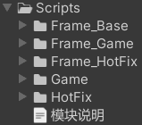
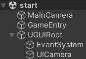
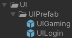

**<center><BBBG>UnityGameFramework分析</BBBG></center>**

<!-- TOC -->

- [简述](#简述)
- [框架](#框架)
  - [GameEntry](#gameentry)
  - [mFrameworkAOT](#mframeworkaot)
  - [mFrameworkHotFix](#mframeworkhotfix)
  - [启动流程](#启动流程)
    - [GameSceneManager](#gamescenemanager)
    - [HybridCLRSystem](#hybridclrsystem)
    - [整体流程](#整体流程)
  - [总结](#总结)

<!-- /TOC -->

# 简述

对于该框架，简单看一下项目目录即可知道其复杂度
整体来说是非常复杂的，包括热更/混淆代码/HybridCLR等各种技术
其**代码目录结构**如下：

**模块说明中提到：**

- Frame_Base是项目的最基层，与项目无关，是一些宏和仅编辑器代码
- Frame_Game/Frame_HotFix是更高一层，是项目相关内容
- Game/HotFix是应用层内容
- HotFix代表着可热更
- 依赖关系有：
  - Frame_Base->Frame_Game->Game->HotFix
  - Frame_Base->Frame_HotFix->HotFix

可以看到该框架完全由asmdef完成，没有将Frame部分分层到dll中

# 框架

从上述简述我们也能够了解到其结构
根据示例项目start：

即：<B><VT>项目只有唯一入口<GN>GameEntryDerived</GN></VT></B>
也就是说该项目做到了唯一入口，显然这是很好的一件事<VT>(只是一定需要添加UGUIRoot，作为UI部分)</VT>

## GameEntry

先看一下GameEntry的继承链：
`public class GameEntryDerived : GameEntry`
`public class GameEntry : MonoBehaviour`
这其实是显而易见的一条继承链
**GameEntry**是实现的核心，其中**生命周期**是最关键的：

``` csharp
protected static GameEntry mInstance;
public FramworkParam mFramworkParam;
protected IFramework mFrameworkAOT;
protected IFramework mFrameworkHotFix;

public virtual void Awake()
{
  mInstance = this;
  ServicePointManager.DefaultConnectionLimit = 200;
  Screen.sleepTimeout = SleepTimeout.NeverSleep;
  // 每当Transform组件更改时是否自动将变换更改与物理系统同步
  Physics.simulationMode = SimulationMode.Script;
  Physics.autoSyncTransforms = true;
  AppDomain.CurrentDomain.UnhandledException += unhandledException;
  setMainThreadID(Thread.CurrentThread.ManagedThreadId);
  dumpSystem();

  WINDOW_MODE fullScreen = mFramworkParam.mWindowMode;
  if (isEditor())
  {
    // 编辑器下固定全屏
    fullScreen = WINDOW_MODE.FULL_SCREEN;
  }
  else if (isWindows())
  {
    // windows下读取配置
    //// 设置为无边框窗口,只在Windows平台使用,由于无边框的需求非常少,所以此处不再实现,如有需求
    //if (fullScreen == WINDOW_MODE.NO_BOARD_WINDOW)
    //{
    //  // 无边框的设置有时候会失效,并且同样的设置,如果上一次设置失效后,即便恢复设置也同样会失效,也就是说本次的是否生效与上一次的结果有关
    //  // 当设置失效后,可以使用添加启动参数-popupwindow来实现无边框
    //  long curStyle = User32.GetWindowLong(User32.GetForegroundWindow(), GWL_STYLE);
    //  curStyle &= ~WS_BORDER;
    //  curStyle &= ~WS_DLGFRAME;
    //  User32.SetWindowLong(User32.GetForegroundWindow(), GWL_STYLE, curStyle);
    //}
  }
  else if (isAndroid() || isIOS())
  {
    // 移动平台下固定为全屏
    fullScreen = WINDOW_MODE.FULL_SCREEN;
  }
  else if (isWebGL())
  {
    fullScreen = WINDOW_MODE.FULL_SCREEN;
  }
  else if (isWeiXin())
  {
    fullScreen = WINDOW_MODE.FULL_SCREEN;
  }
  Vector2 windowSize;
  if (fullScreen == WINDOW_MODE.FULL_SCREEN)
  {
    windowSize.x = Screen.width;
    windowSize.y = Screen.height;
  }
  else
  {
    windowSize.x = mFramworkParam.mScreenWidth;
    windowSize.y = mFramworkParam.mScreenHeight;
  }
  bool fullMode = fullScreen == WINDOW_MODE.FULL_SCREEN || fullScreen == WINDOW_MODE.FULL_SCREEN_CUSTOM_RESOLUTION;
  setScreenSizeBase(new((int)windowSize.x, (int)windowSize.y), fullMode);
}
public void Update()
{
  try
  {
    mFrameworkAOT?.update(Time.deltaTime);
    mFrameworkHotFix?.update(Time.deltaTime);
  }
  catch (Exception e)
  {
    logExceptionBase(e);
  }
}
public void FixedUpdate()
{
  try
  {
    mFrameworkAOT?.fixedUpdate(Time.fixedDeltaTime);
    mFrameworkHotFix?.fixedUpdate(Time.fixedDeltaTime);
  }
  catch (Exception e)
  {
    logExceptionBase(e);
  }
}
public void LateUpdate()
{
  try
  {
    mFrameworkAOT?.lateUpdate(Time.deltaTime);
    mFrameworkHotFix?.lateUpdate(Time.deltaTime);
  }
  catch (Exception e)
  {
    logExceptionBase(e);
  }
}
public void OnDrawGizmos()
{
  try
  {
    mFrameworkAOT?.drawGizmos();
    mFrameworkHotFix?.drawGizmos();
  }
  catch (Exception e)
  {
    logExceptionBase(e);
  }
}
public void OnApplicationFocus(bool focus)
{
  mFrameworkAOT?.onApplicationFocus(focus);
  mFrameworkHotFix?.onApplicationFocus(focus);
}
public void OnApplicationQuit()
{
  mFrameworkAOT?.onApplicationQuit();
  mFrameworkHotFix?.onApplicationQuit();
  mFrameworkAOT = null;
  mFrameworkHotFix = null;
  logBase("程序退出完毕!");
}
protected void OnDestroy()
{
  AppDomain.CurrentDomain.UnhandledException -= unhandledException;
}
```

可以大致了解到：

- mFramworkParam即<B><GN>FramworkParam</GN></B>，是一组<B><VT>控制框架配置的设置</VT></B>，如帧率，窗口类型
  Awake中会用部分参数进行初始化设置操作
- mFrameworkAOT/mFrameworkHotFix是框架的实现核心，是两个IFramework，显然一个是Base部分，一个是HotFix部分
  具体的执行则都是通过它们来完成的

除了生命周期，GameEntry还提供了一些**函数**，这是通过<B><VT>单例</VT></B>完成的：

``` csharp
public static GameEntry getInstance() { return mInstance; }
public static GameObject getInstanceObject() { return mInstance.gameObject; }
```

再来看一下**派生类GameEntryDerived**，它复写了Awake：

``` csharp
public override void Awake()
{
  base.Awake();
  Game framework = new();
  framework.init();
  setFrameworkAOT(framework);
}

// GameEntry
public void setFrameworkAOT(IFramework framework) { mFrameworkAOT = framework; }
```

由此可知：
**<VT>Game是AOT情况的IFramework，同时HotFix情况的IFramework并没有一开始设置(按需创建)</VT>**

<BR>

## mFrameworkAOT

由上述分析可知，Game则是mFrameworkAOT
<B><GN>Game</GN></B>的**继承链**如下所示：
`public class Game : GameFramework`
`public class GameFramework : IFramework`
**GameFramework**内容不多，内容有二：

- FrameSystem注册
- 生命周期函数流程编写

**FrameSystem**即Manager或System，也就是功能部分，GameFramework就是通过这种方式增加功能组件的，其函数为`registeFrameSystem`：

``` csharp
protected T registeFrameSystem<T>(Action<T> callback) where T : FrameSystem, new()
{
  logBase("注册系统:" + typeof(T) + ", owner:" + GetType());
  T com = new();
  string name = typeof(T).ToString();
  mFrameComponentList.Add(com); // 存储
  mFrameCallbackList.Add(name, (com) => { callback?.Invoke(com as T); }); // 设置回调保存
  callback?.Invoke(com); // 设置
  return com;
}
```

对于GameFramework，进行了以下系统的注册：

``` csharp
registeFrameSystem<AndroidPluginManager>(null);
registeFrameSystem<AndroidAssetLoader>(null);
registeFrameSystem<AndroidMainClass>(null);

registeFrameSystem<GameSceneManager>((com) => { mGameSceneManager = com; });
registeFrameSystem<LayoutManager>((com) => { mLayoutManager = com; });
registeFrameSystem<ResourceManager>((com) => { mResourceManager = com; });
registeFrameSystem<AssetVersionSystem>((com) => { mAssetVersionSystem = com; });
```

**<BL>问题：mGameSceneManager之类的并没有声明，怎么使用的</BL>**
<BL>看似没有在类中声明，但在using语句中有：`using static FrameBase;`，而这些Manager/System则是FrameBase类中的static字段</BL>

流程上来说，更重要的是**生命周期函数**：
**init**
init是`GameEntryDerived.Awake()`会进行的操作，这里结合上Game扩展的来看：

``` csharp
// Game
public override void init()
{
  mOnInitFrameSystem += gameInitFrameSystem;
  mOnRegisteStuff += gameRegiste;
  // 这里填写自己的安卓插件包名
  mOnPackageName += () => { return ANDROID_PLUGIN_BUNDLE_NAME; };

  base.init();
  // 编辑器中或者非热更版就强制从StreamingAssets中读取资源
  if (!isHotFixEnable() || isEditor())
  {
    mAssetVersionSystem.setAssetReadPath(ASSET_READ_PATH.STREAMING_ASSETS_ONLY);
  }
  else
  {
    mAssetVersionSystem.setAssetReadPath(ASSET_READ_PATH.SAME_TO_REMOTE);
  }
  mGameSceneManager.enterScene<LaunchScene>();
}

// GameFramework
public virtual void init()
{
  registeFrameSystem<AndroidPluginManager>(null);
  registeFrameSystem<AndroidAssetLoader>(null);
  registeFrameSystem<AndroidMainClass>(null);
  AndroidPluginManager.initAnroidPlugin(mOnPackageName?.Invoke());
  AndroidAssetLoader.initJava(AndroidPluginManager.getPackageName() + ".AssetLoader");
  AndroidMainClass.initJava(AndroidPluginManager.getPackageName() + ".MainClass");
  logBase("start game!");
  try
  {
    DateTime startTime = DateTime.Now;
    initFrameSystem();
    AndroidMainClass.gameStart();
    logBase("start消耗时间:" + (int)(DateTime.Now - startTime).TotalMilliseconds);
    mOnRegisteStuff?.Invoke();
    foreach (FrameSystem frame in mFrameComponentList)
    {
      try
      {
        DateTime start = DateTime.Now;
        frame.init();
        logBase(frame.getName() + "初始化消耗时间:" + (int)(DateTime.Now - start).TotalMilliseconds);
      }
      catch (Exception e)
      {
        logExceptionBase(e, "init failed! :" + frame.getName());
      }
    }
  }
  catch (Exception e)
  {
    logExceptionBase(e, "init failed! " + (e.InnerException?.Message ?? "empty"));
  }
}
protected void initFrameSystem()
{
  registeFrameSystem<GameSceneManager>((com) => { mGameSceneManager = com; });
  registeFrameSystem<LayoutManager>((com) => { mLayoutManager = com; });
  registeFrameSystem<ResourceManager>((com) => { mResourceManager = com; });
  registeFrameSystem<AssetVersionSystem>((com) => { mAssetVersionSystem = com; });
  mOnInitFrameSystem?.Invoke();
}
```

整体来说，当然就是Base部分的初始化流程，看得出来，Base部分有的系统就是以上7种，每个部分都有自己所需进行的初始化操作，而同一的就是执行各自`init()`
**最值得注意的操作**则是：
`mGameSceneManager.enterScene<LaunchScene>();`<B><VT>场景启动</VT></B>

**update/onApplicationQuit**
两者同样进行了扩展，但内容本质上很简单，即执行各系统的`update()`/`willDestroy()`/`destroy()`：

``` csharp
public void update(float elapsedTime)
{
  if (mFrameComponentList == null)
  {
    return;
  }
  int count = mFrameComponentList.Count;
  for (int i = 0; i < count; ++i)
  {
    // 因为在更新过程中也可能销毁所有组件,所以需要每次循环都要判断
    if (mFrameComponentList == null)
    {
      return;
    }
    mFrameComponentList[i]?.update(elapsedTime);
  }
}

public void onApplicationQuit()
{
  destroy();
}
public void destroy()
{
  logBase("destroy GameFramework NoHotFix");
  if (mFrameComponentList == null)
  {
    return;
  }
  mOnDestroy?.Invoke();
  foreach (FrameSystem frame in mFrameComponentList)
  {
    frame?.willDestroy();
  }
  foreach (FrameSystem frame in mFrameComponentList)
  {
    if (frame != null)
    {
      frame.destroy();
      mFrameCallbackList.Remove(frame.getName(), out var callback);
      callback?.Invoke(null);
    }
  }
  mFrameComponentList.Clear();
  mFrameComponentList = null;
}
```

所以看起来该框架虽然复杂，但也是因为各种额外功能(如热更)导致的，本质上框架本身其实是比较简单的

<BR>

## mFrameworkHotFix

mFrameworkHotFix会是重头戏，
首先就是因为它牵扯上了热更，流程上肯定是更加复杂的，
同时，在前面依旧讲述过的GameEntryDerived中，并没有进行`setFrameworkHotFix()`以进行mFrameworkHotFix的设置
但事实上`setFrameworkHotFix()`是有进行的，从调用链来看：
GameHotFix类的基类GameHotFixBase具有`start()`，其中有`GameFrameworkHotFix.startHotFix(()=>...)`，该函数则是关键：

``` csharp
public static void startHotFix(Action callback)
{
  GameFrameworkHotFix framework = new();
  GameEntry.getInstance().setFrameworkHotFix(framework);
  framework.init(callback);
}
```

可以发现这流程与GameEntryDerived中的Awake极其相似，其实就是一个简单的**创建+init**而已
由此我们也可以知道<B><VT>mFrameworkHotFix所对应的IFramework为GameFrameworkHotFix</VT></B>

**<BL>问题：GameHotFix是何时执行的这一系列操作</BL>**
<BL>如果查看函数调用，会发现根本找不到调用处，这其实能够说明<B><VT>调用是利用反射完成的</VT></B>
通过<B>断点</B>的方式，我们可以看到在示例流程中是如何进入的：
细节很多，但简单来说就是由`mGameSceneManager.enterScene<LaunchScene>()`开始场景加载流程，在完成后会由`HybridCLRSystem.launchHotFix()`启动热更</BL>

**<GN>GameHotFix</GN>**
GameHotFix是一套<B><VT>管理GameFrameworkHotFix基本流程</VT></B>的类
其**声明**为：
`public class GameHotFix : GameHotFixBase`
同样的，核心流程在GameHotFixBase中，操作仅有2个：

- `start()`
- `prestart()`

两者都会由**反射**进行调用执行，
在其中也能看到熟悉的**FrameSystem注册流程**：

``` csharp
// GameHotFix
protected override void initFrameSystem()
{
  registeFrameSystem<NetManager>((com) => { mNetManager = com; });
  registeFrameSystem<DemoSystem>((com) => { mDemoSystem = com; });
  registeFrameSystem<BattleSystem>((com) => { mBattleSystem = com; });
}

// GameHotFixBase
public void start(Action callback)
{
  GameFrameworkHotFix.startHotFix(() =>
  {
    // ...
    initFrameSystem();
    // ...

    mExcelManager.loadAllAsync(() =>
    {
      foreach (FrameSystem frame in mFrameComponentInit)
      {
        try
        {
          DateTime start = DateTime.Now;
          frame.init();
          log(frame.getName() + "初始化消耗时间:" + (int)(DateTime.Now - start).TotalMilliseconds + "毫秒");
        }
        catch (Exception e)
        {
          logError("init failed! :" + frame.getName() + ", info:" + e.Message + ", stack:" + e.StackTrace);
        }
      }
      foreach (FrameSystem frame in mFrameComponentInit)
      {
        try
        {
          DateTime start = DateTime.Now;
          frame.lateInit();
          log(frame.getName() + " late初始化消耗时间:" + (int)(DateTime.Now - start).TotalMilliseconds + "毫秒");
        }
        catch (Exception e)
        {
          logError("late init failed! :" + frame.getName() + ", info:" + e.Message + ", stack:" + e.StackTrace);
        }
      }
      onPostInit();
      log("启动游戏耗时:" + (int)(DateTime.Now - mGameFrameworkHotFix.getStartTime()).TotalMilliseconds + "毫秒");
      if (mCanCallback)
      {
        mFinishCallback?.Invoke();
      }
      // 进入主场景
      enterScene(getStartGameSceneType());
    });
  });
}

protected void registeFrameSystem<T>(Action<T> callback) where T : FrameSystem, new()
{
  mFrameComponentInit.Add(mGameFrameworkHotFix.registeFrameSystem(callback));
}
```

可以看到一点两者所做的操作是极为类似的，但**流程**上有很大的**不同**
在HotFix中，对应的几个系统则就是：

``` csharp
registeFrameSystem<NetManager>((com) => { mNetManager = com; });
registeFrameSystem<DemoSystem>((com) => { mDemoSystem = com; });
registeFrameSystem<BattleSystem>((com) => { mBattleSystem = com; });
```

**<GN>GameFrameworkHotFix</GN>**
GameFrameworkHotFix才是真正的IFramework，当然这与Game是非常类似的，具有一系列生命周期函数
重要的是这里具有真正的`registeFrameSystem()`：

``` csharp
public T registeFrameSystem<T>(Action<T> callback, int initOrder = -1, int updateOrder = -1, int destroyOrder = -1) where T : FrameSystem, new()
{
  Type type = typeof(T);
  log("注册系统:" + type.ToString() + ", owner:" + GetType());
  T com = new();
  string name = type.Assembly.FullName.rangeToFirst(',') + "_" + type.ToString();
  com.setName(name);
  com.setInitOrder(initOrder == -1 ? mFrameComponentMap.Count : initOrder);
  com.setUpdateOrder(updateOrder == -1 ? mFrameComponentMap.Count : updateOrder);
  com.setDestroyOrder(destroyOrder == -1 ? mFrameComponentMap.Count : destroyOrder);
  mFrameComponentMap.Add(name, com);
  mFrameComponentInit.Add(com);
  mFrameComponentUpdate.Add(com);
  mFrameComponentDestroy.Add(com);
  mFrameCallbackList.Add(name, (com) => { callback?.Invoke(com as T); });
  callback?.Invoke(com);
  return com;
}
```

更重要的是：在`framework.init()`中，注册的系统远不止前面的3种：

``` csharp
protected void init(Action callback)
{
  // ...
  registeFrameSystem<AndroidPluginManager>(null);
  registeFrameSystem<AndroidAssetLoader>(null);
  registeFrameSystem<AndroidMainClass>(null);
  try
  {
    // ...
    initFrameSystem();
    // ...
  }
  // ...

  preInitAsync(() =>
  {
    int initedCount = 0;
    foreach (FrameSystem item in mFrameComponentInit)
    {
      item.initAsync(() =>
      {
        if (++initedCount == mFrameComponentInit.count())
        {
          resourceAvailable();
          callback?.Invoke();
        }
      });
    }
  });
}

protected void initFrameSystem()
{
  registeFrameSystem<ResourceManager>((com) => { mResourceManager = com; },  -1, 3000, 3000); // 资源管理器的需要最先初始化,并且是最后被销毁,作为最后的资源清理
  registeFrameSystem<TimeManager>((com) => { mTimeManager = com; });
  registeFrameSystem<GlobalCmdReceiver>((com) => { mGlobalCmdReceiver = com; });
  registeFrameSystem<SQLiteManager>((com) => { mSQLiteManager = com; });
  registeFrameSystem<CommandSystem>((com) => { mCommandSystem = com; }, -1, -1, 2001); // 命令系统在大部分管理器都销毁完毕后再销毁
  registeFrameSystem<InputSystem>((com) => { mInputSystem = com; });                           // 输入系统应该早点更新,需要更新输入的状态,以便后续的系统组件中使用
  registeFrameSystem<KeyMappingSystem>((com) => { mKeyMappingSystem = com; });                      // 输入映射系统需要在输入系统之后
  registeFrameSystem<GlobalTouchSystem>((com) => { mGlobalTouchSystem = com; });
  registeFrameSystem<TweenerManager>((com) => { mTweenerManager = com; });
  registeFrameSystem<CharacterManager>((com) => { mCharacterManager = com; });
  registeFrameSystem<AudioManager>((com) => { mAudioManager = com; });
  registeFrameSystem<GameSceneManager>((com) => { mGameSceneManager = com; }, -1, -1, 0); // 在退出程序时,需要先执行流程的退出,然后才能执行其他系统的销毁
  registeFrameSystem<KeyFrameManager>((com) => { mKeyFrameManager = com; });
  registeFrameSystem<DllImportSystem>((com) => { mDllImportSystem = com; });
  registeFrameSystem<ShaderManager>((com) => { mShaderManager = com; });
  registeFrameSystem<CameraManager>((com) => { mCameraManager = com; });
  registeFrameSystem<SceneSystem>((com) => { mSceneSystem = com; });
  registeFrameSystem<GamePluginManager>((com) => { mGamePluginManager = com; });
  registeFrameSystem<ClassPool>((com) => { mClassPool = com; }, -1, -1, 3101);
  registeFrameSystem<ClassPoolThread>((com) => { mClassPoolThread = com; }, -1, -1, 3102);
  registeFrameSystem<ListPool>((com) => { mListPool = com; }, -1, -1, 3103);
  registeFrameSystem<ListPoolThread>((com) => { mListPoolThread = com; }, -1, -1, 3104);
  registeFrameSystem<HashSetPool>((com) => { mHashSetPool = com; }, -1, -1, 3104);
  registeFrameSystem<HashSetPoolThread>((com) => { mHashSetPoolThread = com; }, -1, -1, 3105);
  registeFrameSystem<DictionaryPool>((com) => { mDictionaryPool = com; }, -1, -1, 3106);
  registeFrameSystem<DictionaryPoolThread>((com) => { mDictionaryPoolThread = com; }, -1, -1, 3107);
  registeFrameSystem<ArrayPool>((com) => { mArrayPool = com; }, -1, -1, 3108);
  registeFrameSystem<ArrayPoolThread>((com) => { mArrayPoolThread = com; }, -1, -1, 3109);
  registeFrameSystem<ByteArrayPool>((com) => { mByteArrayPool = com; }, -1, -1, 3110);
  registeFrameSystem<ByteArrayPoolThread>((com) => { mByteArrayPoolThread = com; }, -1, -1, 3111);
  registeFrameSystem<MovableObjectManager>((com) => { mMovableObjectManager = com; });
  registeFrameSystem<EffectManager>((com) => { mEffectManager = com; });
  registeFrameSystem<AtlasManager>((com) => { mAtlasManager = com; });
  registeFrameSystem<NetPacketFactory>((com) => { mNetPacketFactory = com; });
  registeFrameSystem<PathKeyframeManager>((com) => { mPathKeyframeManager = com; });
  registeFrameSystem<EventSystem>((com) => { mEventSystem = com; });
  registeFrameSystem<StateManager>((com) => { mStateManager = com; });
  registeFrameSystem<NetPacketTypeManager>((com) => { mNetPacketTypeManager = com; });
  registeFrameSystem<GameObjectPool>((com) => { mGameObjectPool = com; });
  registeFrameSystem<ExcelManager>((com) => { mExcelManager = com; });
  registeFrameSystem<RedPointSystem>((com) => { mRedPointSystem = com; });
  registeFrameSystem<AssetVersionSystem>((com) => { mAssetVersionSystem = com; });
  registeFrameSystem<GlobalKeyProcess>((com) => { mGlobalKeyProcess = com; });
  registeFrameSystem<LocalizationManager>((com) => { mLocalizationManager = com; });
  registeFrameSystem<AsyncTaskGroupManager>((com) => { mAsyncTaskGroupManager = com; });
  registeFrameSystem<GoogleLogin>((com) => { mGoogleLogin = com; });
  registeFrameSystem<AppleLogin>((com) => { mAppleLogin = com; });
  registeFrameSystem<ScreenOrientationSystem>((com) => { mScreenOrientationSystem = com; });
  registeFrameSystem<WaitingManager>((com) => { mWaitingManager = com; });
  registeFrameSystem<UndoManager>((com) => { mUndoManager = com; });
  registeFrameSystem<AndroidPurchasing>((com) => { mAndroidPurchasing = com; });
  registeFrameSystem<PurchasingSystem>((com) => { mPurchasingSystem = com; });
  registeFrameSystem<AvatarRenderer>((com) => { mAvatarRenderer = com; });
  registeFrameSystem<LayoutManager>((com) => { mLayoutManager = com; }, 1000, 1000, -1); // 布局管理器也需要在最后更新,确保所有游戏逻辑都更新完毕后,再更新界面
  registeFrameSystem<PrefabPoolManager>((com) => { mPrefabPoolManager = com; }, 2000, 2000, 2000); // 物体管理器最后注册,销毁所有缓存的资源对象
}
```

由此可见项目的复杂性(功能齐全)

## 启动流程

上述只是简单地讲述了一下AOTFramework与HotFixFramework的内容，基础内容其实算是比较简单的，也就是**设置以及系统的生命周期函数框架编写**
同时AOTFramework是一条很明确的流程链，由GameEntryDerived可一路完成初始化以及生命周期函数设置，
**但HotFixFramework却比较难理解**，在前面了解到有一明确的入口：
`mGameSceneManager.enterScene<LaunchScene>()`

### GameSceneManager

可以看到<B><GN>GameSceneManager</GN></B>会是一重要的起始点
其**声明**如下：
`public class GameSceneManager : FrameSystem`
**FrameSystem**也就是所谓的系统，需要具有一定的生命周期函数，有：

``` csharp
public class FrameSystem
{
  public virtual void init() { }
  public virtual void update(float elapsedTime) { }
  public virtual void willDestroy() { }
  public virtual void destroy(){}
  public string getName() { return GetType().ToString(); }
}
```

观察GameSceneManager，看似好像极其简单，<B><VT>仅管理了一个GameScene</VT></B>
我们所关注的是`enterScene()`：

``` csharp
public void enterScene<T>() where T : GameScene, new()
{
  if (mCurScene != null)
  {
    return;
  }
  mCurScene = new T();
  mCurScene.init();
}
```

可以认为这就是**mCurScene的初始化操作**，结合前面调用，初始Scene为<B><GN>LaunchScene</GN></B>
LaunchScene的**声明**如下所示：
`public class LaunchScene : GameScene`
**GameScene**则是核心逻辑部分，`mCurScene.init()`执行内容如下：

``` csharp
public virtual void init()
{
  // 创建出所有的场景流程
  createSceneProcedure();
  // 设置起始流程名
  assignStartExitProcedure();
  // 开始执行起始流程
  enterStartProcedure();
}

// LaunchScene覆写
public override void createSceneProcedure()
{
  addProcedure<LaunchSceneVersion>();
  addProcedure<LaunchSceneFileList>();
  addProcedure<LaunchSceneDownload>();
  addProcedure<LaunchSceneExit>();
}
public override void assignStartExitProcedure()
{
  mStartProcedure = typeof(LaunchSceneVersion);
  mExitProcedure = typeof(LaunchSceneExit);
}
// GameScene原生逻辑
public void enterStartProcedure()
{
  changeProcedure(mStartProcedure);
}
public bool changeProcedure(Type procedureType)
{
  // 不能重复进入同一流程
  if (mCurProcedure != null && mCurProcedure.GetType() == procedureType)
  {
    return false;
  }
  if (!mSceneProcedureList.TryGetValue(procedureType, out SceneProcedure targetProcedure))
  {
    logErrorBase("can not find scene procedure : " + procedureType);
    return false;
  }
  logBase("enter procedure:" + procedureType);
  if (mCurProcedure == null || mCurProcedure.GetType() != procedureType)
  {
    // 如果当前已经在一个流程中了,则要先退出当前流程,但是不要销毁流程
    // 需要找到共同的父节点,退到该父节点时则不再退出
    mCurProcedure?.exit();
    mCurProcedure = targetProcedure;
    mCurProcedure.init();
  }
  return true;
}

public T addProcedure<T>() where T : SceneProcedure, new()
{
  return mSceneProcedureList.add(typeof(T), new T()) as T;
}
```

可以看到：

- `createSceneProcedure()`/`assignStartExitProcedure()`是在设置与添加Procedure
- `enterStartProcedure()`类似一个状态机，会不断切换状态
  会发现，对于mStartProcedure来说，没有exit只有init，对于mExitProcedure来说，没有init只有exit

也就是说：<B><VT>GameScene是以状态机的形式运行的，启动时会执行相应mStartProcedure，退出时会执行相应mExitProcedure，在Procedure中会有其它`changeProcedure()`以进行状态切换</VT></B>

了解一下**SceneProcedure**：

``` csharp
public abstract class SceneProcedure
{
  public virtual void init(){}
  public virtual void update(float elapsedTime){}
  public virtual void exit(){}
  public virtual void willDestroy(){}
}
```

即熟悉的几种生命周期函数

**依次检查LaunchScene的几个Procedure：**

**LaunchSceneVersion**由名字可以了解到这应该是一个与<B><VT>版本有关</VT></B>的流程

``` csharp
public class LaunchSceneVersion : SceneProcedure
{
  protected bool mRemoteDone;
  protected bool mStreamingDone;
  protected bool mPersistDone;
  public override void init()
  {
    CmdLayoutManagerLoad.execute(typeof(UIDemo), 0);

    bool enableHotFix = true;
    if (isEditor() || !enableHotFix)
    {
      mAssetVersionSystem.setStreamingAssetsVersion(null);
      mGameSceneManager.getCurScene().changeProcedure<LaunchSceneDownload>();
      return;
    }
    // 正在检查版本号
    //mUIDownload.setDownloadInfo("正在检查版本号...");
    doGetRemoteVersion();
    ObsSystem.downloadTxt(/*getRemoteFolder("") +*/ VERSION, (string version) =>
    {
      mAssetVersionSystem.setRemoteVersion(version);
      mRemoteDone = true;
    });
    openTxtFileAsync(F_ASSET_BUNDLE_PATH + VERSION, !isEditor(), (string version) =>
    {
      mAssetVersionSystem.setStreamingAssetsVersion(version);
      mStreamingDone = true;
    });
    openTxtFileAsync(F_PERSISTENT_ASSETS_PATH + VERSION, false, (string version) =>
    {
      mAssetVersionSystem.setPersistentDataVersion(version);
      mPersistDone = true;
    });
  }
  public override void update(float elapsedTime)
  {
    base.update(elapsedTime);
    if (mRemoteDone && mStreamingDone && mPersistDone)
    {
      logBase("StreamingVersion:" + mAssetVersionSystem.getStreamingAssetsVersion() + 
          ", PersistVersion:" + mAssetVersionSystem.getPersistentDataVersion() + 
          ", RemoteVersion:" + mAssetVersionSystem.getRemoteVersion());
      // 需要设置自己的远端下载路径
      //mResourceManager.setDownloadURL(OBS_URL + getRemoteFolder(mAssetVersionSystem.getRemoteVersion()));
      FrameCrossParam.mDownloadURL = mResourceManager.getDownloadURL();
      mGameSceneManager.getCurScene().changeProcedure<LaunchSceneFileList>();
    }
  }
  protected void doGetRemoteVersion()
  {
    ObsSystem.downloadTxt(/*getRemoteFolder("") +*/ VERSION, (string version) =>
    {
      if (version.isEmpty())
      {
        // 可选弹窗提示是否重试
        //dialogYesNoResource("无法获取到远端服务器,是否重试?", (bool ok) =>
        //{
        //  if (ok)
        //  {
        //    doGetRemoteVersion();
        //  }
        //  else
        //  {
        //    stopApplication();
        //  }
        //});
        return;
      }
      mAssetVersionSystem.setRemoteVersion(version);
      mRemoteDone = true;
    });
  }
}
```

可以看到在`init()`中可能发生`mGameSceneManager.getCurScene().changeProcedure<LaunchSceneDownload>()`，但这是在编辑器或非热更情况下的，并非一般情况则需要通过`update()`完成，即完成mRemoteDone/mStreamingDone/mPersistDone三者的任务
对比可以发现两者进入的Procedure并不相同：

- 对于一般情况：需要先进入**LaunchSceneFileList**，在等待CheckFileList完成后会进入**LaunchSceneDownload**
- 对于编辑器或非热更情况：则直接进入**LaunchSceneDownload**

可以了解到：<B><VT>整体几个Procedure显然都是为了下载场景资源而存在的</VT></B>
这里我们看一下**重点**：<B><BL>启动流程为什么会进行Hotfix初始化</BL></B>
<BL>在LaunchScene流程完成，即调用`onDownloadProgress()`时，最终会调用`LaunchSceneDownload.launch()`：</BL>

``` csharp
protected void onDownloadProgress(float progress, PROGRESS_TYPE type, string info, int bytesPerSecond, int downloadRemainSeconds)
{
  //mUIDownload.setProgress(progress);
  if (type == PROGRESS_TYPE.DELETE_FILE)
  {
    //mUIDownload.setDownloadInfo("正在删除无用文件");
  }
  else if (type == PROGRESS_TYPE.DOWNLOAD_RESOURCE)
  {
    //mUIDownload.setDownloadInfo("正在下载资源", false);
  }
  else if (type == PROGRESS_TYPE.FINISH)
  {
    //mUIDownload.setDownloadInfo("更新完毕,即将进入游戏...");
    checkNeedCopySecret(launch);
  }
}

protected void launch()
{
  HybridCLRSystem.launchHotFix(getAESKeyBytes(), getAESIVBytes(),
    // 下载或者加载程序集
    (string fileName, BytesIntCallback callback) =>
    {
      // webgl下只能从远端下载资源
      if (isWebGL())
      {
        // 这里需要根据版本号自己构造出一个远端下载路径
        ObsSystem.downloadBytes(/*getRemoteFolder(mAssetVersionSystem.getRemoteVersion()) +*/ fileName, callback);
      }
      else
      {
        openFileAsync(availableReadPath(fileName), true, (byte[] bytes) => { callback?.Invoke(bytes, bytes.Length); });
      }
    },
    onLaunchError);
}
```

也就是说：
**<VT>在GameSceneManager流程完成后，会立刻进入到HybridCLRSystem的流程中进行热更流程</VT>**

<BR>

### HybridCLRSystem

HybridCLR是一项热更的技术，这里就是借助该插件进行扩展热更功能
上文中调用的`launchHotFix()`就是HybridCLRSystem的核心也是唯一的公开静态函数：

``` csharp
public static void launchHotFix(byte[] aesKey, byte[] aesIV, Action<string, BytesIntCallback> openOrDownloadDll, Action errorCallback = null)
{
  if (mHotFixLaunched)
  {
    logErrorBase("已经启动了热更逻辑,无法再次启动");
    return;
  }
  mHotFixLaunched = true;
  try
  {
    // 存储所有需要跨域的参数
    backupFrameParam();
    // 启动热更系统
#if UNITY_EDITOR || !USE_HYBRID_CLR
    launchEditor(errorCallback);
#else
    launchRuntime(aesKey, aesIV, openOrDownloadDll, errorCallback);
#endif
  }
  catch (Exception e)
  {
    logExceptionBase(e);
  }
}
```

可以看到在编辑器下使用的是`launchEditor()`，而在打包情况下使用的是`launchRuntime()`，两者是不同的，这主要是因为：
对于HybridCLR热更来说，本质流程是通过<B><VT>补充元数据后下载并热更程序集</VT></B>来完成的
而<B><VT>在编辑器下，直接从已加载程序集去找即可，无需补充元数据</VT></B>
简单讲述**流程**来说：
<VT>HybridCLRSystem会处理完程序集的问题，随后反射调用`GameHotFixBase.preStart()`/`GameHotFix.createHotFixInstance()`/`GameHotFixBase.start()`</VT>

由此，mFrameworkHotFix就与流程串联上了

<BR>

### 整体流程

目前来说，看似我们对框架已经了解了，但是就以示例来说我们还是具有**疑问**：
<YL>(初始界面UILogin有一个登录按钮/游戏界面UIGaming有一个可操作的cube)</YL>
**<BL>为什么开始界面点击按钮后即可进入游戏界面，以及游戏界面的cube是如何移动的</BL>**
简单来说，以上的问题本质上都是<B><BL>System是如何运作的</BL></B>
以下以**简单了解**进行解答：

**UILogin/UIGaming**都是UI界面，生成涉及大量内容：
首先它们<B><VT>本身就是一个Prefab</VT></B>：
<VT>在GameResources下</VT>
其次，它们都会<B><VT>生成一个继承于LayoutScript的类</VT></B>：UILogin/UIGaming，同时<B><VT>相应内容下都会有自动生成代码</VT></B>
对于UI部分，看起来是非常复杂的
但是从流程上能了解到：
在`GameHotFix.registerAll()`中会进行`LayoutRegisterHotFix.registeAll()`，即注册Layout
前面提到过LaunchScene的流程，真正的Scene加载在MainScene中完成，具体则发生在`GameHotFixBase.Start()`的最后，有`enterScene(getStartGameSceneType())`
MainScene就能看出具体流程以及状态机的作用：

``` csharp
public override void createSceneProcedure()
{
  addProcedure(typeof(MainSceneLoading));
  addProcedure(typeof(MainSceneLogin));
  addProcedure(typeof(MainSceneGaming));
  addProcedure(typeof(MainSceneExit));
}
```

显然除了开始的Loading以及结束的Exit，中间的Procedure每一个都是一个场景，场景的切换就是调用了，
如MainSceneLogin就会在开始和结束进行显隐：

``` csharp
public class MainSceneLogin : SceneProcedure
{
  protected override void onInit(SceneProcedure lastProcedure)
  {
    LT.LOAD_SHOW<UILogin>();
  }
  protected override void onExit(SceneProcedure nextProcedure)
  {
    LT.HIDE<UILogin>();
  }
}
```

切换则是在UILogin中实现：

``` csharp
public override void init()
{
  mLogin.registeCollider(onLoginClick);
}
protected void onLoginClick()
{
  if (mNetManager.isConnected())
  {
    CSLogin.send();
  }
  else
  {
    changeProcedure<MainSceneGaming>();
  }
}
```

<BR>

**Cube的创建**也发生在界面流程中，在MainSceneGaming，也就是UIGaming中有：

``` csharp
protected override void onInit(SceneProcedure lastProcedure)
{
  mPlayer = mCharacterManager.createCharacter<CharacterGame>("test");
  LT.LOAD_SHOW<UIGaming>();
}
```

具体的话则就是CharacterManager的具体流程了

<BR>

## 总结

根据以上框架分析，可以发现虽然该框架看似非常复杂，但是整理一下逻辑的整体是**比较清晰**的
但是可以发现流程上是有**固定性**的：启动流程必然是从GameEntryDerived开始，这是不错的，但是AOTFramework完成后紧接着GameSceneManager，继续完成HybridCLRSystem，最后完成HotFixFramework
这样的流程多多少少有点<B>"死板"</B>，其中一点就是<DRD>无法决定我需要加载哪些System(Manager)，且替换不灵活</DRD>
但是这样也能让我们能够**专注于业务类的编写**，只要了解所需写法，无需考虑过多框架以及功能方面的协调，有就直接用