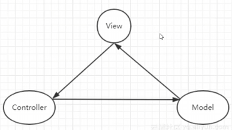
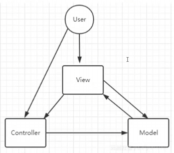
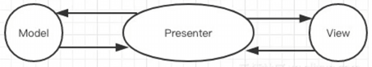
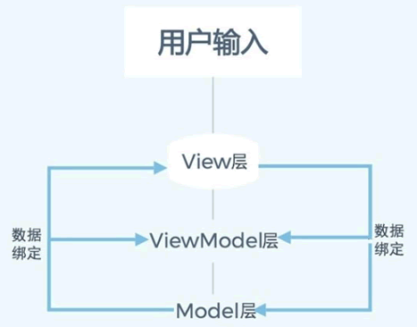

**<center><BBBG>MVX分析</BBBG></center>**

<!-- TOC -->

- [前言](#前言)
- [分析](#分析)
  - [MVC](#mvc)
  - [MVP](#mvp)
  - [MVVM](#mvvm)
  - [扩展](#扩展)
    - [BindableProperty](#bindableproperty)
    - [Command](#command)
- [各框架思路对比](#各框架思路对比)

<!-- /TOC -->
<BR>

**<VT>MVX指的是任意一种MV变体，即MVC/MVP/MVVM中的一种</VT>**
**<VT>后续将C/P/VM三者合并称为X</VT>**

# 前言

无论有没有接触过框架，大名鼎鼎的**MVC**一般来说多多少少都听到过
而**MVP/MVVM**就没那么出名了
无论是MVC还是MVP/MVVM，它们都是<B><GN>UI框架</GN></B>的一种

**简述：**

- **<DRD>个人认为三者仅在特性上存在一定的区别，如何实现是自由的且区别不大的</DRD>**
- 三者的主要目的都是用于分离杂糅代码
- 一开始的MVC/MVP被应用于后端分离，后来逐渐演变到前端(MVC/MVVM)
  **<VT>Tip：在前后端与MVX思想无关，只是自然演变</VT>**
- MVC是最初最传统的思想，而MVP/MVVM是从MVC演变过来的
- MV---Model与View，即数据和视图，本质上三者都是希望**用某种方式Model更新后呈现在View上**
- MVC的C为<B><GN>Controller</GN></B>，C被用来执行M更新代码并用于更新V
- MVP的P为<B><GN>Presenter</GN></B>，P是M/C之间沟通的唯一桥梁
- MVVM的VM为<B><GN>View Model</GN></B>，VM是M的重组，VM收集任意数据，并提供<GN>数据绑定</GN>用于**自动**更新V

# 分析

## MVC

MVC作为最早的版本，所以说架构上会显得"乱"一些，如下图所示：


这两个都是MVC的实现，可以发现**沟通方向**是**不定**的
<B>所以说：<VT>MVC是自由的，任何MVX其实都可以被称为MVC，即MVP/MVVM是MVC的一种变体</VT></B>

Controller是一个<B><VT>用于将Model数据变化更新到View上的一个沟通类</VT></B>：

- Controller可以提供`UpdateView()`更新View
- Controller可以包装Model函数用于控制(执行)

**<YL>随便举个例子就是：</YL>**
<YL>初始`HP=10`，点击Btn后由于监听函数的原因，Controller调用`Damage(10)`更新Model(因为本质上调用的是`_model.TakeDamage(10)`)，同时再次调用`UpdateView()`进行视图更新</YL>

这里比较**关键的点**在于：

``` csharp
// HPController
public void UpdateView()
{
    _hpView.UpdateHPDisplay(_hpModel.CurrentHP, _hpModel.MaxHP);
}

// HPView
public void UpdateHPDisplay(int currentHP, int maxHP)
{
    _lblHP.text = $"HP:{currentHP}/{maxHP}";
}
```

**<BL>问题：为什么View不能自己更新视图，要Controller进行</BL>**
<BL>答案其实很明显，即更新需要提供Model，这就是<B>Controller存在的意义</B>：
<B><VT>Controller获取Model与View，并在内部将Model提供给View<VT></B></BL>

**<DRD>这一思想是MVX的根，不仅仅是MVC</DRD>**

## MVP

MVP也是一个比较老的版本了，是在后端时代由MVC演变过来的
如下图所示：

可以发现MVP就显得**规整**很多，**即：<VT>Model与Presenter可以交换数据，View与Presenter同样可以交换数据，同时也意味着必须通过Presenter才能将Model传输给View</VT>**

Presenter在**思路**上和Controller比是**恰恰相反**的：

- 由于Presenter是"核心"，<B><VT>具有绝对的掌握权</VT></B>
  - Presenter获取View可自行进行Btn绑定
  - Presenter可直接调用Model/View提供的函数(在Btn绑定中调用)

回想Controller，Controller是在提供函数而非执行操作

显然，MVP的代码会<B><GN>更加规整</GN></B>，同时Presenter<B><DRD>承担的职责也更多了，会变得越来越庞大</DRD></B>

## MVVM

MVVM可以说是MVC演变的最终完整体，如下图所示：


<B><GN>数据绑定</GN></B>这一特点代表了MVVM，简单来说就是<VT>ViewModel进行了两侧的绑定，使得我们更新ViewModel的数据从而影响真正的Model，同时View也同步刷新</VT>

VM其它方面和C/P没什么区别，重点还是在于**数据绑定**：
可以说是有<B><VT>四向绑定</VT></B>：

- **Model--->ViewModel (绑定)**
  在Model中添加事件以将Model的变化通知ViewModel
- **ViewModel--->Model (扩展调用)**
  扩展Model操作
- **ViewModel--->View (绑定)**
  由BindableProperty注册的事件触发视图更新
- **View--->ViewModel (按钮绑定)**
  Btn绑定，ViewModel提供操作
<BR>

``` csharp
public class HPModel
{
    private int _currentHP;
    public int CurrentHP
    {
        get { return _currentHP;}
        private set
        {
            _currentHP = value;
            OnHPChanged?.Invoke(value); // Model--->ViewModel
        }
    }
}

public class HPViewModel
{
    public BindableProperty<int> CurrentHP = new BindableProperty<int>();

    public HPViewModel(HPModel model, HPView view)
    {
        _hpModel.OnHPChanged += UpdateHP; // Model--->ViewModel
        CurrentHP.OnValueChanged += UpdateView; // ViewModel--->View
        
        _hpView.OnAttackClicked += OnAttack; // View--->ViewModel
        _hpView.OnHealClicked += OnHeal; // View--->ViewModel

        MaxHP.Value = _hpModel.MaxHP;
        CurrentHP.Value = _hpModel.CurrentHP;
    }

    public void Exit()
    {
        _hpModel.OnHPChanged -= UpdateHP;
        CurrentHP.OnValueChanged -= UpdateView;
        _hpView.OnAttackClicked -= OnAttack;
        _hpView.OnHealClicked -= OnHeal;
    }
    
    private void OnAttack() // ViewModel--->Model
    {
        _hpModel.ChangeHP(-10);
    }
    private void OnHeal() // ViewModel--->Model
    {
        _hpModel.ChangeHP(10);
    }

    private void UpdateHP(int newHP)
    {
        CurrentHP.Value = newHP;
    }

    private void UpdateView(int newHP)
    {
        _hpView.UpdateHPDisplay(newHP, MaxHP.Value);
    }
}
```

## 扩展

MVX本身很简单，就是一个通过X将Model与View分离的框架
但是可扩展点是非常多的，只要原则不变都是可添加进行优化的

### BindableProperty

BindableProperty本身就是一种扩展，实现MVVM最简单的方式应该就是它了

### Command

Command可以说是**最简单最实用**的一种了
其**作用**为<B><VT>封装X的内容</VT></B>

AI提出的扩展点：

- 消息传递机制
  - 事件总线
  - 响应式流集成(RxJS)
  - 领域事件管道
- 数据绑定增强
  - 统一绑定语法
  - 脏检查优化策略
  - 增量更新算法
- 通信协议标准化
- 适配器模式扩展
- 处理管道
- 中间件
  - 验证中间件
  - 日志中间件
  - 缓存中间件
  - 转换中间件
- 代码自动生成
- 通信监控工具/快照/历史回放/因果追踪
- 优化
  - 批量更新
  - 差分传输
  - 预取缓存
  - 懒加载

# 各框架思路对比
