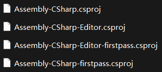

**
<BBBG>Unity程序集</BBBG>
**

<!-- TOC -->

- [Unity程序集](#unity程序集)
- [添加程序集的方法](#添加程序集的方法)
  - [Unity中创建程序集](#unity中创建程序集)
  - [外部程序集](#外部程序集)

<!-- /TOC -->

# Unity程序集

如果观察Unity项目，会发现在根目录下会有这些csproj文件：

其中：

- Assembly-CSharp：项目中的一般脚本，在Assets中
- Assembly-CSharp-Editor：项目中的Editor脚本，在Assets下的Editor文件夹中
- Assembly-CSharp-firstpass：Plugins一般脚本，需在Assets下的Plugins文件夹中
- Assembly-CSharp-Editor-firstpass：PluginsEditor脚本，需在Assets下的Plugins文件夹的Editor文件夹中

也就是说**firstpass**其实就是<B><VT>先编译(高优先级)</VT></B>的含义，非firstpass的可依赖它

**优先级顺序**如下：　　<VT>从先到后</VT>

- Assembly-CSharp-firstpass
  - Assembly-CSharp
  - Assembly-CSharp-Editor-firstpass
    - Assembly-CSharp-Editor

 

# 添加程序集的方法

我们正常写的所有逻辑脚本都会被放在Assembly-CSharp.dll中，为了搭建更有条理的项目，很有可能需要对其进行拆解，有2种方法：

- Unity中创建程序集
- 外部程序集

## Unity中创建程序集

Unity提供了一种创建程序集的方式：
Project右键->Scripting->Assembly Definition
这样就能创建出一个**asmdef文件**
<VT>只需在某文件夹下创建asmdef，即可将文件夹下的所有内容编译成一个新的dll</VT>

## 外部程序集

外部程序集即<B><VT>在C#中编译好dll放到Unity项目中</VT></B>
这样是<B>最原生态(Unity无关)</B>的

**放置位置**有以下几种：

- Assets
- Assets/Editor
- Assets/Plugins
- Assets/Plugins/Editor

显然这就是前面提到的几个位置，它们会像cs文件一样被打到相应dll中